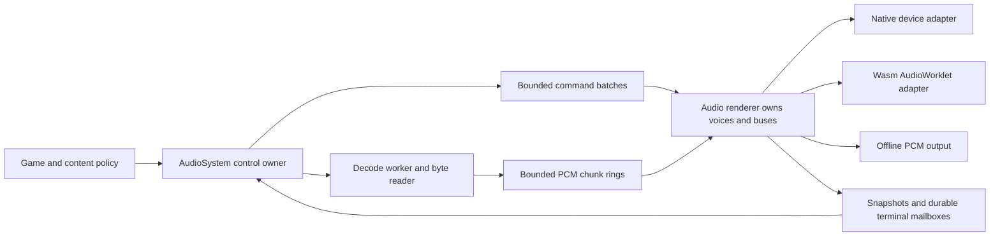

# Ludus audio design

Status: proposed, 2026-10-01. Implementation and all performance/quality gates
are outstanding. [Requirements](requirements.md) define AU01-AU17;
[tasks](tasks.md) define A0-A7. [Research](../../../docs/architecture/audio-research.md)
records the primary sources, private Gems findings and the follow-up review of
Game Audio Programming volumes 1-4. Volume 5 was not consulted.

## 1 Architecture and module boundary

Use one small Ludus mixer. miniaudio supplies native device access and selected
low-level codec/resampler primitives; it does not own another gameplay voice
manager, resource manager or node graph. An Emscripten adapter runs the same
renderer on a Wasm AudioWorklet. Offline output calls the same entry point.

Create `modules/audio/`, following the existing Input/Text module layout, with
target `ludus_audio`, alias/export `Ludus::Audio` and namespace `ludus::audio`.
Public files: `audio_types.h`, `audio_system.h`, `audio_debug.h`. Private files
separate control/admission, mixer, resident voice kernels, bus mix, streaming,
and output adapters. Keep their contracts narrow; do not make a class per DSP
operation or introduce an abstract plugin framework.

Audio depends on Base and Containers. Logging can be used privately by the
control owner; Profiling integration is optional and must be audited. Audio
does not depend on RHI, Input, windowing, ECS or Text. Applications attach audio
to their input/gameplay policies. The renderer can run without a window, device
or worker when tests inject prepared data. No FoundationMemory/job/VFS project
is required: those systems do not exist in the inspected baseline.

Public headers contain plain enums/records, pointer-length views, and a PIMPL
owner using the existing `UniquePtr` convention. No `Array<T>` members, heavy
standard templates/headers, private implementation headers or miniaudio/Web
Audio types in public headers. Make construction fallible through Initialize
or a status-returning factory; audit any UniquePtr/new path before using it.

## 2 Dependency and build integration

Select miniaudio **0.11.23**, the inspected released tag, under its MIT license
option. A0 must acquire exact source bytes, compute SHA-256, record the source
URL/revision/license and enabled options, and make native and web builds use
those same locked bytes. The handoff intentionally supplies no invented hash.
Use the repository's Conan workflow for native acquisition or an explicit
locked source bootstrap if a compatible recipe is unavailable. Web must use
the same source archive/cache. No downloads during ordinary build or configure;
an absent source cache produces actionable offline diagnostics.

Compile third-party implementation once as private C code. Enable C explicitly
in root CMake and prevent C++ warning/exception options leaking onto C targets.
Disable high-level engine, node graph and resource manager; keep WAV and FLAC,
disable MP3 and unneeded features. Web uses decoder/converter code without
miniaudio device I/O or native threading. Verify actual 0.11.23 switches rather
than inventing macro names. Configure supported native backends through the
dependency, leaving Linux PulseAudio/ALSA selection private. No direct PipeWire
claim until a supported pinned backend is demonstrated.

Audit all resampler reset/rate/process calls used in rendering for bounded
work and no allocation. Preinitialize mono/stereo processing state and its
required heap outside rendering; never initialize or destroy it in Play/Stop.
Prefer the dependency's external-heap APIs where supported. Call counts and
input/output bounds must be tested. No infallible container growth for setup
or loading; use Try operations/nothrow storage with rollback.

The static SDK export must include private link dependencies required by
`Ludus::Audio`; PRIVATE linkage does not eliminate static dependency closure.
Install licenses and amend package configuration/manifests appropriately.
SDK consumers need no source-tree headers, dependency internals or network.

## 3 Public operations and ownership

These names describe the intended API; A0 can adjust spelling to existing
conventions while preserving contracts. All real-time submission/query methods
are `noexcept`. Loading and native setup may block the control owner and are
explicit cold operations; web setup/shutdown is asynchronous.

| Operation | Contract |
| --- | --- |
| Initialize(config) | Fallible, allocates fixed runtime storage and prepares adapter. Reports Starting/Ready/Suspended/Disabled/Failed; Ready is not a gesture-unlocked guarantee. |
| PrepareClip(encoded bytes, descriptor, out ClipHandle) | Cold fallible decode/convert into owned finite mono/stereo PCM at session rate. Caller bytes borrowed only during this call. Web offers equivalent async preparation through the worker. |
| PrepareStream(source, descriptor, out StreamHandle) | Opens/validates a seekable reader off rendering, owns source descriptor and worker decoder, prefills chunks; Play requires Ready. No hidden I/O in Play. |
| RetireClip / RetireStream | Close new admission, retain storage for existing reservations/voices/worker jobs. Service reclaims only after acknowledgment. No forced stop unless requested separately. |
| TrySubmitBatch(commands, out voice handles) | Maximum 32 records; copy all records; reserve slots and asset pins transactionally; publish once. Single-command Play/Update helpers use this path. |
| Stop(voice) | Generation-tagged stop mailbox, independent of normal queue room. Fixed default 5 ms fade for audible resident/stream voices; cancel pending starts. Idempotent for a terminal handle still known to the owner. |
| StopAll() | Advance voice cancellation epoch; affects all voices admitted before that call, including queued plays. New plays use the new epoch. Bus/user mix settings remain valid. Never needs queue space. |
| Service() | Main/control owner drains diagnostics, acknowledges terminals, frees retired storage, advances setup/worker/backend lifecycle. No mixer tick and no dependence of output continuity on game FPS. |
| GetState / GetVoiceInfo / GetDebugSnapshot | Owner-owned views: current admission/terminal accounting plus cached renderer details. Distinguish Pending, Scheduled, Mixed, Virtualizing, Virtual, Stopping, Terminal and stale; report snapshot sample frame/age, silence causes and terminal reason. |
| RenderOffline(output, frames) | Explicit Offline mode only. Runs the production render entry serially on caller thread; rejects concurrent device rendering. Frames/output capacity validated. |
| ResumeFromUserGesture() | Browser host invokes directly in a genuine DOM activation handler; schedules resume, returns Pending/result. Synthetic gameplay input is insufficient. |
| BeginShutdown / GetShutdownState | Close admission, quiesce renderer/worker, reclaim after proof. Native may finish synchronously outside callback; browser remains alive until async completion. |

One owner thread makes all public calls. Do not implement implicit thread-safe
facades or an MPSC queue. Jobs/game threads forward requests to that owner.
Thread identifiers need not be queried on every hot call; assert ownership at
cold entry points and cover misuse in development fixtures.

Use an explicit status enum including Ok, Pending, Disabled, Suspended,
NotReady, Unsupported, InvalidArgument, InvalidHandle, QueueFull,
VoiceCapacity, GroupCapacity, StreamCapacity, AssetCapacity, OutOfMemory, DecodeError,
IoError, DeviceError and SequenceExhausted. Return the status alongside the
handle/result; do not overload an invalid handle with every failure reason.
Accepted submission and terminal playback reason are distinct result domains.

Handle types are distinct for clips, streams and voices. Each contains Session,
Slot and Generation (`uint32` fields); zero session/generation is invalid.
Assign process-unique nonzero session IDs at initialization through a cold
counter; never reuse one, even for a different AudioSystem. Reject exhaustion
explicitly. Increment per-slot generations without wrapping; an exhausted slot
is retired until a fresh session. Fabricated/out-of-range/cross-instance/stale
handles cannot index unchecked memory or mutate another playback.

Names, asset hashes and optional numeric gameplay tags are debug metadata owned
by the control owner. Commands contain bounded numeric data and immutable owned
asset references, never an ECS pointer, string view into transient storage,
closure, or caller callback. No gameplay callbacks run on rendering.

Preparation and playback have separate state machines. Preparation is
Preparing -> Ready or Failed; retirement closes admission and moves through
Retiring to Reclaimed only after all owners acknowledge. Play never starts
implicit loading. Publish readiness/error data with the same ownership discipline
as PCM; a late preparation result cannot undo cancellation or retirement.

Voice state transitions are explicit, with the following legal outcomes:

| Current state | Event and next state |
| --- | --- |
| Pending | Consumed Play becomes Scheduled, Mixed or Virtual according to start/selection; cancellation becomes Terminal only after that queued Play is drained. |
| Scheduled | At StartFrame, become Mixed or Virtual; kill policy may become Terminal without output. Stop becomes Terminal after command references are drained. |
| Mixed | Losing selection becomes Virtualizing for advance policy or Stopping for kill policy. Stop becomes Stopping; natural EOF becomes Terminal. |
| Virtualizing | Fade completion becomes Virtual. Reselection may reverse the fade from its current value into Mixed if both group quota and physical capacity permit. Stop becomes Stopping. |
| Virtual | Selection becomes Mixed after bounded history reconstruction and fade-in. Stop/expiry becomes Terminal; no output tail exists. |
| Stopping | Finish the output fade, or reach EOF, then become Terminal. Selection/Update cannot reverse a terminal stop. |
| Terminal | Owner acquires acknowledgment and reclaims; reuse requires a new generation. |

Mixed includes a start/reentry fade-in. Streams use Pending/Scheduled/Mixed/
Stopping/Terminal, with starvation as a separate source condition, never a
virtual state. Stopping and Virtualizing may share ramp code but have different
lifetime semantics. Store the selected variation, initial gain/rate and evolving
parameters once; reentry never rerolls a variation or resets the cursor. Every
state change carries a numeric cause and RenderFrame for inspection and tests.

## 4 Queues and cancellation

Use a private fixed-capacity single-producer/single-consumer ring. Payload bytes
are written before release publication; the consumer acquires publication before
reading. Slots cannot be overwritten until the producer acquires consumer
release. Use lock-free `uint32` atomics, verified on native and wasm. Avoid
atomic `uint64`, hidden lock fallback, CAS retry loops or spinning in rendering.
Bound unsigned distance arithmetic and capacity below half the counter space.
Counter wrap is safe only for queue arithmetic, not identity generations.

The ring holds **512 command records** with explicit batch length/end metadata.
Publish a batch with one release update after writing every record. Reserve
space for the entire batch first; rejected batches leave the queue and asset/
voice accounting unchanged. A render boundary applies at most **64 records**.
Never split a batch: if it would exceed the remaining boundary budget, defer
the whole batch. Maximum batch size 32 guarantees forward progress. Admission
does not wait for the renderer or grow storage. Queries may reclaim already
acknowledged slots through bounded Service work, never by waiting for space.

Validate all values, enums, rates, indices, asset readiness, range math and
batch dependencies on the owner. A batch may refer to a play reserved earlier
in the same batch; define these references by batch-local index until handles
are finalized. Conflicting duplicate plays/invalid local indices reject the
entire batch. Render defensively rejects a stale command and counts it. Owner
validation must not race asset retirement because one owner serializes both.

Each reserved voice slot has a `uint32 StopGeneration` mailbox. Stop stores
the desired generation with release ordering. Renderer acquires it at each
control boundary and when installing a queued play. It also acquires the
current StopAll epoch. A play whose admission epoch is old is cancelled even
if it remained in the ring. An individually stopped generation cannot restart
through a later Update. Stop on Pending must wait for the play command to be
consumed/cancelled before terminal acknowledgment; otherwise that queue still
contains a reference to the asset. Do not reuse the slot prematurely.

StopAll epochs never wrap silently. At epoch exhaustion close admission and
request a fresh session. Cancellation takes precedence over Scheduled/Update
commands. A normal full queue cannot drop a stop or leak an asset. Other
updates may return QueueFull; the caller decides when to retry. Owner-side
coalescing is allowed only before publication and cannot erase Play/Stop order.
Once published, payload is immutable until consumption; never retract a batch
to replace it with newer updates. Continuous producer traffic must not prevent
the consumer from finishing already published work. Test both the publication
and slot-retirement acquire/release edges under adversarial interleavings.

Epoch cancellation applies to voice admission/update records, not bus/user mix
records. Cancellation may suppress individual plays in an otherwise valid batch;
remaining records still apply at its one boundary. Transactional admission does
not override a later explicit stop or guarantee every accepted play becomes audible.

Terminal information has a per-slot durable mailbox: renderer writes reason
and final frame, then release-publishes TerminalGeneration. The owner reads
payload only after acquiring the matching generation. That payload remains
unchanged until owner reclamation and a later reservation. This is the authority
for releasing asset pins, independent of any debug/event ring. Worker-owned
stream slots additionally require WorkerRetiredGeneration. Ordinary completion
notifications may be lossy; ownership acknowledgments may not be.

GetVoiceInfo must expose an accepted reservation immediately, even before the
first renderer snapshot, and acquired terminal information must override older
cached state. Service observes durable terminals for owner accounting; DSP
cursor/gain details remain sample-stamped snapshots. Application policies track
accepted handles until this authoritative terminal observation, never infer
ownership from the most recent Mixed count or a missing diagnostic record.
For a handle previously accepted by that adapter, a reclaimed/stale generation
also proves it no longer owns a live slot; remove its membership even if the
detailed terminal reason has left the cache. Do not keep an unbounded completion
history or confuse a reused slot's new generation with the old member.

## 5 Sample timeline and bounded rendering

Use an audio-owned `uint64 RenderFrame`, meaning frames already generated in
this session at the session sample rate. It is not wall time, device playback
position, a physics tick or a promise about speaker latency. Publish it through
owned debug snapshots, not a racing plain field or non-lock-free atomic.

Control boundaries are at multiples of **128 rendered frames**, including frame
zero. Split host requests at the next boundary and scratch limit. This fixed
timeline avoids control behavior changing when an offline/device adapter splits
the same frames differently. Inspect real supplied frame/channel counts; do not
assume every host callback is 128 or the requested native 256 frames.

Selection includes Scheduled voices whose StartFrame falls within the upcoming
quantum, so they can acquire a physical slot before their exact start offset.
Earlier scheduled voices reserve a logical slot but neither mix nor advance.
If no physical slot is available at start, their selected virtualization policy
applies from StartFrame. A synchronized start aligns admitted layers' timelines;
it cannot guarantee that every layer wins the physical-voice budget.

At a boundary: observe cancellation, apply whole admitted batches within the
64-record budget, resolve scheduled starts, select audible resident voices,
and calculate bus/voice targets. Then process bounded spans, preserving ramps,
filter history and source cursor across callback boundaries. Fill every output
sample. Unsupported output layout produces silence plus an error status; never
write past supplied capacity. Zero frames is a no-op.

Buffer contracts name channel meaning (Mono or Stereo), layout (interleaved or
planar), frame count and writable sample capacity explicitly. A frame contains
one sample per channel; checked `usize` multiplication gives SampleValues =
Frames * Channels. Validate each planar channel's capacity independently. Channel
count alone does not identify a speaker layout or an encoded soundfield. Reject
unsupported formats instead of guessing. Keep one common prepared PCM contract;
private adapters map native/offline interleaved and worklet planar output. Test
distinct left/right impulses and short buffers through those production adapters.

PlayClip supports immediate start (next applied boundary) or an absolute
StartFrame no more than **two session seconds** ahead of the owner's latest
snapshot. All starts in a batch can use the same StartFrame and fire at the
exact sample offset when admitted in time. Each reserved voice stores its own
start; no unbounded scheduler/heap is needed. Within a span, each voice emits
zero before its start, then samples. Loop and ramp math must work across this
offset. A command applied after its desired frame starts at the application
boundary and reports LateStart and the lateness; do not rewind or silently skip
the transient. Pending queues/backlogs may delay submission: acceptance is not
a hard real-time promise. Updates and Stops are boundary-granular in v1;
music sequencing and scheduled parameter automation are later work.

Resident clip frame count/loop points refer to **prepared session-rate PCM**.
If source-rate loop metadata is supplied, convert it with checked rational
rounding during preparation and report the prepared points. Half-open loop
`[LoopBegin, LoopEnd)` must be nonempty and within PCM. Nonloop EOF emits zero
and acknowledges completion after any stop envelope. Natural EOF of a poorly
authored transient can still click; allow an authored end fade and report it.
Do not silently reshape content or claim arbitrary files loop seamlessly.

Native/render-thread CPU bounds are proportional to requested output N, capped
resident count V, physical count P, bus count B and admitted commands C. Selection
can use stable bounded insertion into a top-P list, O(V*P) per control boundary;
no heap sort/storage growth. DSP cost is O(N*(P+B)); stream work only consumes
available PCM. Do not drain queues or retry processors until success. For the
largest backend request, include every subspan in the measured callback cost.

## 6 Resident DSP and spatial audio

Prepare finite float32 PCM, mono for emitters, mono/stereo for nonpositional
effects/beds. Own storage; multiple voices have independent cursor/filter/ramp
state. Session rate normally 48000 Hz. Offline tests specify it; browsers use
the actual AudioContext rate, commonly 44100 or 48000. Native requests a rate
and reports the resolved rate/conversion. No rate mutation during a live session.

Decode/convert source rate at preparation with bounded allocation. Resident
pitch is expressed as playback Rate, 0.5-2.0; this changes duration and pitch
together, not independent time stretching. Use an audited preinitialized
low-level miniaudio resampler with low-pass filtering when downsampling. Bound
input requirement using maximum rate, interpolation/history and output span;
assemble wrap-aware source scratch from immutable PCM. Never assume input
frames equal output frames. Preserve phase and produced/consumed counts.

Derive conversion ratios from source/session sample rates and playback Rate,
never from the lengths of supplied input and requested output buffers. Prepared
resident PCM is already at session rate, so its playback ratio is Rate. Partial
chunks, filter history and EOF padding change buffer lengths without changing
that ratio. Carry fractional phase/history across calls; safely supply required
neighbor samples at EOF and loop seams. Test preparation at 44100/48000 Hz in
both directions, noninteger ratios, one-frame tails and differently partitioned
output requests. A per-call phase reset or unguarded next-sample read is invalid.

At Rate 1, a direct PCM path is desirable only if switching to/from the resampler
preserves cursor/phase and filter continuity. A0/A2 must establish that contract;
otherwise keep the resampler active consistently. Quality is a gate: test sine
frequency/duration, loop/drift, alias rejection for Rate 2 and rate transitions.
Do not substitute unfiltered linear interpolation and describe it as high
quality. Dynamic rate targets ramp over a bounded interval and must not force
per-sample filter rebuilds. Freeze an evidenced bounded update strategy in A2.

Use 5 ms default start/stop/gain/pan transitions, configured in frames with
checked rate conversion. New targets restart from the current ramp value;
they never jump to an old target. Authoring can request zero-duration transients
explicitly. Voice stealing/virtual transitions still require the bounded fade
policy below. Do not globally fade loop boundaries: use clean authored loops;
an optional explicit seam crossfade changes content and loop semantics.

Listener and emitter coordinates are meters. A listener supplies PanningPosition
and AttenuationPosition plus
orthonormal Forward/Up vectors; normalize/check at submission, derive Right
with a documented handedness and reject degenerate/NaN/Inf data. Use a local
AudioVec3 record if no shared math type exists; do not create a math subsystem.
Document and test `+X = right, +Y = up, Forward = -Z` for the default pose.

Default both positions to the same value. Applications may put panning at the
camera and attenuation at the player in third-person games. Each positional
voice chooses `AttenuationOrigin::Listener` (the attenuation position) or
`AttenuationOrigin::PanningPosition`; the latter supports camera-relative
footsteps or other authored exceptions. Submit both listener positions and
orientation together. These are numeric inputs, with no camera/entity access
inside Audio. Retain the true emitter position for debugging and future
acoustics; do not rewrite it to a fabricated middleware position.

For displacement d from the chosen attenuation origin, distance attenuation uses normalized
`t = clamp((length(d)-MinDistance)/(MaxDistance-MinDistance), 0, 1)` and
`A = (1-t)^2`. Within MinDistance A=1; beyond MaxDistance A=0. Reject negative
MinDistance or MaxDistance <= MinDistance. This finite envelope is a tunable
game policy, not an inverse-square acoustic simulation.

Pan uses displacement from PanningPosition, independently of attenuation.
Pan p is `dot(normalize(panDisplacement), Right)` clamped to [-1,1], zero for coincident
points. Gains are `sqrt((1-p)/2)` and `sqrt((1+p)/2)` times attenuation and voice
gain. Compute targets once per control boundary, then ramp sample gains. This
has no front/back or elevation cues; sources behind the listener do not swap
sides. Mono nonspatial sounds use explicit pan with the same rule. Stereo beds
preserve L/R and use scalar gain; reject positional stereo in v1 rather than
silently collapsing it. No Doppler, HRTF, occlusion queries or physics on rendering.

## 7 Logical voices and virtualization

A logical voice is an admitted playback instance. A physical voice is one whose
PCM/DSP is currently mixed; both terms refer to software, not hardware channels.
Reserve up to **256 resident logical slots**, plus **four stream slots**.
An additional Play at full logical capacity returns VoiceCapacity; v1 does not
steal an unacknowledged logical slot to return a misleading new handle.

Mix no more than **64 voices total**, including streams and all fading tails.
Four stream instances are protected and always consume their slots, even when
muted. Resident steady-state selection normally uses at most **56** slots;
the remaining capacity admits transition overlap, with actual slack depending
on active streams. Never exceed 64 when changing selection. If outgoing fades
occupy the remaining capacity, incoming voices wait virtually until a slot is
free. Every active tail remains charged to the old logical slot and its asset.

### 7.1 Resource limits and perceptual concurrency

The 64 mixed slots, transition slack and four decoder instances are resource
limits. Independently configure up to **16 resident concurrency groups** before
startup to prevent one family of sounds from flooding the mix. A group is not
a bus: routing/gain and concurrency answer different questions. Each resident
Play belongs to exactly one group for its lifetime; streams are exempt in v1.
No hierarchy, multiple membership, spatial clustering or arbitrary rules graph.

Each group has MaxAdmitted (1-256) and MaxSelected (1-56). Default group zero
allows 256 admitted/56 selected; other groups are application-defined. An example
impact group can admit 32 logical instances but select only four, regardless
of its SFX bus. The owner charges Pending/Scheduled/Mixed/Virtualizing/Virtual/
Stopping and unreclaimed Terminal reservations against MaxAdmitted. Exceeding
it returns GroupCapacity transactionally with no slot/pin/queue mutation. Service
releases that charge after terminal acknowledgment, never upon a lossy event.

At each boundary build one deterministic ordered candidate list, then select
subject to each group's quota and the global resident steady-state budget.
Apply existing incumbent hysteresis before replacement within a group or
globally. Quota losers follow their advance/kill policy. MaxSelected bounds
steady-state selection; outgoing Virtualizing/Stopping tails can overlap within
the global **64** physical limit and are reported separately by group. A reversing
virtualization fade must regain a selected quota; it cannot silently add a fifth
selected impact. Logical admission limits, selected quotas and physical tail
counts must never be conflated. Freeze group limits for the session initially.

### 7.2 Selection and resumption

Choose priority first (0-7, higher is more important), then estimated audibility
from voice amplitude, prepared clip peak, distance and effective bus gain. Stable
ties prefer incumbents, then admission sequence. Within equal priority require
3 dB gain advantage to displace an incumbent; virtualize below -60 dB estimated
gain and reenter above -57 dB. Higher priority can displace immediately through
the fade policy. These are initial tuning constants, stored visibly in config;
audibility is an estimate, not masking analysis. User-muted buses are inaudible.

Exclude the selection/start/stop fade envelope from the selection score to avoid
a self-reinforcing fade making an otherwise eligible voice permanently virtual.
Show voice gain, prepared peak, distance gain and bus-chain gain as separate
score contributions. A whole-clip peak can overestimate a quiet one-shot tail;
it is the initial conservative estimate. Cursor-local coarse peak/RMS metadata
is a measured later refinement, prepared outside rendering with a byte cap and
transient/lookahead tests; do not scan PCM to estimate virtual voices. Camera
visibility never implicitly gates audio. Gameplay can update numeric priority
0-7 and gain through normal batches as context changes; Audio does not compute
threat scores, query entities or treat priority as an extra gain multiplier.

Each resident chooses `AdvanceWhenVirtual` or `KillWhenInaudible`. Advance uses
the same fractional cursor/rate timeline without reading/filtering PCM; loops
wrap and nonloops expire naturally. Reentry reconstructs bounded resampler
history around that authoritative cursor and fades in. It cannot resume old
stale filter history, duplicate source frames or restart from zero. Killing
fades any existing physical output, then terminally acknowledges; a voice
never mixed can terminate directly. Scheduled voices do not advance before
StartFrame. Stops terminate both policies; virtualization is not a lifetime exit.

Advance-policy finite sounds also expire while a bus is muted or a gameplay
modifier makes them inaudible. Unmuting must not release a backlog of expired
transients. Descriptors choose policy explicitly: advancing loops and killable
transients are useful application presets, not implicit policies inherited from
bus mute. Resident virtualization saves DSP; it does not evict shared clip PCM.
Virtual voices still charge logical/group capacity and asset pins until terminal
acknowledgment. Test repeated mute/context cycles, expiry and bounded reclamation.

Streams stay physically allocated, consume at rate 1 even under user mute, and
do not seek for virtualization. This limits v1 music/dialogue streaming to four
instances but avoids unbounded decoder seeks/reentry. No compressed-stream
pitch, automatic stream restart, virtual seek, or resurrection of a stolen sound.

## 8 Buses and mix snapshots

Configure a fixed rooted tree of at most **16 buses** before startup. Validate
IDs, one parent per nonroot bus, root, acyclicity and depth; precompute
child-before-parent processing. A voice sends to one bus. No feedback, arbitrary
sends, graph mutation or per-voice effects chain in v1. Applications may define
Master/SFX/Music/Dialogue/UI/Ambience; the engine has no hard-coded gameplay names.

Each bus has UserGain and BaseGain. The system owns up to **eight active
attenuation modifier instances**, each with values for the configured buses.
UserGain and BaseGain are finite amplitudes in [0,1]; modifier targets are
finite dB in [-96,0], with weight in [0,1]. For bus b:

`EffectiveGain[b] = UserGain[b] * BaseGain[b] * 10^(sum(weight[i] * dB[i,b])/20)`.

Clamp the summed dB to [-96,0]; explicit UserGain=0 remains exactly zero.
Unspecified modifiers contribute 0 dB. A base snapshot replaces base targets
atomically as one batch and ramps from current values. Modifier handles are
generation-checked; overlapping owners have distinct instances, removing one
does not remove another. Fade weight to zero before releasing its slot.
Slots still fading out count against the eight-instance limit. Convert dB
targets off rendering where possible. Advance modifier weights on the sample
timeline and evaluate the formula at control boundaries; ramp the resulting
scalar gain to its next target over the following quantum. The displayed
formula describes control targets, not continuous per-sample dB automation.
A zero-weight modifier retires only after its final gain transition is complete
and the renderer acknowledges its generation, using the same durable-mailbox
lifetime pattern as voices.

Apply each bus gain once when forwarding its PCM to its parent. Do not multiply
ancestors into voices and then apply them again. A hierarchy contributes each
ancestor gain once. Selection estimates use the same ancestor chain once.
Keep mixer-headroom policy explicit: sum float32, count pre-clamp frames above
full scale, then clamp final L/R to [-1,1]. Hard clamp is protection, not a
transparent mastering limiter. Meter peaks/RMS before final clamp, expose clip
counts and tune content/headroom. A limiter with lookahead would require its own
quality/latency contract and is deferred. Numeric nonfinite output becomes zero
and a fault counter; do not log from the callback.

For every bus, expose per-channel input and post-gain peak/RMS over a documented
fixed metering window. Input is the sum of directly routed voices plus children
after each child's own gain, before this bus's gain; post-gain is after this
bus's actual ramped gain and before forwarding/final clamp. Root post-gain is
therefore pre-clamp output. These taps distinguish quiet content from attenuation
without applying ancestors twice. Display dBFS as `20*log10(amplitude)` on the
owner; represent zero explicitly as silence. Sample peak/RMS are not true-peak
or perceptual LUFS measurements. Show current gain and target separately.

### User volume controls

Keep UserGain an amplitude API. Application/demo sliders use normalized u in
[0,1] with an explicit dB range R, initially 40 dB:

`UserGain(u) = 0 when u == 0; otherwise 10^((u - 1) * R / 20)`.

Thus u=0.5 gives 0.1 (-20 dB), u=1 gives 1, and zero means exact mute. Validate
finite inputs/range and convert on the owner before ordinary gain submission;
the zero endpoint still uses the normal ramp. This is a tunable useful control
curve, not a universal model of perceived loudness. Persist slider position and
a separate mute flag; unmute restores the remembered setting. Gameplay base
mix/modifiers must not overwrite it. Applications choose category controls,
including dialogue/accessibility controls; no master/music-only restriction.

Gameplay requests a dialogue attenuation modifier when needed, with attack and
release weights. This is explicit state ducking, not a signal-driven compressor.
A true sidechain ducker or low-pass/reverb stage can be added privately later
only with fixed buffers, effect-tail, bypass, parameter and latency contracts.

Keep dynamic mix decisions on the control/application side: identify the affected
events/buses, decide from game context, and issue ordinary gain/priority/modifier
commands. Commands carry resolved values and an optional numeric policy tag for
diagnostics. The renderer executes ramps without evaluating gameplay conditions.
For overlapping states, each modifier owner removes only its own instance;
interrupting any ramp starts at the current value. A state-graph director,
importance-bucket EQ and event replacement rules are extensions above this API,
not a second render-thread policy engine.

For overlapping dialogue, an application context tracks accepted voice handles
and owns one shared duck modifier while any remain nonterminal. Add membership
only after successful admission; a failed batch creates no phantom speaker or
duck. Remove membership through durable terminal observation, including natural
completion, cancellation and errors; release the modifier only after the last
member or explicit context teardown. If modifier creation is part of playback,
reserve/publish both transactionally through the batch. Never restore a bus to
gain 1 on Stop: removing the owned modifier preserves user settings and other
contexts. Modifier fade/removal still follows its renderer acknowledgment rules.

## 9 Streaming and content preparation

Use WAV and FLAC initially; reject unsupported codecs and channel layouts with
specific status. WAV is suitable for generated/reference fixtures; FLAC enables
lossless compressed music without another codec dependency. Ogg Vorbis/Opus can
be considered later with actual memory, seek, loop and license evidence. Keep
codec decisions out of gameplay calls.

Stream sources are seekable byte readers with status-returning open/read/seek/
close operations and owned lifetime. They execute only on the worker, except
explicit cold setup. A private native file adapter and owned-memory adapter are
enough; no public std::filesystem or general VFS. Browser fetch occurs
asynchronously before decoder access: own and cap the encoded bytes, then use
the memory reader. Browser v1 streams **decoded PCM from resident encoded data**;
it does not claim bounded-memory HTTP/range streaming or eliminate download
memory. Native file sources can keep encoded content on disk.

One private native worker (use existing platform thread facilities or a small
fallible OS thread wrapper) and one browser Wasm decode worker refill all stream
instances. Do not use a throwing std::thread constructor as the engine error
path. Worker jobs arrive from the single control owner on a separate bounded
SPSC queue. Renderer publishes consumption positions/terminal flags; it never
joins the job queue as a second producer. Existing low-water deadlines have
priority over cold new decodes. Blocking/notifications are permitted on the
native worker, never on rendering; web uses supported worker event/timer
progress without parking the browser main thread.

Deadline priority must apply between work units, not only before a monolithic
cold decode. Decode new jobs incrementally, yielding to stream refill/cancellation
after at most **4096 prepared output frames** per cold work unit. Retain private
decoder state between units; prefill is also incremental. Recheck active streams
before the next unit, order by buffered frames/session rate, and break equal
deadlines round-robin. A blocking reader/codec call can still exceed its deadline;
measure read/seek/decode time and minimum buffered runway rather than claiming
the worker is preemptible or hard real-time. Never make a synchronous whole-clip
worker job starve established streams. Native synchronous PrepareClip remains
the documented separate cold owner operation.

Per instance, preallocate **eight chunks of 4096 stereo frames** (32768 frames,
256 KiB float32 PCM). Four instances use 1 MiB decoded ring storage. A chunk
includes valid frame count, sequence, source generation and EOF/error metadata.
Worker writes payload then release-publishes its write counter; renderer
acquires, reads and later releases its read counter. No producer overwrite,
no consumer reading unwritten data. Reset/reuse counters only after both ends
quiesce and change generation. Tail chunks may contain fewer than 4096 frames.

Prefill four chunks (16384 frames, about 341 ms at 48000 Hz) before Ready; for
short sources publish their valid EOF chunk instead. During playback refill
toward six chunks, prioritizing time-to-empty. Buffer size is a planning choice
to be measured; it is not added output latency because the playback cursor
consumes prepared future source frames without delaying Play.
Readiness preparation latency, command application latency and device output
latency are separate measurements. Prepare latency-critical dialogue ahead of
its trigger; Ready means its decoded head is already available. No extra primed
encoded-head cache is necessary initially. A later cache must count its bytes
and preserve decoder/loop/cancellation ownership; historical optical-disc
buffer sizes and seek times are not Ludus tuning constants.

Stream loops are worker-side seek/trim with decoded PCM boundaries and
prefetched loop-head chunks; stream rate is fixed 1.0. Native reads and FLAC
seeks can be variable-cost on the worker. Maintain the logical half-open loop
timeline independently of codec block boundaries. No seamless-loop claim for
bad source seams. Live arbitrary Seek is deferred; Stop and prepare a new
instance when needed. Each active playback has an independent decoder/ring.

A StreamHandle identifies one prepared instance, unlike a shared ClipHandle.
It is admitted to PlayStream once; a second play on that handle returns
NotReady. On completion/stop it becomes Terminal and the worker retires its
decoder. Prepare a fresh instance for another play, and RetireStream/Service
to reclaim the old slot. A prepared but unplayed instance also counts against
the four-instance limit and can be retired without an audio callback. This
keeps chunk/cursor ownership singular rather than silently sharing one decoder.

On starvation emit a short fade from the last output toward zero, count missing
frames, and **hold the stream's source cursor** until valid data arrives. Fade
in on recovery. Audio RenderFrame still advances; the stream is late relative
to that timeline. This prioritizes content continuity and must be visible in
debugging. Do not replay old chunks, spin, decode in rendering, mislabel it EOF,
or promise wall-clock synchronization. Deterministic replay of live stream
starvation requires the supplied chunk schedule or captured consumed PCM.

Cancellation stops publication, waits for renderer consumption to terminate,
and retires worker decoder/source before control frees the stream slot. A late
worker result for an old session/generation cannot publish into a new stream.
On source/decoder error, fade and terminate with reason StreamError. Pending
open/refill can finish late but retains its owned cookie until explicitly retired.

Allow typed event descriptors on the control side to select prepared clips,
bus, priority, default gain and a bounded list of variations. Record the selected
variant and seed in trace; no RNG/string search/file lookup on rendering. Start
with application-owned descriptors/bank dependency lists; a binary sound bank
compiler, JSON parser, random sound graph and content editor are not prerequisites.
Preparation has explicit PCM/encoded byte limits and transaction rollback.

Validate descriptors before playback: nonempty bounded variation lists, valid
prepared handles, bus/group IDs, finite gain/rate/distance and loop metadata.
Diagnostics identify the descriptor/tag and invalid field. Application events
describe actions with explicit data (for example Impact plus material), rather
than creating one engine API per object kind. An application adapter can track
active handles and submit transforms only when changed: static sources set
position once; moving sources update while relevant. Suppressing redundant
updates is allowed on the owner before publication. World-scale emitter grids,
spatial activation, aggregation and update-rate LOD remain outside this mixer.

### Application presentation and event policy

Keep a thin application-owned adapter between typed game actions/data and audio
commands. It copies resolved parameters, tracks accepted handles, and owns loop/
modifier lifetimes without retaining entity pointers in the renderer. A detached
one-shot may finish at its last copied pose after entity removal; persistent
entity-owned loops must receive Stop on owner removal. State contexts release
their modifiers on teardown. No ECS, general event bus or MVVM framework is an
Audio dependency.

Group quotas limit simultaneous voices, not sequential duplicate triggers. The
demo adapter should demonstrate a fixed-capacity policy table keyed by numeric
event ID and owner tag: optional cooldown and suppression while an accepted
instance is still active. Track Pending and virtual instances too. Evaluate
policy before reserving a voice or pin; report owner-side PolicySuppressed with
Cooldown/AlreadyActive causes, creating no VoiceHandle. Reject a new policy key
explicitly if the bounded table is full. Reclaim inactive entries after their
cooldown expires; owner-key reuse needs a generation or unique lifetime tag.
Update cooldown/active membership only
after successful engine admission; QueueFull/NotReady/GroupCapacity must not
consume cooldown or leave active/duck state behind. Use an explicitly chosen
application clock (for example simulation ticks), record policy decisions/time
for diagnostics, and do not use stale RenderFrame snapshots as that clock.
This is an application example using ordinary commands, not an engine macro
interpreter, RTPC language or per-frame gameplay query system.

## 10 Output lifecycle and browser integration

Modes are explicit: Device, Offline, Disabled. A failed Device init returns a
failure; caller may deliberately initialize Disabled. Disabled returns Disabled
from Play, creates no phantom voice and does not advance a clock. Offline
advances only when RenderOffline is called. Suspended Device freezes transport,
closes Play admission with Suspended and retains active cursors. UI may still
set mix targets; Stop mailboxes remain available. Avoid growing a backlog while
the browser is locked. Play is also rejected while Starting/Stopping/Failed.

Native: initialize stable miniaudio context/device on control thread; request
float32 stereo and 256-frame period, record actual period/rate/backend/conversion.
The callback just adapts output and calls Render. Dependency notifications may
arrive on foreign threads: publish atomic fault/lifecycle flags, not Logger
calls. On device loss close admission; on the control thread stop/uninit and
prove callbacks ended, cancel all voices/worker jobs, then enter Failed. Recovery
is explicit reinitialization with a new session/rate and reprepared assets.
This conservative policy avoids a silent broken clock or stale device pointers.

Browser: create a separate `web-emscripten-audio-development` preset (and release
variant when measured), preserving current web presets and installed SDK
variants. Use pinned Emscripten 4.0.23 with `-sWASM_WORKERS=1`,
`-sAUDIO_WORKLET=1`; explicitly enable shared memory as required by that SDK
on compile/link. Audit `AUDIO_WORKLET_SUPPORT_AUDIO_PARAMS=0` if commands
are entirely in shared memory. These are proposed build inputs, not a tested
command line. Probe exact SDK exports/options in A0 before integrating.

Serve secure-context/localhost pages with cross-origin isolation, normally
`Cross-Origin-Opener-Policy: same-origin` and
`Cross-Origin-Embedder-Policy: require-corp`. Serve all worklet/worker/wasm/assets
with compatible origin/CORS/CORP policies. Check crossOriginIsolated,
SharedArrayBuffer, AudioWorklet and worker capability before initialization;
report Unsupported with an actionable reason if missing. Do not silently switch
to ScriptProcessor or main-thread DSP. Existing nonaudio pages remain usable.

Create context/worklet/processor/node asynchronously; set no inputs, one stereo
output, use its actual sample rate and copy planar output correctly. Adapt
actual samplesPerChannel each invocation. Reserve and align worklet/worker
stacks and all DSP buffers before activation; prove stack high-water and do not
grow wasm memory while audio is running. The dedicated preset sets an explicit
initial/maximum memory budget, including application and encoded assets; A0
measures/fixes it rather than inheriting an arbitrary global increase.

Resume inside a real gesture handler; completion updates Running/Suspended.
Neither queue publication nor fake input bypasses autoplay. No busy loop or
synchronous main-thread worker join. Context statechange/page lifecycle reports
interruption/suspension; freeze transport until actual processing resumes.
processorerror is terminal failure, not an endless silent Ready state. Keep
normal logging on browser main; decode/worklet threads publish numeric records.

Every async setup/notification has an owned session cookie and generation.
Shutdown closes admission, invalidates the session, requests worker stop,
disconnects node and **closes the actual AudioContext asynchronously**. The
pinned `emscripten_destroy_audio_context` only releases a handle and calls
suspend; by itself it cannot establish context/thread quiescence. A private host
bridge must retain the real context for close(), resolve cancellation of setup
callbacks, and prove no process callback or worker can still touch buffers.
Reclaim stacks, cookies, PCM and System storage only after that proof. A0 must
establish the precise SDK/browser teardown sequence with an executable probe;
if it cannot, leave web teardown unimplemented/pending, never free speculatively.
Shutdown from a suspended/unstarted context must not depend on another audio
callback arriving. Repeated initialization/shutdown must not retain abandoned
contexts, workers or live cookies. Public destruction requires completed
shutdown; document and test it without a callback-time assertion dialog.

## 11 Diagnostics and offline replay

Expose per-system state/session/rate, RenderFrame, queue depth/high-water,
accepted/rejected/stale commands, pending/mixed/virtual/fading/stream counts,
starvation/EOF/errors, assets/bytes, peak/RMS/clipping and active bus modifiers.
Per voice show handle/tag, selected asset, start/cursor, effective gain,
priority, virtualization/termination reason and source starvation. Include
snapshot frame and whether the cached view is stale.

Include virtual age in rendered frames, logical/group high-water and unreclaimed
terminal counts so retained finite voices and pins are visible. Owner diagnostics
include policy suppression separately from engine admission failures; tag them
with the event/owner key and chosen policy clock. A stale renderer snapshot must
not regress owner-known Pending or terminal state. Meter records include tap,
window and channel units defined in section 8.

Make silence explainable without listening alone. Per-voice snapshots expose
state and independent cause flags for NotStarted, DistanceZero, UserMuted,
BelowThreshold, GroupQuota, GlobalBudget, WaitingForFadeSlot, Stopping and
StreamStarved. A terminal reason remains distinct from temporary silence.
Include group ID/admitted/selected/fading counts and limits, true emitter and
both listener positions, attenuation-origin choice, pan, selection score and
gain contributions. Queue/admission/preparation failures are owner-side records
with no phantom voice; correlate them using the caller's numeric tag and status.
Multiple causes can coexist, so one arbitrary 'inaudible' enum is insufficient.

Renderer publishes fixed snapshots through a small SPSC snapshot ring (e.g.
three slots); owner copies them into its own cache before releasing a slot.
If full, skip publication and count loss. Do not use a plain double buffer or
seqlock over non-atomic payload: concurrent reads/writes would be a C++ data
race. Terminal mailboxes are separate and cannot be dropped. Publish meters
at a reduced fixed sample cadence so copying hundreds of voices does not
dominate every 128-frame boundary.
Three slots are safe only with explicit exclusive slot ownership and retirement
edges; a buffer count by itself proves nothing. Keep this SPSC ring rather than
adding another interchangeable triple-buffer abstraction from the literature.

Build a small audio gym alongside the first production features. The offline
harness has named reproducible scenarios and owner-side snapshot/trace export;
native and browser demos add controls for trigger, stop, pan, distance, two
listener origins, group saturation, virtual reentry, mute and modifiers. Filter
by voice/tag/asset/group/bus and display causes plus score components. Existing
terminal/HTML output is enough; Audio does not depend on ImGui, RHI or a world
overlay. A breakpoint on a selected numeric event/tag is owner-side only, never
in the callback. Scoped bus-mute inspection uses ordinary commands and records
them; it must not bypass user mute, capacity limits or ownership rules.

Optional bounded trace records commands at their actual applied sample frame,
session/config, chosen assets/variants, cancellations, transitions and faults.
Consumer writes JSON/WAV/logs through appropriate cold tools. Capture truncation
and diagnostic loss separately from gameplay admission loss. No file/formatting
in audio/worker callbacks. Callback-time timing is optional only after auditing
a suitable cheap platform clock; otherwise use external profiling and offline
harness measurements. Native backend xruns, if reported, are distinct from
Ludus stream starvation and inferred callback deadline overruns.

Replay fixtures contain full config/rate, asset hashes/PCM, initial bus state,
applied boundaries/start frames, and trace completeness. Default tests use
resident/generated sources or deterministic injected stream chunks. Live stream
replay needs its chunk schedule/consumed PCM; a command trace alone cannot
reproduce arbitrary disk stalls. Compare exact PCM within one pinned build
where valid, otherwise documented float tolerances across compiler/CPU/wasm.
Do not claim portable bitwise equality or speaker-output reproduction.

## 12 Budgets and validation

Default limits are in requirements and sections above. Configure them once per
session within checked implementation maxima; reject impossible products/
overflow before allocating. Plan resident PCM cap **64 MiB**, browser encoded
source cap **32 MiB**, four decoded rings **1 MiB**, and a **2 MiB** ceiling for
remaining core runtime storage excluding assets, third-party device/decoder
heaps and stacks. Report those excluded bytes separately. Preinitialized
resamplers, commands, debug rings and transition state count toward core storage.
An increase requires measurements and a decision-log entry, not silent growth.

At 48000 Hz, a 128-frame span is 2.667 ms; a 256-frame request is 5.333 ms.
Those are generation deadlines, not end-to-end output latency. Planning target
for the measured production callback is p99 below 25% of the actual request
duration, with zero observed deadline misses in a ten-minute stress run on a
documented reference machine/browser. Also report maximum, cold/device costs,
trace-on/off, stream stalls and environment load. A short offline benchmark
does not prove hard real-time behavior. Audibility/listening gates remain separate.

Measure 0/1/16/56 resident mixed voices; 256 resident logical voices competing;
four streams; maximum transitions within 64; full command queue with maximum
batches; Rate 0.5/1/2; 44100/48000 rates; 64/128/256/1024-frame host requests;
group saturation while global slots remain free; reversed virtualization fades;
heavy rendering/main-thread stalls; worker delay plus a large cold decode;
trace enabled/disabled.
Verify zero allocations/frees on warm submit/render, including resampler and
dependency paths. Capture startup/prepare allocations and bytes separately.

Tests must call the production reducer/renderer/queues; avoid parallel fake
algorithms. Deterministic correctness, failure injection and TSan concurrency
tests precede optimization. SDK/header budget, warning/format/tidy, native and
browser production-path gates are specified in tasks. Physical listening,
device recovery and actual browser AudioWorklet output cannot be certified by
offline samples or mocked JS alone. Keep unavailable checks pending.

## 13 Deferred features and extension rules

Add an HRTF processor at the mono spatializer boundary only for a measured
headphone/3D consumer. Add bus DSP privately with precreated state, finite tail
and explicit latency. Add a sound-bank compiler above preparation, a VFS byte
reader below it, or an engine job adapter around decoder work without changing
the render-time ownership protocol. A nonisolated web build needs an explicit
separate-instance/copy transport design; it is not an automatic fallback.

Do not build surround, acoustic ray tracing, convolution reverb, GPU DSP,
independent time stretch, voice chat/capture, graph editor/plugins, spatial bank
partitioning, arbitrary seek, music beat sequencing, multi-listener split screen,
or custom global allocation/threading frameworks in this implementation. Each
would need a real consumer, bounded work/ownership rules and measured quality.

The new books also motivate cursor-local loudness envelopes, context importance
mixing, dynamic group limits, restart/pause-on-virtual policies and large-world
emitter management. Preserve the seams described above, but require a consumer
and measurements before adding them. The follow-up review strengthens v1's
existing ownership and policy boundaries rather than expanding its DSP graph.

Retain direct bounded mixing in the device/worklet callback. A separate producer
mixing ahead into an output FIFO is a valid alternative, but adds output latency,
another thread and underflow/clock/drain ownership contracts. Revisit only if
measured callback workload or a platform requirement justifies it, with a fixed
FIFO and explicit latency, starvation and quiescence tests. Source PCM decode
prefill is distinct from an output FIFO and does not impose its latency. Thread
priority can help scheduling but is not proof of meeting deadlines; renderer
spinlocks, semaphore waits and unbounded queue draining remain forbidden.
