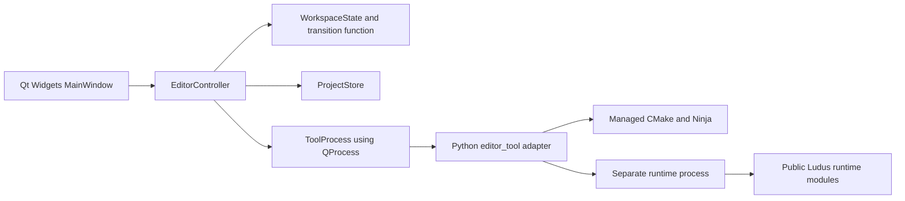

# Ludus Editor workspace architecture

Status: proposed implementation contract, not an implemented feature. Baseline:
2026-10-01, commit `e33320a0cec1cd9be6d47bd89042eff77c393ce4`.
Read [requirements](requirements.md), [tasks](tasks.md), and the self-contained
[research](../../../docs/architecture/editor-workspace-research.md).
AGENTS.md and applicable steering remain authoritative.

## 1. Outcome and scope

E0 delivers: open a project, edit its native build/launch settings, save, reopen,
build, run in a separate window, stop, and recover from errors. The visible
preview area describes the running application and its status; it does not
embed a game framebuffer. Scene authoring is the following milestone.

Select C++23 with Qt 6 Widgets for the desktop application, a single UI thread,
and a small Python tooling adapter for long operations. Keep one state owner,
typed actions/events, ordinary functions and explicit errors. This selection
prioritizes maintainability and a complete usable workflow. It is an engineering
judgment for Ludus, not a measured performance or universal superiority claim.

Target Linux x64 on the reference Ubuntu/Clang toolchain first. E0 does not add
Windows/macOS process implementations or a browser Editor. Existing browser
engine targets must still build without Editor dependencies.

Deferred: scene graph/ECS, reflection, gizmos, undo/redo, importing, asset database,
embedded rendering, scripting, plugins, docking customization, hot reload,
remote control, live game-state IPC, debugger UI and distribution bundles.
RAD remains optional; Build/Run never depend on it. This milestone implements a
subset of developer-tools D3/D4, not their complete debugger/tool-management scope.

## 2. Repository and dependency boundaries

Place the executable at `apps/editor/`, target `ludus_editor`, guarded by
`LUDUS_BUILD_EDITOR=OFF` by default. Unsupported hosts with that option enabled
fail configuration with a specific explanation; OFF must not search for Qt.



Editor can privately link FoundationBase and FoundationLogging. It does not link
Platform/RHI for its UI, run their singleton lifecycles, or include their private
headers. Runtime modules, SDK exports and game applications never depend on Qt,
Editor sources or editor tooling. Qt headers remain in private app headers and
`.cpp` files. No Editor target/header is added to the runtime SDK export set.

Qt supplies mature desktop controls and native text entry independently of
Ludus's current graphics/input work. Use Core/Gui/Widgets only, dynamic system
libraries, `find_package(Qt6 6.4 REQUIRED COMPONENTS Core Gui Widgets)` inside the
option. Use APIs available in 6.4, not newer documentation examples without
checking availability. The host's apt metadata lists Qt base 6.4.2 as a candidate;
Qt is not currently installed or compiled here. E0.0 records exact versions,
Qt platform plugin availability, licenses/notices and no-exceptions compatibility.
Do not add Qt to the engine Conan recipe or ordinary init prerequisites. Explicit
Editor setup documentation may list `qt6-base-dev` and `qt6-wayland`.

Use `ludus_apply_project_defaults`; never enable test exceptions on Editor or
its internal libraries. Infrastructure functions use noexcept/status errors.
Qt ordinary I/O/parse/process failures are handled through returned values.
Qt has allocation-failure limitations: this design does not promise recovery
from catastrophic OOM, and it must not introduce an exception-dependent normal
path. If the spike cannot meet AGENTS.md, stop that implementation batch with
evidence; do not weaken the rule. Python exception handling remains outside C++.
Qt-owned QObject children use Qt parent ownership; other owned engine objects
use the existing Ludus ownership vocabulary. No new allocator/container project.

## 3. Small implementation layout

Suggested files; combine files when it improves readability, preserve boundaries:

```text
apps/editor/
  CMakeLists.txt
  main.cpp
  src/main_window.cpp
  src/controller.cpp
  src/workspace.cpp
  src/project_store.cpp
  src/tool_process.cpp
  src/log_buffer.cpp
  src/internal/{main_window,controller,workspace,project_store,tool_process,log_buffer}.h
  tests/{workspace,project_store,tool_process,log_buffer}_tests.cpp
scripts/editor
scripts/python/editor_tool.py
scripts/python/editor_project.py
scripts/python/cmake_targets.py
scripts/python/test_editor_tool.py
examples/editor-workspace/ludus.project.json
examples/editor-sdk-project/{CMakeLists.txt,CMakePresets.json,ludus.project.json,main.cpp}
```

All app headers are private. Extract only the existing CMake File API query/read
functions from rad_debugger.py into cmake_targets.py, with regression coverage;
RAD delegates to them and keeps its own argument restrictions and sessions.
Do not refactor unrelated engine.py commands or create a generic provider/plugin
framework. Two provider branches in the tooling adapter are sufficient.

`WorkspaceState` owns saved/draft settings, descriptor path and digest, project
epoch, operation phase, last result, discovered target names, and active job.
`EditorController` validates actions, advances state, executes effects, and
publishes one state-change notification. `MainWindow` renders that state and
emits actions. Widgets do not start processes or own a second settings model.
Use QSignalBlocker while synchronizing fields so rendering does not dispatch
new edits. No global event bus, service locator or controller singleton.

`ProjectStore` owns bounded file parsing/saving. `ToolProcess` owns one QProcess,
protocol framing and timers. `LogBuffer` owns bounded retained output. The
transition function is tested independently of an interactive desktop; it may
use private Qt value types but does not create widgets or run tools.

## 4. Project descriptor version 1

One UTF-8 JSON file, conventionally `ludus.project.json`:

```json
{
  "version": 1,
  "name": "Ludus smoke workspace",
  "provider": "ludus",
  "source_dir": "../..",
  "preset": "linux-clang-debug",
  "target": "ludus_smoke",
  "run": {
    "cwd": ".",
    "args": []
  }
}
```

This example lives at examples/editor-workspace/ludus.project.json; source_dir
is relative to the descriptor directory, so it resolves to the engine checkout.
For an external project use provider `cmake` and source_dir `.`. run.cwd is
relative to the resolved source directory. Require relative paths here (including
intentional `..`); resolve/canonicalize before execution, never relative to the
Editor launch directory. Resolved absolute directory/artifact paths are limited
to 4096 UTF-8 bytes. Paths must refer to existing local directories at
operation time. Moving the whole project preserves its relative relationships.
There is no expansion of shell variables, tilde, globbing or command substitution.

| Field | Contract |
| --- | --- |
| version | Required JSON number numerically equal to 1; reject booleans, strings and nonintegral values. |
| name | Required nonempty string, at most 128 UTF-8 bytes. |
| provider | Exactly `ludus` or `cmake`; no auto-detection. |
| source_dir | Required relative path, at most 4096 UTF-8 bytes; source has CMakeLists.txt and CMakePresets.json. |
| preset | Exactly linux-clang-debug or linux-clang-development in E0. |
| target | Required, at most 256 bytes; ASCII `[A-Za-z0-9_][A-Za-z0-9_.+-]*`; semantic validation requires a unique executable. |
| run.cwd | Required relative path, at most 4096 UTF-8 bytes. |
| run.args | Required array of at most 64 strings, each at most 4096 UTF-8 bytes, total at most 32 KiB. Empty arguments are valid. |

Reject missing fields, unknown fields at each object level, invalid UTF-8,
unpaired Unicode surrogates, NUL in any string, malformed JSON and files over
64 KiB. Persist only the documented fields in a stable order, indented with a
final newline. Do not invent migrations for unknown versions or silently discard
fields. The UI and Python parser share fixture inputs/expected results so their
validation cannot drift; Python revalidates all fields before tool execution.
No schema generator or third-party JSON library is necessary.

Absolute Python/tool paths, resolved executable paths, job IDs, layout, SDK
installation paths and logs are never written into this shared descriptor.
The external sample supplies CMAKE_PREFIX_PATH through `$env{LUDUS_SDK_PREFIX}`
in its CMake preset; its SDK must already be installed for the selected variant.
The adapter does not choose/build/install an SDK silently.

Keep a saved document and a draft. Dirty is their semantic inequality. Save
validates the complete draft, acquires a short cooperative QLockFile beside the
settings in an ignored `.ludus/` directory, and checks the current disk bytes
against the digest recorded at Open/last Save. External deletion/change produces
Conflict; retain the draft and offer explicit Reload (with discard confirmation).
Do not silently overwrite. This is optimistic conflict detection; external
programs that ignore the lock are not serialized atomically with this Editor.

Write with QSaveFile, direct-write fallback disabled. Check open, complete byte
count and commit. Update saved state/digest only after commit succeeds; failure
preserves the previous destination and dirty draft. Atomic replacement is not a
claim of power-loss durability on every filesystem. No backup/history system.
Local descriptor I/O is small and synchronous; long configure/build/run work is
asynchronous. Network filesystems are outside this first acceptance baseline.

## 5. UI and actions

Use a QMainWindow with standard menus/actions, a QFormLayout for project settings,
a runtime status area and a read-only QPlainTextEdit output panel in a vertical
splitter. Let layouts size controls; no manually positioned widgets, custom
painting, themes or dock-layout serialization. Use Unicode text, normal keyboard
focus, standard shortcuts and accessible control labels.

Actions: Open Project (file chooser), Save (Ctrl+S), Reload, Configure/Refresh
Targets, Build, Build and Run, Stop, Clear Output and Copy Job Details. Arguments
use an editable list with Add/Remove, one string per item; do not parse a shell
command field. The stored target can be entered before configuration. Successful
Configure supplies an executable-only dropdown; a missing stored target remains
visible as invalid until corrected and saved. Target discovery does not change
the document silently. Preset changes invalidate the target discovery cache.

Opening only reads the descriptor. It does not execute CMake/project scripts,
bootstrap, install tools, or start the game. Configure is explicit. Build/Build
and Run require a clean saved document; explain that unsaved changes must be
saved first. A job rereads the file and verifies its expected digest before it
executes anything, then uses that immutable settings snapshot throughout.

Open/Reload/Close with a dirty idle document offers Save/Discard/Cancel. Save
failure aborts the pending destructive UI action. During a job editing/Open/
Reload/Save/new jobs are disabled; Stop and output selection/copy remain enabled.
On Close while busy, offer Stop and Close or Keep Open. Stop and Close starts
asynchronous cancellation and closes only after cleanup is confirmed. Do not
hold a nested modal loop while child output is flowing; use asynchronous dialogs.
A failed attempt to open another descriptor leaves the existing workspace intact.

## 6. Operation state and stale callbacks

Use an operation enum, not overlapping isBuilding/isRunning/isStopping flags:

| State | Meaning and next events |
| --- | --- |
| Idle | No owned operation; Configure/Build/BuildRun may start after validation. |
| Starting | QProcess launching and awaiting ready; failure/timeout returns an error. |
| Configuring | Running one configure, or refreshing codemodel. |
| Building | Configured executable selected, target build in progress. |
| Launching | Build succeeded; validating/resolving the actual artifact and spawning. |
| Running | Runtime process has started, not proof that a window rendered successfully. |
| Stopping | Cancellation latched; never transition back to Running or launch another child. |
| CleanupUnknown | Supervisor was lost or cleanup not confirmed; no new operation/automatic close. |

NoProject/ProjectLoaded and Dirty are orthogonal document facts. LastResult is
separate from Idle: Success, Failed, Cancelled, or CleanupUnknown, with a stage,
error code, exit/signal detail and remediation text. Do not erase failures merely
because the operation becomes idle. An error is a result, not a second busy state.

Configure: Starting -> Configuring -> Idle. Build adds Building. BuildRun adds
Launching -> Running. Any active phase can go to Stopping. Ordinary errors
return Idle only after resources are cleaned. Cancellation wins if accepted
before runtime spawn; check it between every phase and immediately before spawn.
A late successful build must not launch after Stop. Double-click/shortcut races
produce one job, not queued jobs. Stop is idempotent.

Each event is tagged with the active job ID. Bind callbacks/timers to the
controller QObject context; disconnect/stop them when retiring the job. Project
epoch and job counters never wrap silently. Encode job IDs as 16-character hex
strings so JSON floating-point number representation cannot lose an integer.
State notifications do not permit reentrant mutations: defer nested actions to
the next event-loop turn and revalidate when consumed. Ignore stale events;
reject unexpected phases/duplicate terminal results for the current job.

## 7. Tooling adapter and build semantics

`editor_tool.py` is a one-operation process, not a persistent daemon. Launch the
trusted adapter from the explicitly selected Ludus tooling checkout, using its
absolute managed Python interpreter (`out/host-tools/venv/bin/python`). Never
import a Python adapter named in the project descriptor. A thin scripts/editor
launcher locates the editor target via the shared File API helper and passes
absolute `--tooling-root`, `--python`, and optional `--project` paths. It requires
an already configured/built Editor and reports the preparation commands if absent;
launching the GUI itself does not build or install packages.

Both providers use managed CMake/Ninja discovery and the existing tool_env
convention. The adapter is a small orchestration wrapper; it must not call the
current blocking `engine.run(capture=True)` for long commands or monkeypatch it.
Reuse validations/path/environment helpers and run argument vectors with the
streaming supervisor. Existing human CLI commands retain their behavior.

For `ludus`, verify the opened source is a Ludus checkout and reuse
ensure_bootstrap_for_preset/source-root-specific tool discovery, its prepared
Conan artifacts and environment. Missing/stale preparation is an actionable
error directing the user to run init explicitly. Ordinary configure should
follow cmake_configure's existing cache-repair policy, without copying it; make
only the minimal helper extraction needed to expose command planning if required.
Do not reset LUDUS_BUILD_EDITOR in the runtime target's existing build cache.

For `cmake`, use the trusted tooling checkout's prepared tools with the external
source's CMakePresets.json. The two supported native configure presets must
produce single-config Ninja trees at `<source>/out/build/<preset>`. Supply `-B`
explicitly to enforce that contract; no general CMake preset interpreter.
The sample owns its compiler/SDK preset settings. Do not inject engine Conan
profiles into the external project. Retain compositor/session environment for
runtime launch; do not purge it or copy the complete environment into job logs.

Commands, as argument vectors (absolute managed cmake replaces `cmake`):

```text
Configure: cmake --preset <preset> -B <source>/out/build/<preset>
Build:     cmake --build <source>/out/build/<preset> --target <target>
Run:       <resolved absolute artifact> <each run.args element unchanged>
```

Add existing Ludus cache-repair arguments when applicable. cwd for configure/build
is source; cwd for Run is source/run.cwd. This narrow external preset contract
must be documented; unsupported generators/layouts fail explicitly. No automatic
source tree deletion, `--fresh` beyond existing repair policy, dependency upgrades,
network setup or global environment edits. Project CMake can execute arbitrary
project code during an explicit configure; this application is not a sandbox.

Before configure, create the named client query
`.cmake/api/v1/query/client-ludus-editor/codemodel-v2` in the chosen binary tree.
Configure must succeed before reading its reply. Follow the latest index's
named client reply, check codemodel major version 2, verify source/build roots,
select the single configuration and list EXECUTABLE targets whose names satisfy
the descriptor target syntax/length.
An excessive executable list or unsupported target name is a clear capability
error, not silently filtered data. Reject absent, ambiguous/non-executable selections and unsupported multiple artifacts. Never
parse console target lists or assume apps/smoke/ludus_smoke is the artifact path.
Bound File API reads (1 MiB per JSON file, 16 MiB aggregate, 4096 target entries,
at most 128 executable targets);
require referenced jsonFile paths remain within the reply directory after
canonicalization. Oversized/invalid replies fail with a path-specific diagnosis.

Build and BuildRun always configure first. Resolve the target before target-only
build, then reread the current valid codemodel after build (CMake may regenerate).
Require the same selected executable target, one existing executable artifact,
and the intended source/build identity before Run. Artifact paths may legitimately
be absolute or have custom output directories; do not force them under apps/.
A failed/cancelled build never launches any artifact, including a previously
successful one. No Run Without Build or cache-based freshness claim in E0.

Acquire a nonblocking cooperative flock for this binary tree for the whole
operation, including runtime ownership. Two Editor instances get Busy rather
than racing configure/build/run. Existing external CLI invocations do not honor
this lock; document that concurrently modifying the same build tree is unsupported.

## 8. Private protocol version 1

Use QProcess asynchronous start/readyRead/finished/error signals. No GUI-thread
waitForStarted/waitForFinished, process destructor used as cancellation, or
startDetached. stdout is UTF-8 JSON lines, stderr is bounded adapter diagnostics.
Do not forward child output directly onto protocol stdout.

Launch adapter with `--stdio`; it emits ready before any child spawn. UI sends
one request on stdin and keeps that pipe open for cancellation, output credit
and parent-lifetime detection:

```json
{"protocol":1,"job":"0000000000000001","operation":"build_run","project":"/absolute/ludus.project.json","expected_sha256":"<64 lowercase hex characters>"}
```

`operation` is configure/build/build_run. ready has protocol/type only. Subsequent
events echo protocol/job/type. Required event payloads:

| type | Additional fields |
| --- | --- |
| phase | stage: configuring/building/launching/running/stopping |
| command | stage, argv array, cwd (display/copy only; never re-executed from display text) |
| targets | sorted unique executable target names, preset |
| output | stage, stream stdout/stderr, text, end_offset (16-character lowercase hex); bounded chunks, not necessarily complete lines |
| runtime_started | pid (diagnostic only), executable, cwd, args |
| result | outcome success/failed/cancelled, stage, code, message, cleanup_confirmed boolean, exit_code or null, signal or null |

Cancellation message: `{"protocol":1,"job":"0000000000000001","type":"cancel"}`.
It is idempotent and never retries a build/run. Use a fixed 256 KiB encoded-output
credit window, initially full after the request. Each output frame consumes its
complete encoded byte count, including its newline. end_offset is the cumulative
encoded-output byte total at that frame boundary. Once the GUI parses and
retains/discards output, it acknowledges the latest consumed boundary, for example
`{"protocol":1,"job":"0000000000000001","type":"credit","through":"0000000000001000"}`.
Track sent/acknowledged totals as nonwrapping uint64 values, encoded as hex strings.
Duplicate/stale acknowledgements are idempotent; a future/non-boundary offset
is ProtocolError. Credit equals the fixed window minus outstanding bytes; it
cannot expand the window or be minted by duplicate messages.
Without credit, keep draining child pipes and drop/count ordinary output rather
than buffering it. Control events do not consume credit, but their aggregate
encoded size is capped at 1 MiB per job, reserving 4 KiB for the terminal result.
This bounds pending output inside Qt QProcess as well as application queues;
QProcess itself does not expose a receive-buffer cap. stdin EOF is parent loss and
cancels the operation. Bad framing/version/required types/job mismatch produce
ProtocolError and orderly cleanup. Unknown event types are rejected in version 1.
Do not offer generic RPC, binary pointers, sockets, authentication or reconnect.
This protocol controls the tooling adapter; the game itself needs no IPC server.

Require a ready within 5 seconds and one request within 5 seconds of ready.
Configure/build have no arbitrary success timeout; the user can Stop. A result
is provisional until all output is drained and QProcess finishes. Bridge exit
codes: 0 success, 1 failed, 2 protocol failure, 130 cancelled. Consistency of
result/exit code/cleanup must be checked; missing result or abnormal bridge exit
is never success. A runtime signal is carried as structured data while the
bridge itself exits 1 after cleanup. A nonzero game exit is a failed Run.
Result code names are Ok, InvalidProject,
UnsupportedVersion, Conflict, MissingTools, BootstrapStale, Busy, ConfigureFailed,
TargetInvalid, ReplyInvalid, BuildFailed, ArtifactInvalid, SpawnFailed,
RuntimeFailed, RuntimeSignaled, ProtocolError, Cancelled and CleanupUnknown;
keep codes stable and user messages independently readable. Bound result.message
to 256 UTF-8 bytes and the complete result frame to the reserved 4 KiB.
Only runtime_started may confirm the Launching -> Running transition; phase
events cannot assert a successful spawn by themselves.
Provide CLI reproduction of the same request by piping request JSON while keeping
stdin open and returning output credit until the terminal result; tests use
the same production entry point.

## 9. Process ownership and cancellation

All long commands belong to the Python supervisor. Start each current configure,
build or game child with Popen, shell=False, close_fds=True, stdin=DEVNULL and
start_new_session=True. Its process group includes ordinary descendants. Do not
inherit control stdin/protocol stdout into a game. Run the supervisor event loop
with selectors, nonblocking control/output reads and monotonic deadlines; no
worker threads or full-output communicate buffers. Catch expected Python errors,
clean up, and translate them to result codes. SIGTERM/SIGINT handlers only latch
cancellation; they do not exit before cleanup.

Stop/parent EOF: latch cancellation, report stopping, signal the owned child
group with SIGTERM, continue draining both streams, then escalate to SIGKILL
after 2 seconds. Allow another 1 second to observe termination; a kernel-stuck
process produces CleanupUnknown, not an assertion of successful cleanup. Reap
the direct child and close descriptors before confirming terminal completion.
Preserve the exit/signal cause and whether force was required in job details.

Normal direct-child exit also requires descendant cleanup. On Linux use
waitid(P_PID, child_pid, WEXITED|WNOHANG|WNOWAIT) to observe exit without reaping
before signaling its group. Keep the leader waitable until cleanup is complete
so its PID cannot be reused as a new group during cleanup. Do not call Popen.poll,
wait or communicate first. A narrow private helper observes live members of the
owned group in /proc, excluding the zombie leader; disappearance is normal,
inability to inspect is not proof of absence. Terminate remaining members using
the same deadlines, then reap the leader. Test this helper with real descendants,
including a leader that exits while its descendant keeps output pipes open.
Do not kill unrelated process groups or infer group ownership from protocol PIDs.

These guarantees cover ordinary children that stay in their assigned group.
A project that deliberately daemonizes/escapes its group is unsupported. No
cgroup/service manager/containment framework in E0. Abrupt SIGKILL of the
supervisor or a broken supervisor can leave cleanup unconfirmed; the GUI enters
CleanupUnknown, exposes known PID/job details, and requires explicit operator
recovery/restart rather than claiming success or silently launching another job.
A killed GUI is different: its control pipe closes and a healthy supervisor must
stop its workload; verify that case. Do not promise immunity to machine loss/OOM.

Close normally follows Stop and waits asynchronously. QProcess::terminate is
only a fallback request to the supervisor after a failed cancel write; its
handler still cleans up. At 5 seconds without cleanup progress, show recovery
details instead of destroying a running QProcess or guessing that killing only
the supervisor killed descendants. Final result priority is cleanup uncertainty,
then cancellation, then command exit status. A close request is cancellable
until actual application teardown.

## 10. Bounded output and debugging

Named limits, conservative initial values, measured in E0.5:

| Resource | Limit / behavior |
| --- | --- |
| Protocol line | 256 KiB including framing; oversized/truncated control frames are ProtocolError. |
| Child read chunk | 4 KiB raw bytes; incremental UTF-8 replacement decoder per stream. |
| Adapter outbound queue | 256 KiB for droppable output, plus 1 MiB reserved control; nonblocking writes. |
| UI framing backlog | 2 MiB; overrun stops the job with a protocol/backpressure diagnosis. |
| Retained output | At most 1 MiB UTF-8 and 5000 text blocks, including partial-line text. |
| UI callback work | At most 64 KiB read and one complete frame parsed per event turn, then schedule continuation. |
| Visual append cadence | Coalesce ordinary output at most once per 33 ms; terminal/state events remain prompt. |

A 4 KiB raw chunk can expand through decoding/JSON escaping: split after encoding
if needed, enforce the frame byte limit. Do not wait for a newline in child
output; a long line or invalid UTF-8 must not cause unlimited buffering. Drain
stdout and stderr independently; their interleaving is arrival order, not a
claim of the producing program's exact global chronology. Treat text as plain
text; no HTML, ANSI execution or compiler regex dependency. Clear and Copy work
while busy. QTextDocument's block limit alone is insufficient for one giant line.

If output fills a queue, keep draining the child and drop only log chunks; count
and display omissions with an explicit marker. Never drop phase/result/control
messages or let verbose logs delay cancel processing. A control-reserve or
aggregate-control overflow is a protocol failure requiring cleanup, not
permission to allocate more memory. Keep the last result and error explanation
outside the rolling log. Include omission counts and force/
cleanup detail in the terminal record within its frame limit; an omitted output
marker must not itself flood the stream. Limit adapter stderr to 64 KiB total
per operation; excess is a protocol diagnosis, followed by cancellation and
discard-draining. Application framing limits alone must not leave Qt internal
process buffers unbounded; enforce the output-credit contract end to end.
Bound the Qt diagnostic handler too:
forward ordinary messages to FoundationLogging, avoid recursion, and never touch
widgets from arbitrary Qt logging threads. No global logger redesign.

Copy Job Details returns a bounded text/JSON record containing descriptor digest,
provider/preset/target, absolute argv arrays/cwd for each executed stage, job ID,
tooling/runtime versions when known, stage transitions with monotonic offsets,
last exit/signal/result, cleanup status and dropped-output counts. Retain at most
256 transitions and eight command records per job, with a combined 1 MiB job-
details cap. Record detail omissions explicitly and retain the final result.
No full environment dump, credentials or
automatic upload. Its argv/cwd can reproduce tool invocations manually; it does
not claim deterministic game replay. Persistent log archives and telemetry are
outside E0. In-process controller tests inject events; subprocess tests use
small controlled programs, not compiler timing sleeps.

## 11. Acceptance and research decisions

The acceptance workflow and requirement-to-test mapping are in requirements.md
and tasks.md. Completion requires a real native GUI/runtime demonstration,
offscreen logic/widget tests, real process fixtures, installed-SDK project
verification and all repository validation gates. Offscreen tests do not prove
Wayland interaction or that a game displayed a frame. Missing desktop/tooling is
a recorded limitation, not a passed gate.

The baseline already selected Qt, one state owner and a CLI bridge. After actual
Gems review, the final contract adds: explicit state/action capability rules and
reentrancy protection; versioned asynchronous framing and no automatic retries;
job provenance and deterministic failure fixtures; dependency compatibility
spike; atomic persistence/conflict handling and process ownership verification.
The research separates article evidence from Ludus decisions and rejected
historical mechanisms. No book code, private figures or PDF access is required.
