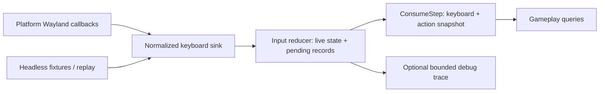

# Keyboard input design

Status: proposed; implement through [tasks.md](tasks.md). Requirement IDs are
in [requirements.md](requirements.md). Rationale and primary sources are in
[the research record](../../../docs/architecture/keyboard-input-research.md).

## 1. Architecture and repository fit

Native callbacks produce owned, normalized records. An independent reducer
stores live physical state and queues ordered transitions. The simulation owner
consumes the queue once per executed step, publishes a stable snapshot, and
evaluates a small action map. Gameplay reads actions or raw snapshots; it never
calls native input APIs.



Proposed static target: `ludus_input`, export `Ludus::Input`, under
`modules/input/`, headers under `include/ludus/input/`, private helpers under
`src/internal/`. Match Platform's existing top-level module layout.

- Input publicly depends on FoundationBase; privately use FoundationContainers
  if needed and FoundationLogging for bounded diagnostics. It has no Platform,
  graphics, native OS, XKB, or window dependency.
- Platform depends on Input for normalized record/sink vocabulary. This is a
  one-way dependency. Input must not acquire Platform to pump events.
- Gameplay/smoke links the modules it uses explicitly. Configure Input before
  Platform. Add its public headers to CMake FILE_SET/export and SDK coverage.
- Split `key.h`, `keyboard_event.h`, `keyboard.h`, `actions.h`, and opt-in
  `input_debug.h`. These names can follow checked-out conventions. Keep logging,
  native headers, and heavy facilities in `.cpp` files. Fixed arrays or existing
  `StaticArray` are adequate; no general-purpose container implementation.

The current `WindowBase::Event` is empty, and `HandleEvent({})` actually pumps
the display. Preserve that source-compatible call and return behavior in this
milestone. Add an explicit attach/detach keyboard sink on the window, using a
`noexcept` function pointer and `void*` user data; do not repurpose the empty
Event into an undocumented dispatcher. A sink receives no pointers to borrowed
Wayland payloads. Copy or immediately normalize enter arrays before returning.

The caller owns InputSystem and the window; detach before destroying the input
owner, and unregister surface routing before destroying the window. A callback
only normalizes/ingests, never invokes gameplay or renders. The existing display
is shared across windows: dispatch can invoke callbacks for any registered
surface, so route by surface and never by whichever window called HandleEvent.
The app appoints one pump owner and calls it once per outer iteration.

## 2. Physical key vocabulary (K01, K04)

Use a scoped `Key : uint16` enum with explicit stable values, Unknown reserved,
and a documented supported-key table. Its indices are Ludus-owned, neither
native scan codes nor characters. Defaults named KeyW/KeyA/KeyS/KeyD mean the
positions bearing those labels on a US reference layout. A future layout label
API is separate. Include letters, digits, punctuation positions, editing and
navigation keys, Escape, space, F1-F24, keypad, and distinct left/right
Shift/Ctrl/Alt/Super. Unsupported media/vendor keys normalize to Unknown with
no state change. Enum values and adapter table coverage must be tested together.

Use at most 512 slots initially; the implementation may use a smaller dense
domain after publishing the table and measured size. Validate every external
value before indexing, including fabricated enum values and native signedness.
No unchecked cast of Wayland numbers to Key; use an explicit evdev-position
mapping for the selected Linux backend. XKB's +8 conversion is only for a future
XKB lookup, not for indexing Ludus key masks.

Repeat events and duplicate down on an already-down key do not enter the
gameplay transition queue. Duplicate up is likewise ignored. Track duplicate,
unknown, and repeat counters for debugging. Initial scope exposes neither
character input nor OS-derived repeat commands. Modifier keys are ordinary
physical keys; chord matching and compositor lock/latch modifiers are deferred.

## 3. Ownership and step contract (K02, K03, K11)

All mutation and queries occur on the main thread. There is no worker, mutex,
atomic queue, observer list, or hidden singleton in Input. Give callers an
instance with explicit lifetime. Proposed operations, with final signatures
chosen in M0 to match repository conventions:

| Operation | Contract |
| --- | --- |
| `Ingest(record)` | Validate, update live state, append owned transitions; return admission status |
| `GetLiveDown(key)` | Current physical held state only; intended for diagnostics, not simulation edges |
| `ConsumeStep(stepId)` | Increasing uint64 step ID; clear previous step edges, apply pending reset then all queued transitions, evaluate actions, publish views |
| `GetKeyboardSnapshot()` | Down, Pressed, Released, cancellation/reset status, step ID; immutable until next consumption/reset publication |
| `GetStepEvents()` | Ordered accepted records consumed for this step, including reset boundary; borrowed until next ConsumeStep |
| `GetAction(id)` | Button/axis value and step flags; invalid IDs return explicit status or neutral state |
| `ReplaceBindings(map)` | Validate transactionally between steps; queue a reset and commit only on success |

Live state and simulation state are distinct masks because callbacks can arrive
while zero simulation steps execute. Queries of the published simulation view
never modify it. Keep step events in separate fixed output storage so further
ingestion does not invalidate a published view. Holding a view across a new
ConsumeStep is invalid; copy explicitly if needed. Ingestion can change live
state and pending status but not a previously published snapshot.

The first snapshot is neutral/unfocused. ConsumeStep succeeds even with no
events, publishes the retained down state, and clears edges. A repeated or
decreasing step ID returns InvalidStep without consuming or changing anything.
uint64 exhaustion returns explicit failure; do not silently wrap IDs.

Loop pseudocode (conceptual API, not a promise of current symbols):

```text
construct input and window; attach sink
while window.HandleEvent({}):           # native nonblocking pump
    accumulate elapsed time
    while a simulation step is due:
        input.ConsumeStep(nextStepId)
        Update(input.GetKeyboardSnapshot(), input.GetAction(...))
    Render()                           # does not advance/clear simulation input
detach sink; destroy window and input safely
```

Assign every pending event to the next executed step, in callback order. With
three catch-up steps, edges appear only on the first; held state persists in
the next two. With zero steps, retain the queue. This intentionally does not
reconstruct historical OS time boundaries during a stall. Timestamp-to-tick
scheduling would require clock conversion and a different latency policy.

Native Wayland time is uint32 milliseconds with undefined origin and wrap.
Retain it as optional diagnostic metadata; do not compare it to engine time or
sort by it. A monotonically increasing ingestion sequence determines order.
Use an explicit exhaustion status/reset policy for sequences, with a testable
small-counter seam; do not permit ordering ambiguity through silent wrap.

### Key reducer truth table

Pressed and Released are OR-accumulated actual transitions within the step,
not merely `current & ~previous` masks. Ordered records preserve multiplicity.

| Initial | Accepted records | Final Down | Pressed | Released |
| --- | --- | --- | --- | --- |
| Up | Down | true | true | false |
| Down | Up | false | false | true |
| Up | Down, Up | false | true | true |
| Up | Down, Up, Down | true | true | true |
| Down | Down/repeat | true | false | false |
| Up | Up | false | false | false |

Do not claim that a frame mask preserves the number of taps. Consumers needing
two shots from two down/up pairs iterate step records; ordinary button queries
mean at least one transition. No query consumes input for other readers.

## 4. Reset, focus, and bounded loss (K05-K07, K09)

Keep a pending reset mailbox independent of queue capacity. It contains reason,
epoch, focus status, and a held-key baseline. Coalesce multiple resets before
consumption into the latest baseline while retaining reason flags/counters.
Reset immediately discards the old pending queue. New events after that reset
queue behind its baseline. On next ConsumeStep, cancel any previously published
active actions, clear key/action edge flags, install the baseline without press
edges, and then reduce the new queue. No reset is dropped because a queue is full.
Raw keys have reset status rather than fabricated Released flags.

Physical Down after synchronization may be true, but mark every baseline-held
key suppressed for actions until a genuine Up then Down. Raw snapshot queries
describe the synchronized physical state; gameplay should use actions if it
needs this safety policy. Suppression is tracked in both live and simulation
state and is applied in record order. An Up for a suppressed key clears
suppression without a gameplay action release. Fresh Down admits activation.

- **Focus leave/close/disconnect/capability loss:** baseline empty, focus false;
  ignore further gameplay key records until a new focused baseline. Discard
  pending old presses, including taps not yet consumed. Cancel active actions.
- **Focus enter:** baseline is Wayland's current held set, focus true; do not
  fabricate presses. Require release/repress before those keys activate actions.
- **Overflow:** maintain live Down even for the record that could not queue.
  Discard the incomplete pending batch and snapshot the updated live Down into
  the reset mailbox, suppressing all held keys. Retain focus. Following physical
  records may queue normally; release/repress recovers without focus cycling.
- **Map replacement:** discard old-map pending records, keep physical baseline,
  suppress held keys, cancel old actions, then publish the new map on next step.
- **Explicit reset:** choose and document either unfocused neutral baseline or
  current-live focused baseline through a named reason/mode, not an ambiguous
  boolean. Use the same reducer path.

Any events before the most recent reset that have not been consumed are
intentionally invalidated. This is a conservative safety policy, reported in
status/trace; it is not lossless replay. Delivered prior-step snapshots are
historical and remain stable; the new reset is visible at the next step and
in immediate pending status. Callers must consume a final step or inspect
reset status before teardown if they need to observe cancellation.

Initial pending capacity: 256 accepted transitions. The output step buffer
must hold that batch plus its reset marker. Capacity is a private/configured
constant, not an allocation-growth strategy. Overflow returns a distinct
RecoveredWithLoss admission status and increments discarded-event/overflow
counters. Test with a tiny configurable capacity. No crash, silent drop-oldest,
or blocking producer. Trace ring overflow is separate from gameplay overflow.

## 5. Small action map (K08, K09)

Actions use caller-assigned integer IDs validated against configured capacity.
Configuration is plain records copied into owned bounded storage. Proposed
defaults: 64 actions, 256 bindings; measure and report actual sizes. No strings,
hash lookups, delegates, or polymorphic per-key objects in the hot path.

Support Button and Axis1D only. A button ORs all its bound, unsuppressed keys.
An axis ORs negative contributors and positive contributors separately and
returns `positive - negative` as float32, thus -1, 0, or +1. Duplicate bindings
are rejected or canonicalized during validation, with one documented rule.
Reject invalid keys/IDs, conflicting action types, and unsupported configuration
without touching the active map. Rebinding cannot run inside a callback or while
consumption is in progress. One active map suffices for gameplay versus menu.

Evaluate the aggregate after each transition, not only from final down state.
Button Pressed is a false-to-true aggregate transition; Released is true-to-false.
Axis Value is final aggregate value; Pressed/Released mean inactive-to-active
and active-to-inactive where active means nonzero. A +1 to -1 transition without
an intervening zero changes Value but is not a new Pressed. Reset sets Cancelled
for formerly active actions; it does not fabricate Released or Pressed.
Cancelled can coexist with a fresh Pressed later in the same step; expose the
reset reason and ordered records so this is explainable.

Keep a per-step cancellation mask indexed by the stable action-ID domain,
independent of whether an ID is present in the new map. An ID removed by map
replacement returns a neutral value with Cancelled=true for that publication
if it was previously active, then neutral/no flags on later steps. IDs outside
the configured domain return InvalidAction. Preserve the old published action
snapshot until consumption computes these cancellations, even when replacement
has already committed the new configuration. Publish a map version with each
snapshot and trace boundary so records and bindings cannot be confused.

If W and UpArrow both bind MoveForward, W-down, UpArrow-down, W-up keeps the
button active, with one press and no release. If an action starts up, then has
down/up in one batch, both edge flags are true although Value is zero. Flags
are OR-accumulated over the step, like raw key flags.

Start with bounded flat binding scans and fixed aggregate storage; simple code
is easier to audit and adequate for 64 actions. Cache results so queries are
O(1). Ingestion and key queries are O(1); step work is bounded by events times
bindings. A per-key adjacency table is a later optimization only if profiling
shows binding scans matter. Avoid accidental quadratic scans over actions and
bindings inside every query.

An example map is Jump=Space or KeyJ; MoveX=KeyA/KeyD; MoveY=KeyS/KeyW;
Quit=Escape. Defaults belong to the demo/application, not a global engine policy.
Multiple actions may share a key. There is no event consumption or priority
stack; switching maps is explicit and resets eligibility.

## 6. Wayland adapter (K10)

Extend registry management with a selected wl_seat and its wl_keyboard when
keyboard capability is advertised. Track registry name and negotiated versions;
on capability loss/global removal detach, reset input, and destroy/release
objects with the version-correct request. Select one seat deterministically
from advertised registry names and keep it until removal. A replacement seat
starts with reset state; do not merge held states across seats. Bound protocol
versions to those supported by the build headers. Initialize every listener
field supported by that interface version. No runtime roundtrip in the hot pump.

Maintain a private surface-to-window/sink route with explicit registration and
teardown. On enter, validate/copy the key array, map native positions, and submit
the focused baseline for the attached window. On leave, cancel/reset. Ignore
events routed to other surfaces; changing attachment also resets the old owner.
When closing the window or display pump fails terminally, submit reset before
returning false. Preserve EINTR handling, EAGAIN flush retry, nonblocking poll,
and exactly one read-or-cancel for each successful prepare_read.

This physical-only milestone handles keymap events by closing their fd on every
path; it does not mmap/compile them. Document that the adapter supports the
Linux evdev position convention of the selected backend. If the supplied format
or backend cannot establish that mapping, report unsupported input and keep
neutral state; never guess characters from codes. `no_keymap` must not be
mistaken for proof of a portable code convention. No libxkbcommon dependency is
needed until layout/modifier interpretation or text is added.

Receive modifiers and repeat_info safely but do not create UI/text behavior.
For versioned compositor repetition, ignore repeated pseudo-state for gameplay;
on older versions do not start a client repeat timer. Close keymap descriptors
even when no sink is attached. Seat availability may change after startup;
window rendering continues when keyboard is absent. Log lifecycle/failure
summaries through LUDUS_LOG_* outside per-key formatting where possible.

## 7. Debugging and reproducibility (K13)

An opt-in fixed trace ring records normalized records and reset boundaries,
sequence, native timestamp when present, source (Native/Synthetic/Replay),
step assignment, overflow/invalid counters, and ring truncation. Use physical
debug labels. Disabled tracing is a predictable branch with no formatting.
Snapshot counters are cheap and always available. Never log every key by default.

For tests, fixtures contain an initial focused baseline, bindings, records,
ConsumeStep boundaries, expected masks/actions, and reset reasons. Playback
starts from a known state and feeds production Ingest/ConsumeStep. Compare
semantic fields, not raw struct bytes/padding. A bounded trace that has wrapped
or contains gameplay loss is explicitly incomplete; do not present it as an
exact replay. Copies for inspection are caller-owned, taken outside callbacks.

This milestone supplies in-memory replay tests and a diagnostic dump in the
demo using the existing logger. It does not add a file format, file writer,
crash handler, network log, overlay, or whole-game determinism guarantee.

## 8. Performance, errors, and acceptance

Hot methods are noexcept. Validate external input using status returns, not
assertions that abort on normal unsupported keys or buffer saturation. Reserve
assertions for internal programmer invariants. If a private PIMPL is selected,
allocate once through existing Ludus ownership/memory APIs or checked nothrow
setup; report failure explicitly. No runtime allocation is needed in the reducer.

Measure idle steps, a normal typing/movement batch, repeated/unknown records,
256 transitions with 256 bindings, and reset/overflow storms. Record release or
profile build, tool versions, hardware, event/binding count, warmup, median and
p95 batch times, sizeof private storage, allocations, and trace-on/off costs.
Preliminary storage goal: <=128 KiB per instance including enabled trace;
report exact footprint and justify deviation rather than silently increasing
capacities. This is a planning target, not measured evidence. No universal
nanosecond target or hardware-to-photon latency claim is made.

Acceptance requires zero hot-path allocations/locks, bounded capacities/work,
all reducer/action/reset truth-table tests, real Wayland lifecycle validation,
existing pump regression tests, and installed SDK use. Do not raise header
budgets, disable warnings, or enable engine exceptions to get green checks.
Record actual validation in the task ledger; unavailable compositor tests are
an outstanding gate, not a headless-test success.
