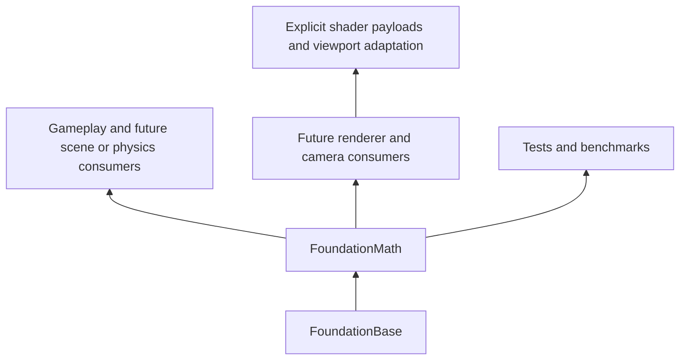

# Ludus math design

Status: proposed architecture and implementation contract, 2026-10-01.
Implementation, measurements and platform validation are outstanding. The
[research](../../../docs/architecture/math-research.md) embeds the relevant
private Gems findings; Kiro needs no PDFs or companion code. Requirements
[MA01–MA14](requirements.md) and stages [M0–M6](tasks.md) define completion.

## 1 Selected architecture

Build one small, static FoundationMath module. Ordinary values expose their
components to the debugger. Cheap operators are inline/constexpr when C++23
permits; square roots, transcendental functions, validated constructors,
inverses, geometric queries and batches live in ordinary `.cpp` files. There
is no `MathSystem`, startup/shutdown, registry, mutable cache, dependency on
logging/profiling, or owned heap storage.

The scalar production path is the baseline implementation and remains available
if a measured bulk kernel is later optimized. Keep only the API a 2D game,
camera/transform consumer and primitive query consumer can use. A feature from
a Gems chapter is not automatically a requirement. Modern numerical robustness,
explicit conventions and evidence-based optimization matter more than a large
feature inventory.



Arrows point from a supplier to its consumer; actual CMake Math links
Base, never the other direction. Existing Platform, RHI and Text need not acquire
a Math dependency until their code uses it. Do not refactor existing app/probe
arithmetic merely to create call sites. Add isolated SDK/math fixtures instead.

## 2 Module and include layout

```text
modules/foundation/math/
  CMakeLists.txt
  README.md
  include/ludus/foundation/math/
    status.hpp           lightweight MathStatus declaration
    scalar.hpp           constants, comparison, lerp and scalar declarations
    vector.hpp           Vector2/3/4 and Vector3d, arithmetic
    quaternion.hpp       Quaternion and rotation operations
    matrix.hpp           Matrix3/4 and algebra
    transform.hpp        Affine2/3, TransformTRS, points/vectors/normals
    projection.hpp       checked view/projection and framebuffer conversion
    geometry.hpp         planes, boxes, spheres, rays, intervals, frustum values
    queries.hpp          checked geometric queries and results
    precision.hpp        double-to-local float conversion
    random.hpp           explicit PCG32 stream
    batch.hpp            span-based bulk operations
  src/
    scalar.cpp vector.cpp quaternion.cpp matrix.cpp transform.cpp
    projection.cpp queries.cpp precision.cpp random.cpp batch.cpp
    internal/            only if shared numerical helpers actually need it
  tests/                 Catch2 tests and deterministic corpus
```

Use namespace `ludus::foundation::math`; explicitly import needed Base aliases
inside it. Follow existing public-field and function naming in the actual
checkout. This document's mathematical symbols are not mandatory field names.
No umbrella header initially, no public `internal/` includes, and no third-party
math types in signatures. Each header includes its own declared dependencies.
`vector.hpp` does not include matrices/quaternions/geometry. `random.hpp` needs
only foundational types; `batch.hpp` explicitly includes `<span>` and value
headers it names. Do not use PIMPL for a small fixed-size math value.

Use `FILE_SET public_headers`, export name `FoundationMath`, and
`ludus_apply_project_defaults`. Place the root `add_subdirectory` before consumers
and outside the native-only branch. Add native Catch2 targets with
`ludus_enable_test_exceptions` only for tests; browser uses a separate small
executable because root CMake intentionally disables native tests on Emscripten.
Installed consumers must link `Ludus::FoundationMath` through `find_package`.

M0 records a narrow ADR 0003 policy addition allowing `<cmath>` and `<limits>`
in Math `.cpp` files for standard numeric facilities. No new arbitrary STL
allowance and no heavy math/template header in the installed API. Use standard
libm first; do not handwrite trig approximations from historical books. C++23
does not make all standard math calls constexpr: only mark APIs constexpr when
their implementation actually supports it on both pinned compilers.

## 3 Conventions and value representation

| Concern | Contract |
| --- | --- |
| World/local 3D | Right-handed; +X right, +Y up; camera looks toward -Z |
| Cross product | `Cross(+X,+Y) = +Z`; positive rotations follow the right-hand rule |
| Angles and distances | Radians; meter-based examples. Degrees require named conversion |
| Vector action | Column vectors: `pOut = M * pIn` |
| Matrix composition | `A * B` applies B then A; `world = parent * local` |
| Matrix storage | Columns in increasing order; element notation `M(row,column)` |
| Quaternion | Hamilton product, components `(x,y,z,w)`; action `q*(0,v)*conjugate(q)` for unit q |
| Quaternion composition | `a*b` rotates by b then a |
| Projection | Canonical NDC X/Y in [-1,1], Z in [0,1], Y up |
| Framebuffer | Top-left, X right, Y down; widths/heights in physical pixels |
| Screen 2D | A Vector2/Affine2 has no implicit camera/units conversion; UI callers supply pixel coordinates |

Euler-angle storage and ambiguous `Euler` constructors are absent. For 2D,
positive rotation in a Y-up plane is counterclockwise; the same numeric rotation
in a screen Y-down coordinate system appears clockwise. State the coordinate
space at the consumer; do not add a global handedness switch.

Values are standard-layout, trivially copyable, initialized and cheap to copy.
Use natural scalar alignment, without hidden SIMD padding:

| Value | Fields and size on supported IEEE targets | Default |
| --- | --- | --- |
| Vector2/3/4 | 2/3/4 float32 components; 8/12/16 bytes | All zero |
| Vector3d | 3 float64 components; 24 bytes | All zero |
| Quaternion | Four float32 components; 16 bytes | `(0,0,0,1)` |
| Matrix3 | Three Vector3 columns; 36 bytes | Zero matrix |
| Matrix4 | Four Vector4 columns; 64 bytes | Zero matrix |
| Affine2 | Two Vector2 basis columns and Vector2 translation; 24 bytes | Identity |
| Affine3 | Three Vector3 basis columns and Vector3 translation; 48 bytes | Identity |
| TransformTRS | Vector3 translation, Quaternion rotation, Vector3 scale; 40 bytes | Zero translation, identity rotation, unit scale |

Assert sizes, offsets, natural alignment and copyability in tests on native/Wasm.
Do not use unions for scalar-array aliasing or pointer arithmetic across struct
members. Matrix column arrays are real arrays; named vector fields are accessed
by switch/named components when indexed access is needed. Any SDK indexed helper
must safely handle an invalid index after a resumable assertion (return a status,
not a dangling reference). Direct caller array indexing has ordinary C++ bounds
preconditions.

Exact value equality compares components, not object bytes; +0 equals -0 and
NaN is unequal to itself. Quaternion component equality differs from rotation
equivalence. There is no public `operator<` for vectors and no fuzzy equality.
Use named `Hadamard` for component multiplication; `Vector3 * Vector3` is absent.
Scalar multiplication/division and vector addition/subtraction are ordinary
component arithmetic. General matrices expose named `Identity()`/`Zero()`.

## 4 Numerical and failure contracts

### Compilation and reproducibility

The normal CPU contract assumes round-to-nearest and ordinary IEEE binary32/64
with NaN/Inf handling. Math never changes rounding, FTZ/DAZ or floating traps.
Unsupported external FP-environment changes void numerical accuracy promises;
no hidden per-call environment reset. Disabling C++ exceptions is unrelated to
hardware floating-point exceptions.

For checked `.cpp` algorithms and their tests, explicitly compile without fast
math and with `-ffp-contract=off`; inspect `compile_commands.json`, including
LTO configurations used by the project. Ordinary inline operators inherit
consumer compilation. Document that SDK consumers must preserve finite/signed
zero semantics, and reject `__FAST_MATH__` or nonzero `__FINITE_MATH_ONLY__` in
Math headers with a useful error. Do not impose unrelated architecture flags
or change global build options. Individual unsafe flags/FP environment changes
cannot all be diagnosed by these macros; check effective SDK fixture options.
Do not use FMA intrinsics or explicit approximate reciprocal on the checked path.

CPU results are numerically equivalent within documented bounds, not bit-exact
across native libm, Wasm, GPUs and compiler versions. Within a pinned build,
fixed inputs and operation order support useful replay. PCG integer sequence
and state replay have a separate bit-exact contract. Fixed-point/lockstep requires
another design, including compiler, libm and reduction decisions.

### Status and output behavior

Use a small `MathStatus` enum:
`Success`, `NonFiniteInput`, `InvalidArgument`, `Degenerate`, `IllConditioned`,
`OutOfRange`, and `SizeMismatch`. No strings or owning result framework.
Checked APIs return `[[nodiscard]] MathStatus` and write caller outputs only on
success. Compute a complete local result, verify it, then assign; failures never
modify any output, including aliased inputs. Document which inputs have unit,
positive, finite or invertibility preconditions.

Queries return MathStatus and a structured result with `Hit`/`Miss` (or the
classification appropriate to that query). A normal miss is `Success` with
`Miss`; invalid data is a failing status with unchanged output. Success/miss
records have initialized neutral fields so they are safe to inspect; numeric
hit fields are meaningful only for Hit. Multi-failure precedence is not an ABI
promise: tests should assert a relevant failure rather than assume the order of
every validation check.

Trusted operations (arithmetic, unit-quaternion rotation/interpolation,
signed distance with a unit Plane) do not scan every value in Release. Preconditions
are caller obligations, documented and assertion-checked selectively in
development. They never perform unsafe float-to-int casts or out-of-bounds
access. Malformed user/import data goes through the checked factories.
Do not silently provide fallback results for a checked operation. An explicitly
named `NormalizeOr` may use a caller-supplied unit fallback; it must validate the
fallback and cannot invent a default direction. Prefer TryNormalize in v1.

### Tolerances and representable domains

Do not use one epsilon across distance, determinant, angle and normalization.
Provide named policy values with units at each checked operation:

- Scalar `NearlyEqual(a,b,absTol,relTol)` uses
  `abs(a-b) <= max(absTol, relTol*max(abs(a),abs(b)))`. Negative/nonfinite
  tolerances or operands return false; infinity is never approximately equal.
  Use a wider intermediate for float32 comparisons. No default tolerance at
  critical geometric call sites.
- `TryNormalize(v,minLength,out)` requires finite `minLength >= 0`; zero always
  fails. The threshold is a length, not a squared length. Default zero admits
  any representable nonzero finite vector under the supported FP environment.
- Rotation basis checks use dimensionless orthogonality/length/determinant
  tolerances (initial policy target `1e-5`). Interpolation close-angle fallback
  starts at dot >= `0.9995`; validate its angular error rather than treat the
  decimal as sacred.
- `InversePolicy` uses dimensionless minimum reciprocal condition estimate
  (initial `1e-6`) and maximum normalized residual (initial `1e-5`). These are
  rejection policies, not universal forward-error guarantees.
- Frustum margin is a nonnegative distance in the same space as its normalized
  planes and bounds. Near-contact distances are caller domain choices.
- Relative conversion accepts `maxAbsComponent` in local distance units; no
  magic world size or automatically changing origin.

Initial thresholds are Ludus choices to calibrate against the M0 corpus, not
claims from the books. Record any adjustment and tests before freezing the API.

## 5 Scalar and vector algorithms

Supply Pi/Tau constants, named radians/degrees conversion, Abs/Min/Max/Clamp,
finite detection, square root, Sin/Cos/Atan2, lerp and smoothstep. Keep wrappers
narrow and use typed literals. `Clamp` is trusted for finite values and ordered
bounds; checked ingress validates those preconditions. Do not promise a custom
NaN ordering. Scalar ordinary libm domains are documented (`Sqrt` >=0, etc.).

`Lerp(a,b,t)` is unclamped; preserve exactly a/b at t=0/1 for finite inputs.
Use an overflow-conscious implementation in `.cpp` for the scalar reference,
and make vector lerp componentwise with the same behavior. `t` outside [0,1]
extrapolates and may overflow. `SmoothStep01(t)` clamps finite t to [0,1] then
uses `t*t*(3-2*t)`. A ranged checked smoothstep rejects equal/reversed bounds.
No forced constexpr arithmetic identity that compromises endpoint/extreme tests.

`TryApproachExponential(current,target,rate,dt,out)` requires finite current,
target, nonnegative finite rate/dt. Compute blend with `-expm1(-rate*dt)` in
double, then interpolate; rate=0 or dt=0 preserves current. A very large product
may saturate blend to 1 without forming an invalid product. This is exact
first-order decay for a constant target, not a second-order spring, velocity
model or moving-target integration guarantee. No frame-dependent fixed blend.

Vectors supply Dot, Cross for 3D, Length/LengthSquared and distance variants.
Length and checked normalization use scaled components: for finite input set
`s=max(abs(components))`, reject s=0, compute `u=v/s`, and normalize using
`sqrt(dot(u,u))`. Compare true length with minLength using double for float32
inputs; the implementation must not overflow by multiplying s and the norm
in float32. Final checked unit output must be finite. This admits large finite
vectors whose raw dot product would overflow and small vectors whose square
would underflow. Length may overflow if the mathematical length is outside the
return type; LengthSquared/Dot are intentionally ordinary arithmetic, with no
claim of the same range robustness.

Vector3d provides construction, finite check, addition/subtraction, scalar
arithmetic and robust length as needed for relative-coordinate work. It is not
the start of templating every matrix/quaternion on every scalar. Avoid introducing
integer-vector arithmetic and its overflow policy until a consumer needs it.

## 6 Quaternion algorithms

`TryFromAxisAngle(axis,angleRadians,out)` normalizes a finite nonzero axis,
requires a finite angle, and computes `(axis*sin(angle/2), cos(angle/2))` using
double intermediates before a checked normalized float result. Very large
angles inherit libm's argument-reduction accuracy; no bitwise trig guarantee.

For Hamilton composition, with vector parts av/bv and scalar aw/bw:

```text
vector(a*b) = aw*bv + bw*av + cross(av,bv)
scalar(a*b) = aw*bw - dot(av,bv)
```

Do not normalize every raw multiply. Repeated integration/composition users
renormalize at an explicit boundary. Conjugate negates the vector part; it is
an inverse only for unit quaternions. v1 need not expose a general nonunit inverse.
`Rotate(q,v)` takes unit q; its standard cross-product expansion must match
`Matrix3(q)*v`. No multiplication overload between a quaternion and a point.

`TryRotationBetween(from,to,out)` robustly normalizes in double. Let d be their
clamped dot product, c their cross product, s its length. For d>=0, form vector
part `c/sqrt(2*(1+d))`, w=`sqrt((1+d)/2)`. For d<0 and s>0, use unit axis c/s,
vector magnitude `sqrt((1-d)/2)` and w=`s/sqrt(2*(1-d))`; this avoids cancellation
in `1+d` near the opposite case. Normalize the final quaternion. If s=0 and
d>=0 return identity. If s=0 and d<0 choose the coordinate axis least aligned
with from (ties X then Y then Z), normalize `cross(from,axis)`, and return that
axis with w=0. Zero directions fail. The exact opposite rotation is necessarily
nonunique; the tie rule makes it reproducible. Do not snap a broad near-opposite
region and thereby fail to map the actual target direction.

`TryFromRotationMatrix(basis,policy,out)` checks finite columns, column lengths,
pairwise dot products and determinant near +1. Compute the quaternion component
with largest squared magnitude first, reconstruct the others, normalize, and
validate its rotation action. Use identity/180-degree/nonprincipal axes in tests.
Reject scale, shear, reflection and zero bases; decomposition/repair is outside
this API. Conversion sign is deterministic for a fixed implementation but does
not replace time-series sign continuity.

`NlerpShortest(a,b,t)` and `SlerpShortest(a,b,t)` have trusted unit inputs and
finite t in [0,1]. Negate b when dot(a,b)<0. Return a at t=0, corrected b at t=1;
those are the same endpoint rotations. Nlerp normalizes the blend. Slerp clamps
dot into [0,1], uses normalized lerp for the close-angle case, and otherwise
uses sine-weighted spherical interpolation and normalizes the result. Same and
opposite-sign quaternions never divide by zero. Extrapolation and multi-turn
spins are absent. `SameRotation` uses absolute quaternion dot with an explicit
angular tolerance in [0,Pi] and validated unit inputs. Compare the clamped
absolute dot with `cos(tolerance/2)` in double, allowing only the documented
unit-input rounding error; ordinary `==` remains componentwise.
No forced w>=0 after each operation, which creates sign discontinuities.

## 7 Matrices and affine transforms

Matrix multiplication and matrix-vector action derive from column combinations.
Test a rotation plus translation on an asymmetric point so row/column mistakes
cannot pass identity-only fixtures. Transpose is a named function. Layout does
not determine action order; document both. Tiny public loops need no forced-inline
macro. If profiling shows call overhead, inline small bodies only with header
budget evidence; larger algorithms remain easy to step through in `.cpp`.

`TryInverse(Matrix3/Matrix4,policy,out)` uses fixed-stack double Gauss-Jordan
elimination with scaled partial pivoting, not a copied giant adjugate macro.
Normalize by the matrix's maximum absolute component before elimination to
control range; track that scale when reconstructing the inverse. Reject zero
pivots and nonfinite intermediates. Estimate reciprocal condition with
`1/(normInf(A)*normInf(invA))`. Validate representability before float narrowing;
reject a narrowed all-zero/nonfinite inverse. In double, check both
`A*X-I` and `X*A-I` for the float32 X, using
`max(residualNorms)/max(1,normInf(A)*normInf(X))`. Reject insufficient rcond or
excess residual. Return output unchanged on failure and allow in-place inverse.
Fixed loops are bounded; stack arrays use usize indices and no allocation.

Condition checks limit unsafe inversion but do not certify every downstream
error budget. An otherwise invertible projective matrix with extreme translation
may fail the full homogeneous condition check. Use the specialized affine
inverse for affine values; that evaluates the linear block's condition separately.
Rigid inversion is a named validated special case if a real consumer needs it,
never a guess from a flag on a general matrix.

For `Affine3={L,t}`, where L is three basis columns:

```text
TransformPoint(A,p)  = A.L*p + A.t
TransformVector(A,v) = A.L*v
Compose(A,B)        = { A.L*B.L, A.L*B.t + A.t }
Inverse(A)          = { inverse(A.L), -inverse(A.L)*A.t }
NormalMatrix(A)     = transpose(inverse(A.L))
```

Affine2 uses the analogous 2D equations, with a stable checked 2x2 inverse
and the same condition/residual policy. Zero/negative scale is permitted as
transform data; inverse/normal conversion rejects singular data. Compute inverse
translation in double and check narrowing. `TryTransformNormal` applies the
normal matrix then robustly normalizes; a zero input normal fails. Do not use
the point/vector path for normals under nonuniform scale or shear.

TransformTRS converts to `L = Rotation(q)*Diagonal(scale)` and translation t.
TRS inputs require finite data and unit q; a checked conversion validates import
data. A trusted conversion accepts previously validated authoring values.
Parent nonuniform scale plus child rotation generally produces shear. Compose
as Affine3 and retain it. No `TransformTRS * TransformTRS` and no general TRS
inverse/decomposition exists in v1. Scene hierarchy, dirty propagation, caches,
reflection and editor serialization stay with the scene/editor consumer.

`ToMatrix4(Affine3)` writes the implicit last row `(0,0,0,1)`. General Matrix4
point transformation produces a homogeneous Vector4; it never silently performs
division. `TryPerspectiveDivide` separately rejects nonfinite data, w=0 or
`abs(w) <= minAbsW` (caller-supplied finite nonnegative threshold), and
unrepresentable output.
Negative w is mathematically permitted here; visibility/clipping is another
operation. A Matrix4 must not be silently truncated into an Affine3.

## 8 Camera and projection helpers

`TryLookAt(eye,target,upHint,outView)` computes backward unit z from eye-target,
right unit x from `cross(upHint,z)`, y=`cross(z,x)`, and view rows x/y/z with
translation `(-dot(x,eye),-dot(y,eye),-dot(z,eye))`. Use double intermediates for
float inputs; output rows must be placed in column storage correctly. Coincident
eye/target or parallel/zero upHint fails. No hidden up-axis repair. If roll continuity
is needed, the caller provides its previous camera orientation instead.

Canonical finite reverse-Z perspective, aspect a>0, near n>0, far f>n,
vertical FOV in (0,Pi), and k=`1/tan(FOV/2)`, is shown by rows:

```text
P = [ k/a  0     0           0       ]
    [  0   k     0           0       ]
    [  0   0   n/(f-n)     n*f/(f-n) ]
    [  0   0    -1           0       ]
```

Compute coefficients in double, then check representability. On a camera point
z=-n depth is 1; z=-f gives 0. Infinite reverse-Z uses row 2 `(0,0,0,n)` and
row 3 `(0,0,-1,0)`; choose a named infinite factory rather than a far=infinity
sentinel. Points at finite negative z have depth `n/(-z)`.

Finite reverse-Z orthographic, l<r, b<t, 0<=n<f, has rows:

```text
O = [ 2/(r-l)     0         0       -(r+l)/(r-l) ]
    [    0     2/(t-b)      0       -(t+b)/(t-b) ]
    [    0        0      1/(f-n)       f/(f-n)   ]
    [    0        0         0             1      ]
```

All inputs must be finite and correctly ordered. A valid interval too narrow
to produce representable coefficients fails OutOfRange; zero extents are not
clamped. No infinite orthographic or backend-specific projection factory.

Reverse-Z is useful with floating depth; a future renderer chooses a supported
float depth attachment, clears to 0 and compares Greater or GreaterEqual.
The math module supplies matrices and this contract, not a new depth-enabled
RHI feature. Current smoke paths/probes are not evidence of camera/depth support.

For framebuffer rectangle `(vx,vy,width,height)`, map NDC to pixel-edge coordinates:
`px=vx+(ndc.x+1)*width/2`, `py=vy+(1-ndc.y)*height/2`.
Require positive finite extents. Pixel centers are offset by 0.5; conversion
does not snap to centers or implicitly apply DPR. Outside NDC maps outside the
rectangle; callers handle clipping. CSS coordinates from Platform require an
explicit CSS-to-physical conversion at the input/render boundary.

Canonical Y up matches WebGPU. A graphics integration may use Vulkan viewport
`y=framebufferHeight,height=-framebufferHeight` with appropriate version support,
or a documented shader/clip adaptation. Apply one conversion, never both, and
test front-face winding and screen corners. Math has no Vulkan/WebGPU enums or
compile-time Y flip. CPU unprojection may use checked inverse and perspective
divide; infinite-far depth=0 yields a homogeneous direction with w=0, so ray
construction must use the finite near point plus a direction, not divide that
far result. A full camera/picking service is outside this module.

## 9 Geometry values and queries

Use plain `Plane={normal,d}`, `Aabb2/3={min,max}`, `Sphere={center,radius}`,
`Ray3={origin,direction}`, and `RayInterval={minT,maxT}`. Directions need not be
unit; p(t)=origin+t*direction, so t is distance only for a unit direction.
Intervals use float64 parameters in query results/calculation, permit +infinity
for maxT, and require finite minT>=0 and maxT>=minT. Ray/sphere/box coordinates
are float32, computed through double intermediates. The ray direction must be
finite and nonzero; individual zero components are valid.

Zero radius, zero-thickness boxes and zero-length segments are valid. A box with
any min>max is the canonical empty box; it is not a zero-size box at the origin.
Use a finite sentinel factory (`min=largest finite, max=-largest finite`) and
check empty before center/extents. Any nonfinite field is invalid rather than
empty. Empty bounds merge as identity and queries miss. Negative radius is invalid.
Keep invalid versus empty behavior identical in 2D and 3D.

`TryMakePlane(normal,point,out)` normalizes a finite nonzero normal and computes
`d=-dot(normal,point)`; check d narrowing. Plane equation is `dot(n,p)+d=0`, with
positive distance on the normal side. A normalized Plane is a trusted value after
construction. Projection is `p-distance*n`; vector reflection is
`v-2*dot(n,v)*n`. General Plane public fields can be edited, so query APIs validate
unit/finite preconditions before interpreting coefficients as distances.

### AABB transformation

For nonempty bounds compute center/extents in double using widened min/max.
Affine transformed center is `L*c+t`, extents `abs(L)*e`. The result contains
all eight transformed corners (four for Affine2), including reflection/shear.
Check representability and round min outward/down, max outward/up when narrowing
to float32. Include error from double center/extents and multiply/add arithmetic,
not just final narrowing. The independent conservative reference selects each
row's extremal min/max endpoints by coefficient sign, multiplies in double,
and rounds every accumulated lower/upper bound outward with nextafter. A faster
center/extents implementation must enclose that reference within its stated
roundoff bound. Enclosure concerns the mathematical affine image of stored input
values; later float point arithmetic has its own rounding. Reject an outward
endpoint that would become infinite.
Empty input remains empty; no min/max arithmetic on its sentinel.

### Ray and box

Use slab intervals. For each component where direction=+0 or -0, miss if origin
is outside the inclusive slab; otherwise that component imposes no t bound.
For nonzero components compute the two crossings in double, sort, and intersect
with the supplied interval. Hit if resulting entry<=exit. Do not use unchecked
`1/direction` followed by `0*infinity`, branchless min/max NaN tricks or normalized
ray assumptions. Inside starts return clipped entry=minT. Return entry/exit t;
surface normals are deferred, so an inside-start answer does not invent one.

### Ray and sphere

Use a=`dot(d,d)`, b=`dot(o-c,d)`, c=`dot(o-c,o-c)-r*r`, giving
`a*t*t+2*b*t+c=0`. Compute in double and use a cancellation-resistant quadratic
root (`q=-b-copysign(sqrt(discriminant),b)`, roots q/a and c/q), explicitly
handling discriminant=0 and q=0. Never blindly sqrt a negative discriminant.
Tangent roots count as hits. Return the intersection of the sphere's closed
inside interval with the query interval; a start inside returns minT, not a
fabricated entry surface. Double math improves accuracy but is not a proof of
exact tangency classification. Tests use a wider/independent oracle and document
the supported error near tangency rather than blanket-clamping discriminants.

### Closest points between segments

Solve the constrained squared-distance minimum for s,t in [0,1]. First handle
one/both zero-length segments with point-to-segment projection. For nonzero
segments consider the valid interior stationary solution, computed through the
cross-product determinant in double, and all four endpoint-to-segment projection
candidates. The endpoint candidates cover the constraint boundary; independently
clamping both infinite-line parameters is incorrect. If determinant is zero,
the endpoint candidates still cover parallel overlap/separation. Tiny determinants
must not be classified as parallel with a world-unit epsilon; a finite valid
interior candidate is evaluated too. Select minimum squared distance; exact
ties choose lower s then lower t. Return float64 parameters/squared distance
and Vector3 closest points, with checked narrowing and consistent point/error
validation. Locations may jump near parallel configurations, while distance
remains useful; contact continuity is a physics concern. This API does not claim
exact 3D intersection topology.

For `u=p1-p0`, `v=q1-q0`, `w=p0-q0`, set a=dot(u,u), b=dot(u,v),
c=dot(v,v), d=dot(u,w), e=dot(v,w). The interior candidate is
`s=(b*e-c*d)/det`, `t=(a*e-b*d)/det`, with `det=lengthSquared(cross(u,v))`.
Widen endpoints before subtraction. Numerator cancellation still has limits:
use the independent oracle corpus to bound supported near-parallel cases,
and never interpret a finite result as a certified exact predicate.

### Frustum extraction and conservative classification

Given canonical world-to-clip C and its rows r0/r1/r2/r3, inward coefficients are:

```text
left = r3+r0       right = r3-r0
bottom = r3+r1     top = r3-r1
depthLower = r2    depthUpper = r3-r2
```

These are pullbacks of x+w>=0, w-x>=0, y+w>=0, w-y>=0, z>=0 and w-z>=0.
Normalize each active plane's xyz length and d together, in double. The public
frustum stores six planes plus an active mask. For reverse-Z the physical near
plane is depthUpper and far is depthLower. The named extraction mode explicitly
distinguishes finite perspective/orthographic from infinite reverse-Z perspective.
For the infinite mode, depthLower must have zero xyz and positive constant after
the supplied affine view; mark it inactive. Do not silently drop arbitrary
degenerate planes in other modes. Invalid/nonfinite matrices or degenerate
required planes fail with output unchanged.

Classification uses inward signed distances with a caller margin>=0. A sphere
is outside only if one distance < -radius-margin. It is inside only if every
active distance > radius+margin; otherwise intersecting. For an AABB, use its
center/extents with `s=dot(n,c)+d`, `r=dot(abs(n),e)` and the analogous bounds.
Compute in double, and retain objects when arithmetic is within a documented
roundoff allowance in addition to the caller's distance margin. M4 derives that
allowance from the sum of absolute products and normalized coefficient narrowing,
rather than picking a universal magic epsilon. Include the extraction error
relative to the supplied float matrix, not just evaluation of stored planes.
Empty boxes are outside. These six-plane tests are conservative
and may retain disjoint objects near frustum edges; they are not a full separating
axis test. False-negative culling within the tested range is a correctness bug.

No ray/triangle, polygon clipping, exact orientation, BVH, line-of-sight service
or collision pipeline in v1. Add primitive queries only with a concrete consumer
and a similarly explicit numerical contract.

## 10 Precision and shader boundaries

`TryMakeRelative(Vector3d position, Vector3d origin,
float64 maxAbsComponent, Vector3& out)` requires finite inputs and a positive
finite range. Subtract in double, check finite/range per component before casting,
check float representability before casting, then verify the narrowed result.
Default range is deliberately absent. At
1e9 meters, direct float positions lose small offsets; subtracting a shared
double origin first preserves local detail already present in those doubles.
This cannot recover input detail lost before the call or support arbitrarily
large double worlds at fixed millimeter accuracy.

Math does not own a global origin, cell scheme or rebase event. Render/simulation
owners keep every related transform in one coordinate space and decide when to
change origins. For multiple cameras, construct independent relative values.
Audio/physics callbacks receive prepared local values rather than accessing a
mutable origin manager. World-origin lifetime and replay belong to that consumer.

CPU value layout is not a serialization/shader ABI. Provide named CPU export
helpers for flat column-major scalars using element assignment; no reinterpret
cast. Matrix4 exports 16 float32 values. Matrix3's GPU test fixture explicitly
packs three padded four-float columns (48 bytes). An Affine3's compact four
Vector3 columns are 48 bytes, but WGSL `mat4x3<f32>` takes 64 bytes: four padded
four-float columns. Expand Affine3 to full Matrix4 when that is clearer.

A standalone GPU fixture's payload may use `alignas(16)` plus explicit float
arrays and zeroed padding; that is a transfer type, not a public math value.
Validate `sizeof`, alignment, offsets, strides, matrix order and buffer-binding
requirements against the actual WGSL/SPIR-V declaration. Vulkan layout depends
on shader decorations; do not assume every uniform/storage block is std140 or
that WGSL general type layout alone specifies all uniform nesting constraints.
The eventual graphics consumer owns payload types, binding alignment and upload
lifetime; FoundationMath never depends on RHI or shader compilation.

## 11 Random stream specification

`RandomStream` contains a uint64 state and odd uint64 increment. Use PCG32
XSH-RR, multiplier `6364136223846793005`, modulo-2^64 unsigned arithmetic.
Next output is computed from the old state: xorshift `((old>>18)^old)>>27`
narrowed to uint32 and rotate right by `old>>59`, with shift counts masked to
avoid a shift by 32. Use explicit fixed-width casts. No signed overflow.

Seed sequence follows the reference: set state=0, inc=`(selector<<1)|1`, advance
once, add seed, advance once. Require selector<=`0x7fffffffffffffff`; reject a
higher selector instead of silently aliasing its high bit. Default construction
uses explicit deterministic seed=0/selector=0, not entropy; a named reseed API
documents this sequence. For seed=42/selector=54, initial outputs are
`a15c02b7,7b47f409,ba1d3330,83d2f293,bfa4784b,cbed606e`.

`TryNextBounded(bound,out)` requires uint32 bound>0; invalid input leaves both
output and stream unchanged. Set threshold=`uint32(0-bound)%bound`, draw until
r>=threshold, and return r%bound. Range is [0,bound). This rejection algorithm
has expected small work but no worst-case iteration bound. `NextFloat01()` takes
the high 24 bits of one output and multiplies by exactly 2^-24 in float32. Values
include 0 and exclude 1, with a fixed number of draws. No inclusive-range addition
that overflows at UINT32_MAX, or standard-library distribution with unspecified
mapping behavior.

Save/restore through plain `RandomState={version,state,increment}`. v1 version=1;
restore rejects another version/even increment without changing the stream.
Serialization byte order is the owner's responsibility; do not dump struct
padding. Sequence/float mapping are versioned compatibility data. Fixed logical
stream ownership, seed and call order permit replay; thread scheduling or changed
rejection consumption can change results. Gameplay assigns stable selectors,
with no mutable global or automatic thread-local stream. Security randomness
and hardware entropy are separate services. Adapted PCG code retains source
attribution and required license; M0 records provenance, never fabricates a hash.

### Addressed randomness extension

`addressed_random.hpp` adds a pure Philox4x32-10 path for stable logical events,
without changing any PCG32 v1 contract. Key derivation, address layout and bounded
mapping are frozen at version 1. The
[architecture](../../../docs/architecture/randomness.md) specifies packing,
ownership and replay responsibilities; the
[Gems review](../../../docs/architecture/randomness-gems-review.md) records
article evidence and corrections. Broader integrations remain proposed there.

## 12 Batches and optimization policy

Implement non-template `TryTransformPoints(Affine3, span<const Vector3>,
span<Vector3>)` and `TryClassifySpheres(Frustum, span<const Sphere>, margin,
span<FrustumRelation>)` as simple scalar loops first. Validate sizes, constant
inputs and all per-element finite/domains before writing anything. Empty
matching spans succeed. Exact in-place point transformation is supported;
partial overlap is unsupported and rejected. Sphere input and relation output
must be disjoint. Document buffer provenance/overlap detection without relational
comparisons of unrelated typed pointers; use a validated address-range helper
with overflow checks for the supported targets. Read each aliased input element
into a local before writing. If any point output would be nonfinite, preflight
that computation too, preserving all-or-nothing output semantics without heap
scratch. Both passes are part of performance measurements.

Bulk transform/classify APIs are more useful optimization seams than changing
every public Vector3 to a register. Baseline compiler auto-vectorization must be
checked through optimization remarks/assembly. Profile per operation and caller
workload. Test counts 0,1,3,4,7,8,15,16,17, large irregular counts, deliberately
unaligned but type-valid buffers, invalid elements, aliasing, and tails.

Only if a consumer's profile warrants it, prototype a SoA input view or private
AoSoA block for a specific operation. Include validation, packing/unpacking and
dispatch in the timed scope. Do not add a SoA public API solely to match a book
example. If it is adopted, its capacity/alias/failure contract must match the
existing batch path and the decision log must explain the actual caller benefit.

A future native kernel can target the established CPU baseline or an isolated
feature-checked object file; no unsupported instructions in startup/detection.
Wasm SIMD is an explicitly selected `-msimd128` artifact, with scalar kept usable;
Wasm cannot load a SIMD-containing module on a nonsupporting engine and then
choose its scalar function. Do not use relaxed SIMD. ARM/other architectures
receive portable scalar code until actual toolchain/hardware evidence exists;
do not claim validated support from compilation elsewhere.

Suggested optimization admission: repeated >10% end-to-end improvement on the
identified production workload, with no regression outside the agreed budget,
matching status/classification and accuracy tests, acceptable code size and
header cost. This is a proposed review threshold, not a measured result.
Retain scalar if results are noisy, small-batch overhead dominates, or no consumer
needs the added complexity. No requirement to invent SIMD work to finish v1.

## 13 Debugging and verification

Every public function's comment states units/space, required invariants,
parameter meaning, output-on-failure and relevant tolerance. Pure math emits
no logging or profiling events; callers log failed checked operations with the
input values and context. An optional test/benchmark tool reports status, policy,
seed/state, maximum error and environment. Ordinary diagnostics use existing
Ludus logging; formatting/string construction stay outside public math headers.

Keep algorithms readable: local quantities named for geometry, brief derivation
comments, no giant generated expressions or architecture macros in call sites.
Show usage for a 2D affine transform, parent/local 3D composition, camera/view,
large-origin conversion and repeatable random stream in the module README.

Verification must combine analytic fixtures, metamorphic tests and independent
oracles. A test oracle must not call the production helper it verifies. Use
double or arbitrary-precision host-side calculations for tricky cases, store
small deterministic fixtures, and qualify the oracle's own domain. Generate
adversarial and fixed-seed random cases; record a failing seed and minimal input.
Important tests include:

- `Cross(X,Y)=Z`, +90-degree Z rotation maps X to Y, noncommuting composition,
  asymmetric matrix column export, rotated/translated screen corners.
- Robust normalization of huge/tiny finite values; every component's NaN/Inf;
  zero and signed zero; failed outputs byte-for-byte unchanged.
- Quaternion q/-q equivalence, 180-degree conversions, near-equal/opposite
  directions, fallback transition angular error and unit-norm error.
- Two-sided inverse residuals, scaling invariance, nearly dependent rows,
  reflections/nonuniform scale, singular rejection and aliased output.
- Nonuniform parent scale plus rotated child retains shear; normal stays
  perpendicular to transformed tangents.
- Near/far depth endpoints, infinite limit, FOV/extents boundaries, LookAt
  degeneracy, viewport top-left corners and infinite-far direction handling.
- AABB corner enclosure, ray zero components/tangency/inside starts, segment
  boundary minima, frustum inequality agreement and no culling false negatives.
- Origin near 1e9 with representable sub-meter offset; wrong-order narrowing
  demonstrates lost detail; range and already-rounded-input limitations.
- PCG known answers, state restore, bound=1/UINT32_MAX/0, deterministic float
  mapping, rejection cases and no state consumption on invalid calls.
- Batch output transaction, alias/overlap rejection, tails and scalar/optimized
  comparisons including status and classification near boundaries.

Initial acceptance targets for ordinary well-scaled float32 fixtures: unit-vector
and unit-quaternion norm error <=2e-6, rotation angular error <=1e-5 radians,
and matrix/affine action error <=`1e-5*max(1,referenceMagnitude)` per component.
Inverse follows its explicit policy; bounds/classification follow conservative
contracts. Use atan2-based angle measurement or a higher precision oracle near
zero rather than unstable float acos of a nearly-one dot. Extreme/cancellation
cases get absolute/domain-specific bounds, not these generic relative targets.
M0 fixes corpus ranges and records calibrated targets before optimization.

Run no-allocation probes through actual functions, pinned build/check/sanitizer
gates, header self-sufficiency/include/build-budget gates, native installed SDK
consumer, and a real browser Wasm numerical corpus. GPU tests separately execute
asymmetric packed transforms in a small real Vulkan and WebGPU shader fixture;
depth/Y/winding can be tested there without exposing probe resources as engine
API or building a renderer. Node/mocks cannot certify GPU behavior. Missing GPU
access remains a named pending acceptance gate.

Benchmark only after numerical tests pass. Record revision, hardware, compiler,
flags, workload/count/distribution, warmup, repetitions, medians/spread,
checksums/errors, allocations, binary size and conversion costs. Avoid dead-code
elimination, constant folding, asynchronous GPU timing confusion and sanitized
build timing. Pin any external comparator and normalize conventions before
comparing. There are no measured performance claims in this design.
