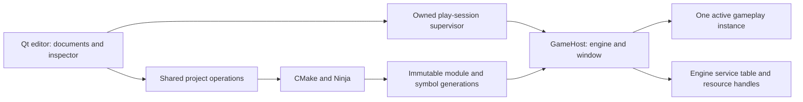

# Ludus project loading and live editing architecture

Status: implementation contract, 2026-10-02. Baseline main:
`3fadacecd4c3856e0456341ea05507459d479a38`. This document describes work to build;
it does not claim an existing GameHost, gameplay ABI, inspector or hot reload.
Read [requirements](requirements.md), [tasks](tasks.md),
[research](../../../docs/architecture/project-live-reload-research.md) and
[handoff](../../../docs/architecture/project-live-reload-kiro-handoff.md).
AGENTS.md, steering and ADRs 0002/0003/0004/0005/0007/0009 remain authoritative.

## 1. Selected design and support

Use the optional Qt editor as a document/tooling client. A separately supervised
GameHost owns engine lifecycles, the game window and one play session. Only that
host loads a project's native gameplay module. Ordinary shipping builds link
the same gameplay implementation statically. Editor/Open executes no game code.

First support: Linux x64, pinned Clang 18/C++23, Debug and Development, and local
installed SDKs. Engine modules stay static. Native Windows/macOS loaders are
later acceptance targets, not implied by a file-extension abstraction. Browser
games continue to use static JS/Wasm builds and rebuild/page reload. Dynamic
Wasm, arbitrary binary patching and a browser editor are separate decisions.



The supervisor routes bounded asynchronous commands; it does not decide game
state transitions. One editor controller owns document/build/play UI state;
one host controller owns runtime mutation and reload. Keep ordinary functions,
typed records and explicit state machines. No general plugin registry, RPC
framework, global event bus, scripting language or reflection generator.

## 2. Layout and dependencies

Suggested small layout; combine implementation files where useful:

```text
modules/runtime/game_api/include/ludus/runtime/game_api/{api,properties}.h
modules/runtime/game_host/include/ludus/runtime/game_host/host.h
modules/runtime/game_host/src/{host,module_loader,reload,control,properties}.cpp
modules/runtime/game_host/src/internal/*.h
apps/game_host/main.cpp
apps/editor/src/{controller,play_session,property_model}.cpp
scripts/python/{cmake_targets,editor_tool,play_session,game_generations}.py
cmake/LudusGame.cmake
examples/live-edit-game/{CMakeLists.txt,CMakePresets.json,ludus.project.json,
                         ludus.play.json,game.tuning.json,src/game.cpp}
```

`Ludus::GameApi` is an installed, small INTERFACE target: Band 0 types, ABI
declarations and inexpensive wrappers only, with no engine implementation link.
`Ludus::GameHost` is a static runtime library with private Platform/RHI/Logging
dependencies and no Qt. The helper builds a project-owned host executable
against its selected installed SDK, plus a gameplay MODULE library and a static
shipping executable. Reuse the host library entry/lifecycle logic in both paths.
Game source has one implementation; selecting static dispatch replaces only the
module lookup. Avoid a permanent second engine runtime inside the module.

The module calls a passed engine service table, not host-exported C++ symbols.
Its dependency closure permits the matching compiler runtime and explicitly
audited stateless utilities, but not another Platform/RHI/logger singleton or
reloadable third-party module. Verify symbol/dependency tables in the acceptance
spike. Game code is trusted developer code; neither a C ABI nor another process
is a security sandbox. Recoverable returned errors and native crashes differ.

Public headers use Ludus aliases, explicit includes, no private/heavy headers,
`#pragma once`, and non-template implementation boundaries. Production and game
targets keep `-fno-exceptions`, warnings-as-errors and `noexcept` callbacks.
Use existing logging and allocation vocabulary; do not build new containers.

## 3. Project open, switch and unload

Retain existing v1 descriptors/executable Run and the v2 SDK workflow contract.
Add an optional fixed sibling `ludus.play.json` so this feature need not change
the descriptor schema being implemented by project-sdk-workflow. Its version-1
closed schema contains `version`, `host_target`, `module_target`,
`startup_document`, and `watch_roots`; all paths are project-relative and
contained. Optional local auto-build/reload preferences stay in ignored local
settings; default to manual Build and Reload. No arbitrary adapter path/hooks.
Apply the existing 64 KiB descriptor and path/target/UTF-8 bounds; limit watch
roots to 16. Unknown version/fields fail with expected/actual diagnostics.

Example sidecar (target names must resolve in the actual CMake codemodel):

```json
{
  "version": 1,
  "host_target": "sample_host",
  "module_target": "sample_game_module",
  "startup_document": "game.tuning.json",
  "watch_roots": ["src"]
}
```

Open validates descriptors, source documents and selected SDK metadata, resolves
paths and displays unavailable capabilities. The shared project setup inspector
may invoke the selected CMake executable only for `--list-presets=configure`,
`--list-presets=build` and `--list-presets=test`; it does not evaluate the
project's CMakeLists, configure, build, download dependencies or write files.
Build and Play are explicit code-executing operations. Dirty source documents
may remain editable during Play; descriptor/SDK/target changes are for the next
session.
Never silently save documents just to build. A saved tuning revision is not
automatically equivalent to the values currently simulated.

Switch prepares and validates the next document first. A failed open leaves the
current workspace intact. Before committing a switch/close, resolve dirty
documents through the existing save/discard/cancel workflow, latch Stop, cancel
build/reload/watch work, confirm owned-process cleanup, release artifact leases
and callbacks, then advance ProjectEpoch. Never force a project switch on
CleanupUnknown. Watchers/timers carry the epoch; late notifications are inert.

Play launches the project's matching host target, waits for protocol Hello and
SessionReady, then loads the generation. Process start alone is not ModuleReady
or proof of a rendered frame. Stop is idempotent and wins before any late spawn
or reload commit; no action automatically starts a new play session afterward.

## 4. Three independent operation lanes

Document state, BuildState and PlayState are orthogonal values under one owner:

- BuildState: Idle, Configuring, Building, Publishing, Cancelling, Failed.
- PlayState: Stopped, Starting, Running, Paused, Reloading, Stopping,
  Failed, CleanupUnknown.
- ReloadPhase inside the host: Validate, Quiesce, Snapshot, Stage, Commit, Retire.

At most one build writer and one play session are owned per editor workspace;
only one host mutation transaction runs at a time. Building does not pause
gameplay. Properties apply between frames. Reload serializes against property,
asset and pause/step commands. Stop supersedes queued work. Initially reject
mutations during Reloading with Busy instead of retaining a hidden backlog.

The existing E0 adapter holds the build-tree lock throughout Run. That cannot
serve build-while-playing. For the new module path, separate build publication
from a dedicated session supervisor: hold the shared build lock only through
configure/build/verify/publication, then release it. A session lease protects
the immutable generation instead of the mutable build tree. Preserve E0
cleanup/argv/cancellation behavior and test other CLI/editor instances against
the same build lock. Do not remove concurrency protection to enable iteration.

## 5. Build generations and source changes

CMake remains authoritative. Extend the shared File API resolver to handle one
MODULE_LIBRARY artifact and an explicit host EXECUTABLE artifact. Do not guess
platform suffixes or derive output paths from target names. Re-read target,
configuration and source/build identity after successful builds/regeneration.
Failed/cancelled builds never publish or activate an existing stale artifact.

Under the build lock, copy the successfully linked module, matching debug
symbols and a bounded generated manifest into a private staging directory,
verify them, then atomically publish a unique generation directory. Its metadata
records schema, project identity, build request/input revision, exact SDK/build
identity, target triple, compiler/runtime/policy/sanitizers, ABI versions,
property/checkpoint schema, entry symbol and file hashes. Keep generated metadata
and embedded ABI metadata consistent. Manifest maximum 64 KiB, at most 16
payload files; v1 payload is module plus symbols, not a dynamic plugin graph.
IDs are opaque; no reuse/overwrite of a published generation.

Load from an absolute canonical path inside the leased generation. Copying or
linking must finish before ready publication; file watcher events are only
hints, never permission to load a half-written library. Hash verification detects
corruption, not hostile code. Retain symbol files until session/debugger leases
end. On Linux use `dlopen` with immediate resolution/local scope, hidden default
visibility and exactly one public entry; do not export the host's whole symbol
table or rely on RTLD_LOCAL as isolation. Windows later uses a reviewed explicit
dependency-search policy and generation-specific DLL/PDB files.

Source watching is opt-in, debounced (initial 450 ms), excludes output/.git/SDK
roots, and uses saved files. One active build plus one newest pending revision;
coalesce bursts and cancel superseded requests where safe. Capture hashes for
declared source inputs and configured dependency inputs before/after build and
again before publication. If they change, label the result Superseded and rebuild;
never label it the latest source. External generated inputs need declared CMake
dependencies. This conservative check is not a hermetic source snapshot or
deterministic-build guarantee. Offer manual build for projects outside that
contract. Activation checks epoch/session/SDK/target and newest non-superseded
request again. Changing the SDK requires a new host session, never hot reload.

Garbage collection uses owned leases and a short retention policy; it never
deletes active/candidate/symbol generations. A crashed session's lease becomes
reclaimable only after proving its process ended. Default capacity: active,
candidate and previous generation; retirement failure disables further reload
before accumulating an unbounded chain. Files can be retained for diagnostics.

## 6. Native ABI and memory contract

Export one unmangled `LudusGetGameApi` with a platform-defined calling convention.
It fills a caller-provided table of `noexcept` function pointers and returns an
explicit status. Host-owned table storage survives module metadata lifetimes.
Define concrete POD layouts with size/version/reserved fields and measured
size/alignment/offset assertions on each supported target. A C-compatible binary
layout does not promise arbitrary compiler/platform compatibility or require a
second C header/type system: the first authoring language remains C++23.

Mandatory operations: Query/Create/Destroy/Update. Reload-capable modules also
provide Quiesce/Resume, WriteCheckpoint, CreateCandidate and ValidateCandidate.
Live editing adds DescribeProperties/ReadProperties/PrepareEdits/CommitEdits/
DiscardEdits. Separate size negotiation from writing bounded caller buffers.
Unsupported optional capabilities are visible; lack of reload support offers
explicit Restart, never a guessed state-preserving reload.

Boundary records use fixed-width integers, explicit enum representations,
byte/string views and opaque handles. `usize` is correct for in-process buffer
sizes on the matching target; wire/on-disk lengths use explicitly encoded
fixed-width integers with checked conversion. No C++ classes/vtables, STL
containers, `std::function`, exceptions or raw resource pointers cross the ABI.
An opaque module instance pointer is returned only to its owning module's
callbacks and is invalid after Destroy. Borrowed views last only for that call;
host copies schema/text it retains. Module objects/plans are destroyed by that
module before releasing its loader reference. Host service allocations are
released through matching host services; no cross-module `delete`.

Host services cover explicit diagnostics, bounded allocation, frame/input data,
resource IDs and the sample's render parameters. Grow the table with concrete
consumer requirements rather than forwarding every engine API speculatively.
Service handles include session and resource generation; callbacks additionally
include module generation. Cached function pointers, queued destructors and
asynchronous completions must be owned and counted, never borrowed indefinitely.
Initially gameplay callbacks run on the host thread and gameplay has no custom
threads, detached jobs, TLS state, global registration or side-effecting static
constructors/destructors. Later jobs require a host-managed generation lease.

Match ABI major/table size, exact SDK/build ID, architecture, calling convention,
runtime, assertion policy and sanitizer configuration before Create. Check the
manifest before dlopen, then embedded Query metadata after load. Native loader
constructors can execute before Query; validation is not sandboxing. Keep entry
lookup and ordinary loader failures explicit and distinguish them from crashes.

## 7. Reload transaction and its limits

The active module A keeps its instance and loader reference until candidate B
is accepted. Do not destroy A to make room for B. Old and new images have unique
paths and hidden internals. Statically linked third-party dependencies and
symbols must pass the two-generation coexistence spike.

1. Validate generation/manifest/compatibility; load B and copy Query table.
   Load/Query failure leaves A running unless native code crashes the host.
2. At a frame boundary gate new gameplay dispatch and record prior pause state.
   Quiesce A, drain all tracked generation work and revoke temporary callbacks.
3. Write A's read-only checkpoint into bounded host storage. Capture host-owned
   session facts and resource leases. Quiesce and checkpoint failure must leave
   A resumable; the callbacks may not irreversibly mutate it.
4. Create and validate B in a staging context, using checkpoint, authored
   document revision and resource-ID mappings. Staging can read active resources,
   allocate candidate-owned data/resources and prepare bounded host commands.
   It cannot mutate active resources, register active callbacks, spawn threads,
   perform external I/O or produce audible/network/gameplay side effects.
5. Prepare the complete host change set and all allocations/resource ownership
   transfers. Validate it without touching active state. Commit is a non-failing
   host-thread dispatch/context swap; no user callback/allocation inside it.
   Publish new generation, schema epoch and result together.
6. Destroy A with its old services in a retired context, revoke remaining A
   references, release its loader handle, and resume B in the prior pause state.
   Destruction may release A-owned resources, not mutate B's live state.

On recoverable failure before commit, destroy B in staging, discard its change
set and Resume A with original instance/state/resource identities. Tests must
verify state/resource equality, not just a ReloadFailed message. If Quiesce,
Resume, Destroy or loader code hangs/crashes, supervisor Stop/restart is the
recovery; a wall-clock timeout cannot safely preempt native C++ on its own thread.
After commit there is no promised rollback of arbitrary native side effects.
Retire failure records active B plus RestartRequired and prevents another reload.

This is a cooperative transaction contract for supported modules/services.
It is not a generic snapshot of every engine subsystem. New services need
staging/commit/retire semantics before being declared reload-safe. Modules using
unsupported resources, external I/O or raw engine access require Restart. Do
not implement a universal shadow ECS/physics/audio world to satisfy this phase.

Logical retirement and OS unmapping are different: releasing a loader reference
does not prove all pages were unmapped. Exclude unload-unsafe module dependencies,
audit handles/callbacks, measure mappings/RSS across repeated reloads, and restart
with a clear message when resident generations exceed the agreed budget.

## 8. Checkpoints and schema migration

Checkpoints are explicit module-defined tagged records, never a memory dump.
Envelope: format version, project/game/schema IDs, schema version, module build
ID, body byte length and digest. Maximum body 16 MiB initially; game declares a
smaller limit where possible. All readers validate lengths, depth/count limits,
duplicates, enums, finite floats, IDs and resource references before use.
Name fields with stable IDs; enum values and IDs are never inferred from ordering,
RTTI, type names, member offsets or compiler-generated hashes.

Game state includes its intentional simulation time, random-generator state,
player state and relevant transient state. Host time/input pause semantics are
documented by the sample. Handles serialize logical IDs, then rebind through the
host. Caches, pointers, OS handles and function pointers rebuild or reset.

Simulation time does not advance during a reload pause or catch up afterward.
Step advances one configured fixed simulation tick while paused. Resume clears
queued input edge events accumulated during the pause and refreshes held-state
input through the existing Platform contract; the sample documents this behavior.

B explicitly accepts A's checkpoint schema or provides a migration to its own
schema. Missing fields get declared defaults; removals/renames/type changes have
explicit policies and fixtures. Unknown mandatory fields reject. Unsupported
migration leaves A intact and offers Restart from the authored document; no
automatic state reset. Checkpoints are reload data, not a promised cross-release
save-game format. Durable saves require their own compatibility contract.

## 9. Live properties, documents, undo and assets

Provide a small opt-in property schema, copied into the editor over IPC. Stable
object/property IDs, object generation, schema version, kind, display label,
read/write flags, bounds/default and persistence scope are sufficient. Start
with bool, int32, finite float32, enum and bounded UTF-8 strings; the sample can
use a few scalar fields. Explicit handwritten tables/accessors are the baseline.
No editor widget stores a pointer or member offset into a game instance.

ReadProperties returns copied values and object revision. An edit transaction
contains object/generation/schema IDs, expected revision, command ID and typed
new values. Validate on receipt and at the safe boundary; PrepareEdits builds a
module-owned plan without active mutation, CommitEdits applies it without failure
or external side effects, DiscardEdits releases it. The host advances revision
and reports actual values after commit. Multi-property edits are all-or-none.
Game simulation changes to exposed mutable values must advance their revision;
read-only simulation fields do not pretend to be editable authored parameters.
Conflicts return current values/revision; do not overwrite newer runtime edits.

Editor source documents and runtime play values have distinct ownership.
Authoring documents use named, versioned JSON in small logical files, atomic
save/conflict detection and undo/redo. Play starts from a copied saved document;
live edits default to session-only. Apply to Document is an explicit selection
of persistable fields with expected disk/document revision. It produces a dirty
document command; normal Save persists it. Stop/reload never auto-save gameplay
state or reset an edited draft. Runtime Undo uses a new conditional command;
if simulation has changed that value, report conflict instead of pretending undo
reverted time. Coalesce slider drags into one undo operation with final ack.

Across code reload, stable IDs preserve selection and document history. Invalidate
old runtime schema/undo plans; present schema-changed errors and fetch new values.
Undo a compatible runtime value only through a newly validated current command.
No v1 scene graph/ECS, arbitrary object creation/deletion or gizmo authoring.
The sample exposes existing objects and tuning documents; that delivers actual
editing during play without making scene authoring a prerequisite.

Asset reload is another host command with logical asset ID, expected generation
and immutable cooked artifact digest. Watch source inputs, import/validate in
tooling, create replacement resource, swap at the owning subsystem's safe point,
and defer destruction until its GPU/audio users finish. Failed imports retain
the old asset. Do not edit generated files as source. First implement one
supported fixture (e.g. shader/uniform-backed render configuration using current
public APIs); full texture/model/audio importing follows their resource APIs.
Report unsupported asset kinds. A code reload does not reload all assets.

## 10. Local IPC and process ownership

Reuse E0 QProcess/Python supervision, exact argv/cwd, process-group cleanup and
failure vocabulary. Introduce a versioned persistent play-session protocol;
do not reinterpret old E0 frames. Editor-to-supervisor uses bounded JSON lines
on control pipes. Supervisor-to-host uses a private inherited local socketpair
with 4-byte little-endian length plus UTF-8 JSON, on separate descriptors from
logs. No listening network port or discovery service. Host I/O worker has no
game callbacks; it queues owned validated commands for host-frame dispatch.

Every frame carries protocol version, ProjectEpoch, SessionId, RequestId and
where applicable ModuleGeneration, SchemaEpoch and expected object revision.
IDs are fixed-length hex in JSON to avoid float precision loss. Minimum commands:
Hello, Status, Load, Pause, Resume, Step, Reload, ReadProperties, ApplyEdits,
ReloadAsset and Stop. Events include SessionReady, ModuleReady, CommandResult,
PropertiesChanged, ReloadPhase and SessionEnded. Ready events declare actual
capabilities/build identity. Separate request receipt from successful mutation.

CommandResult contains RequestId, terminal status/message, active generation,
schema epoch and affected object revision/actual values when applicable. Use the
existing failure vocabulary plus explicit IncompatibleModule, Superseded,
ReloadRejected, RestartRequired, StaleRevision and SchemaChanged. Ordinary returned
failure, native HostFailed and CleanupUnknown must remain distinguishable.
Identity counters may not wrap/reuse silently; retire a session before exhaustion.

Initial budgets: 64 KiB control frame, 256 KiB schema transfer, 256 objects/4096
properties, 4 KiB string, 128 pending commands/1 MiB total command queue. Chunked
schema transfers have an aggregate bound and explicit completion/digest; malformed
or incomplete transfers are errors. Property batches max 64 values. Checkpoints
stay inside the host, not base64-expanded on the control pipe. Log queues reuse
E0 byte/block bounds and credit/drop reporting. Mutation-result retention: at
most 128 IDs until acknowledged; stop accepting mutations when that ledger is
full. Stop has a dedicated latched control path and cannot be starved by logs.

Within a session, duplicate RequestId with the same payload returns the retained
result; a different payload rejects. No replay after result acknowledgement or
session change: unknown outcome requires Status plus fresh property/generation
read, not retrying a possibly applied mutation. Lost Reload reply reconciles with
the host's active generation and last transaction status. EOF cancels the session,
not reconnects it. Timeouts under an attached debugger show Paused/Unresponsive;
do not kill the host solely for a missed heartbeat. Explicit Stop still has the
existing supervisor TERM/KILL deadlines and reports forced cleanup.

Stop cancels builds, latches host shutdown, prevents late activation, waits for
ordinary descendants and releases leases after confirmed exit. Unexpected
supervisor loss/uncertain group identity becomes CleanupUnknown. Reuse non-reaping
Linux process identity rules. Process groups do not contain escaped sessions;
unsupported detached game subprocesses are outside the cooperative contract.

## 11. Debugging, evidence and delivery

Debug Game launches the host through the existing optional debugger provider;
attach is separate. Keep old/new symbols with generation/build IDs, source input
digests and original source paths. Do not remap breakpoints automatically without
tested debugger support. Reload is disabled while stopped inside old module code;
developer continues to a safe boundary first. Provide manual Reload and Restart
for a debugger that cannot track newly loaded symbols. Keep RAD optional and
record LLDB/GDB/RAD acceptance separately; a mocked launch proves no stepping.

Copy Session Details records project/SDK/build identity, argv/cwd, active/candidate
generation, document/schema revisions, commands/results, reload phase/timings,
exit/signal and cleanup certainty. Bounded local records, no telemetry/uploads.
Measure cold/warm build time, publication time, edit-to-visible latency, reload
pause p50/p95, checkpoint bytes and live resources/RSS across 100 reloads.
Targets for the small reference fixture: property ack within two running frames,
warm no-change publication under 1 s and reload pause p95 under 100 ms on the
recorded reference host. These are engineering targets, not asserted performance;
document measured misses rather than weaken correctness or hide work.

Deliver L0-L6 in tasks.md: ABI/coexistence spike; host/restart; immutable builds;
transactional reload; properties/documents; supported asset reload; integration
and hard CI/debug/SDK acceptance. Every phase adds an end-to-end fixture and
meaningful failure evidence. Publish one implementation PR targeting main and
continue fixes until all applicable exact-head checks and conflicts are resolved.
Do not skip checks, use continue-on-error for required acceptance, narrow triggers
to hide failures or mark missing hardware/tooling acceptance as passed. A blocked
acceptance leaves the PR draft with its specific blocker; no automatic merge.
