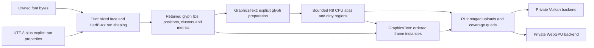

# Text/font rendering design

Status: selected architecture, ready for implementation. No milestone has passed.
Baseline: `fa0fc7f`, researched 2026-10-01. See [requirements.md](requirements.md),
[tasks.md](tasks.md), and [research](../../../docs/architecture/text-font-rendering-research.md).

## 1. Decisions and dependency direction

Implement two small modules and one narrow RHI facility:

| Owner | Responsibility | Dependencies |
| --- | --- | --- |
| `modules/text`, target `Ludus::Text` | Font bytes/faces, UTF-8 validation, shaping, metrics, temporary glyph coverage | Public FoundationBase; private Containers, Logging, FreeType, HarfBuzz |
| `modules/graphics/text`, target `Ludus::GraphicsText` | Coverage cache/atlas, preparation, draw-list construction, text diagnostics | Public Text, GraphicsRhi; private Containers, Logging, optional existing Profiling |
| GraphicsRhi, new public `coverage_quads.h` | R8 page resources/uploads, instanced coverage-quad pipeline, GPU lifetime | Its existing dependencies; no dependency on either text module |

Put exported headers under `include/ludus/text/` and
`include/ludus/graphics/text/`. Implementations and font/GPU headers remain
private. The RHI header exposes generic coverage rectangles and colors, never
font/layout types, `Vk*`, `WGPU*`, `FT_*`, or `hb_*` types. Foundation stays below
all of these modules. CPU text works without a window or GPU.



The implementation owns architecture choices here. Kiro should implement this
design, inspect the current code for integration changes, and document justified
corrections. It need not reproduce the research or ask for the source books.

## 2. Build and third-party configuration

Pin FreeType **2.14.3**, HarfBuzz **14.5.1**, and host shader compiler glslang
**15.4.0**. F0 records real archive URLs, source commits, SHA-256 hashes, licenses,
and effective options. Never invent checksums or fetch a moving branch.

Native dependency resolution stays in Conan 2 bootstrap, as ADR 0001 requires.
If an exact recipe is unavailable, add a small local recipe for that pin; do not
silently choose an older library. Web bootstrap obtains the same locked font
sources and builds them with the pinned Emscripten toolchain. Cache source
archives before configure. No `FetchContent` network access during CMake
configure/build, native library reuse inside wasm, or duplicate SDK font ports.

Build FreeType static, with external HarfBuzz/dynamic loading, PNG, Brotli, and
BZip2 disabled. Disable external zlib discovery as well; support here is TTF/OTF,
not compressed web fonts. Build HarfBuzz static with OpenType and FreeType
integration, its built-in Unicode functions, and no GLib, ICU, Graphite, Cairo,
platform font discovery, utilities, tests, subsetter, experimental GPU/vector/
raster libraries, or experimental font-provided wasm shaper. Use the exact
option spellings of the pinned sources and record them. FreeType first, then
HarfBuzz linking it, avoids a circular dependency. This sacrifices FreeType's
optional HarfBuzz-assisted auto-hinter; validate the selected light-hinting
quality in the fixtures rather than silently changing one platform's options.

Enable C for the FreeType build. Scope C++23, exception flags, project warnings,
and language-specific checks correctly. Engine and HarfBuzz C++ code must build
without exceptions. Treat dependency headers as private system includes; do not
weaken warning/tidy policy for Ludus sources. Make web tooling check the new
Ludus sources and avoid feeding vendored C/C++ dependencies into project-specific
naming/formatting checks. Preserve the existing web probes and toolchain pins.

Use glslang as a host tool for the two Vulkan GLSL shaders. Bootstrap its exact
source/build dependencies and hashes; it is not linked into engine code. Generate
SPIR-V at build time with a pinned invocation/target compatible with the actual
Vulkan device path. Embed generated words privately. WGSL is a small checked-in
equivalent embedded privately for web. Document and test their common instance
layout and behavior. Do not require executing a wasm compiler as a host tool.

Package one fixed Latin TTF, a static Hangul-capable TTF/OTF, and a static Arabic
TTF/OTF for fixtures, with exact hashes and redistribution licenses. Use suitably
licensed Noto static faces; subset only with a recorded reproducible tool/script
that retains the needed OpenType shaping tables. Include font bytes/licenses in
the demo/test assets accessible to Kiro, not `references/`. No system-font or
network-fetch assumption is allowed at application startup. Browser demo font
bytes can be Emscripten-preloaded; core loading takes bytes on both platforms.

## 3. Public CPU text contract

API names below describe the intended vocabulary; follow existing naming when
writing the exact headers. Keep small structs, opaque context pointers/owners,
generation IDs, `string_view`, and explicit spans. No public heavy templates.

| Operation | Contract |
| --- | --- |
| `CreateFontSystem(config, outSystem)` / `DestroyFontSystem` | Fallible owned context; creation failure publishes no owner. Destruction returns `Busy` if a renderer still references it. Shutdown is safe after partial creation. |
| `LoadFont(system, bytes, faceIndex, outFont)` | Copies bounded bytes; creates an outline face and referenced HarfBuzz font. Returns an invalid output ID on failure. |
| `UnloadFont(system, font)` | Checks generation and live layouts; returns `Busy` if referenced, otherwise releases hb/FT objects before bytes. |
| `ShapeRun(system, font, utf8, runSpec, outLayout)` | Owns an immutable layout and its source UTF-8. Publishes only a complete result. Empty input is valid. |
| `GetLayout(system, layout, outView)` | Borrows glyph/metric/source views; valid until that layout or the system is destroyed. Other layouts cannot relocate its storage. |
| `DestroyLayout(system, layout)` | Releases owned storage/font reference; stale IDs return `InvalidHandle`. |
| `RasterizeGlyph(system, font, pixelHeight, glyphId, outBitmap)` | Explicit cold operation. Borrowed normalized coverage scratch remains valid only until the next raster call or system destruction; caller copies it immediately. |

`FontId` and `LayoutId` each carry slot index plus nonzero generation; zero is
invalid. Prevent generation wrap from making an old handle valid again (retire a
slot at wrap). Never store a raw caller byte pointer in FT/HarfBuzz. The context
and all its mutable FT faces are used by one owning application thread; no locks,
worker, or process-global font cache is required.

`RunSpec` contains integer `PixelHeight`, `Direction` (`LTR` or `RTL`), an
ISO 15924 script tag, and a bounded language tag (default `und`). Use the normal
HarfBuzz feature defaults, including font kerning/ligatures and required script
features. Initially omit a general feature-range parser. A Latin-LTR convenience
entry point may supply `Latn/und` explicitly. No convenience function shall
pretend to handle an arbitrary mixed-script paragraph.

Use HarfBuzz Unicode properties to reject strong script characters inconsistent
with the supplied script, allowing Common/Inherited characters within a run.
Reject LF, CR, tabs, NUL, bidi paragraph controls, and unsupported control text
in this single-run API with `UnsupportedText`. Permit shaping controls needed
inside supported runs, such as ZWJ/ZWNJ and variation selectors. This is input
validation for the declared contract, not implementation of the bidi algorithm.
An app helper may split CRLF/LF and submit separate runs at successive baselines;
the demo uses separate explicitly scripted lines. General automatic wrapping,
Unicode segmentation, mixed-direction analysis, and fallback require a later
paragraph-layer specification, including UAX #9/#14 and cluster-safe boundaries.

Use a shared strict UTF-8 decoder before calling HarfBuzz. Add UTF-8 with explicit
length, set direction/script/language and
`HB_BUFFER_CLUSTER_LEVEL_MONOTONE_GRAPHEMES`, then shape. Copy glyph ID, UTF-8
byte cluster, signed x/y advance, and signed x/y offset in **26.6 physical pixel
units** into owned layout data. Clusters are diagnostic provenance, not a
complete caret/grapheme API. Keep HarfBuzz's returned sequence and signed values
for both directions. Do not add FreeType kerning to those positions.

Use `hb_ft_font_create_referenced` with a sized FT face and identical
`FT_LOAD_TARGET_LIGHT | FT_LOAD_NO_BITMAP` load flags for metrics/rasterization.
When changing the FT size/properties, call `hb_ft_font_changed` and set hb-ft load
flags consistently before shaping. Render outlines with `FT_RENDER_MODE_NORMAL`.
Restore/reapply the requested state before each operation; alternating sizes
must not contaminate results. No untracked variation/transform/synthetic state.

Check FreeType error codes, HarfBuzz empty/failure objects, and
`hb_buffer_allocation_successful`, plus output count/coordinate bounds. Third
party cold allocation may occur; do not promise allocation-free shaping. Use
the existing fallible Ludus container seam for owned engine buffers and FT's
allocation/error boundary as appropriate. A proposed allocator module is not a
prerequisite. Test engine allocation failure and library failure independently.

Layouts record face/size identity, original bytes, glyph records, baseline-relative
ink bounds, advance vector, ascent, descent, and line advance. Distinguish advance
from visible bounds. Keep spaces/zero-area glyphs in the glyph list. Inspect glyph
zero (`.notdef`) and count/report missing glyphs without guessing a fallback font.
For unsupported bitmap-only/color-only glyph data return `UnsupportedFont` or
`UnsupportedGlyphFormat`; never accidentally treat BGRA/LCD as grayscale.

## 4. Coordinates, metrics, and DPI

The engine text API uses **physical framebuffer pixels**, top-left origin,
x increasing right, y increasing down. The caller supplies a baseline; font
height means the sized face's EM pixel height, not the ink bounding-box height.
CPU shape positions remain signed 26.6 values until draw-list conversion.

For a glyph at pen `(px, py)` with HarfBuzz offset `(ox, oy)` and FreeType bitmap
bearing `(left, top)`, the unsnapped bitmap top-left is:

```text
x = baseline.x + (px + ox) / 64 + left
y = baseline.y - (py + oy) / 64 - top
pen += HarfBuzz advance
```

There is exactly one y-axis inversion. Sum/check positions in a sufficiently
wide signed intermediate before conversion. Derive ink bounds from these
placements and glyph extents, not `strlen`, maximum advance, or byte count.
Ascent/descent use positive screen distances above/below the baseline; line
advance is a separately reported sized font metric. Include overhangs and marks.

First implementation snaps each emitted mask origin with `floor(value + 0.5)`
to physical pixel boundaries, retaining fractional advances in the layout. Report
unsnapped measurement and define snapped draw bounds conservatively (up to one
pixel rounding difference); tests distinguish these. Glyph bitmaps render 1:1.
No independent snapping of UVs, arbitrary post-layout scale, or historical
half-pixel clip-space offset. Font size is rerasterized after scale changes.

In the demo, `physicalPosition = logicalPosition * contentScale` and
`PixelHeight = floor(logicalFontHeight * contentScale + 0.5)`, validated against
configured limits. Web content scale comes from actual DPR/backing-store sizing;
native scale comes from Platform's current support (1.0 when unavailable, stated
in evidence). Use actual RHI attachment extent for clipping/projection. Do not
claim tested native fractional scaling if Platform cannot supply it yet.

## 5. Coverage cache and atlas

GraphicsText owns the cache and CPU shadow pages. Keep rasterization in Text so
it remains independently testable. Copy raster scratch before the next FT call.
Normalize negative pitch into top-down, tightly packed unsigned R8 coverage;
width is not a stride. Empty bitmap + valid metrics is a cached no-image glyph.
Validate every rectangle, `abs(pitch)` edge case, row offset, and byte size.

Use a fixed-capacity open-addressed lookup table with at most 50% occupied
buckets and a stable full-key comparison. Key:
`(font slot+generation, glyph ID, PixelHeight, grayscale-light mode)`.
The initial mode is fixed; making it part of the internal key avoids later
accidental cross-mode hits. Cache entries store metrics, page/rectangle, and
atlas generation. Layouts store **no UVs or atlas pointers**.

Use deterministic append-only shelves. Allocate a rectangle `(width+2, height+2)`
for a one-texel transparent gutter on all sides; do not rotate. Place in the first
existing shelf with sufficient height/remaining width; otherwise append a shelf
to the first page that fits, otherwise activate a bounded new page. Insert only
after all copies/metadata capacity checks succeed. Do not sort live layouts or
move prior rectangles to improve packing. Keep placement/fit functions separate
and directly unit-testable. No irregular mask/mesh packer is needed.

Initialize pages to zero. Only the interior receives coverage. Sample with a
linear clamp sampler, base mip only, no anisotropy or mip chain. Map quad edges
to the interior texel **edges** (`x/pageWidth` to `(x+width)/pageWidth`); at 1:1,
pixel centers sample texel centers. Do not inset half a texel and distort the
glyph. Gutters isolate neighboring letters under interpolation.

Retain one CPU byte per texel for deterministic dump and device restoration.
Track bounded dirty rectangles; when the list reaches its cap, merge affected
regions/page bounds rather than dropping updates. Uploads include transparent
gutters. Raster/cache counts, allocated/used area, failed fits, page count, dirty
bytes, and retained bytes are observable. Report interior occupancy and reserved
rectangle occupancy separately.

No eviction or in-place repacking in this milestone. `ResetAtlas` is allowed only
outside a built/open frame and retires old GPU resources safely; it increments
the atlas generation, clears entries/preparation tokens, and rebuilds empty
pages. Existing layouts remain valid and can be prepared again. Size churn may
reach the budget: callers deliberately reset/recreate with a larger validated
configuration at a safe boundary. Never reset behind a caller's successful draw.

## 6. Defaults, capacities, and failure

These are initial defaults to implement and measure, not hidden magic constants:

| Budget | Default | Behavior at limit |
| --- | --- | --- |
| Loaded faces | 8 | `ResourceLimit` |
| Font byte storage | 32 MiB per font, 64 MiB total | Reject before copying |
| Live layouts | 256 | `ResourceLimit` |
| Run input / glyph output | 16,384 UTF-8 bytes / 4,096 glyphs | Validate input and shaped output; no truncation |
| Total retained glyph records | 65,536 | Fallible layout creation |
| Physical EM height | 1–256 px | `InvalidArgument` outside range |
| R8 pages | 4 × 1024 × 1024 | 4 MiB CPU and 4 MiB GPU texels, excluding metadata/staging |
| Cached glyph entries / lookup buckets | 8,192 / 16,384 | `ResourceLimit`, no eviction |
| Frame instances | 16,384 | Atomic rejection of a draw request that cannot fit |
| Frame batches | 16,384 maximum | Covers worst-case alternating pages/scissors |
| Dirty rectangles | 256 | Conservative bounded coalescing |
| Staged upload bytes per frame | 1 MiB including row padding | Leave pending work for a later frame |

Validate configuration against device texture/buffer limits, representable
counts, and checked size arithmetic before allocation. Reserve renderer/frame
arrays and cache metadata at creation, not during warm draws. Engine allocations
can fail; return `OutOfMemory` and clean up. Font-library internal storage is
outside these engine byte counts and is reported as such; these are not promises
about total process RSS. A glyph taller/wider than a page minus gutters returns
`ResourceLimit` even if other pages are empty.

Use a shared public status vocabulary: `Ok`, `Pending`, `NotReady`,
`InvalidArgument`, `InvalidHandle`, `InvalidUtf8`, `UnsupportedText`,
`UnsupportedFont`, `UnsupportedGlyphFormat`, `UnsupportedPresentation`,
`NeedsPreparation`, `Busy`,
`ResourceLimit`, `OutOfMemory`, `BackendFailure`, `DeviceLost`. Map backend/library
details into bounded diagnostics. `Pending` denotes staged/asynchronous progress,
never success that can be drawn immediately.

Public output IDs/views are invalid on failure. Shape/load do not publish partial
owners. Failed preparation may retain already completed cache entries and dirty
data, but publishes no success token for an incomplete layout; retry is safe.
Failed `AddLayout` appends no instances/batches for that request. A failed upload
does not clear unaccepted dirty data. A failed/lost frame invalidates its draw
list and does not leave fences/resources pretending it submitted successfully.

## 7. Preparation and frame contract

GraphicsText renderer references a live FontSystem and the current RHI device
generation. Create it after RHI becomes ready. Its resource state is
`Pending/Ready/Failed/DeviceLost`; CPU font/layout operations are independent.
Only one active application render thread and current RHI window are needed.

Public renderer operations comprise creation/status/destruction,
`PrepareLayout`, `FlushUploads`, `BeginDrawList`, `AddLayout`, `Submit`, cache
reset, and diagnostic reads. Preparation records include layout and atlas/device
generation. Layout mutation is impossible; destruction/recreation produces a
different ID. No hidden global string-to-layout cache is required: apps retain
layouts and rebuild only changed labels or size/style changes.

The canonical application sequence is:

```text
on font/text/size change: ShapeRun; keep the resulting layout
outside the GPU frame: PrepareLayout for any cold layouts
outside the GPU frame: FlushUploads with bounded progress; poll renderer readiness
set/obtain the current framebuffer target
RHI BeginFrameStatus: skip safely unless Ready
BeginDrawList using current frame/device/atlas generation and actual extent
AddLayout in painter order with baseline, straight linear color, opacity, clip
Submit coverage batches in the current frame
RHI EndFrameStatus
```

`PrepareLayout` ensures all nonempty glyphs are cached. It may allocate/rasterize
and return an explicit error. `FlushUploads` copies accepted data into RHI-owned
bounded staging before the frame, retaining pending regions when its budget is
exhausted. Return `Pending` until all current dirty regions are accepted. Initial
page clears/recovery uploads also count toward progress. Do not spin until done;
the demo can display a loading status and continue servicing Platform/browser
events. A prepared layout cannot be drawn until required uploads have been
accepted and the RHI has ordered them before its draw. A coarse first policy
may require the renderer's entire dirty queue to be accepted before any text
submission; make this predictable and expose its status.

Reset the upload budget on a new RHI frame, not on each `FlushUploads` call.
Continue presenting clear/scene frames while preparation is pending so upload
and browser callback progress is possible. Preparation readiness before Begin
means data is staged; it becomes sampleable when Begin orders that staged work.

`AddLayout` checks all needed cache entries and limits before appending; it never
calls HarfBuzz/FreeType. It copies only final instances, so layout destruction
after a successful add need not invalidate the built list. An empty clip succeeds
without work. An absent entry returns `NeedsPreparation`. Atlas reset, device
restart, or a different active frame invalidates the list; `Submit` checks all
generations. Clear per-frame data on submit/end/failure. No draw list survives
across frames, and CPU arrays can be reused once RHI has copied them.

## 8. Minimal RHI drawing contract

Add `coverage_quads.h` with opaque renderer/page handles, lifecycle/status queries,
page creation/release, staged rectangle updates, current frame info, and batch
submission. Keep font semantics above RHI. Do not expose the probe's borrowed
device or pass. Implement equivalent private operations in both backends.

`CoverageQuad` is exactly three `float32` vectors of four components:
pixel rectangle `(x,y,width,height)`, UV bounds `(u0,v0,u1,v1)`, and straight
linear `(r,g,b,opacity)`; 48 bytes, explicit alignment/offset checks. Use instanced
vertex attributes and `vertex_index`/`gl_VertexIndex` to generate six corners.
No per-glyph index/vertex allocation, storage-buffer feature, descriptor indexing,
bindless texture array, or compute shader is necessary. The CPU owns page/scissor
batch ranges outside the instance. Backend submission copies caller data during
the call; callbacks cannot retain caller spans.

Use one R8 sampled texture and binding per active page. One draw call per adjacent
compatible page/scissor run; never globally sort translucent glyphs by page.
Validate instance ranges, handles, sampled-page readiness, clips, and frame state.
Use triangle-list topology, no culling, no depth/stencil, sample count matching
the attachment (initially 1), and a viewport covering actual attachment extent.

`FrameInfo` reports physical extent, device generation, frame identity, and the
color-attachment policy without exposing backend enums. Coverage draws occur
between successful Begin/End frame operations. Stage uploads only outside an
open frame. Queued data remains owned if Begin returns `Skipped`; drain it before
the first successful draw. On native, insert transfer work before starting the
color pass; on web, order queue writes/copies before rendering. Do not attempt
copy commands inside an active render pass.

### Vulkan

Implement real color-attachment recording on the existing acquired swapchain
image, preserving the frame clear and submission/presentation behavior. Use
image views and a render pass or compatible existing rendering path supported
by the enabled device features; do not assume a newly enabled Vulkan feature.
The present/transfer/shader-read/color-attachment transitions, access masks, and
semaphore/fence sequencing must cover real submissions.

Use a small fixed descriptor pool/set per page and a reusable per-in-flight-frame
instance/staging buffer. Reuse mapped memory only after its frame fence retires;
flush noncoherent ranges with valid atom alignment. GPU retirement also governs
texture/descriptors/pipeline destruction. Swapchain recreation replaces extent-
or format-dependent resources at a safe boundary. Fix dependent acquire/failure
paths if needed: a fence reset without a following submission must not leave the
next frame waiting forever. Keep the fix narrow and covered by lifecycle tests.

Choose a supported SDR sRGB swapchain attachment format, rather than the current
hard-coded unorm assumption. Query real surface formats. If no supported sRGB
attachment is available, report an explicit unsupported presentation policy;
do not silently claim equivalent color quality. Preserve headless startup/status
behavior without creating a pretend GPU font renderer.

### WebGPU

Use the pinned EmDawn C API. Keep the preferred base canvas format, configure its
compatible sRGB `viewFormats`, create the attachment view with that sRGB format,
and build the pipeline against **the view format**. Verify the selected port's
validation/callback behavior. Track base surface format separately from draw
attachment format. Update the existing triangle's format integration if necessary
without regressing its lifecycle. Never pass an sRGB format as the base canvas
format just to make the text pipeline match.

Use sampled `R8Unorm` pages, vertex-instance buffers, and bounded staged uploads.
If using buffer-to-texture copies, pad rows to the required 256-byte alignment
and count padded bytes. `queue.writeTexture` has different row-layout rules;
do not generalize that copy-buffer restriction to all upload APIs. Pick one
tested path and keep CPU source ownership/copy semantics explicit.

Follow current generation-guarded startup/loss behavior. Wrap asynchronous
pipeline/validation completion in renderer/device generation checks; late results
release their handles without touching a destroyed owner. Do not block a browser
callback, wait synchronously for submitted work, enable wasm threads/SAB/COOP
just for fonts, or require special browser flags. On loss, discard GPU state and
draw lists; retain valid CPU faces/layouts/atlas bytes. On restart, recreate pages,
reupload bounded CPU shadows, invalidate old preparation tokens, and become ready
only when prerequisites are satisfied.

## 9. Shader math and compositing

For a corner in physical pixels `(x,y)` and extent `(W,H)`, WebGPU clip space is
`(2*x/W-1, 1-2*y/H, 0, 1)`. Vulkan must produce the same top-left image using a
documented viewport/clip-y convention; its framebuffer viewport convention must
not invert y twice. Use actual `W/H`, not CSS width/height. A projection uniform
is small and updated once per frame. Reject zero extent before division.

Fragment operation:

```text
coverage = sample R8 mask's red channel
a = coverage * opacity
output = (linearRGB * a, a)
blend RGB and alpha: src ONE, dst ONE_MINUS_SRC_ALPHA, operation ADD
```

The atlas is linear coverage. The attachment view performs sRGB encoding and
decoding for blending; do not manually gamma-correct coverage, encode RGB again
in the text shader, or premultiply twice. Document how the app converts sRGB UI
colors to the API's linear colors. The initial canvas/native presentation is
opaque SDR; opacity still controls glyph blending into the scene. Transparent
canvas and HDR color management are separate later contracts.

Rectangular clips are half-open `[left,right) × [top,bottom)`, rounded outward
when converting logical coordinates, clamped to the framebuffer, and represented
as validated integer scissor rectangles. Avoid signed underflow for off-screen
positions. Test partial glyph clips and page changes with overlapping colors.

## 10. Diagnostics, tests, and optimization policy

Offer bounded debug reads/dumps of source-byte cluster → glyph ID/position,
font/size metrics, atlas page/rectangle/generation, raster coverage, dirty upload
regions, instance/batch/scissor ranges, and renderer/device state. Label counters
for cache hits/misses, rasterizations, glyph/quad count, missing glyphs, pages,
occupancy, CPU/GPU retained bytes, upload bytes, draw calls, skipped frames,
resource-limit failures, and preparation/submission timing. Dumps are explicit
cold developer actions; ordinary diagnostics use existing logging.

Pixel fixtures cover kerning (`AV`), ligatures (`office`), combining accents,
Hangul, joining/marks in an explicitly RTL Arabic run, negative bearings, spaces,
empty text, `.notdef`, sizes 12/16/24/48, and DPR 1/1.5/2. Validate rows/pitch and
placement with small deterministic synthetic bitmap fixtures as well as fonts.
The same font hashes/library options should produce the same normalized CPU
glyphs and shaped data on native/wasm within documented metric tolerances.
Compare GPU output with a CPU reference using those exact masks and blending
rules; permit a measured tolerance for sampling/quantization, not whole-image
blur. Keep golden/reference provenance and test tolerances in the repository.

Measure retained warm labels separately from changing/cold strings. For 1k and
10k visible glyphs record median/p95 CPU build/submission time, draw calls,
instance bytes, atlas misses, uploads, engine allocations, browser wasm/download
size, and GPU time when available. Zero cold work and zero engine allocations
in repeated warm drawing are acceptance criteria. Do not invent universal FPS
or latency thresholds from book examples. Record hardware/build settings and
test before optimizing packing, instance compression, or introducing workers.

Respect installed SDK/include/build-budget checks. Test both exported targets
with private font/GPU includes absent. Preserve unrelated keyboard input and
WebGPU smoke/probe behavior. The completion matrix and evidence ledger are in
[tasks.md](tasks.md); real Linux and browser images are mandatory evidence.
