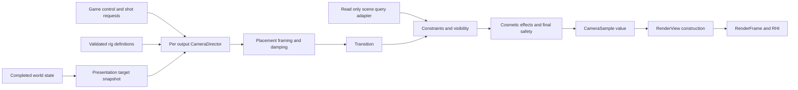

# Camera systems architecture

Status: Proposed design, originally recorded on October 5, 2026 against
repository HEAD `144a708`, and reconciled with `216083e` on October 6, 2026.
No camera runtime, performance result, or general 3D renderer is implemented by
this document.

Build a small camera system around one owner per output view, immutable rig
definitions, explicit mutable state, and a fixed sequence of ordinary functions.
The game chooses shots and supplies target snapshots; the camera evaluates a
pose and lens; the renderer constructs backend-independent render views and owns
their temporal history. This supports 2D and 3D without making a camera editor,
general behavior graph, physics engine, or ECS framework prerequisites.

Read [ownership and dependencies](#ownership-and-dependencies) for the module
boundaries, [the evaluation pipeline](#the-evaluation-pipeline) for frame behavior,
and [implementation phases and acceptance](#implementation-phases-and-acceptance)
for delivery scope. The [reference review](camera-systems-gems-review.md) explains
the source-driven revisions.

## Initial decisions before the Gems review

This baseline was recorded before searching `references/game-dev-gems-toc.md`
or reading its camera chapters. The final contracts below incorporate the
[article review](camera-systems-gems-review.md); historical code is not treated
as a modern engine API.

| Initial decision | Reason |
| --- | --- |
| One `CameraDirector` per logical output view | Explicit control ownership for players, editor viewports, spectators, and split screen |
| Immutable `CameraRigDefinition`, mutable `CameraRigState`, output `CameraSample` | Separate authoring, history, and consumed values; permit transactional edits and capture |
| Game-owned selection policy, reusable evaluation functions | Keep gameplay priorities, input mapping, and entity lookup above camera mathematics |
| Fixed stages for placement, framing, damping, transition, constraints, effects, and publication | Small readable implementation with stable debug checkpoints |
| Two rig endpoints during a blend; capture the current nominal sample when interrupted | Bounded transition work and pose continuity without recursive blend trees |
| Follow, orbit, fixed, orthographic and rail recipes built from shared stages | Genre coverage without a subclass for every shot |
| Explicit simulation aim distinct from presentation framing | Camera shake, smoothing and rendering cadence must not silently alter shooting or movement |
| Frame presentation against the same interpolated targets used for drawing | Avoid jitter from mixing fixed-tick targets with variable-frame camera history |
| Exponential damping and optional analytic critical springs | Named time parameters and bounded arithmetic; avoid unstable Euler integration |
| Collision after transitions with immediate inward correction and damped safe recovery | Blends and smoothing must not move a valid endpoint through geometry |
| Bounded query adapter supplied by the game | Camera does not need to own or depend on a particular physics world |
| Effects isolated from nominal camera state | Prevent shake from accumulating into follow, damping, or transition history |
| Pose in float64 world coordinates, orientation and lens in checked float32 | Match FoundationMath origin-relative conversion and finite-value contracts |
| Reverse-Z projection and renderer-owned unjittered and jittered matrices | Respect existing math conventions and isolate temporal anti-aliasing from gameplay |
| Reserved storage, owner-thread updates, explicit status and graceful fallback | Comply with no-exception rules; optimize the common small number of cameras |
| Optional bounded capture of every stage and query result | Make selection, lag, collision and invalid histories explainable in a debugger |

## Repository constraints

- Follow [AGENTS.md](../../AGENTS.md),
  [the steering rules](../../.kiro/steering/coding-standards.md), and
  [ADR 0003](../decisions/0003-standard-library-usage-policy.md): no engine
  exceptions, explicit statuses, `noexcept`, Ludus type aliases and narrow public
  headers. Numeric transcendental helpers belong in FoundationMath implementation
  files, where `<cmath>` is permitted.
- Document new public declarations with Doxygen contracts beside the declarations.
  Carry concise thanks and verified reference comments into the affected
  implementation files, identifying the author, exact work, section/pages, adopted
  idea and significant departures. The [reference review](camera-systems-gems-review.md)
  supplies the consulted sources; it supplements those comments.
- [FoundationMath](../modules/foundation/math.md) fixes right-handed
  coordinates, +Y up, camera forward -Z, column vectors, radians, reverse-Z
  `[0, 1]` depth and top-left physical framebuffer pixels.
- [Frame updates](frame-update.md) already separate fixed gameplay ticks from
  interpolated presentation. Camera code must not write presentation values back
  into the world.
- [world_demo](../examples/world-demo.md) already extracts an authored 2D
  camera center, full vertical extent and minimum visible width into a value
  frame. Preserve that behavior as the first integration consumer.
- [GameplayWorld](../modules/gameplay/world.md) supplies checked entity
  identity and typed pools. Target lookup and shot requests stay in the game;
  camera evaluators receive borrowed values for the duration of one call.
- The [current RHI](../modules/graphics/rhi.md) provides a bounded
  rendering slice. General scene rendering, depth attachments, temporal history
  and the broader [RHI and GDI proposal](rhi-gdi.md) are separate work.
- [Curves and surfaces](curves-surfaces.md) has implemented Math kernels but
  defers prepared paths and transported frames. [Addressed randomness](randomness.md)
  is available in FoundationMath. Prepared geometry and the memory/resource
  proposals remain optional; camera baseline implementation uses current
  containers and math.

## Ownership and dependencies

The reusable target is proposed as `Ludus::GameplayCamera` under
`modules/gameplay/camera/`. It depends on FoundationBase, FoundationMath and
FoundationContainers. It owns camera evaluation, rig state, bounded transitions,
constraints and cosmetic impulses. It does not import GameplayWorld, Input,
Platform, RHI, Audio, an editor, or a physics backend. Games adapt those services
into input values and a small query interface.

The game session owns a director for each logical output, the shot requests,
entity bindings, and the camera clock policy. The renderer owns viewport layout,
projection construction, visibility, GPU data, effects requiring scene textures,
and history images. Camera target components, if useful, are ordinary plain
state in game-owned pools. Cameras need not be entities or inherit an entity
base class. A director's lifetime can exceed that of the player it follows.



One owner thread advances each director. Initial integration runs on the current
main thread. A later job may evaluate a disjoint director against immutable
snapshots, then publish its result; no job may retain a component pointer or call
the current RHI. Keep the serial implementation as the reference path.

Use `RenderView` as the renderer's unit of view extraction. Gameplay samples,
shadow cameras, cubemap faces, reflections and future portal views can all feed
that unit. Only gameplay or editor outputs require a director. Light and reflection
views never enter shot selection, follow damping or camera shake. Derived views
carry their own clip/culling configuration and explicit parent/dependency identity.
Graph dependencies determine execution order when the proposed GDI is implemented.

Keep the initial implementation small: one public value/status header, one
director/evaluation header, and implementation files for directing, rig evaluation
and constraints. Effects and rails get separate files when implemented. Private
state/query helpers stay in `src/internal/`; the game's binding adapter and the
renderer view adapter stay with those consumers. No public header instantiates
an engine-wide catalog of recipe templates.

## The data model

These names describe intended contracts, not already installed APIs. Start with
plain inspectable records and non-template functions. Add opaque implementation
storage only where private owning buffers require it.

| Record | Contents and ownership |
| --- | --- |
| `CameraRigDefinition` | Immutable recipe and typed placement, framing, damping, lens, collision and effect parameters; stable authored identity and revision |
| `CameraTargetSample` | Position, unit orientation, bounded velocity, framing radius, explicit up direction, stable binding identity and discontinuity revision; resolved by the game |
| `CameraUpdateContext` | Output identity, tick pair and render alpha, presentation sequence, clock delta, viewport aspect, normalized controls and borrowed target samples |
| `CameraRigState` | Follow position/velocity, orbit coordinates, quaternion history and activation state; one instance per evaluated rig and output |
| `CameraDirectorState` | Current selection, at most two live endpoints, blend progress, safe base pose, constraint recovery, impulse slots and reset revisions |
| `CameraSample` | Final rigid pose, validated lens, output identity, frame/tick metadata, discontinuity revision and quality flags; no callbacks or borrowed storage |
| `RenderView` | Renderer-owned relative origin, matrices, frustum, actual viewport, GPU packing, history identity and scene packets |

Represent world position with `Vector3d`/`float64`; orientation with a checked
unit `Quaternion`; lens and bounded local offsets with `float32`. A camera is a
rigid pose without scale or shear. Attached cameras use the game-resolved rigid
socket pose; reject an invalid scaled/sheared attachment or require the adapter
to supply an explicitly orthonormalized result. Do not silently extract a rotation
from arbitrary affine data. A 2D camera uses the same pose/lens vocabulary with
an orthographic recipe and explicit plane policy.

Keep desired, damped, blended, constrained base, and final effected samples
distinct. Store the minimum state required by their owners. A collision correction
updates constraint recovery, not the rig's desired follow/orbit history. Shake
never feeds damping or future transition endpoints. These distinctions avoid
obstacle sticking and accumulating cosmetic drift.

Projection is tagged `PerspectiveFinite`, `PerspectiveInfinite` or
`OrthographicFinite`. Perspective stores total vertical FOV in radians;
orthographic stores full visible vertical span in world units. The evaluated
aspect comes from the positive drawable viewport extent, after letterboxing and
split-screen layout. Near/far policy is explicit, with an infinite mode rather
than an infinity sentinel. Focus distance is optional metadata for a future
renderer effect; it is not the orbit radius or collision radius.

No entity handle, surface pointer, native physics object or GPU handle enters
`CameraSample`. The game validates full world/slot/generation identities while
resolving bindings and maps them to stable camera binding keys. Never cache a
pointer into a component pool across structural mutation. Shared definitions
remain retained until all evaluators finish; captures copy required values and
record content revisions.

## Shot selection and control ownership

The game translates gameplay into `SetBaseRig`, `AcquireOverride`,
`ReleaseOverride`, `RequestCut`, and `AddImpulse` operations. These are a small
bounded control surface, not a global event bus. An override token includes the
director owner, slot and generation. Releasing a stale or foreign token returns
an error. World replacement and request-owner destruction revoke related tokens.
Generation exhaustion retires a slot; identities never wrap silently.

Selection scans the reserved request records in stable order. Explicit overrides
win over the base; priority wins among eligible overrides; retain the incumbent
for equal priority, then use acquisition sequence for a new tie. A request must
name an allowed transition and a valid definition/binding. Repeated requests for
the same resolved selection do not restart its blend. A cancelled cutscene
releases its token and reveals the still-current base mode, such as aiming.

Game-owned camera zones and optional shot-quality selectors add enter/exit
hysteresis and minimum dwell time. They must not defer explicit player control,
an emergency valid fallback, or a required cut. Automatic selection must improve
by a named score margin before replacing the incumbent. Initially use authored
requests; implement score-based automatic selection only for a demonstrated game
need. Scan a few records before building an index or evaluating every inactive rig.

Keep gameplay policy outside the director: lock-on eligibility, dialogue staging,
vehicle possession, side switching and camera zones belong to the game. A zone
adapter publishes a resolved parameter overlay at the frame boundary; the camera
does not search entities for volumes. Apply documented channel ownership so two
zones cannot silently fight over a lens or aim target.

## Simulation aim and presentation timing

`ControlView` is game-owned authoritative aim/heading state. Fixed ticks consume
normalized control input and produce movement, aiming and firing from that state.
The presentation camera derives its desired orientation from it, then applies
framing, lag, collision and cosmetic motion. Default movement uses the control
yaw projected onto the game's explicit movement plane. A near-vertical view uses
the retained valid heading; normalizing a zero projected direction is an error.

Perspective camera-based targeting uses the lens and heading defined by the
game's control contract. An over-shoulder weapon may trace from that control view
to acquire an aim point and then trace from the muzzle to that point, respecting
near cover. Both traces run in the authoritative tick, with their own filters.
Rendering cannot decide the hit. Games wanting recoil or automatic camera
rotation to affect aim apply those changes to `ControlView` explicitly in ticks.

Mouse deltas are displacement, not speed: apply sensitivity once without
multiplying by frame duration. Stick input is angular speed and is integrated
with its declared tick/presentation duration. UI consumption, cancellation, focus
loss and pause use the existing input bridge. Catch-up ticks must not replay one
mouse displacement. A latency-oriented visual look preview is optional and must
reconcile the accepted control delta without consuming it twice; it does not
change authoritative shots.

Each presentation callback first completes ticks, then extracts the target
poses using the same previous/current values and alpha as scene draws. Evaluate
the camera once against those targets and publish it into `RenderFrame`. Do not
interpolate an already interpolated target again or add a second tick of delay
by interpolating a frame-updated camera as though it were simulation state.

Presentation damping uses finite, nonnegative, bounded seconds. Game-follow time
may use scaled game time; debug fly cameras use unscaled presentation time;
cutscene time comes from the sequence. Select the policy explicitly. Pause
freezes gameplay follow, effects and blends while allowing debug motion; pause
entry reconciles the target sample to the exact inspected tick. A zero delta
advances no history or impulses. It may still solve constraints and rebuild
projection for changed targets, edits or drawable extent.

Browser suspension clears clock debt. Resume re-primes time-sensitive history
without advancing through hidden seconds. A long hitch clamps camera elapsed
time to the selected profile's bound and reports discarded time. Analytic damping
does not justify a giant collision movement or a multi-second cosmetic leap.
Inactive outputs freeze; reactivation primes them or explicitly restores a
retained state, never silently integrates all time spent inactive.

## The evaluation pipeline

Use ordinary named calls in one implementation, with trace checkpoints between
them. A recipe picks a small operation for each stage; it cannot reorder hard
constraints or install arbitrary per-frame callbacks. Resolve and validate all
required inputs before publishing a new frame value.

| Order | Stage | Contract |
| --- | --- | --- |
| 1 | Resolve control and inputs | Apply boundary changes, select the shot, validate binding/definition revisions and prime resets |
| 2 | Evaluate placement | Compute a desired pivot and eye from fixed, follow, orbit, socket, free-flight or prepared rail parameters |
| 3 | Evaluate framing | Compute a desired orientation/lens from aim, target bounds, viewport and authored composition |
| 4 | Advance damping | Advance each active endpoint's nominal histories using the declared clock |
| 5 | Resolve transition and prepare effects | Produce one nominal pose/lens; sample bounded effect offsets and final lens for guard sizing |
| 6 | Solve constraints | Bound/constrain position and prevent penetration; optional visibility policy evaluates bounded candidates |
| 7 | Recompose aim | Recompute orientation once at the corrected eye; no unconstrained position change or iterative feedback loop |
| 8 | Compose effects | Apply prepared bob, recoil presentation and shake to the safe base |
| 9 | Validate final safety | Check positional effects and final lens guard, reduce effects if necessary, validate all numeric fields |
| 10 | Publish sample | Commit a complete result and trace; renderer constructs its view separately |

No smoothing stage runs after the final safety solve: a smooth lerp between two
safe positions can cross a wall. Framing's lens adjustment and the prepared effect
lens happen before the constraint probe is sized. Effect offsets are sampled from
absolute age once, with comfort scales applied before sizing; composition happens
after the base solve. Final re-aim changes orientation only; the eye-centered
spherical guard described below covers every near-plane orientation. Later
oriented probes must instead be revalidated after re-aim.

One endpoint may compute an undamped desired shot for initialization or debug
display, but advances its mutable state at most once per update sequence. Calling
evaluation again for another consumer must reuse the published value. Preview
and hypothetical candidate evaluations use independent temporary state. This
prevents split screen, captures, or debugging from inadvertently doubling time.

## Rig recipes and composition

Build only recipes with actual consumers. The reusable pieces are placement,
framing and constraints; the user edits a short typed definition rather than a
large inheritance tree.

| Recipe | Placement and framing |
| --- | --- |
| Fixed | Authored rigid pose and lens; optional target aiming |
| Orthographic follow | Target plus planar offset, dead zone, look-ahead and optional 2D bounds |
| Orbit or third person | Pivot/socket offset, independent control yaw/pitch, shoulder offset and desired arm length |
| First person | Rigid eye/socket plus control orientation; default zero look lag and restrained cosmetic effects |
| Free flight | Explicit local movement and look control; useful for debug/editor/spectator views |
| Rail | Prepared path plus explicit time or distance, separate orientation/look-at and lens tracks |
| Target group | Bounded target list and extents; optional dolly/zoom under distance/FOV limits |

Third-person placement separates target pivot, shoulder offset, desired arm
length and lens. Choose a rigid up frame; unrestricted space flight uses unit
quaternion orientation, while world-up orbit uses unwrapped yaw and bounded
pitch. Auto-recentering runs only after the configured inactivity delay and is
disabled during explicit orbit/aim control. Wrapped angular differences use a
named shortest-arc rule with deterministic behavior at exactly half a turn.

Framing parameters are normalized viewport coordinates, with a top-left origin
and positive Y down, matching framebuffer mapping. Authors choose composition
point, dead zone, soft zone, maximum follow lag, target radius and look-ahead
seconds. Dead zones prevent needless response; soft zones progressively increase
correction; hard screen limits may bypass nominal damping. Any hard screen
promise can be infeasible under physical collision, so final quality reports
which target/limit was lost. Physical safety takes precedence.

For symmetric perspective, validate a conservative group fit in the trial camera
basis. With relative target center `(x, y, z)` and enclosing radius `r`, require
`d >= z + r + (abs(y) + r) / tan(verticalFov / 2)` and
`d >= z + r + (abs(x) + r) / tan(horizontalFov / 2)` for a centered group; include safe
margins, the near plane, and off-center composition allowances. This conservative
box bound works because forward is -Z and the eye is at local +Z distance `d`.
Re-evaluate bounds if the basis changes. Orthographic fit solves the required
vertical span from both axes and aspect. Honor dolly/FOV limits and return
`FramingLimited` if the group cannot fit. A zero-radius single target is valid.

Look-ahead uses a supplied or explicitly filtered velocity with displacement
and time limits. Reset it on teleports and target identity changes. Disable or
reduce it for noisy animation sockets; do not estimate it by dividing a position
delta by a zero or clamped-away time interval. Unsupported targets fail binding
resolution rather than being replaced by the world origin.

2D recipes declare their world plane and orientation policy, such as XY for a
side view or XZ for a top view. They use planar placement, orthographic framing
and footprint confinement; 3D boom sweeps and visibility search run only when
the selected recipe requests them. Shared directing, timing, transitions, effects,
tracing and renderer publication apply to both dimensionalities.

For 2D rectangular confinement, reduce the world bounds by half the rotated
viewport footprint before clamping the center. A viewport larger than the
region requires an authored zoom-in/letterbox/center policy and a quality flag.
Arbitrary polygon confinement is a later cook/query service, not a per-frame
point-in-polygon clamp that ignores the camera footprint. Pixel snapping, when
requested for pixel art, is a final renderer mapping using actual drawable
pixels and zoom; it must not quantize nominal follow history.

## Damping and continuity

Provide two small checked numerical kernels in FoundationMath when camera work
needs them. Exponential damping uses a half-life `h` in seconds and interpolation
weight `a = 1 - exp(-ln(2) * dt / h)`. Evaluate small weights through an accurate
`expm1` path. `h = 0` means explicit snap; `dt = 0` means no advancement; negative
or nonfinite inputs fail. Position uses vector interpolation; orientation uses
`SlerpShortest` with that weight and unit-input validation. Do not smooth Euler
components for unrestricted orientation.

For critical position/arm-length smoothing, preserve velocity and use the analytic
constant-target step. With displacement `e = x - target`, angular frequency
`omega > 0`, `c = v + omega * e`, and `b = exp(-omega * dt)`:

<!-- Thanks to Thomas Lowe, "Critically Damped Ease-In/Ease-Out Smoothing",
Game Programming Gems 4, section 1.10, printed pages 95-101, for the analytic
position/velocity step and response-time convention; and Ryan Juckett,
"Damped Springs", https://www.ryanjuckett.com/damped-springs/, for the analytic
cross-check. Ludus uses accurate exponentials, checked ranges and explicit snap
semantics rather than Lowe's historical rational approximation. Reading details:
camera-systems-gems-review.md#critically-damped-ease-in-ease-out-smoothing. -->

```text
eNext = (e + c * dt) * b
vNext = (v - omega * c * dt) * b
xNext = target + eNext
```

Author `SmoothTimeSeconds > 0`, converting to `omega = 2 / SmoothTimeSeconds`;
this parameter is a response/lag convention, not a deadline at which the target
is reached. A zero smooth time snaps and clears velocity. Cache step coefficients
within an update for channels sharing frequency and delta. Validate magnitudes
so products remain finite. Start with accurate exponentials; historical
polynomial/rational approximations require modern accuracy and performance data.

These are exact steps for a held target in real arithmetic. Changing target
sampling, hard clamps, speed limits and finite precision break exact subdivision
equivalence. Compare the same continuous target trajectory at different rates
within documented tolerances. Critical damping removes oscillatory modes but
does not prevent every crossing of the target with arbitrary initial velocity.
Never advertise a universal no-overshoot or bit-exact replay guarantee.

Keep damping on a few intentional channels. Default orbit look has zero or very
small lag; follow translation/arm recovery may be slower. Stacking target
filtering, follow springs, aim damping, transition damping and final smoothing
creates avoidable latency. Trace each contribution and set maximum lag/response
limits per game. Speed/acceleration caps are explicit nonlinear policies, and
hard safety can bypass them.

## Transitions and cuts

A normal blend updates outgoing and incoming rigs, then blends their samples.
Use a normalized elapsed time and a named monotonic easing curve. Linear position
plus shortest-path quaternion interpolation is the baseline. A target-centered
orbit blend is an optional named policy for a shared valid pivot; it interpolates
radius and orientation around that pivot, handles near-zero radii explicitly,
and still passes through the final collision solver.

Blend compatible lens magnification in log projection scale, where perspective
scale is `cot(verticalFov / 2)` and orthographic scale is inverse vertical span.
Validate the reconstructed lens. Clip profiles remain fixed within a blend;
changing finite/infinite depth policy, projection kind or clip profile requires
an explicit cut or separately implemented image transition. Never interpolate
projection matrices. A dissolve renders two views and composites them under
renderer-owned lifetimes and budgets; it is a different feature from a pose blend.

If selection changes during a blend, capture the currently published **constrained
base pose and lens before effects**, replace the outgoing endpoint with that
frozen sample, and blend toward the newly primed incoming rig. At most two live
rigs are evaluated; recursive nested blend trees are unnecessary. Seeding a
compatible incoming follow state from the current base can prevent activation
jumps. A dormant state is re-primed against current targets before activation.

This gives pose continuity at interruption when new hard constraints permit it.
It does not guarantee velocity continuity or a globally collision-free orbit.
If cinematic quality requires matching velocity/acceleration, add an explicit
bounded trajectory transition with derivatives and final safety checks. Do not
complicate every gameplay blend to promise C2 continuity.

A cut primes all relevant histories at the destination, clears previous-frame
camera motion and increments a discontinuity revision. Definition edits, target
rebinding, teleports and restored replay state use named reset policies:

| Change | Required behavior |
| --- | --- |
| Target teleport | Either preserve a declared relative offset or snap to the new target; reset velocity/look-ahead and request renderer history rejection |
| Target destroyed or world replaced | Invalidate binding immediately and select a validated game fallback; revoke owned overrides and stale query state |
| Compatible parameter edit | Publish at a boundary; keep compatible state and apply a declared blend or immediate edit policy |
| Recipe/projection/space change | Prime new state and mark a discontinuity; never reinterpret old state bytes |
| Origin-relative render change | Preserve float64 world camera history; renderer reconciles coordinates or rejects its own history |
| Camera capacity/identity exhaustion | Return explicit failure without changing the accepted selection |

Editing a live value requires validation before publication. Invalid edits preserve
the previous definition and identify the field/constraint to the author. Persistent
text uses stable authored names/IDs, explicit unit-bearing fields, schema version
and optional extensions; it never stores runtime tokens or mutable smoothing
state. Do not require the proposed reflection/serialization system just to load
a small rig file.

## Physical collision and target visibility

The query adapter offers checked overlap and sphere-sweep operations plus optional
visibility segments. Inputs carry an immutable scene revision, coordinate origin,
filter, shape, and movement segment. Results distinguish `Clear`, `Hit`,
`StartedOverlapping`, `Unavailable` and invalid input. Hits report earliest safe
fraction, normal and stable blocker identity. An incomplete/truncated query is
not a clear result. Bound returned hits, query work and iteration count in both
the camera and adapter; the physics backend may need its own resource policy.

Camera filters exclude explicitly identified followed bodies and selected
nonblocking materials. Do not assume all objects sharing the player's tag should
be ignored. Prefer the game's existing spatial acceleration structure and cooked
collision data. Dedicated simplified camera blockers are an optional content
layer with revision/coverage validation; their maintenance is a level-design
decision. Avoid using a single arbitrary ray/triangle normal to infer global
inside/outside state for an open or nonmanifold scene.

Protect the near plane, not just the eye point. For symmetric perspective with
near distance `n`, aspect `A` and half-height `hy = n * tan(verticalFov / 2)`, an
eye-centered sphere of radius at least
`sqrt(n*n + hy*hy + (A*hy)*(A*hy)) + margin` encloses the near rectangle in any
orientation. Use the greater of that radius and the authored camera body radius.
This conservative baseline may be restrictive in tight rooms. An oriented
near-plane box/convex probe is a later adapter capability, with rotation-aware
sweeps and overlap checks. Orthographic probes must use their actual span and
clip distance, or a declared different 2D constraint policy.

The baseline third-person constraint pass is bounded and ordered:

1. Validate the starting anchor/shape and desired endpoint against the scene.
   A boom sweep from the target anchor to the desired eye limits arm length.
   Starting overlap needs a separate policy; a sweep is not depenetration.
2. Shorten immediately when the available safe distance shrinks. Recover outward
   with damping only up to the freshly queried safe distance, using a margin and
   hysteresis to avoid repeated contact/release chatter. Keep desired arm length.
3. Sweep from the last safe base eye to the proposed recovered eye to detect a
   side wall crossed by orbit motion or a transition. Initially stop at the safe
   fraction. Optional wall sliding uses a fixed small iteration count and records
   residual motion; it never loops until an arbitrary scene becomes clear.
4. Validate the resulting endpoint with an overlap test. Enforce authored region
   bounds inside the same candidate validation; a later clamp may invalidate
   safety. Reject infeasible candidates instead of alternating unbounded solvers.
5. Re-aim once at the corrected position and report framing/visibility losses.

The anchor and previous base may already be inside geometry after a teleport,
moving door or world change. Use a bounded supported depenetration query or a
small authored set of fallback candidates. Revalidate the retained pose against
the current scene before reusing it. If no safe pose is available, return
`NoValidPose` and let the game select a validated first-person/fixed fallback,
fade, or suppress the affected world view. Safety cannot be guaranteed when the
query provider is unavailable or no feasible space exists. Never publish NaNs,
trust an obsolete safe pose, or silently claim a clear path.

Camera safety remains a synchronous check against the supplied scene snapshot.
Ideally moving blockers and camera targets use the same presentation poses. If a
backend only queries the latest fixed-tick physics state, document that mismatch
and conservatively cover interpolated blocker motion or provide a presentation
query snapshot. That is a condition of the safety claim, not a camera-side fix.
Continuous tests cover movement during this update against that snapshot; they
do not guarantee safety against geometry changing after evaluation.

Target visibility is a separate optional stage. Sample a bounded set of authored
target points/radii, such as head and torso, and report visible weight. Do not
confuse scene occlusion with renderer occlusion culling. A brief visibility loss
can be tolerated without delaying an immediate penetration correction.

When a game enables recovery, try a small deterministic candidate list: current
shot, compressed arm, preferred shoulder, alternate shoulder, bounded yaw/pitch
offsets, then a declared fallback. Each candidate requires body/near-plane safety
and permitted traversal. Scores expose visibility, composition error, deviation
from player control, travel and switching penalties separately. Use score margins
and dwell time. Reuse a winning candidate as a hint while its target/scene/filter
revisions remain compatible; current safety is always rechecked.

If query capacity runs out, skip optional visibility search, retain a currently
validated base and report quality loss. Mandatory final safety has a reserved
query allowance and cannot be starved by candidate scoring. Renderer-owned
occluder fading can be an authored alternative; the camera supplies blocker
identities and weights through an explicit request, not material mutation.
General camera pathfinding and breadcrumb navigation remain extensions for a
game that proves it needs them.

## Effects and comfort controls

Impulses carry stable event identity, seed, amplitude, duration, clock domain and
optional spatial attenuation. They enter through the successful tick's persistent
presentation outbox and are consumed once, including across several catch-up
ticks. Keep a small reserved slot array; combine matching low-value events or
evict by an explicit priority rule on overflow. Trace dropped/merged impulses.

Evaluate smooth noise by absolute effect age and event seed, rather than drawing
new independent random values each rendered frame. Use FoundationMath's existing
addressed randomness to prepare coefficients from a stable cosmetic domain,
event identity and coefficient slot at activation. Use a fixed number of block
samples for continuous coefficients; bounded-integer rejection has a separate
budget. An independently owned PCG stream is an alternative with a fixed draw
count and an explicitly recorded call order. Camera effects never consume a
gameplay random stream. Replay records seeds, address/domain and
generator contract versions, activation times and definition revisions.

Accumulate translation in an explicitly named frame and small rotation offsets
as bounded rotation vectors, then compose the resulting unit rotation once.
Clamp total translation/angular amplitude. Effects with their own exact authored
orientation compose in stable order; quaternion rotations are not commutative.
Lens kick stays within the validated clip/lens profile. Positional shake gets a
reserved final sweep/overlap validation from the safe base; reduce or remove it
if validation fails. Rotational shake is covered only by a guard enclosing the
final near-plane footprint. Any FOV expansion enlarges that guard before safety.

Expose independent comfort scales for shake translation, shake rotation, roll,
bob, zoom kick and motion blur. Disabling a channel must preserve shot selection,
control input and nominal follow state. World-up rigs default to a stable horizon;
vehicle/cinematic roll is deliberate. Spatial audio uses an explicit game-selected
listener pose, commonly the constrained base or player, with separately computed
velocity. Cuts/teleports reset Doppler history. Do not drive audio automatically
from visual shake or a detached debug camera.

## Rail cameras and cinematic tracks

The camera consumes a prepared path through an optional adapter. Baseline fixed,
follow and orbit rigs do not depend on the proposed FoundationGeometry module.
When that module exists, reuse its [path preparation and distance map](curves-surfaces.md)
instead of implementing a second spline/arc-length library in GameplayCamera.
Retain immutable prepared data through each evaluation and track its revision.

Choose a domain explicitly: authored time for timed scenes, distance for travel
at a prescribed speed, or an authored time-to-distance track. Uniform parameter
increments do not imply constant speed. Position, orientation, roll and lens have
separate tracks sampled at the same sequence time. Looking along the tangent is
an explicit mode, using a prepared transported frame with authored up/roll;
straight segments, inflections, cusps, reversal and closed-loop twist need the
geometry service's named policies. Stateless fixed-up look-at is insufficient.

Initial orientation keys use hemisphere-corrected shortest-path quaternion
interpolation, with continuity limited to what it actually provides. Intentional
long rotations require winding metadata/additional keys. A later smooth quaternion
track must declare continuity, derivative behavior, loop/endpoint conditions and
singularity handling. Do not implement componentwise quaternion cubics or adopt
the historical rational mapping with an unbounded random singularity search.

A cut divides tracks into independent continuous segments. A seek evaluates from
absolute time or a checkpoint with reset history; it never simulates thousands
of missed frames. Position spline C2 continuity alone says nothing about lens,
orientation or a time remapping's acceleration. Blends between tracks have their
own continuity contract. Cinematic collision is an authored choice: prevent,
report only, or ignore when the sequence deliberately passes through geometry.
Gameplay physical safety remains the default for player-controlled views.

## Renderer views projection and history

The renderer accepts `CameraSample` and a real drawable viewport, chooses an
origin, subtracts it in float64, then narrows through `TryMakeRelative` with the
declared range. All scene transforms for that view use the same origin. Build
view matrices by rigid inversion of the camera quaternion/translation; repeated
look-at construction need not introduce an up-vector singularity or discard roll.
An aiming stage encountering coincident eye/target retains a declared valid
orientation or reports degradation. It never normalizes zero or changes the
global up axis silently.

Use the existing checked reverse-Z factories. Clear depth to 0 and select
Greater/GreaterEqual in a future depth-enabled rendering path. Backend Y/depth
adaptation occurs once in graphics code, matching the negotiated backend, viewport
and front-face contract. Canonical matrices stay right-handed, column-vector,
Y-up and depth `[0, 1]`. CPU structs are not a shader ABI: use explicit matrix
exports and verified uniform packing.

The renderer derives one stable projection and a separate raster projection
including jitter. Gameplay/framing, editor picking and UI projection use the
stable view. Raster and temporal reconstruction use the recorded jittered view.
Visibility uses a stable frustum expanded to contain the permitted jitter range,
or the union of those views, so objects at the border do not flicker. Extract it
with the existing Math frustum modes; infinite reverse-Z has an inactive far
plane. A normalized zero far plane is not a valid six-plane frustum.

`RenderViewId` and generation identify a logical rendering stream, independently
of entity/rig IDs and physical surface images. History additionally records
world identity, sample/discontinuity revision, clip profile, viewport extent,
origin, jitter and accepted render sequence. Split-screen slots, stereo eyes,
reflections and editor views have separate histories. Never key temporal textures
only by camera position, a pointer address, or `frameIndex % 2`.

Previous matrices correspond to the sample that produced the retained history
image. Commit history only when the associated rendering work is accepted, under
the renderer's resource dependency/completion rules. Skipping a frame advances
neither its history image nor its previous matrix. CPU camera presentation may
continue while render submission is skipped. Device loss/surface generation
changes follow RHI lifecycle rules; a successful camera evaluation is not a
successful draw or presentation.

An origin change does not move the physical camera. Either recompute previous
transforms in the matching coordinate system or apply the verified previous-origin
translation. With column vectors and current relative position `world - oCurrent`,
the previous view receives a translation by `oCurrent - oPrevious` before its
previous matrix. Object motion still needs its own previous world pose. If the
delta cannot be represented in the allowed local range, reject history. Do not
generate false motion blur or temporal ghosting from an origin change.

Cuts, world replacement, unavailable previous samples and incompatible projection
changes reject history. Continuous camera shake is real raster motion and normally
belongs in motion vectors; discontinuity reasons decide whether to reset it.
Resize, dynamic resolution and jitter changes use explicit renderer compatibility
rules. Reset by default when the corresponding history cannot be reprojected
correctly. The renderer may preserve compatible rescaled history only after tests.

World-to-screen utilities return front/behind/outside classifications and preserve
homogeneous `w` until checked division. Picking accepts physical pixel coordinates
and viewport offsets, respecting device pixel ratio at the input adapter. An
infinite reverse-Z far sample at depth zero may unproject to a point at infinity:
construct the ray from the near point and a finite depth/basis direction, rather
than dividing by zero. Orthographic rays have parallel directions and per-pixel
origins. Off-axis stereo, oblique portal/reflection clips and lens distortion are
future typed graphics extensions with separate checked math and conformance tests.

For future XR, the director supplies an authored body/world pose. The XR runtime's
tracked head and per-eye projections compose above it in the rendering bridge,
with a dedicated late-update policy. Never smooth, shake or override tracked head
motion through ordinary follow stages. Comfort locomotion and tracking loss require
an explicit XR design and device validation before this path is offered.

## Memory errors and performance

Initialize fixed capacities with current fallible `Array<T>` operations, then
reuse storage. Required views/requests/target buffers cannot grow silently in
the update path. Optional trace/effect overflow has a documented drop policy;
required capacity exhaustion returns a status without losing an accepted request.
Definition parsing, path preparation and capture export may allocate outside the
hot update. No proposed allocator is a prerequisite.

Apply the [primitive boundary contracts](primitive-types.md) to capacities,
sequence counters and captured data. Use `usize` for resident sizes/indices,
fixed-width fields with declared byte order for binary traces/checkpoints, and
opt-in checked integer casts/arithmetic before allocation sizing, narrowing or
identity advancement. Preserve outputs on failure and report counter exhaustion;
never dump native structs or rely on padding, host endianness or native size width.

All public operations are `noexcept`, return an explicit checked result where
fallible, and use Ludus aliases. Include exactly the named math/container headers
after Base; keep `<cmath>`, heavy serialization facilities and private adapters
out of installed headers. Required numerical extensions go into FoundationMath
`.cpp` implementations, respecting ADR 0003 rather than introducing `<cmath>`
in GameplayCamera. Avoid engine exceptions, RTTI-driven per-frame dispatch,
owning callbacks and diagnostic formatting on the hot path.

Validate required inputs/configuration first, advance small candidate state in
reserved scratch, then publish output and accepted state together. Invalid input
preserves the previous accepted state/output. Geometry hits and reduced quality
are successful results with flags; unavailable mandatory queries or no feasible
pose are explicit failures. The game decides how to recover a failed output
without faulting authoritative simulation merely because a camera is unavailable.
Optional debug/log failures cannot prevent valid camera publication.

After a gap caused by failed mandatory evaluation, the next accepted update
re-primes the affected histories and marks a discontinuity, or uses an explicitly
recorded recovery policy. It must not treat the last failed callback's delta as
the elapsed time since the last accepted pose. Rejected updates do not consume
pending required control requests; optional effects use their absolute clock
and recorded overflow policy.

Evaluation scales with visible directors, at most two live rig endpoints per
director, bounded target groups, active impulses and query allowances. Inactive
rigs normally cost no update work. Never walk the whole world, rebuild a BVH,
prepare spline tables, allocate a string, or perform synchronous GPU readback to
score a gameplay camera. One local array scan is normally cheaper to maintain
than a heap/index for the small request count; measure before replacing it.

Provide named initialization profiles. An illustrative desktop profile could
reserve four directors, 32 requests/director, eight group targets/director and
16 impulse slots/director; these are configurable capacity examples, not verified
hardware budgets. Query allowances must reserve the exact mandatory checks for
the selected constraint recipe and final effects, then separately bound candidate
search. An invalid profile fails at construction rather than starving safety.

Cache definition coefficients and compatible lens projections by full revision,
viewport/clip inputs and effect envelope. Reuse prepared rails. Cache optional
visibility candidates by explicit validity keys, not by time alone. Safety against
moving blockers still runs for every updated player view. Asynchronous scoring
is optional: validate owner, target, scene, definition and request revisions on
completion, and synchronously recheck chosen safety. Do not await workers or GPU
queries inside a browser callback.

Profile camera update separately from scene culling, render encoding and GPU time.
Record per-stage median and tail CPU time, query counts and time, visible directors,
evaluated rigs, cache hits, allocations, discarded clock time, drops, clamps and
fallbacks. Establish budgets on actual supported native/browser hardware. The
proposal supplies no measured speedup. Jobs, SIMD and more elaborate caching are
appropriate only when this small serial baseline is measured to be a bottleneck.

## Debugging authoring and replay

Provide a bounded `CameraTrace` ring with plain records. Each frame identifies
the chosen request and contenders, definition revisions, tick pair/alpha, clock,
target values, every pipeline checkpoint, damping displacement/velocity, blend
source/destination/weight, query inputs/results and scene revision, effect
contributions, quality losses, drops and reset reason. Include numeric identities
and optional bounded names. Capture only enabled channels and count lost records.

The first debugging surface can be logs, exported traces and a simple overlay:
show desired and final eye/pivot, boom/swept volume, contact normal, safe fraction,
near rectangle, target samples, framing zones, bounds and frustum. Explain
"why this camera", "why this correction", and "why history reset" from one record.
Use ordinary breakpoints at stage functions and a single-step/replay control;
a custom node graph or capture viewer is unnecessary for the first implementation.

A detached debug camera is a different director/output source. Keep evaluating
and drawing the gameplay camera's diagnostics while viewing them externally.
It does not replace movement basis, weapon aim, audio listener or world input.
An explicit freeze-gameplay-culling mode helps inspect missing draws; make it
visible and separate from normal debug-camera culling. Avoid debugger features
that silently mutate player camera history.

Rig editing uses typed fields, units, ranges, validated transactional publication,
preview and reset controls. Useful views include a top/side camera diagram,
timeline plots of desired/final position and response, and a before/after replay.
Begin with text plus scalar controls; build richer tools after the runtime
contracts work. Report invalid fields beside their authored location and retain
the last valid definition. No compiler restart or engine-wide reflection registry
is required for a parameter change.

Keep replay guarantees distinct. Gameplay replay records fixed-tick controls and
authoritative aim. Camera reproduction additionally records presentation deltas,
interpolated targets, initial/checkpoint camera state, shot requests, effect
events/seeds, definition revisions and ordered query results. Replaying recorded
queries diagnoses the camera independently of a live physics backend. Re-running
queries against a scene is a different integration test. Same-build numerical
reproduction is testable; cross-platform bit-identical floating-point camera
motion is not promised by current FoundationMath.

Checkpoints include nominal histories, safe base/recovery state, overrides,
transition endpoints/time, clock revisions and active impulses. Renderer history
textures are not camera save state. Scrubbing/rebinding invalidates incompatible
state explicitly. Running diagnostic display or changing the debug viewpoint
must not advance a random stream or affect the tested camera.

## Implementation phases and acceptance

Implement vertical slices with a real consumer. Start in the consuming game's
presentation layer; extract shared evaluation to GameplayCamera when the stable
contracts and a second recipe justify the module. Do not generate a directory
of unimplemented extension interfaces at phase zero.

| Phase | Deliverable | Acceptance evidence |
| --- | --- | --- |
| C0 | Pose/lens/sample contract, fixed and orthographic follow, checked renderer adapter | Projection/viewport agreement, interpolation cadence, no warm update allocations and usable traces |
| C1 | Orbit/third-person placement, control aim, damping and bounded transitions | Response at multiple rates, selection/override lifecycle, interruption, pause, hitches, target loss and cuts |
| C2 | Query adapter, boom/movement sweeps, final safety and bounded recovery | Walls/corners/doors, near-plane protection, initial overlap, infeasible regions and failures without publishing invalid poses |
| C3 | Impulses/comfort, group framing and transactional live parameters | Effects independent of gameplay, no accumulated drift, capacities, final effect safety and editor error feedback |
| C4 | Prepared rail and cinematic track adapter | Constant-distance travel, quaternion continuity limits, cuts/seeks/loops and immutable revision lifetime |
| C5 | Optional shot-quality search and renderer temporal integration | Stable automatic selection, query accounting, split-screen/history isolation and actual temporal image tests |

Implement and validate this initial architecture first, preserving the scope and
conditional features of these phases. Record its delivered revision, fixtures,
tuning and measurements as the baseline. Then use the
[conference and journal research backlog](camera-systems-gems-review.md#conference-and-journal-research-backlog)
for a separate improvement pass with reviewed sources and measured comparisons.
The reference review owns that queue and its experiment/decision records.

Basic reverse-Z rendering belongs in the appropriate graphics slice; camera unit
tests can validate matrices before that slice exists. General scene rendering
and temporal anti-aliasing remain separately implemented features. Do not report
a 3D player camera as visually validated using only the current fullscreen API.

For C0, adapt world_demo's current center/extent fields into the new sample and
back to its procedural rectangle renderer. Keep the authored schema and the
existing resize rule: visible vertical span is
`max(authoredVerticalExtent, minimumVisibleWidth / aspect)`. Add follow behavior
as a separately enabled recipe. A future matrix-based renderer must produce the
same planar mapping before replacing this adapter. This supplies an immediate
small consumer while the general graphics work proceeds independently.

Required implementation tests include:

- Numeric invalid inputs, zero delta/snap time, extreme supported magnitudes,
  quaternion sign equivalence and half-turn behavior; held-target damping
  subdivision tests and sampled-moving-target error bounds.
- Tick/render schedules at 30, 60, 120 and 240 Hz with zero/multiple ticks per
  frame, pause/step, hidden-tab resume and hitches; input impulses consumed once.
- Equal-priority requests, cancellation while aiming, repeated selection,
  interrupted transitions, stale/cross-owner handles, capacity and generation
  exhaustion, missing targets, world replacement and live edits.
- Sweeps through thin walls, corners, moving doors, shoulder swaps, an obstructed
  anchor, wide FOV/aspect, moving/rotating near planes, positional effects,
  contradictory bounds, query unavailability/truncation and exhausted search.
- Framing targets behind/at the eye, off-center composition, group radius/aspect
  extremes, 2D bounds smaller than the viewport and look-at/up degeneracies.
- Camera-relative rendering near large coordinates, cut/resize/history rejection,
  skipped submissions, separate views and backend projection/depth/front-face
  image fixtures; picking with viewport offsets and physical pixel scaling.
- Captured replay with recorded queries, checkpoint restoration, debug tracing
  on/off, different camera effect settings and unchanged authoritative state.

Measure single-view follow/orbit, split screen, repeated blends, dense occluders,
groups, rails, capture and browser pause/resume. Report quality and latency along
with CPU cost. Acceptance requires legible tuning controls and reproducible
failure traces as well as numeric tests; automated validity cannot prove a
comfortable or artistically useful shot. Playtest the intended genres and
support settings with representative players.

Implementation must pass the repository's pinned warning-clean native build,
unit tests, ASan/UBSan, format/tidy, header/include and build-budget gates plus
installed-SDK consumers where a new module is exported. Run the pinned web builds
and real backend image checks for affected graphics paths. Game project creation
or repair follows the prescribed selectable CMake preset checks. This design-only
change does not execute those runtime gates or claim implementation readiness.

## Decisions changed by the article review

The companion [Gems review](camera-systems-gems-review.md) records exact reading
scope and source limitations. These refinements are integrated above:

| Initial position | Final refinement |
| --- | --- |
| Collision as a final stage | Distinguish boom compression, traversal, endpoint overlap and visibility; reserve mandatory checks |
| Camera body radius | Derive a near-plane-enclosing guard from final lens/aspect; do not test only the eye |
| Optional analytic smoothing | Specify velocity state, response-time units and exact held-target equations; reject unsupported historical speed/stability promises |
| Capture nominal pose on blend interruption | Capture the visible constrained base before effects so an obstruction does not create a restart jump |
| Rail as a placement recipe | Separate time/distance domains, orientation/roll/lens tracks and cuts; do not infer C2 rotation from position |
| Renderer consumes camera values | Distinguish gameplay director from reusable RenderView extraction for shadows/reflections and renderer-owned dependencies |
| Stage trace and debugger access | Add an independent debug camera, culling inspection, checkpoint state and recorded-query replay |
| General camera-relative projection | Reuse existing reverse-Z frustum semantics and preserve inactive infinite far planes |

The request lifecycle, two-endpoint bound, temporal image identity, query-capacity
reservation and failure publication rules are Ludus engineering choices. The
review does not establish that any book specifies this complete architecture.

## Modern primary references and extension policy

Unity's [Cinemachine camera documentation](https://docs.unity3d.com/Packages/com.unity.cinemachine@3.1/manual/CinemachineCamera.html)
describes composition by position, rotation and noise components plus routing and
standby policies. Its [Brain documentation](https://docs.unity3d.com/Packages/com.unity.cinemachine@3.1/manual/CinemachineBrain.html)
documents selection/blending and update placement relative to target movement.
Those reinforce modular evaluation and explicit update ownership; Ludus uses
ordinary functions and game-owned policy rather than importing Unity's object model.

The [Cinemachine Deoccluder documentation](https://docs.unity3d.com/Packages/com.unity.cinemachine@3.1/manual/CinemachineDeoccluder.html)
separates visibility response, scoring and bounded effort. This informs optional
shot recovery; published hit-count suggestions are not Ludus budgets.
[Ryan Juckett's spring derivation](https://www.ryanjuckett.com/damped-springs/)
provides a modern primary cross-check of analytic stepping and shared coefficients.
The architecture's staged ownership, safety and failure contracts remain design
decisions rather than claims of measured superiority over those systems.

Defer a general rig graph, arbitrary dynamic plug-ins, neural camera director,
unrestricted camera pathfinding, GPU readback scoring, per-camera worker tasks,
and universally C2 gameplay blends until a concrete requirement and measurement
justify them. Add special capabilities through typed recipes/adapters and keep
the fixed evaluation order. The target is a camera whose result, cost and history
an engineer can explain from a single captured frame.
