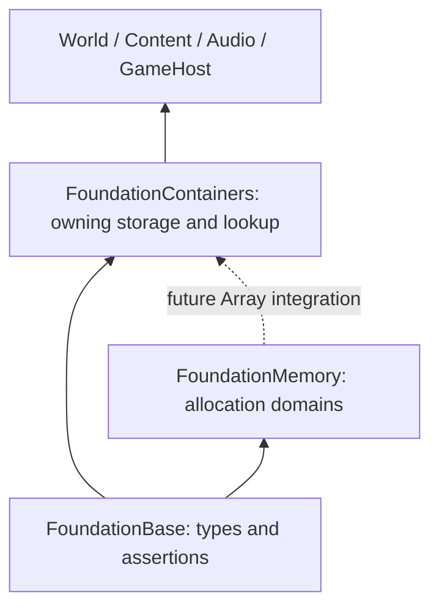

# Container systems

Status: first implementation increment. This design extends the implemented
[contiguous containers](containers.md#34-ludus-native-taxonomy-and-api-authoritative-naming)
and respects [memory ownership](memory-management.md). It does not replace
those contracts. Types marked planned below are architectural decisions, not
available SDK APIs. The [milestone roadmap](#milestone-roadmap) tracks the
remaining integration and implementation work.

## Requirements and evidence

The engine needs predictable storage, explicit failure, fast traversal, and
ownership that a debugger can explain. No design is universally fastest. Choose
by access pattern, cardinality, mutation frequency, ordering, and address
stability; benchmark the actual consumer before selecting a more complex
algorithm. C++23, Clang 18, no exceptions, fixed-width Ludus types, standalone
light public headers, and the existing native/browser SDK boundary are gates.

The initial audit at `52e29ce`, refreshed through `595042b`, finds an established
`Array`/`StaticArray` implementation,
`std::span` views, specialized concurrent logging/profiling queues, world-owned
entity/component storage, audio/UI-owned bounded slots, and one production
`std::unordered_map<uint64, uint64>` in GameHost's resource bindings. The
remaining unordered set is a reload-test observation set. Current main also
provides FoundationMemory allocation domains, FoundationHash, and Strings with
an exact intern table; reuse those APIs rather than invent competing hashing,
string ownership, or allocator systems. Array still uses its original byte seam.
Resource bindings are
written during setup and read through the host callback. That lookup-only
callback should never allocate; setup needs a fallible insertion path.

The first increment supplies `SortedMap`, backed by one `Array<Entry>`, and
migrates that registry. It also adds fallible insertion to `Array`, keeping
object lifetime and relocation in the existing audited helpers. This is a
useful vertical slice without a new allocator, SIMD portability layer, or a
second lifetime implementation.

## Baseline architecture, before the Gems review

Each container owns storage and element lifetimes. It does not own scheduling,
resource residency, serialization, locks, or subsystem policy. Keep views as
`std::span`/`std::string_view`; keep algorithms separate. Do not add containers
to `core.h`. New public headers opt in to the facilities they use, and export
through FoundationContainers' CMake header file set.

| Storage/access requirement | Type | Status / tradeoff |
| --- | --- | --- |
| Fixed count, contiguous | `StaticArray<T, N>` | Implemented; all N objects always live |
| Growable contiguous sequence | `Array<T>` | Implemented; reserve/reuse; pointers move on growth |
| Small or read-mostly ordered dictionary | `SortedMap<K, V, Compare>` | First increment; binary search, contiguous iteration, O(n) insert/remove |
| Runtime size within a hard bound | `FixedArray<T, N>` | Planned; live prefix, no heap, full is a status |
| FIFO with hard capacity | `RingBuffer<T>` | Planned; single owner, two spans for wrapped storage |
| Dense index membership/flags | `BitSet`, `StaticBitSet<N>` | Planned; packed words, no proxy references |
| Larger mutable dictionary | `HashMap<K, V, Hash, Equal>` | Planned; flat storage, measurement gates below |
| Uniqueness without mapped values | `SortedSet<K>` / `HashSet<K>` | Planned; share the corresponding lookup policy |
| Dense traversal with durable identity | subsystem typed handle + `SlotMap<T>` | Planned; generation checking and swap removal |
| Dense components keyed by sparse IDs | `SparseSet<T>` | Planned only with a concrete World extraction |
| Rare address-stable objects | subsystem owned pool | Conditional; handles normally preferred |
| Tiny common sequence that occasionally grows | `SmallArray<T, N>` | Conditional; size/relocation cost must beat `Array` |

Use `Array` plus linear search for very small ephemeral tables; `SortedMap` when
ordered iteration or binary lookup is useful; `HashMap` for a measured large,
mutation-heavy table. These are workload choices, not a magic cardinality
threshold. Arrays remain the default; avoid pointer-linked lists and trees
unless ordering/range updates demonstrably justify their allocation/locality
costs. Spatial trees, render graphs, resource caches, and ECS layouts stay in
their own modules.

## Shared contracts

- Ordinary containers have one mutable owner. Concurrent reads require no
  concurrent mutation; synchronization is the caller's responsibility.
- `GetSize`, `IsEmpty`, `EnsureCapacity`, `Clear`, `Reset`, `Find`, `Contains`,
  `Remove`, and `TryAddInPlace` follow the established verb naming.
- Recoverable resource exhaustion is explicit. `Try` insertion does not consume
  arguments, change live elements, or invalidate pointers on allocation failure.
  Unchecked insertion calls the existing out-of-line fatal OOM path.
- `Clear` destroys live elements but retains capacity. `Reset` destroys them and
  releases storage. Neither method allocates. No hidden shrinking on removal.
- Element destruction/movement and comparison/hash callbacks must be nonthrowing
  for new lookup containers. Arbitrary user value construction must satisfy the
  same requirement. User element constructors that themselves allocate need
  their own explicit failure protocol; a container cannot recover that failure.
- Use the current aligned, nothrow byte seam for Array-based containers.
  FoundationMemory domains already exist for Strings; integrating Array and
  its dependent containers is a separate ABI/measurement change; do not embed an
  unrelated allocator
  framework in each new template or intercept global new in production.
- Pointers/references are temporary borrows. Expose invalidation in each API;
  durable identity uses a typed handle. A handle contains no owning pointer.
- No container stores debug strings or registers globally. Inspect normal
  fields in the debugger; assertions check contracts; sanitizer and lifetime
  tests verify raw storage. Optional expensive validators are explicit calls.
- In-memory container layout is not a file, network, or game-module ABI. Export
  logical records through explicit schemas; sort when deterministic order is
  required. Do not dump pointers, capacity, padding, buckets, or freelists.

## SortedMap contract

Representation is `Array<Entry>` with immutable-through-public-access keys,
mutable mapped values, and a stateless ordering policy. Keys must be nonthrowing
copyable/movable; owning move-only `String` keys need a future explicit cloning/
heterogeneous-borrow design and are outside this initial map contract. Values
must be nonthrowing movable/assignable/destructible,
including move-only non-default-constructible types. Copy operations exist only
when mapped values are nonthrowing copyable. This prevents unsupported operations
from masquerading as valid type traits.

`Compare` is a default-constructible empty policy with a const, nonthrowing
strict weak ordering. Equivalence is `!Compare(a,b) && !Compare(b,a)`, never a
second equality policy. Ordering must remain stable for the container's lifetime.
The default uses `<`; NaNs or mutable external ordering state do not satisfy the
contract. Heterogeneous lookup and stateful comparators can be added when a
consumer requires them, without charging every empty dictionary now.

The API intentionally exposes const entry spans for iteration, and `Find` returns
a mutable/const pointer to the mapped value. A writable entry span would let a
caller change keys and silently break lookup. There is no `operator[]`: reading
must not insert or require a default-constructible value. Insert returns
`{Value, Inserted}`: an existing pointer with false for duplicate, a new pointer
with true for insertion, null with false for OOM/overflow. Duplicate insertion
leaves both stored values and supplied arguments untouched.

Search uses overflow-safe binary lower bound. Insertion checks equivalence once,
then asks `Array::TryInsertAtInPlace` to construct the entry. On a growth path,
allocate new storage first, construct the new entry while aliases into the old
storage remain live, relocate prefix/suffix, and commit. On a reserved path,
materialize before shifting. This avoids a second sorted-map storage algorithm
and preserves failure semantics even for arguments referencing existing values.
`Array::TryAddInPlace` uses the shared growth helper, repairing its previous
consume-before-allocation behavior for an aliased rvalue on OOM.

| Operation | Complexity | Invalidation |
| --- | --- | --- |
| `Find` / `Contains` | O(log n) comparisons | None; no allocation |
| Duplicate insertion | O(log n) | None; no argument consumption |
| Insert with growth | O(n) moves/copies | All entry/value pointers |
| Insert without growth | O(n) moves after insertion index | At/after index |
| `Remove` | O(log n) search + O(n) moves | At/after removed index |
| `EnsureCapacity` | O(n) only if growing | All on growth |
| Failed `Try` operation | No live-element changes | None |
| `Clear` / `Reset` | O(n) destruction | All live elements |
| Move/Swap | O(1) | Borrows follow transferred storage; old move-assignment destination dies |

Entry references can still refer to external memory whose contents change; key
owners must prevent such mutation. Value-semantic keys such as integer IDs are
the normal choice. A span is a borrow and must not outlive the owning map.

## Planned structures and decision gates

`FixedArray` and `RingBuffer` must construct only occupied slots, support
non-default-constructible values, handle zero capacity, and have a `Try` full
status distinct from OOM. A ring publishes only initialized payloads and exposes
front/back spans rather than pretending wrapped storage is contiguous. Generic
rings are single-owner; the existing MPSC/SPSC queues retain their specialized
atomic publication/reclamation protocols.

`BitSet` uses `uint64` words, masks unused tail bits, specifies resize initialization
and index bounds, and exposes test/set/reset plus word-oriented operations. Use
portable `<bit>` operations privately where worthwhile; never alias packed bits
as `bool&`. Test 0/1/63/64/65 boundaries and all shifts. Wire encoding specifies
bit order independently of the host representation.

`HashMap` should compare a scalar flat open-addressed baseline against an
established grouped-control implementation before committing to SIMD. Grouped
control bytes/fingerprints reduce unnecessary full-key comparisons in Abseil's
[Swiss table design](https://abseil.io/about/design/swisstables), but tombstones,
probe termination, hash quality, and ISA paths add maintenance cost. Choose one
algorithm from mixed hit/miss, collision, deletion-churn, large-value, and native/
Wasm measurements. No blanket speed claim is warranted. Require bounded probing,
overflow-safe allocation, an occupied/deleted/empty invariant, key immutability,
transactional rehash, and failure injection at every backing allocation.

Hash and equality must agree and be nonthrowing; keys are trusted engine IDs by
default. Public/adversarial strings use FoundationHash
`KeyedTableHash64` with a caller-supplied secret plus a bounded admission policy.
Reuse `TableHash64` for trusted byte keys and exact key comparison. Do not use
a persisted fingerprint as collision-free dictionary identity. Deterministic
iteration must use a sorted output
view rather than rely on bucket order. Pointer stability is explicitly lost on
rehash; mutation/iteration rules will be documented for the selected algorithm.

`SlotMap` separates dense values from slot metadata and a dense-to-slot reverse
index. A handle carries a subsystem tag, index, and generation; stale lookup is
an ordinary null result. Removal repairs the reverse mapping after moving the
last value. Retire a slot on generation exhaustion instead of allowing an old
handle to become valid. Specify world/owner identity and cross-instance behavior
before extracting a generic primitive: index+generation alone does not identify
an owner. `Clear`, move, rollback of multi-array growth, and destruction must
preserve the stale-handle contract. The primary-source
[Bitsquid ID table article](https://bitsquid.blogspot.com/2011/09/)
provides the dense lookup model; owner identity and exhaustion are Ludus's
additional requirements.

`SparseSet` must reject IDs outside its bound before indexing, verify dense IDs
to avoid uninitialized sparse entries, repair back-links after swap removal, and
account for sparse address-space memory. Paged sparse metadata is conditional on
a measured sparse ID range. Keep ECS-specific component lifetime and query
policy in World. Pooling, inline spills, node containers, lock-free generic
collections, persistent structures, and platform virtual-memory tricks all need
a concrete consumer and measurements before implementation.

## Rollout and verification

### Milestone roadmap

Planning baseline: **2026-10-06**. M0 records implemented functionality, not a
fresh certification of every review gate. Later milestones are unfinished.
"Gated" means a consumer or design decision must be established before committing
to the public primitive. Numbers express the recommended order; the dependencies
below determine which increments can proceed independently.

| ID | Milestone | Status | Deliverable and exit criterion |
| --- | --- | --- | --- |
| M0 | Contiguous arrays and first ordered map | Implemented | `StaticArray`, `Array`, `SortedMap`, fallible insertion/append, GameHost resource bindings, model/lifetime/allocation tests, SDK probe and benchmark exist. Retain their contracts and scoped measurement evidence. |
| M1 | Restore migration and explicit allocation failure | Planned | Replace reintroduced first-party `std::vector` uses with `Array`, including tests and exported Audio Gym APIs. Use fallible operations at status-returning boundaries, preserve consumer lifetimes and outputs on failure, and add an automated policy check with the existing benchmark/vendor exceptions. |
| M2 | Complete existing container API documentation | Planned | Add Doxygen contracts to the existing public container API, remove resolved entries from `api-undocumented.json`, and provide a wiki usage/selection guide distinguishing shipped APIs from plans. Strict wiki/API builds and coverage checks pass. |
| M3 | `FixedArray<T, N>` and one Input migration | Planned | Implement a live prefix in inline raw storage, explicit full status, and construction of occupied slots only. Migrate an Input binding or step-event buffer; verify zero allocation, zero capacity, non-default/move-only values, aliasing, failure preservation and balanced lifetimes. |
| M4 | Single-owner `RingBuffer<T>` | Gated | Establish capacity/backing-storage ownership and select a FIFO consumer; Input's pending-transition ring is a candidate. Implement wrapped front/back spans and explicit full/empty behavior; model-test wraparound and lifetimes while preserving the consumer's overflow/reset policy. |
| M5 | `BitSet` and `StaticBitSet<N>` | Gated | Select a flags/membership consumer and define resize initialization, bounds and word operations. Verify 0/1/63/64/65-bit boundaries, tail masking, shifts and fallible dynamic growth; measure storage/operation costs and migrate the selected consumer. |
| M6 | Array allocation-domain integration | Planned; Memory prerequisites | Reuse FoundationMemory through the Array byte seam, then introduce domain ownership as a separately measured layout change. Test original-domain frees, copy/move/swap rules, nested owners, over-alignment and OOM preservation; version the SDK owning-layout boundary. |
| M7 | `SortedSet<K>` | Gated | Identify an ordered uniqueness consumer. Reuse the ordering/equivalence contract and contiguous lifetime helpers; verify duplicate insertion consumes nothing, keys remain immutable through public access, and ordered output matches an independent model. |
| M8 | `HashMap` and consumer-required `HashSet` | Gated | Compare a scalar flat table with grouped-control alternatives on a named mutable-lookup workload. Select and implement one algorithm, reuse FoundationHash, and migrate the consumer. Collision/deletion/rehash models, bounded probing and allocation-failure rollback pass; record native/Wasm results. |
| M9 | Typed handles and `SlotMap<T>` | Gated | Establish owner/cross-instance identity, generation exhaustion and subsystem ABI semantics first. Extract a reusable dense-value primitive with reverse indices; verify stale/foreign handles, removal, clear, move and multi-allocation rollback against a model. |
| M10 | `SparseSet<T>` extraction | Gated | Demonstrate reusable storage logic in World or another bounded-ID consumer. Extract membership/dense storage while retaining ECS policy in World; verify ID bounds, back-links, swap removal, failure preservation and sparse-address-space memory costs. |

M1 should land in reviewable consumer increments: Text and its OOM paths first,
then GameHost protocol/session storage and Audio Gym, followed by remaining
first-party tests/tools. For example,
[`LoadFont`](../../modules/text/src/font_system.cpp) currently calls
`std::vector::resize` before checking the resulting size for OOM; allocation
failure does not reach that status check in the exception-free build. Migration
must repair the failure protocol rather than only rename the container. Recheck
the inventory at implementation time and update the historical migration claims
only after the policy gate passes. Replacing `std::string`, filesystem facilities
or unrelated ownership types stays in their own workstreams.

M2 can proceed alongside M1. Every subsequent milestone includes Doxygen for its
new/changed API and the relevant wiki/guide update in the same change; M2 is not
permission to defer documentation for new features. M3 is the recommended next
new container after M1. M4 and M5 may follow independently once their consumers
are established; generic rings retain single-owner semantics and do not replace
the audio/logging/profiling publication protocols.

M6 follows the byte-boundary and attribution decisions in
[Memory phases 1 and 2](memory-management.md#17-implementation-phases). Existing
allocation domains do not by themselves establish that Array integration or
accounting/ABI prerequisites are complete. Split backend redirection from the
per-owner domain/layout change and retain the accepted ownership rules when
later containers are added. M6 can proceed independently of bounded inline
storage; a heap-owning milestone must state which allocation seam it uses.

M7 and M8 do not require each other. M8's benchmark/selection step precedes its
public implementation; `HashSet` shares the chosen policy when a consumer needs
it. M9's identity decision precedes any extraction. M10 can reuse existing World
identity without waiting for a generic SlotMap if a separate extraction pays.
Owning move-only String keys, heterogeneous lookup and stateful policies remain
consumer-driven contract extensions; none is required to declare M0 implemented.

`SmallArray`, address-stable pools, dynamic trees, generic concurrent collections
and virtual-memory storage remain a conditional backlog. Each needs a named
consumer and its own lifetime/ownership contract plus measured benefit before
receiving an implementation milestone.

### Completion and evidence

For each increment run warning-clean pinned builds, unit/model/lifetime tests,
ASan/UBSan, format/tidy, standalone-header/include-boundary gates, SDK consumer,
and native/browser compilation where supported. Use exhaustive small-state
cases and seeded operation streams against a simple independent reference model.
Allocation tests separately interpose nothrow allocation and verify failure
leaves capacity, live content, and aliased/move-only arguments unchanged.

Performance reports must give compiler/build flavor, hardware, dataset/cardinality,
operation mix, sample method, allocation count and memory, and include a baseline.
Record wins and losses. Benchmarks are evidence, not noisy timing assertions in
CI. Measure lookup and mutation separately; optimizing one does not prove the
other improved. Build-budget checks remain unchanged. The
[first increment's evidence](../development/container-systems-evidence.md)
records measured lookup losses, small-table rebuild wins, and allocation tests.
Record later results by milestone with the tested revision, commands, consumer,
allocation/memory measurements and any skipped or incomplete checks. Preserve
the first increment's historical measurements. Mark a milestone complete only
when its deliverable, consumer migration where required, documentation and
applicable validation gates are satisfied.

## Gems review and resulting revisions

The initial architecture was written before reading the selected chapter bodies.
The source index is the local `references/game-dev-gems-toc.md`; the scanned
chapters were rendered and OCR-extracted, with title/code pages visually checked.
References are intentionally not required in a cloned SDK checkout. Printed
and PDF page numbers differ. These are design inputs, not copied implementations.

| Read source | Useful finding | Change from the baseline / rejected detail |
| --- | --- | --- |
| Brian Hawkins, **Handle-Based Smart Pointers**, *Game Programming Gems 3*, §1.5, printed pp.44–48, PDF pp.46–50 | Handle checks are useful when multiple borrowers observe an independently destroyed object; cached pointers can escape validation | Add explicit resolve-per-borrow scopes below. Retain owner/index/generation and exhaustion checks. Reject a global manager and persistent cached raw pointers for relocating dense storage. |
| Pete Isensee, **Custom STL Allocators**, *Game Programming Gems 3*, §1.6, printed pp.49–58, PDF pp.51–60 | Allocating storage and constructing objects are separate operations; allocator equivalence means compatible deallocation | Make backing-domain compatibility explicit for any future swap/splice and require tests for it. Keep reserve separate from construction. Reject the sample's exception-based overflow and old allocator boilerplate. |
| Paul Glinker, **Fight Memory Fragmentation with Templated Freelists**, *Game Programming Gems 4*, §1.5, printed pp.43–49, PDF pp.59–65 | Fixed-size, owner-local blocks can remove per-object allocation; access order still determines locality | Add explicit owner-local metadata and capacity admission rules. Reject default-constructing all pool objects and overwriting bytes in live objects; construct only occupied slots. Retain measured-consumer gate rather than adopting pooling everywhere. |
| Bill Budge, **A Generic Tree Container in C++**, *Game Programming Gems 4*, §1.6, printed pp.51–59, PDF pp.66–74 | Traversal should be reusable; maintaining a cached last-descendant link can make repeated append updates quadratic on a chain | Add tree-build complexity and cached-link invariants as review gates. Keep static hierarchies as cooked arrays. Reject a universal tree and static allocator per template; a dynamic hierarchy needs an owner and workload. |

Resulting contract amendments:

- A durable handle is resolved through its owner for one operation or explicit
  borrow scope. The caller may not cache the resolved pointer across insertion,
  compaction, retirement, or reset. Validation is part of release lookup too,
  rather than solely an assertion. A future scoped access object must enforce
  this rule without hidden global lifetime management.
- Future domain-aware containers may steal/swap backing storage only while
  retaining the original domain identity, or under proven deallocation
  compatibility. A cross-domain deep copy is explicit and fallible. Test distinct
  fake domains to detect freeing through the wrong owner. Do not assume two
  allocator objects with the same template type are interchangeable.
- Pools belong to an owner/workload. Freelist metadata is outside live payload
  objects; repeated free, foreign-owner free, and exhausted admission need
  explicit validation. Capacity slots are raw storage, not pre-created objects.
  Test non-default-constructible values and destructor balance. Fixed capacity
  requires a full status and a documented backpressure policy.
- Any later hierarchy exposes traversal centrally rather than duplicating it
  in every consumer. Validate parent/child/sibling or packed-range invariants,
  prohibit cycles, and measure deep-chain construction as well as traversal.
  A cached traversal link is a cost/complexity decision, not an automatic win.

These revisions refine the planned structures and domain integration. They do
not justify changing Array's measured growth policy, importing an old tree
library, or claiming a speedup for the first SortedMap consumer. The implemented
vertical slice follows the allocation/lifetime separation directly: allocate
before construction, stage resource-registry copies before commit, and verify
failed insertion leaves borrowed and move-only values intact.
