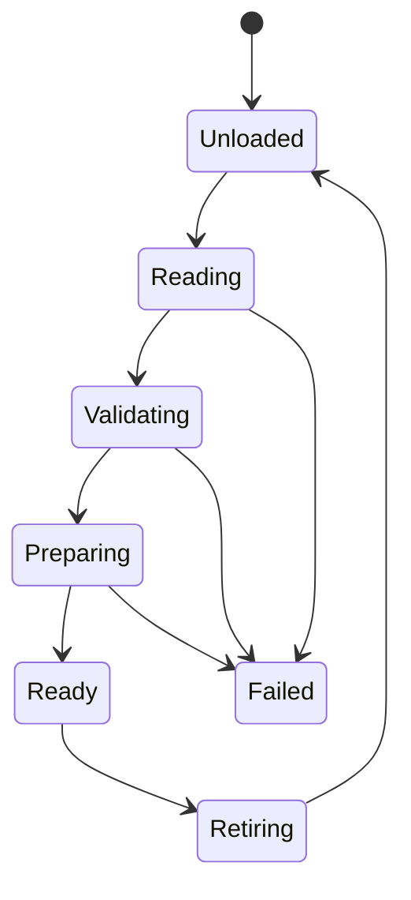

# Content resources and loading

Status: Architecture contract; initial native implementation is described in
[implementation evidence](../development/audio-content-evidence.md). Baseline inspected on October 2, 2026,
HEAD `9a71dd1`. This historical proposal specifies shared resource identity and
loading for levels and audio. The implemented native audio subset is documented
in the linked evidence; general level loading remains a separate proposal.
Read [audio authoring](audio-authoring.md), [milestones](audio-content-milestones.md),
and [implementation handoff](audio-content-codex-handoff.md).

The proposed [resource manager architecture](resource-management.md) extends these
contracts to shared asynchronous acquisition, typed resident versions, explicit
budgets and later cooking/streaming. Its [reference review](resource-management-reference-review.md)
records the relevant Gems readings and design refinements. That broader proposal
preserves the current version-1 formats and does not claim its future coordinator
or nonblocking integration is already implemented.

## Outcome and boundaries

A composer exports audio, registers it under a stable resource ID, authors sound
behavior, and saves a project that another machine can load. A level references
those same IDs. Development tools and packaged games validate the same definitions.

Start with an explicit catalog and typed audio loader. Do not require reflection,
a general importer plugin system, a database, a VFS, a binary bank compiler,
a job scheduler, or the proposed world implementation. A compiled sample can
exercise loading before levels exist. The following choices are Ludus proposals.

## Ownership and dependency direction

| Owner | Responsibility |
| --- | --- |
| Content catalog | Immutable ID, kind, relative path and revision records |
| Audio content loader | Decode definitions, resolve references, prepare audio, own leases |
| Game session | Active/pending level leases, sound delivery, music context |
| AudioSystem | Prepared clip/stream storage, playback and acknowledged retirement |
| Editor document | Mutable draft, saved digest, validation errors, document revision |
| Packaging tool | Validate dependencies and stage immutable release files |

Introduce `modules/content/`, exported as `Ludus::Content`, only for the catalog,
resource IDs, owned byte acquisition, bounded status/diagnostics and leases that
have demonstrated use. It depends on Base and Containers, never Audio, RHI,
GameplayWorld or Qt. Audio definitions and preparation belong in
`modules/audio/content/`, exported as `Ludus::AudioContent`, depending on Content
and Audio. Dynamic music later uses `modules/audio/music/`, `Ludus::Music`.
Keep source files in `src/`, public headers in `include/`, implementation headers
in `src/internal/`. Content and AudioContent now export these SDK targets; Music remains proposed.

Qt adapters stay private to `apps/editor`. Do not move Qt JSON objects into runtime
headers. Select and pin a bounded, explicit-error JSON parser during the first
implementation audit; demonstrate compatibility with `-fno-exceptions`, duplicate
key detection and fallible storage. The parser stays behind `.cpp` boundaries.
Reuse a suitable existing codec if one has appeared since this baseline.

## Catalog schema

The conventional location is `content/catalog.json`, relative to the game source
root. Do not change the strict version-1 editor project descriptor just to add
content; derive this location from its resolved `source_dir`. Changing roots is
future versioned project configuration. The current root is its parent `content/`.

This is a complete illustrative catalog:

```json
{
  "version": 1,
  "resources": [
    { "id": "audio/impact-a", "kind": "audio-source", "path": "audio/impact-a.wav" },
    { "id": "sound/impact", "kind": "sound", "path": "audio/impact.sound.json" },
    { "id": "audio/forest-loop", "kind": "audio-source", "path": "audio/forest-loop.flac" },
    { "id": "music/forest", "kind": "music", "path": "audio/forest.music.json" }
  ]
}
```

All fields shown are required. IDs are case-sensitive lowercase ASCII letters,
digits, slash and hyphen, maximum 128 bytes. Segments are nonempty; no leading or
trailing slash. IDs are globally unique across kinds. Paths use forward slashes,
are relative, nonempty UTF-8, maximum 1024 bytes, and contain no empty, dot or
parent segments, backslash or absolute prefix. Resolve under the canonical content
root and reject symlink escapes too. Files must be regular files. Do not interpret
IDs as paths. Catalog entries can move without changing IDs.

Version 1 accepts only the three kinds above. Future level catalogs may share
this identity policy through a versioned extension; this package does not silently
change the game-owned level schema. A game binding validates that a level's audio
key names the required sound/music kind. Numeric resource indices are resolved
on the cold path and never persisted as authored identity.

## Definition validation

Readers reject duplicate keys/IDs, unknown fields or versions, wrong kinds,
missing references, invalid scalar types, nonfinite values, and dependency cycles.
Own all surviving data before releasing input buffers. Diagnostics include resource
ID, source file, property path, error code and line/column where available.
Ordinary malformed content returns a status, never an assertion or exception.

Version-1 default ceilings are 1 MiB per JSON document, 4096 catalog entries,
32 nesting levels, 256 dependency edges per definition and 16384 total edges.
Lower application limits are allowed; increasing them requires capacity and
peak-memory evidence. Audio byte and PCM limits remain separate and use the
existing AudioSystem budget. Check every size product and peak allocation.

Definitions form an acyclic dependency graph: sound/music -> audio-source.
Future dynamic music also references stinger sound definitions. No executable
scripts, plugin names or arbitrary runtime function references belong in content.

## Loading and resource leases

Conceptual state flow:



Every pending stage can be cancelled. Request identity contains loader session,
request generation and catalog revision. Late completions cannot publish into a
replacement request or closed editor project. Failure/cancellation releases only
candidate leases and preserves any active revision. Failed resources can be
retried explicitly; no unbounded automatic retry.

A lease pins one immutable definition revision and its dependency closure.
Multiple clients may share a prepared clip within the same audio session and
preparation profile. Cache keys include source content digest, import settings,
loop descriptor and session rate/identity; a hash alone is not a durable resource
ID. A stream source can be shared, but each stream playback needs its own prepared
instance, decoder and ring. Release cannot immediately free storage still used
by voices or jobs. Use AudioSystem retirement and terminal acknowledgments.

Acquire all required candidate resources before level activation. Validate peak
budgets for active and candidate content together. On failure keep the active
world and audio leases intact. Optional resources require an explicit game-owned
fallback policy; do not turn missing required music into success silently.

Preparation and file operations run outside the audio callback. Native acquisition
uses owned readers on a worker; browser acquisition returns to the event loop
while fetch is pending. Initial browser streaming still retains bounded encoded
bytes, as specified by the existing audio design. Do not advertise HTTP range
streaming or bounded download memory.

All AudioSystem calls remain serialized on its control owner. UI/background
results carry owned values to that owner; they never call it concurrently.
Expose status polling and cancellation instead of blocking the browser or GUI.

## Saving and replacing content

Canonical writers emit version and fields in fixed order, explicit defaults,
sorted catalog IDs, stable numeric formatting and a final newline. JSON has no
comments. Reject unsupported versions instead of dropping unknown data on save.

Documents track the last-read digest. Before replacement, reject an external
change with a conflict diagnostic and retain the dirty draft. Write a temporary
file in the same directory, flush as supported, and atomically replace the
original. On failure retain the original and report failure. Replacement protects
one file; do not claim a transaction across catalog, definition and audio files.

Import external audio by copying into the content root. Prepare/validate a staged
copy first, then publish it and register it. If catalog publication fails, the old
catalog remains valid; report the unreferenced file and allow cleanup. Never
publish a catalog pointing to a file that has not been successfully written.
Deleting registered sources is refused while referenced; report the referring IDs.

Reimport keeps the resource ID and authored settings, validates changed sample
rate/length/loops, and prepares a new revision before publishing. Old voices retain
the old revision until completion; new triggers use the new revision. Existing
music continues until an explicit restart or safe musical boundary in later work.
Peak-budget failure preserves the old revision. Whole-world restart is not
required for an audio replacement.

### Native saves

The current `Content::SaveFile` adapter supports Linux and macOS. It keeps the
same public signature and SHA-256 expected-digest policy. Other platforms return
`Unsupported`; portable catalogs and JSON processing do not depend on this save
backend. This adapter is separate from the proposed FoundationFilesystem F5
persistence API and does not implement watchers or asynchronous acquisition.

The caller supplies a trusted existing root and a validated relative UTF-8 path.
Root symlinks are allowed; every child-directory component and destination is
opened relative to a descriptor with symlink following disabled. Destinations
must be regular files or absent; FIFO checks are nonblocking. Already-open
directory mutation, hard links and privileged actors are not a sandbox guarantee.
The caller creates parent directories; the adapter does not create them.

A nonblocking exclusive `flock` on the parent directory serializes cooperating
Ludus writers. A busy lock, missing expected file, or digest/absence mismatch
returns `Conflict`. Other open/read errors retain their actual Content status
(`IoError`, `Limit`, or `OutOfMemory`) rather than being called a conflict.
The expected digest is checked before staging and immediately before rename;
uncooperative writers can still race the final check and publication.

Writes are capped at 32 MiB. The adapter exclusively creates `leaf.ludus-save`
in the same directory with mode 0600. The suffix counts toward native filename
limits. Existing temporary files or symlinks are never overwritten or removed;
report `IoError` and inspect them before retrying. Checked complete writes retry
interruptions and short progress; file sync and close must succeed before atomic
publication. Darwin uses its `renameat` API, declared by `<sys/stdio.h>` without
importing C stdio diagnostics; Linux retains its descriptor-relative rename
syscall. Existing readers retain their opened revision after replacement.

Failure before rename preserves the destination and attempts to remove the owned
temporary. Cleanup may itself fail, so a crash or filesystem error can leave a
temporary for manual inspection. `Ok` reports completed atomic publication.
Directory sync after publication is best-effort; failure cannot roll back the
completed rename and is not returned as a failed save. File `fsync` is not a
drive-cache flush or a power-loss durability guarantee. This API intentionally
does not claim those stronger guarantees.

Native tests cover create/replace, empty files, stale/absent digests, busy locks,
UTF-8 nested names, root aliases, child/leaf/temporary symlinks, FIFO/directory
rejection, size admission and retained reader revisions. A separate exception-free
test archive compiles the same implementation with private syscall seams on both
Linux and macOS. It exercises interrupted/short/zero/partial writes, file sync and
close failure, rename failure, an edit between digest checks, temporary cleanup,
lock release on retry, and best-effort directory sync. Hooks are not installed or
present in the production archive. macOS CI runs native and fault tests in
Development and under ASan/UBSan, and analyzes the save implementation and tests.

Thanks to **Apple**, *Mac OS X Manual Pages*,
[flock(2)](https://developer.apple.com/library/archive/documentation/System/Conceptual/ManPages_iPhoneOS/man2/flock.2.html),
[rename(2)](https://developer.apple.com/library/archive/documentation/System/Conceptual/ManPages_iPhoneOS/man2/rename.2.html)
and [fsync(2)](https://developer.apple.com/library/archive/documentation/System/Conceptual/ManPages_iPhoneOS/man2/fsync.2.html),
for advisory-lock ownership, atomic rename and the distinction between filesystem
sync and drive durability used here. The implementation is independent; no
upstream code was copied.

## Packaging and reproducibility

Begin with a tool that accepts explicit root resource IDs, walks dependencies,
validates content, and copies WAV/FLAC plus definitions into a clean staging
folder with a generated catalog. Game level code supplies its resource roots;
do not infer every possible dependency from arbitrary game source code.

Generate sorted output and a manifest of SHA-256 source/output digests, schema
version and tool version. Write the completion manifest last. Failed staging is
not a usable release and does not replace the previous complete package.
Runtime opens only the release catalog and does not depend on DAW files, host
absolute paths, the editor or a developer cache. Include resource licenses in
release inputs where required. Binary packs and lossy encoding are later work.

Derived waveform/preparation data is rebuildable. Store it under ignored project
output, keyed by source digest plus algorithm/tool/settings version. Commit source
audio, definitions and catalog according to the game repository's binary storage
policy. DAW projects and instrument licenses stay under composer control; never
package them implicitly.

## Relation to the world design

Follow [level loading](level-data.md) for candidate activation and
[frame updates](frame-update.md) for presentation delivery. This package adds
resource mechanics without making Content depend on the world or inventing
built-in entity kinds. A standalone audio sample must remain possible.
