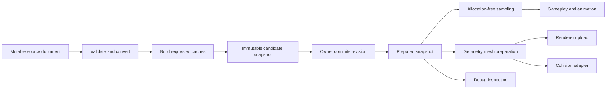

# Curves and surfaces architecture

Status: G1 fixed-size math kernel implemented; G2-G6 remain proposed.
Design baseline: `52e29ce`, inspected on 2026-10-04. Implementation baseline:
`95683aa`, inspected on 2026-10-05. Validation is recorded in the
[kernel evidence ledger](math-evidence/curves-surfaces.md). Performance budgets
for prepared assets and integrated consumers remain unmeasured.

Ludus should use a small Bezier geometry kernel, immutable prepared assets, and
separate optional caches for distance, orientation, spatial queries and meshes.
Keep source editing in tools and consumer policy in animation, gameplay,
graphics and physics. Start with lines, piecewise cubic curves, sweeps and
untrimmed bicubic patches. Add exact rational geometry or subdivision through
separate, explicitly versioned representations when a shipping feature needs
them.

This is a production-oriented design judgment, informed by current primary
sources and the [Gems review](curves-surfaces-gems-review.md). It does not claim
universal optimality or measured Ludus performance. The kernel, owners, caches,
codecs and adapters below remain proposed; the fixed-size kernel is implemented.
The final section preserves the baseline written before the chapter review.

## Implemented kernel (G1)

The installed `Ludus::FoundationMath` API now exports `cubic.hpp` and `patch.hpp`.
`CubicBezier1/2/3` contain four scalar/2D/3D controls. `TryEvaluateCubic` offers
position-only or position/first/second derivative sampling. `TryFromHermite`
converts external-domain endpoint derivatives using an explicit positive width.
`TrySplitCubic` returns two normalized children. `BicubicBezierPatch` stores
`Control[u][v]`; `TryEvaluatePatch` returns position alone or all first/second
partials. `TrySplitPatch` returns four normalized rectangles, and
`TryPatchNormal` uses analytic partials with explicit conditioning thresholds.

These checked operations use fixed stack storage and float64 intermediates with
float32 controls/results. They reject nonfinite input and invalid normalized
parameters; failed operations preserve all outputs. Position sampling can succeed
when a derivative overflows float32. Endpoints/corners preserve their stored
values, including signed zero. Subdivision results are rounded controls, not
symbolically exact children or certified enclosures. Derivatives are in each
child's normalized domain. The public headers document supported aliasing.

No editor binding is needed for these math values. A useful editable curve
document needs the G2 prepared owners and G5 authoring/undo/publication contracts;
those features and their editor adapters remain explicit follow-up phases.

## Decisions

| Decision | Reason | Revisit condition |
| --- | --- | --- |
| Bezier controls as canonical polynomial geometry | Small fixed representation, understandable handles, analytic derivatives, local splitting and control-hull bounds | A measured consumer needs another exact basis or degree |
| Hermite and centripetal Catmull-Rom as source modes | Familiar direct handles and interpolated waypoints; both convert exactly to cubic spans | A consumer needs C2 interpolation with local edits and accepts a different representation |
| Separate scalar tracks, spatial paths and orientation | Seconds, distance, curve parameter and rotation have different semantics | Share numerical kernels where useful; keep the semantic distinction |
| Immutable prepared asset plus explicit build | Sampling has no mutation, locks, allocation or surprise rebuild | Frequently deforming geometry uses a separate update path |
| Optional caches built by profile | A UI easing curve needs no BVH, a camera path needs no surface mesh | Measurements justify an additional cache |
| CPU reference and offline mesh preparation first | Fits native/Wasm, debugging and current Ludus facilities | Measured dynamic mesh cost and implemented RHI capabilities justify GPU work |
| Analytic geometric normals; separate shading normals | Approximate shading cannot change contact or projection geometry | An art-directed shading field can be an explicit render channel |
| Explicit shared edges and position samples | Consistent geometry and topology prevent cracks | No relaxation of this invariant for an adaptive backend |
| Strict completion or an explicitly approximate result | Exhausting a work budget cannot silently become success | Consumers choose named visual fallback profiles |

## Scope and consumers

| Consumer | Required representation or service |
| --- | --- |
| Gameplay camera/rail/AI route | Prepared 2D/3D path, optional distance map and transported frame |
| Road, ribbon, cable, pipe, river bank | Path plus section/width/roll profiles, bounded sweep mesh generation |
| UI easing, audio envelope, animation weight | Scalar track with key times and explicit interpolation; no spatial services |
| Timed cinematic position | Cubic position spans with seconds as the source domain, or a path plus a distance-time track |
| Camera rotation or skeletal orientation | Quaternion track in the future animation consumer; no componentwise quaternion cubic |
| Editable curved panels or procedural sheets | Untrimmed bicubic patch set and explicit adjacency |
| Imported CAD/NURBS or subdivision character | Conditional importer and fidelity policy; mesh bake initially |
| Water, cloth, terrain, SDF/implicit geometry | Separate simulation/field systems; may call the kernel or provide an adapter |

Position curves do not determine event delivery, bank angles, acceleration limits,
collision response or vehicle steering. A spline is a desired geometric route.
Whether a vehicle can follow it belongs to its movement model. Water height
functions remain in the [fluid design](physics-fluid-simulation.md); a spline
surface does not replace a fluid solver.

## Repository fit and module boundaries

Follow [AGENTS.md](../../AGENTS.md), [steering](../../.kiro/steering/coding-standards.md),
[ADR 0003](../decisions/0003-standard-library-usage-policy.md), the
[include boundary](foundational-headers.md), [FoundationMath](../../modules/foundation/math/README.md),
and current fallible [containers](containers.md).

FoundationMath is implemented and depends only on Base. Its right-handed,
+Y-up, column-vector conventions, checked errors and unchanged-output contract
are authoritative. Containers already provide fallible growth. Content has
resource IDs, checked JSON/byte loading and SHA-256 digests. The general memory
architecture is proposed. FoundationThreading now provides bounded task graphs;
future preparation adapters may use it while retaining immutable inputs and
exclusive outputs through completion. The G1 kernel has no threading dependency,
and no general geometry asset loader is assumed. Inspect code rather than
relying on historical inventories.

The current public RHI provides bounded fullscreen rendering and lifecycle
operations. General indexed meshes, reusable mesh buffers, compute dispatch and
indirect rendering are separate prerequisites. CPU geometry and export can ship
before those renderer features. Browser feasibility probes are not public mesh
capabilities.

| Location and target | Owns | Depends on |
| --- | --- | --- |
| Implemented G1 additions to `modules/foundation/math`, `Ludus::FoundationMath` | Fixed-size scalar/vector cubic and bicubic values; evaluate, differentiate, split, Hermite conversion; conservative bound helpers remain future work | Base only |
| Proposed `modules/foundation/geometry`, `Ludus::FoundationGeometry` | Prepared path/patch owners and views, scalar tracks, distance/frame/bounds caches, queries and mesh generation | Base, Math, Containers |
| Proposed `modules/geometry/content`, `Ludus::GeometryContent` | Authoring codecs, source IDs, import/cook validation, portable cooked format, loading and publication | Content, FoundationGeometry |
| Editor-private adapters | Document edits, undo, handles, preview, inspection | GeometryContent, editor UI |
| Consumer-private adapters | Path follower, animation clock, render upload, collision cook | FoundationGeometry and the consumer's own subsystem |

Do not add Geometry to `core.h` or the foundational PCH. Math never imports
Containers, Content, RHI, Logging or Geometry. Geometry returns structured
diagnostics/counters; its consumer emits Ludus logs and profile zones. Importer
dependencies stay private and tool-side where possible.

Public kernel headers contain fixed values and small declarations:
`cubic.hpp` and `patch.hpp`. Geometry separates `status.hpp`, `path.hpp`,
`track.hpp`, `distance.hpp`, `frame.hpp`, `surface.hpp`, `query.hpp` and
`tessellation.hpp`. An ordinary path evaluation should not parse surface,
content or renderer APIs. Owners use small move-only handles with private
implementation storage; views contain explicitly borrowed ranges. Larger
algorithms live in .cpp files. No universal virtual spline class, runtime
evaluator registry or unconstrained template hierarchy is required.

Private numeric work uses Math's precise path. If an implementation needs
standard numeric facilities in another module, first amend ADR 0003's narrow
Math-only allowance; do not assume a general `<cmath>` exemption. Preserve
no-exceptions, the Ludus primitive aliases, explicit includes and header budgets.

## Ownership and data flow



The source document owns editable points, handles, knot/time data, adjacency,
author IDs and units. The cooker owns temporary scratch and candidate storage.
A published snapshot owns geometry and exactly the caches selected by its
preparation profile. A synchronous evaluator borrows its snapshot; a job or
consumer that outlives a call retains an explicit lease through its owner.
Views, cursors and indices retain nothing.

Begin with owner-thread publication and caller-managed lifetimes. If threaded
reads are introduced, acquire the lease before dispatch and retire snapshots
only after all reader leases complete. Reading an atomic pointer followed by a
retain is insufficient to make reclamation safe. GPU buffers have a separate
renderer lifetime, retired after GPU completion.

No sample function constructs a cache or changes its asset. Runtime procedural
content uses the same explicit prepare operation as tools. Building at a loading
screen or staging a revision is different from allocating inside evaluation.

## Geometry and source representations

The polynomial core has explicit fixed-size forms for scalar, 2D and 3D cubics,
and a 3D bicubic patch. Source data may use float64 coordinates; the runtime
snapshot uses float32 controls relative to a shared float64 asset/chunk origin.
Subtract the origin before narrowing. Check conversion error against the
profile's position budget. Split large assets into chunks before local precision
is lost. If no permitted chunking meets the budget, return unsupported precision.
A future float64 prepared profile is a deliberate format extension.

Keep lines and steps as explicit segment kinds; a step is a scalar track mode.
Geometry v1 contains line and cubic batches, with a small tagged directory when
mixed spans are needed. Avoid allocating a separate object per span. A bicubic
patch contains 16 controls with documented `Control[uIndex][vIndex]` order.
The kernel never guesses source mode from point counts.

Hermite tangents name their domain. For a span of domain width h with endpoint
derivatives T0 and T1, the exact Bezier conversion is:

```text
B0 = P0
B1 = P0 + h*T0/3
B2 = P1 - h*T1/3
B3 = P1
```

Use h = 1 only for explicitly normalized-span tangents. Spatial handles are
offsets; timed tangents are units per second. They are not interchangeable.

For waypoint editing, use centripetal Catmull-Rom by default, with geometric
knot increments proportional to the square root of chord length. Use the
nonuniform formula and convert to Bezier; applying the uniform tangent formula
to nonuniform knots is incorrect. The
[Yuksel/Schaefer/Keyser result](https://www.cemyuksel.com/research/catmullrom_param/)
supports avoiding cusps/self-intersections within a regular segment in that
parameterization family. It does not promise a globally simple path or handle
coincident consecutive points.

Reject duplicate consecutive waypoint positions under the source's named
coincidence tolerance; offer a visible editor merge operation. A timed hold is
an explicit stationary time interval. Open paths default to one-sided endpoint
tangents; authored endpoints override that policy. Closed paths wrap neighboring
points and omit a duplicated stored endpoint. Fewer than two distinct points
cannot form a path; a single point is a separate constant value.

Polynomial cubic B-splines convert exactly by span extraction/knot insertion,
with knot multiplicity and source spans retained. Support this in an importer
only when a consumer needs it. Higher polynomial degrees require a separate
exact representation or an explicit approximation budget.

Rational geometry remains rational during exact conversion: knot insertion
produces rational Bezier spans, not ordinary polynomial cubics. A circle cannot
be represented exactly by a polynomial cubic. V1 either bakes an approximation
with checked error and provenance, or reports unsupported source geometry.

## Parameter, continuity and timing contracts

`SegmentParameter` names a span index and u in [0,1].
`PathDistance`, `TrackTime` and `SurfaceParameter` are distinct values.
Distance uses declared asset/world units; time uses float64 seconds relative
to a local epoch; surface parameters are dimensionless. Disk indices use
fixed-width encoded fields; in-memory sizes and array indices use `usize`.

The checked local kernel accepts a closed domain and rejects out-of-range or
nonfinite input. Higher-level samplers have an explicit boundary policy:
Reject or Clamp for open paths; Wrap for closed paths only. Timed tracks
add named Hold, Loop and PingPong policies. No silent extrapolation. An exact
internal key selects the outgoing span; the terminal endpoint of an open domain
selects the last span at u = 1. A caller needing the incoming derivative requests
that side explicitly.

Kernel derivatives are with respect to u. For x = x0 + h*u:

```text
dP/dx   = (dP/du)/h
d2P/dx2 = (d2P/du2)/(h*h)
```

Continuity metadata distinguishes C0 position, G1 tangent direction, C1
derivative and C2 second derivative in the declared domain. Compare scaled
derivatives, not raw handles from spans of different widths. Separate flags
describe closed geometry, periodic derivatives and periodic frame policy.
G1 shape continuity alone does not imply continuous velocity or acceleration.

V1 scalar tracks support Step, Linear and authored Hermite. Key times are
strictly increasing; separate input records represent deliberate events or holds.
Duplicate-time edits are rejected or visibly replaced by the editor, never
resolved by an undocumented runtime tie. Validate scalar ranges where the
consumer requires them. Hermite may overshoot; do not hide overshoot by clamping
evaluation.

A monotonic scalar mode can use shape-preserving PCHIP preparation for a
consumer that needs monotonic ramps. This has C1 continuity and may have second
derivative jumps, as documented by
[SciPy's primary implementation documentation](https://docs.scipy.org/doc/scipy/reference/generated/scipy.interpolate.PchipInterpolator.html).
The proposal uses the numerical technique, not a SciPy runtime dependency.

Constant-speed traversal evaluates a distance-time function s(t), then inverts
the path's distance map. If s is differentiable and the path tangent is regular,
velocity is the unit tangent times ds/dt. Acceleration contains both tangential
acceleration and curvature-driven normal acceleration. The follower decides
whether it can meet those demands. C2 position does not mean constant speed;
chord-length knot spacing only approximates it.

For ordinary smooth waypoint paths use local Catmull-Rom edits. When a timed
camera needs C2 derivatives, provide a separate optional clamped/natural/periodic
cubic solve in tools with explicit boundary conditions. The solve can affect
the entire path; do not promise four-point edit locality. Fail ill-conditioned
or contradictory constraints. Retiming is independent and can change physical
continuity even when the geometric path is unchanged.

Orientation tracks live above geometry and use quaternion-aware interpolation,
normalization and consistent hemisphere choices. Initial consumers can use
FoundationMath's existing shortest-path interpolation. Squad, winding and
multi-turn rotation require an animation contract. Interpolating four quaternion
components as an ordinary cubic is not that contract.

## Evaluation and numerical policy

De Casteljau evaluation and subdivision are the scalar reference for cubics and
patches. Derivative curves/patches come from control differences. Endpoint
evaluation returns the stored endpoint exactly. Position, first derivative and
second derivative have independent request APIs so a position-only sample does
not pay for curvature or normalization.

The prepared fast path may store power-basis coefficients and use Horner
evaluation after numerical/performance comparison. Endpoint branches and the
documented error envelope remain mandatory. Coefficients are derived data;
controls remain available for inspection, subdivision and conservative bounds.
Avoid storing both forms for every asset unless the preparation profile requires
the fast path. Bulk evaluation shares basis calculations for repeated u/v and
dispatches once per homogeneous batch.

Preparation and difficult queries use float64 intermediates, scaled coordinates,
checked finiteness and explicit narrowing. A finite input can still produce
an unrepresentable derivative or invalid numerical bound. Return a status.
No universal epsilon, fast math or contraction on checked kernels. Approximate
GPU arithmetic is a separate profile with CPU comparison tests.

Tolerances have units and separate fields: position error, distance error,
tangent angular error, projection distance gap, continuity position/derivative
thresholds, and surface normal conditioning. Relative tolerance applies to a
documented asset scale; it does not replace absolute limits at tiny scales.
If requested accuracy is below the supported arithmetic floor, fail visibly.

A mathematically conservative bound is not automatically a floating-point
certificate. Strict profiles require reviewed outward enclosures for subdivision,
norms, accumulation and transformed bounds, without changing the process-wide
rounding mode. Put those small helpers behind Math's implementation boundary.
Validate them on pinned native and Wasm tools before advertising certified
errors. An implementation with heuristic padding must label the result
Estimated and cannot satisfy a strict/collision preparation profile.

## Prepared data and optional caches

An immutable `PreparedPath` owns a span directory, compact controls and source
mapping. `PathView` borrows those arrays. A `PathCursor` remembers revision,
span and last parameter for coherent traversal. It is caller-owned and one
cursor belongs to one follower; it is not global asset state.

Use contiguous AoS controls initially. Optional derived arrays hold per-span
bounds and domain ends. Distance leaves, frame samples and BVH nodes are
separate caches. A `PreparedSurface` owns patch controls, canonical boundary
records and adjacency; mesh outputs are distinct artifacts. Source debug data
can be stripped from release blobs without removing data required for geometry
or validation.

| Preparation profile | Required data |
| --- | --- |
| ParameterOnly | Controls, domain ends, validated source mapping |
| DistanceTraversal | ParameterOnly plus bounded cumulative distance data |
| FramedTraversal | DistanceTraversal plus regularity validation, seed and frame samples |
| SpatialQueries | ParameterOnly plus conservative bounds; BVH only above measured threshold |
| SurfaceMesh | Patches/topology plus explicit mesh policy and error report |

Profiles can compose, but unsupported combinations fail. Sampling with a missing
cache returns `MissingCache`; it never prepares one. Small paths use a direct
scan when benchmarks show that it wins. Random domain lookup is binary search
over ordered ends. Coherent cursors have constant work within a span and advance
across boundaries; a jump has binary-search fallback, not an unbounded linear
walk disguised as constant-time lookup.

## Arc length and distance inversion

The Gems review strengthens a generic adaptive length map into a bounded
construction. For each polynomial Bezier leaf:

```text
chord length <= true arc length <= control polygon length
```

Repeated de Casteljau splitting reduces the aggregate interval. Accumulate
float64 lower/upper lengths and estimated prefix values with conservative
arithmetic. Stop when the total gap fits the length budget; choose subdivision
work by contribution to that gap, with deterministic tie order. A per-leaf
tolerance alone does not establish a whole-path tolerance.

Store each leaf's source span/u interval, cumulative length estimate, lower/upper
prefix enclosure and local residual bound. Midpoint length is a simple estimate
with error at most half the interval width in exact arithmetic. For cubics,
Gravesen's weighted estimate is this same midpoint; heuristic convergence/error
estimates never replace the bounds. Queries must include prefix uncertainty from
all preceding leaves.

Distance inversion uses monotone prefix lookup to propose a leaf, then bounded
refinement using partial-span length enclosures. If neighboring enclosures overlap
the target, include the ambiguous leaves in the search bracket. Do not claim
that binary searching estimated lengths alone gives the correct bracket.
Safeguarded Newton uses speed only when sufficiently nonzero; otherwise split
or bisect. Accept by a distance residual bound, not a parameter-step heuristic.
Linear table interpolation is a named Approximate mode with its own measured/
bounded error report.

At zero-length runs, define a canonical earliest parameter, except for the
explicit terminal-endpoint rule. Zero-length spans occupy no positive distance
interval; an entirely stationary path can return position at s = 0 but cannot
produce a direction/frame. Near-zero speed makes u(s) ill-conditioned even if
position remains stable. Return that fact for consumers asking for derivatives.
Timed holds remain in the time track.

Distance is metric-dependent. Translation and rotation preserve local lengths;
uniform scale multiplies them by the absolute scale factor. Nonuniform scale or
shear requires a transformed distance cache or a separate world-metric query.
A local distance map cannot provide constant world speed under those transforms.
Normalized loop traversal also inherits uncertainty in the total length.

## Closest point and spatial queries

A point query on a cubic has stationary equation
`Dot(C(u) - Q, C'(u)) = 0`, generally degree five. The
[Schneider Gem](curves-surfaces-gems-review.md#nearest-point-on-a-curve)
motivates considering every valid stationary candidate and both endpoints.
One Newton solve can find a local extremum, leave the domain or miss another
closer branch. A temporally coherent seed is an acceleration hint, not proof.

V1 uses bounded branch-and-bound over conservative control-hull AABBs.
Distance from Q to a leaf box is a lower bound; an evaluated curve point gives
an upper bound. Split the most promising interval, update the candidate, and
stop when the global upper/lower distance gap meets the query budget.
Newton refinement can improve the upper bound but cannot discard intervals
without a valid lower bound. This avoids maintaining a second root solver for
the first release; a Bernstein root-isolation backend is an extension.

Return span/u, position, distance and achieved gap. A strict `TryProjectPoint`
leaves the result unchanged on work-limit failure. A separately named
`ProjectPointApproximate` can return its candidate and remaining gap. Ties use
stable source/span order then the smaller parameter. A surface nearest point
must include patch boundaries, corners and candidate interiors; a single
two-variable Newton iteration is likewise insufficient.

Optional BVHs accelerate larger immutable paths/patch sets. Refit after
control-only deformation; rebuild after topology changes or measured bound
quality degradation. World-space Euclidean projection under nonuniform scale
must use transformed geometry or the correct metric. Inverse-transforming Q
and minimizing ordinary local distance generally gives the wrong world answer.

Transform-aware caches name their coordinate space and revision. Under a
nonuniform transform, recompute tangents/frames in the target metric when that
is what the consumer requests; transforming an orthonormal local frame does not
keep it orthonormal. Singular transforms cannot pass regular frame/normal profiles.

Editor screen picking is a renderer/tool concern with a pixel metric, visibility
and depth policy. It cannot reuse a world-space nearest result as if the metrics
were equal. Ray/curve picking requires a declared radius or projected stroke.
An infinitesimal line has no implicit gameplay thickness.

Collision consumes a checked mesh/capsule approximation with a named error
budget. Outward inflation is needed when a collision consumer requires a
conservative proxy. Proximity queries do not supply robust crossing topology,
continuous collision, inside/outside classification or contact response.

## Orientation frames and sweeps

Prepare rotation-minimizing frames for regular 3D paths, seeded by a caller's
up direction projected perpendicular to the initial tangent. If that projection
is degenerate, either reject the authored seed or use an explicitly selected
deterministic fallback axis. Record the choice. Prefer the
[double-reflection RMF method](https://hub.hku.hk/handle/10722/152386)
for the prepared implementation after reference tests; its stated convergence
assumes regular sampling and does not cover singular paths.

Dougan's Gem establishes why transport is useful at straight spans and
inflections and why it has a sequential history. Bake that history once.
Random-access frame sampling uses prepared frames, then corrects the interpolated
orientation to the analytic tangent and reapplies authored roll. Quaternion
interpolation alone does not guarantee tangent alignment or exact RMF transport.
Frame angular accuracy needs its own refinement/validation; distance leaf
accuracy does not prove it.

Zero tangents, cusps, reversals and large tangent jumps have explicit policies:
refine, split into frame runs, require an authored restart, or reject the framed
profile. Position-only evaluation can still succeed. Exact reversal has no
unique minimal transport axis. Do not silently reuse a prior frame for random
queries at an undefined direction. A frame is a right-handed orthonormal basis;
store/recover it under Math's conventions and model-axis adapter.

Parallel transport around a closed spatial loop may return with residual twist.
Closed geometry does not imply a periodic frame. Default sweep policy measures
the residual and distributes a compensating roll by arc distance, which makes
the seam periodic but introduces intentional twist. Alternatives preserve the
holonomy or obey authored winding. Require periodic position/tangent, validate
the terminal frame, and include this policy in the cache key.

A sweep samples the path frame and transforms a 2D section into its normal
plane. Width/radius and roll are independent scalar profiles. Generate ribbons,
tubes and extrusion meshes with explicit caps, UV seam and section winding.
Width must meet the consumer's positivity policy. Zero width or deliberate
creases split topology; they are not accidentally normalized away.

Sweeps need both longitudinal and cross-section error budgets, with additional
refinement for changing width/roll. Tight bends or rapidly changing sections can
self-intersect. Local radius-versus-curvature checks can flag risk but do not
prove global nonintersection. Require a separate expensive validation when a
collision or manufacturing-like consumer needs a simple solid. A frame-based
sweep is not generally an exact bicubic surface.

## Surface evaluation and topology

A bicubic patch evaluates position and analytic partials Su and Sv on [0,1]^2.
Geometric normal is normalized `Cross(Su, Sv)` under the selected winding.
Test derivative magnitudes and their angle with named conditioning thresholds.
Return position/partials even when a separately requested normal is degenerate;
a combined operation requiring a normal fails transactionally. Higher
partials/curvature are optional and more strictly conditioned.

World normals use transformed partial derivatives and their cross product, or
an equivalent checked inverse-transpose calculation with orientation accounted
for. Reflections reverse winding; renderer front-face and tangent-handedness
handling must agree. Applying the position matrix directly to a normal is
incorrect under nonuniform scale.

Keep patch parameter coordinates distinct from texture coordinates. Material UV
charts can be discontinuous or differently mapped. Geometric normal and
art-directed shading normal are distinct fields. Brownlow's reviewed control-
normal interpolation is eligible only for an explicit shading channel, with
normalization and degeneracy handling. It cannot repair geometric cracks or
establish surface continuity.

Topology records stable patch and edge IDs, edge orientation/reversal, corner
identity and the incident patches. V1 accepts matching, whole patch boundaries,
with at most two incident patches on an interior edge. Unsupported partial-edge
joins, nonmanifold edges or mismatched curves are rejected. Tools can subdivide
or visibly repair them before cooking; the loader never silently welds by a
distance threshold.

Use one canonical boundary control curve and corner position. Incident patches
must agree with it after orientation mapping. Emit boundary positions once and
reference/copy those exact values into each render vertex that needs distinct
normals or UVs. Shared geometric position does not require shared shading data.
At corners, the corner record resolves all incident edge endpoints consistently.

C0 adjacency means matching position curves. G1/C1 continuity requires compatible
cross-boundary derivative fields and domain/orientation mappings. Report those
properties rather than guessing smoothness from positions or averaged normals.
Crease metadata intentionally allows a geometric normal discontinuity.

## Tessellation and error ownership

V1 surface mesh preparation uses an adaptively selected rectangular dyadic grid
per patch. Determine required u/v levels from conservative interior and boundary
error tests. Propagate matching edge levels through adjacency until consistent,
then emit grids. Opposite-edge constraints can propagate further refinement
through a patch network; count that cost against explicit limits. This can
over-tessellate, but it has a small, debuggable topology algorithm. A later
quadtree with transition templates is justified only by measured savings.

Shared edge levels and canonical samples eliminate T-junctions and independently
rounded boundary positions. Both neighboring patches must use the same split
parameters and coordinate mapping. Equal segment counts without matching
parameters/positions are insufficient. Closed sweeps share their terminal
ring under the same rule. Chunk/LOD boundaries must also honor it.

For boundaries crossing asset/chunk origins, narrow shared positions into a
common render origin once or use one shared boundary buffer. Independently
narrowing world positions into different float32 origins and reconstructing
them can reintroduce rounding seams.

Interior acceptance examines the entire subpatch control net, not just its
four edges or a center sample. Compare the degree-elevated bilinear corner
interpolant's controls against the patch controls; the maximum difference norm
bounds position error by convexity. Also include the error between that bilinear
surface and the emitted two triangles for the chosen diagonal. A twisted
bilinear quad is not exactly its triangle pair. For a diagonal from P00 to P11,
the additional bound is `Length(P00 - P10 - P01 + P11)/4`: on either parameter
triangle the scalar factor multiplying that twist vector has magnitude at most
1/4. Validate this derivation and its outward arithmetic with saddle fixtures.
Refine until the sum fits the profile, including output rounding and
canonical-boundary adjustment.

Normal-angle tolerance needs derivative enclosures or a separately labeled
sampling estimate. Position flatness does not bound normal variation near a
singularity. A strict normal requirement rejects singular/poorly conditioned
regions rather than accepting them because the position mesh is close.

Mesh profiles specify object/world position error, optional normal angle,
maximum depth, vertices/indices/bytes and degeneracy treatment. Rendering may
add a camera-dependent pixel target; collision uses a camera-independent spatial
budget. Bound projection only on cells safely in front of the near plane.
Clip/subdivide crossing cells, or choose a conservative spatial fallback;
dividing by a near-zero clip w is not an error bound.

Animated/displaced surfaces need their own bounds. Include maximum displacement
amplitude in positions/bounds and variation/frequency in refinement; displaced
normals require its derivatives or an explicit shading approximation. Unknown
displacement bounds cannot pass a strict bake. All members of a shared edge use
the same displacement definition and phase.

After budgets are exhausted, strict preparation fails and preserves the active
mesh. Visual profiles can explicitly keep an older/coarser mesh and report the
achieved error. LOD hysteresis and morphing belong in rendering and must preserve
shared edges throughout transitions. Multi-camera rendering selects a declared
common worst-case mesh or separate meshes; collision never changes with a camera.

## Editing, cache invalidation and publication

Tools keep stable author IDs for points, spans, patches and edges. Array indices
are revision-local. Handle mode and endpoint constraints are source data; moving
an automatic handle either preserves its mode or visibly converts it to manual.
Undo records semantic edit commands. Text serialization uses fixed field order,
explicit schema/units/domain and reproducible numeric round-tripping.

| Changed input | Minimum invalidated derived data |
| --- | --- |
| Cubic controls | Affected coefficients, bounds and local length leaves; downstream prefixes; downstream frame history; dependent sweep/mesh |
| Waypoint position/mode | The source neighborhood used by conversion, then the control dependency chain |
| Global C2 solve constraints | Potentially all converted spans and dependent caches |
| Scalar key time/tangent | That track's coefficients/domain directory and time-dependent outputs |
| Frame seed, roll or closed-loop policy | Frames/sweeps; preserve unchanged position and length data |
| Patch controls | Affected patch derivatives/bounds and connected edge/grid decisions |
| Topology or boundary identity | Adjacency and dependent meshes; incompatible cursors |
| Instance nonuniform transform | World metric/bounds/query/mesh caches; local controls remain valid |
| Cooker version, precision or error profile | Every artifact whose key includes that setting |

Start by rebuilding a complete bounded candidate. Incremental reuse is a later
optimization under these same dependencies. In particular, changing one length
changes every subsequent prefix, and changing one tangent can change downstream
transported frames. Closed-loop twist compensation can change all frames.
Topology refinement can be reused for unchanged topology, while moved positions
still require numeric bounds/error revalidation. This separation is also present
in [OpenSubdiv's Far architecture](https://opensubdiv.org/docs/far_overview.html).

Debounce/coalesce live previews on the document owner. Async requests carry
document/session identity, source revision, generation and profile. Cancel
superseded work and reject late completions. Candidate construction is
transactional: invalid edits can remain visible in the source document, while
the last valid runtime preview remains active with a stale-preview indicator.

Publish geometry and compatible caches as one revision at a declared frame/tick
boundary. Reset cursors and recompute traversal placement under a consumer-chosen
reload policy: retain parameter, retain absolute distance, retain normalized
distance, or project world position. These yield different motion and must not
be chosen implicitly. Never keep an old cache attached to new controls.

## Content and failure contracts

GeometryContent validates JSON/source schema and resource kind through a
versioned catalog extension. Reuse existing ResourceId/path/digest rules and
checked codecs. Do not assume that the current catalog already accepts geometry.
Source records contain units, coordinate convention, mode, points/handles,
domains, topology, closed/continuity declarations and preparation profile.
Unknown fields/versions, duplicate IDs and invalid constraints return diagnostics.

Cooked blobs contain a header, schema/cooker version, source/dependency digests,
precision/profile metadata and checked offset/count sections. Encode fields
explicitly; never dump native class layouts, pointers, vtables, `usize`, SIMD
registers or public Math values as a GPU/file ABI. Validate count products,
alignment, section overlap, offsets, endianness, monotone domains, enum values,
finite controls and cache consistency before exposing views.

Cache keys include source digest, converter/cooker version, geometry schema,
precision, metric/transform when relevant, all tolerances, frame seed/seam policy,
topology and dependency digests. Camera-dependent meshes additionally include
view/viewport policy; do not persist them as universal geometric truth.

All proposed engine APIs are `noexcept`, fallible operations `[[nodiscard]]`.
Use MathStatus for fixed-size math and a GeometryStatus for preparation/query
failures such as InvalidDomain, InvalidTopology, MissingCache, DegenerateFrame,
UnsupportedRepresentation, UnsupportedPrecision, BudgetExceeded, OutOfMemory
and Cancelled. Diagnostics carry code, resource/source element, property path,
requested/achieved tolerance and offending range. Bad content is not an assertion.

Owned builders return a complete candidate only on success; failure leaves the
active owner unchanged. Fixed outputs obey Math's unchanged-on-failure contract.
Large caller-owned output spans use a preflighted emission plan: compute counts,
validate capacities and numeric conditions before writing, then emit without
new failure points. Plans pin the source revision. If that invariant cannot be
maintained, write a staging owner and commit; do not promise transactional output
while streaming partial triangles into the caller.

Batch sampling declares partial-output behavior separately: the default checks
shared inputs/capacity first and produces a status per element. Per-element
failure preserves that element's previous output. Inputs/outputs either do not
overlap or have a specifically supported alias case. Builder scratch may change
on failure; document it as scratch, not an output result.

Preparation limits include source bytes, points/spans/patches, cache leaves,
total subdivision work, depth, query iterations, scratch bytes, output bytes and
active-plus-candidate peak memory. Check limits before allocation and enforce
them during refinement. Query policy supplies its visit/work limit. Default
ceilings are versioned per application profile after measuring representative
assets; no arbitrary universal engine epsilon or millisecond budget is implied.

Use current `Array<T>::Try*` storage and the existing allocation seam. All
owner creation and candidate builds are fallible. Reuse reserved scratch; no
mandatory FoundationMemory implementation or implicit fatal growth. Diagnostic
allocation failure must not crash the engine.

## API shape and ordinary debugging

Names below describe proposed services, not existing SDK declarations:

| Service | Contract |
| --- | --- |
| `TryEvaluateCubic`, `TryEvaluatePatch` | Fixed input/output; analytic values; no allocation |
| `TrySplitCubic`, `TrySplitPatch` | Preserve source-domain mapping; fixed outputs |
| `TryPreparePath`, `TryPrepareSurface` | Validate and build a new owner for an explicit profile |
| `TryEvaluatePath`, `TryEvaluateTrack` | Borrowed snapshot and declared domain/boundary policy |
| `TryResolveDistance` | Requires matching distance cache; returns parameter and distance residual bound |
| `TryEvaluateFrame` | Requires matching regular framed profile and roll policy |
| `TryProjectPoint` | Strict closest-point result with global distance gap |
| `TryBuildSweepMesh`, `TryBuildSurfaceMesh` | Explicit spatial/normal/output budgets; owned candidate or validated emission plan |
| `InspectPath`, `InspectSurface` | Bounded caller-owned inspection records |

Keep call chains visible: source validation, conversion, cache build, publish,
lookup, evaluate. Avoid global services, hidden background rebuilds, per-sample
reference counting and virtual dispatch in the inner polynomial loop.

Inspection reports source ID/revision, chunk origin, source mode, prepared
controls, span domain, derivative units, continuity flags, cache profiles,
distance interval, frame seed/seam residual, bound type and preparation limits.
Each derived leaf/triangle maps to its source span or patch and parameter range.
Text dumps suffice for headless debugging; an editor overlay adds handles,
derivatives, frame axes, control hulls, length error, projection brackets,
shared edge IDs, wireframe, degenerate normals and stale-preview markers.

Expose counters for build/evaluate/query time, cache bytes, peak candidate
memory, leaves/depth, visits, failed precision/tolerance checks, reuse ratio,
stale requests and output counts. Rate-limit diagnostics at the owner boundary.
Provide a reproducible fixture export containing the source, preparation profile
and failing query. Approximate results visibly report their approximation.

## Optimization plan

The first optimized architecture decision is moving invariant work out of
sampling. Make the readable scalar reference correct before selecting SIMD,
SoA, coefficient duplication or a parallel tessellator.

Benchmark position-only, derivative/frame and distance samples separately.
Compare random lookup to coherent traversal, cold to warm caches, tiny to large
assets, and float32/Wasm to native float64 preparation. Measure whole follower
or mesh preparation cost; a faster polynomial loop may lose once cache traffic,
upload and invalidation are included.

Optimize in this order when profiles justify it:

1. Prepare only required caches; reserve and reuse scratch.
2. Use coherent cursors, shared basis work and homogeneous batches.
3. Compare Horner against de Casteljau with a numerical envelope and memory cost.
4. Add a compact BVH above the measured size/query threshold.
5. Add private SIMD/SoA batches when throughput beats conversion/gather costs.
6. Incrementally reuse unchanged conversion/topology/cache blocks.
7. Parallelize independent asset/chunk preparation with explicit owned inputs.
8. Add renderer-private GPU evaluation/tessellation for measured dynamic demand.

GPU backends use explicit packed transfer records and capability profiles.
Static topology can reuse stencils/refinement while deforming controls update.
Compute refinement additionally needs bounded append buffers, overflow handling,
synchronization, indirect commands, stable shared-edge rules and output
retirement. The reviewed GPU Zen scheme supplies useful ideas but not unlimited
output capacity or a universal crack-free proof. CPU sampling remains available
for gameplay; GPU readback is not a normal path-following requirement.

## Conditional extensions and research

| Extension | When it earns its cost | Boundary |
| --- | --- | --- |
| Exact rational Bezier/NURBS | Exact conics or retained CAD geometry | Homogeneous evaluation, positive bounded weights/denominator checks; dedicated format |
| Trimmed surfaces | A concrete import fidelity requirement | Separate parameter-domain loops, winding/holes, boundary tessellation and robust predicates |
| Catmull-Clark/Loop subdivision | Deforming control cages and extraordinary topology in a shipping feature | Prefer a pinned, audited OpenSubdiv tool/backend adapter; retain scheme, creases and face-varying metadata |
| Higher-degree curves/patches | Import cannot accept approximation | Dedicated degree/conditioning limits rather than silently forcing cubic |
| C2 local interpolating curves | Cinematic/hair authoring needs their properties | Distinct exact evaluator or bounded cubic fit |
| Global fitting/fairing | Editors need sketch fitting or constraint solving | Tool-side optimization with explicit residuals, convergence and constraints |
| Robust curve/surface intersections | Boolean/trim/contact topology is required | Separate robust geometry project; tolerance-based projection is insufficient |
| Isogeometric physics or analytic ray tracing | A measured consumer benefits from retaining exact surfaces | Separate solver/intersection contracts |

[Yuksel's 2020 C2 family](https://www.cemyuksel.com/research/interpolating_curves/)
offers local support and non-polynomial interpolation. It is a useful research
candidate, not an exact drop-in conversion to cubic Bezier.
[OpenSubdiv](https://opensubdiv.org/docs/subdivision_surfaces.html) documents
extraordinary topology, boundary/crease rules and face-varying channels. Those
features are why subdivision should remain a dedicated integration rather than
a guessed extension of the regular bicubic type. Pin versions and review
licenses, no-exception behavior, OOM and native/browser build support when
implementing an adapter.

## Validation and implementation gates

The G1 implementation and its checks are tracked in the
[kernel evidence ledger](math-evidence/curves-surfaces.md). Completion of each
remaining phase below requires its own evidence ledger, numerical limits and
workload budgets; G1 tests do not validate the proposed owners or services.

| Phase | Deliverable | Acceptance gate |
| --- | --- | --- |
| G0 | Freeze domains, status/tolerance profiles and representative fixture set | Agree numeric guarantees versus estimates; audit header/dependency/format boundaries |
| G1 | Math cubic/patch evaluate, analytic derivatives, Hermite conversion and subdivision | Endpoints, subdivision equivalence, scaled derivative units, planar/saddle patch fixtures, nonfinite/range failure, unchanged outputs |
| G2 | Prepared path and scalar track owners, source conversion and distance map | Uneven Catmull-Rom knots, duplicate/closed endpoints, holds, prefix uncertainty, zero speed, inversion residual and budget exhaustion |
| G3 | Frames, projections and sweep mesh | Straight/inflected/vertical/cusped paths, opposite tangents, random-access order independence, closed residual twist, multi-minimum projection |
| G4 | Patch topology and CPU mesh output | Reversed shared edges, corner identity, UV/normal seams, twisted bilinear interiors, matching boundary samples, singular patches and strict/visual failure |
| G5 | GeometryContent, editor commands and publication | Corrupt/overflowing blobs, source round-trip, failed/cancelled prepare, undo/redo, late completion, stale cursor, active/candidate peak memory |
| G6 | Optional acceleration/render integration | Numerical parity, measured end-to-end gain, renderer capability/overflow/retirement tests and continued CPU/browser fallback |

Use independently generated high-precision reference values in offline tests
for length/projection/patch derivatives, plus mathematical fixtures: lines,
constant cubics, regular joins, known extrema, symmetric multiple minima and
planar patches. Finite differences can check derivatives away from singularities
but do not replace analytic/reference tests. Dense samples are useful regressions
and visual checks, not proofs of a global error bound.

Fuzz domain/time ordering, knot multiplicities, repeated points, huge/tiny
coordinates, near-zero derivatives, self-crossing paths, singular patches,
invalid adjacency, count arithmetic and cooked sections. Inject every allocation
failure and cancellation boundary. Verify that strict outputs/active snapshots
remain unchanged. Compare optimized paths against the reference with the stated
error budget; never widen tolerances merely to pass an optimization.

Benchmark representative scales such as 16/256/4096 spans, 1/1000/100000
samples, and 1/64/1024 patches as workload examples, not production ceilings.
Record distributions, p50/p95/p99 times, allocations, resident/cache bytes,
peak reload memory, builds per edit, output triangles and achieved errors.
Publish hardware, compiler/profile, source fixtures and repetitions. Test an
integrated path follower and mesh cook, not only isolated basis arithmetic.

Implementations must build warning-clean, pass unit and native ASan/UBSan tests,
format/tidy with pinned Clang 18, header self-sufficiency/foundational include
gates and parse-time budgets, then validate Wasm under the pinned web toolchain.
Run SDK-consumer validation when exporting new public headers or targets. Creating/repairing
a consuming game project also invokes the repository's selectable CMake
configure/build/test preset checks.

## Revisions adopted after reading Gems

The [companion review](curves-surfaces-gems-review.md) records chapter/author
identity, physical PDF page ranges, the actual findings and adoption limits.

| Baseline | Refined contract |
| --- | --- |
| Generic adaptive distance map | Global chord/polygon length interval, prefix uncertainty and bounded inversion |
| Geometry/time separation | Domain-scaled derivatives, explicit C2 boundary conditions and separate retiming |
| Transported frames | Baked history, tangent correction, explicit singularity and closed-loop holonomy policies |
| Generic normals | Independent geometric and shading normal fields; approximate control normals never define contact |
| Bounded closest search | Degree-five stationary problem/endpoints; global distance gap with branch-and-bound |
| Shared surface edges | Canonical corner/edge positions and matching split parameters across adjacency |
| Optional GPU path | Capacity/precision bounds, explicit synchronization and rejection of empirical seam rules as universal proofs |
| Conditional NURBS | Exact rational conversion and independent trim topology; approximation must declare fidelity |

## Initial design before the Gems review

This section records the baseline written before reading the chapters found
through `references/game-dev-gems-toc.md`. The final design above identifies
the concrete revisions justified by those readings.

Use a small, allocation-free geometry kernel and explicit, immutable prepared
assets. Editable source data belongs to tools. Runtime evaluators borrow a
prepared asset for a known lifetime; they do not edit control points, allocate
on sampling, or lazily rebuild caches. Content preparation owns validation,
conversion, bounds, and optional caches. Rendering and physics consume geometry
through separate adapters.

The initial representation is piecewise cubic Bezier curves and untrimmed
tensor-product bicubic Bezier patches. Lines remain lines. Hermite and
centripetal Catmull-Rom are authoring options converted into cubic spans.
Uniform and nonuniform B-splines are import/cooker concerns. Rational curves,
trimmed surfaces, subdivision control cages, and implicit surfaces need their
own fidelity contract and remain conditional extensions.

Keep scalar time tracks, spatial paths, orientation tracks, and surface
definitions semantically distinct. Shared polynomial operations do not imply
that all of them use the same timing, continuity, or extrapolation rules.
Use explicit parameter domains and derivative units. Constant speed uses a
prepared distance map; curve parameter is not distance or elapsed time.

Use Bezier controls for readable source correspondence, splitting and
conservative bounds. Evaluate with de Casteljau as the reference path; benchmark
Horner coefficients for prepared batches. Compute derivatives analytically.
Use bounded adaptive preparation with named tolerances and explicit failure.
Closest-point queries need broad bounds and bounded global search rather than
one unconstrained Newton iteration. Sweeps need a transported orientation
frame rather than a Frenet frame that fails on straight paths or inflections.

Surface meshes use CPU preparation first, shared boundary topology, analytic
normals, and separate rendering/collision error budgets. Dynamic GPU evaluation
is optional and requires renderer capabilities and measured demand. Native and
browser consumers share geometric semantics without a bit-identical arithmetic
promise.

Proposed ownership is FoundationMath for fixed-size cubic/patch arithmetic,
Geometry for prepared paths and surface operations, GeometryContent for
source/cooked codecs, and consumer-owned rendering, collision and tools
adapters. Keep FoundationMath dependent only on Base. Use existing fallible
containers until the proposed memory architecture is implemented; do not make
this design depend on a new allocator, jobs system, reflection or spline class
hierarchy.

The final design must define numerical limits, transactional preparation and
hot reload, cache invalidation, debug metadata, extension gates, and meaningful
correctness/performance acceptance tests. No source establishes a universally
fastest or universally best representation; those choices require measurements
on Ludus workloads.
