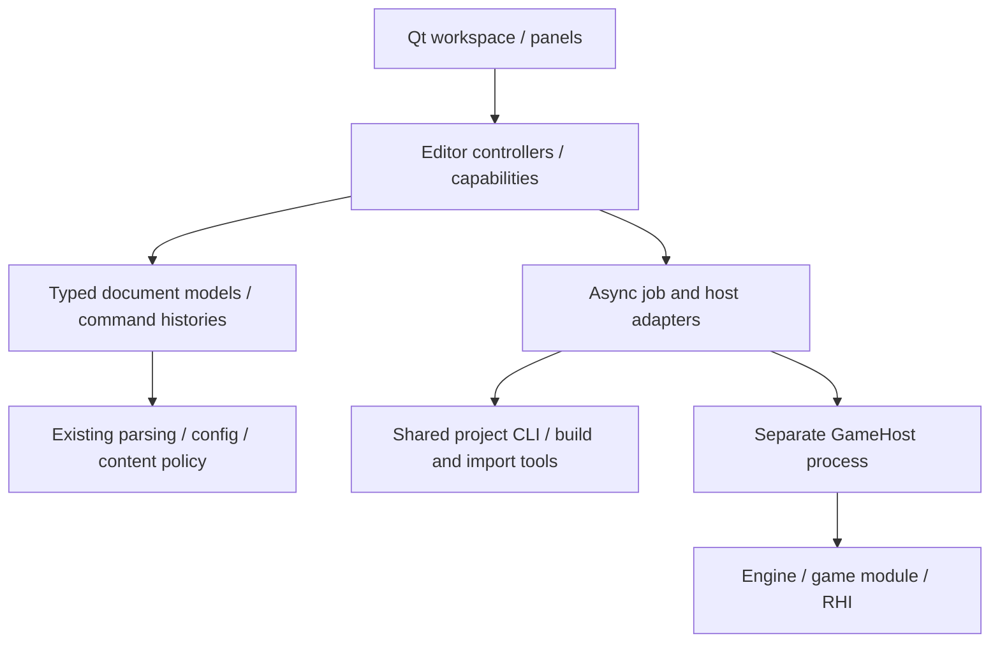

# Ludus editor architecture

Status: proposed long-term architecture, updated 2026-10-06. S1 workspace shell
and a bounded Qt/Wasm document preview are implemented. The new
[GUI systems target](editor-gui-systems.md) and
[ADR 0023](../decisions/0023-editor-presentation-and-document-core.md) define
portable authoring, native Linux/macOS/Windows presentation and browser
qualification. The [new reference review](editor-gui-reference-review.md)
records the proposal before reading and the resulting refinements. The
[October 4 review](editor-design-review.md) remains historical evidence.
Later stages are acceptance contracts, not claims about existing features.

## Product and engineering goals

The editor should let a developer open a project, understand its setup, author
content, test it, and diagnose failure without losing work. Optimize for a small
team's ability to change and debug the tool. Sophistication belongs in reliable
workflows, precise feedback, and measured responsiveness.

Keep Qt Widgets as the native shell over a private Qt-free document/application
core. Use its docking, focus, accessibility, menus and platform conventions;
keep Qt out of installed engine headers. Redesign the shell around the active
document and useful context, with fewer permanent rows and empty panels. A bespoke
UI renderer or a plugin framework needs a measured requirement before adoption.
The existing controller, project store, asynchronous process adapters, audio
workspace, and out-of-process GameHost are the starting point.

## Ownership and dependency boundaries

| Boundary | Owns | Contract |
| --- | --- | --- |
| Shell | Widgets, focus, panel layout, presentation | Sends user intentions; reads controller state; never launches tools directly |
| Document | Stable identity, schema, draft, saved-content identity, dirty state, undo | Validation and explicit save; runtime responses cannot silently author content |
| Controller | Workflow phase, capabilities, selection, in-flight requests | One authority per workflow; explicit errors and state transitions |
| Job adapter | Child process, cancellation, bounded output, request identity | Completion includes project epoch/revision; stale results cannot publish |
| Content service | Parsing, import, validation, serialization | Shared with CLI/runtime where applicable; no Qt or editor dependency |
| GameHost | Simulation and module lifetime | Copied, bounded protocol data; no widget access or pointers across process boundaries |
| User preferences | Layout and recent-project paths | Local and replaceable; never serialized into project documents |

Do not replace all controllers with a universal state machine. Split a workflow
when it acquires independent lifetime or document ownership. Keep transitions
plain and inspectable; report phase, request ID, source revision, and failure
context through existing diagnostics. Infrastructure remains exception-free.

## Documents, commands, and selection

Authored source, unsaved draft, and simulated state are distinct. A live edit
changes the session. Copying an eligible live value to a tuning draft is another
explicit action. Saving persists a captured draft through validation and the
existing atomic replacement/conflict policy. Revision is monotonic and rejects stale results;
dirty state compares content with the saved state. Undo back to saved content
can be clean at a newer revision. See the GUI systems transaction contract for
pending text, save-during-edit, gestures and bounded history. Each document
owns its history; future runtime undo is a different history and is invalidated when its session/schema identity changes.

For future scene/asset tools, use typed document operations with a target ID,
before/after values, and validation results. Coalesce a drag into one undoable
operation at gesture end; preview intermediate values without adding hundreds
of history entries. Stable asset IDs and generation-checked entity handles
identify selection; row numbers and runtime addresses do not. Resolve selection
against the current document/session revision before applying an operation.
Start with explicit schemas and adapters. Introduce shared reflection only when
multiple implemented tools justify it; labels, bounds, units, and editability
must be explicit metadata rather than inferred from C++ memory layout.

## Asynchronous work and publication

Never block the GUI thread on compilation, import, device waits, or shutdown.
Use existing process/worker adapters, bounded queues, cancellation, and copied
results. A job captures project identity plus relevant source/schema revision.
A successful result becomes visible only if those identities still match.

Source assets remain authoritative. Future import/cook results use a key derived
from source content, settings, importer version, and target platform. Build in a
staging location, validate dependencies, then publish an immutable version. A
failed import retains the last valid artifact and exposes the error. Do not
invent a distributed cache or database for the initial asset browser.

Code reload retains the existing host boundary and checkpoint migration. Old
code is released only after no execution can reference it. UI notifications are
coalesced; source watching stays opt-in and bounded. Runtime property snapshots
retain schema/revision checks from the current live-reload implementation.

## Workspace and future viewport

The default shell gives the central work area to the current authoring task.
Project settings and Audio are separate tabs. Welcome contains recent projects
only while no project is open; File keeps its recent-project menu while authoring.
The standalone offline Configuration tab stays accessible across project changes;
its explicitly loaded preview and preference draft have independent ownership.
Live Inspector is an optional right panel, and Output is an optional bottom
panel. In the proposed redesign, empty/inapplicable panels start collapsed and
narrow windows use tabs/drawers to preserve the central form. Menus expose every
dock and a Reset Layout action. The current toolbar reuses menu action objects.
The target compact contextual strip uses the same command catalogue as menus/shortcuts so capability gating
cannot disagree; unsupported browser actions do not occupy a permanent row.
A status area exposes workflow state. User layout is versioned, size-bounded, and saved on accepted close;
missing, oversized, or incompatible settings fall back to a useful default.
Only locally generated layout blobs are eligible; project files cannot supply
layout state. App and exact Qt versions are checked before restoring it.

A future Scene tab composes a hierarchy, viewport, and document inspector. It
must first ship selection, transform editing, save/undo, and validation as one
vertical slice. The viewport uses an explicit render-surface adapter to RHI;
use trusted in-process authoring rendering from document snapshots, separately
from out-of-process gameplay. Native embedding and browser canvas composition
require prototypes; host-frame transport is optional later work. Current RHI
does not already expose a general borrowed/multiple-surface editor contract.
Never couple Qt widget lifetime to live game-module memory. GPU picking and worker results carry
scene/session revision so delayed hits cannot select obsolete objects.

## Performance and observability

Use budgets as targets to measure on a named reference machine, not unverified
claims: common UI actions should visibly acknowledge within 100 ms; normal
interactive authoring should fit a 16.7 ms frame budget; shutdown must remain
responsive while waiting for workers. Record p50/p95 latency, input dataset,
build profile, queue depths, and allocations before optimizing.

Virtualize large asset/hierarchy lists. Update changed roles/rows, preserve
selection and edit buffers, and append bounded diagnostics. Do not rebuild a
focused form on every host heartbeat. Avoid allocation on engine hot paths;
ordinary editor UI may use Qt containers. Reuse the existing logging/profiling
system rather than adding a second telemetry stack.

## Delivery and acceptance

| Stage | User result | Acceptance |
| --- | --- | --- |
| S1: shell | Work areas and panels fit a normal desktop; layout can be recovered | Existing workflows pass; hide/show/reset/restart/corrupt-settings regressions; offscreen screenshot; native interaction remains a separate check |
| S1 follow-up: project UX | Automatic verified creation, folder picker, Welcome recents, Close Project and discoverable shortcuts | Draft/cancel/failure protection; shared SDK selection; dark/light border review; direction concepts |
| S2: document interactions | Predictable edit/save/undo and stable focused fields | Unsaved switching/close policy; no heartbeat resets; scoped shortcuts; failure preserves drafts |
| S3: content browser | Find/import/reimport an asset and understand failure | Stable IDs; cancelled/stale jobs; staged publication; large-list measurements |
| S4: scene authoring | Select, transform, undo, save, then Play | Typed scene document; failed load rollback; revision-safe picking; actual rendered-frame and native input acceptance |
| S5: specialist tools | Animation/material/audio extensions reuse contracts | Ship each with validation, undo, preview ownership, and representative user tasks |

The GUI systems delivery sequence refines S2–S5 with a Qt-free project-settings
extraction, shell redesign, browser/native integration probes, and a complete
asset/scene slice. It introduces no calendar deadline.

Each stage is an independently reviewable PR. Keep existing project setup,
live-reload, audio, entity, and level-data contracts; this document organizes
their integration. Do not claim S2–S5 are implemented by S1.

## Related contracts

- [Workspace implementation](../development/editor-workspace.md)
- [Project setup](project-sdk-workflow.md)
- [Live reload](../development/project-live-reload.md)
- [Audio authoring](audio-authoring.md)
- [Entity/world](entity-world.md) and [level data](level-data.md)
- [Interaction design](editor-interaction-design.md)
- [Reference review and design changes](editor-design-review.md)
- [Multiplatform GUI systems](editor-gui-systems.md)
- [GUI reference review](editor-gui-reference-review.md)
