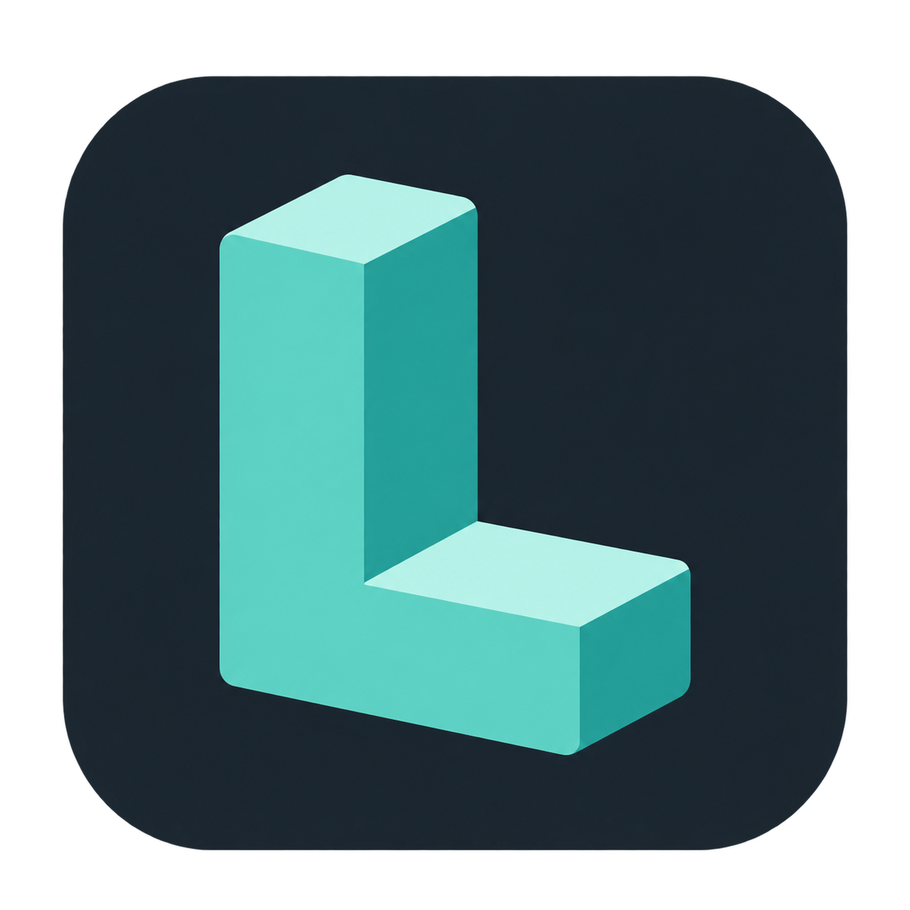

# Ludus product and art direction

**Selected direction (October 7, 2026): Quiet Studio with the Ludus Block
identity.** The approved logo is a mint, extruded capital **L** on a rounded
charcoal tile. Its clear silhouette, solid construction and restrained depth
set the visual direction for the editor, default project icon, documentation
and eventual website. It does not prescribe the art style of games made with
Ludus.

This is a design target, not a claim that the production theme or application
icons have shipped. The [multiplatform GUI systems](editor-gui-systems.md) and
[interaction design](editor-interaction-design.md) continue to own the compact
contextual row, useful central documents and optional secondary panels. Native
OS decoration/menu conventions stay native; the browser gets no simulated OS
title bar. A shared semantic component/token layer must style Qt controls
coherently; surrounding HTML cannot theme a Qt canvas. See the
[October 6 review](editor-gui-reference-review.md) for the actually read Excise,
Progressive Disclosure and Evaluation excerpts.

## Product promise

Make creative work predictable. Ludus owns routine setup, shows what is happening,
and protects the user's work. Complexity is available when it serves a task.
People should understand a command's outcome before invoking it and recover from
a failed operation without reconstructing their workspace.

This promise constrains implementation: one command and capability policy across
menus/buttons/shortcuts, one shared project backend across editor/CLI, explicit
save/discard/cancel, truthful progress, and verified publication. Automation must
reduce decisions without hiding failures or silently changing engine identity.

## Ludus Block identity

The [standalone transparent mark](images/ludus-block-mark.png) and
[rounded tile icon](images/ludus-block-icon.png) are the approved visual
references. Both are 1254 × 1254 PNGs with alpha, created with built-in image
generation and approved by the project owner on October 7, 2026.
They establish the appearance; production vector masters, size-specific exports
and platform icon packaging remain implementation work. The earlier flat wiki
mark is an existing asset awaiting adoption of this direction.

The letter should read as a building block: substantial, approachable and
precise. Preserve the upright stem, projecting foot, open inner corner and
consistent isometric perspective. Pale mint top planes and deeper teal side
planes explain the volume. The approved raster has gentle shading and rounded
edges; retain that character in large brand artwork, while small exports may
simplify shading to solid planes so the silhouette stays clear.

| Brand role | Target color | Use |
| --- | --- | --- |
| Mint front face | `#57d2c1` | Dominant logo color; dark-theme primary actions and focus |
| Pale mint top plane | `#b6f3e8` | Logo highlights and restrained supporting brand artwork |
| Deep teal side plane | `#229e95` | Logo depth; supporting brand artwork |
| Charcoal tile | `#18232c` | Application icon backdrop and dark workspace anchor |

These are reproducible design tokens, not exact samples of every shaded pixel
in the generated reference. Brand plane colors are not automatically suitable
for text or interaction states; use the semantic tokens below.

### Mark and icon use

- Use the charcoal tile for the editor application icon and the default icon
  of a project without its own artwork. User-supplied project artwork takes
  precedence; the fallback must not imply that every game shares Ludus branding.
- Use the standalone mark for documentation headers and Welcome branding when
  the surrounding surface already supplies a clear backdrop. Keep branding
  small in an active workspace so scene content remains the visual focus.
- Preserve aspect ratio, orientation and palette. Keep clear space of at least
  one sixth of the mark's width around the standalone mark; do not crop the foot
  or fill its inner corner. The supplied tile already includes its own inset.
- Keep the mark free of text, status badges, selection tint and animation.
  Place project names and operation/status indicators beside the icon. Use
  ordinary semantic glyphs for commands, files and diagnostics.
- Validate dedicated 16, 24, 32, 48, 64 and 128 pixel exports on dark and light
  surfaces. At small sizes simplify shading and tune edges to the pixel grid;
  do not assume scaling the reference PNG alone yields a readable icon. Platform
  packaging must account for OS masks and avoid applying a second rounded tile.

## Earlier direction studies

Open the [interactive proof of concept](../development/previews/editor-art-direction.html)
locally in a browser. Switch the direction cards, then try New Project, Browse,
Create, Close Project, and Build and Play. It simulates those interactions and
creates no files. The desktop implementation uses a real folder picker and
verified backend. This prototype and the captures below predate the selected
Ludus Block identity. They remain interaction studies, not the current palette
or a production theme.

| Direction | Philosophy | UI/UX emphasis | Visual language | Cost and tradeoff |
| --- | --- | --- | --- | --- |
| **Quiet Studio** (selected interaction model) | Protect attention; reveal complexity when useful | Task-focused Welcome; contextual authoring tools; advanced choices on demand; discoverable shortcuts | Earlier graphite/teal study; now refined by the Ludus Block identity | Lowest default visual load; expert speed requires deliberate shortcuts and compact layouts |
| **Instrument Panel** | Be a dependable, inspectable instrument | Compact rows; fixed command positions; continuous operation/ownership/recovery status | Charcoal, amber accent, square edges, precise strong dividers | Expert efficiency; more visual load and a higher learning burden if status becomes controls |
| **Open Workshop** | Build confidence through the task | Comfortable spacing; short explanations of outcomes; guidance that can be dismissed as skill grows | Light surfaces, cobalt actions, generous spacing, clear section structure | Accessible onboarding and documentation fit; repeated work needs a compact option |

Selected combination: Quiet Studio's attention model, Instrument Panel's truthful
status/recovery, and Open Workshop's plain language. Keep one coherent default;
do not combine all three layouts or add permanent guidance/status columns.
Dark/light appearance is an accessibility and environment preference. Both
appearances use the same mint/teal identity; amber and cobalt from the earlier
studies are not alternate brand palettes to ship.

The captured concept views are [Quiet Studio](../development/images/editor-direction-studio.jpg),
[Instrument Panel](../development/images/editor-direction-instrument.jpg), and
[Open Workshop](../development/images/editor-direction-workshop.jpg). Actual Qt
creation captures: [dark](../development/images/editor-project-creation-dark.png)
and [light](../development/images/editor-project-creation-light.png); these show
the native usability fix, not a finished production theme.

## Common interaction rules

- **Creation:** Name → Location with Browse → Create Project. Show the resulting
  new folder. Engine discovery and preparation happen behind this explicit action;
  specialist override lives in Advanced. Explain first-time downloads before Create.
- **Workspace:** Welcome carries recents while no project is open. Loaded projects
  receive the authoring area; File → Recent Projects remains available. Empty
  inspectors can be hidden through View; Reset Layout always restores access.
- **Ownership:** a dialog has an unmistakable outer edge, title, primary action,
  and Cancel. Panels have visible title and splitter boundaries. Keyboard focus
  is visible, and disabled actions use the same capability rules everywhere.
- **Closing:** preserve settings/audio drafts with Save/Discard/Cancel. Failed
  Save and Cancel retain the project. Stop active work before Close Project;
  Close Project returns to Welcome without quitting the editor.
- **Language:** use verbs and outcomes. “Create Project” beats “OK”. Label Save
  Project Settings accurately until S2 adds focused document save routing.
- **Feedback:** identify operation and result; diagnostics remain selectable.
  Never claim readiness until configure/build/tests have completed. Do not steal
  selection or reset focused fields on runtime heartbeats (S2 acceptance).

## Visual system target

The HTML study has isolated surface/text/border/accent/radius tokens. The native
fix currently preserves platform fonts, palette, controls and window decoration,
adding only explicit palette-appropriate panel/dialog/splitter outlines. It uses
logical pixels and layout managers, with no custom title-bar hit testing.

Use cool charcoal surfaces, mint actions, readable neutral text and modest
rounding. Translate the logo's construction into clear panel grouping and
strong silhouettes. Controls remain flat and easy to scan; isometric faces,
bevels and shaded blocks belong to brand artwork, not every button or panel.

| Semantic token | Dark appearance | Light appearance |
| --- | --- | --- |
| Workspace / panel | `#18232c` / `#222f39` | `#edf3f2` / `#ffffff` |
| Raised surface | `#2c3c47` | `#e1ece9` |
| Text / secondary text | `#e9f2f1` / `#b5c5c9` | `#18232c` / `#4c6267` |
| Border | `#80969e` | `#71878b` |
| Primary fill / text on fill | `#57d2c1` / `#18232c` | `#14786f` / `#ffffff` |
| Focus ring / interactive text | `#57d2c1` | `#14786f` |
| Selected surface / text | `#294b4b` / `#e9f2f1` | `#d5eee8` / `#18232c` |

Mint is the recognizable brand color in both appearances. On a light surface,
use the darker semantic teal for interactive text, focus rings and primary
button fills; reserve bright mint for artwork or fills with charcoal text.
Keep text and focus legible against every hover, pressed, selected and disabled
surface. Before shipping, verify at least 4.5:1 for normal text and 3:1 for
large text and essential control/focus boundaries in the actual rendered
components. Selection and keyboard focus need distinct treatments, such as a
tinted selection surface and an explicit focus outline, even when combined.

Use 4 logical px corner radii for compact controls, 6 for grouped surfaces and
8 for Welcome/project cards. The icon tile's broad rounding is a branding
proportion, not a radius to apply to dense editor controls. Distinguish workspace,
panels and raised dialogs through surface values, restrained borders and
explicit splitter boundaries. Avoid floating card decoration around every
inspector field; long property lists need consistent alignment and compact rows.

Use a system sans-serif font; monospace only for paths, code and numeric debug
values. Use a small spacing scale (4/8/12/16/24 logical px), clear section titles,
and text with icons for primary actions. Match command glyphs by optical size,
stroke weight and modest rounding; reserve the dimensional L for branding.
Accent identifies selection/focus and primary actions; warning/error/success
also need words or symbols and separate semantic treatments. In particular,
mint action styling alone must not imply successful completion.

Use balanced density by default and a compact option for repeated expert work.
Welcome and project creation can have more breathing room and a visible mark;
the authoring workspace keeps chrome quiet around the central document. No
decorative animation during editing, rotating logo, glossy control gradients,
glow, glass blur or external font downloads. Respect reduced-motion preferences
for any functional transition introduced later.

The shared component layer must apply these roles to native and browser
presentations while preserving each platform's navigation and decoration
conventions. High-contrast/system accessibility appearances may override colors
or effects to preserve readability and state visibility.

## Validation before implementation acceptance

The logo selection fixes the identity; usability and component validation still
determine how the editor applies it. Run the same tasks against the updated
Quiet Studio design, then the native editor: create a project
without knowing SDK locations, choose its parent folder, cancel creation, reopen
a recent project, find a shortcut, attempt close with unsaved changes, cancel,
save and close, and recover a hidden panel. Observe novice and experienced
contributors; record completion, wrong turns, help requests, expected outcome,
and preference with a reason. Do not treat preference or screenshots alone as
proof of usability. Check dark/light, keyboard-only navigation, 900×740 and
high-DPI layouts, long paths, and the actual desktop folder picker. Check logo
exports at actual size, projects with custom artwork, focus combined with
selection, and readable diagnostics independent of brand color. Record whether
captures show the historical prototype, a themed component study or the shipped
editor; approval of the logo is not evidence of completed theme integration.

## Consulted design references

The [TOC reading guide](editor-reference-reading-guide.md) remains the catalogue;
selected chapters were read, rather than treating a chapter title as evidence.
Thanks to **David Lightbown**, *Designing the User Experience of Game Development
Tools* (CRC Press, 2015), ch. 4 pp. 53–62 (mental models/task flows), ch. 5
pp. 80–86 (hierarchy/constraints/mapping), pp. 112–115 (progressive disclosure),
and ch. 6 pp. 117–129 (evaluation). [Author's companion site](https://www.uxofgametools.com/).
Adaptation: compare task-based concepts and disclose engine selection; retain
native controls rather than reproducing the book's illustrative interfaces.

Thanks to **Graham Wihlidal**, *Game Engine Toolset Development* (Thomson Course
Technology, 2006), ch. 37 pp. 423–430, “Responsive UI During Intensive Processing.”
[Author's book](https://www.wihlidal.com/files/getd_full_book.pdf). Adopt responsive,
cancellable operations; preserve Ludus's existing supervised adapters and
exception-free C++ instead of the historical .NET examples. See the
[design review](editor-design-review.md) for implementation decisions and evidence.
