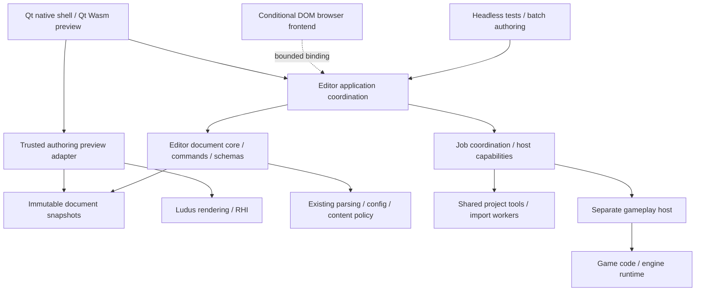

# Multiplatform editor GUI systems

Status: proposed target architecture, 2026-10-06. This is a design decision,
not a GUI rewrite or a claim of measured superiority. The current Linux Qt
workspace and bounded Qt/Wasm document preview remain the implemented baseline.
The native macOS/Windows editor, Qt-free document core, scene viewport and
contracts below require implementation and acceptance. The
[initial S2 slice](../development/editor-workspace.md#initial-s2-document-interactions)
implements a Qt-free bounded history primitive and adapts the current Qt project
settings form; descriptor validation and persistence have not yet moved into
the portable core. This does not complete milestone M1.

## Decision and priorities

Build a **portable document/command core, a Qt 6 Widgets native shell, and Ludus
rendered authoring viewports**. Keep the current Qt/Wasm preview. Qualify its
presentation for full browser authoring against explicit gates; select a DOM
frontend if it cannot pass them. Share document semantics across frontends and
platforms, while giving each host honest file, process and rendering capabilities.
[ADR 0023](../decisions/0023-editor-presentation-and-document-core.md) records the
selection and when to revisit it.

The priority order is preservation of work and predictable operations; usable
text, keyboard and accessibility; readable ownership and debugging; responsive
large documents; then visual polish, footprint and advanced customization.
There is no release deadline. This permits real integration experiments and
user evaluation; it does not make the lifetime cost of an extra toolkit vanish.
The recommendation is engineering judgment for Ludus, not a universal toolkit
ranking. There are no comparative performance results yet.

The modern part of this design is the combination of headless authoring,
transactional edits, revision-safe jobs, isolated gameplay and measured,
semantic presentation. A renderer that can draw buttons does not supply all
of those systems. Keep toolkit choice replaceable by putting authoring policy
below presentation, rather than designing a universal widget API. A future DOM frontend consumes
the same core compiled to Wasm through bounded typed commands, queries and
incremental deltas; it must not reimplement document validation/history in
JavaScript or serialize an entire project on each keystroke. Choose the smallest
binding needed by the accepted workflow, not a general RPC/object proxy system.

## Toolkit evaluation

| Option | Where it helps | Cost or constraint | Decision |
| --- | --- | --- | --- |
| Qt Widgets | Native forms, trees, tables, text, menus, accessibility, docking; existing C++ tools | Custom visual design needs discipline; browser integration has separate limits | Selected native presentation |
| Qt Quick/QML | Highly custom, fluid interfaces and declarative visual composition | A second presentation language and item/model layer; specialized desktop authoring still needs work | Evaluate for a specific surface only when Widgets fails its task |
| DOM application, optionally desktop hosted | Browser semantics, inspectable layout, broad web UI ecosystem; strongest alternative for browser authoring | Additional bindings/toolchain and desktop packaging; native GPU composition/process services still need explicit integration | Browser fallback; whole-editor replacement requires evidence |
| Dear ImGui | Developer diagnostics and rapidly built renderer-connected tools | Upstream documents incomplete accessibility and international text shaping/bidirectional support | Optional developer overlay |
| Ludus-owned widget toolkit | Complete control over drawing and dependencies | Ludus must own editing, IME, shaping, focus, accessibility, docking, clipboard and platform behavior indefinitely | Do not build for the editor |
| Different native UI stacks per OS | Deep platform customization | Duplicate layouts, bug fixes and authoring integration | Shared Qt views with narrow host adapters |

Qt's model/view APIs allow a projection over a separate data repository; the
widget model need not own the document. Use that seam instead of item widgets
as the database. [Qt model/view documentation](https://doc.qt.io/qt-6.10/model-view-programming.html).
Mixing in `QQuickWidget` has a documented extra render pass and disables the
threaded Quick render loop; this specific embedding cost does not imply that
all Qt Quick applications are slow. [Qt QQuickWidget](https://doc.qt.io/qt-6.10/qquickwidget.html).
Dear ImGui's own stated limitations inform its role here.
[Dear ImGui](https://github.com/ocornut/imgui).

Start with Qt's built-in docking and a small number of named panels. Prototype
advanced docking middleware only if cross-window tab groups or other required
workflows cannot be served well; evaluate recovery, accessibility, supported
platforms and dependency terms before adoption. A single new feature is not a
reason to replace the entire shell. [KDDockWidgets](https://github.com/KDAB/KDDockWidgets)
is an evaluation candidate, not an added dependency.

## Dependency and ownership map

Arrows describe dependencies or data consumption, not synchronous scheduling.
The DOM frontend is conditional, not a second required implementation. The
core does not depend on Qt, the renderer, a window, a GPU, or game code. Rendering
failure must leave documents editable and saveable.

| Owner | Authority and lifetime | What it exposes |
| --- | --- | --- |
| Document core | One authored draft, validated edits, history and saved-content identity per document | Typed queries, operations, immutable snapshots and revision deltas |
| Application coordination | Open documents, active task, selection, operation routing and capability results | Explicit command context and workflow state |
| Presentation | Widgets, focused text buffers, view projections, layout, local navigation | User intent; no direct draft or runtime mutation |
| Host adapters | File/persistence operations, process ownership, dialogs and host lifecycle | Bounded requests/results and supported/unavailable reasons |
| Job coordination | Operation identity, progress, cancellation and result publication | Copied results; never Qt model calls from workers |
| Authoring preview | Trusted scene rendering, cameras, picking and per-surface state | Revision-tagged input/results; no arbitrary game-module loading |
| Gameplay host | Game code, simulation and runtime resource lifetime | Existing bounded session protocol |

These are logical boundaries, not seven mandatory libraries. Start with one
private Qt-free document/application library and one private Qt shell target
under `apps/editor`, plus existing tooling adapters. The current target called
`ludus_editor_core` contains Qt types; its name is not proof of this separation.
Extract one real workflow before deciding further target splits. Do not build
an editor framework in Foundation or export Qt through the installed SDK.

Use existing Foundation parsing, configuration, task and content facilities at
their documented boundaries. Project setup continues to use its
[shared CLI policy](project-sdk-workflow.md). Promote a domain service to its
existing engine owner only when a real non-editor consumer needs it. No new
allocator, general reflection system, global service locator or event bus is
required. Follow Ludus C++23, explicit-error, no-exception, type, include and
public documentation standards throughout the migration.

## Documents and edit transactions

A document has a stable identity, schema version, authored content, monotonic
revision, saved-content identity, and bounded history. Paths are locations,
not object identities. Entity/asset/property IDs survive view sorting; runtime
handles additionally carry session/generation identity. Qt row indices and raw
pointers cannot identify persisted operations.

**Revision and dirty state are different.** Every committed change, including
Undo, advances the revision used to reject stale results. Dirty compares current
content with saved content or a valid history savepoint. Undo can restore saved
content without restoring its old revision. History eviction must not falsely
mark a modified document clean. A save captures content and identity; if edits
occur while it runs, completion acknowledges that snapshot and leaves newer
content dirty.

Each edit follows prepare, validate, commit and notify. Prepare captures enough
before/after data for a reversible operation and reserves required storage.
Validation checks the current target, schema, operation constraints and expected
revision. Failure preserves the draft and history. Commit publishes one coherent
change and a copied delta. Multi-selection edits prepare every target before
committing; partial application is not success. Prefer small typed operations
and direct functions over a generic reflective setter language.

An interactive gesture owns transient preview state. Begin records its targets;
updates change only that transient state; accept publishes one history item;
Escape, capture loss, invalidated targets or failure discard the preview. A
preview is visually marked and cannot silently enter a save snapshot. Scene
transforms, numeric scrubbing and curve edits use this same contract. Small edits
store changed values; use bounded snapshots when structural changes justify them.
There is one authoritative document history, rather than a second independent
Qt undo stack. Undo/Redo checks the current history head, not the original edit's
now-obsolete dispatch revision.

Focused text editing has a separate, temporary buffer: incomplete numbers and
IME composition must be representable without becoming document values.
Background deltas must preserve that buffer; conflicting changes get an explicit
resolution path. Text-widget Undo operates on this buffer while it owns focus;
document Undo operates on committed changes. Save first validates pending edits
in scope and reports invalid ones without discarding them. Close considers
pending buffers as unsaved work as well as committed dirty documents.

Source files and authored drafts are separate from simulation state. Live tuning
changes a session; copying a supported live value to a draft is an explicit
validated command. Saving that draft is another operation. Preserve the existing
[configuration](engine-configuration.md) and
[live-reload](project-live-reload.md) owners and protocols.

Thanks to **Robert Nystrom**, *Game Programming Patterns*, “Command,” especially
Undo and Redo: reversible operations inform this design. Ludus adds stable IDs,
validation and failure preservation rather than adopting raw-pointer examples.
[Author's chapter](https://gameprogrammingpatterns.com/command.html).
The exact reviewed excerpts are in the [reference review](editor-gui-reference-review.md).

## Commands and property presentation

A small command catalogue describes a stable ID, user label, context, shortcut
scope, capability/reason, typed parameters and execution category. Menus,
buttons, shortcuts, command search and automation dispatch through the same
application operation. Catalogue metadata is not a second source of domain
validation. Host and document validation run again at dispatch.

Distinguish reversible document edits, session controls, and external operations
such as save/build/import. An external effect cannot be reversed by pretending
it is a history entry. Undo after saving changes the draft; it does not rewrite
the disk until another explicit save. Automation invokes document commands and
job requests, rather than synthesizing widget clicks. Begin with headless tests
and batch calls; macro recording or scripting requires a demonstrated workflow.

Property descriptors declare a stable key, value type, display name, group/order,
units, defaults, bounds, help, authoring/session scope and editability. The source
schema owns validation; Qt adapters select reusable editors. Multi-selection can
show a mixed value without overwriting all objects on focus. Display conversions
must round-trip deliberately; formatting must not reduce stored precision.
Expensive previews and custom editors are registered per property type as needed.

Do not expose every C++ member or use arbitrary raw setters. Metadata describes
semantics; it does not bypass commands, ownership or serialization policy.
Thanks to **Graham Wihlidal**, *Game Engine Toolset Development* (2006), ch. 20,
“Using the Property Grid Control with Late Binding,” pp. 199–203, and ch. 43,
“MVC Object Model Automation with CodeDom,” pp. 531–537, for metadata and
presentation-independent automation. Ludus uses explicit C++ schemas and typed
operations, without .NET reflection, CodeDom or a global Application singleton.
[Author's book](https://www.wihlidal.com/files/getd_full_book.pdf).

## Threads, jobs and debugging

The UI thread owns Qt objects, model/view notifications and the serialized
application/document commit point. Workers receive immutable inputs and return
copied results. A worker never calls `QAbstractItemModel` APIs; the UI adapter
applies deltas using Qt's row/role notification contracts.
[Qt model threading and updates](https://doc.qt.io/qt-6.10/qabstractitemmodel.html).
Use direct calls within an owner; queues only where lifetime/thread/process
boundaries require them. An event system for every field change adds indirection
without fixing ownership. Browser adapters use cooperative chunks or explicit
worker messages as supported; the current single-threaded Pages preview is not
proof that native threads or blocking modal waits work there. Threaded Wasm needs
its own toolchain/deployment qualification. Asyncify is a compatibility mechanism,
not an excuse to block authoring work indefinitely.

Every job captures an operation ID, project epoch, relevant document/content
identity and target profile. Source changes may invalidate a result even when
the project remains open. Before publication, check those identities and the
operation's terminal state. Old jobs cannot publish into a reopened document or
launch an old artifact after a failed build. Reuse the project's existing
supervision and cleanup contracts.

Cancellation is a request followed by acknowledgement or another terminal
outcome. “Cancellation requested” is not “Cancelled”; a completed commit cannot
be undone by a late cancellation. Coalesce progress, bound queues/output/history,
and reserve terminal delivery so a progress flood cannot hide completion. For
imports, stage and validate an immutable artifact before switching the active
version; retain the last valid artifact on failure. Do not move blocking waits
or unbounded parsing onto the GUI thread.

Correlate command, operation, document revision and session IDs in existing
logging/profiling. Inspectable phase transitions and explicit error context
should reveal who owns a failure. A bounded diagnostic command record can replay
authoring failures against a captured source snapshot; external effects require
mocked adapters and are never automatically replayed. It is not a promise of
bit-identical gameplay replay or an unbounded capture of project data.

Thanks to **Graham Wihlidal**, ch. 6, “Measurement Metrics for Tool Quality,”
pp. 43–48, ch. 8, “Distributed Componential Architecture Design,” pp. 57–61,
and ch. 37, “Responsive UI During Intensive Processing,” pp. 423–428: the adopted
ideas are measurable maintainability, multiple entry points and responsive
cancellable work. We use private in-process functions and existing process
adapters rather than the book's .NET/COM/remoting stack.
[Author's book](https://www.wihlidal.com/files/getd_full_book.pdf).

## Rendering and platform hosts

Use Qt for the shell, forms, tables, hierarchy, search and text. Use custom Qt
2D painting for graph/timeline canvases when standard controls cannot serve them;
provide keyboard operations and semantic accessibility alongside drawing. Use
Ludus rendering for scene/material/game previews and 3D gizmos. Optional ImGui
panels serve developer diagnostics. Runtime UI remains its own engine concern;
`modules/ui` is not an editor widget toolkit.

Authoring preview runs trusted engine rendering from immutable draft snapshots;
it does not load arbitrary project game code. Gameplay stays in the supervised
GameHost. Start Play with its own window where supported. Out-of-process frame
transport is optional later work with explicit format, ownership, sequence,
resize and backpressure contracts. Do not promise universal zero-copy sharing
between Qt, Ludus and a child process. CPU readback is a diagnostic fallback,
not the assumed interactive production path.

A render-surface adapter must specify who creates/destroys the window/view/canvas,
which thread may access it, pixel dimensions and scale, surface generation,
device/session identity, and teardown fencing. Resize, hiding, reparenting,
detaching, display change and device loss are normal transitions. Stale picking
results carry document, camera and surface identities and cannot select a new
scene or use an obsolete image after resize. Reuse the proposed
[camera ownership and render-view contract](camera-systems.md) for each logical
output; editor navigation is its own view state, not authored game camera data.

**This integration is not implemented by passing `winId()` to current RHI.**
Current Platform native-window handles are borrowed from Platform-owned windows;
current RHI window connection is not a general multiple-surface editor API.
Prototype a borrowed-surface contract and backend changes separately, preserving
Platform ownership. Native child-window embedding, focus, clipping and popups
need Linux Wayland/X11, macOS view and Windows tests. Cross-process reparenting
is not a portable default. A separate preview window remains the recovery path.

Multiple authoring views should share compatible preview resources/device where
the backend permits, while owning independent surfaces, cameras and render state.
Do not create a device per panel or assume the Qt compositor shares Ludus's device.
A device failure invalidates every dependent surface; each view establishes its
state explicitly. Thanks to **Graham Wihlidal**, ch. 25, “Using Direct3D Swap Chains
with MDI Applications,” pp. 243–247, for the shared-resource/per-view-lifetime
review. Its Direct3D 9 reset and swap-chain APIs are historical; modern RHI/Metal/
WebGPU behavior must be proven independently.
[Author's book](https://www.wihlidal.com/files/getd_full_book.pdf).

| Host | Shared presentation and policy | Host-specific acceptance |
| --- | --- | --- |
| Linux native | Qt views and portable authoring core | Existing process policy; Wayland/X11 focus, surfaces and dialogs |
| macOS native target | Same Qt views and core | Application menu, Command shortcuts, IME/VoiceOver, display scale, NSView/Metal lifetime, app bundle and process cleanup |
| Windows native target | Same Qt views and core | DPI changes, dialogs/paths, process-tree cleanup, surface and packaging integration |
| Browser | Current Qt/Wasm preview; qualified full-authoring frontend | Asynchronous files, download/recovery, browser focus/IME, semantic accessibility, canvas composition and unavailable native services |

Use Qt's public platform behavior for ordinary text, clipboard and dialogs;
add narrow host services for operations with different capability/ownership.
Do not abstract every Qt API into Ludus. Process availability, filesystem access,
audio and render support are independent capability results with useful reasons.
An OS rendering backend alone does not establish native editor support.

Browser composition requires a real prototype: Qt/Wasm presentation uses WebGL,
while the Ludus viewport uses WebGPU. Separate canvases must agree on logical and
physical bounds, clipping, stacking, popup overlap, focus, input and DPI. A DOM
frontend has similar viewport obligations. Host a canvas in a supported layout
seam; do not rely on Qt private globals as the enduring rendering API. A failed
viewport leaves the document UI usable. [Browser strategy](editor-browser-strategy.md)
defines the frontend selection gates and persistence limits.

## Workspace and visual system

Redesign around the active document, using the
[interaction contract](editor-interaction-design.md). Native hosts keep normal
OS window decoration and platform menu conventions. Browser hosts use an app
container without a simulated OS title bar. One compact application/context row
exposes project, document, save state and useful actions. The central task gets
space before optional inspector and diagnostics panels.

Keep common actions visible in a stable menu or contextual strip as well as
shortcuts/context menus. Place frequent context actions near their work; advanced
options and infrequent panels can be disclosed. Do not shuffle action positions
based on live usage metrics. Narrow containers switch secondary panels to tabs or
drawers, rather than clipping form fields behind empty docks. Hide the Inspector
when it has no applicable selection and keep empty Output collapsed by default;
show actionable job/error indicators without stealing focus. Large desktop
workspaces remain customizable with a recoverable default.

A small semantic design system owns surfaces, text, focus, selection, error,
spacing, typography, density and icon roles. Bind it to Qt palettes/style and
limited shared styling; avoid a separate stylesheet per panel. Preserve system
text behavior, scale and contrast choices. Light/dark and compact/comfortable
variants share components. HTML around a Qt canvas cannot theme the widgets
inside it. Accessibility includes names, roles, focus order, keyboard equivalents,
text entry and usable errors, rather than a color contrast pass alone.

Thanks to **David Lightbown**, *Designing the User Experience of Game Development
Tools* (CRC Press, 2015), ch. 5, “Excise” and “Progressive Disclosure,” pp. 104–114,
and ch. 6, pp. 117–129: remove repetitive navigation and clutter while preserving
discoverability; evaluate tasks with real users. These are workflow principles,
not a mandate to imitate another editor's skin.
[Author's companion site](https://www.uxofgametools.com/).

## Performance, evidence and delivery

Ordinary GUI work paints on demand. Active gestures/visible previews schedule
frames; inactive or hidden viewports stop or throttle. Preview frame rate does
not justify continuously repainting every panel. Virtualize large lists with
paged/lazy data, update changed roles, bound thumbnail caches and diagnostics,
and prioritize visible data. Preserve selected IDs and focused buffers across
updates. Optimize only after tracing input, domain work, notification and paint
costs separately.

Initial engineering targets below require a named machine, OS/browser, release
profile and reproducible dataset. They are targets, not current results or
industry benchmark claims. Baseline before setting enforced regression budgets.
Correctness, recovery and accessibility are hard gates even when a frontend is
faster. An unsupported browser/host must receive a useful capability explanation.

| Exercise | Measurement / gate |
| --- | --- |
| Ordinary command or property edit | Visible acknowledgement p95 under 100 ms; domain mutation and paint measured separately |
| Active viewport/drag | Target 16.7 ms total frame at 60 Hz; report p50/p95 and stalls, with Qt and engine costs separated |
| Idle open editor / hidden views | Record CPU, wakeups and GPU submissions against host baseline; no application-wide fixed refresh loop |
| 10,000 scene objects / 100,000 asset rows | Search, scroll, selection and edits remain usable; bounded models/caches; no widget per row |
| 100 Hz session updates / flooding diagnostics | Coalesced updates; edit buffers survive; completion and cancellation remain deliverable |
| Cold start / browser download | Record bytes, p50/p95 ready-to-edit, peak memory and failure recovery on declared devices |
| Add one property and one command | Domain registration plus adapter work, no duplicated validation in platform views; record files touched and debugging effort |

Deliver in reviewable vertical slices with acceptance evidence:

1. **M1: Portable authoring core.** Extract project-settings documents,
   validation and save into the Qt-free core. Prove the same fixtures and failure
   semantics headlessly, natively and in Wasm. Test save-during-edit, conflicts,
   history/savepoint behavior, invalid buffers and explicit allocation/error
   outcomes. Preserve existing serializers first.
2. **M2: Workspace shell.** Redesign the shell and semantic controls using those
   operations. Verify real keyboard, text, light/dark, narrow-container and
   panel-recovery tasks, including macOS integration; an offscreen screenshot
   alone does not qualify a platform.
3. **M3: Platform and viewport qualification.** Resolve browser frontend,
   large-model and native rendering risks with small runnable prototypes. Test
   Unicode/IME, screen readers, virtualized selection, compositor overlap and
   device/surface failure. Record decisions against the same tasks. If Qt/Wasm
   fails hard browser tasks, adopt DOM for browser and retire the preview frontend
   once it replaces its workflows.
4. **M4: End-to-end scene workflow.** Ship one asset/scene slice: import, find,
   place, select, transform, Undo, save, reopen and Play. Include cancelled/stale
   jobs, picking after resize, crash recovery and a real rendered frame. Establish
   multiple-surface RHI support before promising multiwindow scene previews.
5. **M5: Specialist authoring tools.** Add material/animation/audio tools through
   the same schemas, commands and preview ownership. Register trusted extensions
   statically first; do not auto-load native project plugins or hot-unload Qt
   object code. Add scripting or worker/plugin protocols only for a concrete task.

After M1–M4 pass their acceptance gates, record the implementation baseline and
perform the [deferred research review](editor-gui-reference-review.md#deferred-review-after-the-first-implementation).
Return to GDC/UIST and the other selected conferences, journals and talks with
observed workflow, performance and maintenance problems; compare bounded
experiments before changing the architecture. M3 qualification work remains part
of the first implementation. Specialist readings follow the relevant M5 work.

Per-document saves preserve conflict detection and atomic replacement semantics.
Multiple files do not acquire a fictitious global filesystem transaction. Design
recovery snapshots/journals with explicit bounds and crash guarantees before
shipping scene authoring; test truncated writes, stale recovery and failed flushes.
Browser persistence/export has a separate host contract: handing bytes to a
browser download acknowledges export, not durable saving to a chosen native
file. Label that outcome honestly; keep recovery/export reminders until the
product's declared persistence guarantee is met. Browser tab-close/unload cannot
be assumed to complete an asynchronous save. Reuse existing save
policies during extraction rather than silently expanding their guarantees.

The [reference review](editor-gui-reference-review.md) preserves the initial
proposal and the actual changes caused by reading. Existing E0/S1 specifications
remain historical implementation contracts; this target guides subsequent work.
