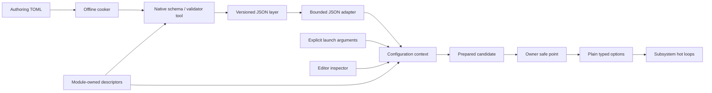

# Engine configuration

Status: first implementation. `FoundationConfig`, `FoundationConfigJson`, and
`RuntimeConfiguration` are portable SDK modules. GameHost consumes its startup
schema; the optional Qt Editor and native `ludus-config` tool share it. Existing
subsystems migrate separately, retaining their ordinary options APIs.

The design keeps configuration work at control boundaries. Subsystems use plain,
module-owned options in their hot loops. Human-readable names, layered overrides,
parsing, validation, provenance, and persistence belong to a small control core.
One immutable descriptor per setting drives runtime validation and tool metadata.
No global registry, static constructor registration, writable member pointers,
scripting interpreter, general reflection framework, or hot-loop string lookup.

## Architecture and ownership



`FoundationConfig` depends on Base, Memory, Strings, and private Math. It knows
neither files nor JSON. `FoundationConfigJson` adds the existing bounded shared
JSON parser/writer. `RuntimeConfiguration` owns the first GameHost schema and its
plain `HostOptions` adapter. Qt, TOML, Python, and filesystem discovery stay out
of these modules. Native and browser builds compile the same core.

A context has one control owner. Its methods are deliberately not thread safe.
The supplied immutable schema, its names/choices/help, validation callback state,
and allocation domain must outlive the context. Module unload requires destroying
its contexts before code or descriptor memory is released. Destroyed contexts'
bindings cannot validate in another context: each context gets a nonwrapping
process-local identity. Bindings are local capabilities, never serialized IDs.

Consumers materialize ordinary typed options at a frame/job/session boundary.
They do not retain references into context storage. For workers, distribute an
owner-created immutable options snapshot or copy into job inputs; publication,
retirement, and cross-thread synchronization remain with the subsystem. The core
has no background callbacks or automatic device mutation.

## Schema contract

A `Descriptor` contains an exact dotted lowercase name, typed default, help,
units, numeric bounds, enum choices or bounded text, allowed source mask,
application group, apply policy, persistence policy, and simulation flag.
Examples: `host.headless` and `host.max_frames`. Names are at most 128 bytes;
segments start with a lowercase letter and continue with letters/digits/underscore.
Text is valid UTF-8, contains no NUL, and has an explicit byte bound of at most 256.
Booleans, signed/unsigned 32/64-bit integers, finite float32/float64, enums, and
strings are supported. Containers and asset/entity properties belong to their
own domain schemas, rather than enlarging this configuration vocabulary.

Schema validation rejects duplicate names, invalid defaults, inconsistent bounds,
invalid metadata, duplicate enum choices, unsupported sources/groups, and
persistence without permission to use the Preference layer. Values have exact
kinds; booleans and enum/string values never coerce from numbers or each other.
Float32 narrows once, verifies the rounded value against bounds, and canonicalizes
zero. Float64 and Float32 reject nonfinite values. Cross-field constraints use an
optional pure, `noexcept` callback over the entire candidate in descriptor order.
Callbacks must not mutate engine state or reenter the context. Live changes also
validate the projected active options against restart values still in use; the
pure callback may run more than once per prepare.

Schema identity is an explicit owner-managed string (`ludus.host.v1`). Bump it
for incompatible names, types, allowed values, semantics, or ownership contracts.
Compatible default/help updates retain identity so inherited values can evolve.
V1 rejects stale identities and unknown keys/fields. Migration is an offline,
explicit transformation followed by native validation; V1 has no implicit aliases
or coercion. A generated descriptor fingerprint may be added when larger schema
composition warrants it; an arbitrary hash would not replace semantic versioning.

## Deterministic layers and persistence

Lowest to highest precedence:

| Rank | Purpose |
| --- | --- |
| Implicit default | Module-owned typed default |
| Engine | Distributed engine baseline |
| Project | Authored project configuration |
| Profile | Explicit platform/build profile selection |
| Device | Explicit device capability selection |
| Quality | Explicit quality preset |
| Preference | Deliberate persistent user overrides |
| Developer | Local developer overrides |
| Launch | Explicit invocation arguments |
| Session | Temporary tools/console edits |

Ranks are fixed and independent of load order. V1 stores at most one assignment
per key per rank. Named profile/device selection and same-rank file composition
must happen outside the context with an explicit manifest; there is no include,
glob, environment substitution, guessed platform path, or hidden current-directory
search. GameHost accepts only explicit Project and Preference files today.

Every supplied value is validated, including values masked by higher ranks.
`Prepare(..., replace=true)` replaces an entire layer; a patch changes only named
keys. Duplicate edits fail. Reset removes an assignment and exposes inheritance;
it never writes the current inherited value into preferences. `ReadLayer` can
inspect every overridden assignment. `Explain` reports requested/active values,
winner/source/line, override count, pending status, and group generation.

Save only explicit Preference assignments, including deliberate assignments that
happen to equal today's default. Never save the merged effective configuration as
preferences: that would pin defaults and stop future engine/project improvements
from reaching users. Diagnostic effective dumps must use a separate export path.
Persistent flags are permissions, not an instruction to save every setting.

## Transaction and apply lifecycle

1. Capture context revision. Prepare a bounded patch or layer replacement.
2. Validate exact kinds, ranges, sources, text, and full candidate constraints.
3. Inspect `ReadPrepared`; the subsystem may construct prospective options or
   resources. Any fallible resource preparation happens before publication.
4. At the owner-selected boundary, verify the revision and commit. Copy prepared
   options into their owner as part of that boundary; no other readers observe a
   halfway-applied group. On preparation failure, discard candidate/resources.
5. Report pending restart or success. No callback runs in `Commit`.

One transaction may be prepared at a time. Conflicting revisions never publish.
After startup is sealed, an effective value change may involve only one apply
group and policy. Group transactions can include paired constraints such as width
and height. Independent groups should be submitted separately; V1 does not offer
a distributed rollback coordinator. Startup accepts multiple groups because no
consumer has begun using options yet.

Before `SealStartup`, commits set requested and active values. Afterwards:

| Policy | Core behavior | Owner responsibility |
| --- | --- | --- |
| Live | Update requested and active at commit | Publish plain options at safe point |
| RestartSession | Update requested; preserve active | Recreate a session/context explicitly |
| RestartEngine | Update requested; preserve active | Restart engine explicitly |
| NextLaunch | Update requested; preserve active | Persist selected layer and launch again |

Simulation settings reject effective changes after sealing. Changes hidden under
higher ranks can change provenance, but cannot later become effective while frozen.
Groups increment a nonwrapping generation only for changed **active semantic
values**. Provenance-only changes increment context revision, preserving conflict
checks without forcing subsystem work. Generations and identities are not wrap-safe
counters: exhaustion is an explicit error.

`Active` means the caller fulfilled this ownership contract; it is not asynchronous
GPU/OS acknowledgement. The GameHost adapter publishes only startup settings and
the Editor describes its context as an offline preview. Future live renderer/audio
adapters must supply a safe resource handoff and acknowledgement protocol before
claiming device application. Restart pending values activate through a fresh
context on restart; V1 deliberately has no misleading unconditional “acknowledge”.

## Representation, quotas, and errors

V1 cooked layers use bounded canonical JSON through `FoundationParsingJson`.
Using the existing tested parser is a maintainability choice, not a claim that
JSON outperforms a packed binary format. Input parses once at a cold boundary;
no authored TOML syntax remains in shipping code. Add a packed format only when
startup/size measurements justify another codec and its inspector/migration cost.

The exact root fields are `version`, `schema`, `layer`, `values`; each record has
`key`, `type`, `value`, `source`, `line`. Version is 1. 64-bit integers are canonical
decimal JSON strings so intermediate tools cannot round them through binary64.
32-bit integers are exact JSON integers; floating settings accept JSON numbers.
Source is at most 128 UTF-8 bytes. Line zero means unavailable; TOML's stdlib
parser supplies no locations, so the cooker does not fabricate line numbers.
The in-memory and JSON adapters preserve supplied nonzero lines.

Defaults bound contexts to 256 settings, 64 edits per transaction, and 64 MiB of
control storage. Hard ceilings are 4096 settings/edits and 32 groups. JSON input
is at most 256 KiB, depth 4, 8 object fields, 4096 records, 50,000 values, and 16 MiB
parser workspace. Limits can be lowered. Startup owners with more than 64 records
must explicitly raise `MaxEdits` within the hard ceiling. The ordinary host has two.

Initialization preallocates current/candidate layer cells and requested/candidate/
active values through a fallible allocation domain. Core prepare, lookup, explain,
read, commit, and discard allocate nothing. Storage grows with settings × ranks;
values favor explicit fields and bounded owned text over tagged allocator-heavy
objects. Names bind with a sorted index and binary search. Validation and edits are
cold bounded work; duplicate checks are quadratic under explicit ceilings.

Errors are status codes plus key/record diagnostics and a separate optional
parser byte offset, never exceptions. Writers enforce the same 256 KiB layer
ceiling as readers, even when their caller supplies a larger buffer. Failed
initialization releases all allocations; failed prepare exposes no partial change;
failed writes preserve the caller's output view. Writers can touch a partial prefix
of their caller buffer on failure; only successful views may be published. File
adapters reject malformed or oversized files before starting the host. Mandatory
configuration failures abort startup explicitly rather than silently falling back
to a surprising configuration.

## Tools and Editor workflow

Build `ludus_config`. It is also installed as `bin/ludus-config` in native SDKs.
`--schema` emits the actual host descriptors; `--validate [project|preference]`
reads a bundle from stdin and emits its canonical, normalized layer on stdout.
Errors use engine logging on stderr. It validates through the same core as runtime.

```toml
# project.toml
[host]
headless = true
max_frames = 120
```

```sh
python3 tools/configuration/cook.py project.toml project.config.json \
  --validator out/build/linux-clang-development/tools/configuration/ludus-config
out/build/linux-clang-development/apps/game_host/ludus_game_host \
  --module /absolute/path/game.so --config project.config.json \
  --preferences player.config.json --max-frames 20
```

The explicit CLI limit wins over preferences and project values. TOML cooking
requires Python 3.11+ (`tomllib`) only for this optional authoring command; native
validation and engine builds keep the repository's existing Python minimum. The
cooker accepts strict scalar types, rejects unknown keys/arrays/dates/nonfinite
numbers, invokes the native validator, and atomically replaces the output only
after validation. It never changes CMake/toolchain/project descriptors.

The Editor's Configuration tab is a standalone offline workspace. It loads
explicit cooked Project/Preference files, displays shared defaults/types/help/
requested values/source/apply policy, edits preferences, resets to inheritance,
and saves a sparse layer with `QSaveFile` and no direct-write fallback. Edits do
not mutate a running host. Save detects external changes to the previously loaded
preference file; this is best-effort revision detection, not an interprocess lock.
Closing prompts for unsaved preferences. Opening a game project performs no
configuration reads, writes, downloads, configure, or build.

The Project settings Arguments field can supply the explicit GameHost flags for
Play/Run. A future per-project configuration manifest/launcher UI should integrate
with the project store and share read-only opening checks. A live remote console,
undo history, watchers, device probing, locks/signatures, profile selection UI,
replay/network identity export, secret management, and broad subsystem migration
are separate additions with their own ownership/transport requirements.

## Initial architecture completion and improvement sequence

The first implementation already supplies the V1 control core, bounded JSON
adapter, cooker, offline Editor preview and two GameHost startup settings. Finish
the remaining integration of this architecture before starting the broader
[conference and journal research queue](engine-configuration-gems-review.md#post-implementation-research-queue).
The queue does not change the contracts above or require a research-led redesign
before the initial implementation has a validated comparison baseline.

The following gates track the remaining initial integration. They are planned
work, not claims that these features are implemented or that new checks pass.

| Gate | Remaining implementation | Completion evidence |
| --- | --- | --- |
| C1: shared metadata and SDK contracts | Export descriptor numeric bounds, allowed-source masks, groups and text limits alongside the metadata already emitted by `WriteSchema`. Document the configuration public API with Doxygen contracts and remove resolved undocumented-baseline entries. | Schema export agrees with native descriptors and validation, including exact integer limits. SDK API coverage and the documentation checks pass. |
| C2: explicit layer selection | Define an owner-managed manifest for baseline files, named profile/device/quality selection and deterministic composition within a rank. Connect supported startup layers to the host/cooker workflow using the existing fixed precedence. | Selection and composition are independent of file load order; malformed, unknown, incompatible and oversized inputs fail explicitly. Existing Project/Preference/Launch precedence remains covered. |
| C3: project and launcher integration | Associate explicit configuration inputs with the project store and expose the author, cook, preview, sparse-save and launch workflow in the Editor. Share validation with the native tool and preserve unrelated project/editor settings. | A project can launch with its selected cooked inputs without manually assembling configuration flags. Opening remains read-only and reports missing/stale inputs; explicit cooking or saving publishes atomically and preserves drafts on conflict/failure. |
| C4: module owners and application | Select the first subsystem settings to migrate, define their module-owned descriptors and ordinary options adapters, and make the tool/Editor select the appropriate schema explicitly. Integrate at least one production Live apply group with fallible preparation, publication at an owner safe point, snapshot lifetime and any required device acknowledgement. | Integration tests demonstrate successful publication, preparation failure preserving existing options/resources, restart values staying pending, and safe resource retirement. Inspection only reports device application after the owner fulfills its contract. |
| C5: validated initial baseline | Validate C1-C4 with the pinned native/web toolchains and installed SDK consumer. Record the initial implementation revision, supported schemas/targets, representative workloads and reproduction commands before research trials begin. | Relevant unit and integration tests, warning-clean builds, ASan/UBSan, format/tidy, browser smoke, SDK consumer and documentation checks pass. Record cold initialization/prepare/commit costs, allocation/storage bounds, apply latency and author-to-launch workflow evidence without inventing performance budgets. |

C1-C3 can proceed while module owners define C4. C5 completes after all preceding
gates have evidence. C2 selects explicitly named device configurations; automatic
device probing and a richer profile selection UI retain their separate scope.
C4 establishes the first integrated owners; broad subsystem migration, remote
console transport and the other additions listed above remain separate work.

After C5, read the queued resources in priority order, propose bounded experiments,
and compare them with the recorded baseline. Adopt, defer or reject each idea
from measured results and correctness evidence. Update this architecture only
when a reviewed experiment supports a contract change, and retain attribution
near any affected implementation.

## Verification and literature

Tests cover precedence/reset, source explanations, semantic generations, stale
revisions/bindings, atomic cross-field constraints, restart pending state, source
permissions, simulation freezing, mixed apply groups, numeric/text validation,
all initialization allocation failures, no allocations on prepare/commit, strict
bundle decoding, exact 64-bit round trips, sparse preferences, cooker failures,
Editor validation and external-change detection. A browser smoke and installed
SDK consumer exercise exported APIs. Native host acceptance verifies the actual
configuration startup path, CLI precedence, and malformed input rejection.

The [literature review](engine-configuration-gems-review.md) records consulted
chapters and specific adopted/adapted ideas. Source attribution also sits near
the implementation. This design establishes contracts and test evidence; it
makes no unmeasured performance or universal “best engine” claim.
