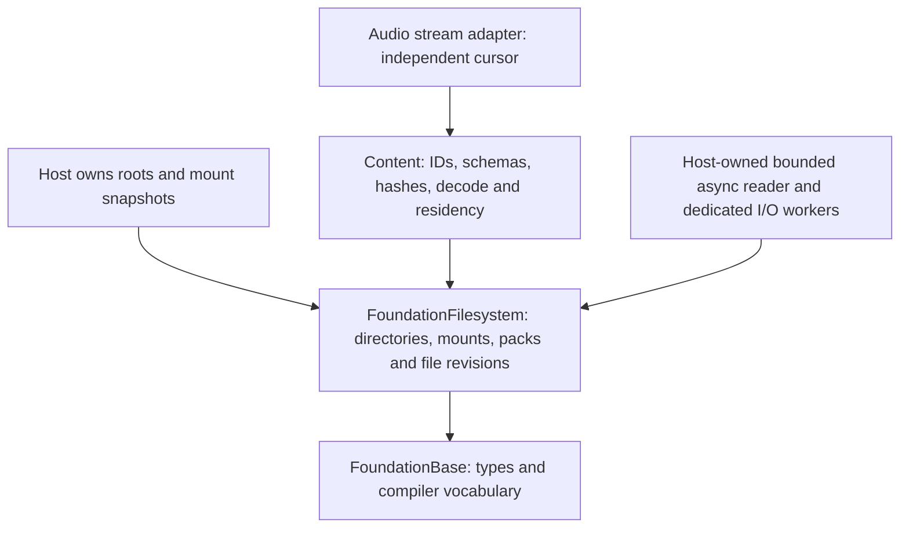

# Filesystem architecture

Status: F0 design and reference review complete; F1 through F5 implemented.
The delivery plan below records the completed baseline; F5 validation is recorded
in [PR #146](https://github.com/Alegruz/Ludus/pull/146), and F4 measurements in the
[benchmark evidence](../development/filesystem-benchmark.md).
The [post-baseline improvement plan](#post-baseline-research-and-improvement-plan)
tracks proposed experiments separately from implemented contracts. The
[asynchronous I/O evolution decision](#asynchronous-io-evolution-decision) records
the proposed pipeline, backend contracts and subsequent Gems revisions. This is a
storage architecture for Ludus; it does not implement an operating-system filesystem.

## Baseline decision

Keep three boundaries: FoundationFilesystem owns explicit-error byte I/O and
root capabilities; the virtual namespace maps logical paths to immutable
mount snapshots; Content owns resource identity, schemas, hashes and decoding.
Filesystem depends only on FoundationBase, never on logging, content, graphics,
windowing, a global service locator or a not-yet-existing job system.

Prefer offset reads into caller-owned buffers. A file owns an opened revision,
not a mutable shared cursor or a pathname that can silently select a different
revision. Opening and cloning may allocate with explicit failure; warm reads
and path validation do not allocate. Sequential cursors belong in adapters.
Every operation exposes typed errors; native error numbers remain available to
debuggers and higher-level diagnostics. No exceptions or heavy public headers.

A directory capability pins its native root once. Validate relative UTF-8 paths
without silently rewriting names: reject absolute paths, empty components,
'.', '..', NUL, backslashes, colon and control bytes. Traverse with descriptor-
relative operations that refuse symlinks at every component. A trusted root is
selected by the host; this boundary is not a sandbox against hostile mutation
of already-open directories, bind mounts, hard links or privileged processes.

Linux and macOS provide synchronous regular-file reads through a shared POSIX
backend. Other targets explicitly return Unsupported. Empty files are valid. Bound
sizes and offsets before narrowing. ReadAt returns the actual progress, retries
interrupted syscalls and handles short reads. EOF is successful zero progress.
Atomic pathname replacement preserves an open file's old revision. Detect
ordinary in-place size/mtime changes before and after reads; metadata is not a
cryptographic snapshot guarantee. Assets need immutable publication plus digest
validation when strong revision integrity is required.

Native validation covers UTF-8 names, trusted symlink roots, child symlink and
FIFO rejection, sparse offsets above 4 GiB, nanosecond modification times,
replacement/unlink lifetime, clone/move ownership and concurrent reads. Linux
uses GNU symbol wrapping for fault injection. A separate macOS test library
compiles the same exception-free POSIX implementation with a private compile-time
syscall/allocation seam; production has no hooks or mutable fault state. Darwin
tests exercise interrupted operations, short/partial reads, mutation during a
read, allocation/metadata failure cleanup, close-on-exec and descriptor reuse
after a failed close. macOS CI runs these tests and Content read adapters in
Development and with ASan/UBSan. Content also supports Linux/macOS atomic saves
through its separately tested adapter; see [native saves](content-resources.md#native-saves).
F5 adds explicit native publication results and bounded cooked-path polling; F4
provides a dedicated bounded I/O pool above retained virtual file revisions.

## Virtual namespace and shipping storage

Use explicit roots such as assets, project, cache and user; keep write policy
separate from read lookup. Publish immutable mount tables at a host-controlled
boundary. Resolve by explicit priority plus a stable tie-breaker; a collision
must be inspectable. Only NotFound permits fallback to a lower-priority mount;
corruption, access denial and I/O errors must remain visible. An open file pins
its provider and mount revision through unmount/reload.

Loose files serve authoring. Shipping packs use a versioned, endian-explicit
index with sorted canonical logical paths, offsets, stored/decoded lengths,
codec identity and integrity metadata. Hashes accelerate lookup but never
replace full-key equality. Validate overflow, overlapping/escaping ranges,
duplicates, unsupported features and configured resource limits before mount.
Use independent bounded compression blocks and measured alignment, not one
monolithic compressed stream. Signatures are a separate authenticity policy;
a checksum alone does not make downloaded content trusted.

## Streaming and persistence

First measure synchronous baseline latency and syscall/descriptor overhead.
Then add bounded asynchronous requests above offset I/O: byte and request
budgets, caller-owned destination lifetimes, deadlines/priority with starvation
prevention, per-request cancellation, terminal completion exactly once, and
host-owned completion delivery. A blocking worker fallback establishes behavior;
io_uring/IOCP or browser fetch can replace submission behind the same contract
only after measurement. Cancellation is not permission to reuse memory until
completion. Never perform I/O or decompression in an audio callback or render
critical section.

Keep storage-page caching, decoded resource residency and GPU upload budgeting
separate. Default to buffered OS I/O; mmap and direct I/O require evidence and
platform-specific failure/lifetime contracts. Prefetch is a hint, not a
correctness condition. Watchers invalidate hints; overflow triggers bounded
rescan and explicit revision selection, not mutation of active readers.

Saving uses same-directory exclusive temporary creation, complete checked
writes, explicit flush policy and atomic publication. Distinguish publication
from durable persistence, including directory sync where supported. Expected-
revision checks require cooperative locking for strict compare-and-swap;
uncooperative writers can race. Keep current Content save behavior until the
write contract has dedicated tests and a replacement API.

## Delivery plan and evidence

| Slice | Scope | Acceptance |
| --- | --- | --- |
| F1 | Root capability, validated paths, move-only revision files, offset reads; Content read adapter migration | Regression tests, native builds, sanitizer runs, format/tidy, SDK and browser compile contracts |
| F2 | Virtual paths, immutable mounts, memory provider | Deterministic overlays, failure fallback, unmount lifetime, injected provider faults |
| F3 | Pack reader and pack builder | Fuzzed index validation, bounded decode, reproducible packs, corrupt input tests |
| F4 | Bounded async scheduler and metrics | Cancellation/lifetime/overload tests, representative latency/throughput evidence |
| F5 | Persistence and watcher adapters | Failure injection across publication stages, durability reporting and rescan tests |

No throughput improvement is claimed before measurement. Benchmark mixed
small/large assets, warm/cold cache, concurrent offset reads, loose/pack layout
and target hardware. Record p50/p95/p99 completion latency, CPU, allocation,
bytes in flight, descriptor count, queue age and cancellation latency. Keep
traces bounded and opt-in; report operation, provider/mount generation, logical
path, requested range, result/native code and bytes without recursive logging.

## Contracts for F1

Public headers use FoundationBase, span and string_view only. Root and file
objects are move-only, with transactional Open/Clone: failure preserves the
previous output. They release descriptors through RAII. Destruction, moving,
reopening and closing require exclusive ownership; concurrent const OpenRead,
Clone and ReadAt calls are supported while their owners remain alive. Destination
buffers must not overlap during concurrent reads. Explicit Close reports errors;
destructors release best-effort and never log. Linux and Darwin close are never retried after
EINTR because the descriptor may already have been released and reused. Thanks
to Apple, XNU `kern_descrip.c`, `fp_close_and_unlock` in the
[macOS 14 source](https://github.com/apple-oss-distributions/xnu/blob/xnu-10002.1.13/bsd/kern/kern_descrip.c):
its descriptor-release-before-final-close order confirms the Darwin ownership
contract. No XNU code was copied. Darwin revision checks use `st_mtimespec`;
Linux uses `st_mtim`, preserving seconds and nanoseconds on both hosts.

ReadAt fills the requested range up to the captured EOF, looping on short reads.
Offsets above the captured size fail; offset equal to size succeeds with zero
bytes. Each syscall is capped below the native transfer limit, and 64-bit file
offsets and opt-in checked integer conversions at native/size boundaries are required at compile time. On a syscall error, returned progress is
inspectable but not a complete requested range. Changed returns zero valid bytes;
the destination may have been touched and must be discarded. A metadata check
also runs on an empty/EOF read. Clone duplicates the descriptor, retains the
same metadata revision and has no pathname lookup. Content's adapter owns its
own position and clones to position zero, preserving its existing decoder API.

Logical path equality is byte-exact and case-sensitive. Unicode is validated,
not case-folded or normalized by runtime I/O. F2/F3 tooling must detect host case
and Unicode-normalization collisions before publishing a cross-platform pack;
native lookup follows each filesystem's case and Unicode equivalence rules,
including case-insensitive macOS volumes. Linux filenames are not automatically
portable to macOS or Windows.
The cooking/pack pipeline must also reject reserved names and trailing dots or
spaces when publishing portable assets.
F1's limit matches existing Content (1,024 path bytes); native roots have a
separate 4,096-byte limit and embedded NUL is always rejected. Roots are trusted
host input, so their own symlink ancestry is permitted. Child symlinks are not.

## Contracts for F2

`namespace.hpp` adds owned, allocation-free `VirtualPath` keys with explicit
assets/project/cache/user roots and F1's relative-path validation. Logical
keys remain byte-exact and case-sensitive, without Unicode normalization.
`CreateMemoryProvider` copies input paths and bytes, rejects duplicate full
keys, and uses a sorted index with binary lookup. Empty files and empty
providers are valid on every platform, including the browser. The directory
provider delegates to F1, retaining its native filename-equivalence and revision
checks rather than claiming portable host spelling or a stronger snapshot.

The host creates a complete `MountSnapshot` with a nonzero generation, then
publishes a handle under its own synchronization. Mount IDs are nonzero and
unique; priority descends, and the lowest stable ID wins equal priorities,
independent of input order. Prefixes match whole components and are removed
before provider lookup. An exact prefix has no relative file key and does not
match. Providers are retained and prefixes copied, so editing inputs cannot
mutate published lookup. An empty snapshot represents unmounting everything.
No write policy or process-global mutable namespace is introduced.

Only `NotFound` falls back. Every other status/native diagnostic remains
visible and preserves the caller's prior opened file. `Describe` enumerates
mounts in resolution order, and an optional caller-owned bounded attempt trace
reports actual provider outcomes and IDs; its total count remains available
when the trace is truncated. A provider returning success without a file is
reported as `IoError`. Custom providers must implement the documented explicit-
error, independent revision lifetime and concurrent offset-read contracts.

`VirtualFile` retains the entire originating snapshot and provider file through
unmount/reload; clones share that opened revision without pathname lookup or
allocation. Open/create failures are transactional, and all ownership changes
require exclusive access to the affected handle. Separate stable handles and
const lookups/reads support concurrent use. Reads and path validation allocate
nothing; provider/snapshot creation and opening use checked admission and
nothrow allocations with explicit `OutOfMemory`. Indexes are bounded to 65,536
memory entries and 256 mounts; this synchronous slice adds no async scheduler.
Portable case/normalization/reserved-name collision detection remains required
at F3's pack publishing boundary, not inferred from a Linux/macOS filename.

Regression coverage includes deterministic shuffled overlays, root/prefix
boundaries, duplicate/invalid publication, bounded traces, fallback for every
status, partial provider read faults, retained unmount/reload lifetimes,
independent native revision reads, and an isolated allocation seam exercising
every construction/open allocation plus allocation-free warm reads/clones.
The seam is compiled only into an unexported test archive.

## Contracts for F3

`pack.hpp` adds `CreatePackProvider(storage, relativePath, limits, output)`.
The storage provider may be a native directory or an immutable memory provider;
pack lookup and decoding work on every target, including the browser. The factory
pins one opened archive revision and validates its complete metadata before
publishing a provider. Failure preserves the previous output. Packs mount through
F2 without a separate namespace, Content identity scheme or runtime global.

Version 1 uses little-endian unsigned integers, an 80-byte header and byte-exact
UTF-8 paths in strictly increasing lookup order. All reserved fields must be zero.
The following offsets are bytes from the start of the archive:

| Header offset | Field |
| --- | --- |
| 0 | Eight bytes `LUDPACK` followed by NUL |
| 8, 12, 16 | u32 version (1), header size (80), feature flags (0) |
| 20, 24, 28 | u32 decoded block size, file count, block count |
| 32, 40, 48, 56 | u64 index offset (80), index size, payload offset, exact archive size |
| 64, 68 | u32 index CRC32, header CRC32 (with bytes 68-71 zeroed) |
| 72 | u64 reserved (0) |

The index begins with variable-length entries: u32 path length, first block,
block count, reserved; u64 decoded length, stored length; then exactly that many
UTF-8 path bytes. It ends with block records: u64 absolute payload offset; u32
stored length, decoded length, codec and decoded CRC32. Codec 0 stores raw bytes;
codec 1 stores an independent LZ4 block without dictionaries or frame headers.
Compressed blocks must be smaller than their decoded bytes. The decoded block
size is a power of two from 256 through 65,536 bytes. Each file owns a consecutive
run of block records; interior decoded blocks are full, and the last has the
remaining bytes. Empty files own no blocks. There is no padding or implicit
alignment policy in version 1: payload ranges must cover the payload exactly,
without overlaps, gaps, escapes or trailing bytes, independently of index order.

Before publication, the reader checks header/index CRC32, UTF-8/F1 path validity,
full-key sorted uniqueness, integer admission, table ownership, exact length
sums, codecs and every storage range. Defaults admit at most 8 GiB storage,
32 MiB serialized index, 65,536 files, 262,144 blocks, 1 GiB decoded per file and
16 GiB total decoded. `PackLimits` can lower or raise these budgets, with a hard
64 KiB decoded-block ceiling and native allocation-size checks. Malformed data
returns `CorruptData`, unsupported versions/features/codecs return `Unsupported`,
and configured admission failures return `LimitExceeded`. Storage failures retain
their original status/native diagnostic. Only F2's `NotFound` permits fallback.

Opening a nonempty pack file allocates at most twice the advertised block size
as scratch. Warm reads and clones allocate nothing. Reads of one opened revision
serialize its scratch use; separate opens own separate scratch. Each touched
block is read and fully checked before any of its bytes reach the caller. A
fault reports only previously verified progress; `Changed` reports zero valid
bytes. Native revision checks bracket reads, including empty/EOF reads, and run
at lookup even for missing keys. Replacement/unlink retains an opened archive;
ordinary in-place size/mtime changes fail. CRC32 detects corruption, not hostile
forgery or authenticity, and metadata-preserving mutation needs a separate
immutable-publication/digest/signature policy. Metadata is captured at mount;
payload verification is lazy, so successful mounting does not certify every
payload byte.

Build packs offline with Python 3.10 or later, without third-party Python packages:

```sh
./scripts/pack cooked-assets out/assets.lpk
./scripts/pack cooked-assets out/assets.lpk --layout out/layout.json
./scripts/pack cooked-assets out/assets.lpk --raw --block-bytes 4096
```

The output must be outside the trusted source tree. The builder rejects child
symlinks, nonregular files, invalid/bounded paths, Windows reserved components,
trailing dots/spaces and file/directory collisions. It checks case-folded NFD
Unicode equivalence at every directory prefix without rewriting logical keys;
this conservative publishing policy is distinct from each host's native lookup.
It checks ordinary source size/mtime mutation while streaming at most one input
block at a time into a temporary payload spool. Publishing uses an exclusive
same-directory temporary output and replacement; failure preserves an existing
output. This offline publication is not F5's explicit sync reporting or a sandbox
against hostile changes to the trusted source tree.

An optional layout manifest is exactly `{"version":1,"paths":["startup/a", ...]}`.
Listed files come first in that order; unlisted files follow canonical UTF-8
order. Unknown/repeated paths or unsupported manifest fields are rejected. The
lookup index stays sorted regardless of physical layout. Pack bytes contain no
timestamps, machine paths or random identifiers. Identical source bytes, paths,
block/codec policy and manifest produce identical bytes independent of source
enumeration. The printed JSON report records format/builder/Unicode database
versions, counts, budgets used and the canonical manifest SHA-256. Keep that
report and the input manifest with trace provenance; the builder does not infer
an access trace or claim loading speedups. Reproduce publishing admission with
the same Unicode database version when exchanging toolchain environments.

Tests cover corrupt metadata and payloads, resource limits, raw/compressed/empty
files, cross-block and concurrent offset reads, native replacement/unlink/change,
unmount lifetimes, every pack allocation failure and allocation-free warm reads.
Builder tests check reproducibility, reordered payloads, portable collisions,
bounded source reads, failed publication and compatibility with an independent
system LZ4 decoder. SDK and browser consumers exercise a fixed golden pack.
`LUDUS_BUILD_FILESYSTEM_FUZZERS=ON` builds an isolated native Clang/libFuzzer
executable with the entire reader/decoder instrumented by ASan/UBSan. Its bounded
harness fuzzes raw codec inputs and repairs metadata checksums to reach deep
index/range validation. CI runs a seeded 60-second campaign; this is regression
coverage, not a proof that every malformed input is safe. Reproduce on the
reference Linux toolchain:

```sh
cmake --preset linux-clang-development -B out/build/filesystem-fuzz -DLUDUS_BUILD_FILESYSTEM_FUZZERS=ON
cmake --build out/build/filesystem-fuzz --target ludus_filesystem_pack_fuzzer
python3 tests/filesystem/generate_pack_fixtures.py out/fuzz/fixture.hpp --corpus out/fuzz/corpus
out/build/filesystem-fuzz/modules/foundation/filesystem/ludus_filesystem_pack_fuzzer out/fuzz/corpus -max_total_time=60 -max_len=65536 -timeout=2 -rss_limit_mb=512
```

Thanks to Yann Collet, [*LZ4 Block Format Description*, revision 2022-07-31](https://github.com/lz4/lz4/blob/v1.10.0/doc/lz4_Block_format.md),
for token/length/offset and final-literal constraints; the bounded encoder/decoder
are original implementations. Thanks to L. Peter Deutsch,
[RFC 1952, section 2.3.1](https://www.rfc-editor.org/rfc/rfc1952), for reflected
IEEE CRC32 semantics; this format does not use GZIP framing. Thanks to Microsoft,
[*Naming Files, Paths, and Namespaces*](https://learn.microsoft.com/en-us/windows/win32/fileio/naming-a-file),
and the Python Software Foundation, [*unicodedata*](https://docs.python.org/3/library/unicodedata.html),
for the publishing checks. Preserve the GPG container/layout attribution below;
no cited implementation code was copied.

## Reference review and design revision

Reviewed after the baseline above, using the repository's
[reference index](../../references/game-dev-gems-toc.md). These are design inputs,
not evidence that historical performance results transfer to today's hardware.

| Article actually reviewed | Useful contribution | Decision/revision |
| --- | --- | --- |
| Bruno Sousa, GPG2 1.15, *File Management Using Resource Files*, printed pp. 100-104 (PDF 97-101) | Signature/version, per-entry metadata, separation of container and resource | Keep F3's validated index and explicit codec/version fields; require bounded independent blocks rather than whole-resource decompression or a process-wide current directory. Do not adopt historical encryption examples. |
| Colt McAnlis, GPG7 1.1, *Efficient Cache Replacement Using the Age and Cost Metrics*, printed pp. 5-14 (PDF 38-47) | Replacement needs usage history and reconstruction cost; test oversubscribed working sets | Add trace replay comparing LRU with measured cost-aware policies. Keep this in Content residency; no mandatory second byte cache or per-frame filesystem scan. |
| David L. Koenig, GPG6 1.9, *Faster File Loading with Access-Based File Reordering*, printed pp. 103-108 (PDF 106-111; scanned pages visually inspected) | Capture accesses, reorder the pack, then rerun; caching and alternate gameplay paths can distort gains | F3 builder accepts a deterministic trace-derived layout manifest. Compare startup, level transitions and mod workloads on target SSD/HDD/browser delivery; retain canonical sorted lookup independently of payload placement. |
| Noel Llopis and Charles Nicholson, GPG6 1.10, *Stay in the Game: Asset Hotloading for Fast Iteration*, relevant printed pp. 109-114 (PDF 112-117; visually inspected) | Converter/monitor/listener/rebinding boundaries and resource indirection | F5 watchers poll registered cooked paths, debounce metadata hints and request validation; producers publish completed output atomically. Content publishes replacement handles at a controlled frame boundary, keeps the prior revision on failure and budgets overlapping residency. Filesystem never rewrites active readers. |
| Neil Gower, GPG8 5.3, *Asynchronous I/O for Scalable Game Servers*, printed pp. 506-513 (PDF 521-528) | Queue boundary, buffer/control-structure lifetime, asynchronous cancellation, small-request overhead | F4 uses an explicit request state machine and drain-before-release shutdown; compatible range coalescing remains a measured follow-up. Networking examples inform ownership; they do not establish modern disk throughput. |

F3 payload layout is decoupled from index order. Layout changes do not alter
resource identity. Trace-derived grouping is an optional offline optimization;
record its input/version and test scenarios beyond the training trace. Existing
asset cooking and catalog identity remain Content responsibilities. F5 reloads
follow prepare -> validate -> publish -> retire; failure retains the previous
asset, and GPU/audio retirement respects the owning subsystem's fence/lifetime.

F4 states are Queued -> Submitted -> Completing -> Completed; cancellation is
an intent on a live request, with an eventual Cancelled or completed result.
An accepted request keeps its file revision, destination and completion record
alive. Shutdown stops admission, cancels queued work and drains submitted work
before freeing storage. Coalescing must preserve provider/revision, destination
layout, limits and deadlines. Measure backend crossover rather than always
routing small cached reads asynchronously.

Modern OS contracts were checked against primary documentation:
[pread](https://man7.org/linux/man-pages/man2/pread.2.html) supplies independent
offsets and permits short reads; [open](https://man7.org/linux/man-pages/man2/open.2.html)
explains descriptor revision lifetime and final-component O_NOFOLLOW semantics;
[close](https://man7.org/linux/man-pages/man2/close.2.html) explains Linux's
non-retry rule. The per-component walk is necessary because final-component
O_NOFOLLOW alone does not protect ancestors. Future stronger Linux containment
can use [openat2](https://man7.org/linux/man-pages/man2/openat2.2.html) behind a
separate stated policy; do not silently claim its guarantees for this walk.
[Windows cancellation](https://learn.microsoft.com/en-us/windows/win32/fileio/canceling-pending-i-o-operations)
also requires waiting for terminal completion before buffer reuse.

## F5 persistence and cooked-file hints

`persistence.hpp` adds an explicit host-selected `WriteDirectory` capability,
separate from read mounts. Linux and macOS pin the trusted root; unsupported
native targets, including browsers, return Unsupported. `Publish` admits a
complete caller buffer against `MaxBytes` (32 MiB by default), traverses existing
parents without following child symlinks, and refuses non-regular destinations.
It takes a nonblocking advisory lock on the selected parent directory, checks the
requested precondition, creates an exclusive same-directory 0600 temporary,
handles full/short/interrupted writes, applies the requested file sync, closes
once, rechecks the destination and atomically renames. Temporary names contain a
process identifier and monotonic sequence with bounded collision retries. Foreign
collisions are never removed. The host must hold the capability and source bytes
stable through the call; publication itself allocates no C++ storage.

Each transaction opens an independent directory file description before taking
its lock. Duplicating a root descriptor would share flock ownership between calls
and incorrectly admit concurrent writers using the same capability. Cooperating
writers serialize per parent; contention returns Conflict without blocking.
`WriteCondition` permits any regular/absent destination, requires absence, or
requires an expected `FileStamp`. `Directory::Observe` captures metadata without
allocation and preserves output on failure. Stamps contain device/inode, size,
mtime and ctime, not content integrity. These checks can miss metadata-preserving
edits and inode reuse. An uncooperative writer can race the last check and rename;
this is cooperative optimistic admission, not an atomic digest compare-and-swap.
Content still owns digest-level identity and its existing separately tested
`SaveFile` adapter; F5 does not change that adapter's contract or temporary naming.

`PublicationResult` distinguishes Outcome from Published, FileSynced,
DirectorySynced and Cleanup. Before rename, failures preserve the destination and
report owned temporary cleanup. After rename, a parent-sync error reports an
error **with Published true**; the new bytes remain visible. Cleanup separately
reports unlink/close failures and may leave an owned temporary for host recovery.
The three sync policies request no sync, file sync, or file plus parent sync.
Native acknowledgments are evidence of completed requests, not universal
power-loss guarantees; macOS fsync does not promise flushing device caches.
Opened File readers retain their old revisions after replacement.

This implementation follows the Linux man-pages project's
[rename(2)](https://man7.org/linux/man-pages/man2/rename.2.html),
[fsync(2)](https://man7.org/linux/man-pages/man2/fsync.2.html) and
[flock(2)](https://man7.org/linux/man-pages/man2/flock.2.html) contracts, and Apple's
[fsync(2) cache distinction](https://developer.apple.com/library/archive/documentation/System/Conceptual/ManPages_iPhoneOS/man2/fsync.2.html).
Thanks to those authors for defining the atomicity, cooperative-lock and sync
boundaries; the backend is independently implemented, with attribution beside it.

`watch.hpp` provides a host-polled `Watcher` over an explicit set of final cooked
paths. It pins its trusted root and allocates fixed path/hint storage at Init.
The host owns one thread, supplies monotonic nanoseconds and budgets each Advance
by slot positions. Metadata changes, creation and disappearance must remain
stable across observations for the configured debounce interval; reverted
candidates are suppressed. Producers should atomically publish completed cooked
files. Debounce cannot certify an in-place writer's completion or byte integrity.
Polling can miss transient and metadata-preserving changes, follows native
filename equivalence, discovers no unregistered paths and uses no OS notification
backend. Content/catalog code must register new paths or rebuild registrations
when its manifest changes. Advance, Add, Remove, Poll and rescan allocate no C++
storage after initialization; native lookup can still incur filesystem latency.

Hints own their path and host tag; lifetime/sequence handles reject stale or
foreign removals and retired registrations remove queued hints. An observation
error never becomes a deletion. Queue overflow discards incremental hints,
counts losses and requests a sticky full rescan. Observation errors likewise
request rescan. Incremental observation stops until recovery. BeginRescan freezes
registration changes and clears pending hints. Each NextRescan observes at most
one registered path and emits its current metadata/absence/error, including
unchanged paths. A final empty result ends the pass; any unsafe observation keeps
NeedsRescan set and requests retry. A rescan is not a globally atomic snapshot.
The host opens and validates candidates, chooses replacement revisions and
publishes Content handles at its own controlled boundary. Filesystem never
rebinds readers or retires GPU/audio resources.

Native tests cover publication preconditions, sync policies, limits, unsafe
paths, pinned roots, permissions and old-reader lifetime. Isolated production
backends inject allocation/open/lock/metadata/write/sync/close/rename/cleanup
failures, foreign collisions, edits before rename and same-owner lock contention.
Watcher tests cover debounce, reverted candidates, bounded stepping, overflow,
rescan errors/retry, pinned roots, stale handles and storage allocation failures.
Installed and relocated SDK consumers exercise both APIs; the browser Foundation
probe verifies explicit Unsupported behavior. CI runs Linux/macOS unit,
ASan/UBSan, static analysis, exported-header and documentation checks. No
throughput improvement or power-loss durability claim follows from these tests.

## F4 bounded asynchronous reads

`async.hpp` adds host-owned `AsyncReader` above `VirtualFile::ReadAt`. The module
still depends only on FoundationBase among engine modules. Private fallible native
thread/condition boundaries create a dedicated blocking pool on Linux, macOS and
Windows. This pool deliberately does not run on FoundationThreading: that module's
job callbacks must not block on I/O. Windows supports memory/pack providers; native
directory I/O still reports Unsupported. Browser initialization explicitly reports
Unsupported without starting threads or allocating scheduler storage.

Initialize allocates a fixed slot array and worker array; optional tracing adds
fixed per-slot diagnostic keys and a bounded trace ring. Admission does not grow
storage or duplicate descriptors. Requests retain the exact opened file and its
mount generation. Capacity and full destination-byte budgets cover queued,
submitted **and uncollected** completions. A host that stops polling therefore
receives overload errors instead of an unbounded completion backlog. Rejected
requests preserve handles and buffers. Separate budgets remain necessary for pack
scratch, provider storage, decoded resources, caches and GPU uploads.

Workers transition Queued -> Submitted -> Completing; only host `Poll` publishes
Completed and releases the slot, byte budget and revision. Poll returns exactly one
record per accepted request while the scheduler is retained; collected identities
cannot affect a reused slot or another scheduler. File release occurs outside the
scheduler gate. Completion delivery invokes no callbacks. Destinations remain
host-owned and exclusively writable until their completion is collected. Submit
cannot detect overlapping destinations; the host must not admit them.

Cancellation is an intent, not buffer-release permission. Queued cancellation
skips I/O. Submitted cancellation drains the blocking read, then returns Cancelled
with zero valid bytes (discard a possibly touched buffer). Cancellation after
terminal publication leaves the completed read result intact. Shutdown permanently
stops admission, cancels queued requests, wakes sleepers and joins submitted reads;
completions remain available to Poll. A stuck provider can delay shutdown without
bound. Providers must eventually return. A provider calling Shutdown on its own
reader receives InsideRead without stopping admission, avoiding self-join. Reader
destruction must remain with the host, outside any active provider ReadAt. Destruction performs the same drain and
then discards any records the host chose not to collect; buffer storage must
outlive destruction on this abandonment path. Preferred lifecycle is shutdown,
collect every completion, then destroy. No asynchronous buffers belong on a short-
lived stack frame unless that frame drains them before returning.

DeadlineNanoseconds uses the monotonic `AsyncNow` clock and is a **latest-start**
deadline: expired queued work skips I/O; an active read is never interrupted by a
deadline. Before the starvation threshold, earlier deadlines sort first, then
higher priority, then FIFO admission sequence. Once any request reaches the
configured queue age, the oldest queued request overrides those preferences.
This prevents priority starvation when providers make progress; it is not a hard
latency guarantee for arbitrary blocking storage. No coalescing or native
io_uring/IOCP backend is enabled without measured evidence and a compatibility
proof for revision, destination layout, budgets and deadlines.

Metrics are mutex-consistent gauges and saturating totals: queue/submitted/backlog,
retained and peak bytes/requests, valid bytes, read/cancel/expiry counts, rejection,
oldest queue age and trace overflow. Completions report queue, service, admission-
to-host-delivery and cancellation-to-host-delivery nanoseconds. Optional traces copy
a host-supplied logical key plus mount/generation, offset, requested bytes and
terminal/native result; this diagnostic key does not select a different file.
Trace overflow drops the oldest record and increments DroppedTraces, never logs or
allocates. Clock samples and mutex acquisition are included in scheduler overhead.

See the [filesystem guide](../wiki/guides/filesystem.md) for host integration and
[measurement procedure](../development/filesystem-benchmark.md) for reproducible
mixed loose/raw/LZ4 workloads and the measured synchronous baseline. These are
storage delivery measurements, not resource decode or GPU residency claims.

## Asynchronous I/O evolution decision

Design review: 2026-10-07, repository baseline `1e2227c`. This section specifies
**proposed** evolution of F4, not additional implemented features. The F4
contracts above remain authoritative for today's SDK. The target is predictable
asset delivery within CPU, memory and frame budgets, with a small auditable
implementation. There is no backend that is fastest for every device, cache
state, asset mix and host completion cadence.

### Initial design and repository findings

Before this pass's chapter review, the initial choice was to preserve F4's
request state machine and portable worker pool, then separate physical transfer
from logical read completion behind a private adapter. Add native backends only
after measuring the full pipeline. Keep CPU work, asset publication and GPU
retirement under their existing owners. The chapter review below records the
subsequent refinements explicitly.

The current code and measurements constrain that choice:

- [`async.hpp`](../../modules/foundation/filesystem/include/ludus/foundation/filesystem/async.hpp)
  already defines fallible bounded admission, retained revisions, latest-start
  deadlines, cancel intent, exactly-once collection, metrics and optional traces.
  Preserve these semantics rather than introducing a competing future/callback API.
- [`async.cpp`](../../modules/foundation/filesystem/src/async.cpp) scans its fixed
  slot array under one gate for admission, selection, handle lookup and Poll.
  ReadAt and final provider release occur outside that gate. This is a readable
  starting point; measure gate hold/wait time before replacing it with indexes.
- [`pack.cpp`](../../modules/foundation/filesystem/src/pack.cpp) serializes reads
  on each opened PackFile's scratch mutex, reads full touched blocks and validates
  decoded CRC before copying. VirtualFile clones share the opened provider file;
  cloning does not create independent pack scratch. Independent opens can.
- The [F4 results](../development/filesystem-benchmark.md#local-baseline-and-result)
  show cached loose reads favoring synchronous latency and pack CRC/decode
  dominating this corpus. Four workers improved throughput in that one run while
  queueing increased delivery latency. These are hypotheses for profiling, not
  sufficient evidence for a new backend or automatic runtime crossover.
- FoundationThreading admits one frozen CPU graph per system. It has no general
  external-I/O continuation admission. Polling storage must not block its workers;
  integration initially schedules the next bounded graph from host-owned results.

### Ownership and the smallest useful architecture

Keep FoundationFilesystem dependent only on FoundationBase. Its private code
owns the scheduler, physical transfer adapters, provider validation and bounded
pack decoding. Content owns prediction, dependency manifests, requests for
resource chunks, decoded residency and publication. The host consumes byte-read
completions and admits CPU jobs; the RHI owns upload submissions and GPU fences.
Filesystem never calls gameplay code or decides whether an asset is resident.

```mermaid
flowchart LR
    C[Content demand and staging owner] --> S[Bounded logical read scheduler]
    S --> P[Private provider read plan]
    P --> B[Blocking pool or native transfer backend]
    B --> V[Revision validation and bounded pack decode]
    V --> Q[Retained terminal completion]
    Q --> H[Host collection]
    H --> J[Content CPU decode jobs]
    J --> U[RHI upload and owner-thread publication]
```



For memory and custom providers, keep the current ReadAt worker route. A native
backend requires a private provider capability which supplies a retained opened
revision, validated physical ranges and completion/validation steps. It cannot
extract a pathname and reopen it or bypass pack bounds/CRC. Unsupported provider
capabilities use the worker route, selected before any physical submission.
Define this internal interface only for an experiment that needs it; keep native
handles, liburing, Windows types and codec internals out of exported headers.

Retain a fixed array, one short scheduler gate and predicate-based worker sleep.
The native adapter has one private submission/completion owner initially;
producer threads only admit descriptors. Slow OS submission, reads, decoding,
provider destructors and arbitrary callbacks stay outside the scheduler gate.
Backend progress and shutdown cannot depend on the main thread continuing to
Poll. No one-thread-per-file design, fibers, mandatory coroutines, lock-free
queue rewrite or general-purpose I/O reactor is required.

### Logical completion, cancellation and buffer safety

The public progression stays Queued -> Submitted -> Completing -> Completed.
Internal physical operations can complete out of order; every operation carries
a checked scheduler/request identity plus a child identity. Multiple child reads,
short-read retries, metadata checks, decode and cancellation acknowledgments
converge into **one** logical terminal publication. A physical CQE or IOCP packet
is neither the logical terminal result nor host permission to reuse memory.

Maintain these invariants across every backend:

1. Successful admission reserves a logical slot, the full destination length and
   the record needed to retain its terminal completion. Rejection leaves outputs
   and destination untouched. Accepted identity is never silently recycled.
2. The exact opened revision and every destination, staging buffer and native
   control record remain alive until all operations referencing them finish.
   Native children retire before terminal publication; caller destinations stay
   charged until host collection or drained reader destruction.
3. Cancel linearizes under the same state gate as terminal publication. Queued
   work skips I/O. If cancellation wins while Submitted, drain active children
   and decoder users, then publish Cancelled with zero valid bytes. A later cancel
   cannot rewrite an already published Read result. Cancel success alone never
   releases storage. Coalesced siblings retain independent logical dispositions.
4. Match ReadAt's captured-EOF, short-read, partial-error and pre/post mutation
   rules, including empty reads. Changed and Cancelled expose zero valid bytes
   even if storage was touched. Other partial failures retain the established
   ReadResult progress semantics; Content must validate completeness before use.
5. A latest-start deadline controls the first logical I/O start only. Reserving a
   slot or preparing a batch does not satisfy it. Recheck immediately before
   handing the first transfer to the backend; expiry before start leaves the
   destination untouched. Continuation reads of a started request are not newly
   expired. This clock is monotonic, not a resource-readiness guarantee.
6. Native cancellation is best effort. Keep the original operation's terminal
   evidence, not just the cancel-command acknowledgment. Stop admission, drain
   native operations and CPU users, join owners, collect, then destroy. A timeout
   may diagnose incomplete shutdown; it cannot free buffers still in use.

A reader cannot destroy itself from an executing provider. Maintain the existing
InsideRead guard and owner-thread lifecycle restriction. Initialization failure
unwinds started workers and storage transactionally. Backend failure never
fabricates quiescence: retain ownership until a documented native teardown or
operation completion proves that the OS cannot access it. An unresponsive driver
or custom provider can therefore still prevent bounded shutdown.

### Budgets, scheduling and integration

Destination bytes are only one part of streaming memory. Declare separate bounds
for logical slots, physical operations, stored-byte staging, decoded pack scratch,
native/control completions and retained host completions. Content additionally
bounds resource decode outputs, upload staging and old/new overlapping residency.
Charge unique shared buffers once to their owning pool; charge every logical
request's caller destination independently. Bound fixed scheduler metadata and
optional trace storage as well. All additions below are proposed configuration
concepts, not fields present in AsyncConfig today.

| Credit | Reserve/release rule |
| --- | --- |
| Logical slots and destination bytes | Admission through host collection; keep F4 accounting |
| Physical descriptors and control records | Before OS handoff through last associated completion; reserve cancellation/control headroom separately |
| Stored-byte staging and pack scratch | Before a block is dispatched through the last validation/decode/copy consumer |
| Decode-ready records | Reserve before initiating transfer so completed storage never needs an unbounded spill queue |
| Content candidate and upload bytes | Content/RHI acquire before the relevant stage; release by CPU completion or GPU fence, never frame count |

Acquire a complete bounded set of credits for one dispatchable chunk under the
coordinator, or leave it queued without holding a partial set that blocks others.
Reserve only a limited window of chunks per large read. No decoder waits for I/O
inside a CPU callback; no I/O completion thread waits for a CPU graph to finish.
When decode credit is exhausted, stop issuing physical work. Keep terminal and
control processing available even while ordinary data admission is saturated.

Retain deadline -> priority -> FIFO with oldest-first age override as the default
logical policy. Worker count and physical queue depth are independent budgets;
more outstanding work can raise latency and cancel-drain time. Bound large
request chunks to provide scheduling points; already submitted device work is
not generally preemptible. Chunking arbitrary custom providers requires their
read/revision contract to support it; their fallback remains a whole ReadAt.
Per-class reserved capacity for audio preparation versus background prefetch is
an optional measured policy, including a stated fairness rule. The audio callback
itself consumes prepared buffers only and never submits, polls, allocates or waits.

A host-side pump collects at a measured frame cadence with a maximum record/work
budget, routes results by tag and resource generation, and schedules CPU decode
or discards obsolete candidates. Slow polling still consumes F4 capacity; it
must appear as completion backlog rather than being hidden by another queue.
Poll may release a final provider and close a descriptor, so it is outside render
and audio critical sections. Do not implement a blocking Wait by spinning Poll.
An eventual tool-only wait API needs a protected predicate and an explicit timeout
which preserves pending ownership, with no dependency on host callbacks.

Keep byte buffers in an explicit Content request owner whose teardown cancels,
drains and collects before returning memory to a pool. Resource cancellation and
revision replacement carry generation checks through CPU decode and upload.
I/O completion means bytes are available; CPU completion means a candidate is
prepared; a GPU fence permits upload-buffer retirement; the owner boundary
publishes the resource. These four events must remain separately visible.

### Native backend choices and fallback

| Target | Maintained baseline | Conditional experiment and required proof |
| --- | --- | --- |
| Linux | Buffered pread workers | Buffered io_uring, normal sleeping completion waits, batched offset reads. Probe actual setup/opcode support and policy restrictions; initially disable SQPOLL, IOPOLL, registered-buffer specialization and multishot operations. Preserve metadata/revision semantics. |
| macOS | Buffered pread workers | Keep this simple path unless traces justify another adapter. Dispatch I/O is a separate ownership/fragment-delivery experiment, not an assumed zero-allocation replacement. |
| Windows | Worker pool for memory/pack providers; native directory unsupported | First implement/test a native root and revision provider. Then compare OVERLAPPED offset ReadFile plus IOCP, with stable per-operation records, captured EOF and explicit handle sharing/replacement semantics. |
| Browser | AsyncReader initialization Unsupported | A separate host acquisition adapter may use async fetch into bounded owned staging, verify revision/bytes, then publish a memory/pack provider. Enforce response limits during acquisition; HTTP range/version behavior and abort quiescence need their own tests. No blocking main-thread I/O or claim that native AsyncReader already supports fetch. |
| GPU-oriented cooked data | CPU destination API | DirectStorage is a separate Content/RHI experiment with target-specific cooked codec/layout, staging, status and GPU-fence retirement. It does not transparently replace VirtualFile CPU reads. |
| Consoles | No support claim | Add adapters using the licensed platform SDK and the same lifetime tests; public desktop documentation cannot establish console behavior. |

The Linux/liburing [io_uring interface](https://man7.org/linux/man-pages/man7/io_uring.7.html)
provides shared submission/completion rings and unordered completion. Our initial
adapter uses one-shot reads with explicit offsets and maps every physical result
into a retained logical request. A short successful read advances the range and
issues a bounded continuation. Never use success-CQE suppression for operations
whose completion is required for retirement. Size completion/control storage for
all issued reads plus cancellations and any supported auxiliary operations.

The liburing [cancellation contract](https://man7.org/linux/man-pages/man3/io_uring_prep_cancel.3.html)
and Microsoft's [cancellation guidance](https://learn.microsoft.com/en-us/windows/win32/fileio/canceling-pending-i-o-operations)
require handling races with completion. Drain the target operation even when
cancel reports absent/already running. Microsoft also specifies buffer and
OVERLAPPED lifetimes in [ReadFile](https://learn.microsoft.com/en-us/windows/win32/api/fileapi/nf-fileapi-readfile),
and packet/concurrency behavior in [IOCP](https://learn.microsoft.com/en-us/windows/win32/fileio/i-o-completion-ports).
Choose one documented immediate-success notification mode and test it: processing
success both inline and as a queued packet must not complete a child twice.

Apple's [dispatch I/O header](https://github.com/swiftlang/swift-corelibs-libdispatch/blob/main/dispatch/io.h)
assigns descriptor control to the channel until cleanup and supports incremental
read delivery. Any adapter must aggregate fragments and prove descriptor/channel
quiescence before release. The [Emscripten fetch interface](https://emscripten.org/docs/api_reference/fetch.html)
is an asynchronous acquisition mechanism; validate its behavior against Ludus's
pinned SDK before promising browser support.

Microsoft's [DirectStorage guidance](https://github.com/microsoft/DirectStorage/blob/main/Docs/DeveloperGuidance.md)
favors batching, adequate staging and avoiding serial dependency discovery. It
also warns that enqueue into a full queue can block. Our adaptation reserves
queue/notification capacity before calling it from an adapter owner, bounds
staging within the rendering budget and preloads small cooked dependency tables.
Batch status does not prove which individual request succeeded; define error
localization and publication checks before integrating. Its block-size guidance
is a candidate benchmark point, not Ludus's universal chunk size.

Report requested/effective backend and fallback reason. Fallback is safe when
setup or capability selection fails **before** submission. A runtime backend
error with ambiguous submission state cannot replay the same range on workers
while the original operation may write it. Stop affected dispatch, drain proven
in-flight operations, preserve diagnostic errors and route only known unsubmitted
work through fallback. Ordinary per-file failures do not disable the backend.
Keep a force-worker option for reproducibility; do not switch backends mid-request.

### Optimization order and rules

First profile storage time, metadata checks, pack scratch waiting, CRC/decode,
scheduler gate waiting and host backlog separately. Optimize the dominant stage.
Keep buffered I/O and OS caching as default. Direct I/O, mmap, a second byte cache,
lock-free scheduling and registered memory all need a measured target workload
and separate failure/resource contracts. Larger thread counts are not a substitute
for CRC profiling or a bounded decode pipeline.

Submission batching is the first native optimization: many independent offset
operations share a submit call without sharing buffers or results. Flush a batch
at a size limit **or** a bounded oldest-wait limit, whichever comes first; urgent
requests bypass artificial batch delay. Measure the delay rather than filling
maximum queue depth by default. Public Submit remains bounded and allocation-free
in scheduler storage, but its gate can contend; it is not a hard-real-time API.

Physical coalescing is a later experiment. Merge only compatible ranges from the
same opened backing revision and codec/block plan, with compatible urgency and
explicit maximum merged bytes, padding over-read and delay. Use bounded staging
and checked scatter ranges; unrelated caller buffers are not one contiguous
read target. Charge over-read, keep each logical completion/cancel independent,
and retain shared staging until all consumers drain. A sibling cancellation
cannot abort bytes another live sibling still needs. Compare bytes saved against
bytes wasted and cancel tails. Preserve full-block validation for pack data.

For pack bottlenecks, compare CRC implementation cost and copy count before
splitting storage/CRC/decode. A pipelined provider then uses an internal fixed
scratch pool and bounded block tasks rather than adding descriptors or reopening
paths per read. Keep synchronous ReadAt as a reference path with identical bytes,
corruption/Changed semantics and format. Any validated-block cache must be keyed
by opened revision and physical block/codec identity, bounded and justified by
reuse traces. Do not mark mutable data verified forever from metadata alone.

If slot scanning dominates, add a free-slot list and a bounded terminal FIFO
under the same gate before considering a ready-queue heap. Request identity and
terminal publication order remain unchanged. These small substitutions can be
measured independently; no global scheduler rewrite is required.

### Debugging, validation and adoption gates

Keep the current bounded opt-in trace and saturating counters. Proposed additions
include backend/fallback reason, physical operation/byte counts, stage credit
high-water marks, queue/gate/scratch/decode/host delays, cancellation drain and
batch over-read. Tag CPU decode and GPU upload with the same correlation identity.
Record failures with their stage, native code and revision; export on a host
thread, avoiding logging recursion from storage infrastructure. Aggregate metrics
must remain useful when trace records are dropped. Measure tracing overhead.

Add a development request snapshot and a fake backend whose clock and completions
are host-controlled. Tests can force a short transfer, out-of-order children,
cancel-before/after terminal publication, immediate native success, submit failure,
completion saturation, delayed decode and a provider stalled during shutdown.
Assert accounting conservation, single terminal publication and no storage reuse
before the last accessor. Snapshot extraction must have a bounded count and
must not run user callbacks while holding the scheduler gate.

| Order / existing research owner | Concrete proposed slice | Acceptance before enabling |
| --- | --- | --- |
| 1 / FS-R2 | Replay startup, transition and background traces; stage attribution, periodic host collection and decode contention | Byte equality and complete-result validation; repeated p50/p95/p99, CPU, allocations, queue/backlog, retained memory and frame impact; include same-opened-PackFile contention and independent opens |
| 2 / FS-R4 | Optimize measured pack CRC/copy/scratch bottleneck; pipeline only if useful | Same format/integrity/revision outcomes, corrupt/fuzz coverage, bounded scratch and decode credit, cancel/drain tests, synchronous comparison |
| 3 / FS-R3 | Private transfer interface and fake backend, then one Linux io_uring experiment | Fault/cancel/reorder/short-read proofs, unsupported/setup fallback, native drained teardown, warning-clean pinned builds, sanitizer/race checks, no new public heavy headers |
| 4 / FS-R3 | Batching; then separately coalescing or slot indexes if still needed | One change per comparison, deadline/fairness and byte accounting preserved, no unacceptable p99/frame/cancel-tail regression |
| 5 / FS-R3 | Windows native revision provider and IOCP; platform experiments independently | Actual supported-host tests including replacement, sharing, >4 GiB offsets and immediate/error completion; no Windows disk claims from memory-provider tests |
| 6 / FS-R1 and F5 owner | Bounded asynchronous publication if a real save/cook consumer needs it | Existing publication/cleanup/sync failure oracle plus cancellation and old-reader lifetime; reads and writes compete in a controlled workload |

Use a measured matrix of SSD/HDD where supported, warm and controlled cold cache,
small/random and large/sequential ranges, compressible/incompressible packs,
decode contention, background writes and realistic polling cadence. Record
host/kernel/filesystem/device, compiler, seeds/workload hashes, budgets and
repeated-run variability. Include hot/cold path opening separately; the current
F4 benchmark opens files before read timing. Deadline misses and p99 resource
readiness matter alongside bandwidth. Establish acceptable CPU/memory/frame
regressions before trials; retain negative results. Correctness, fault injection,
ASan/UBSan, race tooling where supported, allocation, format/tidy, exported SDK
and documentation checks precede backend adoption. This design review has not
run those implementation gates or established a throughput gain.

### Asynchronous writes and metadata scope

Keep write operations separate from byte reads. The smallest useful async write
is a bounded dedicated-worker wrapper around F5 WriteDirectory::Publish, with an
owned path/root capability and a source buffer immutable until collection. Reserve
full source bytes, completion storage and publication workers; retain a root
lease internally rather than borrowing a movable capability without a lifetime
rule. Define a separate disk-space/quota limit for outstanding temporary files;
RAM credits cannot promise free disk space. Serialize same-destination submissions
or reject them, and expose Busy from cooperative publication instead of spinning.

Queued cancellation skips publication. With the initial whole-Publish wrapper,
running cancellation is advisory and drains Publish; it must return the real
PublicationResult, including Published, file/directory sync and cleanup errors.
It cannot report that a visible save was cancelled. An eventual cancellable
preparation path needs an explicit commit point and the existing recovery oracle;
after rename, report publication truth even when a subsequent sync fails.
No multi-file transaction or universal power-loss guarantee follows from async
execution. Keep saves, scans and path opens out of latency-critical read workers;
use a separately bounded cold-operation pool if needed. Path-based convenience
requests must pin the mount snapshot at admission and report which opened
revision was selected; an unresolved name is not already a pinned file revision.

### Gems review and resulting revisions

The initial design above was followed by a focused search of
[game-dev-gems-toc.md](../../references/game-dev-gems-toc.md) for asynchronous I/O,
file loading/reordering, hotloading and resource streaming. The index is a chapter
locator, not evidence of implementation details. This pass read GPG8 5.3 in full,
GPG6 1.9 in full and the hotloading architecture portions of 1.10, plus the
publisher-hosted GPU Gems 2 chapter below. GPG6 scanned pages were rendered/OCRed,
with chapter identity and key diagrams checked visually. PDF locators are physical
one-based pages, distinct from printed pagination. No companion code was copied.

Thanks to these authors for the ideas used below. The F4 lifetime/layout/hotload
ideas were already represented by the earlier filesystem review; this pass
extends them into explicit native-backend and whole-pipeline acceptance criteria.
These readings do not establish modern disk performance or console support.

| Consulted article and locator | What it actually contributes | Revision to the initial proposal |
| --- | --- | --- |
| Neil Gower, **Asynchronous I/O for Scalable Game Servers**, Game Programming Gems 8, section 5.3, printed pp. 506-513; [PDF pp. 521-528](../../references/Game%20Programming%20Gems%208.pdf#page=521) | Control records and payloads outlive async work; cancel is not synchronous retirement; queue boundaries and explicit protocol state aid understanding; small requests can lose to synchronous work | Require a child/control completion ledger, saturation-safe cancellation headroom, explicit short-read aggregation and cancel race tests. Keep host collection instead of exposing OS callbacks. Network-server measurements are not disk benchmarks; native APIs may still use internal workers. |
| David L. Koenig, **Faster File Loading with Access-Based File Reordering**, Game Programming Gems 6, section 1.9, printed pp. 103-108; [PDF pp. 106-111](../../references/Game%20Programming%20Gems%206.pdf#page=106) | Record actual accesses, optimize payload order and rerun representative loading; cache state and divergent paths affect results | Compare the existing deterministic layout manifest against held-out gameplay traces before adding runtime coalescing. Record physical ranges and read amplification separately from logical requests, keep lookup order stable and include cold/open costs. Historical seek/optical gains do not set NVMe policy. |
| Noel Llopis and Charles Nicholson, **Stay in the Game: Asset Hotloading for Fast Iteration**, Game Programming Gems 6, section 1.10, relevant printed pp. 109-114; [PDF pp. 112-117](../../references/Game%20Programming%20Gems%206.pdf#page=112) | Conversion, observation, resource indirection and rebinding are distinct stages; reloading affects more than byte acquisition | Carry request/resource generations through decode and upload, retain old content on failed candidate preparation and budget overlapping residency. Cancellation drains storage without publishing obsolete resources. Rebinding remains with Content/RHI owners; watcher hints do not mutate opened revisions. |
| Oliver Hoeller and Kurt Pelzer, **Optimizing Resource Management with Multistreaming**, GPU Gems 2, chapter 5, sections 5.1-5.2; [publisher chapter](https://developer.nvidia.com/gpugems/gpugems2/part-i-geometric-complexity/chapter-5-optimizing-resource-management-multistreaming) | Multistreaming here means vertex-component streams and renderer-oriented resource preparation, not an asynchronous disk backend | Reject it as evidence for I/O scheduling or queue depth. Retain the boundary between generic resource bytes and renderer preparation; component-selective cooking is a separate Content/RHI study. Do not import its Direct3D 9 API or synchronous availability assumptions. |

Other index hits about GPU stream architectures and asynchronous input polling
are not file-I/O algorithms. GPG8 5.4's MMO world-streaming scope may inform a
future Content prediction study; it was not used to justify this byte-I/O design.
The earlier container and cost-aware cache reviews remain linked above; neither
requires a new global resource manager or a second mandatory byte cache here.

The maintained choice is therefore a bounded completion-based core, a portable
blocking fallback and optional measured native transfers, with revision and
ownership truth intact across storage, CPU preparation and GPU publication.

## Post-baseline research and improvement plan

Completing F1-F5 establishes the byte-I/O, namespace, pack, scheduling and
publication contracts above. It does not establish universal durability or
optimal performance for every game's asset mix. Keep that baseline available
while evaluating the proposals below. All FS-R items are **proposed**, with no
implementation or measured benefit claimed by this plan. They are follow-up
identifiers, not additional acceptance requirements for the completed F1-F5 work.

### Venues and reading priorities

Follow these venues for specific questions in the existing architecture. Start
with FAST and OSDI/SOSP; use TOS for deeper storage studies and SYSTOR for practical
experiments. These priorities are our assessment of applicability to Ludus.
Conference programs are reading sources, not an instruction to attend, submit a
paper or adopt every featured storage mechanism.

| Venue | What to look for | Ludus boundary and relevance |
| --- | --- | --- |
| [USENIX FAST, Conference on File and Storage Technologies](https://www.usenix.org/conference/fast26/technical-sessions) | Crash consistency, workload characterization, caching, compression and storage performance | First choice across F3 packs, F4 streaming and F5 publication; separate kernel/device mechanisms from changes feasible inside our user-space SDK. |
| [USENIX OSDI, Operating Systems Design and Implementation](https://www.usenix.org/conference/osdi25/technical-sessions), and [ACM SOSP, Symposium on Operating Systems Principles](https://sigops.org/s/conferences/sosp/2025/) | Recovery protocols, concurrency, ownership and system evaluation | Review persistence assumptions and revision/cancellation lifetime proofs before widening a contract. Distributed consistency protocols need a separate product need. |
| [ACM SYSTOR, International Systems and Storage Conference](https://www.systor.org/2026/cfp/) | Experimental prototypes, deployment experience and workload comparisons | Useful for reproducible backend, cache and latency comparisons; select workloads that resemble asset delivery. |
| [ACM Transactions on Storage (TOS)](https://dl.acm.org/journal/tos) | Detailed storage designs and their evaluations | First journal reading target for publication, packs and storage policy; verify assumptions against supported hosts. |
| [ACM Transactions on Computer Systems (TOCS)](https://dl.acm.org/journal/tocs) | Broader system designs, concurrency and scheduling | Supplement storage reading when queueing, completion delivery or CPU sharing is the bottleneck. |

### Research inputs and adaptations to investigate

Thanks to the authors below for the methods and analysis informing this plan.
Publication metadata, abstracts and the named sections were consulted. The
proposed experiments are Ludus-specific interpretations; no cited implementation
has been imported, and a full algorithm/artifact compatibility review remains
required before adoption. Historical filesystem results and hardware speedups do
not establish behavior or gains on our current Linux/macOS targets.

| Reference and reviewed sections | Useful contribution | Proposed application and limits |
| --- | --- | --- |
| Thanumalayan Sankaranarayana Pillai, Vijay Chidambaram, Ramnatthan Alagappan, Samer Al-Kiswany, Andrea C. Arpaci-Dusseau and Remzi H. Arpaci-Dusseau, **All File Systems Are Not Created Equal: On the Complexity of Crafting Crash-Consistent Applications**, OSDI 2014, pp. 433-448; sections 2-3 ([paper and media](https://www.usenix.org/conference/osdi14/technical-sessions/presentation/pillai)) | Application correctness depends on storage ordering and atomicity assumptions; ALICE explores update protocols against persistence models. | FS-R1 specifies recovery expectations for each F5 sync policy and tests the host stack. Its historical Linux configurations do not certify APFS or modern kernels. |
| Jayashree Mohan, Ashlie Martinez, Soujanya Ponnapalli, Pandian Raju and Vijay Chidambaram, **Finding Crash-Consistency Bugs with Bounded Black-Box Crash Testing**, OSDI 2018, pp. 33-50; sections 4-5 ([paper and media](https://www.usenix.org/conference/osdi18/presentation/mohan)) | Bounded workload exploration, block-I/O replay and explicit data/metadata recovery oracles; CrashMonkey and Ace demonstrate the approach. | FS-R1 adapts the testing method to our publication protocol. Bounds limit coverage; process termination alone does not simulate power loss. Verify artifact/kernel compatibility before reuse. |
| Dongjoo Seo, Jihyeon Jung, Yeohwan Yoon, Ping-Xiang Chen, Yongsoo Joo, Sung-Soo Lim and Nikil Dutt, **DPAS: A Prompt, Accurate and Safe I/O Completion Method for SSDs**, FAST 2026, pp. 381-397; sections 4-5 ([paper and media](https://www.usenix.org/conference/fast26/presentation/seo)) | Completion strategies trade latency against CPU consumption, especially under contention and changing device latency. | FS-R2 adopts the comparison questions; FS-R3 considers backend experiments only after measurement. DPAS changes the Linux block layer; it is not a drop-in AsyncReader policy or a cooked-path watcher algorithm. |

### Prioritized experiments and acceptance

Start with FS-R1 and FS-R2 independently. FS-R2's traces determine whether FS-R3
or FS-R4 has value. FS-R5 addresses authoring reliability and remains separate
from storage throughput optimization. Each item belongs in a scoped follow-up PR
with its baseline revision, inputs, result and outstanding limitations recorded.

| ID / priority | Question and proposed experiment | Acceptance evidence before adoption |
| --- | --- | --- |
| FS-R1 / first: publication recovery | Extend F5's syscall-failure tests with bounded crash-state exploration for create/replace, empty/multi-block content and each sync policy. Check recovered bytes and directory entries after storage recovery. | Declare the permitted outcomes at each persistence boundary before testing. Preserve reproducible failing images/traces; record OS/kernel, filesystem/mount options and the crash model. Begin on disposable Linux images with ext4/XFS; track macOS/APFS coverage separately. A missing supported-host result remains an evidence gap, not a pass. |
| FS-R2 / first: representative streaming | Extend the existing F4 benchmark with startup, level-transition and background-loading traces, realistic compressibility and host completion cadence. Compare synchronous and fixed worker counts with controlled CPU contention. | Verify identical byte results; report repeated p50/p95/p99 queue, service and delivery latency, CPU, throughput, bytes/requests retained, cancellations and frame impact when integrated. Record cold/warm cache methodology, hardware and instrumentation cost. Preserve regressions and inconclusive results alongside gains. |
| FS-R3 / conditional on FS-R2: submission and completion | If traces expose syscall/handoff cost, compare compatible range batching/coalescing or a Linux io_uring backend against the blocking pool, one change at a time. A future Windows IOCP experiment needs its own native provider/support plan. | Preserve revision identity, caller destination ownership, byte/request budgets, latest-start deadlines, cancellation/drain and exactly-once collection. Define partial-read and coalesced cancellation behavior; rerun fault, allocation, race and sanitizer gates. Adopt only with repeatable benefit inside a declared CPU/memory budget. Keep the portable fallback and explicit Unsupported behavior. |
| FS-R4 / conditional on FS-R2: pack cost and layout | Determine whether CRC/decode, block size, access layout or opened-file scratch contention dominates. Compare existing raw/LZ4 block sizes and trace-derived layouts using held-out gameplay traces. | Retain full-key lookup, integrity checks, decode/range bounds and opened-revision lifetime. Report CPU, tails, stored bytes, scratch and descriptor costs; validate byte equality, reproducibility and corrupt-input/fuzz cases. Prefer existing format knobs; any new codec, alignment or format version needs a separate compatibility decision. |
| FS-R5 / next authoring study: hint recovery | Exercise repeated cooked publication, hint overflow, registration churn and observation errors through a real Content reload consumer. Consider OS notifications only if measured polling cost or detection latency is unacceptable. | Compare the settled catalog to an explicit validated rescan, retain old resources on failed replacement and retire GPU/audio users at their owner boundary. Measure observation/rescan work and overlapping residency. Any notification adapter retains bounded queues, overflow recovery and explicit registration; it never treats an event as content validity or mutates active readers. |

FS-R1's oracle must distinguish live pathname publication from recovery after
power loss. Under a declared crash model, a successfully acknowledged file-and-
directory sync should recover the complete new destination; weaker or interrupted
policies permit only the outcomes explicitly allowed by that stack/model. Report
violations and revise support claims rather than relaxing the oracle to fit a
result. File-only sync does not establish persistence of the renamed directory
entry. The macOS implementation requests fsync, so testing must state device-cache
assumptions; stronger cache flushing needs an explicit API/policy decision.
Use process-kill tests for process-crash behavior and block replay or a controlled
VM/device crash model for storage recovery, labeling the distinction in results.
Tests operate on disposable storage, never a contributor's project/user root.

### Turning a result into a maintained improvement

1. Choose an FS-R item and state the observed problem, hypothesis and comparison
   criteria before implementation. Keep the original baseline and a correctness
   oracle; a negative result can close an experiment without changing runtime code.
2. Read the relevant full sources/artifacts and record assumptions, exact adopted
   ideas and departures here. Add attribution beside affected code when a method
   is implemented. A publication name alone is not evidence of compatibility.
3. Record reproducible commands and results in the
   [filesystem measurement owner](../development/filesystem-benchmark.md), with
   the revision, toolchain, host/storage configuration, seeds/traces, repeated-run
   variability and recovery/backend coverage. Update this table's status and link
   the result PR when an experiment is evaluated; do not erase failed comparisons.
4. Adopt only after correctness and applicable platform, fault, sanitizer,
   allocation, SDK and documentation checks pass. Update public API comments and
   the canonical host guide if behavior changes. Keep Content identity/residency,
   GPU upload policy and render/audio ownership outside FoundationFilesystem.

## Dependency and ownership map



F1 does not change catalogs, hashes, save APIs or logging sink dependencies.
A Content read still publishes its output only after success; native missing
ancestors now report NotFound, empty files can be streamed, and in-place
mutation checking also covers a change during the read. DEL is rejected as a
control character alongside the existing invalid-path cases.
