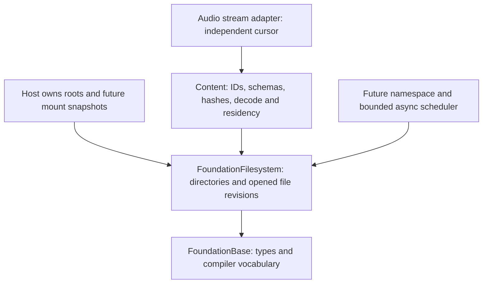

# Filesystem architecture

Status: F0 design and reference review complete; F1 and F2 implemented. Validation is
recorded in the implementation PR.
Reference review follows the baseline and records revisions below. This is a storage architecture for
Ludus; it does not implement an operating-system filesystem.

## Baseline decision

Keep three boundaries: FoundationFilesystem owns explicit-error byte I/O and
root capabilities; a later virtual namespace maps logical paths to immutable
mount snapshots; Content owns resource identity, schemas, hashes and decoding.
Filesystem depends only on FoundationBase, never on logging, content, graphics,
windowing, a global service locator or a not-yet-existing job system.

Prefer offset reads into caller-owned buffers. A file owns an opened revision,
not a mutable shared cursor or a pathname that can silently select a different
revision. Opening and cloning may allocate with explicit failure; warm reads
and path validation do not allocate. Sequential cursors belong in adapters.
Every operation exposes typed errors; native error numbers remain available to
debuggers and higher-level diagnostics. No exceptions or heavy public headers.

A directory capability pins its native root once. Validate relative UTF-8 paths
without silently rewriting names: reject absolute paths, empty components,
'.', '..', NUL, backslashes, colon and control bytes. Traverse with descriptor-
relative operations that refuse symlinks at every component. A trusted root is
selected by the host; this boundary is not a sandbox against hostile mutation
of already-open directories, bind mounts, hard links or privileged processes.

Linux and macOS provide synchronous regular-file reads through a shared POSIX
backend. Other targets explicitly return Unsupported. Empty files are valid. Bound
sizes and offsets before narrowing. ReadAt returns the actual progress, retries
interrupted syscalls and handles short reads. EOF is successful zero progress.
Atomic pathname replacement preserves an open file's old revision. Detect
ordinary in-place size/mtime changes before and after reads; metadata is not a
cryptographic snapshot guarantee. Assets need immutable publication plus digest
validation when strong revision integrity is required.

Native validation covers UTF-8 names, trusted symlink roots, child symlink and
FIFO rejection, sparse offsets above 4 GiB, nanosecond modification times,
replacement/unlink lifetime, clone/move ownership and concurrent reads. Linux
uses GNU symbol wrapping for fault injection. A separate macOS test library
compiles the same exception-free POSIX implementation with a private compile-time
syscall/allocation seam; production has no hooks or mutable fault state. Darwin
tests exercise interrupted operations, short/partial reads, mutation during a
read, allocation/metadata failure cleanup, close-on-exec and descriptor reuse
after a failed close. macOS CI runs these tests and Content read adapters in
Development and with ASan/UBSan. Content saves, watchers and asynchronous workers
remain separate implementation work.

## Virtual namespace and shipping storage

Use explicit roots such as assets, project, cache and user; keep write policy
separate from read lookup. Publish immutable mount tables at a host-controlled
boundary. Resolve by explicit priority plus a stable tie-breaker; a collision
must be inspectable. Only NotFound permits fallback to a lower-priority mount;
corruption, access denial and I/O errors must remain visible. An open file pins
its provider and mount revision through unmount/reload.

Loose files serve authoring. Shipping packs use a versioned, endian-explicit
index with sorted canonical logical paths, offsets, stored/decoded lengths,
codec identity and integrity metadata. Hashes accelerate lookup but never
replace full-key equality. Validate overflow, overlapping/escaping ranges,
duplicates, unsupported features and configured resource limits before mount.
Use independent bounded compression blocks and measured alignment, not one
monolithic compressed stream. Signatures are a separate authenticity policy;
a checksum alone does not make downloaded content trusted.

## Streaming and persistence

First measure synchronous baseline latency and syscall/descriptor overhead.
Then add bounded asynchronous requests above offset I/O: byte and request
budgets, caller-owned destination lifetimes, deadlines/priority with starvation
prevention, per-request cancellation, terminal completion exactly once, and
host-owned completion delivery. A blocking worker fallback establishes behavior;
io_uring/IOCP or browser fetch can replace submission behind the same contract
only after measurement. Cancellation is not permission to reuse memory until
completion. Never perform I/O or decompression in an audio callback or render
critical section.

Keep storage-page caching, decoded resource residency and GPU upload budgeting
separate. Default to buffered OS I/O; mmap and direct I/O require evidence and
platform-specific failure/lifetime contracts. Prefetch is a hint, not a
correctness condition. Watchers invalidate hints; overflow triggers bounded
rescan and explicit revision selection, not mutation of active readers.

Saving uses same-directory exclusive temporary creation, complete checked
writes, explicit flush policy and atomic publication. Distinguish publication
from durable persistence, including directory sync where supported. Expected-
revision checks require cooperative locking for strict compare-and-swap;
uncooperative writers can race. Keep current Content save behavior until the
write contract has dedicated tests and a replacement API.

## Delivery plan and evidence

| Slice | Scope | Acceptance |
| --- | --- | --- |
| F1 | Root capability, validated paths, move-only revision files, offset reads; Content read adapter migration | Regression tests, native builds, sanitizer runs, format/tidy, SDK and browser compile contracts |
| F2 | Virtual paths, immutable mounts, memory provider | Deterministic overlays, failure fallback, unmount lifetime, injected provider faults |
| F3 | Pack reader and pack builder | Fuzzed index validation, bounded decode, reproducible packs, corrupt input tests |
| F4 | Bounded async scheduler and metrics | Cancellation/lifetime/overload tests, representative latency/throughput evidence |
| F5 | Persistence and watcher adapters | Failure injection across publication stages, durability reporting and rescan tests |

No throughput improvement is claimed before measurement. Benchmark mixed
small/large assets, warm/cold cache, concurrent offset reads, loose/pack layout
and target hardware. Record p50/p95/p99 completion latency, CPU, allocation,
bytes in flight, descriptor count, queue age and cancellation latency. Keep
traces bounded and opt-in; report operation, provider/mount generation, logical
path, requested range, result/native code and bytes without recursive logging.

## Contracts for F1

Public headers use FoundationBase, span and string_view only. Root and file
objects are move-only, with transactional Open/Clone: failure preserves the
previous output. They release descriptors through RAII. Destruction, moving,
reopening and closing require exclusive ownership; concurrent const OpenRead,
Clone and ReadAt calls are supported while their owners remain alive. Destination
buffers must not overlap during concurrent reads. Explicit Close reports errors;
destructors release best-effort and never log. Linux and Darwin close are never retried after
EINTR because the descriptor may already have been released and reused. Thanks
to Apple, XNU `kern_descrip.c`, `fp_close_and_unlock` in the
[macOS 14 source](https://github.com/apple-oss-distributions/xnu/blob/xnu-10002.1.13/bsd/kern/kern_descrip.c):
its descriptor-release-before-final-close order confirms the Darwin ownership
contract. No XNU code was copied. Darwin revision checks use `st_mtimespec`;
Linux uses `st_mtim`, preserving seconds and nanoseconds on both hosts.

ReadAt fills the requested range up to the captured EOF, looping on short reads.
Offsets above the captured size fail; offset equal to size succeeds with zero
bytes. Each syscall is capped below the native transfer limit, and 64-bit file
offsets and opt-in checked integer conversions at native/size boundaries are required at compile time. On a syscall error, returned progress is
inspectable but not a complete requested range. Changed returns zero valid bytes;
the destination may have been touched and must be discarded. A metadata check
also runs on an empty/EOF read. Clone duplicates the descriptor, retains the
same metadata revision and has no pathname lookup. Content's adapter owns its
own position and clones to position zero, preserving its existing decoder API.

Logical path equality is byte-exact and case-sensitive. Unicode is validated,
not case-folded or normalized by runtime I/O. F2/F3 tooling must detect host case
and Unicode-normalization collisions before publishing a cross-platform pack;
native lookup follows each filesystem's case and Unicode equivalence rules,
including case-insensitive macOS volumes. Linux filenames are not automatically
portable to macOS or Windows.
The cooking/pack pipeline must also reject reserved names and trailing dots or
spaces when publishing portable assets.
F1's limit matches existing Content (1,024 path bytes); native roots have a
separate 4,096-byte limit and embedded NUL is always rejected. Roots are trusted
host input, so their own symlink ancestry is permitted. Child symlinks are not.

## Contracts for F2

`namespace.hpp` adds owned, allocation-free `VirtualPath` keys with explicit
assets/project/cache/user roots and F1's relative-path validation. Logical
keys remain byte-exact and case-sensitive, without Unicode normalization.
`CreateMemoryProvider` copies input paths and bytes, rejects duplicate full
keys, and uses a sorted index with binary lookup. Empty files and empty
providers are valid on every platform, including the browser. The directory
provider delegates to F1, retaining its native filename-equivalence and revision
checks rather than claiming portable host spelling or a stronger snapshot.

The host creates a complete `MountSnapshot` with a nonzero generation, then
publishes a handle under its own synchronization. Mount IDs are nonzero and
unique; priority descends, and the lowest stable ID wins equal priorities,
independent of input order. Prefixes match whole components and are removed
before provider lookup. An exact prefix has no relative file key and does not
match. Providers are retained and prefixes copied, so editing inputs cannot
mutate published lookup. An empty snapshot represents unmounting everything.
No write policy or process-global mutable namespace is introduced.

Only `NotFound` falls back. Every other status/native diagnostic remains
visible and preserves the caller's prior opened file. `Describe` enumerates
mounts in resolution order, and an optional caller-owned bounded attempt trace
reports actual provider outcomes and IDs; its total count remains available
when the trace is truncated. A provider returning success without a file is
reported as `IoError`. Custom providers must implement the documented explicit-
error, independent revision lifetime and concurrent offset-read contracts.

`VirtualFile` retains the entire originating snapshot and provider file through
unmount/reload; clones share that opened revision without pathname lookup or
allocation. Open/create failures are transactional, and all ownership changes
require exclusive access to the affected handle. Separate stable handles and
const lookups/reads support concurrent use. Reads and path validation allocate
nothing; provider/snapshot creation and opening use checked admission and
nothrow allocations with explicit `OutOfMemory`. Indexes are bounded to 65,536
memory entries and 256 mounts; this synchronous slice adds no async scheduler.
Portable case/normalization/reserved-name collision detection remains required
at F3's pack publishing boundary, not inferred from a Linux/macOS filename.

Regression coverage includes deterministic shuffled overlays, root/prefix
boundaries, duplicate/invalid publication, bounded traces, fallback for every
status, partial provider read faults, retained unmount/reload lifetimes,
independent native revision reads, and an isolated allocation seam exercising
every construction/open allocation plus allocation-free warm reads/clones.
The seam is compiled only into an unexported test archive.

## Reference review and design revision

Reviewed after the baseline above, using the repository's
[reference index](../../references/game-dev-gems-toc.md). These are design inputs,
not evidence that historical performance results transfer to today's hardware.

| Article actually reviewed | Useful contribution | Decision/revision |
| --- | --- | --- |
| Bruno Sousa, GPG2 1.15, *File Management Using Resource Files*, printed pp. 100-104 (PDF 97-101) | Signature/version, per-entry metadata, separation of container and resource | Keep F3's validated index and explicit codec/version fields; require bounded independent blocks rather than whole-resource decompression or a process-wide current directory. Do not adopt historical encryption examples. |
| Colt McAnlis, GPG7 1.1, *Efficient Cache Replacement Using the Age and Cost Metrics*, printed pp. 5-14 (PDF 38-47) | Replacement needs usage history and reconstruction cost; test oversubscribed working sets | Add trace replay comparing LRU with measured cost-aware policies. Keep this in Content residency; no mandatory second byte cache or per-frame filesystem scan. |
| David L. Koenig, GPG6 1.9, *Faster File Loading with Access-Based File Reordering*, printed pp. 103-108 (PDF 106-111; scanned pages visually inspected) | Capture accesses, reorder the pack, then rerun; caching and alternate gameplay paths can distort gains | F3 builder accepts a deterministic trace-derived layout manifest. Compare startup, level transitions and mod workloads on target SSD/HDD/browser delivery; retain canonical sorted lookup independently of payload placement. |
| Noel Llopis and Charles Nicholson, GPG6 1.10, *Stay in the Game: Asset Hotloading for Fast Iteration*, relevant printed pp. 109-114 (PDF 112-117; visually inspected) | Converter/monitor/listener/rebinding boundaries and resource indirection | F5 watchers observe completed cooked output, debounce duplicate hints and trigger validation. Content publishes replacement handles at a controlled frame boundary, keeps the prior revision on failure and budgets overlapping residency. Filesystem never rewrites active readers. |
| Neil Gower, GPG8 5.3, *Asynchronous I/O for Scalable Game Servers*, printed pp. 506-513 (PDF 521-528) | Queue boundary, buffer/control-structure lifetime, asynchronous cancellation, small-request overhead | F4 uses an explicit request state machine, coalescing only compatible adjacent ranges, and drain-before-release shutdown. Networking examples inform ownership; they do not establish modern disk throughput. |

F3 payload layout is decoupled from index order. Layout changes do not alter
resource identity. Trace-derived grouping is an optional offline optimization;
record its input/version and test scenarios beyond the training trace. Existing
asset cooking and catalog identity remain Content responsibilities. F5 reloads
follow prepare -> validate -> publish -> retire; failure retains the previous
asset, and GPU/audio retirement respects the owning subsystem's fence/lifetime.

F4 states are Queued -> Submitted -> Completing -> Completed; cancellation is
an intent on a live request, with an eventual Cancelled or completed result.
An accepted request keeps its file revision, destination and completion record
alive. Shutdown stops admission, cancels queued work and drains submitted work
before freeing storage. Coalescing must preserve provider/revision, destination
layout, limits and deadlines. Measure backend crossover rather than always
routing small cached reads asynchronously.

Modern OS contracts were checked against primary documentation:
[pread](https://man7.org/linux/man-pages/man2/pread.2.html) supplies independent
offsets and permits short reads; [open](https://man7.org/linux/man-pages/man2/open.2.html)
explains descriptor revision lifetime and final-component O_NOFOLLOW semantics;
[close](https://man7.org/linux/man-pages/man2/close.2.html) explains Linux's
non-retry rule. The per-component walk is necessary because final-component
O_NOFOLLOW alone does not protect ancestors. Future stronger Linux containment
can use [openat2](https://man7.org/linux/man-pages/man2/openat2.2.html) behind a
separate stated policy; do not silently claim its guarantees for this walk.
[Windows cancellation](https://learn.microsoft.com/en-us/windows/win32/fileio/canceling-pending-i-o-operations)
also requires waiting for terminal completion before buffer reuse.

## Dependency and ownership map

F1 does not change catalogs, hashes, save APIs or logging sink dependencies.
A Content read still publishes its output only after success; native missing
ancestors now report NotFound, empty files can be streamed, and in-place
mutation checking also covers a change during the read. DEL is rejected as a
control character alongside the existing invalid-path cases.
