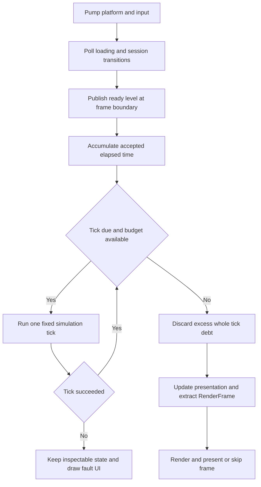

# Frame and tick updates

Status: Proposed. Part of the [game world architecture](game-world.md).

A presentation frame services the platform and draws current state. A simulation
tick advances gameplay by a fixed duration. The game specifies the phase sequence
as ordinary function calls; jobs may later change execution without changing the
defined visibility of effects.

## Time and frame ownership

The initial game policy is 60 simulation ticks per second, a maximum accepted
frame delta of 250 ms, and at most four catch-up ticks per presentation callback.
These are configurable application policies and must be recorded with replay
metadata. They are not engine performance guarantees.

Use a monotonic clock. Accumulate accepted elapsed time in `float64` seconds.
While at least one tick remains and the catch-up budget allows it, execute one
tick and subtract its fixed duration. Increment a `uint64` tick index only after
a successful tick; exhaustion stops the session rather than wrapping.

After the budget is exhausted, discard remaining whole ticks and retain only the
fractional remainder. Count all discarded time, including the initial frame-delta
clamp. This policy deliberately slows simulation under sustained overload; it
does not skip tick numbers or run physics with an enormous delta. Clamp negligible
numeric drift at the accumulator boundary so render alpha stays in [0, 1).
For example, 100 ms of debt permits four ticks and discards approximately two
ticks. The [fixed-timestep reference](https://gafferongames.com/post/fix_your_timestep/)
explains why catch-up needs a bound and how interpolation decouples rendering.

Session transitions reset clock debt. Pause and browser suspension also reset it;
resuming never catches up the time spent paused or hidden. A first callback starts
the clock baseline without simulating elapsed startup time. Do not busy-wait for
the next tick, a GPU fence, browser readiness, or a worker result in a browser
callback. The native outer loop may use its established pacing mechanism.

The session selects an explicit simulation mode. Menus and overlays route input
before the gameplay bridge; an overlay cannot accidentally resume simulation.
Loading is an independent transition state and may progress in any mode.

| Mode | Tick policy | Presentation/input policy |
| --- | --- | --- |
| Playing | Accumulate bounded time and run normal ticks. | Gameplay input after UI consumption; render the latest completed world. |
| Paused | No time accumulation; an explicit debug step runs one tick. | UI input only; show exact current transforms. |
| Faulted | No further ticks until restart/replacement. | Responsive fault UI with an optional retained valid background. |

Publishing a level selects its documented entry mode and resets input/time.
Changing mode never executes arbitrary entity callbacks or resumes a worker wait.

## Input across frames and ticks

The input module's step and a gameplay tick are not automatically the same unit.
A game-owned `InputBridge` samples normalized actions after event pumping and
retains pending gameplay edges until a tick consumes them. Preserve the existing
[action semantics](../../modules/input/include/ludus/input/actions.h), especially
`Cancelled`, which does not fabricate `Released`.

The initial bridge uses final held/axis values plus OR-accumulated `Pressed`,
`Released`, and `Cancelled` flags per action. A quick press and release can carry
both edges with a final unheld value. One tick consumes those flags exactly once;
additional catch-up ticks reuse held values without replaying edges. If a frame
runs zero ticks, its edges remain pending. This intentionally coalesces several
presses of one action before a tick; rhythm/text-sensitive gameplay needs a
separate ordered transition queue with its own bounds and overflow policy.

Input sampled now applies to the first following tick, including the oldest
catch-up tick. Timestamp-based historical assignment is outside the jam baseline.
Replay records the resulting `TickInput`, not raw event timing. UI handles its
own frame input, and consumed actions do not enter the gameplay bridge.

On focus loss, suspension, binding replacement, pause, or level activation, clear
pending presses and cancel held gameplay actions. On resume, require previously
held controls to be released before accepting them again. This prevents a key
held through a menu or transition from triggering an unintended attack. The bridge
must handle loss/reset signals before ticking even if no normal key release arrives.

## Simulation phase contract

The sequence below is a concrete baseline for a movement-and-interaction game.
Systems may be omitted or renamed, but changes to effect timing must update this
contract and its tests.

| Phase | Reads | Writes and outputs |
| --- | --- | --- |
| BeginTick | Accepted completion batch, previous spawn outcomes, `TickInput`, due timers if used | Clear tick-local queues, apply valid owned results, consume outcomes, snapshot due timer records, capture previous transforms. |
| Intent | Active player/AI state, input, current positions | Movement/attack intent, timers, AI state. |
| Motion and collision | Intents, motion, transforms, level geometry | Current transforms/velocities and typed collision/trigger events. |
| Gameplay consequences | Collision/attack events, health, objectives | Damage, rewards, outcomes, pending-destroy flags, spawn/destroy commands, presentation requests. |
| Commit | Recorded structural commands | Preflight then publish complete spawns/removals, invalidate destroyed handles, produce next-tick spawn outcomes. |
| EndTick | Updated world and staged presentation requests | Validate optional debug invariants, publish completed tick number, tick trace, and this tick's presentation requests. |

Completion application may write existing values and queue structural commands;
it cannot directly change pool membership. Clear queues from the previous tick
before applying new results, and preserve the separate spawn-outcome queue until
its consumers have read it. BeginTick captures previous transforms after applying
any accepted teleports or other background state changes. A teleport sets previous
and current transforms equal to avoid interpolation across the jump. New entities
get equal history at commit. Ordinary motion then updates only current transforms.

`RunTick` is a normal call chain with explicit world/input/context parameters and
a returned status. It does not discover methods through reflection or invoke a
per-entity virtual callback. Call sites are the authoritative order. Each system
declares reads, writes, events produced/consumed, and structural commands in its
nearby documentation. The world is mutated only by its owning main thread.

If a phase reports a simulation fault, stop the chain and future ticks. An
incomplete tick is not published as successful or replayable. Keep the inspected
world for diagnosis; render the fault UI and restart from the level definition.
There is no hidden tick rollback. Presentation clocks and platform pumping
continue so the application remains responsive. Do not extract gameplay draws
from the partial tick. A retained last valid render frame may serve as the fault
screen background while its asset references remain valid.

## Events and same tick consequences

Events describe facts that happened; commands request a future structural change.
`CollisionEntered`, `DamageApplied`, and `SpawnCommitted` are typed value records,
not callbacks. They include the tick and relevant handles/values. Queues belong
to the game world and are reset after their declared consumers have finished.

Collision events generated during Motion are consumed in Gameplay in the same
tick. Damage/reward resolution occurs there through explicit functions. Visual
and sound requests are staged for the presentation outbox. Consumers do not
recursively republish into a queue currently being traversed; use a separate later
queue or a direct named function when a consequence has another consequence.
Avoid an unbounded drain-until-empty event loop.

Stage each tick's presentation requests locally, including any spawn effect
produced after commit. Publish that batch to the persistent outbox only when
EndTick succeeds; a fault discards the incomplete tick's requests. Preflight
required outbox capacity before structural playback. Audio/renderer services are
never called from the simulation phases, so an abandoned tick cannot already
have played a sound. Requests from earlier completed ticks remain deliverable.

Collision state distinguishes enter, stay, and exit; a trigger reward uses enter
or a one-shot state so it is not awarded every tick. Handle pairs are canonicalized
and ties have a documented stable ordering. Destroying an entity removes its
contact-cache membership at commit. If a game needs exit-on-destroy behavior,
emit a separately specified removal event with copied data; never dereference a
destroyed component to fabricate a late exit.

The outbox persists across all ticks in a frame and across skipped render frames.
Audio/presentation delivery consumes each request once, independently of whether
image acquisition succeeds. Persistent UI such as score reads the latest state;
critical transitions live in session state. Optional particles and duplicate
cosmetic sounds can be dropped under a documented bound with a counter. Required
gameplay events fail explicitly on overflow.

Discrete effect records include world identity, originating tick, an event
sequence, and copied anchor/appearance data. An effect never looks up a destroyed
entity to find where it happened. The first implementation delivers effects after
successful ticks without adding another wait for interpolated rendering. Birth,
removal, and impact effects therefore use the explicit discontinuity/anchor policy;
ordinary transform interpolation cannot undo their logical occurrence. If future
buffered render snapshots add latency, pair visual records with their presentation
timeline and use a delivery cursor. Dropping a snapshot must not lose or duplicate
its discrete effects. Level activation clears old-world cosmetic records through
the presentation owner and releases their leases safely.

## Timers and decision cadence

Gameplay waits use simulation tick numbers. Store simple cooldowns or delayed
transitions directly in the owning component as a `uint64` deadline. For example,
an attack in tick N with a 30-tick cooldown becomes eligible at N+30. An unused
deadline has an explicit inactive flag. Checked addition reports exhaustion;
deadlines never wrap. Pause does not advance them, and single step advances normal
gameplay time. UI/loading timeouts use their own clock and cannot expire gameplay
cooldowns while paused.

Add a bounded, typed `TimerQueue` only when the game needs events addressed to
other entities or timers without a natural component owner. Its records own a
typed payload, due tick, insertion sequence, and full target handle where needed.
At BeginTick, snapshot the due set in `(DueTick, Sequence)` order for consumers in
the declared Intent/Gameplay phase. Check target activity again at delivery.
Scheduling during a tick has a minimum delay of one tick, including a requested
zero delay; due-set traversal cannot recursively grow. Recurring periods are
positive and compute the next deadline from the previous due tick. Cancellation
uses a generation-checked timer ID if IDs escape; world replacement clears timers.
Cancellation suppresses an already-snapshotted record if it has not been delivered;
consumers validate its current cancellation state before producing an effect.
Authoritative timer overflow faults explicitly. A small linear scan is sufficient
initially; a heap or timing wheel needs measured queue size/cost.

Motion and collision run every tick. Expensive AI decisions may run every N
ticks, with a positive period declared by the game and an initial phase derived
from creation sequence to spread work. The last valid intent is retained between
decisions; target validity and urgent interruption checks still run every tick.
This cadence is simulation policy recorded with content/replay metadata. It must
not adapt silently to frame rate or a wall-clock CPU budget. Deterministic
incremental work uses a fixed number of work units per tick. These choices adapt
the [scheduling chapters](game-world-gems-review.md#waiting-and-update-cadence)
without introducing an OS-style scheduler into gameplay.

## Presentation and rendering

Presentation runs once per callback after successful ticks, using the latest
completed world. Camera smoothing, UI animation, and cosmetic animation may use a
bounded frame delta; gameplay collision or attack timing remains in fixed ticks.
At pause, render current transforms without interpolation so the visible world
matches the inspected tick exactly.

For normal interpolation, alpha is accumulator / tick duration. Interpolate
previous-to-current transforms into `RenderFrame` without writing the result back
to gameplay. This introduces roughly one simulation tick of visual delay, a
chosen smoothness tradeoff. Teleports, newly spawned entities, and explicit
discontinuities use equal previous/current values. UI and cosmetic effects may
use separate presentation state.

`RenderFrame` owns reusable arrays of camera data and draw values plus logical
asset references. No draw contains a component pointer, JSON view, or callback
into gameplay. Sort draws with an explicit layer/depth/tie key. Initial extraction
is single-threaded, and the renderer consumes the frame before its storage is
reused. Reserve normal scene capacity during loading; required draw overflow is
reported rather than quietly making entities disappear.

The existing RHI only supports a bounded fullscreen rendering slice. A sprite or
mesh adapter and its asset lifetime contract must be implemented separately;
this design does not invent unavailable public draw calls. Required textures or
meshes need loading readiness before level activation, or an explicit placeholder
policy for optional visuals.

All current RHI calls remain on the main thread. A skipped/minimized frame does
not undo simulation or repeat sound requests. Device loss follows the graphics
session's existing failure/restart contract. Frame CPU storage may be reused only
after consumption/copy; GPU resources and upload storage follow actual completion
and retirement requirements. Logical asset references are resolved by the
renderer, whose leases must outlive submitted work.

## Background work and eventual jobs

Timers and small state machines handle waiting gameplay. A coroutine can later
express a scripted sequence, but it cannot retain borrowed component references
across suspension. Fibers are not a requirement for these behaviors.

Cooperative AI sequencing answers when an action resumes. A CPU job answers where
independent computation executes. Keep those concerns separate: no worker waits
for an entity's cooldown, next animation frame, or user input.

Background requests contain owned immutable inputs, a world identity, full target
entity ID when applicable, a request ID, and a revision of the requested state.
For example, a path result identifies both the entity and its current destination
revision. Completion produces owned result data with an explicit status. It never
mutates a live world or calls the RHI.

At BeginTick, take a bounded snapshot of available completions and apply that
batch in request-ID order. Results arriving after that snapshot wait until the
next tick. Validate world identity, entity activity, revision, and request state;
discard stale results with counters. Request-ID ordering only orders the available
batch; it does not make arrival timing deterministic. Replay records accepted
results and their actual application tick. Gameplay needing deterministic
readiness must use a deterministic in-tick algorithm or an explicit simulation
barrier/loading state.

Cancellation prevents application, not necessarily execution. Task input/result
storage stays owned until the worker or callback acknowledges completion. World
replacement revokes application through identity checks without freeing storage
a task still uses. Bound outstanding requests and drain/reclaim their storage
during shutdown through the owning service; never retain a pointer to a destroyed
session in a delayed callback.

For the first native workers, transfer completions through a bounded queue with
a short standard mutex-protected ownership move. Reserve one completion slot per
admitted request, counting queued and executing requests together. Keep storage
reserved until the result is consumed/reclaimed; reject new admission explicitly
when full. Workers never append directly to the session's completion array.
Main-thread polling does not wait for jobs to finish. Debug builds assert queue
ownership/thread roles; traces report occupancy and rejected admission.

Dedicated single-producer/single-consumer queues are a later measured alternative,
with explicit producer/consumer roles and backpressure. Historical samples using
plain `volatile` indices are not valid portable C++ synchronization. Publish and
consume through standard locks or a reviewed atomic protocol with the necessary
happens-before relation, including result lifetime. See the
[C++ data-race rules](https://eel.is/c++draft/intro.races) and
[atomic ordering](https://eel.is/c++draft/atomics.order). A queue only transfers
ownership; it does not make concurrent reads of a mutable world safe.

Start with serial or incremental implementations. Add a worker pool only when a
profile identifies work worth the dispatch and synchronization cost. Initial
parallel candidates include independent path queries, visibility tests, or pure
animation evaluation over a snapshot. Workers write separate output ranges or
per-job buffers. Merge with explicit stable keys. Do not concurrently append to
one unsynchronized `Array` or let a worker hold an unconstrained mutable world.

If dependencies grow, represent ready tasks and completion edges without blocking
workers on unfinished jobs. Fibers are a later option when measured nested waits
and suspended call stacks justify their portability/debugging cost. A dedicated
render thread requires a revised RHI owner contract, bounded snapshots, backpressure,
and resource retirement rules before implementation.

A later job is bounded run-to-completion work over owned inputs or a protected
immutable snapshot. Split `A -> wait for B -> C` into dependent jobs; only ready
jobs enter execution. Prepare/freeze declared edges before submission, reject
cycles or missing prerequisites, and use generation-checked handles for recycled
job records. Completion has explicit success, failure, and cancellation outcomes;
an absent/recycled prerequisite must not be mistaken for successful completion.
Dependent work runs only under its declared outcome policy, and inputs remain
alive until every reader completes. Keep a serial executor of the same functions
to compare correctness and dispatch cost. These are future acceptance conditions
from the [parallelism review](game-world-gems-review.md#parallel-execution-and-communication),
not a requirement to build a scheduler for the jam game.

Browser pthread builds require COOP/COEP deployment support and cannot simply use
blocking main-thread waits. Maintain a serial browser target and check the pinned
toolchain when adding threading. These restrictions are documented by
[Emscripten](https://emscripten.org/docs/porting/pthreads.html); the main-thread
baseline also follows Ludus's current graphics contract.

## Pause stepping and replay

Pause stops gameplay ticks, resets clock debt, and clears/cancels gameplay input.
UI and loading continue. Single step executes exactly one normal fixed tick with
an explicit supplied input record, defaulting to neutral. It consumes a captured
completion batch like a normal tick; the debugger can instead hold completions
to isolate a scenario. Step does not manufacture elapsed wall time. Restart
constructs a new world and resets gameplay/presentation history.

A replay mode feeds recorded `TickInput` and accepted completion records into the
same tick function. Hash selected canonical gameplay values at EndTick to identify
the first divergence. Record entity references using authored IDs or per-world
creation sequences and rebind them to this replay's runtime handles. Never persist
raw process world IDs or assume that a recorded handle belongs to a new session.
Normalize request identities similarly when replaying accepted completion records.
Exclude pointers, padding, process world IDs, pool order, GPU handles, and
presentation interpolation from state hashes. Save random stream states or the
initial seed plus defined call ordering. Fixed ticks and stable queues help
reproducibility; they do not establish cross-platform floating-point determinism.

## Required verification

Verify zero-tick frames retain input edges; catch-up consumes edges once; held
values persist; press/release coalescing and cancellation match policy; and UI
consumption does not leak into gameplay. Check clamp/catch-up discard accounting,
pause/resume, suspension, and single-step behavior.

Use a headless scenario to prove event consumption, one-shot trigger rewards,
pending-destroy filtering, end-tick spawn visibility, fault behavior, and teleport
interpolation. Test multiple ticks per frame and skipped render frames for
exactly-once presentation requests. Apply a completion after entity destruction,
after destination revision changes, after level replacement, and after shutdown.
Replay the same recorded scenario and compare canonical state per tick on the
same build. Profile representative entity counts before changing scheduling.

Verify equal-deadline ordering, cancellation/stale timer targets, zero-delay
deferral, paused deadlines, and fixed AI cadence across different frame rates.
Fault after staging a sound and prove it is not delivered; preserve earlier
successful-tick requests. Saturate completion admission, cancel outstanding work,
and prove every reserved slot/result is eventually reclaimed. Any future parallel
path also requires a race/lifetime check and equivalent serial/parallel outcomes
for a fixed set of accepted results.
