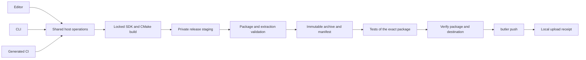

# Ludus game packaging and itch.io publishing

Status: proposed implementation contract. Written 2026-10-02. Commands, schemas,
UI controls and module names in this document are future work unless explicitly
identified as existing. This document extends the
[project and SDK workflow](project-sdk-workflow.md) and its
[implementation design](../../.kiro/specs/project-sdk-workflow/design.md).
It does not change that milestone's acceptance scope or certify shipped tooling.

A game project should own its release configuration and optional CI workflow.
Installed Ludus host tools should build and validate distributable packages, then
upload those exact packages through butler. The Editor and CI use the same
operations as the CLI. Packaging works without an itch.io account, network,
Qt or an engine source checkout once required tools and SDKs are installed.

The first implementation is described in the
[native release guide](../development/game-packaging-publishing.md) and
[evidence ledger](../development/game-packaging-publishing-evidence.md). Those
records distinguish implemented CLI operations from pending production SDK,
transport, CI, Editor and browser acceptance.

## Scope and prerequisites

First deliver a Linux x64 Release package and explicit itch.io upload for an
independent native game. Add generated GitHub Actions, then Editor integration.
Browser publishing follows when independent web project creation and web SDK
resolution are available; preserve the existing browser smoke workflow meanwhile.
Windows, macOS, other CI providers and stores are later adapters with separate
acceptance matrices.

Project/SDK milestones P2 and P3 provide installed host tools, project creation,
locked SDK resolution and shared build supervision. Native packaging also needs
P1's dependency and license inventory. Editor creation integration depends on P4.
Do not require all Editor work before delivering a useful headless packager.
General asset importing, store page creation, page visibility changes, pricing,
devlogs, game self-updates and game-jam submissions are outside this milestone.
Uploading a build does not submit a game to a jam.

Existing code to inspect and reuse:

- `scripts/python/web_package.py` and `test_web_package.py`: deterministic smoke
  staging, archive extraction checks, browser limits and notices. The current
  fixed payload and Wasm memory budget belong to the smoke app.
- `scripts/python/editor_project.py`, `editor_tool.py`, `editor_launch.py` and
  `cmake_targets.py`: descriptors, operation protocol, supervision and artifact
  discovery. Reuse their installed successors from the SDK workflow.
- `apps/editor`: asynchronous state ownership, cancellation, bounded output and
  stale-event handling.
- [Web packaging](../development/web-packaging.md) and
  [hosted acceptance](../development/webgpu-hosted-acceptance.md): current smoke
  behavior and remaining real-device gates. Their account-specific upload
  destination must never become a generated-project default.

## Ownership and operation boundary

| Owner | Responsibility |
| --- | --- |
| Game repository | CMake build/install definitions, assets, release profiles, destination mappings, optional generated workflow |
| Runtime SDK | Game link inputs, redistributable dependency metadata and license notices |
| Installed host tools | Release planning, building, staging, validation, archive creation, package verification and upload supervision |
| Editor | Forms, package inspection, progress and explicit user actions through the shared backend |
| butler | itch.io authentication and transport to a selected project/channel |
| CI platform | Runner provisioning, secret storage, artifact retention and deployment scheduling |

Initial backend implementation remains Python, following the project/SDK design.
Suggested installed modules are `release_model`, `release_plan`, `package_native`,
`package_web`, `package_verify`, `publish_itch` and `release_receipt`. These names
are organizational guidance, not a second CLI or process supervisor. Only
`publish_itch` knows butler's command contract. A future provider must justify
extracting a generic publishing interface; do not build a plugin framework now.

C++ additions remain exception-free and obey AGENTS.md and steering. No network,
butler or authoring dependency enters runtime exports or FoundationBase. The
Editor does not load game libraries into its process. All external invocations
use argument arrays and explicit working directories, never shell interpolation.



## Files and configuration contracts

Use separate release configuration so packaging can evolve without changing the
project descriptor merely to support a store. A version-2 project is initially
required; version-1 projects retain their existing behavior and receive an
explicit migration message when invoking the new operations.

```text
MyGame/
  ludus.project.json
  ludus.lock.json
  ludus.release.json
  CMakeLists.txt
  CMakePresets.json
  cmake/GameRelease.cmake
  assets/
  .github/workflows/itch-upload.yml    optional
  .ludus/                            ignored local settings and locks
  out/packages/                      ignored immutable package directories
  out/publish/                       ignored receipts and redacted logs
```

Example proposed `ludus.release.json` schema version 1:

```json
{
  "schemaVersion": 1,
  "profiles": {
    "linux-release": {
      "targetPlatform": "linux-x64",
      "buildProfile": "release",
      "target": "MyGame",
      "installComponent": "GameRelease",
      "entryPoint": "bin/MyGame"
    }
  },
  "itch": {
    "target": "yourname/mygame",
    "channels": {
      "linux": { "packageProfile": "linux-release", "channel": "linux-stable" }
    }
  },
  "automation": {
    "provider": "github-actions",
    "releaseTags": false
  }
}
```

`profiles` is required; `itch` and `automation` are optional. The target is an
existing CMake executable target, resolved through the CMake File API. A profile
selects the supported target/flavor from the engine lock, not an arbitrary preset
command. CMake remains authoritative for which files install. An install
component is release payload selection, not permission to copy the whole build.
`entryPoint` is a package-relative path validated against the final payload.

The parser rejects unknown schema versions, duplicate JSON keys and unknown
fields. Version 1 limits: 256 KiB UTF-8 configuration, 32 profiles, 32 channel
mappings, 64 characters for local identifiers, 128 characters for the itch.io
target and 240 characters for payload-relative paths. Local identifiers and
channels use `[a-z0-9][a-z0-9-]*`; target uses two nonempty lower-case account/slug
segments, allowing digits, hyphens and underscores, separated by one slash.
These are deliberately conservative tool constraints, not a claim about every
identifier accepted by itch.io. Reject control characters, absolute paths,
`..`, drive prefixes and backslashes in portable payload paths. Publish shared
fixtures for C++/Python verdicts; diagnostics identify the failing field.

Keep engine versions and digests in `ludus.lock.json`. Release configuration does
not duplicate SDK identity. Host tools distribute an exact butler version and
per-host archive checksums in their tool manifest; generated CI pins a compatible
host-tool release and verifies downloaded distributions. Never download a
floating `latest` butler during upload. Tool installation/update is a separate
explicit operation. Local absolute tool paths and credential identity selection
belong in ignored settings. Generated files become game-owned after creation.

## Native release packaging

Add a project CMake install component `GameRelease`. It installs the selected
executable, authored runtime assets, required redistributable dynamic libraries
and notices. A generated `cmake/GameRelease.cmake` documents this contract and
provides editable install rules. Initially require exactly one playable entry
point per package; supporting launchers or several executables is later work.

The packager performs these steps under the existing cooperative build lock:

1. Validate configuration and resolve the exact Release SDK/toolchain. Configure
   and build the selected target successfully. Re-resolve its artifact and verify
   SDK inputs did not change. Never package a stale binary after a failed build.
2. Create an empty private staging directory. Invoke CMake installation with the
   selected component/configuration and an explicit staging prefix. Game install
   code executes as part of this explicit operation, with the user's normal
   privileges. Opening or inspecting a project never executes it.
3. Inspect every staged entry. Reject symlinks, special files, path collisions
   including case-fold collisions, escaping paths and missing entry points.
   Require an executable mode on the native entry point. Validate dynamic
   dependency closure using static binary inspection, without executing `ldd`
   on project binaries. Resolve release libraries from declared SDK metadata and
   game install rules; never sweep a producer system's library directories.
4. Require notices for bundled dependencies and a declared system prerequisite
   list. Keep platform GPU drivers and the supported OS baseline external.
   Validate loader paths such as package-relative RPATHs. Reject producer paths,
   SDK headers, static link archives, editor/tool binaries and debug sidecars in
   the player payload. A separate debug archive can be added later.
5. Write a payload manifest, create a ZIP, extract into a new empty directory and
   verify paths, bytes, modes, dependency rules and entry point again. Tests use
   this extracted copy. Publish the completed package directory atomically to an
   absent destination; failure leaves older packages intact.

Use explicit file installation instead of recursive copies of build/source
roots. CMake install rules can run arbitrary project code; containment validation
is validation of the resulting payload, not a sandbox for that code. Initial
native limits are 10,000 entries, 30,000,000,000 expanded bytes and paths of at
most 240 characters. Stream hashes and enforce bounds while extracting. Preserve
executability in ZIP metadata and prove it survives installation with itch.

## Browser release packaging

A future `web-release` adapter uses a separately locked Emscripten SDK and its
pinned WebGPU port. The native host tools and Editor stay native. Stage an
`index.html` at ZIP root, its JS/Wasm and every required data/asset file using an
explicit project install manifest. Preserve relative, case-matching references;
external runtime URLs are unsupported in the initial adapter.

Generalize the existing smoke validator instead of copying it. Wasm initial and
maximum memory are profile policy validated against actual module sections;
do not apply the smoke app's 32 MiB/256 MiB values to every game. Begin with
unshared memory and no pthreads/SharedArrayBuffer requirement. Threaded browser
profiles need separate hosting and compatibility acceptance.

The current HTML5 hosting limits are 1,000 files, path lengths of 240 characters,
500 MB expanded total and 200 MB per extracted file. Enforce conservative decimal
byte values and version the hosting policy in the tool distribution. Recheck
limits before enabling a new adapter version. Account upload allowances are a
separate constraint. [itch.io HTML5 guide](https://itch.io/docs/creators/html5)

Clean extraction, local HTTP tests and software rendering tests validate the
package. Real hosted rendering on supported browsers/devices remains a separate
acceptance gate. Retain exact package hashes in both kinds of evidence.

## Package identity and verification

Each completed package has this layout:

```text
out/packages/<profile>/<archive-sha256>/
  game.zip
  package.json
  validation.json
```

Inside `game.zip`, `build-info.json` records schema version, profile, entry point,
source revision, dirty status, engine lock digest, resolved SDK identity and
payload file paths/sizes/modes/SHA256 values. Its inventory excludes itself to
avoid recursive hashing. It contains no credentials, local absolute paths or
private draft URLs. The package sidecar includes the ZIP digest, manifest digest,
release configuration digest, host-tool identity and human version. The package
identity is the archive SHA256, not the editable version label.

`validation.json` records validator identity, checks/results and archive digest.
Test reports also bind to that digest. A report establishes what was tested,
not trust in an arbitrary downloaded report. CI trusts packages produced by its
own trusted job; manual upload accepts a user-selected local package after
verification. A checksum without a trusted source establishes consistency only.

ZIP output has sorted entries, fixed timestamps, normalized allowed modes and
fixed compression settings. Determinism applies to identical payloads and
compatible archiver versions; it is not a promise of reproducible compilation.
Use same-filesystem staging and atomic no-replace publication. Reusing an
identical package requires verifying existing content, never overwriting it.

Upload independently validates the ZIP, sidecars and extracted inventory against
all limits. Copy to a private operation snapshot and rehash before invoking
butler; never upload a writable build tree. Release configuration must match the
recorded digest. Rebinding an old package to changed configuration requires a
future explicit command; version 1 rejects that mismatch.

Local packaging may record dirty sources or a visible local SDK override. Local
upload permits these only with an explicit `--allow-local-inputs` option; the
Editor exposes the same choice with the resolved identity. Generated release CI
requires clean sources, a resolved committed lock and no local overrides. Test
scratch files belong in ignored output so tests do not make a release dirty.

## Public commands and results

Proposed commands accept a project directory or descriptor, consistently with
the project CLI. All commands use shared operations and optional versioned JSON
results. No command below is currently promised to exist.

```text
ludus project release init <project> --provider itch --ci github-actions
ludus project package <project> --profile linux-release --version 0.1.0
ludus project package verify <package-directory>
ludus project publish plan <project> --package <package-directory> --destination linux
ludus project publish upload <project> --package <package-directory> --destination linux
ludus project release ci <project> --enable-release-tags
```

`release init` generates configuration, packaging helper and optional workflow
only into absent paths, showing the intended additions before application.
For an existing project, apply under the project metadata lock with a recovery
journal for interrupted multi-file writes; refuse collisions and preserve
user-owned files. A repair can complete or remove only files created by that
operation. Template regeneration never silently replaces edited workflows.
Project creation can include these files in its existing atomic creation step.

`publish plan` is offline: show destination, channel, version, package digest,
payload size, prerequisites, local-input status and the redacted argument plan.
It never authenticates or uploads. Upload is a separate explicit operation.
There is no implicit upload in Build, Run, Package or Open. Version 1 does not
combine rebuilding and uploading: package first, test/inspect it, then upload.

Stable result categories include configuration/compatibility failure, tool
missing, build failure, invalid package, lock busy, authentication failure,
transport failure, upload accepted, cancelled before upload and remote outcome
unknown. Assign numeric exit codes and protocol enums together during the first
schema phase; keep tests against the published mapping. Cleanup uncertainty
cannot be reported as success. Use bounded redacted logs and structured result
fields; do not make the Editor parse human butler progress text.

## itch.io adapter and credentials

Users create the itch.io project page once and choose its visibility themselves.
Run `butler login` explicitly for local use; CI supplies the secret through
`BUTLER_API_KEY`. The Editor may launch the supported login flow but never
reads/displays the key or writes it into project configuration. CI secrets are
configured through the CI provider, not generated into files. Pass the key only
to the butler subprocess environment; configure/build/package/test processes
must not receive it. [Butler authentication](https://itch.io/docs/butler/login.html)

Invoke the verified pinned binary with the validated private ZIP snapshot:

```text
butler push <snapshot/game.zip> <username/game:channel> --userversion <version>
```

Butler supports directories or ZIPs, updates an existing channel and transfers
changed data. Its `--userversion` labels the build; itch.io orders builds by
upload order rather than that label. Initial HTML setup requires selecting HTML
project type and marking the channel playable in the page editor after its
first upload. Record setup instructions in generated docs; a local “setup done”
flag is user acknowledgement, not remote verification.
[Butler upload contract](https://itch.io/docs/butler/pushing.html)

The adapter never changes project visibility. A channel called `beta` or `staging`
does not make a public game's files private. An upload updates remote content and
may be immediately available to players according to the page's current settings.
Use a separate private/draft project for acceptance testing. Do not promise
atomic publication across platforms: each destination/channel is its own upload.
A multi-platform release can partially succeed; report each result separately.

Pin and probe the supported butler command/version during tool setup. Avoid
promising machine-readable events or build IDs until tested against that version.
Stream bounded redacted diagnostics and report indeterminate progress when
butler offers no stable structured progress interface. Record a remote build ID
only if the supported interface actually returns one.

## Upload lifecycle and recovery

An upload owns one supervised process and follows:

```text
Idle -> Validating -> Snapshotting -> Ready -> Uploading -> UploadAccepted
                                     |          |
                                     |          +-> RemoteOutcomeUnknown
                                     +-> Failed / CancelledBeforeUpload
```

`UploadAccepted` means the pinned butler command successfully completed. It does
not certify playable runtime behavior or completion of every remote processing
step. Keep hosted acceptance evidence separate. An upload receipt records job ID,
destination/channel, source revision, archive digest, version, tool identity,
start/end times, result and optional observed remote ID. It is local evidence,
not a remotely verified hash. Never include secret values or full environment
maps in receipts, diagnostics or Copy Job Details.

Cancellation before starting butler is definite. Once upload starts, cancellation,
connection loss, timeout or process failure can leave an uncertain remote result.
Stop performs shared process-tree cleanup but cannot roll back an accepted build.
Record `RemoteOutcomeUnknown` whenever remote mutation cannot be excluded. Do
not automatically retry these cases. Offer inspection of the itch.io build list
and an explicit retry of the same immutable package; retry may create another
remote build. Prevent duplicate clicks for an active job.

Use a cooperative local lock keyed by itch.io target and channel in the host-tool
user state directory, so two projects on one host share it. CI takes a matching
repository concurrency group. Neither lock coordinates unrelated machines,
repositories or the itch.io desktop uploader. Initial support assumes one CI
repository owns a destination and local operators do not upload concurrently
with CI. Strong cross-machine exclusion would require a deployment coordinator
and is outside version 1. State this limit in generated documentation.

## Generated GitHub Actions

Generate a user-owned workflow when requested. Default trigger is
`workflow_dispatch`; release-tag uploads require explicit enablement. PR checks
may build/package/test without credentials, but never upload. Do not use
`pull_request_target` or run untrusted PR code with deployment secrets.

Use two separate jobs:

1. **Build and validate:** check out the selected revision, provision exact host
   tools/toolchain and SDKs through explicit setup, build/package, extract and
   run relevant release tests, then retain the package and digest-bound reports.
   This job has no itch.io secret.
2. **Upload:** depend on successful validation, download that exact workflow-run
   artifact, verify its bytes and metadata, and invoke the shared upload command.
   No rebuild occurs here. Supply `BUTLER_API_KEY` only to the upload step. Use a
   selected GitHub environment if the project wants environment protection.

Pin external Actions by full commit SHA and tooling by version/digest. Default
permissions are `contents: read`, with additions justified by actual API needs.
Use literal generated profile/destination selections; workflow inputs are bounded
identifiers/version labels validated by the backend, never shell code. Initial
manual dispatch uses the selected workflow revision and its generated policy;
repository maintainers control which revisions may deploy. Document that trust
boundary rather than claiming a secret can safely deploy arbitrary game code.

Group upload jobs by normalized target/channel with `cancel-in-progress: false`.
GitHub concurrency provides exclusion but does not guarantee queue order; newer
pending work can replace pending runs. Do not use cancellation of an active upload
as a newest-build policy. [GitHub concurrency documentation](https://docs.github.com/en/actions/how-tos/write-workflows/choose-when-workflows-run/control-workflow-concurrency)

Optional automatic tags initially use stable `vMAJOR.MINOR.PATCH` only, reject
leading-zero/noncanonical versions, and require the tagged commit to be reachable
from the configured release branch. After acquiring concurrency, re-query the
repository's tags and require the current tag to be the highest eligible version
before upload; skip superseded jobs. Version comparison is numeric, not lexical.
The generated workflow never overwrites an already selected tag. A new tag during
an active upload waits; its job follows that upload. Tag deletion/movement and
uploads from other machines remain outside this ordering guarantee.

Manual reruns of older releases require an explicit restore choice in workflow
inputs and the same destination lock. Display version and digest prominently.
This is a new upload of retained bytes, not a promise of a remote rollback API.
CI artifacts have finite retention; document archiving release packages elsewhere
if restoration after expiration matters. A failed upload job retains its package
so a retry uploads the same bytes.

## Editor and project creation experience

New Project offers an optional “Add itch.io publishing” checkbox. Creation needs
no network or account access; a destination can be entered then or configured
later. Packaging-only projects are supported. GitHub CI generation is a separate
choice; never assume every project uses GitHub. Include a short setup document
with the generated files explaining page creation, login/secrets, triggers,
channel visibility and initial browser settings.

A Release panel shows profiles, resolved Release SDK, destination/channel,
package digest, version, validation results and latest local receipt. Actions are
Package, Inspect Package, Upload to itch.io, Stop and Open itch.io Page. Upload
uses the inspected immutable package, and disabled states explain missing tools,
configuration or validation. Destination edits require saving and a new plan;
a dirty release configuration cannot upload. Unsaved editor documents block
packaging. Dirty source/SDK overrides follow the explicit local-input policy.

Extend the existing versioned Editor/backend protocol with package and upload
operations, stage events and result categories. One workspace operation owns
cancellation/output, and the existing controller rejects stale job events. Keep
UI responsive while hashing large files, building, installing or uploading. Open
only reads local metadata; credential discovery and remote actions are explicit.
A successful upload leaves the package/receipt available for inspection.

## Implementation phases and acceptance gates

Record evidence in `docs/development/game-packaging-publishing-evidence.md` during
implementation, including exact revision, commands, package digests, real service
results and unavailable checks. Do not mark mocked transport tests as a live
itch.io acceptance result.

| Phase | Deliverable | Required gate |
| --- | --- | --- |
| R0 | Baseline audit, configuration/manifest/result schemas, compatibility and tool pins | Shared fixtures, limits, dependency/license inventory and supported matrix documented |
| R1 | Native CMake release component and installed package/verify operations | A relocated independent Release game runs from clean extraction without SDK or authoring tools |
| R2 | Offline plan, pinned butler adapter, credentials, locks, receipts and recovery | Exact package uploads to a separately authorized draft/private project; ambiguous results remain explicit |
| R3 | Optional project generation and GitHub workflow | Fresh generated repo packages and uploads retained bytes; PR job lacks secrets; ordering and retry behavior demonstrated |
| R4 | Editor Release panel and optional New Project setup | Real GUI package/inspect/upload/stop plus legacy Open/Build/Run regressions pass |
| R5 | Independent web package profile and itch.io browser integration | Exact archive passes extraction/hosting checks and real supported-device hosted play without experimental flags |

R0-R3 form the first useful headless delivery. R4 depends on installed Editor
project creation. R5 depends on independent web SDK/project support and must not
be claimed complete by uploading the engine smoke app. Initially native tests
use a standalone fixture; external Ludus-Sandbox conversion is a separate change
requiring access to that repository.

Required failure and regression coverage:

- Failed build with an old executable, mismatched SDK/flavor, unresolved lock,
  missing butler and SDK mutation during packaging.
- Missing assets/notices, undeclared native dependencies, producer paths,
  traversal, symlinks, oversized/duplicate entries and corrupted ZIP/sidecars.
- Stage cleanup, package destination races, source/configuration changes during
  planning, private snapshot tampering and interrupted release initialization.
- Wrong/revoked credentials with no secrets in logs, wrong destination, duplicate
  actions, local lock contention, Stop before upload and failure after possible
  remote acceptance. Fake transport tests cover uncertain outcomes reliably.
- CI secret isolation, retained-package retry, superseded tags, concurrent jobs,
  explicit old-package restoration and per-platform partial success reporting.
- Editor dirty state, stale events, close during upload, bounded output and
  cleanup uncertainty; headless tools remain independent of Qt.
- Browser asset requests, memory/hosting limits, load failures and hosted real
  rendering remain separate observable checks.

Before implementation handoff, run appropriate pinned warning-clean builds,
unit/integration tests, format/tidy, ASan/UBSan and SDK consumer checks, plus
existing browser and Editor gates affected by the changes. Recheck AGENTS.md,
steering and ADR include/dependency rules. Report unavailable gates as incomplete;
do not weaken them to enable uploading. Documentation of the proposed system
alone does not satisfy these implementation gates.

## Decisions reserved for implementation

The architecture fixes ownership, package identity, explicit upload semantics,
secret isolation and first-platform scope. R0 must record actual native loader
closure, redistributable license obligations, pinned butler version/interface and
host-tool release availability before coding depends on them. No fabricated
checksums, published releases or remote IDs belong in generated templates.

A service for distributed upload locks, unattended preview uploads on every
commit, generalized store plugins, remote page automation and automatic game
updates require separate use cases and designs. The initial workflow should be
small enough that a generated game's release remains understandable and editable.
