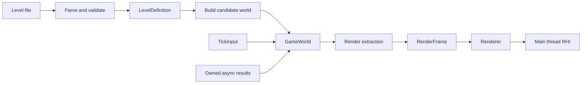

# Game world architecture

Status: Proposed. Architecture only; the world, level loader, component pools,
tick driver, and render extraction described here are not implemented.

This design gives Ludus's first game a readable path from level data to gameplay
and pixels. The selected architecture is a game-owned world with typed component
pools, an explicit sequence of simulation phases, and a separate render snapshot.
The first implementation runs on the main thread. Parallel execution is a later
implementation choice under the same ownership and visibility contracts.

The proposal prioritizes shipping a small jam game, ordinary debugger use,
editable content, and predictable behavior. There is no universally best or
universally state-of-the-art engine architecture. Here, established techniques
provide safety and useful growth paths without requiring a general ECS framework,
fiber scheduler, or editor before the game can run.

## Read the design

| Document | Main question |
| --- | --- |
| [Level data](level-data.md) | How do authors describe a level and replace the active world safely? |
| [Entities and component storage](entity-world.md) | What identifies an entity and who owns its state? |
| [Frame and tick updates](frame-update.md) | When do input, gameplay, events, async results, and rendering take effect? |
| [Gems article review](game-world-gems-review.md) | Which chapters were read, which changes did they justify, and which techniques were deferred? |

The contracts in those documents are the proposed implementation baseline.
Illustrative types and function names are proposed API vocabulary, not existing
SDK entry points. Game examples use 2D movement; the ownership and scheduling
design also applies to 3D. The game genre, physics library, and rendering feature
set remain product choices.

## Existing Ludus constraints

The audit baseline is repository HEAD `9a71dd1`, inspected on October 2, 2026.
Existing unrelated working-tree edits are outside this proposal.

| Existing facility | Consequence for this design |
| --- | --- |
| [Smoke application](../../apps/smoke/application.cpp) | Reuse its explicit startup, polling, simulation, rendering, and shutdown pattern. Its current clamped variable-delta simulation is not the proposed fixed tick driver. |
| [Foundation containers](../../modules/foundation/containers/include/ludus/foundation/containers/array.hpp) | Use `Array<T>` and fallible growth operations; do not add `std::vector` or depend on a future allocator. |
| [Foundation math](../../modules/foundation/math/README.md) | Preserve its coordinate, angle, and numeric guarantees. Fixed ticks do not imply bit-exact floating-point simulation. |
| [Input action records](../../modules/input/include/ludus/input/actions.h) | Preserve `Pressed`, `Released`, and `Cancelled` semantics when bridging presentation frames to simulation ticks. |
| [RHI ownership contract](../../modules/graphics/rhi/README.md) | Keep all current RHI operations serialized on the main thread. |
| [Bounded public rendering](../decisions/0011-public-fullscreen-rendering.md) | The current fullscreen triangle API cannot render a general sprite or mesh world. World rendering requires a separate graphics feature slice. |
| [Memory proposal](../decisions/0008-memory-management.md) | Reserve and reuse current containers first. A world must not require the proposed memory module or frame arena to exist. |
| [Contributor guide](../../AGENTS.md) | C++23, no engine exceptions, explicit errors, Ludus primitive aliases, narrow headers, and the pinned validation workflow remain mandatory. |

Older milestone descriptions document earlier scope. They are not evidence that
current input, audio, math, or RHI functionality is absent.

## Ownership and data flow

`GameSession` owns the active world, pending level transition, tick clock, input
bridge, and presentation state. `GameWorld` owns its entity registry, component
pools, gameplay random streams, tick queues, and logical references to loaded
assets. The renderer owns GPU resources and their retirement. The platform owns
window and event operations. No service reaches into another owner's mutable
storage through a global singleton.

An authored level is an initial condition. A live world contains changing state.
A render frame contains the values required to draw one presentation frame.
Saving a level must not serialize velocities, runtime handles, worker jobs, GPU
objects, or incidental presentation state.

The game owns the composition of its world and the update sequence. Ludus supplies
reusable identity and storage primitives. There is no engine-wide roster of
enemy types, gameplay system registry, mandatory entity superclass, or automatic
per-entity `Update()`/`Render()` dispatch.

Shared immutable entity definitions hold common configuration and logical media
references; component values hold each instance's changing state. A spawn kind
selects construction, while runtime interactions use explicit capabilities and
gameplay state. Animation frames do not determine damageability or attack timing.
Waiting gameplay uses tick deadlines and small state machines. Those mechanisms
sequence behavior on the owner thread; CPU jobs are a separate execution choice.

## Dependency boundaries

The proposed reusable module is `modules/gameplay/world`, exported as
`Ludus::GameplayWorld`. It contains `EntityId`, `EntityRegistry`, and the small
typed `ComponentPool<T>` facility. It depends on Base and Containers. It does not
depend on Platform, Input, RHI, Audio, Text, or game-specific component types.
Component types may themselves use explicitly included FoundationMath values.

The consuming game repository owns `GameWorld`, level schema and codecs,
spawn recipes, gameplay systems, and its renderer adapter. Initially the session
and tick driver also live there. Promote a driver into Ludus only after another
consumer demonstrates that its policies are reusable.

Rendering receives explicit draw descriptions and asset references. It never
imports enemy AI or reads the active world during submission. Input is translated
into a game-owned `TickInput` before gameplay runs. Audio receives game-produced
sound requests through its existing public API rather than reading components
from an audio callback.

Public identity/status headers remain small. Component storage templates contain
only necessary light includes; non-template allocation/error helpers stay behind
implementation boundaries where practical. No public header includes private
`internal/` implementation headers or heavy standard-library facilities. Run the
existing header self-sufficiency and build-budget gates when implementing this
module. The diagrams describe ownership, not permission to add dependency cycles.

## Selected decisions and alternatives

These are Ludus design judgments informed by the sources below. They are not
performance claims about an implementation that does not yet exist.

| Decision | Why selected | Alternative and revisit condition |
| --- | --- | --- |
| Typed pools and a game-owned aggregate | State and its consumers are visible in C++; no reflection or query language is required. | An established ECS library when measured queries, composition changes, or tooling justify its integration cost. |
| Sparse lookup with dense component values | Direct entity lookup and compact iteration with a small storage algorithm. | Slot-aligned optional records if measured simplicity wins for a tiny fixed roster; archetypes if multi-component iteration dominates. |
| Flat level instances and explicit references | Easy text editing, validation, and loading with no inherited override resolution. | Prefabs when repeated authoring becomes a demonstrated maintenance problem. |
| Explicit fixed-tick phase sequence | Ordering is reviewable and breakpoints follow normal calls. | A declared task graph when independently useful workloads need overlapping execution. |
| Deferred structural changes | Iteration and entity lifetime have known boundaries. | Additional named commit boundaries only for a concrete same-tick gameplay need. |
| Main-thread world mutation and RHI use | Matches current APIs and keeps the reference execution simple. | Worker jobs for isolated measured work; render threading only after an explicit RHI ownership change. |
| Render extraction | Drawing cannot mutate gameplay; later threading has an ownership boundary. | Direct world reads only if a measured extraction cost warrants a revised lifetime contract. |
| Local typed events and ordinary calls | Causality can be followed in source and traces. | A broader event service only when several consumers need a shared protocol with specified timing. |

Transform parenting, streaming, networking, save-game schemas, arbitrary scripting,
runtime component registration, and a general GPU render graph are separate
features. UI may use its own hierarchy. A hierarchy for authoring, a spatial index
for collision, and a CPU task graph solve different problems; none should become
the mandatory representation of the entire world.

## Debugging contract

The minimum useful tools are ordinary structured logs, phase profiling, a world
inspection function, and pause/single-tick controls. They require no graphical
editor. An entity inspection reports world identity, slot, generation, authored
ID when present, component membership, and gameplay state. Storage order must not
be mistaken for gameplay identity.

Trace a tick with its tick number, phase, command sequence, event type, entity IDs,
and accepted background request IDs. Add counters for entity/pool occupancy,
queue high-water marks, dropped presentation requests, rejected stale results,
discarded simulation time, and extraction time. Keep capture bounded and optional.
Use Ludus logging/profiling; diagnostics must not become a failure source.

AI inspection reports its named action/phase, target, wake tick, pending request,
and cancellation reason. Timer traces include due tick and delivery order. When
jobs are introduced, also measure dispatch/queue time, useful execution time,
blocked dependencies, and critical-path duration. An elapsed-time profile guides
optimization; it must not silently decide which authoritative entities skip a tick.

An optional debug overlay extracts collider bounds, contact points, AI targets,
and entity labels as diagnostic draw values. It follows the same render ownership
boundary and reads the inspected completed tick; gameplay never issues RHI calls
to draw its own diagnostics. This makes phase/state inspection useful visually
without requiring a general editor.

A headless simulation test runs the same tick functions as the game. A replay
records the level revision, build/content identity, initial random seed, per-tick
input, and accepted external results with their application tick. This supports
same-build debugging. Cross-platform bit-exact replay and network lockstep are
not promised. Pause and step semantics are specified in [Frame updates](frame-update.md).

## Implementation sequence

| Slice | Deliverable | Acceptance evidence |
| --- | --- | --- |
| 1 | Entity registry and typed component pools | Stale/cross-world handles fail; pool swap removal preserves lookup; fallible insertion leaves membership unchanged. |
| 2 | One compiled level definition and explicit spawn recipes | Create a headless world, inspect it, restart it, and prove old handles are rejected. |
| 3 | Tick driver and a small gameplay loop | Run movement, collision, and one interaction; test input edges, event timing, and spawn/destruction timing. |
| 4 | JSON level codec and candidate-world loading | Round-trip the example; invalid content and injected allocation failures leave the active world intact. |
| 5 | Render extraction and a minimal game renderer | Draw the actual scene using a separately validated graphics slice; skipped frames leave simulation valid. |
| 6 | Jam gameplay and debug controls | Demonstrate play, pause, single tick, restart, focus loss, browser suspension, and useful diagnostics. |

Each slice can be reviewed independently. Do not build a generic editor, prefab
resolver, worker pool, or scheduler as a prerequisite for slice 2. Background
loading can initially use nonblocking platform operations or bounded incremental
work. A synchronous load is acceptable on an explicit native loading screen;
browser callbacks must still return promptly.

For code implementation, apply the full contributor gates: warning-clean native
builds, appropriate tests, ASan/UBSan, pinned format/tidy, include/header gates, and
installed-SDK consumer validation. Add browser build and hosted acceptance for the
game path. This documentation change makes no claim that those new features have
passed their future implementation gates.

## Evidence and limits

Sources were checked on October 2, 2026. They support particular techniques, not
the claim that this entire architecture is optimal.

The [Gems review](game-world-gems-review.md) records twelve chapters selected from
the local `references/game-dev-gems-toc.md` catalog and read in their source
volumes. It adds definition/instance separation, lifecycle and timer contracts,
inspectable AI sequencing, and future concurrency safeguards. Historical sample
code is not adopted as a current C++23 implementation.

- Flecs documents generation/version tracking for recycled entity IDs. Ludus adds
  an explicit world identity to prevent cross-world aliasing.
  [Flecs entity identity](https://www.flecs.dev/flecs/EntitiesComponents.html).
- EnTT documents independent sparse-set component storage and systems expressed
  as ordinary functions. Ludus selects a smaller explicitly owned pool roster;
  this is evidence for the pattern, not a decision to depend on EnTT.
  [EnTT design](https://skypjack.github.io/entt/md_docs_2md_2entity.html).
- Flecs stages structural operations so component arrays remain safe to iterate;
  Unity documents recording structural operations and playing them back later.
  Ludus selects a small, explicit commit boundary without adopting either ECS.
  [Flecs staging](https://www.flecs.dev/flecs/Systems.html),
  [Unity entity command buffers](https://docs.unity3d.com/Packages/com.unity.entities@1.3/manual/systems-entity-command-buffers.html).
- Godot recommends focused scenes with explicit external dependencies. This
  informs the game session's ownership and explicit reference binding; it does
  not establish a need for Godot's node model in Ludus.
  [Godot scene organization](https://docs.godotengine.org/en/stable/tutorials/best_practices/scene_organization.html).
- Fixed-step accumulation, bounded catch-up, and render interpolation follow
  established simulation practice. Specific timing policies below are Ludus
  choices. [Fix Your Timestep](https://gafferongames.com/post/fix_your_timestep/).
- Browser pthreads require deployment support and restrict blocking on the main
  browser thread. Keep a serial browser build as the first delivery target.
  [Emscripten pthreads](https://emscripten.org/docs/porting/pthreads.html).

No new third-party dependency is selected by this proposal. Selecting a JSON
parser or ECS library requires checking its pinned version, licensing, browser
support, and exception-free failure behavior. The gameplay data contracts do not
depend on that choice.
