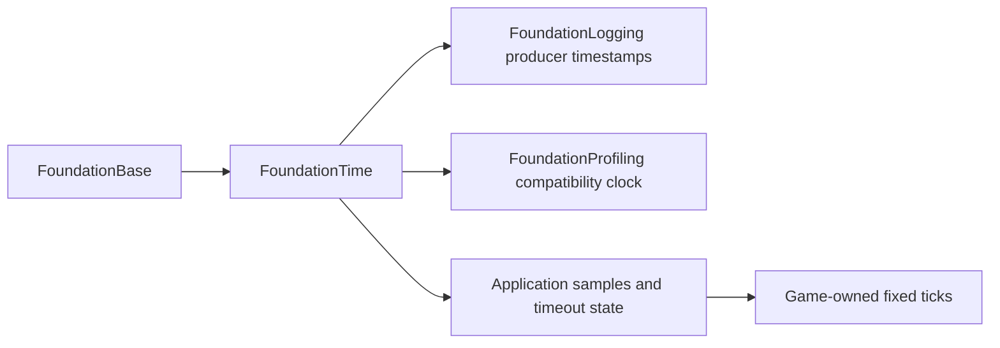

# High-resolution time

Status: FoundationTime implementation slice; simulation and scheduling extensions
below are proposed. Reviewed October 4, 2026. See [ADR 0017](../decisions/0017-foundation-time.md).

## Goals and independent baseline

Time should be precise at long uptime, inexpensive to read, and easy to inspect.
The implementation should have ordinary value ownership, explicit failure and
small public headers. The initial design, written before reviewing the catalog,
selected a shared monotonic source, distinct integer timestamps and durations,
checked arithmetic, owner-local elapsed-time state and explicit frame samples.
The article review below strengthened frame sampling and future scheduling
contracts without changing that baseline's backend or dependency direction.

Keep these domains separate:

| Domain | Representation and owner | Meaning |
| --- | --- | --- |
| CPU measurement and real-time timeout | FoundationTime `Timestamp`/`Duration` | A monotonic interval within this process/domain. |
| Simulation | Game-owned `uint64` completed tick and tick rate | Authoritative gameplay, pause, single step and replay. |
| Frame/presentation | Application-owned `FrameClock` and copied `FrameSample` | Once-per-frame accepted delta and discarded stall time. |
| UTC | Logging's private system-clock anchor | Human-readable labels; never deadline arithmetic. |
| Audio | Device/sample position | Audio scheduling follows the device timeline. |
| GPU | RHI query and explicit CPU/GPU calibration | CPU clock reads cannot substitute for GPU elapsed time. |
| Network | Protocol-owned synchronized/estimated clock | Never compare another machine's CPU timestamp directly. |

## One clock and small value types

`Ludus::FoundationTime` depends only on FoundationBase. Base does not depend on
Time. Logging links Time privately; Profiling uses it for its existing timestamp
entry point. Installed SDK metadata registers FoundationTime. `core.h` remains
unchanged: a consumer explicitly includes Time when naming its vocabulary.

Arrows show dependency availability, not execution order. The public `time.hpp`
and `timers.hpp` contain only aliases, plain values, declarations and small
non-template accessors. Platform headers and `<chrono>` stay in `.cpp` files.
Everything is `noexcept`; failures return `TimeStatus`. There is no allocator,
registry, service initialization/shutdown, virtual dispatch, clock override,
calibration thread, engine lock or shared mutable timer state.

Native `NowTicks()` uses `std::chrono::steady_clock` converted to integer
nanoseconds, preserving the existing profiling/logging epoch. The
[C++ steady-clock contract](https://eel.is/c++draft/time.clock.steady) requires a
steady, non-decreasing source. The pinned Linux standard library delegates to
the OS monotonic clock. Retain this proven backend until a representative profile
shows that clock reads materially limit performance. Windows/macOS-specific
backends are future supported-platform work, not validated by this Linux PR.
Microsoft recommends [QPC rather than direct TSC reads](https://learn.microsoft.com/en-us/windows/win32/sysinfo/acquiring-high-resolution-time-stamps)
and documents cross-thread tick uncertainty, frequency stability and integer
conversion hazards. Do not add raw TSC, frequency polling, core affinity or a
global atomic clamp to this architecture without measured evidence and a complete
migration/ordering contract. A clock timestamp is not a synchronization primitive;
use sequence numbers and actual happens-before edges for causal event order.

Browser `NowTicks()` preserves `emscripten_get_now()` from the pinned 4.0.23 SDK.
Its main-thread implementation uses `performance.now()`; integer conversion
cannot recover precision removed by browser privacy settings. Verified against
`src/lib/libcore.js` in the local SDK and the
[Emscripten API](https://emscripten.org/docs/api_reference/emscripten.h.html#c.emscripten_get_now).
Nanoseconds are the storage unit, not a claim of nanosecond resolution or read
latency. This slice targets the current main-thread browser engine. AudioWorklet,
separate worker origins, pthread synchronization and GPU/audio clocks require
separate contracts before expanding support.

`Timestamp` and `Duration` each hold one `uint64 Nanoseconds`, with no implicit
conversion between them. `TryElapsed(start, end, out)` subtracts integers before
`ToSeconds(interval)` converts the small result to `float64`. No API converts an
absolute timestamp to floating seconds. `TryAdd` and `TryElapsed` use
FoundationBase's opt-in checked integer helpers. `TryAdd` rejects overflow;
reversed samples return `ClockRegression`. Failed operations leave outputs unchanged;
zero is an ordinary timestamp/interval, never a sentinel. Unsigned intervals do
not model negative offsets. UTC anchoring uses its own signed private delta.

The representation can hold about 584 years of nanoseconds, but this is not a
backend-uptime guarantee: native signed durations may have a smaller range. Do
not persist clock epochs across sessions, infer UTC from them or treat wrap as a
normal recovery policy. There is no timestamp ABI change to existing trace or
breadcrumb records: `profiling::NowTicks()` remains a compatibility wrapper and
its denominator remains one.

## Elapsed-time state and failure behavior

Each helper is an allocation-free owner-local value; synchronization, if shared,
is the caller's responsibility. Supply the same explicit `Timestamp` to all
helpers in one update. Tests can use synthetic samples without a global mock,
OS sleep or a virtual time-source hierarchy.

| Helper | Contract |
| --- | --- |
| `Stopwatch` | `Start` begins a new interval; `Pause` accumulates active time; `Resume` excludes the paused gap; `Reset` stops it. Invalid transitions and reversed transition samples preserve state. `Read` preserves its output on failure. A paused read returns frozen time. |
| `Deadline` | Checked `Arm(now, delay)` preserves an existing deadline on overflow. Zero delay expires immediately, equality counts as due, expiration remains armed, and `Cancel` changes an explicit flag. It executes no callbacks. |
| `FrameClock` | First sample establishes a baseline and returns zero; accepted samples report `Elapsed` and `Discarded`; stalls advance the baseline even when clamped. Reset drops suspension/startup history. A backwards sample returns zero and retains the previous high-water mark. Equal readings are valid. |

Stopwatch reads are observational: they validate against the latest transition,
not the previous read. Callers must supply a monotonic sequence from one domain.
FrameClock tracks every accepted sample and therefore rejects recovery below its
high-water mark. Maximum accepted frame delta is supplied by the application;
zero deliberately freezes accepted time. Clamping is never applied to profiling
or real-time deadlines. Long loads, debugger stops and hidden browser intervals
must be visible in raw diagnostics even if simulation discards them.

## Frame and simulation integration

Read one timestamp at the presentation callback boundary. Pass the resulting
sample through presentation and the simulation driver. Sample profiling scopes
independently, since their purpose is to measure actual work inside that frame.
Reset frame and simulation debt on startup, pause/resume, visibility suspension
and session replacement. Lifecycle signals, rather than the backend's treatment
of OS sleep, define whether a suspended game catches up. On Linux,
[CLOCK_MONOTONIC excludes suspended time](https://man7.org/linux/man-pages/man3/clock_gettime.3.html);
other clocks may include it. Do not promise uniform suspend behavior from the
measurement API.

The first slice leaves the existing [fixed-tick driver](frame-update.md) in place:
60 Hz by default, 250 ms clamp, four catch-up ticks and explicit discarded time.
It inherits the shared source through Profiling. Do not clamp twice or lose its
existing discard accounting when migrating it to FrameClock in a later PR.

A future integer fixed-step driver should retain a rational phase rather than
rounding `1e9 / rate` to a nanosecond tick length. Accumulate `elapsed_ns * rate`
in checked `uint64` phase units; one tick consumes exactly `1e9` phase units.
Carry the remainder, bound catch-up, and report discarded whole ticks and the
initial frame clamp separately. Validate the multiplication/addition bound at
configuration. At 60 Hz, 1 second must produce exactly 60 ticks regardless of
frame partitioning. Increment the completed tick only after a successful tick;
exhaustion stops the session. Derive interpolation alpha from the remainder.
Keep simulation time scaling explicit and rational, with an overflow policy and
replay metadata, if a game actually requires it. Do not build a timer hierarchy
or floating-point scale controls speculatively.

## Future scheduling and frame pacing

Most gameplay cooldowns remain checked tick deadlines on their owning component.
A future bounded typed queue follows [the established gameplay contract](frame-update.md#timers-and-decision-cadence):
owner-thread mutation; `(DueTick, Sequence)` ordering; snapshot due records at
BeginTick; validate target world/entity generation and cancellation at delivery;
minimum one-tick delay for scheduling during dispatch; no recursive queue drain.
Use generation-checked handles and bounded copied payloads. World replacement
clears the queue. Overflow and deadline/sequence exhaustion are explicit faults
for authoritative gameplay. Periodic deadlines advance from their previous due
time to avoid drift; specify skip/coalesce/bounded catch-up behavior when late.
The policy cannot silently depend on a measured CPU budget.

Start with a contiguous bounded scan at demonstrated small counts. Compare it
with an indexed min-heap only when queue-size and due-density measurements justify
it. Timing wheels require a documented granularity and horizon. No callback
registry, worker per timer, dynamic allocation on dispatch or thread sleep belongs
in FoundationTime. A real-time async timeout service would need a separate
ownership/cancellation/shutdown contract and would use CPU timestamps, not game
entity tick deadlines.

Frame pacing belongs to Platform/RHI/application policy. Prefer presentation
callbacks on browsers; never busy-wait there. Native pacing may use an absolute
monotonic target and an OS wait, rechecking after an early wake or interruption.
Advance targets from the prior target to avoid relative-sleep drift and reset
missed schedules after a bounded lateness policy. A measured optional short spin
must have a strict budget and power policy. High-resolution measurement does not
imply precise wakeups. Queue depth and GPU completion remain graphics policies.

## Gems review and design changes

Selection used the local `references/game-dev-gems-toc.md`. Chapters were read in
full: scanned GPG3/GPG4 pages were rendered and OCRed; GEG1 text was extracted.
The clock chapter's diagrams were checked visually. No CD-ROM implementation was
available or copied. Historical performance statements are not current benchmarks.

| Article | Author and pages | Adaptation to the independent baseline |
| --- | --- | --- |
| GPG4 1.3, The Clock: Keeping Your Finger on the Pulse of the Game | Noel Llopis; printed 27-34, PDF 44-51 | Strengthened the one-sample-per-frame contract, independent pause state, synthetic time injection, and explicit stall accounting. |
| GPG3 1.1, Scheduling Game Events | Michael Harvey and Carl S. Marshall; printed 5-14, PDF 7-16 | Made real/simulation domains, periodic phase and equal-deadline ordering explicit in the future queue contract. |
| GEG1 25, A Basic Scheduler | John Bolton; printed 409-414, PDF 437-442 | Reinforced owner-thread execution, separating due-set discovery from delivery and removal, and measuring scan versus ordered structures. |

Llopis separates a physical source from manipulable timers and stabilizes all
frame observations after FrameStep. Ludus adopts those semantics through supplied
value samples instead of a virtual source/registered timer object graph. Integer
intervals retain long-uptime precision. The chapter's averaging is useful for a
labeled presentation metric, but is excluded from simulation debt, deadlines and
raw tracing because it redistributes hitches. Its frame cap becomes explicit
accepted/discarded output. Vsync queue management remains an RHI concern.

Harvey/Marshall distinguish real and virtual time, specify scheduled phases and
identify events through registrations. Ludus preserves fixed gameplay ticks and
adds stable tie/cancellation contracts rather than arbitrary subframe simulation
callbacks. Subdividing a coarse clock does not increase its physical accuracy.
CPU-budget-driven adaptive gameplay cadence would undermine replay and is
excluded; optional cosmetic work may have a separately documented budget.

Bolton's serial scheduler separates discovering due work, execution and cleanup.
Ludus uses that ownership principle for a future bounded typed queue, with
explicit overflow and generation checks. Its arbitrary task ordering and reset
of a recurring period from delivery time are unsuitable for deterministic ties
and drift-free periodic phase. Container choice remains a measured decision.

Relevant earlier profiling reviews remain in
[the profiling literature review](profiling-literature-review.md): absolute
single-precision timestamps lose interval precision, and diagnostic smoothing
must stay separate from retained timing evidence.

## Verification and implementation scope

This PR implements Time, checked arithmetic, stopwatch, deadline and frame
sampling; migrates logging/profiling producers; and adds native unit, installed
SDK and pinned web semantic/header coverage. It does not implement the future
queue, pacing, rational fixed-step replacement, scaling, GPU or network clocks.

Boundary tests cover max-value overflow, output preservation, zero/equal/reversed
samples, one-nanosecond intervals at a large epoch, lifecycle failures, independent
pause state, deadline equality/cancellation and exact stall discard accounting.
A concurrent-read test records worker failures without calling Catch assertions
from workers. Native and web compatibility tests check the shared epoch/units.
The installed consumer exercises only public headers and exported symbols.

Use the pinned warning-clean builds, full unit/contract tests, ASan/UBSan,
format/tidy, browser semantics and installed-SDK verification. Measure release
clock-read cost against the prior direct steady-clock implementation and inspect
symbols for allocator/lock dependencies. These measurements describe this host;
they are not nanosecond-resolution or portable latency guarantees. See
[validation evidence](../development/high-resolution-time-evidence.md).

## Implementation before research

Recorded October 6, 2026. Implement and validate the initial architecture before
starting the conference/journal improvement pass below. The shared clock and
owner-local helpers already exist; the next work integrates those values into
application, simulation and presentation owners. Preserve the contracts above
and [ADR 0017](../decisions/0017-foundation-time.md) as the implementation baseline.

| Stage | Work before the improvement pass | Completion evidence |
| --- | --- | --- |
| FoundationTime slice | Retain the shared source, checked arithmetic, stopwatch, deadline and frame helpers; document changed public APIs beside their declarations. | Existing native/browser semantic tests and installed-SDK coverage; updated Doxygen coverage for any changed API. |
| Frame integration | Migrate application loops to one explicit frame sample and wire lifecycle resets using the existing frame/simulation contract. | Integration tests for startup, pause/resume, visibility and session replacement, clock regression and accepted/discarded time; no duplicate clamp. |
| Integer simulation driver | Implement the rational phase accumulator described above, including checked configuration, catch-up bounds, interpolation and exhaustion. | Partition-independent tick/remainder accounting when no time is intentionally discarded, exact 60 Hz accounting over one second, explicit clamp/catch-up loss and failure tests. |
| Pacing and inspection | Implement the agreed native pacing policy under Platform/RHI/application ownership; define runtime timing telemetry and the proposed editor Timing view under their existing owners. | Reproducible target/wake/presentation measurements, interruption/lateness and lifecycle tests; runtime-reported intervals/status across the editor process boundary. |

The bounded gameplay queue, time scaling and additional clock domains remain
conditional extensions. Establish their requirements and ownership before
including them in a delivery milestone. Reading a timer-queue paper does not
make a wheel necessary, and a PREEMPT_RT result does not establish a desktop
wake-up guarantee. Platform/API checks needed for the initial implementation
remain part of that work; this sequence defers the broader improvement study.

At the implementation gate, record the revision, supported backends, toolchain,
workloads, reproduction commands and measurements in the
[validation evidence](../development/high-resolution-time-evidence.md). Complete
the relevant warning-clean builds, unit/integration tests, sanitizers,
format/static analysis, browser semantics, SDK and documentation checks. These
results become the comparison baseline for research trials.

## Conference and journal research backlog

The following sources were screened through venue/session metadata, abstracts
and available introductory material when recommended. Full readings and talks
are **Queued**; none has a completed Ludus experiment or adoption record. This
list is continuing research context, not a claim that their designs have already
informed the implementation. Preserve the completed Gems review above separately.

### Initial readings

| ID / priority | Source | Ludus question and proposed experiment |
| --- | --- | --- |
| HR-01 / First | Alen Ladavac, **Advanced Graphics Techniques Tutorial: The Elusive Frame Timing: A Case Study for Smoothness Over Speed**, GDC 2018. [Session](https://www.gdcvault.com/play/1025407/Advanced-Graphics-Techniques-Tutorial-The). | Which presentation effects create uneven visible frame intervals? Compare the implemented pacing baseline with bounded alternatives using CPU timing, presentation intervals, queue depth where available and latency measurements. |
| HR-02 / First | Tomas Kalibera and Richard Jones, **Rigorous Benchmarking in Reasonable Time**, ACM ISMM 2013, pp. 63-74, DOI [10.1145/2464157.2464160](https://doi.org/10.1145/2464157.2464160). [Corrected author manuscript](https://kar.kent.ac.uk/33611/). | How much repetition is needed for a reliable clock-read or pacing comparison? Identify variation between builds, executions and iterations; report effect-size confidence intervals rather than a favorable median alone. |
| HR-03 / First | Daniel Bristot de Oliveira, Daniel Casini, Rômulo Silva de Oliveira and Tommaso Cucinotta, **Demystifying the Real-Time Linux Scheduling Latency**, ECRTS 2020, pp. 9:1-9:23, DOI [10.4230/LIPIcs.ECRTS.2020.9](https://drops.dagstuhl.de/entities/document/10.4230/LIPIcs.ECRTS.2020.9). | What causes wake-up lateness under load? Trace relevant delays and compare requested targets with actual execution. Separate measured desktop behavior from the paper's PREEMPT_RT assumptions and formal bounds. |
| HR-04 / Queue requirement | George Varghese and Anthony Lauck, **Hashed and Hierarchical Timing Wheels: Efficient Data Structures for Implementing a Timer Facility**, IEEE/ACM Transactions on Networking 5(6), 1997, pp. 824-834, DOI [10.1109/90.650142](https://doi.org/10.1109/90.650142). [Paper](https://www.cs.columbia.edu/~nahum/w6998/papers/ton97-timing-wheels.pdf). An earlier version appeared at ACM SOSP 1987. | At which queue sizes, due densities and cancellation rates would an ordered structure improve our bounded scan? Compare scan, indexed heap and, only with explicit granularity/horizon, a wheel while preserving deterministic delivery and capacity policies. |
| HR-05 / Virtualized workload | Timothy Broomhead, Laurence Cremean, Julien Ridoux and Darryl Veitch, **Virtualize Everything but Time**, USENIX OSDI 2010, pp. 451-464. [Paper and session](https://www.usenix.org/conference/osdi10/virtualize-everything-time). | How do virtualized environments affect clock access and interval measurements? Test supported VM workloads and distinguish timestamp access latency, monotonicity and timeout behavior from synchronized wall-clock or migration guarantees. |
| HR-06 / Benchmark companion | Todd Mytkowicz, Amer Diwan, Matthias Hauswirth and Peter F. Sweeney, **Producing Wrong Data Without Doing Anything Obviously Wrong!**, ACM ASPLOS 2009, pp. 265-276. [Publication](https://research.ibm.com/publications/producing-wrong-data-without-doing-anything-obviously-wrong). | Could setup or execution order bias a claimed improvement? Design controlled comparisons and evaluate setup randomization and repeated independent executions alongside HR-02. |

Search GDC for frame timing and presentation experience, ECRTS for scheduling
latency, ISMM/ASPLOS for measurement methodology, Transactions on Networking for
timer-queue structures, and OSDI for clock behavior in systems environments.
[Real-Time Systems](https://link.springer.com/journal/11241/aims-and-scope) is an
additional journal to screen for scheduling and timing analysis; no specific
article from it has been selected yet. Record the scope/date of each archive
search and add only papers relevant to a concrete Ludus question.

### Review and trial records

Use **Queued**, **Reading**, **Reviewed**, **Trial planned**, **Trial complete**,
**Adopted**, **Deferred** or **Rejected**. Update each source's status as work
advances. A metadata or abstract screen is not a full review; a proposed
experiment is not a measured gain.

For each completed review or trial, record:

1. Source ID, review date and exact sections/pages or talk timestamps consulted.
2. The relevant idea, assumptions, evidence and limitations, and the difference
   from the current Ludus contract; distinguish inspiration from adapted code.
3. A testable hypothesis, affected owner/module and bounded prototype.
4. Baseline revision, supported backend/toolchain, workload, seeds where relevant
   and reproduction commands; keep generated captures in ignored `out/`.
5. Before/after results: clock-read cost and uncertainty, wake-up lateness and
   frame interval distributions, CPU/power cost where measurable, allocations
   and queue bounds as relevant. Include overload, interruption, lifecycle,
   overflow/regression and determinism checks for the affected behavior.
6. Adopt/defer/reject decision and rationale, with links to evidence, the PR and
   any architecture/ADR changes. Credit consulted sources near affected code.

Retain exception-free APIs, allocation-free timer values, explicit failure and
separate CPU/simulation/presentation domains in every trial. Backend replacement,
raw TSC, smoothing, spinning or a more complex queue requires relevant
measurements and an explicit contract review before adoption.
