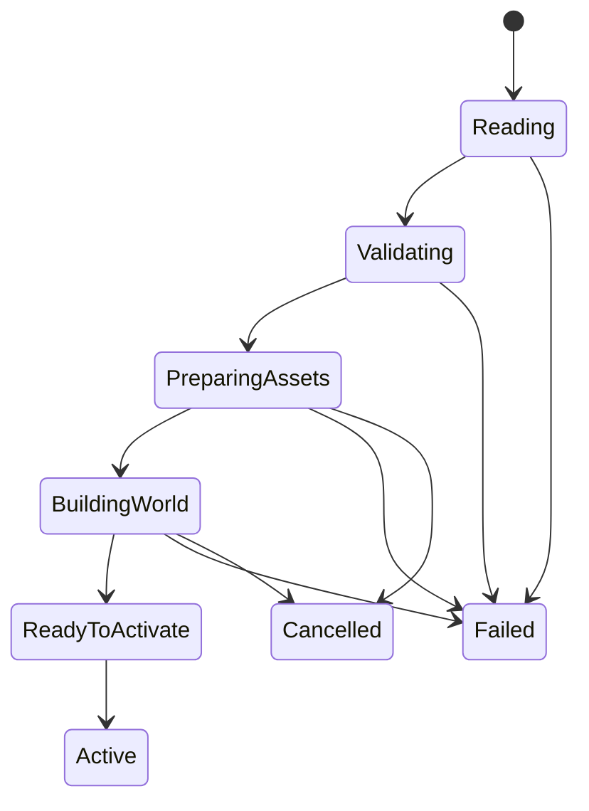

# Level data and loading

Status: Baseline implemented. Part of the [game world architecture](game-world.md).
See [the reference guide](../examples/world-demo.md) for the concrete API,
bounds and policies; conditional extensions in this document remain proposed.

A level describes initial content. Loading validates that content and builds a
candidate world before replacing the active world. Authors work with a small,
versioned JSON document; runtime gameplay works with typed data, not JSON nodes or
string lookups.

## Definitions and ownership

| Term | Meaning |
| --- | --- |
| Level file | Editable source content committed with the game. |
| `LevelDefinition` | Validated, owned, typed initial data independent of the parser buffer. |
| Spawn recipe | Game-owned code that constructs the required components for one declared kind. |
| Entity definition | Immutable game-owned common configuration and logical media references, shared where instances use the same settings. |
| `GameWorld` | Live state instantiated from the definition under a new world identity. |
| Asset manifest | Game-owned mapping from stable logical asset keys to packaged files. |

Definitions are immutable while in use. A restart rebuilds initial state from the
definition and resets random streams to the selected initial seed. A save game
would require a separate schema for live state; writing a level file does not
save a running session.

Start with one level file and one asset manifest. Do not require an asset database,
reflection system, binary cooker, or scene editor. When repeated entity settings
become painful, introduce simple flat spawn templates in a separate change before
considering nested inheritance or override patches.

Sharing runtime definitions does not require a prefab authoring framework. Start
with typed constants or a small flat definition table owned by the game. Keep
common settings such as maximum health, attack periods, and animation/asset
descriptions there when useful; keep current health, cooldown deadlines, position,
and action phase in instance components. A per-instance override is validated and
resolved during loading, rather than applied through JSON lookup during a tick.
The illustrative schema below remains version 1; a separate editable definition
format is deferred until the game needs it.

Use a typed definition ID resolved against the world's pinned immutable catalog
revision. Its storage/leases outlive every world or presentation record using it.
Hot reload publishes a replacement catalog with a replacement world; it does not
mutate definitions being read by a worker or a live instance. This takes the
shared-data lesson from the [factory and component chapters](game-world-gems-review.md#composition-and-level-construction)
without adopting their class hierarchies or singleton managers.

## Initial content schema

The following is a complete illustrative version 1 document for a small 2D game.
Its kinds and properties belong to that game. Ludus does not define `player`,
`enemy`, or `exit` as built-in entity types.

```json
{
  "version": 1,
  "id": "first-room",
  "seed": 42,
  "settings": {
    "bounds": { "min": [-12, -7], "max": [12, 7] },
    "camera": { "center": [0, 0], "vertical_extent": 14 }
  },
  "collision": [
    {
      "id": "floor",
      "shape": "box",
      "center": [0, -4],
      "half_extent": [10, 0.5]
    }
  ],
  "entities": [
    {
      "id": "player-start",
      "kind": "player",
      "transform": { "position": [-6, 0], "rotation": 0, "scale": [1, 1] },
      "properties": { "speed": 4, "health": 3, "sprite": "player" }
    },
    {
      "id": "guard-a",
      "kind": "enemy",
      "transform": { "position": [2, 0], "rotation": 0, "scale": [1, 1] },
      "properties": { "speed": 2, "health": 2, "sprite": "guard", "target": "player-start" }
    },
    {
      "id": "exit-a",
      "kind": "exit",
      "transform": { "position": [8, 0], "rotation": 0, "scale": [1, 1] },
      "properties": { "half_extent": [0.5, 1], "next_level": "second-room" }
    }
  ]
}
```

Only version 1 is accepted initially. The root keys shown above are required.
Each entity requires `id`, `kind`, `transform`, and the properties required by its
kind. Each game kind has a small explicit decoder and validator. Unknown keys
are rejected at every object boundary so misspellings cannot silently change
behavior. Optional properties, if introduced, have defaults documented in their
decoder and are emitted explicitly by the writer.

Use FoundationMath conventions: +X right, +Y up, angles in radians. The example
game chooses meters as its world distance unit; its asset configuration declares
pixels per meter. Camera `vertical_extent` is the full visible world height.
Screen-coordinate conversion belongs to input/presentation code. Scale components
must be positive in version 1; mirror sprites through an explicit visual property
if needed. Bounds must have strictly ordered minima/maxima, extents must be
positive, and all numeric values must be finite and within game-defined limits.

`seed` is an unsigned 64-bit integer. A game's stream selectors are named constants
in code. Content does not select simulation rate, update order, runtime capacities,
backend objects, or executable script names. These are application policies.

Static collision primitives belong to level geometry, not to the entity registry.
Turn a primitive into an entity only when it needs identity or mutable behavior,
such as a moving platform or destructible wall. A tile-map game can replace or
extend this geometry section with an explicit tile layer schema; it need not
represent every tile as an entity.

## Authored identity and references

Level and entity IDs are stable human-readable strings using lowercase ASCII
letters, digits, and hyphens. They must be nonempty and unique in their scope.
An authored entity reference is a local entity ID; it never contains a runtime
slot, generation, pointer, or world identity. The loader resolves all local
references in a second pass, so forward references work and array order does not
change reference meaning.

`target` in the example requires an entity produced by the player recipe.
Validators check the required capability as well as the existence of the name.
Only explicitly nullable fields may omit a target; a broken required reference
rejects the candidate. Runtime-spawned entities need not have authored IDs.

`kind` selects a spawn recipe. Gameplay then tests the capabilities and state
that a rule needs: for example, damage requires health and an eligible team/state,
not an entity's recipe name or currently displayed animation. A visual change
cannot accidentally grant invulnerability. Required recipe bundles and reference
capabilities are validated before activation.

Sprites and other assets use logical manifest keys, not absolute paths or GPU
handles. `next_level` names an entry in the packaged level catalog. The build or
content validation tool checks those entries even when the next level is not
currently loaded. Asset and level keys must not enable traversal outside the
configured content roots.

Name resolution is cold-path work. A temporary sorted table or private map is an
implementation choice; do not retain hash/string lookup in movement or rendering.
Keep the authored-ID mapping for inspection and authoring diagnostics.

## Validation and authoring errors

Parsing and validation return a status and a bounded diagnostic record, including
source file, property path, and line/column where the chosen parser provides them.
The bounded reference codec currently returns an error code and byte offset;
file/path context and richer editor diagnostics are future tooling work.
For example, a future editor can show: `first-room.json entities[1].properties.target: unknown entity
'player-strat'`. Ordinary malformed content is not an assertion failure.

Reject duplicate JSON object keys, duplicate IDs, unknown versions/kinds/fields,
wrong scalar types, invalid ranges, missing required assets, and unresolved or
incompatible references. Required content limits include file bytes, nesting,
string bytes, entity count, geometry count, and maximum references. Version 1
has no recursive prefab expansion. Set concrete limits in the game configuration
and include their observed high-water marks in diagnostics.

The parser must support explicit error reporting without engine exceptions. Own
all surviving strings and values before releasing its source buffer. Avoid a
public dependency on parser types. Selecting and pinning the parser is an
implementation prerequisite, not an implicit dependency added by this document.

The writer uses a fixed root/property order, stable authored-ID ordering, ordinary
indentation, and finite round-trip numeric formatting. JSON comments are not
supported. A content edit should produce a readable diff and preserve the same
typed definition after write/read. File replacement uses a temporary file and
the platform's supported replacement mechanism; report write/replace failures
without damaging the previous source file.

## Candidate world loading



Every pending stage is cancellable. `ReadyToActivate` can also be cancelled before
publication. The diagram highlights common paths rather than every cancellation
edge. The active world remains owned and valid while a candidate is pending.
The game may pause play during loading; world replacement still happens only at
the frame boundary before simulation.

1. Read within configured limits and decode an owned `LevelDefinition`.
2. Validate all kinds, properties, references, and manifest keys.
3. Prepare required assets. Pending is a normal state; continue polling across
   frames. Optional assets may use explicitly defined placeholders. Required
   asset failure rejects the candidate.
4. Obtain a fresh world identity. Preallocate entity slots, component storage,
   command/event buffers, and extraction capacity to the configured active limits
   with fallible operations. Size sparse mappings for the full entity-slot limit.
5. Instantiate recipes in canonical authored-ID order. Each recipe creates a
   complete component bundle. No gameplay tick or callback runs during construction.
6. Resolve entity references and validate world invariants. Initialize previous
   and current presentation transforms to the same value.
7. At the next frame boundary, publish the candidate through a nonallocating
   ownership move. Reset clock debt and the input bridge; held controls must be
   released before gameplay re-arms them after a transition.

Construction may prepare owner-local resources, but it cannot emit gameplay
sounds, grant rewards, or register candidate entities with active-world services.
Initial activation effects, if needed, are emitted once by the session after
successful publication. Ordinary runtime spawn effects follow successful tick
commit. Cleanup of an abandoned candidate never invokes gameplay death behavior.

Failure in steps 1–6 releases candidate-owned resources and leaves the active
world unchanged. Allocation failure must use fallible `Array` operations rather
than the container's fatal growth API. Asset preparation has its own cleanup;
activation does not promise rollback of completed external I/O or shared-cache
warming. It does promise that no partially built candidate becomes playable.

Budget for the active world, candidate, parser storage, and prepared assets to
coexist during a transition. Check shared renderer/resource limits before
activation. If the candidate cannot fit that peak, reject it or use a separately
specified destructive unload/loading flow; do not silently weaken the promise
that failed candidate loading leaves the active world intact.

A newer load request supersedes the old transition token. Late callbacks carry
that token and can neither activate the old candidate nor write into the current
session. Publication invalidates the old world identity for gameplay and pending
async result application. Old render snapshots and asset leases retire through
their owners before GPU resources are released; world replacement must not invoke
unsafe immediate GPU destruction.

The first hot reload behavior is whole-level validation and restart. It does not
patch live components or preserve enemy state. A future editor can hold a mutable
authoring model and publish immutable definitions through the same path.

## Required verification

Use the same decoder/validator for development tools and packaged games. Test the
example and its forward references; malformed/duplicate fields; unsupported
versions; missing required assets; invalid numbers/limits; and writer round trips.
Inject failures at candidate allocation and recipe construction boundaries and
verify the active world remains unchanged. Supersede and cancel loads, restart
repeatedly, and confirm old callbacks/handles fail under ASan/UBSan.

Check that instances with shared definitions have independent mutable state;
rejected candidates emit no activation effects; and catalog replacement preserves
the lifetime of old presentation and worker inputs until their owners release them.

An installed-SDK sample should construct a compiled definition before the JSON
codec exists. This proves that world semantics do not depend on serialization.
Browser acceptance must exercise asynchronous preparation, suspension, and
returning to the browser event loop without waiting on worker completion.
