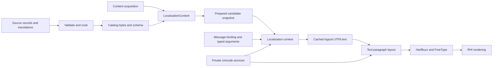

# Ludus Localization Architecture

**Status:** Architecture and implementation contract; the first static-text slice
is implemented by [Localization](../../modules/localization/README.md). Its
`ludus-static-utf8-v1` profile stores literal UTF-8, provides catalog leases and
exact bindings, and validates/cooks reviewed translations offline. Each successful
load requires rebinding; schema-compatible binding reuse remains future work.
ICU patterns, locale negotiation, context switching and paragraph integration
below describe subsequent phases. No throughput or complete language-support
claim is made. Original design baseline: `52e29ce`; initial implementation base:
`afe3b78`, with FoundationMemory/Strings now available.

Ludus should resolve stable message keys through immutable locale catalogs,
format complete messages with typed arguments, and rebuild presentation when its
inputs change. Keep linguistic algorithms, content acquisition, and text layout
behind separate interfaces. The main optimization is to avoid repeating work;
static text needs a checked table access, while dynamic text formats on change.

This is the final design after an initial architecture and subsequent reading
of relevant entries in `references/game-dev-gems-toc.md` (local reference index).
The [literature review](localization-gems-review.md) records what changed and what
was rejected. Choices below are Ludus engineering judgments. They follow
[AGENTS.md](../../AGENTS.md), [steering](../../.kiro/steering/coding-standards.md),
[ADR 0003](../decisions/0003-standard-library-usage-policy.md),
[foundational headers](foundational-headers.md), and the existing Content/Text
contracts. Source code establishes current capabilities.

## Decisions

1. Author readable, stable message keys. Keep identity separate from source
   wording, translated bytes, hashes, and runtime dictionary indices.
2. Translate complete messages with named, typed arguments. Each language owns
   its grammatical branches; every translation uses the same argument schema.
3. Ship literal UTF-8 first; start dynamic formatting with a bounded ICU
   MessageFormat 1 profile and private ICU4C services.
   Add MessageFormat 2 through a versioned codec when a suitable backend and
   translation workflow pass production gates.
4. Cook deterministic catalogs with checked offsets, readable key directories,
   argument schemas, and optional source provenance. Prepare dynamic formatters
   before the consuming view becomes visible.
5. Give each game session or local player an explicit localization context.
   Track text, subtitle, voice, and formatting preferences separately.
6. Publish immutable snapshots. Readers pin their revision; replacement and
   cancellation never invalidate borrowed data held by an existing reader.
7. Cache resolved presentation in its consumer. Keep shaping/layout caches in
   Text and asset caches in their existing owners.
8. Return explicit errors through `noexcept` Ludus APIs. ICU types and heavy
   headers stay private; ordinary diagnostics remain culture invariant.

The design deliberately has no runtime authoring parser, handwritten Unicode
rules, general expression VM, global immortal string pool, or service dependency
for displaying shipped text. More elaborate mechanisms need measured consumers.

## Current capabilities and module boundaries

| Repository evidence | Consequence |
| --- | --- |
| `modules/content/` owns bounded resource IDs, paths, byte acquisition, and explicit statuses | Reuse acquisition and identity rules through an adapter; extend supported resource kinds deliberately |
| `modules/text/` owns HarfBuzz shaping and FreeType rasterization | Preserve that owner and its generation-checked font/layout lifetimes |
| `FontSystem::ShapeRun` accepts one font, script, language, and explicit direction | Paragraph bidi, itemization, wrapping, and automatic font fallback remain additional work |
| `RunSpec::Language` currently has 16 bytes and describes truncation | A paragraph integration must introduce checked locale transfer; never silently truncate a localization tag into this field |
| Root CMake currently excludes Text from Emscripten until its dependency bootstrap exists | Native text exists; browser localization and browser text delivery are separate implementation gates |
| FoundationMemory and FoundationStrings now ship allocator domains, immutable shared bytes and UTF-8 validation | The static slice reuses these APIs; Unicode formatting remains separate |

Propose the following owners, all with public headers in `include/` and private
implementation in `src/internal/`:

| Owner | Responsibility | Dependencies |
| --- | --- | --- |
| `Ludus::Unicode`, `modules/foundation/unicode/` | Private ICU integration, locale canonicalization, reusable Unicode algorithms and formatting primitives | Base, Containers; ICU privately |
| `Ludus::Localization`, `modules/localization/` | Message schemas, prepared catalogs, resolution, typed formatting, snapshot lifetime | Static slice: Base, Memory, Strings; dynamic phases add Unicode and buffers |
| `Ludus::LocalizationContent`, `modules/localization/content/` | Source/cooked codecs, Content acquisition, candidate loading | Content, Localization |
| Localization cooker, `scripts/localization` | Static validation, review export, deterministic cooking, generated exact-key bindings | Python standard library; native/wasm reader fixtures are generated by this production cooker |
| Text paragraph extension | Bidi, itemization, font fallback, line layout, shaping integration | Text, Unicode |
| Editor/application | Authoring UI, presentation transition, settings, dialogue and resource policies | Public interfaces of the owners above |

Unicode is above Base. It must never enter `core.h`. Its narrow facade prevents
ICU headers or ABI from entering engine public headers. MessageFormat-specific
adaptation stays private to Localization. The owners can ship together initially;
this decomposition does not require a plugin framework or a new job scheduler.



These arrows show data flow. Localization has no link dependency on Text, RHI,
Audio, GameplayWorld, Platform, or Qt. ICU registration and teardown belong to
one engine-host service, including with live game-module reload.

## Message identity and schemas

The exact pair `(domain, key)` establishes authored identity. Domains and keys
use the existing Content ID grammar: lowercase ASCII, digits, slash, hyphen,
nonempty segments, no leading/trailing slash, at most 128 bytes each. A domain
might be `game/ui`; a key might be `inventory/item-count`. IDs are not paths.

Wording edits preserve identity. Different meanings get different keys, even
when English happens to match: a button labeled “Open” and an adjective meaning
“open” are separate records. Rename keys only through a reviewed content/save
migration. Source text and source digests never become message identity.

Runtime `MessageBinding` contains a schema-owner token and message index. The
owner validates the full authored key during binding. A token is process-local,
nonzero, and never reused within that host lifetime; exhaustion returns an error.
A language replacement preserves bindings only when its ordered key/argument
schema matches the owner. A schema change publishes a new token and requires
rebinding before activation. Old readers can still use their retained old owner.

Use sorted exact-key lookup for the first binder. Its cold-path binary search is
simple to inspect. An optional fingerprint narrows candidates, but exact bytes
resolve collisions in every build. No unchecked hash lookup, debugger-only
reverse table, or persisted `NameId` is involved. Persist the domain and key in
saves, content and network presentation events; negotiate a versioned dictionary
separately if network bandwidth later requires indices.

Generate small descriptors and typed helpers from the canonical schema for code
that uses fixed messages. Generate per-domain headers so editing one translation
does not rebuild game code. Helpers erase arguments to the non-template API;
they do not parse patterns in headers. Their descriptors retain counted keys and
schema expectations. Dynamic content uses the same binder. This incorporates
Reinalter and Boer's useful code/data synchronization ideas without hidden
runtime interning or recursive compile-time templates.

## Authoring and translation workflow

Use canonical UTF-8 JSON, split by domain and locale, under the game's content
root. Reuse the current bounded JSON infrastructure after auditing its limits.
Neither a spreadsheet, CSV, translation service nor editor-specific object is
the shipping runtime format. Provide a schema-aware editor with plural previews,
placeholder insertion, context, screenshots, and conflict diagnostics.

Illustrative source file:

```json
{
  "version": 1,
  "domain": "game/ui",
  "source_locale": "en-US",
  "pattern_profile": "ludus-icu-mf1-v1",
  "messages": [
    {
      "key": "inventory/item-count",
      "source_revision": 7,
      "pattern": "{count, plural, =0 {Your inventory is empty.} one {You have # item.} other {You have # items.}}",
      "arguments": [
        { "name": "count", "type": "count", "min": 0, "max": 1000000000 }
      ],
      "context": "Inventory panel summary; count includes equipped items.",
      "required": true
    }
  ]
}
```

Illustrative translation file:

```json
{
  "version": 1,
  "domain": "game/ui",
  "locale": "fr-FR",
  "messages": [
    {
      "key": "inventory/item-count",
      "reviewed_source_revision": 7,
      "translation_revision": 3,
      "state": "approved",
      "pattern": "{count, plural, =0 {Votre inventaire est vide.} one {Vous avez # objet.} other {Vous avez # objets.}}"
    }
  ]
}
```

These are proposed schemas, not formats currently accepted by Content. Final
schema implementation must define all required fields, defaults, and diagnostics.
Reject duplicate/unknown fields, duplicate keys, unsupported versions and invalid
UTF-8. Preserve significant whitespace. Do not silently normalize translated
text; optional NFC lint and explicit editorial normalization are separate steps.
The short examples omit generated digest/review receipts. The complete approved
translation record must retain its reviewed source digest as well as revision;
comparison against the current source then detects revision reuse even in a
fresh checkout. Tooling produces those receipts rather than asking translators
to type digests.

`source_revision` changes with wording, argument semantics, or meaning-bearing
context. The cooker also records a canonical source digest to catch accidental
revision reuse. Review states are `draft`, `translated`, `reviewed`, `approved`,
and `stale`; approval records which source revision/digest was reviewed. Changing
only a screenshot filename does not automatically invalidate every translation;
changes in its meaning-bearing context require a source revision.

Export complete messages to a pinned XLIFF 2.1 interchange profile, protecting
placeholders and preserving metadata and variant structure. XLIFF is a tools
boundary; [OASIS defines the interchange format](https://docs.oasis-open.org/xliff/xliff-core/v2.1/os/xliff-core-v2.1-os.html).
Keep a whole plural/select message as one translation unit. Do not distribute
sentence fragments or individual branches independently without their context.
Tooling must demonstrate a lossless round trip with the chosen CAT/TMS product;
unsupported constructs cause a clear error, not flattening to plain text.

Import into a draft. Match domain/key plus the exported source and translation
revisions, validate placeholders/types/profile, and report conflicts. A late
vendor response cannot overwrite a newer reviewed translation. Save with the
existing digest conflict check and atomic file replacement pattern. Authoring
metadata remains searchable even if deduplicated cooked text shares bytes.

A release manifest declares supported locales, required domains, source locale,
fallback permissions, pinned linguistic data, and exact catalog dependencies.
Fail cooking for missing/stale/unapproved required translations, missing assets,
invalid patterns, incompatible schemas or unresolved required references.
Fallback allowances are explicit per release/domain; development previews may
show incomplete work with clear status. Translation memory can suggest reuse,
but equal English bytes do not establish equal meaning.

## Message grammar and typed formatting

Use one versioned profile, `ludus-icu-mf1-v1`. It permits named text placeholders,
named number placeholders with an approved style list, finite enum `select`, and
integer `plural`/`selectordinal`, including exact-number selectors and explicit
plural offsets. Require `other` for every selector. Use ICU's declared
apostrophe mode `DOUBLE_OPTIONAL` consistently in cooker and runtime.

The source schema declares every available argument. A translation may reorder,
repeat, or omit an argument with editorial intent, but cannot introduce an
undeclared argument or change its type. The caller supplies the full schema.
Unknown/duplicate/missing arguments fail. A language may add its own CLDR plural
categories; source-language branch counts are not a target-language constraint.

[ICU's message guidance](https://unicode-org.github.io/icu/userguide/format_parse/messages/)
supports complete sentences inside selection branches. Ludus adopts that
practice. Treat grammatical features as explicit game-provided enum values,
with an authored neutral/unknown path. Do not infer grammatical gender, case,
honorifics or noun inflection from a player's name or a translated noun string.
Resolve those constructions as complete authored messages or reviewed variants.

| Argument | Version 1 behavior |
| --- | --- |
| Text | Validated, counted UTF-8; literal data, never recursively interpreted as a message |
| Count | `int64` with schema bounds within plus/minus 1,000,000,000; checked before ICU conversion; valid for integer plural/ordinal |
| Number | Finite `float64`, explicit approved numeric style and range; approximate measurements; not a plural selector |
| Enum | Declared ASCII tokens with explicit unknown policy; no arbitrary object-to-string conversion |

The Count restriction avoids pretending a backend that may use floating-point
plural calculations supports every 64-bit integer exactly. Money and decimal
quantities require a later exact decimal type and validated formatting path;
never convert authoritative prices to binary floating point. Decimal plural
semantics must preserve visible fraction digits, including the distinction
between `1` and `1.0`, before that feature is enabled. See
[CLDR plural rules](https://www.unicode.org/cldr/charts/48/supplemental/language_plural_rules.html).

Dates, times, durations, percentages, units and money get separate typed formatting
APIs when a consumer needs them. Pass timezone, calendar, unit system, currency,
precision and rounding explicitly. Dates are instants/civil dates; durations are
elapsed quantities. Do not route one through the other's API. Display rounding
never changes gameplay state. Add embedded date/money arguments only through a
new tested pattern profile.

Version 1 returns plain logical UTF-8. Literal braces, apostrophes and HTML-like
text are rendered as text after MessageFormat escaping; the result is not parsed
as HTML or another markup language. A later `FormattedMessage` can contain
UTF-8 plus typed style/action/icon spans from an allowlisted structured codec.
That extension must map spans through shaping clusters and bidi layout. Keep
arbitrary URLs, executable callbacks and dynamic message recursion outside it.
Do not introduce sentinel strings and search/replace to emulate structured spans.

## Backend selection and linguistic data

Recommend ICU4C 78.3 as the initial dependency candidate, subject to the native
and wasm integration gate. Its
[release record](https://github.com/unicode-org/icu/releases/tag/release-78.3)
identifies it as a maintenance release using CLDR 48.2. Pin source archives,
checksums, configuration, Unicode/CLDR/tzdata versions, and generated data hashes
in dependency manifests at implementation time; this document does not modify
locks. ICU 79 was still a release candidate in the
[release list inspected for this design](https://github.com/unicode-org/icu/releases).

[Unicode MessageFormat 2](https://unicode.org/reports/tr35/tr35-messageFormat.html)
has a stable specification, with some functions/options still draft. The released
[ICU4C 78.3 MessageFormatter API](https://unicode-org.github.io/icu-docs/apidoc/released/icu4c/classicu_1_1message2_1_1MessageFormatter.html)
is marked technology preview/internal, and its structured `format()` result is
not implemented there. Therefore use mature ICU MessageFormat 1 privately for
version 1. Stability of a specification does not prove production readiness of
that C++ backend. A custom MF2 VM would add a second parser/evaluator and
conformance burden before Ludus has a measured need for it.

ICU uses explicit error codes rather than C++ exceptions according to its
[design contract](https://unicode-org.github.io/icu/userguide/icu/design.html).
Wrap the named-argument C++ MessageFormat API privately; use C APIs where suitable
for shared Unicode services. Audit every conversion and constructor for null,
`UErrorCode`, and bogus-string failure. `-fno-exceptions` remains enabled.
Avoid varargs formatting and private/internal APIs. Establish this through real
builds and allocation-failure tests, not the presence of a status parameter alone.

Compile the same pinned backend/data for native and Emscripten. Platform `Intl`,
OS locale databases, and the system-installed ICU are not default alternatives:
their data revisions can change output. Formatters receive explicit locales;
never call a process-global locale setter. Initialize ICU once through the host,
retain its data for the host lifetime, and never call cleanup from a catalog,
editor project, or live-reloaded game DLL.

Use ICU's [data build tool](https://unicode-org.github.io/icu/userguide/icu_data/buildtool.html)
to slice locales and features. Include required parent/root and algorithm data;
feature slicing needs dependency checks. Own an immutable engine data package
for the supported locale union. Locale switches replace game catalogs, not ICU's
global data registration. DLC introducing a new unsupported linguistic locale
requires a compatible engine data/package update, or is rejected.

Measure linked code, compressed download size, resident data, formatter state,
and cold initialization separately. ICU4X is an alternative if wasm size remains
a bottleneck, but introducing Rust/FFI and replacing only part of the linguistic
stack needs complete feature/parity evidence. Avoid maintaining two default
backends with different behavior just to reduce one headline binary-size number.

## Locale policy and fallback

A `LocalizationContext` belongs to a game session or local-player presentation.
Its preferences include requested/effective UI locale, subtitle locale, voice
locale, and an explicit standalone formatting profile. A platform adapter offers
initial preference suggestions; a supported user selection takes precedence.
Persist the user's request, even while its pack is unavailable. Settings display
requested and effective language and installation state clearly.

Canonicalize tags through the pinned locale service and validate against the
supported manifest. Use [BCP 47 language tags](https://www.rfc-editor.org/rfc/rfc5646)
with an engine limit of 128 bytes; exceeding it returns an error. Follow an
explicit supported-locale matching policy based on
[RFC 4647 lookup](https://www.rfc-editor.org/rfc/rfc4647.html), with reviewed script
and regional choices. Script inference uses pinned data only. Never infer
`zh-Hant` content availability from a country name or cross from `sr-Latn` to
`sr-Cyrl` unless the manifest explicitly permits it.

Locale negotiation chooses an available locale. Message fallback then walks an
ordered, acyclic graph declared by the manifest. The graphs are separate. For
example, the product may permit `fr-CA -> fr -> en-US`; those nodes must be actual
catalogs. Missing required messages remain release failures unless allowed.
An intentional empty translation is present, not a fallback request.

At candidate preparation, flatten each active domain's fallback result into an
index table containing provider catalog, message record, effective message locale
and fallback reason. Runtime resolution does not probe several maps each frame.
Pin the full provider closure. Replacing a provider rebuilds the dependent tables.
DLC domains have disjoint declared ownership; overriding a base key requires an
explicit patch manifest with deterministic priority and schema compatibility.

Resolve a whole message before formatting. Its plural/ordinal rules and embedded
number styles use the provider's locale, including source-language fallback.
Version 1 does not apply an unrelated standalone formatting locale inside that
message. Thus a source fallback is grammatically English even if the requested
UI locale is Arabic. The result carries effective locale/direction metadata for
Text. The paragraph base direction follows the result/widget contract and its
isolated embedding, rather than blindly the originally requested language.

Subtitle and voice fallback are independent but coordinated per dialogue asset.
A content/localization fallback never changes authoritative gameplay or rating
policy. Geographic content restrictions and culturally adapted game rules belong
to separate product configuration.

## Cooked catalogs and loading

Refine the baseline catalog into an offset-based representation informed by
Hughes and Boer. Each package contains:

- Header with magic, format/profile versions, byte order, section sizes, domain,
  locale, schema description/digest, dependency digests and source/tool versions.
- Sorted key directory and argument schemas; readable exact keys remain in
  Release. Do not rely on two files having the same line order.
- Record directory with static/dynamic kind, checked offset/length, source
  revision and required/fallback flags. Static values contain the actual decoded
  MessageFormat output; syntax escaping is resolved by the cooker.
- UTF-8 static bytes and dynamic pattern bytes. Deduplicate byte storage within
  the package without merging identities or context.
- Optional development source map: file, record location, source/translation
  revisions, context references, and provenance for generated helpers.

Store fixed-width little-endian fields and offset/length pairs. Version 1 uses
`uint32` section offsets with an explicit package size ceiling far below 4 GiB;
use `usize` for runtime sizes and checked conversions. Read fields with checked
byte decoders. No native struct dumps, pointer patching, mapped-memory mutation,
vtable fixups, or serialized ICU objects. Both native mapping and owned wasm
buffers can back the same logical format when acquisition is available.

Cooking removes JSON parsing and schema derivation from shipping loads. It does
not eliminate ICU pattern parsing: dynamic patterns are parsed once per prepared
formatter context on a cold path. ICU's private parsed representation is not a
stable portable asset format. Static lookup bypasses ICU entirely after cooker
validation. This distinction prevents misleading load-time claims.

Validate every offset, length, count, UTF-8 range, selector/profile limit,
arithmetic product, dependency, and exact key/schema relation before publication.
Checksums detect corruption; distribution signatures/authenticity remain the
packaging owner's responsibility. Fuzz both the outer reader and malformed
patterns. If a package fails, return a bounded diagnostic and preserve active data.

Cook in deterministic key order. Hash source bytes, schema, dependency versions,
compiler/profile versions, and ICU data. Exclude absolute machine paths and wall
clock timestamps from reproducible outputs. Emit completion manifests last into
a staging directory and preserve the previous complete release on failure.
Package source/debug maps separately when desired. Provide an offline dump tool
showing key coverage, offsets, fallback providers, byte utilization and memory
estimates, so investigations do not require attaching to a running game.

Group catalogs by useful residency: core UI, chapters/levels, and DLC domains.
Load the active locale and required fallback closure rather than all translations.
Release manifests specify root domains and localized asset dependency closure.
Do not infer all runtime use from regex searches through C++; extraction scans
structured game/editor declarations and generated helper uses, while dynamically
selected content declares roots explicitly. Missing/extraneous-key reports are
advisory where reachability cannot be proved.

## Runtime API and lifetime

The public contract is small. These names describe proposed APIs, not existing
C++ declarations; all fallible calls return `Status` and are `noexcept`.

| Operation | Contract |
| --- | --- |
| `PrepareCatalog(bytes, limits, outCatalog)` | Validate and own/lease bytes; create a complete immutable catalog or return failure |
| `AcquireSnapshot(context, outLease)` | Acquire on the context owner, retain an immutable generation for reader use |
| `BindMessage(schema, descriptor, outBinding)` | Exact key and expected argument-schema match; cold path |
| `ResolveStatic(lease, binding, outView, outInfo)` | Bounds/schema check plus table access for an argument-free schema; view valid while lease is retained; rejects schemas requiring arguments |
| `PrepareFormatterContext(lease, domainSet, outContext)` | Create bounded formatter state for declared dynamic messages; one thread owns it |
| `Format(context, binding, argumentSpan, outputSpan, outResult)` | Validate types/ranges, format, then copy complete UTF-8 output; explicit status and effective locale |
| `RequestLocaleChange(context, preferences, outRequest)` | Start candidate preparation; no synchronous network or browser wait |
| `PollLocaleChange` and `CancelLocaleChange` | Owned request state and bounded diagnostics; publication requires application readiness |
| `CommitLocaleChange(context, request, readiness)` | Owner-thread publication of the prepared generation after all required contributors are ready |

Headers need only Band 0 types, explicit lightweight Ludus declarations,
`<span>` and `<string_view>` where named. Use the Ludus fixed-width aliases;
put ICU, formatting, filesystem, locks and allocation implementations in `.cpp`.
Avoid virtual function registries and allocating templates in public helpers.

A lease owns immutable catalog bytes, the fallback provider closure and schema
owner. A view is borrowed from its lease; an rvalue-only temporary cannot yield a
retained borrowed view. A formatter context retains its snapshot and owns mutable
ICU objects and reusable UTF-16/UTF-8 scratch. It is neither reentrant nor shared
concurrently. Worker use requires an explicitly prepared context per worker;
no implicit TLS/global cache is introduced. Published snapshots are immutable,
but acquisition/publication itself is owner-thread serialized.

A translation can omit all arguments while its shared source schema still
requires them. Such a record can store static bytes, but callers use `Format`
so schema validation still occurs; it can then copy those bytes without ICU.
`ResolveStatic` cannot bypass the declared argument contract.

Synchronous arguments may borrow caller bytes until `Format` returns. A retained
`LocalizedText` value owns/copies argument text, or retains an explicit external
owner; it never stores a borrowed temporary. Jobs own their inputs and snapshot
lease. Resolved strings do not retain gameplay object pointers or plugin callbacks.

Formatting builds into reusable context scratch, checks UTF-8 length, and copies
only on success. On failure the caller's output bytes stay unchanged; result
counts/status are reset deterministically. `BufferTooSmall` includes required
byte capacity after successful backend formatting; it does not silently truncate.
OOM or backend failure may not produce a required size. A string-view result is
counted and not implicitly NUL-terminated.

`LocalizedText` is a presentation model: binding, owned arguments, argument
revision, and optional cached result. It is not another universal string class.
Its owner compares explicit revisions and, where needed, actual argument values.
Cache reuse does not rely only on a hash. Cache keys include binding/schema,
snapshot revision, argument revision, formatting profile and pseudo-locale mode.
Text adds width, font stack/revision, size/DPI, style and paragraph settings to
its own layout keys. No shaping cache enters Localization.

## Failure limits and performance contract

Initial ceilings below are proposed starting values, to validate against a real
corpus before acceptance. Callers may lower them; increases need memory evidence.

| Limit | Initial ceiling |
| --- | --- |
| Authoring JSON document | 8 MiB, 32 JSON nesting levels |
| Domain messages | 65,536 |
| Supported UI locales | 128 |
| Cooked package | 32 MiB |
| Source pattern | 16 KiB UTF-8 |
| Arguments / selector nesting | 32 arguments / 8 levels |
| Total selector branches per message | 256 |
| Text argument / formatted result | 4 KiB / 64 KiB UTF-8 |
| Message fallback path | 8 catalogs, acyclic |

Account for catalogs, flattened tables, formatter objects, arguments, converted
UTF-16, cached output, old/candidate snapshots and contributor layout/font
resources. Context counts and retained old snapshots have explicit application
budgets. Limit checking after ICU formatting is an output limit, not proof of a
hard backend allocation cap. If hard allocator caps are required, install audited
ICU allocation hooks at host initialization and prove null-allocation propagation;
never install global hooks during a locale switch. Until that gate passes, label
backend memory as measured/attributed rather than strictly capped.

| Path | Intended cost and verification |
| --- | --- |
| Bound static resolve | O(1), no allocation, no formatting, no lock; verify with allocation probes |
| Drawing unchanged text | Reuse text and layout; no localization backend call |
| Changed dynamic value | ICU formatting and conversions proportional to pattern/output, within limits; backend allocations measured |
| Key binding / formatter creation | Cold operation; no per-frame key hashing or parsing |
| Locale switch | Async/budgeted acquisition and preparation, peak old-plus-new memory; bounded owner-thread commit |

Preparing every message in every language wastes memory. Prepare only acquired
domains and declared visible/anticipated dynamic consumers. A newly opened view
must prepare its dynamic set before becoming visible. Reuse contexts and buffers;
prewarm font/layout work when Text needs it. Do not claim that a caller-owned
buffer makes ICU allocation-free. Avoid unbounded shared formatted-text caches.

Return statuses such as `MissingMessage`, `InvalidBinding`, `InvalidArguments`,
`UnsupportedProfile`, `InvalidUtf8`, `BufferTooSmall`, `BudgetExceeded`,
`OutOfMemory`, `BackendFailure`, `Cancelled`, and `NotReady`. Normal content errors
are not assertions. An optional widget may show an invariant missing-text marker
or its retained last valid result with stale state. Required candidate failures
abort that transition. Rate-limit diagnostics through `LUDUS_LOG_*`; logging
failure never causes localization to fail, and localization never formats the
logger's own diagnostics.

## Locale switching and live replacement

One application owner serializes requests and commit. Each asynchronous result
carries context/session identity, request generation, catalog revision and desired
preference revision. A completion for an older request is discarded. A closed
editor project cannot receive a late publication. Retire generation slots on wrap.

Prepare catalogs, providers, formatter contexts, required font stacks, and
required localized assets while the old generation remains active. Contributors
report readiness and peak budgets. Browser acquisition returns to the event loop;
there is no blocking fetch, filesystem call, or spin wait. This requires a real
Content/web adapter before claiming browser support.

Snapshot publication alone does not make a screen change atomically. For the
default user language switch, prepare the current visible screen's candidate
text/layout and publish its presentation generation together with the new
snapshot at a frame boundary. Keep the old screen visible during preparation.
If a layout/required font fails, preserve the old screen and report the failure.
Pending candidates use input revisions; if visible dynamic values change during
preparation, refresh them under a bounded policy before commit. Allow a loading
screen for large transitions rather than promising every preparation fits one
frame.

Hidden views rebuild lazily but cannot become visible with an old generation.
Optional gradual transitions must be an explicit application mode, with each
view internally consistent. No implicit multi-frame mixture of languages.
After commit, old layouts, jobs, strings and audio retain their old leases until
completion. A lease leak appears in retained-generation telemetry rather than
becoming use-after-free. Keep an invariant emergency/settings surface available
if the initial source catalog cannot load.

Translation-only hot reload can preserve schema bindings. Schema replacement
requires a complete compatible game/content generation and explicit rebind;
never reinterpret old indices. External-file conflicts preserve editor drafts.
All formatter contexts participate in retirement before backend teardown.

## Text layout and localized assets

Format into logical Unicode order. Text then validates/transcodes as needed,
computes paragraph bidi levels and script/language runs, determines legal break
opportunities, resolves shaping-aware fallback, shapes and measures, chooses
lines, reshapes context-sensitive boundaries where necessary, and applies
per-line visual ordering. Share pinned Unicode data and conformance fixtures.
The exact paragraph algorithm remains Text-owned; this document does not imply
that sorting shaped runs is sufficient for Arabic or mixed-direction paragraphs.

Use [UAX 9](https://unicode.org/reports/tr9/) for bidi,
[UAX 14](https://unicode.org/reports/tr14/) for break opportunities, and
[UAX 29](https://unicode.org/reports/tr29/) for grapheme boundaries.
[HarfBuzz's scope](https://harfbuzz.github.io/what-harfbuzz-doesnt-do.html)
excludes paragraph layout and bidi. Support Thai dictionary breaks and language
line-breaking tailoring when those locales are declared supported. Keep UTF-8
byte offsets, UTF-16 boundaries and glyph clusters connected through explicit
maps for hit testing, accessibility and spans.

Fallback operates on grapheme/shaping spans with enough context; missing glyphs
can require reshaping a wider span. Per-code-point font selection breaks joining
and combining sequences. Supply reviewed font stacks per script/language and
fallback result, test contextual forms, and budget atlas pressure. A code-point
coverage scan is a useful hint, not proof of correct shaping or font licensing.
Do not subset a font to only source strings when user names/chat need more glyphs.

Isolate inserted text arguments with Unicode directional isolates at the trusted
formatting boundary; preserve logical order. Enum selector tokens are not isolated
as display text. Review trusted authored controls and show them visibly in tools.
Untrusted `UserText` follows an explicit widget policy for control characters and
bidi overrides before formatting, while preserving legitimate combining marks
and joiners. Never reverse a string or strip all non-ASCII characters to fix bidi.

UI uses logical start/end alignment, content-driven sizing and explicit
mirroring policy. Mirror navigational layout deliberately; do not automatically
mirror game worlds, logos, numeric data, maps or every icon. Test expansion,
wrapping, truncation by grapheme, focus/navigation and accessibility reading
order. Player names/chat are literal user text, not translation keys. Dynamic
input-action labels update on binding/device revision as well as locale revision.

Localized image, movie, audio, subtitle and font references are typed resource
variants resolved through Content. Required variant dependencies belong in the
release manifest. Adding resource kinds must version/extend the actual Content
schema; the existing audio catalog cannot silently accept localization packages.

For dialogue, gameplay/narrative code selects a stable semantic `LineId` and
reviewed realization/variant, then resolves a subtitle `MessageBinding` and a
voice resource independently. Voice assets carry line identity, speaker,
recording revision and locale-specific timing/cues. Subtitle segment/timing data
is authored per localized performance; English offsets are not reused blindly.
Text-only accessibility/subtitle settings remain available with voice disabled.

Once a line starts, pin its selected voice/subtitle revisions until it ends.
Apply a mid-line language request at the next declared dialogue boundary by
default. Timings with a subtitle language different from the playing voice require
an explicitly validated alignment profile; otherwise show whole-line subtitles.
Playback consumes prepared immutable data, never a formatter on the audio
callback. Wetzel's separation of intention and wording supports this boundary;
its AI planner is not part of the localization module.

## Debugging and quality gates

A localization inspector should trace a screen value back to domain/key,
schema token/index, requested/effective/provider locales, fallback chain,
source/translation/catalog revisions, arguments, pattern/profile, formatted
logical bytes and last status. Text adds direction runs, font selections,
missing-glyph counts, lines and clipping. Display invisible controls and source
locations. Keep argument values redacted when capturing user text. A minimal
inspector can exist in the demo before the full editor workflow.

Provide expansion/accent pseudo-localization and a mixed-direction stress mode.
Transform parsed literal text only, preserve syntax/arguments, and label output
as synthetic. Include both short and long strings. Pseudo-localization catches
layout pressure and hardcoded text, but does not replace Arabic/Hebrew shaping
or native linguistic review. Generate locale branch fixtures and screenshot
scenes from the real message corpus. Review meaning, tone and cultural content
with qualified translators.

Required evidence before implementation acceptance:

- Exact identity under forced fingerprint collisions; stale schema tokens;
  static escaping; empty translations; complete fallback/provider lifetime.
- Every supported selector category, exact-value selector and offset; Russian,
  Arabic, French and Japanese integer cases; ordinal examples; declared count
  limits; enum unknowns; invalid/missing/duplicate argument types.
- Native/wasm output parity with pinned data, malformed UTF-8, braces/apostrophes,
  locale aliases/scripts, disabled styles, nonfinite numbers and bogus ICU output.
- Invalid sizes/offsets, fuzzed packages/patterns, OOM at each relevant allocation,
  caller-output preservation, cancellation, late results, schema replacement,
  teardown and outstanding reader/job leases.
- XLIFF round trips, stale vendor imports, source revision reuse, explicit
  overrides, deterministic cooking, clean release staging and installation.
- Unicode conformance fixtures for every implemented paragraph algorithm;
  Arabic/Hebrew with Latin names/numbers, Indic clusters, Thai breaks, CJK text,
  emoji sequences, combining marks, missing fonts, DPI and width changes.
- Native and real browser visible-switch tests: preserve old screen on failure,
  no old-generation hidden view becoming visible, and dialogue revision pinning.

Benchmark a representative corpus: static UI, changing HUD counters, long
subtitles, plural/select-heavy text, opening a cold view, large CJK catalogs,
DLC acquisition, and repeated language switches. Separate resolution, formatting,
UTF conversion, paragraph layout, rasterization and GPU work. Report allocations,
bytes, p50/p95/p99 CPU time, cold startup, old-plus-new resident peaks, retained
snapshots, compressed wasm/data size and frame-time impact. Establish numerical
budgets from these measurements; no microsecond figure in this design is evidence.

Use the pinned reference toolchain for warning-clean native builds, unit tests,
ASan/UBSan, format/tidy, public-header and SDK-consumer checks. The web gate uses
the pinned Emscripten toolchain. Verify actual configure/build/test presets and
SDK dependency resolution when integrating this into a game project. This
architecture-only change does not configure, repair, or build such a project.

## Implementation phases and revisit criteria

| Phase | Deliverable | Exit evidence |
| --- | --- | --- |
| L0 | Schema/manifest/profile specification, ICU dependency probe, representative corpus | Native/wasm exception-free backend proof, sizes, failure behavior and confirmed CAT profile; report unsupported targets |
| L1 | Source validation, static cooker/reader, exact bindings and generated descriptors | Static escaping/UTF-8, corruption/collision/lifetime tests, reproducible packages and CLI inspection |
| L2 | Typed ICU formatting, context preparation and consumer caches | Grammar corpus, failure injection, native/wasm formatting parity and measured dynamic cost |
| L3 | Candidate loading, visible-view readiness and generation publication | Cancellation, old-plus-new budgets, consistent visible switch, hot reload and multi-context tests |
| L4 | Text paragraph/locale-transfer extension and font policy | Conformance tests and real rendered language coverage; actual web Text integration |
| L5 | Editor/XLIFF workflow, localized assets, dialogue coordination | Translator round trips, stale-import conflicts, full package and cue/playback validation |
| L6 | Workload-driven optimization and optional richer profile | Representative improvements with unchanged semantics and maintained failure/lifetime guarantees |

L0 can reject the candidate backend before new public APIs become entrenched.
L1 static messages can ship independently. L2/L3 can be tested headlessly; a
product cannot advertise a locale requiring paragraph/font capabilities until
L4 and its asset/translator gates pass. This sequence does not require finishing
all proposed Foundation systems first.

Complete and validate the initial architecture through L0-L5 before beginning the
broader conference/journal improvement pass. The existing static slice is an L1
subset, not completion of those phases. Retain the accepted implementation
revision, representative corpus, native/wasm behavior and workload measurements
as the comparison baseline. Dependency/specification checks needed to implement
this design remain part of the initial work. The
[post-implementation research backlog](localization-gems-review.md#post-implementation-research-backlog)
records the later reading queue and review/trial criteria for L6.

| Alternative | Revisit condition |
| --- | --- |
| MF2 authoring/structured parts | Maintained production backend, profile conformance, fallible native/wasm builds, translator round trips and corpus migration; persist an explicit new codec version |
| Custom compact message IR | Measured formatter construction/allocation or residency dominates; maintained semantics oracle and fuzz/conformance budget available |
| ICU4X backend | Filtered ICU4C still misses a measured shipping budget and the alternative covers the full required Unicode/formatting behavior |
| Faster hash/perfect-hash binder | Cold binding appears materially in profiles; preserve exact-key collision proof and readable keys |
| Pack compression / mapping | Actual download/residency/load measurements justify the added decode/peak-memory work |
| Concurrent cache / epoch reclamation | Explicit lease/session ownership is a measured bottleneck with a proven job/thread model |

The accepted literature changes are recorded in the companion review. They
strengthen preparation, schema synchronization, provenance and narrative
boundaries while retaining explicit errors, portable data and understandable
ownership. The performance advantage of any further optimization must be shown
on Ludus workloads before adopting it.
