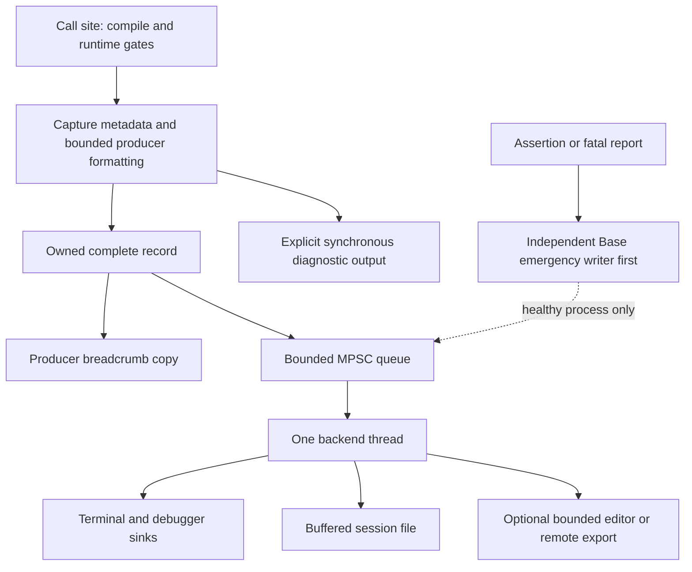

# Ludus logging: architectural review and engineering design

**Review date:** September 23, 2026. **Source revision:** `269b6118a6aeacdc229bf9ba6ee04839bc69f838`.

**Status:** engineering recommendation, not an implemented redesign. No engine source was changed. This report distinguishes source observations, reproduced failures, historical measurements, and proposed contracts. The existing untracked assertion design was read as a proposal, not treated as implemented functionality.

## 1. Decision

Keep Ludus's severity/category model, filtering macros, private sinks, source capture, and the decision to erase formatting behind a compiled boundary. Fix the synchronous implementation before building an asynchronous replacement around it.

The current logger is **not safe for concurrent producers**. A fresh ThreadSanitizer run confirmed simultaneous mutation of a file sink's `std::string` scratch buffer under a shared lock. Its failure and persistence guarantees are also weaker than the comments suggest. These are correctness issues, not speculative optimizations.

The recommended destination has three explicit delivery paths:

1. **Ordinary diagnostics:** cheap filtering, bounded formatting on the producer, owned records in a bounded MPSC queue, one sink-owning backend thread, batched writes.
2. **Debugger-critical diagnostics:** an explicit direct diagnostic operation that does not depend on the backend thread, plus an acknowledged queue flush when earlier ordinary records must be visible.
3. **Fatal/emergency diagnostics:** a small independent reporting primitive below Logging, called first, with normal logging only a best-effort secondary destination. Crash handlers use an even narrower platform-specific subset.

Do not build an analytics service, general formatting library, profiler, or remote debugger into FoundationLogging. Preserve correlation metadata so those systems can integrate later.

### Evidence and coverage

The review traced all public logging headers, all six implementation translation units, private records/sinks, all logging tests, CMake integration, smoke and Wayland consumers, repository standards, formatting ADRs, and build-budget configuration.

| Reference | Material actually inspected |
| --- | --- |
| Brian Hawkins, GPG3, §1.15 | Complete chapter, printed pp. 129–135; PDF pages 132–138, visually read because the scan has no useful text layer |
| James Boer, GPG4, §1.2 | Complete chapter, printed pp. 19–26; PDF pages 36–43, visually read |
| Patrick Duquette, GPG5 | Missing from `references` at review time; user confirmed they were looking for it. No implementation claims are attributed to the unread chapter |
| Raza and Iliev, GPG8, §4.7 | Complete chapter, printed pp. 409–415; PDF pages 424–430; text extraction with visual checks |
| Johnson et al., Game AI Pro 3, ch. 3 | Complete ten-page [author-hosted chapter](https://www.gameaipro.com/GameAIPro3/GameAIPro3_Chapter03_Logging_Visualization_in_FINAL_FANTASY_XV.pdf), printed pp. 21–30 |

The missing Duquette chapter is a specific literature coverage gap. Section 4.3 evaluates remote logging as an engineering option without inventing the author's protocol, implementation, or conclusions.

## 2. Current implementation: what actually executes

### 2.1 Public surface and call sites

[log.hpp](https://github.com/Alegruz/Ludus/blob/269b6118a6aeacdc229bf9ba6ee04839bc69f838/modules/foundation/logging/include/ludus/foundation/logging/log.hpp) exposes `Log(...)`, `LogSystem`, thread naming, and `LUDUS_LOG_TRACE/DEBUG/INFO/WARN/ERROR/FATAL`.

- The six levels run from Trace through Fatal. A record passes when its level is at least the configured threshold. Fatal always passes the macro predicate and is never compiled out; it **does not terminate** the process.
- A category contains a 32-bit FNV-1a ID and `std::string_view` name. Namespace-scope constant categories need no runtime registration. A second constructor permits arbitrary IDs and borrowed runtime names.
- CMake defaults: Debug retains Trace+, Development retains Debug+, Profile explicitly selects Info+, Release/MinSizeRel retain Warning+. The header's standalone fallback is Info+. Compile configuration is therefore part of SDK behavior, not just an internal implementation detail.
- Compiled-out severity macros become `((void)0)`: neither category nor arguments are evaluated. Compiled-in macros test `ShouldLog` before evaluating format arguments.
- A compiled-in, accepted macro evaluates its category expression twice: once for filtering and once for dispatch. Constants are safe; arbitrary expressions can have side effects or select different categories.
- `std::source_location::current()` is evaluated at the macro expansion. File, function, and line enter the record; no column is retained. Source is rendered only for Warning+; function names are never rendered by the current sinks.
- `Log()` is public but does not perform runtime filtering itself. Its callers also cannot suppress evaluation of already-passed arguments. The comment describing a defensive filtering recheck is not reflected in the implementation.

### 2.2 Formatting, representations, and ownership

The call-site template uses `std::format_string<Args...>` for compile-time checking and `std::make_format_args` to erase arguments. [VLog](https://github.com/Alegruz/Ludus/blob/269b6118a6aeacdc229bf9ba6ee04839bc69f838/modules/foundation/logging/src/logger.cpp#L281) calls `std::vformat` into a temporary `std::string`, then immediately dispatches a borrowed view. Argument references do not escape the call today.

Zero-argument calls skip formatting and forward the literal. This makes `"{{braces}}"` incorrectly remain `"{{braces}}"`, even though it is a valid format string whose formatted result is `"{braces}"`.

[LogRecordView](https://github.com/Alegruz/Ludus/blob/269b6118a6aeacdc229bf9ba6ee04839bc69f838/modules/foundation/logging/src/internal/log_record.hpp) borrows message, category name, source strings, and TLS thread name. This is valid only during synchronous `Write()`. The declared compact `LogRecordHeader` is unused: there is no queue serialization, file interning, or ownership protocol implementing its comments. Its clock comment also conflates steady and wall time.

Every active textual sink independently builds a line in a sink-owned `std::string`, initially reserved to 256 bytes. Longer lines grow it. Source-line conversion uses another `std::format` call. Small-string optimization may avoid some allocations, but the implementation provides no common-path allocation bound, no message length limit, and no explicit truncation behavior. Custom standard formatters can execute arbitrary code.

There is no engine-native general string or allocator available to justify a broad replacement today. `std::string_view` is an explicitly allowed and useful non-owning boundary type. Owning strings, vectors, filesystem operations, and maps nevertheless need explicit failure treatment; disabling language exceptions does not make their allocation paths infallible.

### 2.3 Threading and synchronization

[LoggerState](https://github.com/Alegruz/Ludus/blob/269b6118a6aeacdc229bf9ba6ee04839bc69f838/modules/foundation/logging/src/logger.cpp#L29) is a function-local static containing a shared mutex, atomics, a category override hash map, and a vector of owning sink pointers.

`ShouldLog()` checks initialization and takes a **shared lock plus hash lookup** for initialized non-Fatal calls. It is not just an ID and integer comparison as the header says. Filtering holds no lock while caller expressions and formatting execute.

Dispatch increments a global submitted counter, constructs metadata, takes the shared lock again, and calls each sink on the producer thread. Other producers can do the same concurrently. The shared lock protects sink lifetime from exclusive configuration operations, but does not serialize sink mutations. `Flush()` also takes only a shared lock. Initialization and shutdown take an exclusive lock.

There is **no background thread, MPSC queue, per-thread staging queue, wakeup mechanism, or overflow policy**. `Mode` is stored but never selects a backend. `SetMode(Asynchronous)` emits a note and remains synchronous; initializing directly with that value does not even emit that note.

### 2.4 Metadata and output

| Area | Current behavior | Practical implication |
| --- | --- | --- |
| Timestamp | `system_clock` nanoseconds; each sink converts to local `HH:MM:SS.mmm` | No monotonic duration domain; rendered date, zone, sequence and session ID absent |
| Thread ID | Atomic first-use counter, not native OS ID | Cannot directly correlate to debugger threads; scheduling changes IDs across runs |
| Thread name | TLS `std::string`; first thread using identity becomes `Main` | First logging worker can be mislabeled; naming may allocate |
| Console | Info and below to stdout; Warning+ to stderr; TTY-dependent ANSI colors | Separate streams have no combined ordering contract; stdout may remain buffered under redirection |
| Debugger | Windows `OutputDebugStringA`; debugger presence sampled at sink construction | Late attachment can miss normal output; non-Windows sink is a no-op |
| File | `FILE*`, `fwrite`, C-runtime buffering | A successful logging return does not imply another process can read an ordinary record |
| Formatting | Time, thread name, level, category, message; source on a second line for Warning+ | Friendly text, but no preserved fields or unambiguous one-record framing for multiline/control-character payloads |
| Statistics | Submitted/Written increment around dispatch; Dropped never changes | Written can increase with zero sinks or failed writes; counters are cumulative across initialization |

### 2.5 Files, configuration, and lifecycle

[LogConfig](https://github.com/Alegruz/Ludus/blob/269b6118a6aeacdc229bf9ba6ee04839bc69f838/modules/foundation/logging/include/ludus/foundation/logging/config.hpp) contains a global level, reserved mode, three sink toggles, injected `std::filesystem::path`, 1,000 ms flush interval, 32 MiB file threshold, and ten retained sessions. No environment, command-line, editor or configuration-file adapter exists in the logger. An empty directory disables file output with an emergency note. The smoke app explicitly disables file output; no production user-log-directory resolver was found.

[FileSink](https://github.com/Alegruz/Ludus/blob/269b6118a6aeacdc229bf9ba6ee04839bc69f838/modules/foundation/logging/src/sinks/file_sink.cpp) creates directories, prunes matching files, then opens a fresh file in `wb` mode. Names have local time to the second and PID. Rotation closes the current file and opens numbered segments. There is no append recovery, exclusive-create collision handling, session manifest, process ownership marker, or total byte/age cap.

The retention matcher accepts any filename containing `_pid-` and ending `.log`. It counts segments as sessions and can remove another running process's file. Reinitialization within the same second/PID can reopen and truncate the same path. A message larger than the segment threshold can still create an oversized segment; rotation is a trigger, not a hard storage bound.

Error and Fatal dispatch synchronously flush all sinks. Ordinary records have no timed flush because `FlushIntervalMilliseconds` is unused. `Flush()` has no status or acknowledged boundary. `Shutdown()` flushes and destroys sinks while holding the exclusive lock. It waits for dispatches already holding the shared lock, but a producer can pass the initialization check, pause, then acquire its shared lock after shutdown has cleared the sinks; that record silently disappears. Reinitialization can similarly move an in-flight message into a different session.

Warning+ before initialization/after shutdown uses emergency output, subject to compile-time filtering. Fatal is always eligible. Pre-init formatted warnings still call `std::vformat` before reaching emergency output. The global state's destruction and TLS destruction also make arbitrary late static-destructor logging unsafe to promise.

### 2.6 Failure and assertion behavior

[EmergencyLog](https://github.com/Alegruz/Ludus/blob/269b6118a6aeacdc229bf9ba6ee04839bc69f838/modules/foundation/logging/src/emergency_logger.cpp#L35) builds at most 511 bytes in a stack buffer, uses `snprintf` for the line number, then `fwrite`/`fflush(stderr)` and optional Windows debugger output. Truncation can remove source information and the newline without marking it.

This is a useful fallback when ordinary lifecycle state is unavailable. It is **not a signal-safe crash writer**: stdio has locks and internal state, and a write can block. Linux's [signal-safety documentation](https://man7.org/linux/man-pages/man7/signal-safety.7.html) explicitly explains why stdio cannot be assumed safe in a signal handler.

Initialized Fatal logging first formats, locks, writes and flushes normal sinks; only afterward does it invoke emergency output. An allocator failure, deadlock, or blocked sink can prevent the emergency copy. There is no recursion guard, last-N ring, crash reporter, stack capture, or process-termination integration in this module. Public lifecycle/logging functions generally lack `noexcept`; sink `noexcept` declarations do not prevent allocating operations from terminating on failure.

No implemented assertion subsystem was found. The locally inspected, unpublished `docs/architecture/assertions.md` explicitly proposes one; that separate proposal is an optional coordination input, not a prerequisite for this review. Its independent Base reporting boundary is compatible with this review; it must not acquire an upward dependency on Logging.

## 3. Defects and fresh validation

### 3.1 Findings by urgency

| ID | Finding and evidence | Required response |
| --- | --- | --- |
| F1: correctness blocker | Shared-locked dispatch mutates shared sink scratch and file/rotation state. TSan reproduced a race through `DispatchMessage → FileSink::Write → FormatConsoleLine` | Serialize current sink dispatch/flush immediately; do not ship multithreaded use on this backend |
| F2: failure blocker | Fatal reaches emergency output after fallible formatting and normal sinks; no recursion protection | Emergency-first reporting, bounded nonallocating formatting, explicit reentry policy |
| F3: contract violation | Flush interval unused; ordinary text remains in user-space buffering | Implement timed flush or remove the setting until supported; specify visibility versus durability |
| F4: lifecycle loss | Initialization check and sink-use lock do not form one admission protocol | Recheck state under the dispatch lock now; define accepting/draining/stopped transitions before async |
| F5: build cost | `<format>` in public `log.hpp`; `<filesystem>` transitively through config | Split call-site and control/configuration headers; eliminate heavy includes from the final call-site API |
| F6: formatting/filtering | Zero-argument escaped braces wrong; direct `Log()` bypasses filtering; category evaluated twice | Define raw-text versus format APIs, enforce frontend admission, evaluate category once |
| F7: file correctness | Segment-based pruning, broad matching, active-file deletion risk, same-name truncation | Session ownership, collision-resistant exclusive creation, bounded retention per whole inactive session |
| F8: silent failure | Unchecked partial writes/flush/close errors; failed rotation permanently disables file silently; Written remains optimistic | Sink health/status and independent bounded failure counters; no recursive reporting |
| F9: unsafe failure assumptions | Allocating std APIs under `-fno-exceptions`; `directory_iterator` range increment can use throwing overloads despite error-code construction | Audit complete call chains, not only signatures; explicit status-based allocation/I/O boundaries |
| F10: control fidelity | Hash-only category override keys, stale debugger-presence snapshot, nonfunctional async selector | Collision validation/descriptor identity, attach-aware debugger behavior, reject unsupported mode |
| F11: observability | No native thread mapping, monotonic time, stable event identity, or preserved optional fields | Add cheap universal metadata first; contextual fields only at useful sites |
| F12: validation gap | Existing tests are single-threaded and flush before testing normal visibility | Add concurrent and subprocess failure tests; test actual contracts instead of labels |

Further file detail: the retention sort comparator returns false whenever either timestamp lookup fails. Mixing such entries with valid timestamps need not satisfy strict weak ordering. Gather immutable successful metadata first, then sort deterministically; do not query a changing filesystem inside the comparator.

### 3.2 Checks performed for this review

`./scripts/test linux-clang-development` completed successfully: both CTest targets passed. This establishes the existing suite's result, not the correctness of the logger under the missing scenarios.

An isolated test harness, linked against the current Development library, produced:

| Probe | Observed result |
| --- | --- |
| Eight producer threads, 500 warnings each, logging sources rebuilt with Clang 18 TSan | Data race reported in `formatter.cpp:106`, reached from `file_sink.cpp:199` and `logger.cpp:257` |
| Warning; configured 10 ms interval; wait 100 ms; `_Exit(0)` | Session file existed but contained **zero bytes** |
| Error followed immediately by `_Exit(0)` | Error marker present in the file, 91 bytes in this probe |
| Zero-argument `"escaped {{braces}}"` | Output retained doubled braces |
| Public `Log(Info, ...)` with global Warning threshold | Info marker was written |

The `_Exit` experiment tests abrupt process exit without C-runtime cleanup; it is not a proof about power loss or every crash mode. The Error result demonstrates ordinary flush behavior on this filesystem, not universal durability. TSan halted at the first reported race; additional shared-state races follow from inspection but were not individually enumerated by this run.

Fresh include-only measurements used the repository Clang executable (Clang 18.1.3, local libstdc++ 13), `-std=c++23 -fno-exceptions -stdlib=libstdc++ -fsyntax-only`, five separate compiler processes per input, no PCH. Values include driver/startup and header parsing. The shared host was noisy and a sanitizer compile overlapped part of collection; these are diagnostic observations, **not calibrated performance gates**.

| Input | Median wall time | Preprocessed bytes | Preprocessed lines |
| --- | ---: | ---: | ---: |
| Empty translation unit | 92 ms | 188 | 8 |
| `category.hpp` only | 308 ms | 520,395 | 19,786 |
| `config.hpp` only | 1,632 ms | 1,661,168 | 61,704 |
| `log.hpp` only, no logging calls | 1,959 ms | 1,928,451 | 71,304 |

The deterministic include expansion establishes the dependency problem independently of wall-time noise. It does not establish how much a proposed formatter will save. Historical ADR 0004 reports frontend work falling from 52.5 s to 22.5 s and logging-header aggregate parsing from about 19 s to 9 s after erasure. Those are earlier measurements, not fresh before/after measurements here. Existing `out/profile` files have different totals and no sufficiently controlled provenance for a new comparison.

The review did not implement the target architecture, benchmark its throughput, or run a new full ASan/UBSan/tidy matrix. It would be misleading to call an unimplemented design validated. Reproduction sources, measurement samples, and sanitizer output accompany this report in [logging-review-evidence](logging-review-evidence/README.md).

## 4. Critical use of the references

### 4.1 Hawkins: Lightweight, Policy-Based Logging

The chapter separates flag initialization/assignment/storage, message buffering, and dispatch into policies. It also separates compile-time removal from runtime selection, puts configuration behind PIMPL, and guards expression evaluation before constructing output. Those last three ideas remain directly useful.

| Idea | Classification for Ludus | Reason |
| --- | --- | --- |
| Disable before argument evaluation | Directly useful | The current macros already preserve this essential property |
| Configure subsystem diagnostics without recompilation | Directly useful | Necessary for retained Development/Profile diagnostics; an atomic category threshold suffices |
| Hide configuration implementation | Directly useful | Direct answer to the present `<filesystem>` leak |
| Separate buffering and dispatch responsibilities | Useful after modernization | Keep compiled components and private sink interfaces, not a public policy cross-product |
| Generic template policies for Boolean initialization and assignment | Unnecessary | Ludus has one runtime and a small control model; added types increase review and compilation costs without a demonstrated configuration need |
| `operator<<`, `stringstream`, intermediate owning string, dispatch through Boolean conversion | Actively undesirable | Heavy headers, obscure delivery timing, repeated calls and allocation; conflicts with repository policy |
| Treat enabled-path cost as secondary because I/O dominates | Outdated for this engine | Queue publication, formatting, cache traffic and scheduler interference all affect producer/frame latency even when I/O is off-thread |

Do not confuse compile-time configurability with a need to template every architectural boundary. Preserve the evaluation guard and the separation of responsibilities.

### 4.2 Boer: An HTML-Based Logging and Debugging System

The central idea is retaining interpretable history of behavior, with time/frame context, categories, presentation cues and manually instrumented function nesting. The article explicitly acknowledges that its sample is not thread-safe, is weak for crash diagnosis, and should favor periodic events over dumping variables every frame.

| Idea | Classification for Ludus | Reason |
| --- | --- | --- |
| Make logs useful to QA/designers without a debugger | Directly useful | Searchable session artifacts and source/context links reduce reproduction burden |
| Capture state transitions and meaningful context | Directly useful | More useful information per byte and per developer reading minute |
| Frame/game-time context | Useful after modernization | Attach optional frame/job IDs; engine simulation time is not the logger's only clock |
| Browser-readable reports | Situational | An offline HTML export can be useful after machine-readable records exist |
| HTML as primary persistent representation | Actively undesirable | Presentation markup inflates the stream and complicates streaming, escaping, search and partial-file recovery |
| Color/style/routing bits serving as categories | Actively undesirable | Category identity must survive terminal, JSON and remote rendering; styles belong to viewers |
| Manual `FN` markers in many functions | Situational in narrow investigations; unnecessary globally | Maintenance and per-call cost; a thread stack does not describe a job migrating between threads |
| One global synthetic call stack and printf-style message API | Actively undesirable | Concurrent engine work invalidates the stack model; untyped formatting weakens correctness |

Its strongest lesson is contextual history and readable tools. It does not justify embedding HTML generation or full execution tracing in the logging core.

### 4.3 Duquette: A Real-Time Remote Debug Message Logger

**Source unavailable.** The local table of contents identifies the requested chapter, but the book PDF is absent. The chapter's actual architecture, transport, buffering, threading, filtering and limitations have not been verified. A paper-specific A/B/C/D critique cannot responsibly be completed from its title.

For the **problem implied by the title**, live observation of another process/device is situationally valuable: devkits, headless services, build workers, and editor-connected game instances. It is useful after modernization as a bounded optional exporter. Blocking socket writes from engine call sites, an unauthenticated general remote-command channel, and a mandatory server dependency would be actively undesirable designs **if proposed**; these are Ludus design exclusions, not claims about Duquette's implementation. Section 10 specifies the independent recommendation.

### 4.4 Raza and Iliev: A More Informative Error Log Generator

The chapter adds runtime stack context to failures so testers without a debugger can provide more actionable reports. Its implementation uses a singleton around dynamically loaded Windows DbgHelp, x86 register capture, stack walking and symbol lookup; the assertion example prints the result and waits for console input.

| Idea | Classification for Ludus | Reason |
| --- | --- | --- |
| Failure reports need execution context | Directly useful | File/line alone cannot explain a bad caller or job origin |
| Stack information in QA/beta reports | Useful after modernization | Capture addresses/context and build identity; symbolize in tools/crash service |
| Capture on selected assertion/fatal/diagnostic events | Situational | Valuable when expected diagnostic benefit justifies cost; ordinary Error is not automatically an unwind request |
| x86 inline assembly and assumptions about XP-era context capture | Actively undesirable | Architecture/compiler dependence; use supported platform facilities and optimized-build tests |
| Symbol loading/walking through a mutable singleton during failure | Actively undesirable as a crash guarantee | Loader, allocator and synchronization may be compromised; resource lifetime needs explicit ownership |
| `getchar()` to continue from an assertion | Actively undesirable | Hangs unattended tools and does not define whether execution is valid afterward |
| Stack trace replaces a meaningful error description | Unnecessary and harmful | A stack lacks resource IDs, status codes and the attempted operation |

DbgHelp itself is not obsolete. Microsoft documents its [single-threaded access requirement](https://learn.microsoft.com/en-us/windows/win32/api/dbghelp/nf-dbghelp-stackwalk64); this reinforces keeping symbol handling out of concurrent logging producers and crash-critical execution.

### 4.5 Johnson et al.: Logging Visualization in FINAL FANTASY XV

The chapter collects typed chunks with context IDs, uses shared double buffering and a sender, and moves aggregation and browser analysis outside the game. Session metadata, event distributions and spatial views connect observations to specific debugging questions. Crucially, its reserve operation can block when a buffer is full despite the stated nonblocking objective. These are reported mechanisms, not performance guarantees transferable to Ludus. [Chapter, §§3.2–3.4](https://www.gameaipro.com/GameAIPro3/GameAIPro3_Chapter03_Logging_Visualization_in_FINAL_FANTASY_XV.pdf).

For Ludus: structured identity is **directly useful**; external analysis is **useful after modernization**; spatial/statistical capture is **situational telemetry**. Mandatory database/web infrastructure is **unnecessary** now. Blocking producers awaiting buffer exchange is **actively undesirable** on render/job paths. Chunk-by-chunk construction with external reassembly is unnecessary for small diagnostics: publish a complete bounded record. The underlying lesson is to design capture around a useful question, then isolate collection cost from analysis. None of its architecture establishes crash or breakpoint visibility for our logger.

## 5. Cross-reference: problems that matter more than implementations

| Theme | Different approaches in the inputs | Ludus conclusion |
| --- | --- | --- |
| Policy and configuration | Hawkins composes policies and configurable flags; Ludus has macros, thresholds and runtime sinks | Compile out verbosity; control surviving categories at runtime; keep backend policy out of widely included templates |
| Formatting | Hawkins favors typed streaming; Boer favors printf-style calls; current Ludus uses checked `std::format` | Evaluate type safety, failure behavior and total header/call-site cost together; syntax alone does not choose the implementation |
| Context | Boer tracks instrumented function nesting; GPG8 captures native call stacks; source location identifies one site | These answer different questions: historical logical work, native execution chain, and where a message originated. Add job/correlation identity without tracing every function |
| Organization | Boolean flags, presentation-derived categories, severity thresholds and typed events | Keep severity plus category; represent event type/correlation only when useful; do not encode presentation as semantics |
| Persistence and visibility | Historical files, current buffered files, external collection | A sink call, a readable file, stable storage, and a remote viewer acknowledgment are separate milestones |
| Live inspection | A local debugger/HTML reader versus a remote observation problem | Keep local diagnostics reliable before optional transport; a debugger-critical message needs an explicit delivery path |
| Search and visualization | Human presentation versus metadata-driven analysis | Persist metadata independently of text so search does not require parsing prose; viewers decide style |
| Threading | A global synthetic stack is explicitly limited; current shared locking is incorrectly treated as serialization | Concurrency and ownership need a proven protocol, not labels such as synchronous or nonlocking |
| Failure information | GPG8 emphasizes stack context; Ludus has an emergency buffer | Capture trustworthy minimum information first, enrich when safe, symbolize elsewhere |
| Tool integration | Reports must work for non-programmers as well as programmers | Session/build identity, source links, loss indicators and reproducible exports precede a bespoke GUI |

The absent GPG5 text is excluded from implementation-level comparisons. Remote recommendations below stand on engine requirements rather than an invented reconstruction of that chapter.

## 6. Target frontend, taxonomy, and formatting

### 6.1 Public API

Keep the existing `LUDUS_` naming: shorter spelling alone is not a material improvement. Separate headers by cost and purpose:

- `log.hpp`: severity/category declarations, raw text submission, gating macros, small source metadata. No config, sinks, filesystem, format implementation or owning containers.
- `log_format.hpp`: opt-in typed argument packing and a deliberately restricted format-literal checker. It depends on `log.hpp`, never the reverse.
- `log_system.hpp`: initialization, explicit status, flush, health and shutdown controls. Configuration uses a borrowed UTF-8 path copied during initialization, or a narrow platform file-opening adapter; no public `<filesystem>` requirement.
- A Base diagnostic header: bounded raw emergency reporting, independent of Logging and the job system. Share it with the proposed assertion subsystem.

Representative **proposed**, not currently available, API:

```cpp
// render_log_categories.hpp: declarations, no dynamic registration constructor.
LUDUS_DECLARE_LOG_CATEGORY(LOG_RENDER);

// One implementation file; constant initialization, stable lifetime.
LUDUS_DEFINE_LOG_CATEGORY(LOG_RENDER, "Render");

#include <ludus/foundation/logging/log.hpp>
LUDUS_LOG_TEXT(LOG_RENDER, Info, "Swapchain recreated");
LUDUS_LOG_TEXT(LOG_RENDER, Warning, driverMessage); // text is not a format string

#include <ludus/foundation/logging/log_format.hpp>
LUDUS_LOG_INFO(LOG_RENDER, "Created texture {}", textureName);
LUDUS_LOG_WARN(LOG_RENDER, "Fallback format {}", formatId);
LUDUS_LOG_ERROR(LOG_RENDER, "Upload failed for resource {}: {}", resourceId, status);

// Intended breakpoint visibility, independent of the normal worker.
const auto visibility = LUDUS_LOG_DEBUG_SYNC(LOG_RENDER, "Before submit {}", submitId);
// Caller/tool can inspect visibility before breaking.
LUDUS_DEBUG_BREAK(); // illustrative diagnostic primitive

// Acknowledged earlier ordinary logs, if this stronger boundary is needed.
const auto flush = LogSystem::Flush(FlushKind::Visible, timeoutMilliseconds);
```

`LUDUS_LOG_DEBUG_SYNC` means Debug severity with direct delivery, not a separate severity. It is still subject to its documented compile/runtime gates. Assertion/fatal reporting must not use an optional Debug gate. `LUDUS_LOG_FATAL` remains a reporting operation; an explicitly nonreturning diagnostic failure primitive owns termination. Do not overload the meaning of a logging severity with control flow.

Macros are justified only for call-site metadata, severity removal, and guarding expression evaluation. Resolve the category expression once, then filter before building arguments. Severity-specific preprocessing must completely discard disabled calls, including their literals and formatting instantiations. A normal runtime function cannot provide that guarantee for already-evaluated parameters.

Keep raw text and formatting contracts distinct. Every formatted call interprets escaped braces consistently, including zero-argument calls. Dynamic text enters the raw API; do not interpret third-party error strings as format programs. Reject unsupported argument types at compile time. Tests must cover exact-once evaluation and runtime-disabled side effects, not just compile-disabled side effects.

The public callable frontend rechecks eligibility before formatting; the backend's internal submit operation accepts an already-admitted record. Avoid exposing an unfiltered dispatch function as ordinary public API. Runtime configuration changes take effect for subsequent predicate observations; do not promise instantaneous revocation of records already admitted.

### 6.2 Category implementation and severity semantics

Use a constant-initialized descriptor with a static name and an atomic override (`Inherit` or one of the six levels). A category read is one override load and, if inherited, one global threshold load; initialization/admission state adds a small separate check. Keep these scalar operations transparent and benchmark their actual generated code. Do not add a map lookup, allocation, lock, registration or debugger query to a disabled call.

Category registration belongs to explicit startup/module integration for discovery and named configuration. It must not happen lazily on every log call. Validate name/hash collisions there; runtime identity can be the stable descriptor or a dense registered ID. A wire/disk category dictionary uses full names, so a hash collision cannot silently merge categories. Before full registration, direct descriptors still support safe filtering. If plugins can unload, copy/intern descriptors into process-lifetime registry storage and drain references before unloading; pointers into unloaded modules are not valid async metadata.

Use exactly the existing six severities:

| Severity | Meaning |
| --- | --- |
| Trace | Very detailed activity, usually investigative and compiled out of Profile/Release |
| Debug | Developer diagnostic detail useful across Development sessions |
| Info | Meaningful lifecycle or operation outcome |
| Warning | Unexpected condition with a usable recovery or degraded result |
| Error | An operation failed; caller performs explicit error handling |
| Fatal | The reporting context cannot continue correctly; termination is owned by the failure API/caller |

Category identifies subsystem ownership. Avoid adding a second mandatory “channel” or “subsystem” with the same purpose. Delivery policy is orthogonal to severity. Optional event ID and fields describe the event, not a new hierarchy. Debug-only diagnostics are a build/filter decision. High-frequency counters, spans, entity positions and frame telemetry belong to separate capture APIs with their own sampling and budgets.

`LOG_TEMP` is useful during investigation but should not become the permanent home of production diagnostics. Add a modest category naming convention and discoverable threshold controls before a hierarchy of inherited logger objects.

### 6.3 Formatting alternatives and decision

All candidates require the same outer evaluation guard; none can fix eagerly evaluated arguments afterward.

| Alternative | Runtime, allocation and debugger properties | Build/code-size/type properties | Decision |
| --- | --- | --- | --- |
| printf-style varargs | Bounded `snprintf` is possible; parsing and conversion happen on producer; invalid type combinations are dangerous | Thin headers; compiler annotations help literals but do not create a fully typed API; ABI promotions and `%s` remain hazards | Do not replace the engine API with this; private numeric/emergency code is a separate question |
| Existing `std::format` erasure | Convenient checked literals; current `vformat` owns a string; formatting and custom formatters can fail | Heavy parse cost still paid; argument formatter/checking instantiations remain; good feature coverage | Preserve as a temporary migration adapter, not the final ubiquitous header |
| Compiled library formatter such as `{fmt}` | Potentially efficient buffer output; failure/allocation behavior must be audited in the chosen no-exception configuration | Library features and versions change costs; “compiled library” does not prove a light call-site header | Measure as a prototype competitor; do not select on reputation |
| Narrow typed argument array with runtime parser in `.cpp` | Bounded producer buffer; immediate argument lifetime; explicit format error/truncation status | Small per-type packing; little call-site machinery; grammar validation can be a compact consteval scan | Recommended core direction if prototype verifies cost and maintenance bounds |
| Compile-time parsed/generated formatting program | Removes some runtime parsing | Can increase constant evaluation, per-site metadata, templates and code; savings depend on repetition/type mix | Add only if producer benchmarks justify it; no per-literal code generator initially |
| Deferred typed formatting | Moves conversion off producer; must copy every borrowed string and encode supported values | Metadata/schema and transport machinery; custom objects require unsafe lifetimes or copy/destructor logic | Defer for ordinary logs; consider only for measured high-volume event capture |
| Caller-preformatted text | Simple submission/copy, easy emergency use | Template-free API | Essential escape hatch; caller must place expensive construction inside an eligibility guard |
| Structured event, text rendered later | Efficient queries and correlation; bounded typed values can avoid prose formatting | Schema/version/dictionary maintenance; no need to template the whole event system | Optional fields now only when consumed; typed high-volume events in a separate facility |

**Concrete formatting scope:** strings/views, Boolean, Ludus integers, pointer-as-address, `float32`/`float64`; `{}` plus a small documented set of decimal/hex/precision specifiers and brace escaping. No locale, chrono formatting, arbitrary ranges, recursive formatting or implicit custom-object callbacks. Width/precision and argument counts have hard caps. Convert domain objects to stable IDs or explicit bounded text; never call unknown user formatting code from the backend.

Use a small tag/value `FormatArg` array on the producer stack. Strings are borrowed only during the synchronous formatting function. A compact literal checker validates braces, count and supported specifiers against argument tags. The conversion work and runtime parser compile once. Private `std::to_chars` is a reasonable numeric-conversion candidate: measure library support and output, and retain its status-code interface; do not write a new floating-point algorithm.

The formatter returns `{BytesWritten, Truncated, FormatError}` into caller-owned storage. On failure, emit a bounded marker and usable literal prefix; no throw, allocation, abort or recursive log. Common output is UTF-8, truncation is flagged and avoids cutting a code point where feasible. Invalid incoming bytes are escaped or explicitly marked in serialized output.

This is an intentionally small diagnostic formatter, not an engine-wide replacement for `std::format`. Its adoption is conditional on the Phase 2 comparison. If a library-backed implementation behind the same lightweight erasure boundary meets the no-allocation/no-termination contract and wins total engineering cost, use it. Do not expand the public grammar merely to preserve unsupported convenience features. The repository's existing call sites mostly need strings and integers, making this restriction plausible but still subject to a full migration inventory.

### 6.4 Build-time requirements

Current header expansion already makes a strong case for separating configuration. The new frontend must also avoid replacing standard-library costs with elaborate templates.

- Keep `std::string_view`, `<source_location>` and small atomic/type utilities only where their API benefit warrants their measured cost. There is no reason to invent a general string-view class just to change namespace spelling.
- Use `usize` and other Base aliases. Keep source metadata as pointers/IDs and line values; do not use file/format strings as template non-type parameters generating distinct function bodies per site.
- Use one non-template formatting/submission boundary; shallow pack conversion only. Deduplicate static metadata where the linker naturally can; investigate binary impact before building a source-ID generator.
- Remove `config.hpp` from `log.hpp` immediately. Even cold configuration headers should stop exporting `<filesystem>` in the target API. No sink class becomes public.
- A legacy heavy formatting adapter must be explicitly named and temporarily excluded from the new core; it cannot be presented as compliant with the final public-header rule. Revise ADR 0004 to distinguish erasure of execution from elimination of parsing cost.
- Test 0, 100, 1,000 and 10,000 call sites across multiple TUs, both repeated and diverse type packs. Report parsing, constant evaluation, instantiation, optimization, `.text`, `.rodata` and debug-information size separately.
- PCH/modules may reduce repeated parsing in some builds but do not excuse a heavy SDK header. Test standalone SDK consumers without either.

The current 3,200 ms `log.hpp` CI override permits substantial cost. Do not raise it to accommodate a redesign. After measuring the replacement on the calibrated runner, lower its budget and gate representative instantiated logging TUs as well as include-only headers. Header parse budgets alone cannot detect per-call-site template/code-size regressions.

## 7. Backend and ownership design

### 7.1 Architecture



The breadcrumb copy must occur on the producer if it is to preserve a diagnostic that has not yet reached the worker. A consumer-only history ring cannot meet that purpose.

### 7.2 Concrete data model

Use a fixed record header and inline owned UTF-8 payload. Prototype a **1,024-byte total queue slot** and **4,096 slots** (about 4 MiB before control metadata/alignment). These are measurement starting points, not accepted platform budgets. Derive final capacity from observed bursts and sink stalls:

`required slots ≈ peak admitted records/second × tolerated consumer stall seconds + burst margin`.

No finite buffer can absorb sustained production above sink throughput. The protocol therefore needs explicit loss behavior irrespective of the selected capacity.

| Record element | Lifetime/representation |
| --- | --- |
| Sequence | `uint64` successful queue reservation position; correlates completion, never claimed to be physical event time |
| Timestamp | Monotonic tick value captured on producer, with a session clock-frequency/UTC anchor; convert in backend |
| Severity/category | Small enum plus process-stable category identity; serialize dictionary name/ID, not a pointer |
| Source | Stable descriptor for file/function/line; module unloading must drain or intern referenced strings |
| Thread | Native thread ID plus optional engine thread ID; bounded thread-name snapshot or immutable versioned name ID |
| Message | Explicit length plus copied bytes in slot; no `std::string` and no deferred borrowed reference |
| Flags | Truncation, format error, emergency mirror, omitted fields and other defined delivery diagnostics |
| Optional fields | Small bounded typed array/payload: integer, float, Boolean, bounded UTF-8, opaque stable ID; no owning containers or object pointers to dereference later |
| Session metadata | Session/build/revision/platform/configuration/clock mapping recorded once and attached to exports |

Do not place an in-memory C++ struct on disk or the network verbatim. Padding, endian order, pointers and ABI can change. Serialization has a version, explicit lengths/types, bounded sizes, and a parser that tolerates a truncated final record. For text-only initial output, preserve enough identifiers to correlate records; an optional JSON-lines sink can follow without changing producers.

A queue slot is owned by its producer between reservation and publication, then exclusively by the consumer until release. Sinks receive views valid during `Write()` only. Optional exporters must copy to their own bounded storage before returning. Formatting arguments are fully consumed before any queue reservation; no user code executes while holding a queue slot.

### 7.3 Threading alternatives

| Model | Strength | Cost/risk | Recommended role |
| --- | --- | --- | --- |
| Direct synchronous, one exclusive dispatch mutex | Easiest correct sink ownership; no async lifetime work | Producers wait for all I/O; poor tail latency | Immediate repair, small tools, deterministic tests |
| Separate mutex per sink | Some independent progress | Each producer still does I/O; differing order across sinks; more lock paths | Not the default evolution |
| Bounded MPSC, one backend | One place owns sink buffers, rotation and serialization; bounded memory | Shared publication cache line; full queue; stalled reservation can impede consumer | Initial asynchronous target |
| Per-thread SPSC buffers | Reduces producer contention | Registration, memory per thread, merge ordering, dead threads, flush across all queues, job/fiber lifetime | Only if measured MPSC producer tails exceed budget |
| TLS formatting/staging | Reuses storage | TLS initialization/recursion and fiber/thread confusion; unpublished staging defeats flush/crash promises | Consider fixed formatting scratch only after stack/TLS measurement; no hidden delayed batch initially |
| Hybrid ordinary/direct/emergency | Fits throughput, debugging and failure requirements independently | Three explicit contracts and integration tests | Required delivery architecture |

For the first asynchronous implementation, use bounded fixed slots with per-slot generation/publication state and nonblocking `TryEnqueue`. Failed attempts do not advance the queue position and create holes. Bound CAS retries; contention exhaustion is a reported drop reason, not an infinite spin. Publish with release, consume with acquire; do not reuse a slot before consumer release. Validate wraparound using reduced-width/model tests and real 64-bit counters.

This does **not** establish wait-free behavior. A preempted producer that has successfully reserved the next slot can delay the consumer. Minimize the interval to a fixed copy and publication, avoid callbacks/allocation there, and give flush a timeout. Never reclaim a reserved slot merely because its producer looks slow; it may resume and corrupt reused storage. If actual scheduling/latency measurements make this unacceptable, compare a short mutex-protected publication queue and per-thread buffers. An atomic implementation is not automatically the fastest or most predictable choice.

The backend waits on a lost-wakeup-safe event/condition protocol with a timed flush deadline. Drain bounded batches to limit starvation of flush/control work. Normal producers do not invoke the job scheduler or wait for I/O. A genuinely hard real-time/audio callback should use a separately budgeted fixed trace facility or avoid logging; “cheap” normal diagnostics are not a hard real-time proof.

### 7.4 Ordering and overflow

Guarantee per-thread order for sequential successful submissions and backend consumption in reservation order. Different threads can capture earlier timestamps but publish later. Do not sort the whole stream by wall time or imply a causal total order. Use correlation/job IDs where causality matters. Terminal stdout/stderr, emergency output and network export can have different visible interleavings; sequence/session identifiers make that honest.

Default overflow policy:

- Ordinary Trace/Debug/Info: drop the incoming record without waiting; count by reason and severity. Do not overwrite a producer/consumer-owned slot.
- Warning/Error: allow access to reserved queue headroom; if exhausted, preserve a compact breadcrumb and attempt a rate-limited **nonblocking** emergency indication where the platform supports one. Record loss counters regardless. Never turn an error storm into unbounded producer blocking.
- Fatal and explicit synchronous diagnostic: use their separate direct paths. They do not rely on a free queue slot.
- Emit loss summaries from the backend when it has capacity; do not recursively log one warning for every dropped record. Include the interval and counter delta so tests/tools can distinguish absence of activity from loss.

A low-severity reservation quota can protect headroom in one ordered queue; a separate priority queue complicates ordering and flush. Benchmark the admission check's synchronization cost. No finite design can promise lossless, bounded-memory, nonblocking logging against a permanently blocked consumer. Make the selected tradeoff visible in the API and tooling.

### 7.5 Lifecycle and worker failure

Use explicit states: `Uninitialized → Accepting → Draining → Stopped`, with `Degraded` health independent of basic lifetime. Initialize allocations/resources with status reporting before publishing Accepting. Registration/name/configuration work is cold-path work.

A producer acquires an admission token only if the state is still Accepting; shutdown closes admission and waits for admitted operations to publish/drop before capturing its final fence. A double-check protocol or equivalent synchronized admission is necessary—an initialization Boolean alone is insufficient. The engine should stop/join producers before normal logger shutdown, but the logger must still safely reject racing late submissions.

The backend processes the final fence, flushes, closes and exits; shutdown joins it. If shutdown times out, report incomplete shutdown and retain the worker's referenced storage. Do not detach a thread and free its queues/sinks. Whole-process termination may abandon that storage; a reusable embedded runtime must resolve/join it before restart or return a failure that prevents reuse.

Expose backend progress and health. A stalled backend can be detected by no progress with pending work, but a debugger pause or descheduling is not proof that the thread died. Degrade/drop safely; do not create a second unsynchronized file writer. No automatic in-process recovery can make a segmentation fault on the logging thread safe for the rest of the process. Independent emergency reporting and external crash capture handle that case.

## 8. Delivery and flush contracts

Use explicit results: `Ok`, `Filtered`, `NotInitialized`, `TimedOut`, `SinkFailed`, `Unsupported`, and `Incomplete` as appropriate. Return the acknowledged sequence and selected sink health for a flush. Do not claim success merely because a method returned.

| Operation | Completion means | Does not mean |
| --- | --- | --- |
| Ordinary async log | Record was copied/published, or its drop was counted | Sink visibility, disk persistence or remote reception |
| Timed backend flush | Selected output buffers pushed to OS after processing a captured fence | Every concurrent producer finished; power-loss protection |
| Manual `Flush(Visible, timeout)` | All accepted records through the fence were processed; selected local sinks completed their visibility flush or returned failure | Records still formatting when the fence was captured; a remote GUI rendered them |
| Explicit synchronous diagnostic | The diagnostic was sent directly to selected debugger/stderr diagnostic outputs before return, with result; independent breadcrumb retained where available | All earlier async messages were drained; storage device committed data |
| `Flush(Durable, timeout)` | Visibility plus platform durable-file request completed successfully for selected files | Universal protection against hardware/controller failure; remote durability |
| Controlled Fatal | Minimal emergency evidence attempted first; bounded healthy-backend enrichment/flush attempted afterward | A functioning allocator, worker, or arbitrary stack unwinder |
| Normal shutdown | Admission closed, accepted producers resolved, final fence consumed, selected sinks flushed/closed, worker joined | Recovery of previously dropped records |
| Crash-handler reporting | Minimal platform-safe capture/notification attempted | Full logger flush or safe execution of normal sink code |

### Flush fence implementation

Capture the last successfully reserved queue position after the caller's preceding submission returns. All already-completed log calls must lie at or before that fence. Publish a flush request separately from the data queue so a full queue cannot prevent requesting a flush. The worker waits for publication of every reserved position through the fence, processes it, performs the requested flush and acknowledges the fence/result. A deadline makes a missing publication observable instead of an infinite wait.

Coalescing requests is valid only if the strongest requested flush kind and each caller's completion boundary are preserved. Use a small control mutex/condition on the cold path if needed; there is no benefit to making lifecycle/flush request bookkeeping lock-free. A backend-thread or recursive flush must return a defined result rather than wait on itself.

A failed sink makes the fence completed-with-error, not successful. Exporter submission and remote receipt are different operations: ordinary Flush covers local selected sinks; a future explicit remote acknowledgment requires a protocol and separate timeout.

### The breakpoint case

`LUDUS_LOG_INFO(...); BREAKPOINT;` on an async backend cannot guarantee visibility: an all-stop debugger may suspend the worker before it runs. No queue memory ordering fixes this.

For an intentional breakpoint, use the explicit synchronous diagnostic immediately before it. To inspect the earlier ordinary stream as well, issue a successful Visible flush **before** breaking. Provide a Development option that mirrors selected categories synchronously to the debugger for unplanned breakpoints; it is opt-in because debugger output can be expensive. Do not automatically switch the whole logger's scheduling model when a debugger attaches.

On Windows, do not cache attachment state forever. Use a private OS adapter with either a cold-path refresh or appropriate direct emission, and test attach/detach and Unicode behavior against supported debuggers. Microsoft's [OutputDebugString documentation](https://learn.microsoft.com/en-us/windows/win32/api/debugapi/nf-debugapi-outputdebugstringw) describes debugger opt-in behavior for Unicode; UTF-8-to-UTF-16 conversion alone is not a universal display guarantee. On Linux, direct stderr/diagnostic-FD delivery and file tailing are practical choices; there is no universal debugger output-window sink.

The guarantee is delivery to a healthy selected OS output endpoint before the trap, not proof that a GUI has painted text. A closed pipe, detached debugger or blocked device must be reported or degraded honestly. Do not invoke synchronous delivery automatically for every Error; preserve current legacy Error-flush semantics until call sites/build policy explicitly migrate to the new contract.

**Timeout limitation:** a timeout around a condition variable does not cancel a blocking `fwrite`, `fsync`, debugger API, or filesystem call. Normal producers stay bounded because they do not perform these operations. Direct/emergency paths minimize dependencies but can only promise bounded wall time when the selected platform I/O supports it. Keep fatal capture in memory and notification to a prearranged nonblocking channel ahead of any potentially blocking disk operation. Do not market synchronous durability as both infallible and deadline-bounded.

## 9. File logging and sink ownership

### 9.1 Keep a small useful sink set

| Sink | Role and ownership |
| --- | --- |
| Terminal | Useful for local development and CI; backend formats/writes; configurable to avoid a slow terminal dominating drain time |
| Debugger | Useful for selected Development output, plus independent direct critical diagnostics; no universal cross-platform emulation |
| Session file | Primary local persistent artifact, owned by the backend |
| Breadcrumb capture | Independent producer-side bounded crash evidence; not a conventional consumer sink |
| In-engine/editor console | Later bounded subscriber with main-thread/UI consumption; never draw or call arbitrary UI code on the logging worker |
| Remote viewer/export | Optional separate module with its own bounded queue and sender; no socket waits in engine producers or the main logging worker |

Retain the private virtual sink interface, but return compact write/flush status and define ownership. With a handful of sinks, virtual dispatch is not a credible priority compared with formatting and I/O. Do not template the sink graph to remove a few indirect calls. Render a shared plain-text prefix/line once per record where outputs agree; add terminal color as a sink presentation operation. A JSON serializer should consume metadata directly, not reparse the text line.

A single worker can still stall on local storage or console output. Disable or rate-limit low-value slow outputs through configuration; do not promise lossless throughput to arbitrary pipes. Only add another isolated sink worker when measurements show a real need. Each additional queue multiplies buffering, ordering and shutdown concerns.

### 9.2 Location and session identity

The application/platform bootstrap resolves a writable directory and injects it. FoundationLogging must not depend upward on the windowing/platform module. Private OS file helpers below that dependency boundary are appropriate.

- Linux: app-specific logs under `$XDG_STATE_HOME`, falling back to `$HOME/.local/state`, consistent with the [XDG state-data specification](https://specifications.freedesktop.org/basedir/latest/).
- Windows: an application directory under the platform's per-user local data location, resolved through the platform adapter. Validate packaging/devkit policies separately.
- macOS/console targets: use their approved application log or development capture locations when those targets are actually supported; do not bake guessed universal paths into Foundation.
- Tools/CI: explicit output-directory override. Never silently fall back to a read-only working directory or a system-wide shared log directory.

Create an exclusive session directory/file using UTC time, PID and a nonce/counter with collision retries. Exclusive creation is the correctness mechanism; a name that merely looks unique is not. Record build ID/revision, executable, configuration, platform, process/session IDs and clock anchors at the start. Avoid collecting usernames/machine identifiers unless a concrete support workflow needs them.

Fresh session output is the default. Append only when explicitly reopening a verified same-session artifact with a documented recovery policy. Session ownership markers must account for PID reuse; use an open OS ownership handle/lock or equivalent. Never let a second process prune an active session based on age alone.

### 9.3 Rotation, retention, and persistence

Rotate on complete record boundaries with bounded-size records. Treat all segments as one session; delete only inactive session groups created by this logger. Enforce a configurable total storage cap and optional age cap as well as session count. Define the zero values explicitly—do not leave “zero means unlimited” implicit. A long-running process also needs a segment/byte cap; startup pruning alone cannot bound disk growth.

Open a replacement segment successfully before relinquishing the old usable handle where platform semantics allow it. If rollover fails, report degraded storage and follow the configured cap policy: stop file output or use a bounded fallback, rather than silently exceeding the budget. Do not scan/prune directories on a render-thread submission. Gather timestamps outside sort comparators, use error-code iteration throughout, and use narrow strict filename/manifest ownership checks.

Buffer backend file writes into fixed storage and flush at an explicit interval, on requested fences, at controlled shutdown, and for configured urgent events. A starting interval can remain 1 s, but measure lost-tail tolerance; it is a flush opportunity, not a guarantee when the worker is stalled. Preserve an opt-in more aggressive Development visibility policy.

Check short writes, interrupted operations and flush/close failures. Retry only where permitted, with bounded attempts; mark a sink failed and retain counters otherwise. A record written partly during a crash must be identifiable as incomplete. Single-process single-writer ownership prevents ordinary interleaving, but does not guarantee filesystem-atomic writes or survival of a partially written last record. JSON-lines readers should ignore/quarantine an incomplete trailing line; future binary records need lengths/versioning and optional integrity checks.

`fflush` drains C-library buffering; it does not flush the kernel's storage cache. This distinction is documented in [fflush(3)](https://man7.org/linux/man-pages/man3/fflush.3.html). Durable flush uses an appropriate OS operation such as `fdatasync`/`fsync` or `FlushFileBuffers`; durable creation/rotation may also need directory metadata persistence on applicable filesystems. Keep it explicit because it can stall significantly. Do not issue it on every ordinary log or pretend it guarantees survival against all hardware failures.

UTF-8 paths should be converted in the Windows adapter to the appropriate native file API; `path.string()` plus narrow `fopen` is not a sufficient portable Unicode-path contract. Keep OS headers and conversion code out of public logging headers.

## 10. Crash, remote, and visualization boundaries

### 10.1 Emergency and crash integration

Implement the independent primitive in FoundationBase (or a dependency strictly below Logging), alongside the assertion reporting work. Start with a fixed literal failure header and bounded copied text. Do not consult category maps, instantiate logger state/TLS strings, allocate, walk the normal sink list, or acquire engine locks. Preserve the platform error code around reporting where required.

There are two environments:

1. **Controlled diagnostic failure:** the process still executes normally enough to report an assertion/fatal operation. Bounded argument conversion, recursion protection, direct diagnostic output and a timed backend request can be appropriate. Capture the indispensable report first.
2. **Asynchronous fault/corruption:** signal/exception-handler restrictions apply. Use only audited platform operations, preopened handles/preallocated memory and minimal crash-context capture. Avoid C stdio, the ordinary formatter, normal TLS initialization, container access, symbol loading and worker joins. On applicable platforms use an alternate signal stack and an out-of-process crash reporter; those are crash-subsystem responsibilities.

A first-entry/reentry guard prevents recursive enrichment. A nested failure emits only a minimal literal/counter or skips output; it must not recurse again. Initialize ordinary producer recursion depth before invoking formatter/adapters. A crash path needs a separately audited reentry mechanism, not a casual reuse of arbitrary C++ TLS machinery. No diagnostic system can safely read arbitrary corrupted pointers; a fixed fallback header is more trustworthy than trying to stringify every object at the fault.

For allocator failure, normal records use preallocated/fixed storage; initialization failure returns an explicit degraded result with emergency reporting still available. Merely adding `noexcept` to an allocating path is not a solution. Cold resource operations also need status-based APIs or a narrowly reviewed boundary; this proposal does not require exceptions in engine code.

**Breadcrumb ring:** add a bounded producer-side history, initially selected Warning+/critical records plus configured useful categories. Prototype 2,048 entries with 256-byte bounded records (about 512 KiB before control metadata). Retain severity/category, time, thread/source identity and a truncated message prefix; mark selection and truncation so “last N” means last N captured records, not every attempted log. Enable broader capture only after measuring its producer cost.

Use per-slot exclusive writer ownership plus publication generation. If readers can run concurrently, ordinary payload bytes plus a seqlock counter are insufficient under the C++ memory model: that is still a data race. Use atomic payload words with generation verification, a proven reader-ownership protocol, or read a frozen process snapshot externally. Writers must skip busy slots without waiting indefinitely. A crash reader never waits on a slot interrupted mid-write. Benchmark the atomic-copy cost; make coverage/cost configurable rather than quietly adding hundreds of atomic operations to every Trace call.

Process-local memory survives only if a core/minidump/external snapshot captures it. A normal heap/static ring does not survive `_Exit`, SIGKILL or power loss by itself. Arrange crash-reporter attachment of the ring and stable dictionary/session metadata. Persistent/shared-memory capture is a later, separately specified facility if termination survivability requires it.

Capture raw stack addresses/register context for selected failures through platform-specific diagnostic services; symbolize outside failing threads with matching build artifacts. Native stacks do not reconstruct asynchronous job ancestry, so carry an optional job/correlation ID too. Do not unwind every Error, and do not assume C++23 `std::stacktrace` is a safe no-allocation crash-handler facility merely because it is standardized.

### 10.2 Failure matrix

| Failure | Target response |
| --- | --- |
| Queue full or bounded publication attempts exhausted | Drop according to severity policy; breadcrumb/critical reserve; counters and later summary |
| Worker stalled or unavailable | Producers remain bounded; expose backlog/progress failure; direct critical path works independently; flush returns timeout/degraded |
| Allocation fails during initialization | Return degraded status; use fixed emergency path; do not publish partially initialized backend |
| Formatting invalid/too long | Bounded fallback/truncation flags; no exception/termination; strict unsupported-type compile errors |
| Disk full, broken pipe, rotation or flush failure | Mark only affected sink unhealthy, track status, one bounded independent note; other sinks continue where possible |
| Logger recursively logs | Guard before formatting/dispatch; minimal emergency literal or counted suppression; no self-wait |
| Shutdown races with submission | Admission protocol decides accepted or rejected; accepted records belong to final fence; late Warning+ can use emergency path |
| Controlled fatal error | Emergency/breadcrumb first, optional bounded normal flush, then caller's explicit break/termination policy |
| Crash while logger lock/slot held | Crash path does not acquire it; incomplete slot skipped in external snapshot; no attempt to repair corrupted logger state |
| Abrupt uncatchable termination | Only OS-visible file bytes and independently retained artifacts can be expected; state loss is documented |

### 10.3 Remote logging

Add remote export only for a real devkit, editor-attached process, headless worker or distributed runtime workflow. It is an optional sink/service above the core, not an initialization prerequisite. Reuse an existing engine developer transport if one later exists, while keeping control messages and log delivery separately bounded.

For local editor integration, a local socket/named pipe or loopback TCP is sufficient. Across development devices, a framed TCP transport is a reasonable initial choice when ordered reception is useful. TCP reliability does not guarantee application retention, connection uptime, remote disk persistence or bounded latency. Give its sender a separate queue, loss counter, reconnect/backoff and bounded spool; never propagate TCP backpressure into rendering.

UDP is situational for deliberately lossy diagnostics/telemetry. Include version/session/sequence and truncation markers; account for datagram limits and reordering. Do not invent a reliable UDP protocol just to ship logs. Neither transport merits inclusion in FoundationBase or the common logging header.

Define versioned records, maximum frame lengths, category/source dictionaries, session/build identity, sequence gaps, explicit acknowledgments if needed and decoder validation. Default local endpoints to local-only. Remote targets require authentication/authorization and protected transport as appropriate; do not expose an unauthenticated listener or combine log viewing with arbitrary command execution. Use the same controls to cap subscriptions, verbose categories and bandwidth. Redact credentials/user data and allow explicit capture scope; automated upload is not implied by enabling a local file sink.

Remote clocks do not define a global causal order. Use session identity, local monotonic clocks, clock calibration if required, and explicit distributed correlation IDs. Preserve searchable local logs when the viewer disconnects. Measure exporter overhead with no viewer, a slow viewer, disconnection and reconnect before enabling it by default anywhere.

### 10.4 Structured logging and tools

Make the **record envelope structured now**: timestamp/clock domain, severity, category, thread, source, sequence, session and text. This already exists partially in `LogRecordView`; preserve it past the sink boundary instead of flattening it irreversibly.

Add bounded fields selectively when there is a consumer: resource ID, job ID, device status, build step, frame ID. A dictionary of arbitrary strings and heap-allocated variants per call is not justified. Provide a typed small-field adapter in an opt-in header; copy field strings into record storage. If fields would exceed the record budget, set an explicit omission/truncation flag and retain the message/critical identity. Do not attach an entity position and full object snapshot to every log.

Store human-readable text by default. Add optional JSON-lines serialization in the worker/tools when search/export requires it; JSON work never belongs in the producer header. A compact binary stream is worthwhile only when measured storage/network volume pays for its schema, tools and compatibility burden. Keep schema versions and unknown-field behavior defined from the first exported format.

Prioritize tools in this order:

1. Session discovery, tail/search, severity/category filters, thread/source links and visible drop/health state.
2. Optional in-editor console with bounded history and pause/freeze/export controls; no engine-thread blocking while a user scrolls.
3. Timestamp/thread lanes and correlation links to jobs, frames, render resources and crash reports.
4. Separate profiling/telemetry capture for spans, counters and sampled spatial/state events, joined by clock/session/correlation metadata.
5. Spatial maps, heatmaps or specialized AI tools only for an owned debugging question and instrumented data source.

A log timeline shows diagnostic events; it does not measure execution durations unless separate span instrumentation exists. Render/frame markers can link to profiler captures without routing every frame through a text logger. Spatial visualization needs world/level coordinates, units, entity lifetime and sampling contracts; those are domain telemetry concerns. An HTML export is a presentation artifact, escaped by the exporter, not executable markup supplied by engine messages. Start with existing file/search/trace tooling before committing to a dedicated application.

## 11. Costed recommendations

“Cost” below is an architectural estimate. Runtime speedups are not claimed until measured. The ledger covers the major changes and their developer payoff.

### Keep

| Recommendation / problem solved | Runtime cost | Compile-time cost | Complexity and developer benefit |
| --- | --- | --- | --- |
| Keep six severities and module-owned categories | Tiny metadata and threshold checks | Small enums/descriptors | Low; familiar vocabulary, no taxonomy migration |
| Keep compile/runtime macro guards | Branch/load for retained calls; zero compiled-out work | Small preprocessing surface | Low; expensive arguments remain unevaluated |
| Keep early type erasure and private sink interface | Small dispatch overhead | Execution machinery compiled once | Low; change backend without exposing it to users |
| Keep source location and injected output directory | Metadata capture; startup path work | Source header is measurable; remove heavy path exposure | Low; actionable diagnostics without dependency inversion |
| Keep readable text, fresh sessions, rotation intent | Backend formatting/I/O | Private only | Low; useful artifacts before custom tools exist |

### Fix

| Recommendation / problem solved | Runtime cost | Compile-time cost | Complexity and developer benefit |
| --- | --- | --- | --- |
| Exclusive dispatch/flush and lifecycle recheck now (F1/F4) | Serial I/O contention, explicitly temporary | Negligible | Low; eliminates confirmed races before async work |
| Brace semantics, once-only category evaluation, callable filtering (F6) | Tiny check; zero-arg format scan unless raw API used | Small | Low; predictable API behavior |
| Honest mode/flush/statistics status (F3/F8/F10) | Counters and cold status checks | Small control header | Low/moderate; developers know what was delivered |
| Check partial/failed writes, iteration errors and sort metadata (F7–F9) | Cold-path/error-path work | Private | Moderate; logging failure no longer silently resembles success |
| Session-safe exclusive creation and retention (F7) | Startup/rotation metadata I/O | Private | Moderate; avoids deleting/truncating useful evidence |
| Refresh documentation/tests to actual contracts | No production cost | Tests only | Low; removes misleading “synchronous durability” assumptions |

### Replace

| Recommendation / problem solved | Runtime cost | Compile-time cost | Complexity and developer benefit |
| --- | --- | --- | --- |
| Replace call-site heavy include graph with split raw/typed/control headers (F5) | None for raw frontend; typed conversion measured | Expected large reduction; verify with TU matrix | Moderate; faster iteration and lighter SDK |
| Replace shared-mutex/hash-map filtering with descriptor atomics (F10) | Few scalar loads; cold configuration lookup | `<atomic>` or small compiled accessors, measured | Moderate; cheap disabled logs under contention |
| Replace unbounded per-message strings with bounded typed formatting/owned records (F2/F9) | Bounded copy/parse; explicit truncation tradeoff | Small pack/checker, backend once | Moderate; allocation failure cannot turn ordinary diagnostics into a crash |
| Replace producer-owned normal I/O with one bounded async backend where justified | Queue atomics/copy, worker wakeups, fixed memory | Backend `.cpp` only | Moderate/high; lowers producer tail latency and centralizes sink ownership |
| Replace stdio-based “crash-safe” assumption with Base emergency primitive | Rare direct output, no normal locks/heap | Tiny shared diagnostic surface | Moderate; failures remain diagnosable when Logging is damaged |

### Add now

| Recommendation / problem solved | Runtime cost | Compile-time cost | Complexity and developer benefit |
| --- | --- | --- | --- |
| Explicit synchronous diagnostic and acknowledged flush kinds | Cost only when requested; can block on healthy direct I/O | Small result/control types | Moderate; predictable log-before-breakpoint behavior |
| Allocation/latency/build and TSan/subprocess probes | None outside measurement builds | Test infrastructure | Moderate; prevents redesign by intuition |
| Monotonic/session/native-thread identity and sink health | Clock read/counters; cold session dictionary | Lightweight metadata | Low/moderate; correlate failures and detect evidence loss |
| Recursion guard and emergency-first controlled Fatal | Tiny enabled-path guard plus rare fallback | Negligible | Moderate; avoids logger self-deadlock and late emergency output |
| Modest breadcrumb capture integrated with assertion/crash design | Fixed memory and bounded producer copy; measure selectable coverage | Private implementation | Moderate; preserves recent evidence not yet drained |

### Add later

| Recommendation / problem solved | Runtime cost | Compile-time cost | Complexity and developer benefit |
| --- | --- | --- | --- |
| Optional bounded fields/JSON export and editor console | Selective payload copies; worker serialization | Opt-in field header only | Moderate; searchable resource/job context |
| Optional remote sender | Serialization, bounded queue, network worker | Separate module | Moderate/high; useful devkit/headless inspection |
| Per-thread queues or deferred formatting if benchmarks require them | Can lower contention/conversion cost; adds merging/storage | Must stay behind narrow boundaries | High; justified only by demonstrated producer-budget failures |
| Stack capture/crash reporter artifacts and offline symbolization | Failure-only capture, symbol storage/tooling | Separate platform service | High; actionable tester crashes with correct symbols |
| Specialized telemetry/spatial tools | Explicit capture and storage budget | Separate domain APIs | High; answers specific gameplay/rendering investigations |

### Do not add

| Excluded design / problem avoided | Runtime cost avoided | Compile-time cost avoided | Complexity avoided / developer consequence |
| --- | --- | --- | --- |
| Public template policy matrix or stream logger | Per-expression stream work/owning buffers | Heavy templates/iostream machinery | Unnecessary flexibility and obscure delivery behavior |
| HTML/CSS/XML as core record representation | Markup generation and excess bytes | Formatting/parser dependencies | Keep display changeable and data searchable |
| Global manually maintained function stack | Every-function instrumentation and contention | Macro/template spread | Use selected logical context and failure-only native stacks |
| Stack walk/symbolize on every Error | Unwind/loader/symbol locks and latency | Platform/debug libraries in hot frontend | Error reporting remains cheap and safe enough for recovery paths |
| Mandatory database, browser server or remote connection | Background/network/storage obligations | Broad dependencies | Local diagnostics work without infrastructure |
| Unbounded queues/strings/reliable spools | Unbounded memory/disk and eventual exhaustion | Container/ownership spread | Explicit loss beats hidden resource collapse |
| Universal synchronous or durable logging | Producer I/O/storage stalls | Little compile effect | Keep the exceptional delivery cost explicit |
| PCH as the sole header fix | No runtime benefit | Heavy SDK dependency remains outside PCH builds | Optimize architecture before build-cache workarounds |

## 12. Staged migration and acceptance gates

Use separate reviewable changes. Phase 0/1 are justified by reproduced defects and do not wait for a preferred formatter or queue. Do not combine a queue, formatter, crash reporter and viewer rewrite in one patch.

| Phase | Scope and dependencies | Expected benefit | Main risks | Required tests / exit gate |
| --- | --- | --- | --- | --- |
| **0 — Evidence and contracts** | Preserve race/loss reproducers; inventory message sizes/rates/categories/types; record compiler/STL/host; agree visible/durable/emergency definitions | Makes costs and correctness observable | Benchmark sinks measuring terminal speed instead of frontend; stale profile comparisons | Reproducers fail as expected on baseline; harness separates gating, formatting, queue and I/O; baseline build/code-size data retained |
| **1 — Repair the synchronous core** | Exclusive serialized sink dispatch/flush; lifecycle recheck; remove/reject unsupported async mode; correct filtering/braces/category evaluation; implement/document flush interval mechanism; check sink status, file naming/retention | Safe current behavior and trustworthy API | Added contention exposes existing producer-I/O cost; lifecycle deadlock from bad lock ordering | TSan concurrent producers/flush/control; subprocess exit tests; file fault/rotation/reinit tests; no engine exceptions |
| **2 — Reduce frontend and formatting cost** | Split config/control/raw/typed headers; atomic category descriptors; prototype restricted formatter versus library-backed erased competitor; define bounds/status; coordinate with Base assertion formatting | Cheap disabled calls, lower build cost, bounded no-heap formatting | Grammar compatibility; custom formatter creep; category/module lifetime | Call-site compile matrix; allocation failure injection; raw/format Unicode/brace/precision tests; fresh build-budget and binary comparison; update ADR |
| **3 — Emergency independence** | Base emergency writer and reentry rules; emergency-first controlled fatal; explicit direct debug-critical API; selected breadcrumb ring | Useful diagnostics even when normal logging is broken | False signal-safety claims; atomic ring cost; duplicate fatal records | Reentry, pre-init/post-shutdown, allocator-failure, interrupted publication, blocked worker, breakpoint tests; platform audit; choose measured ring coverage |
| **4 — Bounded asynchronous backend** | Owned fixed records and queue; worker-owned sinks; admission/drain protocol; loss/health counters; fence-based visible/durable flush; starts only after 1–3 contracts exist | Lower render/job producer tail latency without losing critical delivery | Lost wakeups, reservation stalls, shutdown races, drop storms, hidden blocking | TSan, wrap/full/stalled-producer tests, fake-clock flush tests, deadline/error results, overload benchmarks, thread-count scaling, real file/terminal runs |
| **5 — Persistence and daily tooling** | Harden session/group retention and platform paths; build/session metadata; optional JSON-lines/fields; minimal viewer/editor integration | Faster investigation and searchable reproducible artifacts | Schema creep, large messages, UI backpressure, partial-file handling | Decoder round trips/fuzz tests; Unicode paths; concurrent sessions; storage cap; UI disconnect/slow-consumer tests |
| **6 — Demand-driven extensions** | Optional remote export, crash-reporter integration, stack artifacts, profiler/telemetry bridges; per-thread queues only if Phase 4 misses budget | Devkit/headless support and richer investigations where needed | Transport/security/schema maintenance, dependency growth | Explicit use case/owner/budget; disconnect/reconnect/backpressure tests; correlation and symbol matching; no core header-cost regression |

Some persistence repairs belong in Phase 1; Phase 5 supplies the broader session/tool workflow. Some crash work belongs to the assertion/crash subsystem, not the Logging implementation. These are dependency boundaries, not reasons to postpone the basic emergency-first path.

### Compatibility and rollout

Keep existing severity macros as the migration facade. Move existing standard-format behavior into an explicitly temporary adapter while new call sites adopt the bounded grammar. Audit argument types and format strings before a mechanical include change. Distinguish raw text from formatting rather than preserving the escaped-brace bug.

Keep the corrected synchronous backend for tools/tests. Choose async through initialization with a returned effective mode; remove live `SetMode` until a real user needs it. A live mode transition would require closing admission, draining and transferring sink ownership, so it is not a free setter.

Enable async in Development first, collect queue/latency/loss data, then Profile; keep Release severity removal configurable. Do not silently weaken existing Error visibility: identify call sites relying on it and use explicit critical delivery or a temporary Error-flush compatibility policy. Document what ordinary calls mean once migration is complete.

Every phase runs the repository's appropriate pinned-toolchain build, unit tests, formatting/tidy and ASan/UBSan checks; concurrency phases add TSan separately. Include SDK install/consumer validation when public headers or exported configuration change. Inspect actual compiler flags: the current local compilation database shows test `-fexceptions` preceding `-fno-exceptions`, so the test-exception helper's intended final override is not established by its comment. Resolve/verify that build detail before depending on exception-based failure tests; never enable exceptions in engine targets to hide logging failures.

## 13. Validation plan for the new design

### 13.1 Measurement rules

Record revision, OS, CPU/core layout, power policy, compiler/STL/linker versions, build flags, LTO/PCH/cache settings, sink destinations and message distributions. Run repeated samples, report median/p95/p99/max and uncertainty. Use compiler barriers/data dependencies where appropriate, inspect generated code, and prevent the optimizer from deleting the work. Keep diagnostic instrumentation overhead out of primary timed regions.

Do not use “messages/second” alone. Track nanoseconds/cycles per disabled call, producer CPU time, end-to-end delivery latency, bytes/second, allocation count, queue high-water mark, drops and worker CPU. Benchmark realistic source names/thread names and representative messages as well as minimal literals. A null sink establishes backend overhead; it cannot predict filesystem stalls.

### 13.2 Runtime benchmark matrix

| Benchmark | Variants and metric | Acceptance condition |
| --- | --- | --- |
| Compiled-out calls | Side-effecting arguments/categories; Trace compiled out; inspect assembly and string symbols | No argument/category evaluation, formatting instantiation or retained call-site work attributable to the disabled call |
| Runtime-disabled calls | Inherited and overridden category; initialized/uninitialized; 1/2/4/8/16+ producers; concurrent threshold updates | No allocation, locking, hash lookup, timestamp, TLS registration or argument evaluation on the rejected path; measured cost fits engine's aggregate diagnostic budget |
| Enabled producer cost | Literal/raw; integer/string/pointer/float fields; 32/128/512-byte and boundary/oversize messages | No common-path heap allocation or sink I/O; bounded formatting/publishing attempts; p99 fits agreed producer budget |
| Single-thread throughput | Null, file, console/debugger individually and together | Report producer/consumer bottlenecks separately; no silent corruption/loss below sustainable rate |
| Multithread throughput/contention | Thread count scaled through physical/logical cores; burst starts; distinct/shared categories; oversubscribed jobs | Validate integrity, per-thread order, cache-line contention and tail latency; compare corrected sync, bounded MPSC and only then alternatives |
| Saturation | Slow/paused worker, full queue, high severity mix, all Error storm, producer preempted after reservation | Bounded memory and producer work; specified loss counters/reserved capacity; no deadlock or overwrite; loss is explicit |
| Flush latency | Empty/half/full queue; healthy/stalled publication; visible/durable; multiple concurrent requesters | Successful fence covers all required accepted records; timeout/failure is honest; later records cannot starve the fence indefinitely |
| Wakeup/idle cost | Empty→nonempty races; sparse messages; sustained batches; timed flush without new records | No lost wakeups; low idle CPU; promised healthy-worker flush opportunities occur |
| Real engine workload | Asset bursts, shader/compiler diagnostics, render/job contention, error storms | Compare frame-time p99/p99.9 and CPU/memory with logging disabled; acceptance based on application impact |

Numeric latency limits must be set on reference hardware from actual call volume and frame budgets. For example, the permitted per-call cost follows from `allocated logging CPU budget / expected calls on the critical thread`; worker/core budgets are separate. Choosing a universal nanosecond number before this inventory would manufacture precision. Hard correctness/allocation/memory-bound gates above do not depend on that unresolved number.

### 13.3 Build and code-size matrix

Measure on the same calibrated machine and fixed parallelism:

- Clean build with caches/PCH disabled, then supported PCH/module configuration separately. Record wall time and summed frontend/backend time.
- Incremental rebuild after changing one consumer, the common log header, the format header, a category declaration and backend-only implementation. A backend implementation edit should not rebuild consumers.
- Include-only TU plus representative 100/1,000/10,000-call-site TUs. Separate repeated type packs from varied types and literals; measure source metadata as well as formatting.
- `-ftime-trace`/ClangBuildAnalyzer parsing, template/constant-evaluation work, and total frontend budgets; inspect preprocessing to prove no forbidden transitive includes remain.
- Object and linked `.text`, `.rodata`, debug information and link time, with and without LTO. Confirm compile-disabled messages disappear in deployment configurations.
- Installed SDK consumption without implicit project PCH or private headers. Verify compiled-level definitions/configuration identity agree across engine and consumer.

Accept the frontend only after it materially reduces measured logging-attributable build work and stays within the calibrated budgets. A runtime gain accompanied by substantial per-TU cost growth is a failed candidate. Retain raw measurements and the precise source inputs, not only a percentage.

### 13.4 Reliability and contract tests

| Test | Required observations |
| --- | --- |
| Normal shutdown | Accepted records processed; flush/close status returned; worker joined; late submissions safely rejected/fallback |
| Abrupt exit and forced kill | Ordinary buffered loss within documented behavior; visible-flushed marker recoverable; no reliance on destructors |
| Crash immediately after a log | Separate ordinary, synchronous critical and controlled-fatal cases; inspect file, breadcrumb attachment and crash artifact independently |
| Log before breakpoint | All-stop debugger with worker intentionally parked; direct critical diagnostic still delivered; prior stream only guaranteed after successful pre-break flush |
| Recursive logger failure | Formatter/adapters/sink failure attempt to log; bounded fallback, no deadlock/stack growth; no flush waiting on own worker |
| Queue overflow | Exact accounting of accepted/dropped records; no torn entries; critical policy works without unbounded waits |
| Sink failures | Inject open/short-write/flush/close/rotation/permission/disk-full failures; other sinks remain usable; health visible |
| Concurrent logging/control | Many workers plus threshold changes, flush, shutdown/reinitialize; TSan clean and records uncorrupted |
| Producer lifetime | Temporary strings, thread exit, thread renaming, plugin unload; queued bytes/metadata remain valid |
| Reservation interruption | Pause a producer between reservation and publish; consumers do not read partial data; timeout returns; no unsafe slot reclamation |
| Format fuzz/bounds | Escaped braces with zero args; mismatch/unsupported types; precision extremes; UTF-8; NUL/control/newline bytes; capacity exactly full/overfull |
| File lifecycle | Same-process rapid reinit, simultaneous processes/PID namespaces, clock changes, all rotation segments, active-session retention, unrelated files, zero settings |
| Clock/thread identity | Wall-clock correction does not reverse monotonic time; native thread linkage; non-main first logger; numeric ID reuse represented safely |
| Emergency lifecycle | Before initialization, allocator failure, after normal shutdown, during process teardown, recursive fault; platform-specific safe subset independently audited |
| Statistics | Counters have defined attempt/admit/drop/deliver/fail meaning; failures cannot masquerade as successful persistence |

Use subprocesses for termination, OOM/fault injection and deadlock timeouts so the runner remains useful. Use deterministic barriers/fake sinks for race windows; a million random iterations alone is not an ordering proof. Combine unit invariants, TSan, ASan/UBSan and platform end-to-end tests. Do not interpret ASan/UBSan success as evidence of race freedom.

## 14. Final decisions and remaining questions

### 14.1 Major weaknesses of the current implementation

The confirmed concurrent sink-buffer race is the first blocker. Next are allocation-dependent fatal reporting, emergency output placed after potentially blocking normal output, absent recursion protection, and an unused flush interval that permits surprising loss. Lifecycle admission, session retention and sink success reporting are also incorrect or underspecified. Public `<format>`/`<filesystem>` exposure imposes substantial build work even on translation units with no log calls. Async configuration is an unimplemented promise.

### 14.2 Strongest ideas to preserve from the references

Preserve Hawkins's early evaluation guard and separation of configuration from implementation; Boer's emphasis on contextual event history and tools usable without a debugger; GPG8's failure context and actionable tester reports. Preserve the visualization input's separation of capture from interpretation. These concepts matter more than historical syntax, storage or UI technology. A paper-specific conclusion for Duquette remains pending the source.

### 14.3 Historical ideas explicitly not to copy

Do not copy stream/policy-template machinery into common headers, treat HTML styles as record semantics, maintain one global synthetic call stack, use old x86 register snippets, block for console input after assertion failure, or symbolize through normal logging during a crash. Do not use blocking buffer exchange as proof of a nonblocking producer. Do not assume remote collection, a database or a browser viewer is a prerequisite for a useful engine logger.

### 14.4 Proposed target architecture

A lightweight gated frontend captures bounded metadata and formats into fixed storage. A complete owned record is published to a bounded MPSC queue; one worker owns ordinary sinks. Selected producer breadcrumbs preserve recent context. Explicit synchronous diagnostics solve intentional breakpoint visibility. A small independent Base emergency primitive reports controlled failures first and supplies a narrower crash-safe platform boundary. Structured metadata links future tools without turning Logging into profiling or analytics infrastructure.

### 14.5 Concrete migration plan

Preserve the reproducers; repair synchronous ownership and contracts; split headers and measure bounded formatting candidates; establish emergency/direct delivery; introduce the bounded queue, worker and acknowledged flush; then improve session tooling. Add remote transport, richer crash artifacts and domain visualization only for an owned use case. Maintain reviewable stages and keep the existing call-site names wherever their semantics remain clear.

### 14.6 Questions requiring evidence or engine-level decisions

1. **Source coverage:** can the Duquette GPG5 chapter be supplied? Its actual design still needs the requested critical review; remote engineering decisions here do not depend on invented details.
2. **Workload/budget:** what are message rates, size distributions and permitted p99 producer/frame costs on the reference CPU and eventual devkits? These select slot/ring sizes and whether MPSC contention warrants per-thread queues.
3. **Formatting:** does the measured bounded grammar cover real call sites, and does a library-backed erased implementation satisfy the same failure/build contract at lower maintenance cost? Adopt only after the Phase 2 comparison.
4. **Delivery policy:** which call sites need synchronous visibility, how much ordinary tail loss is acceptable, and which workflows actually need durable storage? Decide explicitly before weakening current Error behavior.
5. **Lifetime:** will modules/plugins unload and will embedded engines initialize/shut down repeatedly while host threads continue logging? This determines descriptor interning and shutdown failure obligations.
6. **Memory:** what queue/breadcrumb allowance is available per process/platform, and which categories deserve producer-side crash capture? Atomic ring copies must earn their enabled-path cost.
7. **Crash ownership:** which component owns termination, native context capture, external reporter startup and build-symbol retention? Reuse the assertion design's lower-level boundary without an upward Base dependency.
8. **Tools/platform scope:** is there a real near-term devkit, remote worker or editor-console consumer? Which Linux/Windows debugger and file-path guarantees must be supported and tested first?
9. **Storage:** what per-session/global byte and age caps, active-session ownership scheme, and privacy requirements apply to developer versus distributed builds?

These are bounded decisions. They do not delay fixing the proven race, misleading flush behavior, fatal ordering, or heavy configuration include.
