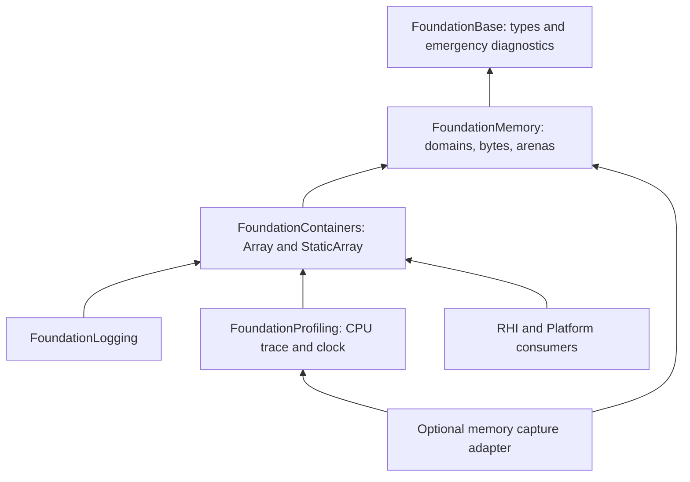
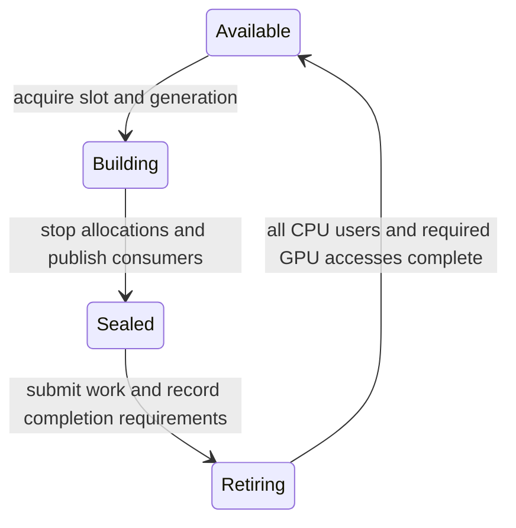

# Ludus Memory Management Architecture

**Status:** Proposed implementation contract; no allocator is implemented by this document.

**Audit baseline:** Original audit at `07cf666` (2026-09-24); independent adversarial review against `d4a84ca`, including the foundational-header change. Concurrent uncommitted RHI/build work is outside this document's implementation scope.

**Decision record:** [ADR 0008](../decisions/0008-memory-management.md).

**Review:** [Independent adversarial review](memory-management-review.md). Corrections below define the revised contract; review findings are not claims that production code has been repaired.

**Scope:** CPU memory ownership, allocation, observation, and lifetime management. GPU memory allocation remains an RHI concern.

This design follows [AGENTS.md](../../AGENTS.md), the [steering rules](../../.kiro/steering/coding-standards.md), [ADR 0003](../decisions/0003-standard-library-usage-policy.md), the [container design](containers.md), and the [final profiling design](profiling-final.md). Source wins where older design documents describe systems that have not shipped. API declarations below specify future contracts; they are not implementation patches or claims that the APIs already exist.

## Contents

1. [Executive summary](#1-executive-summary)
2. [Existing Ludus allocation audit](#2-existing-ludus-allocation-audit)
3. [Requirements](#3-requirements)
4. [Literature synthesis](#4-literature-synthesis)
5. [Architecture alternatives](#5-architecture-alternatives)
6. [Final architecture](#6-final-architecture)
7. [API design](#7-api-design)
8. [Specialized allocator decisions](#8-specialized-allocator-decisions)
9. [Frame and transient allocation](#9-frame-and-transient-allocation)
10. [Container integration](#10-container-integration)
11. [Tracking and profiling](#11-tracking-and-profiling)
12. [Debugging strategy](#12-debugging-strategy)
13. [Threading model](#13-threading-model)
14. [Platform strategy](#14-platform-strategy)
15. [Performance and benchmarks](#15-performance-and-benchmarks)
16. [Architecture decision records](#16-architecture-decision-records)
17. [Implementation phases](#17-implementation-phases)
18. [Explicit non-goals](#18-explicit-non-goals)
19. [Risks and unresolved questions](#19-risks-and-unresolved-questions)

## 1. Executive summary

Ludus needs an explicit, measurable allocation boundary before it needs an allocator algorithm. Its current workloads are small but already expose real requirements: alignment-aware container growth, recoverable infrastructure allocation, process and thread lifetime coordination, and ownership that survives a change of thread or subsystem.

Select the **system allocator as the initial general-purpose backend**, behind a small `FoundationMemory` module. Benchmark an explicitly called, pinned mimalloc backend against it. Change the default only when representative Ludus measurements demonstrate a material benefit within memory and latency budgets. Do not write a Ludus replacement for malloc.

Use an immutable **allocation domain** to bind backend identity and subsystem attribution. A domain is a stable accounting and ownership handle, not a private physical heap. Keep allocation failure explicit, preserve the existing `Array` allocation seam, and add one domain pointer to `Array` when subsystem attribution lands. All allocations are freed through their original domain. Do not override global C++ allocation functions or intercept malloc in the engine/SDK.

Reduce allocation traffic first: reserve and reuse `Array` capacity, keep inline `StaticArray` where bounds are known, and retain the logger/profiler's bounded producer buffers. Introduce one non-growing, single-owner `LinearArena` for a demonstrated scoped scratch workload. A future frame-storage owner may compose those arenas with CPU completion and GPU retirement; a frame number alone never authorizes reset. Do not introduce a pool, slab, TLS heap, stack allocator, or virtual-memory arena without a measured consumer.

Keep domain totals independent of capture and accept their cost only after measurement. Rich allocation identity, call sites, stacks, and live-allocation validation are opt-in. Integrate memory capture with the existing profiler's clock, session coordination, and external viewers, using a distinct memory stream whose overflow invalidates reconstruction. Preserve ASan/UBSan and the allocation-free FoundationBase failure path.

There are **no allocator-performance results from this task**. The recommendation is a baseline and a decision process, not a claim that the system allocator is fastest. Immediate correctness prerequisites discovered by the audit are recorded below; this documentation-only task leaves their implementation to independently reviewable changes.

## 2. Existing Ludus allocation audit

### 2.1 Coverage and evidence rules

The audit inventoried the entire repository, including hidden configuration, `.kiro`, documentation, tests, tools, ignored references, and generated build/dependency locations. Searches covered allocation/deallocation, placement construction, alignment, ownership, standard containers, threading, VM calls, shared-library declarations, exceptions, RTTI, and graphics lifetimes. Generated `out/`/`build/` artifacts and downloaded dependency implementations are distinguished from maintained Ludus source; they do not establish first-party architecture. Literature inventory included ignored files, not just `git ls-files`.

The reviewed maintained surfaces are `modules/foundation/{base,containers,logging,profiling}`, `modules/platform`, `modules/graphics/rhi`, `apps/smoke`, `tools/diagnostics`, `tests`, CMake/configuration/CI/scripts, all existing ADRs, relevant architecture plans, and Kiro specifications. There is no hidden production allocator or allocator-aware STL framework elsewhere in the tree. The pre-existing `.gitignore` modification is unrelated to this design. Concurrent working-tree RHI edits observed during final review add physical-device enumeration/metadata arrays and validation configuration; those edits are outside this task. They fit the startup/resource-metadata requirements here, but the audit statements below are pinned to the named commit rather than a moving work in progress.

### 2.2 Allocation and ownership map

| Surface and source evidence | Actual allocation/lifetime behavior | Architectural consequence |
| --- | --- | --- |
| [`Array`](../../modules/foundation/containers/include/ludus/foundation/containers/array.hpp), [`array_support.cpp`](../../modules/foundation/containers/src/array_support.cpp) | Three words: pointer, size, capacity. `AllocateBytes` calls aligned nothrow global new; `FreeBytes` calls matching aligned delete and currently ignores byte count. No allocator state or tag. | This is the first migration seam. Preserve alignment, byte-size knowledge, and fallible versus fatal policy. Changing the backend alone requires no container-call-site rewrite. |
| `Array` growth and modifiers | Append growth is 2x with a roughly cache-line-sized minimum allocation; `EnsureCapacity` requests an exact minimum through `ReallocateTo`. `Clear` destroys elements and retains storage; `TrimCapacity` is best effort. Reallocation allocates replacement, relocates live elements, then frees old storage. | Reserve/reuse before arenas. Record capacity bytes separately from live element bytes. Do not replace object relocation with raw realloc. |
| [`StaticArray`](../../modules/foundation/containers/include/ludus/foundation/containers/static_array.hpp) | Inline fixed-size owning storage, not a dynamically sized fixed-capacity vector. | It needs no allocator parameter. Avoid inventing one for API symmetry. |
| [`contiguous_storage.hpp`](../../modules/foundation/containers/include/ludus/foundation/containers/detail/contiguous_storage.hpp), [`relocation.hpp`](../../modules/foundation/containers/include/ludus/foundation/containers/relocation.hpp) | Placement construction, explicit destruction, overlap-sensitive relocation, compiler-assisted/opt-in relocatability. Template support is installed because public templates need it. | Memory returns raw storage; existing container code retains responsibility for C++ object lifetime. Distinguish installed template support from private backend headers. |
| [`pointer.hpp`](../../modules/foundation/base/include/ludus/foundation/base/pointer.hpp) | `UniquePtr` uses a default `delete` deleter. Factories hand it a raw lvalue pointer, which it nulls. It lives in Base. | Raw storage obtained from the new API must never enter the current default deleter. Keep Base independent of Memory. |
| [`logger.cpp`](../../modules/foundation/logging/src/logger.cpp), [`backend.cpp`](../../modules/foundation/logging/src/internal/backend.cpp) | Logger state owns `Array<UniquePtr<ILogSink>>`, worker state, and fixed registries. Sink factories use ordinary `new`; `std::make_unique` owns the async backend, which embeds its fixed MPSC queue. A dispatch mutex gates sink access and shutdown; optional flush/async workers exist. | Setup is a real allocation consumer; producer formatting/queueing should remain bounded. Shutdown must drain users before freeing storage. `-fno-exceptions` does not make ordinary new or `std::thread` creation recoverable. |
| [Logging sinks](../../modules/foundation/logging/src/sinks/file_sink.cpp) and [formatter](../../modules/foundation/logging/src/formatter.cpp) | `std::string` remains for path and scratch buffers; filesystem enumeration/session retention uses Ludus arrays. Producer formatting is bounded and custom; file naming/rotation still uses `std::format`. | Domain attribution for an `Array<std::string>` covers the outer buffer only. String/OS/stdio allocations remain separately attributable or unknown until explicitly migrated. |
| [`recorder.cpp`](../../modules/foundation/profiling/src/recorder.cpp), [`trace_chunk.hpp`](../../modules/foundation/profiling/src/internal/trace_chunk.hpp) | A process recorder allocates one `calloc` chunk slab, placement-constructs `TraceChunk`s, and eventually frees the slab. Chunks have 64-byte alignment and 4096 24-byte events (about 96 KiB plus header per chunk). TLS producers borrow chunks. | A clear large, aligned, setup-time allocation; do not allocate each event. Fix alignment and prove completion before reusing this machinery. |
| [`export_perfetto.cpp`](../../modules/foundation/profiling/src/export_perfetto.cpp) | Offline export gathers/sorts records in `Array`s and builds output in `std::string`. There is no continuous collector thread in the shipped MVP. | Export is a cold, potentially large allocation workload. It must not recursively feed the capture it exports. Streaming export can be evaluated independently. |
| [Base diagnostics](../../modules/foundation/base/src/diagnostic_output.cpp) and [assertions](../../modules/foundation/base/src/assert.cpp) | Bounded diagnostic records, atomics, native byte output; no normal logger dependency. Startup transport is configured by [`tools/diagnostics`](../../tools/diagnostics/src/session.cpp). | Allocation failure must use this independent path after releasing allocator/tracker locks. Do not put Memory or normal logging below Base. |
| [Wayland](../../modules/platform/src/window_wayland.cpp), [headless](../../modules/platform/src/window_headless.cpp), [public window API](../../modules/platform/include/ludus/platform/base/window.h) | Window objects use nothrow new, owned through `UniquePtr`; names use `std::string`. Wayland proxy/display resources have their library destroy/disconnect operations. Public factories return ownership through an out-parameter. | Preserve creator-specific destruction. C++ window ownership and Wayland resource ownership are different contracts. |
| [`rhi.cpp`](../../modules/graphics/rhi/src/rhi.cpp) | Volk initialization, Vulkan version/extension enumeration, local arrays (including `Array<std::string>`), global `VkInstance` state, create/destroy with null allocation callbacks. | Current CPU allocation is startup enumeration and names. Vulkan/driver memory is untracked third-party memory; it is not GPU allocation telemetry. |
| [`apps/smoke/main.cpp`](../../apps/smoke/main.cpp) | Diagnostic session → logging → CPU capture → RHI → window manager/window → serial event loop → trace export → RHI/logging shutdown. Local RAII objects destruct after explicit shutdown calls. | No engine-wide memory shutdown may invalidate later local/static/TLS destruction. The current event loop does not justify a frame arena. |
| [Container allocation tests](../../modules/foundation/containers/tests/allocation_tests.cpp), [assertion interposer](../../modules/foundation/base/tests/assert_allocation_interposer.cpp) | Allocation counting/failure machinery and C allocator interposition exist in isolated test binaries. These tests are excluded in sanitizer combinations that intercept the same symbols. | Reuse the testing intent, not their process-wide interception as engine policy. Build a domain/backend failure injector for future memory tests. |

The full production-source search found no remaining `std::vector` or `std::unordered_map` use; comparison benchmarks still use STL. `std::string`, filesystem facilities, standard threading internals, libc, and native libraries still allocate. There is no first-party production realloc path or OS virtual-memory allocator. Occurrences of `= delete`, comments, tests, and third-party/generated code were not counted as engine allocation sites.

### 2.3 Actual system maturity

There is no job scheduler, render thread, logical Vulkan device, swapchain, command submission, render graph, resource database, asset streaming, world/scene system, ECS, editor, plugin loader, or hot reload in maintained production code. Milestone documents include plans; the root README still describes an earlier skeleton. Neither is evidence that those systems exist.

The build uses C++23 without extensions, target-based CMake/Ninja, Conan-pinned Volk and Catch2, and static engine libraries. [Base CMake](../../modules/foundation/base/CMakeLists.txt) currently rejects non-Linux/non-Clang builds. Ubuntu 24.04/Clang 18 is the reference environment. Windows/macOS compatibility here is architectural intent, not a claim of validated ports. Tool versions live in [`config/tool_versions.json`](../../config/tool_versions.json).

[ADR 0007](../decisions/0007-foundational-core-header.md) now establishes `core.h` and the explicit include boundary. Memory is an opt-in facility above that boundary: never add it, its tags, or a vendor allocator to `core.h` or the PCH. New public headers must compile independently with PCH disabled and satisfy the foundational-include and parse-budget gates.

Exceptions are disabled for engine targets and enabled only for appropriate tests through `ludus_enable_test_exceptions`. **RTTI is not currently disabled by build flags**; older profiler prose suggesting otherwise is not an enforced policy. This design requires neither RTTI nor exceptions and does not introduce a separate RTTI-policy change.

Debug/Development/Profile/Release are explicit engine flavors. ASan, UBSan, TSan, coverage, header parse budgets, warnings-as-errors, format/tidy, and installed-SDK variant checks already exist. ASan and TSan are mutually exclusive. Memory settings must extend this model, not use consumer-defined `NDEBUG` as ABI policy. See [`EngineBuildFlavor.cmake`](../../cmake/EngineBuildFlavor.cmake), [`EngineSanitizers.cmake`](../../cmake/EngineSanitizers.cmake), and [CI](../../.github/workflows/ci.yml).

### 2.4 Correctness prerequisites discovered during the audit

These are implementation follow-ups, not changes made by this document:

1. **Trace slab alignment:** `calloc` does not portably supply `alignof(TraceChunk) == 64`. Its placement construction needs a matching explicitly aligned allocation/free pair and checked size arithmetic. Apparent success on one heap layout is insufficient.
2. **Container self-aliasing:** an external temporary probe built with pinned Clang 18 and ASan/UBSan reproduced use-after-free for a full `Array<int>` followed by `Resize(2, array[0])`. `TryResizeImpl` grows/frees storage before consuming the fill reference. Add this regression before migration. `TryAddInPlace` also materializes arguments before allocation; a self-move argument can mutate an element before a later allocation failure. The advertised unchanged-on-failure guarantee needs precise tests and wording for argument side effects.
3. **Stateful unique ownership:** current `UniquePtr` move assignment overwrites its owned pointer without destroying it; moves and swap transfer pointers without deleter state. The public alias exposes no deleter parameter, and the deleter constraint checks `DefaultDeleter` rather than adequately validating supplied state. Repair and test this before introducing an allocator-aware deleter. An allocator swap cannot fix lost ownership.
4. **Capture quiescence:** the current `EndCapture` disarms recording; it is not a join of all TLS producers. Generation comparison helps reject stale handles but does not synchronize reclamation. Audit `ChunkStack` recycling/multiple consumers, including ABA/reclamation and publication ordering, before claiming it supports memory recording. Never infer a concurrency proof from comments saying lock-free.
5. **Infrastructure OOM:** ordinary sink new, string allocation, some array operations, and standard thread construction can still terminate despite surrounding `noexcept`/boolean APIs. Migrate only the paths with an explicit recoverable policy; do not claim that a new backend makes the whole engine OOM-safe.

## 3. Requirements

| Allocation class | Needed now | Architecture should permit later | Do not build yet |
| --- | --- | --- | --- |
| General/engine lifetime | Aligned, fallible raw storage; matched free; outer-container attribution; stable availability before logger init and after shutdown | Platform-specific measured backend default; owning SDK callbacks | Custom malloc algorithm; runtime backend replacement |
| Function/startup scratch | Stack locals, `StaticArray`, reserve/reuse existing arrays | A bounded explicit scratch scope for enumeration/build data when measured | Implicit TLS current allocator or universal scratch service |
| Profiling/logging infrastructure | Fixed producer storage; recoverable setup failure; precise shutdown; untracked capture buffers | Bounded long-running collector and domain gauges | Per-event heap allocation; tracker calling logger |
| Frame/transient/render build | No demonstrated per-frame dynamic workload today | CPU work arenas owned by explicit completion domains; packet/build scratch | Frame allocator wired into the empty event loop |
| Resource metadata and GPU-adjacent CPU data | Vulkan extension/name setup, correct foreign ownership | Persistent CPU resource tables, command-build arrays, upload bookkeeping | Treating CPU malloc as a GPU allocator |
| GPU-visible upload/readback | No current device allocations | RHI-owned rings retired by queue fence/timeline completion | Reclaiming GPU-visible bytes on a CPU frame marker |
| World/scene/resource lifetime | No current world/asset system | Explicit region owner after destructor and escape rules are known | Generic scene arenas, compaction, relocation handles |
| Streaming | No current streaming workload | Fallible budgets, backpressure, large aligned I/O buffers, explicit transfer of ownership | Streaming heaps or automatic cache eviction in Memory |
| Fixed-size objects | Existing fixed trace chunks and bounded queues | A local pool if object density/churn is a measured bottleneck | General pool/slab/freelist library for every type |
| Large/highly aligned | Trace slab and over-aligned containers; checked `usize` arithmetic | Stable-address VM regions where reservation/growth is necessary | Arbitrary large-allocation thresholds, huge pages by default |
| Thread-local/job lifetime | Cross-thread frees for general domains; no TLS owner dependence | Worker-owned scratch and task-owned arenas when jobs can migrate | Thread-local general heaps, fiber-local allocator routing |
| Debug metadata | Failure injection and sanitizer coverage | Bounded ledger, lifetime IDs, call sites/stacks, optional guards | Mandatory release allocation headers/stacks |
| Third-party | Keep native allocation/destruction pairs; record coverage gaps | Per-library callback adapter where useful and supported | Macro rewriting malloc/new throughout dependency headers |

Hard contracts are correctness, explicit ownership, checked arithmetic/alignment, exception-free failure, no new producer-path allocations in bounded infrastructure, and honest measurement coverage. Numeric performance budgets are proposed gates in §15, not facts inferred from the current tiny engine.

Memory pressure is a caller policy. Resource loading may reject work; logging may disable a sink; capture may refuse to start. Memory must not call arbitrary reclamation callbacks, retry indefinitely, emit recursive logs, or silently switch allocators on OOM.

## 4. Literature synthesis

The seven requested Game Programming Gems/Game Engine Gems chapters are present and were reviewed in full. GPG1/GPG4 required visual review of rendered scans. Graphics Gems I/III are absent: Hill's complete chapter was recovered externally and checked against the official companion code; Hultquist's text was not recovered. The combined repository TOC is a bibliographic inventory, not proof that every volume is supplied. PDF page numbers below are one-based viewer pages; omissions in these scans make offsets vary.

| Reading | Verified location | Scope |
|---|---|---|
| James Boer, Resource and Memory Management | [GPG1](../../references/Game%20Programming%20Gems%201.pdf) §1.7, printed 80–87; PDF 78–85 | Full local chapter |
| Steven Ranck, Frame-Based Memory Allocation | GPG1 §1.9, printed 92–100; PDF 90–98 | Full local chapter |
| Peter Dalton, A Drop-in Debug Memory Manager | [GPG2](../../references/Game%20Programming%20Gems%202.pdf) §1.10, printed 66–73; PDF 63–70 | Full local chapter |
| Paul Glinker, Fight Memory Fragmentation with Templated Freelists | [GPG4](../../references/Game%20Programming%20Gems%204.pdf) §1.5, printed 43–49; PDF 59–65 | Full local chapter; blank 50 omitted |
| Steve Rabin, Game Optimization through the Lens of Memory and Data Access | [GPG8](../../references/Game%20Programming%20Gems%208.pdf) §4.4, printed 385–392; PDF 400–407 | Full local chapter |
| Ricky Lung, Design and Implementation of an In-Game Memory Profiler | GPG8 §4.6, printed 402–408; PDF 417–423 | Full local chapter |
| Jason Hughes, A Highly Optimized Portable Memory Manager | [GEG2](../../references/Game%20Engine%20Gems%202.pdf) ch. 26, printed 415–432; PDF 431–448 | Full local chapter |
| Jeff Hultquist, Memory Allocation in C | Graphics Gems I, printed 643 | Bibliographic verification only |
| Steve Hill, A Simple Fast Memory Allocator | Graphics Gems III §II.2, printed 49–50; companion code 448–451 | Full prose recovered externally, checked with official companion code |

### 4.1 Boer: resource residency belongs above allocation

The resource manager retains handles and metadata while evicting/recreating large payloads according to priority, recency, size and a budget. Lock counts prevent eviction during use; ReserveMemory admits a load before allocating its payload. This remains relevant to future streaming: stable identity, explicit pins, admission budgets and eviction/reload statistics are useful.

The illustrative synchronous GetResource can reload data and invalidate a previously returned pointer on the next manager call. Untyped countdown handles, manually balanced locks, an inheritance-heavy resource hierarchy and scattered map entries are not necessary today. Ignoring metadata in accounting understates footprint; insert-then-evict transiently exceeds budgets. Future resource handles need explicit generation/ownership conventions and asynchronous states; Ludus has no general resource-handle system today. The CPU byte allocator must never decide which GPU/resource payload is safe to evict or synchronously reload an asset during allocation failure.

### 4.2 Ranck: a “frame” is a checkpoint

This chapter's frame is a saved stack cursor, **not a rendered frame**. A single startup block grows from both ends; checkpoints roll back subsequent allocations during level loading, failure cleanup and grouped teardown. Explicit failures and grouped lifetimes remain useful.

Do not import its global two-ended heap, pointer-to-unsigned-int casts, signed sizes, unchecked alignment arithmetic or raw marker validation. Pointer ordering alone cannot detect stale markers after storage reuse; C++ destructor and concurrent-use contracts are absent. Retain the small bump/region principle with explicit owners and scoped, validated rollback where justified. Modern rendering slots, asynchronous jobs and GPU retirement require a separate completion contract; this chapter provides no evidence for a particular number of frames in flight.

### 4.3 Dalton: retain diagnostics, reject macro interception

The debug manager records live allocation provenance and allocation family in a hash table, adds guard/fill patterns and reports survivors at exit. Source attribution, high-water marks, ownership checks and optional expensive investigations remain valuable.

Replacing new/delete/malloc tokens with macros is brittle around placement construction, standard headers and third-party code; it cannot guarantee whole-process coverage. Static-header/atexit initialization does not solve arbitrary module lifetime. The examples assume 32-bit long and truncate filenames/line numbers. Guard checks discover only some overwrites when inspected; unchanged fill patterns do not prove that bytes were unused. An exit survivor is not automatically a leak.

Ludus should prefer ASan/UBSan and explicit allocation events, with optional bounded provenance tables and targeted guard/quarantine diagnostics. Recorder bootstrap storage must bypass its own observer; diagnostics must not allocate through normal logging during OOM. Capture coverage and shutdown phase must accompany leak reports.

### 4.4 Glinker: a pool needs a particular workload

The fixed array of T plus a pointer-stack free list serves homogeneous objects quickly and groups storage. Objects are constructed once and reused through Reset. Per-container ownership can improve locality compared with a global pool for each type.

This construction-once cache is not interchangeable with raw storage allocation or ordinary RAII. Fixed capacity, pointer-stack overhead, stranded slots, weak duplicate/interior-free checks and absent synchronization are real costs. Intrusively overwriting the first four bytes risks object lifetime/vptr corruption and assumes 32-bit pointers. Modern general heaps already specialize size classes; a pool does not guarantee traversal locality.

Defer generic pooling until a measured stable-address, homogeneous workload warrants it. Prefer dense data and handles when possible; a later typed pool must define construction/destruction, exhaustion, occupancy validation and ownership explicitly. Reject the article's blanket recommendation to apply free lists everywhere.

### 4.5 Rabin: measure data access as well as allocation

The durable lessons are profiling before optimizing, reducing working-set size, contiguous traversal, avoiding redundant passes, hot/cold separation and measuring code size. These inform current Array benchmarks and future hash-table, command-building and resource-metadata layout choices; no HashMap is implemented today.

Historical cache tables and cycle anecdotes are not current platform facts. bool is not universally 4 bytes; bitfields can impose read-modify-write costs, false sharing and ABI dependence. deque is segmented, L2 misses need not reach DRAM, and cache locking is platform-specific. Blind prefetching may waste bandwidth or form invalid accesses. Verify real layouts and numerical precision requirements before shrinking fields.

Reserve/reuse, allocation density, capacity waste and full operation latency therefore take priority over Alloc/Free nanoseconds. Measure cache/working-set changes before adopting pools, padding or software prefetch.

### 4.6 Lung: allocation history needs origin attribution

Lung separates collection, attribution and presentation. A function's entry/exit memory delta cannot explain allocations freed elsewhere. The profiler records an allocation's origin scope and later charges the free to that scope; per-thread call trees connect memory with CPU structure. Its table distinguishes inclusive/exclusive live counts and bytes from allocations per frame and calls per frame. These are different questions: low live memory can coexist with heavy allocation churn.

TLS supplies current/root scopes. Cross-thread frees explicitly update the originating tree under its critical section. Inclusive totals are derived when reporting, and a remote client shares concepts/code with a CPU profiler. Retain origin ownership, flow-versus-stock metrics and one CPU/memory timeline.

Reject executable x86 prologue patching and trampolines: instruction relocation, CRT/loader behavior, executable-memory policies and sanitizer interposition make them a poor portable engine boundary. The illustrative pointer-plus-int allocation prefix breaks alignment on common 64-bit ABIs, truncates sizes and omits complete failure/reallocation semantics. String-literal addresses are not durable scope IDs across modules/captures. Per-origin-tree locking can serialize remote frees; thread exit cannot destroy scope metadata while allocations still refer to it.

The Ludus adaptation is explicit successful-allocation/free/resize/reset events with stable IDs, allocator/category, size, thread, time/frame stamp and optional shared CPU scope/stack attribution. Bounded per-thread recording buffers use independently budgeted storage; expensive symbolization and inclusive aggregation happen away from allocation. No observer recursively grows storage or blocks a render worker on its consumer. Dropped events, late capture start and unobserved third-party allocation are explicit coverage limits.

Draining buffers can observe a cross-thread free before its allocation; address reuse also confuses pointer-only correlation. IDs/order reconciliation and consistent snapshots are required. Arena backing allocations and logical suballocations must not be summed as separate physical memory, and reset is a logical retirement event. This is a memory stream for Ludus's profiler, not a new mandatory in-game server/UI or Foundation-to-profiler dependency cycle.

### 4.7 Hughes: useful allocator criteria, insufficient evidence to replace malloc

The design uses small-allocation pages containing equal-size slots, medium granules with free/end bitmaps, available/full page lists, largest-run buckets and an OSAPI backing/ownership layer. Small/medium/large thresholds are tunable. Its valuable principles are compact metadata, avoiding pointer-chasing searches, distinguishing internal/external fragmentation, batching OS interaction and replaying real allocation traces. Large allocations may use an existing heap.

Its historical thresholds, 32-bit metadata sizes and cache assumptions are not portable defaults. Bounded bitmap work does not guarantee latency once page faults, backing allocation and concurrency enter; the chapter does not establish a full modern remote-free design. Tail metadata remains corruptible; largest-free-run ratios describe a bounded heap, not every 64-bit allocator. Its static-partition Windows variant can exhaust despite spare space elsewhere. The text itself leaves page management exploratory.

Use these criteria to evaluate system/mimalloc backends and any later specialized pool. They do not justify a Ludus general-purpose segregated allocator without comparative workload evidence.

### 4.8 Hultquist: unresolved source, no invented conclusions

The [official author index](https://www.realtimerendering.com/resources/GraphicsGems/authors.html) and [publisher contents](https://www.sciencedirect.com/book/9780080507538/graphics-gems) verify Jeff Hultquist and printed 643. The volume is absent locally; the official listing offers no companion file, publisher text access failed, and an external electronic edition omits the C appendices. Its technique and merits therefore remain unreviewed. No architecture decision is attributed to it. Supplying that page would close this narrow literature gap without invalidating the independent design evidence.

### 4.9 Hill: regions over an existing heap

The full two-page chapter describes malloc-backed block chains with sequential allocation and either bulk release or reset for reuse. Its ray tracer separates permanent model storage from per-pixel temporaries. It explicitly acknowledges retained residency and only modest whole-program speedup when intersection work dominates. See the [publisher summary](https://www.oreilly.com/library/view/graphics-gems-iii/9780124096738/xhtml/B9780080507552500221.htm) and [official companion source](https://github.com/erich666/GraphicsGems/blob/master/gemsiii/alloc/alloc.c).

Retain owned reusable lifetime regions. Reject global pool switching, four-byte alignment, signed/unchecked sizes, unhandled oversized requests, exit-on-OOM and the companion `AllocFreePool` use-after-free (reading `hdr->next` after free). C++ object destruction and escaped references still require explicit contracts. This supports one small selective arena, not automatic replacement of general allocations.

## 5. Architecture alternatives

### 5.1 General-purpose backend comparison

| Alternative | Strengths | Costs and uncertainties | Decision |
| --- | --- | --- | --- |
| Native malloc/platform heap | No new dependency, familiar tooling and deployment, supported by existing runtimes; supplies a defensible baseline | Platform/version dependent concurrency, retention and fragmentation; no engine tags; not a deterministic real-time guarantee | **Initial default**, wrapped explicitly |
| Normal global new/delete | Familiar object ownership, existing container seam, C++ alignment forms | Ordinary new follows language failure rules; handler/exception behavior is unsuitable as the engine's recoverable raw-storage contract; no tags | Keep existing ownership until migrated; do not make it the new API |
| mimalloc, explicit `mi_*` calls | Mature general-purpose design, aligned API, cross-thread free support, statistics and diagnostic options; can coexist through explicit ownership | Additional pinned dependency/build/license/SDK work, binary and resident cost, platform-specific behavior, sanitizer integration validation; vendor benchmarks are not Ludus evidence | **Primary comparison candidate**, optional backend after Phase 0 |
| Another mature allocator | Could outperform either baseline for a specific workload/platform | Additional matrix and maintenance; no current evidence that evaluating many backends is useful | Consider jemalloc/snmalloc or another candidate only if baseline data exposes a relevant gap |
| Ludus-written general heap | Complete control of algorithms/metadata | Size classes, alignment, fragmentation, concurrency, remote frees, OS policy, security, diagnostics and decades of edge cases become Ludus maintenance | **Reject**: no requirement demonstrated that native/mature allocators cannot meet |
| Specialized lifetime storage over either backend | Removes individual allocations and improves locality where lifetime is known | Escape/destruction hazards, retained capacity, thread/retirement coordination | Select narrowly; never an excuse for a second general heap |

Mimalloc's upstream design uses free-list sharding and reports comparative benchmark results; these support evaluating it, not predicting Ludus wins. Its aligned C API allows explicit integration without changing C++ operators. Current heap APIs distinguish v1/v2 thread-bound allocation heaps from v3 shared heaps; do not copy a version-independent claim about heap thread safety. The initial adapter uses ordinary explicit allocation/free, not custom heaps. [Design paper](https://www.microsoft.com/en-us/research/wp-content/uploads/2019/06/mimalloc-tr-v1.pdf), [aligned API](https://microsoft.github.io/mimalloc/group__aligned.html), [heap contracts](https://microsoft.github.io/mimalloc/group__heap.html).

For an experiment, pin a reviewed release/commit through Conan and its lockfile; do not track a moving branch. Build without standard allocator override, without abort-on-OOM mode, and without unrequested architecture-specific CPU requirements. Keep vendor headers private. Record license obligations (upstream MIT), version, options, static/shared packaging, executable-size delta, and runtime dependencies. Compare normal, diagnostic, and sanitized configurations separately. Upstream supports diagnostic/guarded modes and platform-specific interception, but those options require their own validation; their existence does not justify enabling them globally. [Upstream integration and licensing](https://github.com/microsoft/mimalloc), [build options](https://github.com/microsoft/mimalloc/blob/main3/CMakeLists.txt).

### 5.2 Global allocation interception

**Do not ship global allocation overrides in any normal engine flavor, including Debug/Profile.** Do not export replacement operators from `FoundationMemory` or the SDK. Do not add malloc-family hooks to the engine. Explicit domains cover engine-owned memory; external tooling supplies broader process evidence with coverage labels.

| Form | Decision and correctness considerations |
| --- | --- |
| Scalar `operator new` / `operator delete` | Leave runtime definitions intact. Replacement throwing new cannot legally masquerade as nullable storage; failure/handler contracts matter even when Ludus compiles without exceptions. |
| Array `new[]` / `delete[]` | Leave intact. Cookies, element destruction, allocation elision, class-specific operators, and runtime implementation mean observed calls are not a perfect census of source expressions. |
| Sized delete | Leave intact. A replacement suite must handle both sized and unsized callers; it cannot assume every free carries trustworthy size. |
| Aligned scalar/array new/delete and sized-aligned delete | Leave intact. Any future experiment must cover all matching forms and alignments, not just scalar new. |
| Nothrow variants | Leave intact, including matching construction-failure delete forms. They do not make element constructors fallible or prevent arbitrary user new-handler behavior. |
| Placement new/delete | Never intercept; these express construction in supplied storage, not allocation ownership. |
| Class-specific allocation | Remains the class/library contract; global replacement does not guarantee coverage. |
| malloc/calloc/realloc/free, aligned variants | No engine interposition, preload dependency, binary patch, or macro rewrite. Realloc/zero-size/overflow and CRT pairing rules need independent treatment. |

The C++ language defines replaceable forms and their required behavior; a small pair of replacements is not a complete implementation. [C++ allocation/deallocation contracts](https://eel.is/c++draft/new.delete).

Reasons: process-global overrides obscure foreign ownership, can run during static initialization and after logging shutdown, can recurse while allocating their own metadata, interact with sanitizer interceptors, and have different linking behavior on ELF, Mach-O, and Windows CRTs. They also cannot see every driver allocation or establish semantic tags automatically. A partial census pretending to be complete is worse than explicit coverage.

Retain isolated allocation-observation tests. An external heap profiler or a separate developer experiment may interpose according to its platform contract; label the result, keep it outside the SDK, do not combine competing interceptors, and test bootstrap/shutdown plus all allocation forms. Such an experiment is not an alternate production ownership API. Revisit only if measured coverage requirements cannot be met through explicit callbacks and available tools.

## 6. Final architecture

### 6.1 Dependencies



Arrows mean depends on. Existing direct Base dependencies remain. The capture adapter initially lives in private profiling source and becomes a separate target only if link-size or lifecycle isolation requires it. Memory stores an internal observer interface, but does not link to Profiling/Logging. Backend and later OS VM implementation are private parts of Memory, not eight new modules.

### 6.2 Responsibilities and contracts

| Component | Public/internal surface | Ownership, lifetime, threading | Failure and build behavior |
| --- | --- | --- | --- |
| Private general backend | Internal `Allocate`/`Free`; optional supported-byte-resize capability. No public vendor type. | One backend selected per linked Memory runtime at build time; process lifetime; concurrent allocation/free supported. | Null on failure; no new handler, logger, capture allocation, or abort policy. System in baseline/sanitizer jobs. |
| Allocation domains and byte API | `AllocationDomain`, `AllocationLayout`, `TryAllocateBytes`, `FreeBytes`, `TryReallocateBytes`, domain registration/query | Domains bind immutable backend identity and tag; registry storage is stable until process exit. General allocations individually freeable, including from another thread. | Checked layout, explicit nullable/status results, low-cost counters; no universal allocation prefix. |
| Linear arena | `LinearArena`, `ScratchScope`; internal checked bump/alignment arithmetic | Caller supplies backing bytes and proves their lifetime; one active owner; no concurrent allocate/reset. Arena does not pretend to be a heap domain. | Fixed capacity, failure preserves cursor, explicit rewind/reset. Optional debug generation/poison; no backend calls after initialization. |
| Containers and typed ownership | Existing `Array`/`StaticArray`; optional domain constructor; later exact-type creation/deletion helper | Container owns object lifetime and raw block; domain accompanies storage; views borrow. | Existing fallible/fatal division; template bodies stay small, backend code out of line. |
| Totals and validation | Domain stats, private optional live ledger | Counters belong to stable domains; ledger storage preallocated and excluded from recursive observation. | Totals usable without capture; optional ledger/canaries by SDK-owned mode. Exhaustion marks coverage incomplete. |
| Memory capture adapter | Capture controls in profiling control header; internal noexcept event sink | Session owns bounded buffers and metadata; no callbacks after synchronized detach. Allocation origins outlive allocating threads. | Capture failure never fails an engine allocation; loss marks history incomplete. No tracing code in ordinary Release. |
| Later VM support | Private OS functions initially; expose opaque reservation only for a concrete stable-address consumer | Reservation owns address range; page operations serialized by owner; no dependency on the window platform module. | Fallible operations and explicit capabilities; platform metrics retain their meanings. Not required for the initial heap/arena. |

### 6.3 Why an allocation domain exists

A domain answers two necessary questions together: **which allocator runtime must free this block, and which allocation-origin budget receives its accounting?** Routing and identity are immutable; counters are mutable. It does not reserve a heap, segregate size classes, infer object lifetimes, own every engine resource, or expose virtual methods. Initial named domains are Core, Logging, Profiling, Platform, and RHI, plus an explicitly accounted diagnostic/capture-storage domain. Attribution describes the selected allocation origin, not necessarily the subsystem currently holding a moved object.

Start with a bounded registry of named process-lifetime domains; capacity is configuration, not an unbounded dynamic map. A domain may refer to the same physical backend as every other domain. Registration is a cold, synchronized operation. Handle lookup is cached by subsystem initialization; the allocation hot path never hashes strings or registers a domain. Core is available without registration and without static constructors that allocate. Duplicate identical definitions return the same domain; duplicate hashes with different full names are rejected.

General domains are intentionally narrower than an arbitrary allocator interface. Do not accept a no-op-free arena as a domain. If a future individually freeable resource requires another backend implementation, extend the private dispatch contract without changing `Array`'s one-pointer ownership binding. A process-lifetime domain cannot make a shorter-lived backend safe: until explicit lifetime ownership is added, such a backend is ineligible.

### 6.4 Bootstrap and shutdown

The default backend and Core domain must work before `main` and after subsystem shutdown without calling a logger, creating a thread, registering a site, or constructing a heap-backed singleton. Use constant-initialized/static scalar storage for routing and counters. There is no destructive `ShutdownMemory()` for the process heap.

Normal startup is diagnostic transport, optional domain registration/configuration, logging and trace initialization, then engine/platform/RHI consumers. Capture buffers and tables are allocated before attaching an observer. Allocation is still valid if capture setup fails.

Normal shutdown stops admission to work, joins workers, retires frame/resource users, and destroys their owners. For the initial capture protocol, stop/join logging workers and any other Memory producers before detaching capture; do not assume stopping renderer jobs makes the process quiescent. Then seal/export capture. A final domain/ledger snapshot should occur after relevant RAII objects are destroyed. Remaining static-runtime allocations are reported separately, not automatically called leaks. Heap routing, counter storage, registry storage and its synchronization remain usable through late static/TLS destruction; none may be a destructed function-static service. Registered domains cannot disappear on subsystem shutdown.

If quiescence cannot be established, control returns an incomplete/busy result and keeps session state and callback code alive; it must not detach/free and hope producers have stopped. Inability to stop a worker is an owner-lifecycle problem, not permission to unload its module. Repeated sessions reuse the process heap but have fresh capture epochs. Pre-main allocations are valid even when no ledger exists; that fact limits subsequent completeness claims (§11.5).

### 6.5 Build configuration and ABI policy

Introduce configuration only with its implementing phase, using these intended names/contracts:

| Setting | Default and responsibility |
| --- | --- |
| `LUDUS_MEMORY_BACKEND` | `System`; later accepts `Mimalloc` when the dependency is enabled. One choice per SDK/runtime variant, never per translation unit. |
| `LUDUS_MEMORY_VALIDATION` | `OFF`; optional bounded ledger for focused Debug/Development investigation. Sanitizer reference builds do not require a competing guard allocator. |
| `LUDUS_MEMORY_CAPTURE_AVAILABLE` | Generated from flavor: capability in Debug/Development/Profile after Phase 4, compiled out in ordinary Release. Capture remains off at runtime until explicitly started. |
| `LUDUS_MEMORY_POLICY_VERSION` | SDK-generated version bumped for container ownership/layout or public memory contract changes; consumers cannot override it. |
| Registry/ledger/capture capacities | Explicit initialization/configuration budgets, recorded in diagnostics/captures; no unbounded growth or hidden environment-variable tuning. |

Extend `LudusSdkManifest`, generated configuration and variant checks with backend, memory policy, validation/capture capability and sanitizer mode. Public class layouts must agree across every linked consumer. Debug metadata stays behind opaque implementation objects rather than changing a public per-allocation struct by consumer macro. Keep backend choice out of public vendor includes, and install only public headers plus the template support actually needed. An SDK with static mimalloc linkage must export the required dependency or package its implementation correctly; a private CMake link keyword alone does not remove final-link obligations.

The existing install-prefix check prevents mixing installations; it does **not** prove that a precompiled consumer used the same `Array` layout. Require a full rebuild at the layout transition and version the container allocation-seam symbol/signature using the generated memory policy; do not retain the old unversioned symbol as a compatibility alias. Merely adding an extra guard call to new headers cannot reject old objects that never called it. A deliberately stale-header consumer that uses the seam must fail its SDK link test. This checks cooperating builds, not arbitrary foreign C++ objects or all ABI misuse; creator-owned destruction remains necessary across future binary boundaries.

Phase 0/1 must measure all-build domain accounting before enabling it broadly. No shipping profile silently removes accounting while keeping a query that appears exact. A proposed weaker accounting mode is a future contract change with an explicit capability/result flag, not an undocumented optimization.

## 7. API design

### 7.1 Raw storage

Use `ludus::foundation::memory` for subsystem APIs; keep existing `ludus::foundation::core::Array` and its public alias. Use Ludus integer aliases, PascalCase verbs, `[[nodiscard]]`, `noexcept`, and `.hpp` headers. Examples are declarations of the selected contract:

```cpp
struct AllocationLayout final
{
    usize Size;
    usize Alignment;
};

class AllocationDomain; // Opaque, stable, non-copyable implementation object.

[[nodiscard]] AllocationDomain& GetDefaultAllocationDomain() noexcept;
[[nodiscard]] void* TryAllocateBytes(AllocationDomain& domain,
                                     AllocationLayout layout) noexcept;
void FreeBytes(AllocationDomain& domain, void* data,
               AllocationLayout layout) noexcept;

[[nodiscard]] bool TryReallocateBytes(AllocationDomain& domain,
                                      void*& data,
                                      AllocationLayout oldLayout,
                                      usize newSize) noexcept;
```

The first phase needs allocate/free only. Add byte reallocation when an actual adapter/buffer consumes it; this specifies its semantics in advance rather than requiring an unused implementation.

| Case | Required behavior |
| --- | --- |
| Valid nonzero request | Uninitialized storage with C++23 implicit-object-creation semantics equivalent to the current allocation seam; at least requested alignment; no user constructors. Layout size is requested size, not backend usable size. |
| Alignment | Explicit nonzero power of two. Support fundamental and supported extended alignments; normalize native backend minima privately. Reject invalid/unsupported layout with null/false, without invoking the backend. No fixed 16/64-byte assumption. |
| Arithmetic | Check size multiplication, rounding, padding, offsets, additions, and pointer-difference bounds before doing them. No wrapped successful request. |
| Zero size | With valid alignment, return null, no allocation and no live-allocation counter increment; this is a successful empty request. Validate alignment first. Invalid zero-size layout is still rejected, although a pointer result alone cannot distinguish it from an empty success; callers needing that distinction validate layout before requesting. A nonzero null result means failure. |
| Null free | No-op; no counter mutation. |
| Non-null free | Require original domain, exact requested size and alignment, and base pointer. Freeing interior/foreign/already-freed storage is contract violation. Debug lookup validates before dereferencing adjacent memory. |
| Failed allocation | No global new handler; no reclamation callback; no retry loop; no normal logging. Caller decides whether to degrade or fail terminally. |
| Resize of null | Treat as allocate with `newSize` and the supplied alignment; old size must be zero. |
| Resize to zero | Free original storage, set pointer null, return true. |
| Resize success | Preserve `min(oldSize, newSize)` bytes; same alignment/domain; update pointer only on success. No implicit zero-fill. |
| Resize failure | Original pointer, contents, ownership and live counters unchanged; increment optional failure telemetry only. |
| Typed objects | No byte reallocation of live nontrivial objects. `Array` uses its lifetime/relocation code even if a backend provides realloc. |

Implement portable byte resize as allocate-copy-free first, using private backend operations inside one observed resize transaction. Do not recursively call observed public allocate/free and also emit a resize. An in-place/backend-specific optimization needs proof that it preserves alignment, failure atomicity, object lifetime and capture ordering. A successful realloc is one logical resize record with old/new address/layout, not an uncorrelated free/alloc pair. During fallback copy, requested-byte/block accounting charges both successful blocks; at completion one logical allocation remains. This captures accounted resize overlap, not an exact physical-backend peak (§11.2). Record copied bytes and temporary requested size separately from the reconstructed logical lifetime curve. Failed replacement allocation preserves the original counters. Equal-size resize may return unchanged without a backend call or resize event. Moving to another domain is an explicit allocate/copy/free operation, not silent retagging. Invalid new layout is a rejected request; a mismatched supplied old/free layout is an ownership-contract violation.

The Linux/macOS system adapter may use `posix_memalign` with normalized alignment and `free`; benchmark an ordinary malloc fast path for fundamental alignment if it matters. The Windows adapter uses a consistent `_aligned_malloc`/`_aligned_free` pair. Do not guess which free family applies from a pointer. A private C-runtime allocation exemption belongs in ADR 0003 for this implementation boundary; it does not authorize general ad-hoc malloc throughout engine code. New primitive aliases, if needed for address arithmetic, are added only in `types.h`.

**C++ storage lifetime is part of the backend adapter contract.** `Array` performs typed pointer arithmetic in storage before constructing each element. Standard allocation functions provide implicit object creation; a nonstandard aligned C/vendor API cannot inherit that guarantee merely by returning aligned bytes. Normalize its successful result through a standard nonallocating placement-new operation and return the resulting suitable pointer, or document an equally sound C++23 implementation guarantee. This bridge calls no allocating global replacement, runs no user constructor, and changes neither the address nor the matched free family. Element construction/destruction remains in Containers; do not use a C++26 relocation rule to justify C++23 behavior. Review the language proof as well as over-aligned/nontrivial-element tests; sanitizer silence alone does not establish lifetime correctness. [C++23 object creation](https://timsong-cpp.github.io/cppwp/n4950/intro.object), [standard C allocation semantics](https://timsong-cpp.github.io/cppwp/n4950/c.malloc).

### 7.2 Tags, sites, and statistics

```cpp
struct MemoryTag final
{
    uint32 Id;             // Stable hash, validated against the complete name.
    std::string_view Name; // Borrowed process-lifetime literal for static tags.
};

[[nodiscard]] bool TryRegisterAllocationDomain(MemoryTag tag,
                                               AllocationDomain*& result) noexcept;
[[nodiscard]] MemoryUsage GetMemoryUsage(const AllocationDomain& domain) noexcept;
```

Define tags with a constexpr/consteval helper consistent with logging categories and profiling zones. Registration stores/validates names in a bounded table and never retains a transient string view. Dynamic/plugin names, if later needed, require an owned bounded copy and no ID reuse within a capture. Failed registration leaves `result` unchanged; startup can explicitly choose Core/Unknown attribution and record that fallback. Never silently manufacture a per-frame domain.

`MemoryUsage` reports live requested bytes, live allocation count, per-domain high-water requested bytes, and validity/coverage. Profile mode adds allocation/free traffic and failures by interval. Backend-reserved/committed/usable metrics are a separate optional result with availability flags; unsupported is not zero. Details appear in §11.

Size/alignment are always explicit; backend identity and tag come from the domain. Do not also pass subsystem name, allocator name, debug string, tag and domain on every request. File/line, context and stack are opt-in capture data. A separate capture-enabled macro or thin overload supplies a cached site ID to a private entry point; ordinary Release signatures and emitted calls carry no `source_location`, stack walk, or debug-name string. Allocation-site context is recorded at allocation and never inferred from the freeing thread.

### 7.3 Construction and destruction

Keep raw storage and object lifetime separate. When an object migration warrants it, prefer `TryCreateOwned<T>(domain, args...)`, returning the existing `UniquePtr` with a Memory deleter carrying the domain. It allocates `sizeof(T)` at `alignof(T)`, constructs only a nothrow-constructible and nothrow-destructible exact type, and returns an empty owner on allocation failure. Do not introduce a second smart pointer. Keep raw `TryCreate<T>`/`Destroy<T>` helpers internal until a consumer needs ownership release; this avoids a convenient raw factory feeding the wrong default `delete`. Objects whose initialization can fail expose an explicit initialization/factory result; a `noexcept` constructor that terminates on OOM is not a recoverable factory.

`Destroy<T>(domain, pointer)` requires the exact originating type, original base address and domain as preconditions, destroys T, and frees its original layout. A raw pointer helper cannot generally detect an incorrect base-type cast, even for nonpolymorphic classes. Initial owning factory adapters therefore forbid converting ownership; do not promise compiler rejection of arbitrary raw-pointer misuse. Do not use `delete` on Memory-created objects. Prefer RAII at call sites, but first repair `UniquePtr` as identified in §2.4. A deleter adapter in Memory can carry the domain without Base depending on Memory. Moving/switching owners must transfer deleter state. Conversions require a creator-supplied destruction function that retains the dynamic type, original allocation address/layout, and domain; they cannot reconstruct those from a base pointer.

Do not add a second general smart-pointer hierarchy. Leave windows/sinks on their existing new/delete pairs until a reviewed factory-and-destruction migration can change both sides together. DLL/plugin boundaries should use creator-owned destroy functions or explicit callback/context pairs; a C++ template name alone is not a stable binary ownership protocol.

### 7.4 Contract failures versus OOM

Allocation exhaustion is expected operational failure and returns status. Proven invalid free, ownership mismatch, or corrupted allocator metadata is an integrity failure: stop the invalid operation and use a terminal FoundationBase `LUDUS_REQUIRE`/`LUDUS_FATAL` path. A missing entry is proof only within a complete ledger covering that allocation lifetime. After coverage loss or in activity-only capture, a missing entry is unvalidated/unknown, not automatically an invalid free; use the caller's original domain/layout under its normal precondition and report reduced validation coverage. Do not rely on resumable `LUDUS_ASSERT` to prevent continuing a corrupt free. Ordinary cold diagnostics can be logged by callers after returning from Memory. Release omits expensive pointer validation but retains checked request arithmetic and documented preconditions; it does not promise to recover from arbitrary memory corruption.

## 8. Specialized allocator decisions

| Technique | Selection and concrete reason | Revisit trigger |
| --- | --- | --- |
| Linear allocator | **One `LinearArena` design**, staged after a measured scratch consumer. A fixed buffer and checked bump pointer remove individual backend operations. | A scoped batch with significant temporary traffic and one provable completion point |
| Arena/region allocator | Use the same linear mechanism for homogeneous lifetime groups; no second generic region framework. | Resource/scene owner with documented escapes and destruction |
| Scratch allocator | **`ScratchScope` over an explicit arena**, not a separate heap algorithm or ambient service. | Nested temporary work needs automatic marker restoration |
| Stack allocator | No separate per-allocation LIFO free API. A nested scope marker already handles the identified use. | A measured consumer truly needs individual reverse-order pops |
| Double-ended stack | Defer; partitioned fixed arenas are simpler and independently budgeted. | Two opposed lifetime regions demonstrably benefit from sharing one capacity limit |
| Frame allocator | Future completion-owned composition of arenas (§9), not a global pointer reset per tick. | Renderer/job producer and real transient data exist |
| Double/triple buffering | Future configurable number of storage slots; no hardcoded 2/3 policy in Memory. | Number of simultaneous CPU/GPU consumers is known |
| Pool allocator | Keep existing local trace chunk/queue storage. No public general pool now. | High churn of stable-address, fixed-size objects where an array/handle design is insufficient |
| Slab allocator | Defer to mature backend; not needed to improve the existing chunk slab. | Measured pool page occupancy, lifetime and reclamation require multiple slabs |
| Free-list allocator | Do not handwrite a variable-size heap. Intrusive free entries may serve a later local pool. | A narrowly scoped fixed-size pool is selected and ownership/alignment are proven |
| Segregated-size allocator | Mature backend responsibility. | Concrete platform constraints defeat mature candidates, with independent review |
| TLS/thread-local arenas | Explicit worker-owned arenas later; TLS may cache access, never define lifetime for migrating work. | A scheduler defines worker/task ownership and nesting |
| VM-backed arena | Defer OS reservation to a stable-address/large-capacity requirement. | Measured resize-copy cost/address stability or large sparse region needs justify it |

`LinearArena` initially borrows a supplied span of bytes; a subsystem owns and frees the backing allocation through its domain. Both `LinearArena` and `ScratchScope` are noncopyable and nonmovable initially, preventing duplicated cursors or rollback ownership. They do not grow implicitly, retain surprise overflow blocks, or fall back to the general heap. Caller policy may separately allocate an exceptional large request, but then it must hold and account for that allocation explicitly.

Borrowing is exclusive for the arena's lifetime: no overlapping arenas or independent owner reuse of the same bytes. Backing remains alive through the arena destructor. Destruction requires no live scopes or users and restores any sanitizer annotations before returning the borrowed range to its owner; it does not free that range. This also applies to stack-supplied backing. Reset/rewind cannot silently continue after a detected active-scope/order violation; use terminal Base contract handling outside internal locks. Raw-pointer escapes remain caller errors in every build.

Proposed operations are `TryAllocateBytes(layout)`, `GetUsedBytes()`, `GetCapacity()`, `GetHighWaterBytes()`, and `Reset()`. `ScratchScope` obtains an internal marker and restores it on destruction. Keep arbitrary externally storable checkpoints out of the first public API. Markers identify arena, reset generation, cursor and independent LIFO scope serial; only the most recent live scope may rewind. Whole-arena reset requires no active scope and advances the reset generation. Nested rewind must preserve valid outer markers; a reset-generation check alone cannot detect every stale pointer from an inner scope. Failed allocation leaves cursor unchanged. Alignment padding counts toward used/high-water bytes. It is incorrect to align the offset without accounting for the actual base address.

The raw arena owns no `T` objects and does not run their destructors on reset. Typed consumers must explicitly begin object lifetime (for example, placement construction), even when using trivial types; a generic byte span is not a typed-object API. Initially allocate byte/trivial scratch data, or use scoped owners declared after the scratch scope so destruction precedes rewind. No implicit destructor registry. Memory that contains locks, native handles, owning strings, or external-resource wrappers is unsuitable for bare reset. Rewind invalidates every allocation after its marker, even if its bytes still look correct.

If a local pool is later justified, it must specify object construction/destruction, slot size/alignment, slab ownership, exhaustion policy, cross-thread-free policy, generation reuse, and whether empty slabs return upstream. A pool's free-list links occupy dead storage only; they cannot alias live object members. Do not implement a lock-free pool before a synchronized reference implementation and adversarial tests. Generation handles may address stale logical IDs; they are not automatic protection for raw pointers.

## 9. Frame and transient allocation

### 9.1 Allocate by completion lifetime

| Lifetime | Appropriate owner | Reclaim condition |
| --- | --- | --- |
| Process | Stable domains/backend, intentional runtime tables | Process exit; optional final reporting |
| Engine session | Explicit owning arrays/objects | All session consumers stopped and owners destroyed |
| Resource/world | General ownership now; future dedicated region only if useful | All references and pending work retired, required destructors complete |
| Function/scratch | Stack, inline array, explicit `ScratchScope` | Lexical scope ends, no outstanding borrow |
| Job | Task-owned scratch if suspended/migrating; worker scratch for non-suspending local work | Job and all borrowed-output consumers complete |
| CPU frame build | Future frame context or render packet owner | Every CPU consumer joins/completes |
| GPU-visible staging/readback | RHI resource/ring allocator | Every queue that can access the bytes has passed retirement values |

The first frame-storage implementation belongs with the renderer/application lifecycle, not a global Foundation singleton. One frame context owns budgeted arenas; worker partitions have one writer each. A separate submission owner retains packets/staging that outlive CPU build. RHI fences, queue timeline values, or equivalent completion tokens are opaque to FoundationMemory.

### 9.2 State and retirement protocol



`Available` means reset has completed and no borrower remains. Slot selection (`frameNumber % slotCount`) locates a candidate only. Acquisition verifies retirement; a busy slot returns a status or waits at a deliberate scheduling point. Allocation itself never waits for the GPU, creates another slot, or silently aliases an older frame. Slow GPUs, paused workers and uneven frame pacing must remain correct for any number of frames in flight.

Before sealing, reserve all required output space or explicitly transfer a separate owner. Sealing closes allocation and publishes immutable views using ordinary release/acquire synchronization or a proven job-completion primitive. A logical borrow count may represent consumers, but zero alone is insufficient unless admission is closed and publication completed. Final retirement includes late consumers registered before sealing. Cancellation retires after its users stop; it is not immediate reset. Device loss/error cleanup must also release or abandon borrowers safely, rather than assuming a successful fence wait.

Pure CPU command-build bytes can retire as soon as the last CPU/driver call permitted to read them finishes. GPU completion is required only where GPU/native API lifetime actually extends access. Conversely, a CPU finish does not authorize reuse of mapped upload bytes. One universal GPU wait would unnecessarily retain all CPU scratch; one universal frame reset would be unsafe. Keep these completion classes separate in the renderer, not as flags guessed by the allocator.

A future double/triple ring is a bounded collection of these contexts. Derive slot count and per-slot capacity from the renderer's configured concurrency and measured high-water distribution; include worst-case retained memory in its budget. When all slots are busy, scheduling backpressure is visible. A deliberate exceptional fallback requires an explicit owner, byte budget and retirement record; it cannot be an invisible arena behavior.

### 9.3 Escapes and debugging

Pass explicit scratch/frame references to builders; never expose `GetGlobalFrameAllocator()`. Views into scratch must not enter persistent resource tables, async callbacks or tasks that outlive the scope. Copy necessary outputs into a resource owner or transfer a packet owner before scope exit. A migrating task carries its scratch owner; it does not reacquire the current worker's TLS arena after suspension.

Debug state records arena/slot ID, generation, owner thread/task and state. Checked transient views can validate generation when a real API needs them, but ordinary `T*` and `std::span` cannot. Do not advertise generation checks as a memory-safety guarantee for escaped raw pointers. Rewind/reset poison invalid ranges under ASan; optional debug quarantine/protected retired pages increase the chance of detecting stale access. Once the same address is reused and unpoisoned, a stale raw pointer may evade ASan; reuse delay and ownership tests remain necessary.

Required future frame tests delay one worker or one GPU completion beyond multiple slot rotations, cross threads, cancel work, destroy the renderer with outstanding packets, and attempt reset with active borrowers. Reset must fail deterministically or wait only at the owner-controlled retirement point. A CPU profiling frame marker records timing; it never performs memory reclamation.

## 10. Container integration

### 10.1 Preserve the current container model

Use the authoritative Ludus names: `Array`, `StaticArray`, `GetSize`, `EnsureCapacity`, `Add`, `AddInPlace`, `Clear`, `TrimCapacity`, `Swap`, `FromRange`, and `AsSpan`. Lowercase range/view interoperability remains; do not introduce STL allocator traits, `std::pmr` container aliases, a `Vector` rename, or allocator template parameters on every container. The latest [container taxonomy amendment](containers.md#34-ludus-native-taxonomy-and-api-authoritative-naming) governs naming even where earlier paragraphs use old spellings. That amendment also restricts first-party `std::vector` to approved benchmark/vendor exceptions more specifically than the older ADR 0003 summary.

First, redirect the existing private `AllocateBytes`/`FreeBytes` seam to the default domain. This preserves `Array`'s current three-word layout and every consumer. Later, add:

```cpp
explicit Array(memory::AllocationDomain& domain) noexcept;
[[nodiscard]] memory::AllocationDomain& GetAllocationDomain() const noexcept;
```

A private domain pointer adds one word: **24 → 32 bytes on the current 64-bit ABI**. The default can encode Core with a null sentinel to preserve trivial initialization, resolving it only through a non-allocating accessor. Measure small/nested arrays and update the existing size test and SDK policy deliberately. This is an explicit ABI change, not a claim of layout compatibility.

Count/fill/domain overloads are unnecessary initially: construct with a domain and use the existing `TryResize`/`TryAddRange` operations. Add convenient overloads only with call-site evidence. No `SetAllocator` on a live container. `StaticArray` and `std::span` remain allocator-free.

### 10.2 Propagation rules

| Operation | Domain and ownership semantics |
| --- | --- |
| Default construction | Core; no heap allocation |
| Explicit-domain construction | Stores stable domain handle; no allocation until capacity is needed |
| Copy construction | Inherit source domain; allocate only copied size, preserving existing behavior |
| Copy assignment | Retain destination domain; reuse its capacity if possible; existing infallible policy remains |
| Move construction | Transfer domain, buffer, size and capacity together |
| Move assignment | Destroy destination elements, free its buffer with its old domain, then transfer all source ownership |
| Moved-from object | Canonical empty storage and Core domain; subsequent reuse is deterministic |
| `Swap` | Swap domain with storage; constant time and noexcept; no allocation/free/retag events |
| `Clear` | Destroy elements, retain storage and domain; live allocation bytes do not decrease |
| `TrimCapacity` | Attempt replacement through same domain; failure keeps old buffer; empty trim frees |
| Explicit cross-domain copy | Construct destination with its domain, then copy through existing operations; no implicit migration |

Domain propagation is **one owner deep**. Constructing `Array<Array<T>>(rhiDomain)` attributes its outer buffer only; default-constructed inner arrays use Core. Copying inner arrays follows their own copy rules. A moved-in array keeps its origin domain for later growth even in a different subsystem. Tests must cover these cases, and profiler labels must say allocation origin. Do not add recursive allocator propagation or ambient tag scopes to make labels follow business ownership.

If a fallible assignment API is later needed, allocate candidate storage in the destination domain before mutating destination or consuming aliased values. No generic promise can undo arbitrary user constructor side effects. The current self-alias/failure defects must be repaired and the supported element contract tested before stating a blanket rollback guarantee.

`Array` passes **capacity × sizeof(T)** and `alignof(T)` to allocation/free. Track element size versus storage capacity in container-specific benchmarks, not by inspecting allocator internals. A million unused `Array` owners cost memory even when their buffers are empty; the domain-word overhead is part of the decision. A stateless default-container variant is rejected initially because it creates parallel public container types; revisit only if owner-object density makes the measured footprint unacceptable.

Do not bind `Array` to a monotonic/no-op-free allocator. Repeated growth would retain abandoned buffers; trimming could consume more arena space; `Clear` would leave a pointer across reset; later destructors could touch invalid storage. Future transient builders can use explicit arena-backed spans/fixed-capacity owners designed with the consuming API. That is a separate lifetime contract, not an alternate default array now.

### 10.3 Migration boundaries

Migrate container storage, trace slabs, and selected engine-owned objects independently. `Array<std::string>` still performs string allocations outside the domain; `std::stable_sort` may allocate auxiliary storage; `std::make_unique` still appears for logging backend ownership. The memory API does not erase these facts. Future String or sort-scratch work needs its own measured rationale and matching ownership conversion.

The seam migration must migrate its tests in the same change. Today's `allocation_tests.cpp` counts global `operator new/delete`; a C backend bypasses those counts, making positive checks fail and zero-allocation checks potentially vacuous. Supply a private test-target counting/failing backend or seam wrapper, retain a positive observation control, and run the resulting contract tests under ASan/UBSan without competing global replacements. Failure injection is test-only; it is not a runtime production backend switch or a public allocator-polymorphism API.

Do not broaden the relocatability trait, change growth factor, replace strings, redesign pointers, and switch backend in one change. Keep the current portable allocate/relocate/free path as the reference. The present 2x growth benchmark is evidence about tested container growth, not a universal optimum for a new allocator.

## 11. Tracking and profiling

### 11.1 One authoritative ownership/accounting source

Memory owns the successful allocation/free boundary. The profiler observes it. Existing [profiling §7](profiling-final.md#7-step-6--memory-profiling-ownership-c4) already separates capacity, activity, lifetime/attribution and allocator efficiency; preserve that model.

This proposal **refines** that section's implementation assumptions: original domain/size/alignment travel with the owner, so free can charge its origin without a mandatory prefix header. Rich origin tokens and lifetime IDs belong to optional live metadata/capture. Domain totals remain available in all builds, subject to their measured cost; whole-process exactness and exact instantaneous summed high-water marks are not implied. These refinements become authoritative on acceptance of ADR 0008.

### 11.2 Metric definitions and coverage

| Question | Metric and interpretation |
| --- | --- |
| How much requested storage is accounted? | Outstanding requested bytes at API accounting boundaries in covered domains, including replacement storage during byte resize. For `Array`, this is buffer capacity, not live element count. It is not instantaneous physical backend usage. |
| How many blocks? | Nonzero blocks not yet handed back at the API free boundary, including transient old/new blocks during fallback resize. A backing arena is one such block; its suballocations are separate optional metrics. Backend retention after free is not a live API block. |
| What traffic occurred? | Allocated bytes/count, freed bytes/count, resize count/copy traffic, failures, and large events per explicitly named time/frame interval. A zero live-byte delta can hide substantial churn. |
| How much storage exists? | Backend usable/retained/committed/reserved bytes where reported, and owned arena backing/used/padding/high-water separately. |
| How much is resident? | Process RSS/working set/physical footprint sampled through platform tools; not equivalent to requested bytes, virtual address space, or commitment. |
| Fragmentation? | Internal rounding/padding where usable sizes are known; arena slack and retained capacity; backend free-space metrics when exposed. RSS minus requested bytes includes unrelated memory and is not an exact fragmentation percentage. |
| Peaks? | Per-domain high-water of the requested-byte accounting history, including accounted resize overlap. This is neither an instantaneous backend peak nor a multi-field atomic snapshot. Process/domain aggregate sampled peaks are labeled sampled; summing historical domain peaks does not produce a simultaneous peak. An allocation-history curve can omit transient resize storage and have a different peak. |
| Leaks/old allocations? | Live identities after a known owner/session boundary, with expected process-lifetime allocations separated. Long-lived is a query, not proof of leak. |

Each snapshot/capture reports backend/version/build mode, included domains, untracked categories, observation window, initial-baseline availability and completeness. CPU stack/static memory, native library heaps, driver allocations, foreign malloc, and GPU device memory are outside domain totals unless explicitly added. An allocation observer can report only what traverses its boundary.

Allocation accounting occurs after backend success and before returning to the caller. Free accounting occurs after validated metadata removal and before invoking backend free, preventing address reuse from racing old lifetime metadata. If a freeing thread pauses here, the backend can still hold bytes that domain gauges have already subtracted. Concurrent allocations can therefore make the true backend peak larger than this high-water. Moving the subtraction afterward merely creates a different observation lag; do not serialize all backend operations to manufacture a stronger metric. At quiescence, valid requested-byte totals reconcile to covered outstanding ownership. Backend/process metrics remain independently sourced.

Avoid double counting: arena backing contributes physical/requested backend bytes once. Logical scratch requests are an internal utilization/activity view, not additional process heap bytes. Likewise resource metadata and GPU allocation sizes are separate categories, even on unified-memory hardware.

### 11.3 Tiers and cost

| Tier | Enabled behavior | Excluded cost |
| --- | --- | --- |
| All normal builds | Stable domain binding; per-domain live bytes/count and requested-byte high-water; fixed metadata capacity; checked allocation inputs | No per-allocation header/table, strings, stack capture, global event sequence or normal logging |
| Debug/Development validation option | Bounded live-pointer ledger from a proven ownership baseline, layout/domain checks with declared coverage, optional allocation ID/site; test-only failure injection | No unconditional guards/quarantine when sanitizer already covers the issue; no assumption that entry to `main` is an empty heap |
| Profile/Development capture capability, idle | Observer attachment state/cheap inactive branch, domain counters | No stack walk, event construction or registration on ordinary inactive allocation |
| Runtime capture active | Bounded allocation/free/resize records, IDs/sites/origins according to selected mode, timestamps/correlation, large-event classification | No on-hook symbolization, unbounded map growth, file I/O or waiting for collector |
| Optional diagnostic experiment | Selected guard pages, quarantines, stack samples or allocator-specific debug mode | Never part of the mandatory Release footprint |

Initial counters use per-domain relaxed atomics, with checked live-byte modification and max update. Use `usize` for request arithmetic and `uint64` for cumulative traffic/IDs. Overflow/underflow must never silently restore a plausible exact number, including in Release: checked updates set a sticky invalid/saturated status; further arithmetic cannot restore validity. Do not reset live gauges while blocks remain. Reestablish exactness only at a proven empty-domain or complete-ledger boundary. Statistics queries carry validity, and validation of ownership is distinct from telemetry saturation; an accounting error alone is not proof that a particular pointer is invalid. Test near-limit counters with injected initial values rather than allocating impossible sizes. Snapshot readers must also observe validity consistently; a torn counter/status read is not an exact query.

Snapshots of several fields/domains are not atomic transactions while allocations continue. Exact reconciled totals require a quiescent snapshot; live UI gauges are concurrent samples. Cache-separate contended domains/counter storage based on measurement. Avoid a global atomic on every allocation merely to sum domains or issue IDs. Checked arithmetic and high-water CAS traffic belong in the measured accounting cost; "relaxed" does not mean contention-free.

Measure domain contention before adding counter shards. If required, persistent origin-owned shards can survive thread exit and charge remote frees correctly; naive subtract-on-free TLS counters cannot provide per-origin live totals. A sharded or sampled mode must expose its weaker peak/snapshot semantics. Do not silently relax mandatory accounting to meet a benchmark.

### 11.4 Live metadata and event protocol

For detailed/validation mode, use one private bounded live ledger, allocated before observation. Specify its capacity, lookup/update semantics and completeness before selecting its implementation. An ordinary locked fixed table is an acceptable reference; partition into shards only if measured contention requires it. This is not a public hash-container project or an excuse for lock-free reclamation. It maps a base address to requested size/alignment, domain ID, allocation lifetime ID, and optional origin site/context/timestamp. Locks protect lookup/update; they never protect user code, call stacks, OS allocation, callbacks, or logging. Pre-reserve bounded metadata or fail capture activation; do not grow the ledger while tracking it.

Lifetime IDs must survive address reuse and allocation-thread exit; continuous-ledger IDs also survive capture stop/restart. Initially a ledger epoch plus a monotonic sequence assigned under its existing lock suffices: the disabled ledger costs no ID generation. Add per-thread ID ranges only if contention data justifies them. Capture-session IDs identify views of continuous-ledger lifetimes, not replacement object identities. On ID/epoch exhaustion, mark observation incomplete and refuse new identity assignment; do not wrap or reuse a live identity. Reallocation preserves a logical lifetime ID with a new address/layout revision; explicit free ends it. A pre-existing unrecorded object first encountered through resize receives an explicitly baseline-unknown identity. An allocation is registered and its event published before returning its pointer to the caller. For free, copy and remove its ledger entry under its lock, release the lock, emit the free record/update counters, then release storage to the backend. This prevents address reuse from overwriting/removing another lifetime's metadata. A resize transaction follows the same rule before releasing its old address. Collectors reconcile by lifetime identity and operation order, not timestamp alone.

Minimum records are allocation, free, resize, capture/baseline boundary, coverage loss and domain/site definitions. Fields include lifetime ID, address (diagnostic use), requested size/alignment, domain, monotonic timestamp, emitting thread ID, and optional site/context/CPU-frame epoch. Origin thread/context and freeing thread are different fields. Numeric IDs do not depend on a live TLS pointer or borrowed temporary text.

Every event buffer is bounded and preallocated. Enter a trivial TLS recursion guard before accessing observer/ledger locks or invoking capture code; its own storage is excluded from event observation but explicitly counted as tooling overhead. A recursive entry sets a visible coverage-loss reason instead of reacquiring tracking locks or recursively allocating. Stack collection is sampled/optional and only enabled after proving its unwinder does not allocate or require unsafe locks on that platform. Symbolization and name formatting happen offline.

### 11.5 Capture start, loss and stop

Support two clearly named completeness modes:

1. **Activity capture:** attach at a quiescent allocation boundary. It observes allocations starting in the session. Existing live bytes come from domain gauges but have no per-allocation history; frees of pre-existing blocks are labeled unknown-origin baseline frees. Do not derive whole-domain leak lists from this mode. Reallocated pre-existing blocks retain unknown-before-capture status even if their new address is observed.
2. **Complete live-set capture:** requires a complete ledger maintained from a **proven** baseline for each included domain, plus a consistent quiescent snapshot/event boundary. A baseline is either observation before that domain's first allocation, or a quiescent boundary with valid zero outstanding bytes/count followed by uninterrupted complete tracking. Starting a ledger in `main`, before logger initialization, or at a CPU frame marker proves none of these: Core may already hold static-initialization allocations. Copy the complete baseline before resuming producers. Without it, label that domain activity-only/unknown. A missing ledger entry proves invalid free only for a domain whose whole relevant ownership lifetime is covered, not merely for allocations observed during one capture.

**Initial control protocol: externally quiesced sessions only.** The caller owns producer admission: stop new work, join participating workers or receive an acknowledgement issued only after each worker has left the entire Memory operation, and keep them stopped until control completes. Include logging/flush threads and teardown callbacks that allocate. The controlling thread must not call begin/end recursively from an allocator callback. Begin allocates metadata before attachment, publishes one immutable session, then producers resume through synchronization. End first establishes the same whole-operation quiescence, detaches, seals/drains, and only then destroys session storage. Calls after detach continue through the still-valid process heap. No registry of threads or general reclamation framework is added merely for capture.

This rule applies to activity mode too: incomplete coverage does not excuse using freed observer state. Without a proven caller-owned safe point, begin/end must remain unavailable or return busy/incomplete through the lifecycle owner; an active flag, thread enumeration, generation check or observed zero callback count is not a substitute. Test a producer delayed before entering its callback, inside it, and after it but before allocation returns. A later live-attach mode needs a separately reviewed admission protocol protecting acquisition of the session reference **before** reading its pointer (for example, a process-lifetime gate protecting pointer acquisition and in-flight registration). A load-pointer-then-increment-counter pattern is explicitly forbidden. Do not implement that optional machinery in the first capture phase.

TLS observation caches contain numeric epoch/IDs or are explicitly cleared while the session is alive. No TLS destructor may publish to a destroyed session, look up a destroyed recorder, or allocate during cleanup. Epoch-check cached call-site IDs when definitions are session-owned; never reuse stale IDs against a new table. The session owner seals all partial buffers after producers acknowledge quiescence; it does not depend on eventual thread exit to flush them.

On ledger capacity exhaustion or event transport overflow, **complete history becomes incomplete immediately**. Record a sticky loss epoch/reason outside the already-full transport; preserve successful engine allocation behavior and domain counters. Stop exact per-allocation reconstruction, mark graphs/queries invalid for that interval, and recover only with a new complete consistent snapshot or a new session. If the ledger itself is incomplete, resnapshotting it cannot restore exactness; require a new known ownership baseline. Never drop one free and keep claiming exact live bytes/leaks.

The initial memory capture stops detailed recording on first overflow while retaining counters and a sticky loss reason. For long captures, add a collector when workload evidence requires one. End follows the caller-quiesced sequence above, marks the final boundary, and exports outside observation. Complete-ledger validation can continue between captures and must not be torn down with a session's event buffers. A crash-truncated capture remains explicitly incomplete.

### 11.6 Integration with the current profiler

Use the existing `NowTicks` clock through the adapter, common capture coordination, backend/build/session metadata and external export tooling. Add domain gauges to Perfetto-compatible exports when the profiler counter phase exists; keep detailed memory records in a separate versioned stream/sidecar for lifetime analysis or a later viewer adapter. Do not stretch the existing 24-byte CPU event to carry every memory field or borrow its drop policy.

The Memory observer interface is private and allocation-free; the profiling adapter supplies timestamp/context/record transport. Memory never includes the CPU profiler to discover its current zone. If origin-context scopes are introduced, cache bounded IDs in capture TLS or pass explicit context, not a producer-side dynamic hierarchy. Join contexts offline and report direct versus inclusive domain/context totals without counting children twice. Current logging and profiling thread IDs are different systems; introduce explicit correlation metadata rather than assuming numeric equality.

This follows Lung's useful provenance insight and the existing profiler plan without a competing Memory UI. Perfetto is suitable for gauges and temporal correlation; it is not automatically a complete heap explorer. Broader system allocation evidence comes from platform tools alongside domain data.

## 12. Debugging strategy

| Mechanism | Policy and limit |
| --- | --- |
| ASan | Primary heap/stack lifetime and bounds check in validated sanitizer builds; system backend reference. Arena suballocations need explicit poison/unpoison annotations. |
| UBSan | Alignment/arithmetic/object misuse coverage where instrumented; checked arithmetic still required in production APIs. |
| TSan | Separate tests for domain/ledger/observer lifecycle and cross-thread free; does not prove all reclamation algorithms correct. |
| Guard regions/canaries | Optional targeted validation outside sanitizer jobs. Record and check before backend free; no universal mandatory release padding. |
| Guard pages/quarantine | Sampled or targeted large/retired regions; expensive page/address-space/retention costs measured separately. |
| Allocation/freed byte patterns | Optional debug fill of raw/uninitialized or dead storage only, e.g. named allocated/freed patterns. Filling does not establish C++ object lifetime or detect uninitialized reads. Never overwrite a live object or skip its destructor. |
| Live-pointer ledger | Validate domain, size, alignment, double/invalid free and outstanding allocation IDs without first reading an untrusted prefix. Bounded ledger coverage must be explicit. |
| Arena generations/markers | Validate reset/nesting/checked-view misuse and owner identity; cannot validate arbitrary raw-pointer dereference. |
| Leak reporting | Compare complete covered live set after owned subsystem cleanup. Distinguish process lifetime, still-in-flight, deliberate retention and incomplete captures. |
| Sites/stacks | Compact call-site IDs for focused capture; optional sampled stacks, offline symbols; no release `source_location` payload by default. |
| Header corruption | No universal header exists initially. If a foreign unsized-free adapter adds one, validate its bounds/alignment and use canaries/side lookup in diagnostic mode. |
| Platform/Valgrind-like tools | Complement engine semantic tags with whole-process evidence; verify coverage and backend compatibility per platform/tool version. |

Keep arena annotations in a private adapter. ASan shadow granularity cannot represent arbitrary adjacent byte-sized redzones: do not promise exact suballocation bounds checking for every packed layout. A sanitizer-only padded layout is permitted if its different capacity/high-water use is disclosed and exhaustion is tested; otherwise document which edges are unprotected. Keep metadata accessible, preserve outer live ranges on nested rewind, and restore the entire borrowed range's annotations before arena destruction returns it to the owner. Test stack backing reused after destruction, adjacent arenas, unaligned bases, and mixed instrumentation. Annotation granules must never poison bytes outside the arena's exclusive borrowed range; if that cannot be represented, leave that edge unpoisoned. [Clang ASan documentation](https://clang.llvm.org/docs/AddressSanitizer.html).

Do not promise uninitialized-memory detection from ASan/UBSan or poison patterns. A future MemorySanitizer job is a separate toolchain/dependency undertaking. No diagnostics should allocate while reporting OOM or invalid free. Reentrant failure reporting must degrade to the existing fixed Base path, not stack tracing or a heap dump.

## 13. Threading model

General allocation domains permit concurrent allocation/deallocation and cross-thread free. They do not make payloads, containers, region owners, or native resources thread-safe. A caller must publish an initialized object and transfer its ownership with a valid synchronization mechanism. Destroying it while another thread reads it remains a use-after-free regardless of allocator choice.

Domain descriptors and origin IDs remain valid after the origin thread exits. Free never queries a destroyed thread's TLS or charges its current tag. Counter/ledger metadata lives in process/session-owned storage. No per-domain lock surrounds the underlying general allocator; the backend supplies its concurrency behavior. Ledger locks cover metadata only, with documented lock order and no allocator/observer re-entry.

Linear arenas are single-owner. A worker scratch scope cannot cross suspension/migration or return borrowed output to another thread without an explicit owner transfer that closes old access. Concurrent builders get separate bounded arena partitions; shared atomic bump allocation is not the default because it mixes lifetimes, contention and false sharing. Frame reclamation occurs only under its owner's completion protocol.

Memory capture requires explicit thread registration or bounded numeric fallback. No logging thread-name lookup on the hook path, because it may allocate. Test concurrent domain registration, capture start/stop, thread exit, remote free and process teardown. Prefer ordinary locks/reference transport until a measured bottleneck justifies a proven alternative; do not assert wait-free latency for a CAS retry loop or an OS-backed allocation.

Thread names enrich records but are not required to free storage or assign initial ledger IDs. Do not introduce a thread registry, scheduler, per-thread heap or callback reclamation service as a prerequisite for the byte API. The initial capture's caller-owned safe point in §11.5 is stronger than the existing profiler's `EndCapture()` flag; do not substitute that flag for joining producers.

## 14. Platform strategy

### 14.1 Supported today versus intended ports

Linux/Clang is the only currently build-validated target. The byte/domain/arena contracts are portable to Windows and macOS, including 64-bit x86 and ARM targets, without exposing native handles or page flags. Port acceptance requires full API/ABI/alignment/thread/failure tests, not merely compiling the header.

| Platform | General backend and observation | Future VM implementation constraints |
| --- | --- | --- |
| Linux | Native aligned C allocation/free; optional explicit mimalloc. Process RSS/VM and perf/heap tooling as available. | Reserve inaccessible mappings, change accessibility and discard backing through documented OS primitives; release mappings separately. Overcommit means successful allocation/mapping is not a guarantee against later memory-pressure termination. |
| Windows | Consistent aligned CRT pair; optional explicit mimalloc. Working set/private committed bytes and supported system tracing distinguish heap usage from residency. | `VirtualAlloc` separates address reservation and commitment; `VirtualFree` supports decommit/release. Query page size and reservation granularity. |
| macOS | Native aligned allocation/free; optional tested mimalloc. Instruments/VM tools and physical-footprint measurements; account for unified CPU/GPU pressure. | mmap/Mach-backed implementation hidden privately; reserve/accessibility/residency semantics remain explicitly platform-qualified. Query page size, especially on Apple Silicon. |

Windows commitment and address reservation are distinct OS concepts. Linux mapping/overcommit has different guarantees; a portable `Commit` name must not imply reserved physical RAM on every platform. Apple likewise distinguishes virtual regions and touched resident pages. [Windows VM contract](https://learn.microsoft.com/en-us/windows/win32/api/memoryapi/nf-memoryapi-virtualalloc), [Linux mmap contract](https://www.man7.org/linux/man-pages/man2/mmap.2.html), [Apple VM accounting](https://developer.apple.com/library/archive/documentation/Performance/Conceptual/ManagingMemory/Articles/VMPages.html).

A future VM API uses an opaque reservation and operations such as `TryReserveAddressSpace`, `TryMakePagesAccessible`, `TryDiscardPages`, `TryProtectPages`, and `ReleaseAddressSpace`, with byte/page rounding specified and OS capabilities reported. A discard is not a portable promise of zero bytes or released commitment. Reserve/commit/decommit are not implemented just to supply small heap requests. Initially put VM code privately under Memory to avoid `Memory → Platform → Logging → Containers → Memory`.

No fixed 4 KiB pages, 64-byte universal cache line, large pages, NUMA affinity, memory locking or executable memory by default. Console constraints can later supply explicit budgets, VM capabilities and platform backends; no proprietary platform assumptions or implementation now.

### 14.2 Foreign allocation and ABI boundaries

All production libraries are static today. SDK consumers still share ownership through public C++ templates and `UniquePtr<Window>`; matching compiler/runtime/policy is required. Future DSOs must not each instantiate an independent default Memory runtime and then exchange raw owning pointers. Prefer allocation and destruction in the creator, or host-supplied callbacks with stable context. A plugin may not unload while its destructor/callback code or domain backend is needed. Do not export mimalloc's heap type or promise STL ABI compatibility.

Keep Wayland and other native handle destructors. Keep Vulkan null host-allocation callbacks initially. If host callbacks later improve attribution, add one narrow RHI adapter with persistent context, compatible create/destroy callbacks, alignment and realloc semantics, and support for concurrent callback invocations. Since free callbacks need not provide original size, this adapter may use a validated aligned header or side metadata locally. That requirement does not justify overhead on every Ludus allocation.

Vulkan host callbacks cannot call Vulkan commands and must preserve reallocation contents/contracts. They cover host allocations, not device memory. CPU resource bookkeeping, device heaps, mapped upload ranges, residency and queue retirement remain separately measured. [Khronos allocation rules](https://docs.vulkan.org/spec/latest/chapters/memory.html).

## 15. Performance and benchmarks

### 15.1 Optimization order

First remove unnecessary work and clarify data lifetime. Then improve layout and traversal. Then reserve/reuse capacity and batch allocations. Only then compare general backends or introduce a specialized allocator. Contiguous arrays, hot/cold field separation, dense handles and avoiding pointer-chasing can dominate allocator call cost. An object pool is not data-oriented by itself: traversal can still chase random pointers through a large working set.

Measure bytes touched, useful payload density, cache/TLB misses, page faults and working-set peaks alongside allocator operations. Keep per-worker hot fields from false sharing; padding every tiny allocation to a cache line can destroy density. Large alignment is a requirement of a specific type/device interface, not a universal optimization. Prefer natural contiguous traversal; introduce prefetch only after a profile identifies latency not already hidden by hardware prefetch or computation. NUMA placement needs a real multi-socket workload and explicit ownership; thread-local allocation alone does not prove local consumption.

### 15.2 Required workloads

The existing [`array_bench.cpp`](../../modules/foundation/containers/benchmarks/array_bench.cpp) is useful but insufficient: best-of-seven timing and fixed container loops do not measure tail latency, mixed lifetimes, memory retention or cross-thread ownership. It is not currently wired as a normal CMake benchmark target. Keep its comparison intent, add a dedicated memory benchmark executable, and store machine-readable results outside unit-test pass/fail timing.

| Workload | Required variants and purpose |
| --- | --- |
| Many small blocks | Several sizes below/around cache lines and backend size-class boundaries; realistic retained set, shuffled frees, touch payload. |
| Mixed sizes/lifetimes | Seeded distribution with long-lived anchors plus transient churn; alternating bursts and quiet intervals, not immediate alloc/free loops only. |
| Large blocks | Pages through representative multi-MiB slabs; touched/untouched separately; high alignment; resize/copy and return-to-idle behavior. |
| Thread scaling | 1, 2, 4 and available higher core counts; same-domain versus spread-domain contention; warm and new-thread cases. |
| Remote frees | Producer/consumer handoff, one-to-many and many-to-one, delayed free, origin thread exits before free. |
| Transient batches | Equivalent stack/inline/reserved-array/heap/linear-arena work with equal payload and destruction; include reset and backing cost. |
| Future frame storage | N slots, varied workers and retirement delay; exhaustion/backpressure and retained memory, not just bump instruction timing. |
| Fragmentation stress | Steady mixed live set, adversarial hole patterns and multiple load/unload cycles; measure retained/usable/live differences with coverage. |
| Container-heavy | Reserved/unreserved `Add`, exact `EnsureCapacity`, copy/move/trim, nested arrays, over-aligned elements, nontrivial relocation, strings large enough to escape SSO. |
| Current infrastructure | Logging setup/bounded producer flood/shutdown; trace begin/end/export and default slab; RHI enumeration startup. |
| Observation cost | Direct backend, API counters off reference, counters on, idle observer, active events, stack samples, validation; tooling-owned memory included. |
| Exhaustion/failure | Deterministic test backend fails kth request; layout overflow; bounded arena/ledger exhaustion; no throughput claim from undefined behavior. |

A synthetic test's distribution is a named hypothesis until captured engine workloads replace it. Do not fabricate renderer, streaming or ECS traces. Add them as those systems ship. Store workload seeds, size/alignment histograms, live-set curves, allocation lifetimes, domain mix and thread topology so results are reproducible.

### 15.3 Measurement protocol

Record revision, compiler/flags/standard library, allocator release/options, OS/kernel, CPU/cores/cache, memory, power policy and sanitizer/capture modes. Warm up deliberately, test cold-start separately, run independent repetitions in randomized backend order, pin/record affinity where appropriate, and report uncertainty. Use identical payload work and allocator coverage; a system build observing all malloc must not be compared with a mimalloc build observing only `Array` and called equivalent.

Report median/p95/p99/max allocation and free latency where meaningful, throughput, complete workload time, frame-time distributions when real frames exist, requested live/peak bytes, backend usable/retained/committed/reserved metrics if available, peak and post-idle RSS/working set, page faults, allocation traffic and CPU hardware counters where supported. Include sample counts and percentile reliability. Distinguish operation latency from queue/wait time and capture perturbation.

Measure total binary size and resident overhead of the dependency, header parse/build cost, CPU spent on counter atomics, and collector/export memory. Use optimized unsanitized runs for performance conclusions; sanitizer/guarded runs prove correctness and compare diagnostic usability separately. Published allocator microbenchmarks are context only.

Use controlled pairs: (1) identical backend/API work with accounting off/on in a **benchmark-only** build, (2) identical accounting and payload work across backends, and (3) identical consumer outputs using reserve/reuse versus an arena. Do not change growth policy, tags, allocator and payload layout in the same comparison. Time batches for throughput; collect sampled operation latencies in a separate run and measure timer/sampling overhead. Closed-loop alloc/free loops omit producer queues and stalls, so record end-to-end queued-work latency separately. Use fresh processes for retention/peak comparisons, report baseline and absolute memory, touch equal payload bytes, and verify outputs/checksums so work cannot disappear under optimization. Prefer aggregate hardware-counter runs over attaching a counter read to every operation. Domain high-water is the accounting metric in §11.2, not physical-heap truth.

### 15.4 Proposed decision gates

These are starting review budgets to ratify with Phase 0 data; they are not measured Ludus outcomes:

- **Correctness gate:** warning-clean pinned build, unit/contract tests, ASan/UBSan and applicable TSan, no lost ownership, correct alignment/failure and SDK compatibility. No performance gain overrides this gate.
- **Backend switch gate:** repeatable improvement in a named representative bottleneck, with a default target of at least 5% relevant workload time or 10% peak/retained memory; no unexplained regression greater than 2% in representative p99 workload/frame time or 5% in peak memory. Report confidence/noise; a statistical tie retains the simpler system default. Different trade-offs require an explicit platform/product budget decision.
- **API accounting gate:** target at most 1% whole-workload CPU overhead and no material tail regression versus the same backend without domain accounting. Also report absolute cost and high-contention worst cases. If it fails, revise counter placement/contract before making all-build overhead mandatory.
- **Hot-path gate:** no general backend calls after warm-up for the selected bounded producer/scratch workload; no observer allocation, lock held across backend calls, I/O, or symbolization from allocation hooks. A zero-allocation target applies to named paths, not the entire engine by slogan.
- **Capture gate:** counters remain correct when capture fails; every induced loss is visible; complete-live-set reconstructions reconcile at quiescent boundaries. Set active-capture overhead/buffer budgets from measured event rates before enabling default capture presets.
- **Arena gate:** whole-consumer improvement or useful latency predictability, explicitly bounded capacity, no escaping references, and retention within the subsystem budget. Bump-allocator ns/op alone is insufficient.

Use reviewable result files and a short interpretation for every default change. Do not tune allocator size classes, retention knobs or arena capacities without storing the evidence and a rollback configuration.

## 16. Architecture decision records

These decisions form the detailed rationale of [ADR 0008](../decisions/0008-memory-management.md). They are proposed together; later implementation evidence can amend individual decisions without reopening every API.

| ID | Selected approach | Rejected alternatives | Rationale, evidence and trade-off | Revisit when |
| --- | --- | --- | --- | --- |
| M1 | System general backend first; explicit mimalloc experiment | Immediate mimalloc default; Ludus malloc replacement | Current allocations are mostly setup and container growth; no comparative workload evidence. System has minimal integration cost; it may lose measured throughput/retention comparisons. §§2, 5, 15. | Reproducible representative results meet switch gates, or a platform budget cannot be met |
| M2 | No production global new/delete or malloc interception | Always-on, Debug-only or Profile-default override | Explicit seams exist; interception cannot infer ownership and adds ABI/bootstrap/sanitizer hazards. Broader external heap reports have explicit coverage. §5.2. | Required observability is demonstrably unattainable through domains, library callbacks and tools |
| M3 | One FoundationMemory module with private backend/OS code | Monolithic MemoryManager; eight new layered modules; Memory under window Platform | Base must remain independent; Platform already depends on Logging. A compact byte boundary is sufficient and buildable. §6. | Independent consumers or link-size constraints justify a lower OS primitive or separate capture target |
| M4 | Process-lifetime immutable domains, no universal release prefix | Per-allocation strings/stack/header; ambient mutable allocator; private heap per tag | Existing containers already know original size/alignment; one handle supplies origin and backend. Pays counter/owner-word cost and relies on validated owner contracts. §§7, 10, 11. | An actual unsized external API requires local metadata, or measured ownership density defeats handle cost |
| M5 | General `Array` stays heap-backed; one domain pointer when needed | `std::pmr`; propagation traits; arena pretending to free; template allocator on every type | Preserves idiomatic APIs and noexcept transfer; 24→32-byte layout is an explicit cost. Current `Clear`/trim/destruction conflict with arena reset. §10. | A distinct real transient container contract or measured footprint demands another design |
| M6 | Reserve/reuse first; one explicit LinearArena/ScratchScope | Public allocator zoo, global stack, automatic TLS scratch | Existing producer buffers already remove hot allocation. A simple bounded region is easy to test when lifetime is known. §§2, 8. | Measured stable-address homogeneous churn justifies a pool, or stable-address growth justifies VM |
| M7 | Future frame storage retired by explicit CPU/GPU completion | End-of-tick reset; fixed two/three frames; GPU wait for all CPU scratch | No current submissions exist. Literature's stack frames do not solve asynchronous retirement. Separate completion classes limit memory retention. §9. | Renderer scheduling/queue architecture supplies concrete requirements; slot/capacity policy changes with measurements |
| M8 | Stable hashed tags validated by name, cached domain handles | String-pointer identity, hash-without-collision-check, tag per object | Matches existing category/zone conventions and retains attribution after origin thread exits. Bounded registry needs explicit exhaustion/unknown coverage. §§7, 11. | Plugin/dynamic category requirements need owned names or tag hierarchy |
| M9 | Always-available requested-byte accounting; optional bounded ledger/events | Physical-peak claims from API gauges; mandatory full tracking; silently sampled exact counters; pointer-only IDs | Totals answer origin budgets, with checked validity and measured contention. Metadata can dominate small blocks; a ledger lock can initially also assign IDs. §11; profiler G12. | Measured contention or a shipping telemetry budget requires a separately specified weaker mode or ledger sharding |
| M10 | Separate memory loss protocol; existing clock/export; initially caller-quiesced sessions | Reusing CPU drop/stop behavior; live attach by flag/callback count; isolated profiler UI | Lost frees invalidate reconstruction; capture acquisition/reclamation and pre-main baselines require proof. No new reclamation framework without a consumer. §§4, 11. | A concrete live-capture requirement justifies an admission protocol and its adversarial tests |
| M11 | ASan/UBSan first, optional focused diagnostics | Mandatory guards/poison/stacks/quarantine in Release | Existing tooling catches broad defects; custom arenas need annotations and owner checks. No detector solves all stale raw-pointer reuse. §12. | A reproduced platform/tool coverage gap warrants a targeted additional mechanism |
| M12 | Native library destroy pairs and RHI-owned GPU allocation | Route every pointer through Memory; CPU/GPU universal heap | Actual Wayland/Vulkan ownership is explicit and different from byte storage. CPU callbacks do not manage VRAM. §§2, 14. | A library offers allocator callbacks and measured attribution/control benefits justify an adapter |

## 17. Implementation phases

Each lettered step below is a separate reviewable change, not one giant PR per number. Build/test gates apply using the pinned toolchain: warning-clean builds, unit tests, format/tidy, ASan/UBSan, applicable concurrency tests, installed-SDK consumer, standalone headers with PCH off, foundational include checks and header budgets. Timing thresholds belong to benchmark evidence, not flaky unit tests. Each step must leave existing consumers building; build-level rollback requires a full rebuild whenever the allocation family or ABI changes. No source implementation is part of this architecture task.

**Start with Phase 0A only.** Phase numbers describe areas, not a mandatory waterfall. Phase 1 needs the relevant container corrections and a container/system baseline, not a profiler rewrite. Phase 3 can follow Phase 1 independently of domain-aware containers. Phase 5 needs Phase 1 and a measured consumer, not rich capture. Phase 6 needs Phase 1/2 as appropriate plus the owner repair. Phase 7 waits for a renderer and completion protocol.

### Phase 0 — Establish trustworthy correctness and baselines

| Item | Plan |
| --- | --- |
| Objective | Repair each baseline defect independently; collect evidence only from workloads whose prerequisites are repaired. No all-engine cleanup gate. |
| APIs | No production memory API. Test-only injectable seam/failure helpers as necessary. |
| Files | `containers/tests/{array_tests,allocation_tests}.cpp`, `array.hpp`; `base/pointer.hpp` and new ownership tests; profiling `recorder.cpp`/`trace_chunk.hpp` and tests; `containers/benchmarks/array_bench.cpp`; a dedicated `tools/benchmarks/memory/` target; root CMake/config/scripts for reproducible runs. Paths without links are proposed locations, not existing files. |
| Tests | Aliased resize across growth; self-move plus injected OOM; exact-type/stateful deleter move/reset; trace slab alignment; trace stop/worker exit/restart under delayed producers; audit ABA/recycling and registration publication. |
| Benchmarks | Current source/system baseline, domain-free allocation workload model, container layout/traffic, logging and trace setup/export RSS. Record raw distributions and metadata. |
| Migration | None except correctness repairs. Do not change backend, growth factor or ownership family while repairing behavior. |
| Completion | Each reproduced defect has a regression or justified contract correction; baseline is reproducible and documented; metrics have coverage/uncertainty. |
| Risks | Fixes alter baseline performance; record the fixed revision. Incomplete renderer workloads cannot support broad AAA performance claims. |

| Step | Exact scope, evidence and exit gate |
| --- | --- |
| **0A — first change** | Fix aliased fill in `Array::Resize`/`TryResize` across growth, using `array.hpp` and `array_tests.cpp`. Reproduce a full-capacity array resized with its own element as fill; cover trivial/nontrivial elements, growing/non-growing paths, lifetime balance and zero/shrink cases. The ASan failure in review C4 must disappear. Preserve allocation family, public API, object size and growth policy; run existing container tests plus sanitizers. No new Memory module or benchmark harness in this PR. |
| 0B — fallible element contract | Separately test self-move `TryAdd` with forced allocation failure and supported copy/move/relocation constraints. Fix or precisely restrict the advertised unchanged-on-failure behavior. A private test seam is allowed; no production allocator change. Completion requires unchanged existing elements on supported failed growth, and explicit exclusions for arbitrary user-constructor side effects. Blocks container migration, not standalone byte-API tests. |
| 0C — ownership helper | Repair existing `UniquePtr` move-assignment leak, deleter constraints/state transfer and needed construction/alias support in Base with destruction-count and stateful-deleter tests. Preserve ordinary new/delete clients. No Memory dependency in Base. Required for Phase 6, not Phases 1–3. Split ordinary leak repair from expanded deleter support if review size warrants. |
| 0D — trace prerequisites | Separate alignment fix (matched allocation/free, checked slab size) from producer/recycling/registration lifetime repair. Test delayed producers, thread exit, stop/restart and multiple free-list poppers under TSan; a CAS loop is no ABA/reclamation proof. Required before using trace workloads as reliable evidence or sharing its lifecycle machinery. Does not block independent Memory tests or benchmarks. |
| 0E — reproducible baselines | Add the benchmark runner/results schema after applicable repairs, without changing allocation policy. Start with system calls and container workloads; add logger/trace measurements only after their correctness prerequisites. Record distributions, peak/retained process memory and revision. No custom allocator is needed to finish this step. |

These are reversible source/test changes with no owning-pointer-family migration. Measure existing container hot paths after 0A/0B, owner size/operation cost after 0C, and trace producer/retained-slab behavior after 0D; do not attribute their changes to a future backend.

### Phase 1 — Introduce the byte boundary with the system backend

| Item | Plan |
| --- | --- |
| Objective | One aligned fallible allocation/free boundary and process-lifetime Core accounting, preserving current container calls/layout. |
| APIs | `AllocationLayout`, opaque `AllocationDomain`, default-domain accessor, `TryAllocateBytes`, `FreeBytes`, core `MemoryUsage`. No arenas, new overrides, or object factory yet. |
| Files | New `modules/foundation/memory/{CMakeLists.txt,include/ludus/foundation/memory/{memory,statistics}.hpp,src/memory.cpp,src/internal/backend.hpp,src/backend_system.cpp,tests/}`; root CMake adds Memory before Containers; Containers links Memory and redirects `array_support.cpp`; `allocation_tests.cpp` and its test target; SDK config/manifest; ADR 0003 private backend exemption. |
| Tests | Zero/null, odd sizes/small alignment, 64/128/page-scale alignment, invalid/overflow layouts, injected failure, exact original layout at free, remote free after origin thread exit, multi-TU static init/late teardown, counter overflow validity, positive allocation-observation control and no diagnostic recursion. Review C++23 implicit-object-creation proof; test over-aligned nontrivial elements. |
| Benchmarks | Raw system versus wrapped system; Core counter contention; container workload parity; include/build cost. |
| Migration | Only container seam. Preserve aligned-new blocks within already-built artifacts by requiring full rebuild; never free an old-family live block through the new backend during a running session. |
| Completion | Same container observable behavior; all accounting reconciles at quiescence; no required Memory init/shutdown; SDK policy and install tests pass. |
| Risks | Cross-family free during partial migration, public dependency cycles, unmeasured counter cost. No runtime backend toggle. |

Split **1A** (standalone Linux system byte API/Core statistics, contract tests, private benchmark-only counting/failing backend, no engine migration) from **1B** (redirect Array seam and replace its global-new counting tests in the same PR). Accept accounting overhead evidence before 1B. Test doubles are selected by test target, not a mutable production backend. Windows/macOS implementations wait for those ports; do not pretend that adding untested files validates them. Neither step introduces realloc, tagged containers, object factories, arenas, a ledger or a session observer.

### Phase 2 — Make container attribution and ownership explicit

| Item | Plan |
| --- | --- |
| Objective | Attribute buffers to current subsystems without STL allocator conventions or allocator templates. |
| APIs | Static `MemoryTag` definition helper, `TryRegisterAllocationDomain`, `Array(domain)`, `GetAllocationDomain`. |
| Files | Memory domain registry/tag headers and tests; `array.hpp`/`array_support.cpp`; selected logging/profiling/RHI/platform initialization sites; container docs; generated SDK policy and size/ABI tests. |
| Tests | Domain collision/exhaustion; default/no-allocation construction; copy retention/inheritance; move/swap between nonempty differently tagged arrays; moved-from reuse; retained capacity; over-alignment; cross-thread destruction. |
| Benchmarks | 24-versus-32-byte owner density, many empty/nested arrays, one-domain versus multiple-domain contention, no-capacity-growth append. |
| Migration | Named domains for subsystem-owned outer buffers. Do not claim string/foreign allocations are migrated. `StaticArray`/views unchanged. |
| Completion | Every migrated free uses its origin domain/layout; tags resolve offline; registry cold paths allocate no unbounded storage; SDK mismatch rejected. |
| Risks | Double counting nested data, domain pointer mismatch on moves, ABI drift. If owner-size cost is unacceptable, reopen M5 before migration spreads. |

Split **2A** (bounded static-name domain registration/query and collision/exhaustion tests) from **2B** (Array domain word, propagation rules, nested-array/origin-label tests, versioned seam link anchor and negative stale-SDK test). Apply tags to one subsystem at a time after 2B. Measure owner density before accepting its ABI change; rollback is a clean full rebuild, never a running-process owner conversion. No hierarchical tag registry or recursive container propagation.

### Phase 3 — Compare the mature backend and make a measured choice

| Item | Plan |
| --- | --- |
| Objective | Run an honest system/mimalloc comparison; changing the default is optional. |
| APIs | No new consumer API. Optional private byte-resize implementation only with a real consumer. |
| Files | `memory/src/backend_mimalloc.cpp`, CMake backend option, Conan recipe/lockfile/licenses and SDK dependency resolution; benchmark result documents. |
| Tests | Same contract suite for both; no standard-symbol override; OOM stays nullable; cross-thread/thread-exit ownership; dependency/SDK link and late teardown. |
| Benchmarks | Complete §15 suite, binary size, retained memory after churn, registration/cold-start and contention; options and coverage identical where applicable. |
| Migration | Backend is build-selected; full rebuild. Keep system sanitizer reference and easy build-level rollback. Never switch with live blocks. |
| Completion | Recorded data supports retaining system or changing a named platform default; any regression has explicit budget justification. |
| Risks | Overfitting synthetic workloads, allocator version drift, hidden interposition through build defaults, branch/version heap-semantic differences. |

The backend adapter/dependency PR and measured default-selection PR are separate. This phase may finish by retaining System. Keep benchmark-only instrumentation identical across candidates and validate the storage-lifetime bridge for each; do not add allocator hooks merely to improve one candidate's score.

### Phase 4 — Add bounded diagnostics and profiler integration

| Item | Plan |
| --- | --- |
| Objective | Produce trustworthy domain gauges and opt-in allocation histories with declared coverage. |
| APIs | Memory usage/coverage queries first; later profiling controls such as `BeginMemoryCapture(config)`, `EndMemoryCapture()`, `ExportMemoryCapture(path)`, all with explicit status/completeness. Begin/end require the caller-owned safe point in §11.5. Private observer/ledger hooks arrive only with a consuming capture implementation. |
| Files | Memory private tracking/validation; profiling `src/memory_capture.cpp`, event schema/export and control header; `cmake/memory_config.hpp.in`; SDK manifest; profiling docs/tests. Extract a separate optional target only if necessary. |
| Tests | Pre-main allocation followed by ledger activation/free; late activity-only capture; proven-empty domain baseline; cross-thread alloc/free reorder; pointer reuse; overflow/lost-free flags; metadata/ID exhaustion; recursive hook; exporter unobserved; delayed whole operations at control boundaries; TLS exit after session stop; no allocation/argument evaluation in compiled-out mode. Realloc lineage waits for an actual resize consumer. |
| Benchmarks | Idle observer, counters, active events, ledger contention, stack samples and export separately; metadata bytes per live allocation; retained capture-buffer budget. |
| Migration | Share clock/session/correlation, not current CPU drop semantics. External broad heap tools remain complementary. No new in-engine viewer. |
| Completion | Covered histories reconcile to counters at quiescent snapshots; every induced loss invalidates exact queries; observer failure does not fail engine allocation; exported artifacts load in selected tools. |
| Risks | Tracker recursion, callbacks outliving state, inflated hot-path cost, misleading completeness, starvation from poorly selected locks. |

| Step | Independently useful scope and completion |
| --- | --- |
| 4A — gauges | Export quiescent/sampled domain snapshots with metric definitions and validity through existing profiler output. No allocation ledger, new worker or observer. Test counter/source labels and unsupported native metrics; benchmark export/tooling footprint. |
| 4B — bounded activity | One caller-quiesced session, fixed buffers and a minimal locked session ledger for allocation IDs/origin matching. Record observed allocations and unknown-baseline frees; stop detail on loss. Reuse clock/export, not the CPU recorder's unsafe stop/recycling. Deterministic delayed-operation/loss/recursion tests and measured capture overhead gate completion. No complete-heap/leak claim, live attach, stacks or continuously running collector. |
| 4C — complete covered domains | Only when needed, retain the ledger independently of event sessions, establish proven empty/before-first-allocation baselines, export consistent live snapshots and optionally validate ownership. Test pre-main unknowns, loss/recovery, stop/restart and domain-specific completeness. Benchmark bytes per live entry and validation overhead before enabling investigative presets. |

Each capability is optional and can be disabled without changing ownership or the byte ABI. Continuous collection, stack capture, ledger sharding and live attachment are separately justified follow-ups, not hidden requirements of 4B. The caller-owned stop/join protocol and reliable shared profiler control/export are explicit prerequisites; adding gauges does not require solving all trace reclamation issues by reusing its chunk transport.

### Phase 5 — Pilot one explicit scoped arena

| Item | Plan |
| --- | --- |
| Objective | Eliminate demonstrated temporary allocation traffic with a bounded lifetime owner. Skip deployment if no current consumer shows value. |
| APIs | `LinearArena`, `ScratchScope`, raw span-based allocation and usage/high-water/reset operations. No general-domain adapter. |
| Files | Memory `linear_arena.hpp`/implementation/private sanitizer adapter and tests; one measured scratch consumer, potentially initialization enumeration or a later renderer builder; benchmark workload. |
| Tests | Alignment from unaligned backing, exact capacity, overflow/OOM unchanged cursor, nesting/order, stale marker/generation, reset with active scope, destructor ordering, stack backing reused after arena destruction, sanitizer granule/adjacent-range edges, debug capacity difference and explicit lifetime escape misuse. |
| Benchmarks | Same consumer using reserved arrays versus arena, including backing allocation, cleanup, peak retained capacity and working-set effects. |
| Migration | Convert only the chosen function/batch; persistent outputs receive separate ownership. Prebudget backing through a general domain. |
| Completion | One clear owner/completion rule; no implicit growth/fallback; proven benefit or a documented decision not to deploy. |
| Risks | Hidden escaping views, destructor omission, retained capacity exceeding savings, debug tooling blind spots. |

First land the private prototype/consumer benchmark. Publish the minimal arena/scope API only if that named consumer passes the gate; otherwise postpone Phase 5. Keep the old consumer path available for comparison and straightforward rollback. Do not ship an unused public arena just because its implementation is short.

### Phase 6 — Migrate remaining justified ownership paths

| Item | Plan |
| --- | --- |
| Objective | Close identified allocation/error-control gaps incrementally, without replacing all STL/native ownership by decree. |
| APIs | Exact-type `TryCreateOwned` returning repaired `UniquePtr` with a Memory deleter; raw creation/destruction initially internal. Add per-library adapter/byte resize only when needed. |
| Files | `memory/include/.../object.hpp`; logging factories/backend ownership; trace slab; window factories; focused String/sort-scratch work only as separately justified changes; corresponding tests and SDK consumers. |
| Tests | Correct dynamic destruction, stateful deleter transfer, nonzero-base-pointer/polymorphic safeguards, factory partial-init cleanup, logger OOM disables feature, trace setup failure remains recoverable, foreign resource destructor unchanged. |
| Benchmarks | Startup/shutdown RSS, infrastructure warm paths, no regression in allocation-free assertion/format paths, coverage before/after each migration. |
| Migration | Change allocation and deallocation together per ownership family. Preserve remaining ordinary new/delete and native pairs until their turn; document them as untracked coverage. |
| Completion | Each changed family is self-contained, exception-free on its specified failure path, and correctly attributed. Stop when further changes lack a real benefit. |
| Risks | Hiding failure inside element constructors, treating `noexcept` as recoverability, base/dynamic type mismatch, broad drive-by string/container replacement. |

One ownership family per PR; preserve factory failure tests and destruction on every partial-initialization path. Trace slab migration does not require object factories. A polymorphic window/sink migration needs a creator-owned destruction adapter before changing its allocation family; exact-type ownership alone does not authorize it. Revert both creation and destruction together.

### Phase 7 — Add completion-owned frame storage when rendering exists

| Item | Plan |
| --- | --- |
| Objective | Bound CPU build/transient memory across real asynchronous work and GPU-visible retirement. This phase is gated on renderer/scheduler design. |
| APIs | Renderer-owned frame-context acquire/seal/retire operations, explicit CPU completion tokens and opaque RHI queue-retirement requirements; reuse Memory arenas. |
| Files | Future renderer/application/frame-context owners, RHI submission/resource lifetime code, scheduler only if present, integration tests/fake completion backend. |
| Tests | Delayed worker/GPU completion beyond N rotations, multi-queue retirement, cancellation, device-loss cleanup, invalid generation, active borrowers during shutdown, backpressure without extra unbounded slots. |
| Benchmarks | Real frame p99 and retained bytes, varying slots/workers/retirement delays, arena capacity distribution and exhaustion. |
| Migration | CPU scratch, submission packets and GPU-visible ranges migrate according to their actual consumer lifetimes, separately. |
| Completion | No slot reuse before every required consumer completes; bounded memory and explicit wait/failure policy; latency/retention benefit demonstrated. |
| Risks | Untracked borrower, confusing CPU completion with GPU retirement, retention multiplication by slot/worker count, hidden fallback growth. |

### Conditional follow-ups — Pools and virtual memory

No automatic phase implements all allocator types. A pool proposal must identify a type, stable-address need, allocation histogram, occupancy and measured density/latency benefit. A VM arena proposal must identify address-stability/size demand, reservation/accessibility/discard contracts on each supported platform, tests for partial failure, page/alignment bounds, and a committed/resident budget. Each receives its own small ADR, contract tests, representative benchmark and migration owner before implementation. Until then, M6 remains in force.

## 18. Explicit non-goals

- No allocator implementation, dependency addition, benchmark-performance claim, or unrelated code repair in this task.
- No handwritten general-purpose malloc replacement; no automatic selection of mimalloc.
- No monolithic `MemoryManager`, resource eviction inside allocation, global current allocator, or destructive process-heap shutdown.
- No new/delete/malloc macro substitution, binary patching, production preload requirement, or SDK-exported replacement operators.
- No complete process-memory census claimed from explicit Ludus APIs; no CPU heap API for GPU memory.
- No generic pool/slab/segregated heap, virtual-memory layer, NUMA scheduler, huge-page policy or console port without a consumer.
- No implicit arena-backed `Array`, hidden no-op free, automatic destructor registry, or frame reset tied to profiler markers.
- No arena promise of arbitrary raw-pointer safety; no sanitizer replacement.
- No compulsory per-allocation release header, source string, stack trace, unbounded tracker table or in-engine heap timeline UI.
- No big-bang replacement of strings, smart pointers, containers, filesystem facilities or third-party allocation.

## 19. Risks and unresolved questions

| Item | Current position and next evidence |
| --- | --- |
| Missing Hultquist text | The supplied reference set does not contain Graphics Gems I/III. Hill was recovered externally; Hultquist remains bibliographic-only. Obtain the actual printed page 643 to close the literature review, then check whether it changes any decision. No technique is attributed to it. |
| Representative workload maturity | Present startup/event-loop workloads cannot establish a rendering-engine-wide fastest backend. Phase 0 reports that scope; rerun with each real renderer/streaming milestone. |
| Counters and tiny allocations | Exact per-domain atomics may dominate a fast small allocation or remote-free hotspot. Measure M9; revise placement or explicitly defined mode if needed, not silently inaccurate telemetry. |
| Domain owner footprint | One pointer grows `Array` by a third on the present ABI. Measure dense owners/nested arrays before broad adoption; no unmeasured claim of negligible cost. |
| Registry/ledger capacity | Must be configured and measured from actual domains/live sets. Exhaustion is visible; no guessed universal capacity or recursive growth. |
| Capture baseline/quiescence | A late exact live-set capture requires prior complete metadata and coordinated producers. Until that protocol exists, expose activity-only capture and label it. |
| Current correctness debt | §2.4 findings remain unfixed production code. Phase 0 maps each repair to the consumer it blocks; start with the reproduced Array aliasing defect. |
| Element error contracts | Some current containers permit types whose nested allocations cannot report OOM through `Try` operations. Raw allocation status cannot promise recoverability for arbitrary T. Clarify/test supported element contracts. |
| Platform validation | Windows/macOS build support is not present. Native backends, sanitizer integration, page/counter semantics and SDK CRT ownership require actual port validation. |
| Backend selection/version | Select and pin the evaluated mimalloc release only during the experiment. Do not encode live upstream branch assumptions into the public API. |
| Future frame scheduling | Slot count, worker count, packet transfer and queue completion await renderer work. No logical device/submission exists in the reviewed baseline or observed enumeration changes. §9 fixes correctness invariants while leaving capacity policy measurable. |
| Failure under OS pressure | Nullable APIs cover reported allocation failures, not all overcommit/page-fault/OS-termination outcomes. Hard latency/physical-memory guarantees would need a distinct platform admission policy. |
| Public ABI evolution | Domain-aware arrays and memory configuration require SDK rebuild/variant checks. Future dynamic modules need creator-owned destruction and one runtime identity. |

# Decisions at a Glance

| Question | Choice |
| --- | --- |
| General allocator | System first; benchmark pinned explicit mimalloc before changing the default |
| Ludus malloc replacement | Do not build |
| Global interception | None in engine/SDK; retain isolated probes and external tools |
| Core API | Small `FoundationMemory`; aligned, fallible byte allocation with original-domain free |
| Ownership and tags | Immutable process-lifetime domains; stable validated IDs; no private heap per tag |
| Containers | Preserve `Array` verbs and seam; one domain pointer when attribution lands; `StaticArray` unchanged |
| Specialized storage | Reserve/reuse first; one bounded explicit linear arena and scratch scope when justified |
| Frame memory | Future renderer-owned slots; reuse only after actual CPU/GPU consumers complete |
| Release observation | Domain totals/high-water with measured cost; no mandatory per-allocation debug metadata |
| Rich profiling | Gauges first; caller-quiesced activity capture next; complete domains only with proven baseline; defer live attach/stacks/sharding |
| Debugging | ASan/UBSan first; targeted ledger/poison/guards; Base emergency path remains independent |
| GPU and third-party memory | Native ownership preserved; RHI owns device allocation and retirement |
| First implementation step | Phase 0A: fix/test `Array::Resize` and `TryResize` aliased fill across growth; no allocator implementation |
