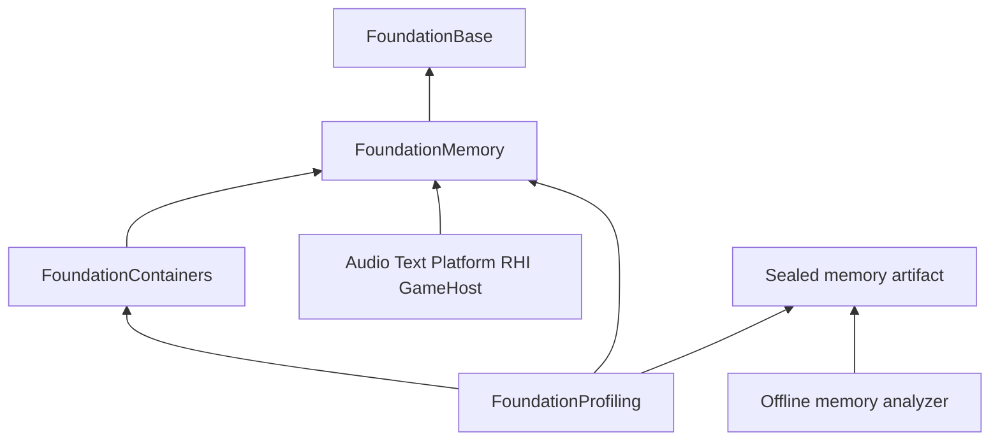

# Ludus Memory Profiling Architecture

**Status:** Proposed design. No memory profiler, new allocator, or production
code is implemented by this document. The design follows
[ADR 0008](../decisions/0008-memory-management.md) and the
[memory ownership architecture](memory-management.md). The subsequent
[article review](memory-profiling-gems-review.md) records sources, page ranges,
adopted refinements, and rejected alternatives.

Ludus should answer how much memory a subsystem owns, where allocation traffic
comes from, and which allocations survive an expected lifetime boundary. Use
one explicit allocation boundary, inexpensive domain counters, and an optional
bounded recorder. Preserve the system allocator, use external viewers, and make
the accuracy and coverage of every result visible.

## Initial design before the reference review

This baseline was written before opening the game development article map or
the articles selected from it. Its decisions are:

- Memory owns accounting and allocation identity. Profiling coordinates
  observation, supplies time and context, and exports results.
- Allocation domains remain stable for the process lifetime. A free charges the
  original domain even when the owner moves or another thread performs it.
- Normal builds expose requested live bytes, blocks, high-water marks, traffic,
  and failures. Detailed recording is optional and idle until requested.
- The first recorder uses one mutex, a fixed live table, and an append-only
  bounded journal. It has no collector, per-thread queues, or reclamation scheme.
- Starting and stopping recording requires the application's safe point after
  every participating allocation operation has finished.
- Activity recording can begin late. Complete live sets require an independently
  proven ownership baseline. A dropped free invalidates lifetime reconstruction.
- Requested storage, retained container capacity, arena utilization, resource
  residency, process RSS, and GPU storage are different metric families.
- Allocation sites are the first attribution feature. Stack capture and live
  attachment are separate, measured follow-ups.
- Perfetto receives gauges and timing context. A versioned memory artifact and
  a small offline analyzer provide live-set differences and lifetime reports.

The final design below incorporates the subsequent reference review. Its main
refinements are owner-labelled checkpoint differences, explicit arena/pool and
resource metrics, allocation-specific debugger triggers, metadata-footprint
reporting, and stricter sampling/coverage labels. Performance limits are
proposed gates, not measured Ludus results.

## Implementation baseline and scope

The implementation inspected on 2026-10-04 provides CPU trace scopes, frames,
flows, and Perfetto JSON export. Its event kinds have no memory records, and its
[README](../modules/foundation/profiling.md) explicitly defers memory
profiling. That original working-tree audit predates the minimal Memory/domain
implementation now present on main.

**PR preparation update, 2026-10-06:** main at `5dfe99e` includes
[`AllocationDomain`](../../modules/foundation/memory/include/ludus/foundation/memory/allocation_domain.hpp)
with immutable callback/context ownership, fallible aligned allocation and a
process-lifetime system domain. It supplies no counters, registry, live ledger,
or memory capture. Extend that existing module/type rather than introducing a
competing byte allocation API. Existing custom domains/context must outlive their
allocations; the profiler cannot extend callback/code lifetime merely by retaining
a numeric ID. The Array seam below still uses direct aligned new/delete.

`Array` has an aligned, fallible
[allocation seam](../../modules/foundation/containers/src/array_support.cpp).
Audio exposes PCM and stream byte estimates, text exposes owned font bytes, and
the game host tracks outstanding host allocations and backing bytes. Direct
new, STL storage, native libraries, and driver allocations remain additional
paths. Existing memory-audit statements are pinned to older commits; their
claims about missing audio, world, editor, hot reload, and STL containers do not
describe the current tree.

This design adds CPU allocation observation and correlates independently owned
resource/process metrics. It does not replace resource managers, implement a
heap algorithm, make arbitrary raw pointers safe, or prove all process memory
is covered. Existing isolated allocation-count tests and sanitizers remain
complementary evidence.

## Questions and metric contracts

| Question | Source and meaning |
| --- | --- |
| What does Audio own now? | Quiescent outstanding requested bytes and blocks in its migrated allocation domains. Resource counters describe a separately named subset. |
| Why did a frame hitch? | Allocation/free counts, allocated/freed bytes, failures, and large allocations within the frame interval, joined to CPU scopes offline. Stable live bytes can hide high churn. |
| Why is the footprint large? | Requested storage, container capacity, arena backing/utilization, and separately sourced backend/process metrics. No exact fragmentation claim from RSS minus requested bytes. |
| What survived scene unload? | Live identities at two checkpoints plus an explicit owner-lifetime expectation. Survivors are candidates for investigation, not automatically leaks. |
| Which code path allocates? | Site and optional owner IDs recorded at allocation; stacks are optional. Freeing-site/thread information never replaces the allocation origin. |
| How close are we to a limit? | Resource-owner budget and requested-byte high-water, each carrying its metric kind and sampling/validity state. |

Each domain has checked counters: `LiveRequestedBytes`, `LiveBlocks`,
`PeakRequestedBytes`, `AllocatedBytes`, `FreedBytes`, `AllocationCount`,
`FreeCount`, and `FailureCount`. `usize` is used for request arithmetic;
`uint64` is used for totals and identities. Zero-sized requests create no block
or lifetime. Rejected invalid inputs and backend OOM are distinguishable.

Allocation accounting follows backend success and precedes pointer return.
Free removes the lifetime and subtracts requested bytes before backend release,
so pointer reuse cannot erase a newer lifetime. These are API accounting
boundaries, not exact physical residency boundaries. `Array` accounting charges
capacity bytes, including old/new overlap during growth. A later byte resize
must also report temporary storage and copy traffic; initial recording requires
only allocate/free and failure records.

Counters are relaxed atomic samples during execution, not a transaction across
fields or domains. Exact reconciliation requires quiescence. Per-domain peaks
must never be summed and labeled a simultaneous process peak. Checked overflow
or underflow sets sticky invalidity; arithmetic cannot restore accuracy. Counter
reset is allowed only for interval traffic at a quiescent boundary, preserving
live values and high-water validity.

Every result separates four properties:

1. **Accounting validity:** valid, saturated, or contract/accounting error.
2. **History completeness:** complete from a proven baseline, activity only,
   or incomplete with a loss boundary/reason; an asynchronous loss may have no
   exact operation boundary.
3. **Attribution:** known site/owner versus unknown attribution.
4. **Coverage:** included domains/providers and explicitly excluded paths.

An unknown site does not invalidate a counted block. A complete covered-domain
ledger does not imply complete process coverage. Do not manufacture a coverage
percentage without an independently measured denominator.

## Ownership and dependencies



Arrows mean depends on. Memory must not depend on Profiling, Logging, Platform,
or Containers. Its private optional detail state owns the authoritative live
table and recording transaction. Profiling owns capture controls and the sealed
artifact's presentation. The private adapter supplies a bounded, allocation-free
clock/context function and the session's preallocated storage. Do not add public
observer registration or a pluggable recorder framework.

Observer access is routed through each stable domain. An excluded domain never
loads a pointer to shared capture storage. The domains attached to one detail
state are fixed for its ledger epoch. Safe points cover **all** those domains,
including continuous validation domains outside an event filter. Changing a
filter does not shorten the storage/code lifetime obligation. Publish/detach
routes only while all participating whole operations are externally quiescent;
loading a pointer and then incrementing an in-flight count is not a safe
acquisition protocol.

Suggested implementation locations:

| Location | Responsibility |
| --- | --- |
| Memory public `allocation_domain.hpp` and an opt-in statistics header | Extend the existing byte/domain API with ADR 0008 accounting; preserve its ownership contracts |
| Memory `src/internal/accounting.*` | Checked counter updates and stable domain registry |
| Memory `src/internal/observation.*` | Optional live table, lifetime IDs, journal transaction, loss state |
| Profiling `include/.../memory_capture.hpp` | Non-ubiquitous session/checkpoint/export controls |
| Profiling `src/memory_capture.cpp` | Safe-point protocol, storage setup, clock/context adapter |
| Profiling `src/export_memory.cpp` | Versioned artifact and Perfetto gauge export |
| `tools/memory-report/` | Offline validation, checkpoint differences, sites, lifetimes, machine-readable summaries |

Introduce each file only with its consuming phase. Public headers stay small,
self-sufficient, exception-free, and free of vendor/heavy standard headers.
Memory remains outside `core.h`. A private native byte writer or sanctioned
export boundary handles I/O; ordinary diagnostics use Logging after releasing
tracking locks. Any C-runtime backend exemption is explicitly scoped in ADR
0003 during implementation.

Use Base's opt-in `checked_integer.hpp` at request/budget/identity conversion
boundaries; do not add it to `core.h`. Any future binary artifact specifies fixed
field widths and byte order and uses the bounded codecs in `byte_order.hpp`.
Implementation PRs must place concise author thanks and references near the
affected code, identifying adopted ideas and departures and linking the article
review. This proposal adapts design ideas; it copies no book implementation.

## Domain and attribution model

A domain binds allocation origin and the backend that must release the block.
It is not a private heap. The owner carries domain, size, and alignment, as
specified by ADR 0008. No mandatory allocation prefix is needed for normal
builds. `Array` migration preserves original-domain ownership through move and
swap; a new destination-domain copy is a distinct allocation.

Start with Core, Containers, Logging, Profiling, Audio, Text, Content, Platform,
RHI CPU, GameHost, and Tooling domains as actual consumers migrate. Do not add
domains for every object or frame. Record registration failures and fallback
attribution. Domain/backend storage remains alive through static/TLS teardown;
there is no destructive shutdown of the process heap.

Register names and sites outside allocation hooks in bounded owned tables.
Numeric IDs, not borrowed module strings, appear in events. Copy definitions
needed after dynamic-module unload before releasing that module. Reject
overlong/colliding definitions explicitly; fallback site ID zero means unknown.
Registry exhaustion reduces attribution and must not turn a successful
allocation into a failure. Never infer that Logging and Profiling thread IDs
identify the same thread; export their explicit correlation.

The baseline site record contains normalized source path, line, function, and
build/module identity. Optional owner/context IDs refer to definitions whose
lifetime covers the artifact. Allocation origin is immutable. Ownership transfer
and current residency are resource-manager facts and can be correlated without
silently retagging memory.

Owner IDs describe an actual consumer, such as a scene generation, module
generation, asset, or stream. They are optional bounded attribution, never a
second allocation domain or an implicit TLS ownership rule. An owner defines
which persistent/shared allocations are expected to remain after its boundary.
Reports distinguish newly live blocks, released blocks, and surviving blocks;
only an explicit lifetime expectation justifies calling a survivor a leak.

## Recording modes and public control

| Mode | Cost and result |
| --- | --- |
| Counters | Checked per-domain atomics; no per-pointer metadata, sites, stack walks, or event construction |
| Activity | Optional live table for allocations first observed in this session; bounded alloc/free/failure journal; pre-existing frees explicitly unknown |
| Complete covered domains | Same table maintained independently of capture sessions from a proven baseline; consistent initial/final live snapshots |
| Stack investigation | Optional platform capability; sampled allocation stacks and exact size/identity records, with sampling probability reported |

Validation and detailed recording share one live table. They must not maintain
two pointer maps that can disagree. Continuous table ownership survives session
stop only in complete/validation mode. Allocation behavior and domain layout do
not depend on whether a recorder is attached.

Ownership counters are independent of the CPU profiler's
`LUDUS_PROFILING_ENABLED` switch. Disabling CPU tracing in Release does not
silently disable Memory accounting. The SDK owns any memory-capture capability
switch, and public ownership/byte ABI stays consistent across its consumers.

The proposed control vocabulary is intentionally small; these names are future
contracts, not existing declarations:

```cpp
MemoryCaptureStatus BeginMemoryCapture(const MemoryCaptureConfig& config,
                                       MemoryCaptureId& result) noexcept;
MemoryCaptureStatus TakeMemoryCheckpoint(MemoryCaptureId capture,
                                        MemoryCheckpointId& result) noexcept;
MemoryCaptureStatus EndMemoryCapture(MemoryCaptureId capture) noexcept;
MemoryCaptureStatus ExportMemoryCapture(MemoryCaptureId capture,
                                       std::string_view path) noexcept;
MemoryCaptureStatus ReleaseMemoryCapture(MemoryCaptureId capture) noexcept;
```

Begin config specifies included domains, Activity/Complete mode, byte budgets,
and optional attribution. IDs are opaque numeric values. Begin/checkpoint/end
require caller-established quiescence of every domain attached to the detail
state. The capture owner documents how it establishes that boundary; a frame
marker or boolean argument is not proof. These low-level controls cannot detect
every violation by a caller. The application coordinator must establish the
boundary before calling them. Unsupported modes return an explicit status.
Do not offer a default "capture everything exactly" button.

Failure statuses include unavailable capability, invalid config, already active,
unproven baseline, exhausted storage, incomplete capture, and I/O failure.
Failed begin/checkpoint leave output IDs unchanged and do not publish a partial
session/checkpoint. A completed checkpoint can contain explicitly invalid
metrics; its successful creation does not certify their accuracy. End can
successfully detach and seal while returning
`Incomplete`; the status describes artifact health, not a still-active session.
A failed attempt to establish quiescence leaves the session attached. Export
accepts a sealed session and is repeatable. Retain at most one session initially:
it is active or sealed. Begin requires the previous sealed capture to be released,
so end always owns its reserved sealed slot and no unexported artifact is silently
destroyed. Release rejects an active capture and reclaims only sealed storage
outside hooks. Control/export/release calls are serialized by the capture owner.

The continuous complete/validation ledger has its own storage lifetime. Ending
or releasing a capture does not detach that ledger or reclaim its live table.
Its private setup/retirement requires the same domain-wide safe point; discarding
it discards its baseline proof. No capture ID is a raw session pointer.

## Reference recording algorithm

Use one preallocated flat pointer table, one fixed append-only journal, and one
mutex for detailed state. This lock is paid only in investigative modes. It
serializes table changes and record publication in the same order, so a reader
does not reconstruct ownership from wall-clock ordering. It is deliberately
simple enough to step through in a debugger.

The table is private implementation machinery, with a fixed load ceiling and
deletion that does not accumulate tombstones. IDs are never pointers into table
slots. Choose a reviewed fixed open-addressed implementation with bounded
backward-shift deletion; test collisions and churn. There is no new public hash
container. Hashing pointer representation stays private; any required address
alias belongs in `types.h`, following repository rules.

Each lifetime uses `(LedgerEpoch, LifetimeSequence)`. Each mutation has a
strictly increasing `OperationSequence`, issued under the detail mutex. The
sequence is authoritative within that ledger; a timestamp is correlation data.
IDs/epochs never wrap or reuse a live identity. Counters-only mode pays no
lifetime or operation ID cost. Address reuse starts a new lifetime.

**Allocation:** enter the recursion guard before any observer access; validate
layout; call the backend without the detail lock; update successful accounting;
obtain POD time/thread/context metadata; lock detail state; assign identity,
insert the live entry, and append its event; unlock; return the pointer. Backend
failure increments failure counters and may append a failure event with no
lifetime. Metadata failure preserves successful allocation behavior.

**Free:** enter the guard; validate the supplied ownership contract; obtain POD
freeing-thread/time/context metadata outside the lock; lock detail state; look up
the live identity, retain origin fields, remove the entry, append
the free event, and unlock; subtract accounting; call the original backend.
Publication precedes backend release and address reuse. Activity-mode missing
entries are baseline-unknown frees. In complete/validation mode, a missing entry
is an ownership diagnostic only while that domain's entire ownership baseline
and table are valid. Never blindly dereference an alleged allocation prefix to
validate an arbitrary pointer.

The backend, user constructors/destructors, normal logging, stack unwinding,
formatting, I/O, and arbitrary callbacks never run with the detail mutex held.
The record append is a bounded built-in POD copy, not an observer callback.
Counters and detail records reconcile after whole operations finish; a concurrent
sample taken mid-operation is explicitly approximate. This algorithm does not
promise lock-free progress or a bounded contention wait.
Counters-only operations bypass the table, journal, identity, and metadata steps.

## Capture lifecycle and loss

The control sequence is: stop admission, finish/join all attached whole Memory
operations, prepare storage, establish baseline and install observer, then resume
producers through synchronization. Checkpoint repeats the safe point and copies
the live table plus counters at one operation-sequence boundary. End establishes
the same safe point, detaches the session journal, seals, and then permits
producer resumption. An Activity table retires with its session; a continuous
ledger remains attached. No operation acquires retiring session storage after
the boundary. Safe-point coordination covers the full attached domain set.

Quiescence covers logging/flush workers, audio/content workers, callbacks,
destruction, module reload, and the control thread itself where applicable.
Numeric TLS caches hold no session pointer; no TLS destructor publishes records.
If a worker cannot stop, retain session storage/code and return busy through its
lifecycle owner. Generation numbers alone do not prevent use-after-free.

Captured coverage is fixed at begin. Presentation filters run offline. A capture
selecting a subset of a wider continuous ledger omits other domains deliberately;
operation sequences remain increasing but need not be contiguous. Export that
selection explicitly and do not infer loss from sequence gaps alone.

Activity mode has no initial live-allocation list. Complete mode is permitted
only after observation before a selected domain's first allocation, or a valid
quiescent zero-block boundary followed by uninterrupted table coverage. Starting
in `main` is insufficient. Each domain carries its own baseline proof. A late
capture cannot invent the origins of older allocations.

On journal exhaustion, stop detailed publication and store the first lost
operation and reason outside the journal under the same detail mutex. A
still-valid complete table can produce a later exact checkpoint; the lost
interval remains incomplete. On live
table exhaustion, recursion, identity exhaustion, or table corruption, stop
exact reconstruction and mark the affected coverage invalid. Recovery requires
a new proven baseline if the table itself lost ownership information.

The recursion guard precedes locks. Reentry continues through the backend and
domain accounting where safe, records sticky loss without reentering the detail
mutex, and never recursively allocates recording storage. A loss detected before
the mutex uses preallocated atomic health fields: reason, affected domain, and
available time/boundary evidence. It cannot fabricate an exact lost operation
sequence. An artifact with unknown loss onset conservatively invalidates the
possibly affected interval. Capture storage is excluded from its own journal
but explicitly reported as Tooling overhead.
Profiler failure never rejects an otherwise successful engine allocation.

The first journal is finite and drained only after sealing. Long capture windows
and background draining are separate measurements and changes; a streaming
recorder needs a reviewed protocol and cannot reuse the current CPU drop policy.

## Artifacts and analysis

The first artifact uses inspectable versioned JSON, written incrementally from
sealed storage with a fixed output scratch buffer. Large integer IDs, addresses,
and byte values use decimal/hex strings where JSON viewers cannot preserve
64-bit precision. Do not serialize native C++ struct layouts or emit NaN/Inf.
Later binary/compression changes require measured file-size/export bottlenecks.

The artifact contains schema/build/backend/module metadata, domain/site/thread
definitions, metric kind/units, inclusion and exclusion manifests, session mode,
baseline proofs, budgets and actual tooling footprint, monotonic time metadata,
initial/final checkpoints, ordered events, and sticky health/loss information.
Allocation records contain identity, operation sequence, address, domain,
requested size/alignment, allocation thread, site, and optional owner/context.
Free records reference the same identity and separately name the freeing thread.
Unknown-baseline frees carry address/domain/layout and an explicit unknown
lifetime marker; they do not create invented allocation identities.
Checkpoints have an owner-supplied name, owner/generation, expectation, boundary
sequence, and per-domain validity. Owner expectations are report inputs rather
than permission to release memory.

The analyzer validates schema, identity/order, baselines, terminal boundaries,
and reconciliation before presenting exact results. Missing end-of-file/seal
metadata means a truncated/incomplete artifact. It refuses exact leak/live-set
reconstruction from affected history instead of interpolating missing frees.
Independently valid checkpoints remain usable even after journal-only loss;
this does not restore the interval's missing events or completed lifetime ages.
Interval allocation counts may still be useful when explicitly qualified.

Provide site/domain traffic rankings, live-set differences, survivor ages,
short-lived allocation counts, size distributions, and checkpoint reconciliation.
Report a maximum accounted high-water separately from a sampled chart peak.
Blocks allocated before an Activity session have unknown origin/age; blocks
still live at its end have an unfinished lifetime. Report these boundaries
explicitly rather than treating partial ages as completed lifetimes. Offline
hierarchies derive from stable site/context definitions, not a mutable tree
updated by every allocation. All filters operate offline on sealed data. Reports
export a machine-readable summary for CI and a readable table for developers.
An existing debug console/editor may later show a bounded read-only domain and
health summary; a custom heap explorer or editable statistics framework is not
required.

Perfetto receives separately named domain gauges and CPU-frame correlation.
The dedicated artifact retains lifetime semantics that generic trace events do
not guarantee. Foreign process heap tools complement these reports; native
debug/symbol metadata must be preserved for module reload and offline symbols.
Future Tracy/Perfetto allocation adapters consume sealed authoritative data.
Each adapter must demonstrate its baseline, loss, identity, and named-domain
semantics before offering exact reports; otherwise retain the dedicated memory
artifact alongside the timing trace. Vendor APIs never enter Memory headers.

## Investigation aids

Site attribution is available before stacks. A debugger trigger may select a
domain/site, minimum size, failure, or a particular new lifetime ordinal; a
checkpoint-selected lifetime may also trigger on release. Freeze selectors at a
safe point. Match through bounded built-in comparisons, release metadata locks,
then invoke the development-only break path at a documented operation boundary.
Do not run user callbacks, logging, or debugger waits under tracking locks.
An ordinal is reproducible only under a reproducible allocation order; raw
addresses are unsuitable persistent selectors. Assertions/sanitizers retain
their independent corruption detection role.

Optional stacks must use a platform implementation audited for reentry,
allocation, module lifetime, and unwind cost. Keep exact size/identity recording
separate from sampled stack attribution. Report unknown/failed stacks and the
sampling rule/probability; extrapolated per-stack totals are estimates, never
exact live sets. Avoid periodic every-Nth-allocation sampling that can alias
workload patterns. Use a tested randomized scheme with private profiler state,
independent of simulation RNG. Defer the scheme and rate until a demonstrated
consumer needs them. Symbolize offline with captured module mappings/build IDs;
do not assume a module still exists at export time.

## Integration and coverage rollout

| Consumer | Initial integration | Explicit exclusions or separate metrics |
| --- | --- | --- |
| Containers | Redirect existing seam, then add origin-domain ownership with ADR 0008 propagation/ABI checks | Nested strings/foreign objects need independent migration; capacity is not element payload size |
| Logging and Profiling | Setup buffers/sinks/capture storage with explicit fallible policy | STL/filesystem/thread internals; exporter excluded from active recording |
| Audio | PCM, encoded buffers, stream rings, and selected control allocations | Decoder/device/library internals, stacks, and logical voice budgets |
| Text and Content | Owned font/file/catalog/decode buffers | FreeType/HarfBuzz/JSON-library allocations unless callbacks are explicitly adapted |
| GameHost | Preserve host-owned release and generation identity; expose its existing backing-byte metric separately | Header/alignment backing bytes must not be relabeled requested bytes; module/host destruction pairs remain intact |
| RHI | CPU resource metadata domains; GPU owner publishes separate allocation/residency/budget provider | Driver CPU heap, browser GPU implementation, and external/native resource ownership |
| Arenas | Count backing once; separately publish used bytes, padding, high-water, reset/retirement epoch | Logical arena suballocations never increase process heap totals a second time |

The audio callback/warm real-time path remains allocation-free and must not
acquire the detail mutex or unwind stacks. Integrate control/decode/storage
allocation paths first. Investigate callback violations with existing allocation
tests or a separately reviewed nonblocking diagnostic; enabling capture does not
make an allocating callback real-time safe.

Do not require replacing all STL types or adding custom allocators to ship useful
domain profiling. Mark migrated paths explicitly. Global malloc/new interception
is an external investigative tool, not production engine/SDK policy. Diagnostic
sampling is independent from simulation/replay randomness.

### Provider metrics and budgets

Resource owners publish small immutable POD samples outside allocation hooks.
Each sample names provider/owner, metric kind, units, timestamp, validity, and
any relationship to already counted backing storage. Registration is bounded
and sampling happens through explicit owner calls, not arbitrary callbacks
under allocator locks. This is a small extension to profiling controls, not a
new general telemetry framework.

Report arena backing, cursor/used bytes, alignment padding, high-water, and reset
epoch separately. Reset reduces logical usage while retained backing remains
allocated. The arena owner supplies CPU/GPU completion evidence when relevant.
Pools expose capacity, live slots, slot size, overflow and known backing; payload
slack is calculable only when the provider knows requested payload sizes. Never
scan allocation contents or poison patterns to guess how much was read/written.
Fragmentation requires backend-specific free-space/size-class evidence, not a
residual between unrelated metrics.

Resource residency includes reload/eviction traffic and temporary decode/upload
storage where the owner knows it. Domain/requested budgets produce soft alerts
outside hooks. Resource admission reserves anticipated capacity before loading
when that owner can enforce it; the profiler never evicts resources or denies a
successful backend allocation. Platform RSS, virtual reservation, commitment,
and GPU allocated/resident/budget values remain separately named samples. Never
sum resource/provider values with their underlying heap blocks.

### Platform capabilities

| Target | Planned shared capabilities | Optional/separate evidence |
| --- | --- | --- |
| Native | Domain counters, sites, bounded journal/table, safe-point checkpoints | Audited platform stack capture; OS process metrics; RHI/backend resource providers |
| Browser/WebAssembly | The same logical ownership/capture contracts where supported by its threading/build configuration | WebAssembly linear-memory capacity is not live heap usage or process RSS; browser/driver GPU residency may be unavailable; stacks require separate capability validation |

Missing providers report `Unavailable`, not zero. Capability negotiation occurs
before begin and export records what was enabled. Node-based tests establish
contract correctness, not browser frame-time performance. Native and web
acceptance measurements use their actual deployment configurations. No row
claims that these proposed integrations have been implemented or validated.

## Validation and delivery

The reference implementation must pass repository warning/format/tidy, public
header and build-budget gates, installed SDK consumers, and appropriate
ASan/UBSan and TSan tests using pinned tools. Avoid tests that merely mirror
function calls; drive adversarial ownership and control schedules.

Required scenarios include remote frees, allocating-thread exit, pointer reuse,
late unknown-baseline frees, pre-main allocations, domain transfer, valid empty
baseline, table collision/churn/exhaustion, journal loss and recovery, saturated
counters, recursion before lock acquisition, repeated sessions, unchanged outputs
on failed controls, partial export/I/O failure, truncated artifacts, and delayed
operations on each side of begin/checkpoint/end. Compare exact checkpoints to
an independently maintained test model. Verify that profiler-storage OOM and
loss never change allocation success or release behavior.

Also test filtered captures sharing a wider continuous ledger, attempted release
of an active capture, unknown-onset recursion loss, owner generation reuse,
provider double-count exclusions, absent web/process/GPU capabilities, and
sampled-stack labels. Test stable registry definitions after module unload.

Benchmark the system backend alone, checked counters, idle capability, activity,
complete table, and stack sampling separately. Include small-block churn,
large buffers, Array growth/reuse, remote frees, many domains, contended domains,
scene/content load and unload, and real audio/world warm paths. Report median and
tail latency, frame time, traffic, loss, peak RSS, and tooling bytes. Sanitizer
results are correctness results, not allocator-performance results.

Use allocator trace replay to compare backend traffic, but keep real workloads
for object/data locality and frame behavior; replay alone cannot reproduce them.
Where available, report cache misses/page faults and metadata-to-payload ratio.
Smaller requested totals do not by themselves demonstrate a faster game.

Proposed acceptance gates: zero event/table allocation on recording hooks; zero
stack work when stacks are disabled; unchanged `Array` ABI until its explicit
domain migration; successful allocation behavior identical under induced recorder
failure; complete quiescent reconciliation; explicit loss for every induced gap;
and no statistically supported greater-than-2% frame-time regression from normal
counter integration in representative release workloads. The 2% is an engineering
target to test, not a measured promise. Investigative modes report their overhead
instead of concealing it; change architecture only on representative evidence.

| Phase | Independently reviewable outcome |
| --- | --- |
| 0 | Repair owned-pointer move/deleter behavior and trace slab alignment/lifecycle before dependent migrations. The aliased Array resize prerequisite is already implemented. Establish current allocation/footprint baselines. |
| 1 | Extend the existing system-backed AllocationDomain boundary with checked counters/registry; explicit Array migration; coverage manifest and quiescent gauge export |
| 2 | One activity recorder, site definitions, fixed table/journal, safe-point begin/end, artifact validator and traffic reports |
| 3 | Proven-domain persistent table, exact checkpoints and survivor differences; shared validation table; independent restart/loss tests |
| 4 | Resource/arena/GPU/process providers and owner-lifetime reports for demonstrated consumers |
| Conditional | Safe stack sampling, streaming journal, live attachment, or measured table sharding; each needs a separate consumer and proof |

No phase depends on adopting mimalloc, a job scheduler, an editor viewer, a new
general hash container, or a lock-free queue. Existing CPU tracing can continue
while memory gauges are added; do not extend its unsafe transport to satisfy a
memory lifetime contract.

## Alternatives and unresolved measurements

Keep the system backend initially. Compare pinned mature backends under the
memory ownership plan before changing defaults. Do not build an allocator to
enable observation. Use one mutex as the investigative reference; partitioning
can improve throughput but complicates operation ordering and snapshots. Stack
sampling can reduce attribution cost but does not replace exact covered size
accounting. Safe-point control is simple and testable; arbitrary live attachment
requires additional admission/lifetime synchronization and remains deferred.

Configuration exposes storage byte limits and mode, not algorithm knobs. Registry
capacity, table load ceiling, useful session duration, sampling rate, and provider
cadence are measured during implementation. Calculate the full allocation budget
before begin, including snapshots, definitions, table slack, and output scratch;
reject overflow/OOM before attachment. There are no measured memory-profiler
performance results in this design.

Reserve the terminal checkpoint and health/seal records at begin so journal
exhaustion cannot prevent orderly closure. Intermediate checkpoint count/storage
is bounded; exhaustion returns a status without publishing a partial checkpoint.
Export cannot borrow mutable continuous-ledger entries: every sealed definition,
snapshot and record has immutable retained storage until release.
