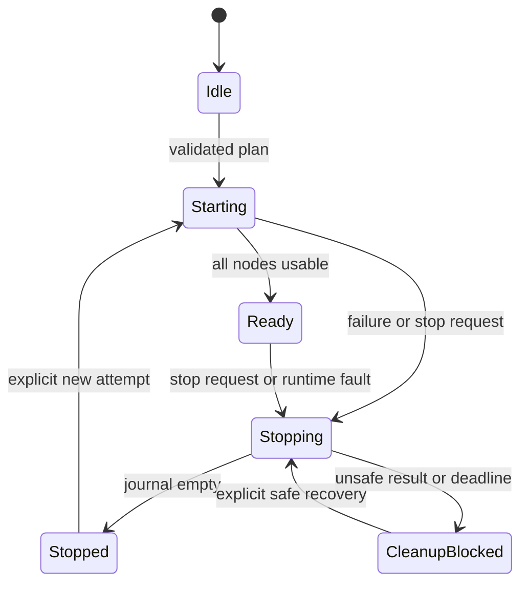

# Module startup and shutdown architecture

Status: First implementation in the smoke application, revised after the
[reference review](module-lifecycle-reference-review.md). Reviewed on 2026-10-04.
The private [runner](../../apps/smoke/internal/lifecycle.h) and
[composition root](../../apps/smoke/application.cpp) implement the authored plan,
linear validation, begin/poll contracts, reverse attempted-start journal,
cancellation, bounded records, and cleanup quarantine described below.
The remainder is a production architecture and migration plan, not a claim that
all engine services have already adopted these contracts.

The first implementation uses caller-owned spans and dense IDs. All four callback
slots are required; synchronous adapters return Ready or Stopped immediately.
Validation checks capacity, names, IDs, hooks, and provider order before calling
any hook. Polling consumes a callback budget and yields immediately on Pending.
Only RequestStop is callable from another thread; records and all other operations
belong to the owner thread. Recursive progress and duplicate Begin are rejected.
The runner generation identifies attempts in diagnostics; modules remain
responsible for rejecting stale asynchronous completions.

Window, RHI, and renderer start in that order. Renderer preparation now belongs
to startup rather than every playing frame. Their existing Shutdown facades retire
synchronously, so the application retains its synchronous Shutdown API. The
runner supports Pending and Unsafe stop results, but connecting an asynchronous
stop facade to this application will require a Stopping UI state and owner-loop
pumping first. Stopped means the facade's documented retirement contract; this
change adds no GPU-fence or worker-join guarantees to existing backends.

The tests use fake modules to cover every partial failure, pending start/stop,
late success with cancellation, provider retention, explicit deadline quarantine,
first-failure preservation, reentry, restart, and invalid plans. Existing browser
semantics tests exercise real app adapters and cancelled RHI/pipeline starts.
No SDK API, service locator, parallel startup, scheduler, hot-reload refactor, or
engine-wide migration is included in this first implementation. Coordinator
bookkeeping allocates no memory; resource allocation inside adapters is unchanged.

Use an **explicit application composition root, a short ordered lifecycle plan,
dependency validation, and one journal for startup rollback and shutdown**.
Modules own their resources and prove completion of their asynchronous work.
The coordinator owns ordering and policy. Keep those responsibilities separate.

This is the recommended design for Ludus's present scale and a path to larger
production workloads. Its quality comes from enforceable lifetime contracts and
observable failures. No literature review can establish a universally fastest or
best engine architecture; performance changes require Ludus measurements.

## Scope and existing constraints

A lifecycle node represents a resource-owning service instance, not necessarily a
CMake target, DLL, C++ module, gameplay system, or entity. Math and containers do
not need empty startup hooks. A graphics instance may own several internal
objects without registering each one with the engine coordinator.

The reviewed code already establishes useful boundaries:

| Existing boundary | Consequence for this design |
| --- | --- |
| [Static engine libraries](../decisions/0002-static-library-default.md) | Explicitly reference descriptors from application code; do not rely on registration constructors or linker section discovery. |
| [Smoke application](../../apps/smoke/application.cpp) and [entry point](../../apps/smoke/main.cpp) | Consolidate startup attempts and cleanup ownership; preserve the order renderer → RHI → window on teardown. |
| [RHI lifecycle](../../modules/graphics/rhi/include/ludus/graphics/rhi/rhi.h) | `Start` can return Pending; an unsuccessful attempt still owns a session until shutdown. The window/canvas outlives RHI. |
| [Audio lifecycle](../../modules/audio/include/ludus/audio/audio_system.h) | Retain instance ownership, owner-thread calls, admission control, and renderer/worker retirement. Browser async behavior is an API/design requirement; the reviewed native implementation does not establish browser acceptance. |
| [GameHost retirement](../../modules/runtime/game_host/src/host_session.cpp) and [ADR 0012](../decisions/0012-game-host-and-live-reload.md) | Gameplay reload is a separate transaction. Uncertain work/code references require host restart, with their owners retained until process exit. |
| [Diagnostic bootstrap](../../tools/diagnostics/include/ludus/diagnostics/session.hpp) | Configure development transport before logging and workers. This integration sits above FoundationBase. |
| [Memory design](memory-management.md) | System byte allocation and immutable domains survive late frees; do not invent a destructive global Memory shutdown. |
| [Trace control](../../modules/foundation/profiling/include/ludus/foundation/profiling/trace_system.hpp) and memory review | `EndCapture` is not a join of producers. Capture storage reclamation needs a separate quiescence proof. |

All engine callbacks and coordinator operations are exception-free and `noexcept`.
Use Ludus primitive aliases, fallible allocation, explicit includes, and small
public headers. A `noexcept` declaration alone does not make allocating code
recoverable. Existing adapter allocation paths must be audited before promising
recoverable OOM. FoundationBase acquires no dependency on this system.

## Ownership and lifetime scopes

The application root owns concrete module instances, their immutable configuration,
their adapters, and lifecycle storage. Supply dependencies through narrow typed
references or explicit parameter structs. The lifecycle runner sees only a
context pointer and function pointers; it does not offer service lookup.

Construction establishes an inert, valid empty object. Acquiring devices,
starting workers, registering externally callable callbacks, and fallible storage
allocation belong in explicit startup operations. A small leaf RAII handle can
release an already quiescent native object, but its destructor does not start
engine-wide shutdown or asynchronous waits.

Use three ownership scopes when their consumers exist:

| Scope | Owns | Stops when |
| --- | --- | --- |
| Process bootstrap | Emergency reporting, development diagnostic transport, process logging, optional capture controls | The final engine scope has stopped and all relevant producers have retired. |
| Engine instance | Window/canvas, RHI, audio device, content service, future scheduler | The application closes or deliberately recreates the engine. |
| Play session | World, level loads, gameplay jobs, input attachment, presentation resources | Play stops, a session is replaced, or its owning engine stops. |

Nested scopes each use the same small runner. A parent's Session node stops its
child runner completely before returning Stopped. A child can borrow a parent
provider; a parent cannot borrow a child. Cross-scope edges identify the exact
parent instance and verify it is Ready. Multiple instances must have separate
owners and contexts; this proposal does not remove RHI's current single-session
restriction or make the current process logger independently instantiable.

Process facilities that are always callable require no synthetic lifecycle node.
An explicit bootstrap tail handles diagnostics/observability separately from
ordinary service ownership. Leaving the emergency writer available through late
destruction is intentional.

## An authored plan with checked dependencies

Write a profile's startup sequence as one ordinary array at its composition root.
The plan is immutable during an attempt. Every node contains an explicit ID and
readable name, its context, its four lifecycle callbacks, and the IDs of its
required providers. Optional callbacks have synchronous adapters described below.
Keep feature choices in the profile, not hidden inside the runner.

Before any lifecycle callback, validate:

1. Node IDs are unique; names and required callbacks are valid; storage capacity
   covers the entire plan and its journal.
2. Every required provider exists in this plan or is a Ready ancestor provider.
3. Each local provider precedes its consumer in the authored array. Reject self
   edges, cycles, and otherwise incorrectly ordered plans with named diagnostics.
4. Cross-scope references follow ownership duration, and each backend choice is
   available for the selected target/profile.

An earlier-provider rank check rejects every local cycle without a sorting pass.
If necessary, a bounded diagnostic DFS can distinguish a cycle from a merely
misordered plan and print its path. It never repairs the plan silently.

The graph is a **validation and lifetime specification**, while the array remains
the visible execution order. Do not add priority integers, runtime dependency
discovery, global auto-registration, reflection, or a mutable service locator.
Once the profile resolves optional choices, all active lifetime edges are required.
An optional integration that is enabled adds an ordinary required edge.

For example, a future graphical GameHost might author:

```text
Bootstrap outside the engine plan: diagnostics, logging, optional tracing

Engine plan                         Required lifetime providers
Window                              bootstrap/OS context
RHI                                 Window
Audio                               bootstrap/OS context
Content                             bootstrap/OS context
Session                             RHI, Audio, Content

Session child plan
World                               Content
Presentation                        World, parent RHI
Gameplay                            World, Presentation, parent Audio

Engine stop order: Session completely, Content, Audio, RHI, Window
```

This is an illustrative profile, not a claim that these service facades exist.
Add a scheduler only when real consumers need it; put it before every consumer
that uses it during startup, operation, or cleanup. A headless profile explicitly
omits Window/RHI/Presentation and supplies compatible session inputs. An SDK
tool can have a two-node plan. No profile starts everything merely because it
was linked.

Include an edge whenever a consumer borrows a provider-owned object, submits
work to it, or needs it for destruction. Ordering needed only during bootstrap
may initially use the same conservative edge. Split out ordering-only metadata
only if measurements show a real limitation. Fix a cycle by moving shared state
to a lower layer, moving the interaction to session orchestration, or delaying
the integration until both independent services are Ready; arbitrary priorities
cannot repair a lifetime cycle.

## Small normalized lifecycle contract

Keep native module APIs intact behind adapters. The proposed runner contract has
four operations; it is not a public inheritance hierarchy all modules must adopt.

| Operation | Contract |
| --- | --- |
| `BeginStart` | Called once for an attempted node. Returns Ready, Pending, or Failed with a structured error. It may acquire partial resources; every outcome must be stoppable. |
| `PollStart` | Called only while Starting. Advances bounded work or observes durable completion; returns Ready, Pending, or Failed. |
| `BeginStop` | Called once for any attempted node, including Failed or Pending startup. Closes that node's normal admission, cancels/joins its work as needed, and returns Stopped, Pending, or Unsafe. |
| `PollStop` | Called only while Stopping. Advances cancellation, drain, retirement and release; returns Stopped, Pending, or Unsafe. |

Ready means the documented service contract is usable by consumers. It need not
mean that all optional assets are preloaded, a browser audio context has received
a gesture, or every background warmup has finished. Expose such substates in the
module's own API; do not block engine boot on a user gesture without an explicit
application requirement. The adapter defines these readiness choices.

Stopped is stronger: all resources acquired by that attempt have been released,
all callbacks/jobs borrowing its state have retired, and no future activity can
access its instance. Pending promises neither readiness nor retirement. Unsafe
means cleanup cannot establish safety; it never authorizes reclamation.

Synchronous modules return Ready/Stopped directly from the Begin functions and
need no meaningful Poll implementation. Their adapter can use a shared invalid-
state stub for accidental polling. Do not impose asynchronous machinery on a
purely synchronous leaf. Conversely, wrapping a blocking driver call in a Begin
callback does not make that call bounded or asynchronous; record such platform
limitations explicitly.

Callback context and configuration outlive the entire attempted lifetime. Module
instances are not moved while active. Adapters track their own internal acquisition
steps, so stopping a failed partial attempt releases exactly what exists. A
successful internal rollback is compatible with a later no-op stop. The runner
does not retain a generic lambda undo stack or free module-specific handles.

## Coordinator states and execution

All runner mutation happens on one owner thread. Other threads request stop
through a small atomic latch and publish completion through module-owned
mailboxes. They never call lifecycle operations directly. Callbacks cannot
recursively advance the runner or mutate its plan.



The terminal cause is separate from the cleanup state. Preserve the original
startup/runtime error even after Stopped. Record cleanup errors separately.
Normal completion, startup failure, cancellation, and runtime failure are
distinct outcomes. A runtime fault can stop an owning session without stopping
unaffected engine services; the application chooses the affected scope.

Startup procedure:

1. Validate the profile and prebudget runner storage. Keep application admission
   closed while booting.
2. Select the next authored node only after all its providers are Ready.
3. Append its index to the attempted-start journal **before** `BeginStart`.
   Capacity was proven before side effects. Mark it Starting and invoke Begin.
4. On Pending, keep servicing necessary platform/provider progress and poll on
   later owner callbacks. Do not start the next node yet.
5. On Ready, record readiness and advance. On Failed, preserve the primary error
   and enter the shared stop path.
6. Before publishing readiness or opening application admission, recheck the
   stop latch. Once stopping is observed, no new consumer or gameplay work starts.

Record every attempt, not only successful starts. If startup acquires a surface
and then fails device creation, that node is still the first cleanup target.
Provider construction success is not service readiness.

Rollback here releases owned resources; it does not undo arbitrary external
effects. Stage registration/publication where practical. Persistent writes or
network effects need their own explicit transaction or documented compensation,
not a promise from the lifecycle journal.

Stop requests coalesce. A repeated start while Starting/Ready/Stopping returns
Busy without changing the plan. A completed stop is an idempotent observation;
BeginStop is not invoked twice. Restart creates a fresh attempt/generation only
after the previous journal is empty. Generation exhaustion reports an error
rather than silently wrapping. Do not automatically retry permanent failures.

## Shutdown and startup rollback

Shutdown, rollback, cancellation, and scope replacement use one algorithm:

1. Close the **application's external admission**: no new frames/ticks, level
   requests, reloads, or ordinary submissions enter the stopping scope. Finish
   the current owner-thread call/frame at its legal boundary.
2. Take the last attempted node in the journal. Its providers remain Ready.
3. Invoke BeginStop once. The module closes its own new-work admission, cancels
   or drains existing work, detaches subscriptions, retires device resources,
   and releases owned storage in its internal dependency order.
4. While Pending, pump required progress and invoke PollStop on later callbacks.
   Do not begin provider shutdown. On Stopped, pop the journal and continue.
5. If Unsafe or the configured deadline expires, retain the node and remaining
   providers, expose CleanupBlocked, and apply the host's explicit recovery
   policy. Never report clean shutdown or permit restart while they remain live.

Do not broadcast destructive stop to all services first. A session may still
need audio cancellation, GPU retirement, logging, file completion, or scheduler
execution during its cleanup. Providers continue their documented cleanup
services until their turn. Closing application admission is distinct from
closing the scheduler or logger; normal gameplay cannot submit through an
internal cleanup path.

The key invariant is:

> For every consumer → provider lifetime edge, the provider's cleanup API and
> borrowed storage remain valid until the consumer reports Stopped, including
> failed and cancelled startup attempts.

An external fault such as device loss can invalidate normal rendering before
teardown begins. The lifetime guarantee preserves safe cleanup and honest error
returns; it cannot promise continued operation of failed hardware.

Module-level Stopped checks are specific: workers have finished and joined;
subscriptions are detached and already executing callbacks have finished;
browser completions no longer borrow instance storage; GPU-visible objects have
the appropriate retirement proof. CPU job completion does not prove GPU
completion. Device loss follows the backend's documented destruction rules
instead of waiting forever for a completion that cannot arrive.

Deadlines diagnose a liveness problem, not memory safety. A coordinator budget
cannot interrupt a blocking OS write or driver call. A supervised native
GameHost can report the blockage and terminate/restart its process. An in-process
editor must retain the entire affected scope and its provider closure, or end
the process; unloading code or destructing the root is unsafe. The owner must
not return through automatic destruction of a still-live root. Browser code
keeps the owner/runtime alive while cooperative cleanup remains possible and
offers a reload when cleanup is irrecoverable. There is no forced thread kill
or guessed delay that counts as successful retirement.

Shutdown persistence is application policy. Perform a requested checkpoint/save
at an explicit boundary before destructive teardown, with its own status and
deadline. A module destructor cannot promise save completion after a browser tab
is closed. Fatal assertions/crashes use the independent emergency path; they do
not invoke arbitrary lifecycle callbacks in corrupted state.

## Asynchronous completion and progress pumping

The module's completion channel is part of correctness. Use a durable bounded
mailbox or an equivalent registered operation record with generation, result,
and ownership. Lifecycle completion cannot depend on a lossy log/profiler queue.
At most one node starts or stops at a time in the baseline, so the runner needs
no multi-consumer work queue.

Cancellation is a requested disposition, not a proof that an operation ceased.
A late successful result after stopping begins is disposed by its owning adapter;
it never publishes Ready or starts a consumer. Generation checks reject stale
publication, but a callback must reach a still-live control record before checking
that generation. A token check through freed memory is still a use-after-free.
Retain callback control storage until deregistration/completion acknowledgment.

Polling startup is not sufficient if an already Ready provider needs regular
service while a consumer is Pending. The host supplies an explicit lifecycle
progress pump that runs platform events, the needed audio/content service calls,
owner-thread completion dispatch, and future scheduler progress. It knows which
instances remain usable. Lifecycle polls can also advance their own backend.
Keep the pump short and auditable; it never executes gameplay ticks or starts
unplanned nodes.

On native builds, use wakeups or the existing event loop between advances; do
not spin. On browser builds, each advance returns to the browser event loop.
Continue lifecycle callbacks during shutdown until completion before cancelling
the final callback registration. Returning from `main` or running global
destructors is not the browser cleanup protocol. Visibility suspension resets
game clocks separately; it does not constitute module shutdown.

## Failures and deliberate degradation

Require all enabled nodes in a resolved plan. A failing required node stops its
scope. If the application permits audio-free operation, choose Disabled audio
explicitly, or completely stop the failed attempt and create a documented new
profile. Do not hide a required device failure behind a null service.

For the first implementation, prefer preselected profiles or a whole-scope
rollback followed by a new profile. Partial branch salvage and automatic provider
replacement add ownership/reference complexity without a current need.
Backend fallback remains local to the adapter/module that owns it, as with the
existing RHI Auto policy; a forced backend still fails explicitly.

Logging and profiling retain their existing graceful degradation contracts.
Failure to record lifecycle events must not fail a module, allocate recursively,
or crash the engine. Return the structured failure to the caller even if no
logging sink exists. A fixed emergency record covers pre-logger/late shutdown
failures without introducing a Base-to-Logging dependency.

## Gameplay replacement and runtime recovery

The lifecycle runner owns the outer GameHost/session lifetime. Gameplay reload
retains [ADR 0012](../decisions/0012-game-host-and-live-reload.md)'s separate
quiesce, checkpoint, candidate staging, commit, and old-generation retirement
transaction. A rejected candidate leaves the active instance running. Do not run
ordinary whole-scope rollback merely because replacement staging failed.

Before releasing a code generation, prove that its instances, in-flight calls,
jobs, subscriptions, function tables, and creator-provided destructors are no
longer callable. Copy diagnostic metadata into host-owned storage. Releasing a
loader handle alone proves none of those conditions. Generic lifecycle
callbacks are not a substitute for the gameplay ABI's capability/identity checks.

Device recreation is likewise an application/backend recovery transaction: stop
affected sessions and resources before replacing their provider, or report that
the host must restart. The first lifecycle implementation promises ordered
whole-scope restart after successful cleanup, not transparent live replacement
of arbitrary engine modules. An uncertain retirement retains its owner and
providers under the existing process-restart policy.

## Observability and debugging

Maintain a bounded inspectable snapshot independent of optional trace output.
Each node records name/ID, state, attempt generation, owner thread, last operation,
start/ready/stop timestamps, structured error, wait reason, and a small module-
provided progress count when meaningful. Native error values include their domain.
Do not store borrowed error strings from transient or unloadable module memory.

Emit one event per state transition and wait-reason change, not one per poll.
Expose ordinary status queries plus a text plan dump and a dependency diagram
export from cold tooling. Debugger breakpoints in BeginStart/BeginStop reach
ordinary named functions. Heavy formatting/export lives in `.cpp` files and
does not enter public lifecycle headers.

An actionable failure report names:

```text
Profile: graphical-host; attempt: 12
Start failed: RHI / adapter-unavailable
Already stopped: RHI, Window
Remaining cleanup: none
Primary outcome: startup failure; cleanup outcome: complete
```

For a blocked stop, show the outstanding job/callback/retirement condition and
the provider closure being retained. Preserve the first cause; later cleanup
failures cannot overwrite it. Percent complete is reported only for counted
work; node counts are not a time estimate. Measurements distinguish service
Ready, first usable frame, session activation, and complete shutdown.

Observability has an explicit tail. Stop all engine/session producers first.
If logger workers can produce trace events, retire them before closing capture;
the current logger may require full Shutdown. Export without needing that logger,
using returned status/emergency reporting. Alternatively, prove those workers
are outside the capture and retain logging through export. Never assume that
EndCapture or a generation change joins producers. Keep process byte allocation
available through final object and TLS destruction.

## Performance and complexity

The baseline plan uses contiguous immutable descriptors, a node-state array,
an ID-to-rank table, and an attempted-index journal. IDs resolve through bounded
indices established at plan validation; no runtime hash lookup or service lookup
is required. Supply storage from the root or reserve it fallibly before startup.
Validation is O(V + E), execution bookkeeping is O(V), and metadata is O(V + E).
Each pending advance has a bounded poll/pump workload. Configured callback
counts do not bound the duration of external synchronous calls.

The coordinator performs no mandatory work during normal frames after Ready.
Module frame/tick service remains explicitly application-owned. Use no per-frame
graph traversal, allocations, central mutex, or virtual service dispatch. The
four cold function pointers are not a material frame-path optimization target.

First measure time to first useful UI/frame, node wall time versus active CPU
time, I/O waits, peak/resident startup memory, failed-start cleanup duration, and
shutdown p50/p95 under realistic device/storage conditions. Compare the runner
with today's handwritten application sequence. Record native and web separately.
Do not quote invented speedups or fixed universal boot budgets.

If a measured critical path justifies overlap, first parallelize pure preparation
inside a module using an existing scheduler, with owner-thread publication. Only
then consider concurrent independent lifecycle nodes. That extension requires
validated dependency readiness, explicit thread affinity and shared-resource
exclusions, deterministic launch order, cancellation of every in-flight attempt,
and reverse dependency cleanup of all attempted nodes. Appending before dispatch
preserves a valid reverse launch journal when providers must be Ready before
consumer launch; serial cleanup can still use that journal. Do not reverse
completion order as a substitute for the lifetime graph. No new lifecycle-specific thread
pool, coroutine framework, or lock-free scheduler is part of the baseline.

## Implementation boundary and migration

Start with private runtime/application code shared by the smoke and world-demo
hosts when their actual adapter requirements agree. Keep application-specific
composition and module adapters at the application layer. A future reusable
`modules/runtime/lifecycle/` target can contain only the runner/value vocabulary,
depend on FoundationBase, and accept an optional event sink. Lower modules must
not depend on it; installed public headers expose no private or heavy headers.
Extraction into the SDK requires a real external consumer and the normal SDK
include/build-budget gates.

| Step | Deliverable and acceptance |
| --- | --- |
| 1 | Private synchronous runner, authored plan validator, attempted journal, structured primary/cleanup results. Fake modules prove failed-attempt cleanup and exact provider availability. |
| 2 | Pending start/stop, stop latch, generation-aware durable completion, explicit progress pump. Deterministic delayed-completion tests prove cancellation and lifetime retention. |
| 3 | Adapt smoke's window/RHI/renderer ownership. Native and browser readiness/failure behavior remains explicit; capture failure diagnostics before module reset. |
| 4 | Apply to a second actual host/session and native audio when useful. Retain GameHost's existing reload transaction and cleanup-unknown behavior. |
| 5 | Publish a narrow reusable SDK API only if consumers need it; benchmark baseline overhead and user-visible lifecycle timing. |

Do not refactor all engine services at once or add an empty lifecycle method to
every library. Do not change third-party dependencies, allocator policy, gameplay
ABI, or scheduler architecture to implement the first steps.

## Required validation for implementation

Use a fake clock, controllable completion mailboxes, and named fake modules;
test contracts and event ordering instead of elapsed sleeps. These tests belong
to implementation work, not to this documentation-only proposal.

| Scenario | Required evidence |
| --- | --- |
| Invalid plan | Missing/duplicate IDs, backward edge, self edge, cycle, capacity overflow, invalid scope reference: reject before any callback. |
| Failure injection | Fail each node at each acquisition boundary, including after scheduling work. The failed attempt stops first; previously attempted providers stop once; never-attempted nodes receive no callbacks. |
| Provider lifetime | A consumer successfully uses its providers during stop. Provider stop begins only after consumer Stopped. |
| Pending and cancellation | Cancel before BeginStart, during Pending, and after completion publication but before readiness consumption. No later node/gameplay admission starts. |
| Callback retirement | Deliver delayed completions and stale generations across stop/restart. Control storage and code remain live until acknowledgment; late successful resources are disposed. |
| Admission and jobs | New gameplay submissions fail after the stop boundary, while required cleanup work can complete. Join occurs outside callback locks. |
| Blocked cleanup | Unsafe result, deadline, logger write blockage, and lost device completion retain the root/providers; no clean result, unload, or restart is reported. |
| Repeated control | Duplicate stop/start requests, runtime failure, stop-before-start, and many complete start/stop cycles preserve states and terminal cause. |
| Platform/session | Headless omits graphics; browser yields while Pending; child scope stops before parent; input detaches before its target dies; GPU/backend-specific retirement is demonstrated. |
| Diagnostics | Trace/sink failure leaves lifecycle functional; errors survive teardown and no borrowed unloadable names remain. Profiler stop requires actual producer quiescence. |

For production changes, run the repository's pinned warning-clean build, unit
tests, ASan/UBSan, format/tidy, and relevant SDK/header/build-budget checks. Add
TSan coverage where the toolchain/target supports the completion channel; ASan
alone is not a data-race proof. Check selected CMake configure/build/test presets
when any consumer's project setup changes. Browser acceptance uses the pinned
web toolchain and existing browser tests. No build, sanitizer, or performance
acceptance is claimed by this design document.

## Decisions after literature review

The [review](module-lifecycle-reference-review.md) records the initial design,
actual chapter/page ranges read, source limitations, and changes made. The main
refinement uses the dependency DAG to **check a visible authored plan**. Explicit
array order is part of the contract. Other strengthened decisions are owner-scoped
single-instance constraints, cancellation precedence, durable completion records,
and creator-owned destruction across the existing gameplay ABI boundary.

The smallest useful implementation is an ordered array, a validator, an attempt
journal, four adapter operations, and inspectable state. Async-safe retirement
is the module's contract; the coordinator makes its ordering enforceable.
