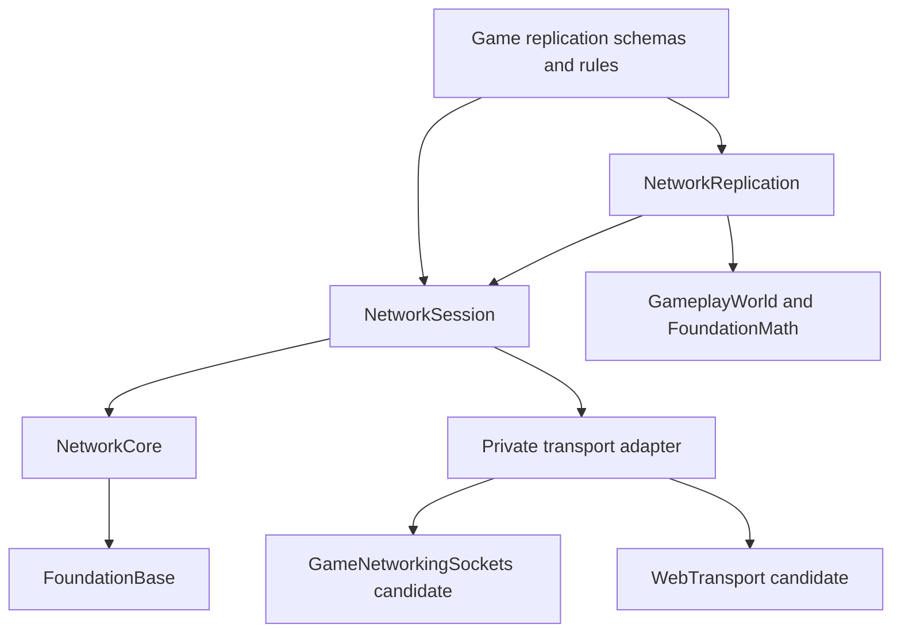

# Networking architecture

Status: N0/N1 protocol-core implementation. Session, Internet transports,
replication and prediction below are planned, with separate acceptance gates.
This document defines the intended system; it does not claim a shipping online
multiplayer engine, measured AAA-scale throughput, or a universally best backend.

## Goals and initial design

The initial design, before the reference review, was an authoritative server,
fixed simulation ticks, explicit application schemas, a small backend interface,
per-peer limits, and bounded client prediction. It separates simulation from IO
and keeps transport implementations out of the installed gameplay API. The
[reference review](networking-reference-review.md) records the subsequent changes:
checked bit packing, deterministic adverse-link testing, shared protocol decoding,
explicit synchronization metadata, and stricter admission/authentication boundaries.

Optimize for understandable ownership and bounded worst-case work first. Support
headless servers, native clients, and browser clients without dragging Platform,
windowing, rendering, an account service, or a particular transport into the core.
No singleton, hidden worker thread, automatic RPC reflection, or arbitrary entity
memory serialization. A debugger should be able to step through one peer's whole
receive-to-simulation-to-send path.

Initial workload to validate: 16 peers, 60 Hz simulation/input, 20 Hz snapshots,
1,000 relevant network objects. These are proposed benchmark inputs, not proven
capacity or fixed protocol constraints. Games can select different frequencies.
A 128-peer load test gates any later scalability claim. MMO sharding and migrating
server authority are separate systems, not hidden requirements of the first API.

## Modules and dependency direction

`Ludus::NetworkCore`, under `modules/network/core`, is implemented and links
only FoundationBase. It reuses FoundationBase byte-order codecs and contains non-templated checked wire streams, an explicit
message envelope, serial arithmetic, an outbound queue, and a link simulator.
Both native and Emscripten configure it; it makes no socket or browser API calls.

`NetworkSession` will use FoundationTime for host timestamps and own connection generations, compatibility negotiation,
bounded ingress, deadlines, liveness, rate limits, and backend lifetime. It has
no dependency on game objects. Backend state and third-party headers stay private.

`NetworkReplication` will map registered game schemas and network object IDs to
application messages. An explicit bridge reads/writes game components at tick
boundaries. Transport callbacks never mutate the world. FoundationBase, Input,
Platform and GameplayWorld do not acquire reverse dependencies on networking.

## Transport decision and alternatives

Prefer an established secure, congestion-controlled message transport over
maintaining a second UDP reliability, crypto, NAT, or pacing implementation.
[Valve's GameNetworkingSockets](https://github.com/ValveSoftware/GameNetworkingSockets)
is the native candidate: it exposes reliable/unreliable messages and supports
message lanes. Steam relay/account integrations require their own product setup;
open-source sockets alone do not imply Steam services. Pin, build, audit licensing
and exception behavior, and exercise a headless client/server spike before adoption.

[WebTransport](https://www.w3.org/TR/webtransport/) is the browser candidate.
Its datagrams and streams require a compatible server endpoint and browser
capability check. A native GNS server cannot directly accept WebTransport clients:
a server adapter or gateway must terminate the browser transport and deliver the
same application schemas. Datagrams may be unavailable on a particular connection;
capability negotiation must fail or select a declared reduced feature profile.
Browser availability is a deployment gate, not assumed from portable core builds.

[RFC 9221](https://www.rfc-editor.org/rfc/rfc9221.html) defines unreliable QUIC
datagrams; it does not make QUIC a turnkey game session or implement application
replication. WebSocket could support a deliberately separate turn-based profile;
TCP head-of-line behavior is unsuitable as an invisible fallback for real-time
snapshots. WebRTC is an alternative when browser peer connectivity is a product
requirement; raw UDP/ENet require additional security and service decisions.

The future internal adapter contract uses `Open`, `Poll`, `Send`, `Close`, and
`GetStats`, explicit statuses including `WouldBlock`/`Unsupported`, and message
ownership. It advertises datagram/reliable-lane capability, negotiated message
bounds, maximum connections, and encryption/authentication readiness. Poll copies
into caller-owned ingress buffers and releases backend-owned messages promptly.
No C++ exceptions may cross the adapter. One session owner drives it; if a library
uses internal threads, callbacks enter a bounded queue and publish no world state.

## Tick ownership and bounded work

For each executed tick:

1. Poll at most the configured message and byte ingress budgets.
2. Check authenticated connection generation, frame, schema, sender authority,
   tick range, rate budget and application payload before committing sequence
   windows or changing simulation state.
3. Consume commands for the tick; simulate the authoritative world once.
4. Gather changed quantized replication state; filter and prioritize per peer.
5. Encode bounded batches and pump outbound messages under an explicit byte budget.

Rendering interpolates separately and never advances authoritative tick counters.
The session has one mutating thread. Ownership, clocks and all externally induced
state transitions are parameters rather than globals. IO threading can be added
only after a measured poll budget problem; an SPSC ingress/egress design must
retain the same limits and deterministic simulation boundary.

Limits include peers, ingress messages/bytes per tick, command age/future horizon,
per-peer send queue, snapshot history, object count, reliable bytes in flight, and
fragment/reassembly bytes. Full queues return explicit backpressure. Reliable
control overload has a bounded deadline and disconnect reason. Drop obsolete
snapshot work instead of growing memory; never silently discard accepted durable
operations. Diagnostic counters identify the exact admission/drop stage.

## Delivery semantics

| Lane | Future delivery policy | Application behavior |
| --- | --- | --- |
| Control | Reliable ordered | Negotiation, spawn/despawn, ownership; bounded timeout |
| Input | Unreliable | Tick-tagged commands with a small redundant history; server deduplicates |
| Snapshot | Unreliable sequenced | Newest complete snapshot replaces obsolete unsent work |
| Bulk | Reliable ordered, separate stream/lane | Low-priority join state; explicit quotas and cancellation |

These are session/backend requirements. The core queue and envelope alone provide
no reliability or security. Queue round-robin fairness is per message, not
bandwidth fairness or Internet congestion control. Callers supply remaining byte
budgets and retain dequeued messages until a backend accepts them. Give Input and
Control appropriate transport lane weights and deadlines, and measure the result.
Transport congestion control must include its own overhead; the core budget
counts application bytes only.

Snapshot replacement is safe only for a complete independently decodable update
for this peer, or a delta built from an acknowledged baseline that survives the
replacement. Do not enqueue separate per-entity deltas on the singleton Snapshot
lane and expect them all to survive. Coalescing happens before packetization. A
snapshot larger than the negotiated bound needs application batches with a tick,
baseline, batch index/count and bounded assembly; that machinery is not N1.

## N1 wire contract (implemented)

All integer bytes are little endian. No pointers, enum object representations,
ABI layouts, C++ padding or raw floating-point objects go on the wire. The
non-owning bit streams use LSB-first bits and explicit bit widths (0 through 32),
checked value ranges, transactional primitive failures, and checked zero padding.
Aligned byte copies avoid per-bit work for byte payloads. A failed operation
preserves its cursor, out-value and destination bytes. Buffers must outlive their
streams; copy ranges must not overlap. A whole application payload decoder must
stage its state and commit only after all fields validate.

| Offset | Bytes | Field |
| ---: | ---: | --- |
| 0 | 4 | ASCII `LNET` |
| 4 | 1 | Wire version, currently 1 |
| 5 | 1 | Channel, 0 Control / 1 Input / 2 Snapshot / 3 Bulk |
| 6 | 2 | Nonzero message kind, owned by game/schema registry |
| 8 | 8 | Nonzero session epoch |
| 16 | 4 | Sequence, independent per channel/direction |
| 20 | 2 | Payload byte length |
| 22 | 2 | Reserved zero |
| 24 | variable | Payload, at most 1,176 bytes |

The 1,200-byte total is a conservative application bound, **not** a path-MTU
promise: backend framing, crypto, UDP/IP and tunnel overhead are additional.
Session negotiation can lower the bound. The decoder requires exact total length,
rejects unsupported versions/invalid channels/zero IDs/nonzero reserved fields,
and publishes a borrowed payload view only on success. Message kind lookup and
payload semantics belong to the session/schema layer. There is no CRC masquerading
as authentication; the epoch only prevents accidental session mixing after the
session owner verifies it. Never expose the bare core over an Internet socket.

`SequenceWindow` keeps a 64-message history. It distinguishes newest, reordered,
duplicate, too old and exactly-half-range ambiguous serial values, including
32-bit wrap. The live sequence span must be below 2^31. Copy the window, observe
into the copy, validate payload/authorization, then commit. Use separate windows
for every session/channel/direction and reset on authenticated reconnect. This is
an application duplicate filter, not transport ACK generation or anti-replay crypto.

`SendQueue` owns bounded message copies: eight FIFO slots in Control/Input/Bulk
and one logically pending complete Snapshot. At present storage is embedded for
eight slots in all four lanes for a simple uniform implementation. Snapshot
replacement means last enqueued; the session producer must enqueue snapshots in
increasing simulation-tick order (monotonically increasing tick/sequence). There is
no session negotiation or stale-snapshot admission check inside this queue.

## Replication and latency hiding (planned)

An explicit schema descriptor owns a stable type/kind ID, version/hash, encode,
decode, quantization rules, dirty masks, relevance and priority. Game code marks
changes or supplies a replication view. No implicit side-effecting assignment and
no process-global reflected object registry. Network IDs include an object
generation independent of local ECS storage. Spawn/despawn state and ownership
are server-authoritative; late packets cannot resurrect a recycled object ID.

Separate spawn readiness from state arrival. Buffer only a bounded amount of
pre-spawn data; attach a dependency epoch/tick and request resynchronization when
it cannot be satisfied. Connection negotiation checks application protocol,
schema set, required features and content version before entering Active.
The SDK/compiler identity is not the network protocol identity: compatible
native/browser builds may exchange the same explicit wire schemas.

Start with explicit relevance sets. Add a uniform spatial grid, owner/team
filters and dormant-object dirty tracking when the benchmark justifies them.
Gather/quantize common state once per tick; retain per-peer visibility, baselines
and priority debt separately. Apply a hard byte budget, then deadline/importance
and accumulated priority so rarely changing relevant objects still update.
Do not introduce distributed ownership or region sharding in the first server.

Clients send intent and tick IDs, never authoritative transforms, damage or money.
Predict only explicitly registered local simulation. Keep bounded input/state
history; the server acknowledges the last processed input tick in snapshots.
Reconcile to that state, replay remaining commands, and smooth presentation
separately. Gameplay events carry idempotent IDs to suppress effects during replay.
Full rollback is an opt-in mode for deterministic games; the engine does not
promise deterministic third-party physics across CPU/toolchain/browser targets.

Remote objects use timestamped snapshot interpolation with a measured jitter
buffer and bounded extrapolation. Teleports/ownership changes reset interpolation.
[Fiedler's interpolation](https://www.gafferongames.com/post/snapshot_interpolation/)
and [state synchronization](https://www.gafferongames.com/post/state_synchronization/)
provide useful distinct tradeoffs; select per game instead of combining modes
implicitly. Acknowledged quantized baselines gate delta compression. Missing
baseline produces an explicit keyframe request; reliable spawn metadata does not
block unrelated snapshot traffic. Server rewind for hits is bounded by server
history and authoritative eligibility; client timestamps never choose unlimited
rewind or advance simulation time.

## Lifecycle and security (planned)

States: Idle -> Connecting -> Negotiating -> Synchronizing -> Active -> Closing
-> Closed, with explicit terminal reason and deadlines. A reconnect obtains a
fresh generation/epoch and resets queues/history. Index-plus-generation handles
reject delayed callbacks and prevent accidental reuse of closed connections.
Only backend-authenticated, admitted peers enter the application receive path.

Use external identity/session tickets with expiry, intended server/audience and
single-use/replay policy. The backend authenticates the encrypted channel;
application admission binds the ticket to that connection. Validate per-kind
sender permissions and command budgets even for authenticated peers. No raw
password handling, custom ciphers, proof by epoch/checksum, unauthenticated
server-amplifying responses, or uncapped fragment allocation in the engine core.
Account services, matchmaking, relays, NAT and orchestration are separate adapters.

## Debuggability and performance gates

The implemented `LinkSimulator` owns 32 pending opaque messages in one direction.
It uses caller-driven monotonic microsecond time and a seeded integer generator
for uniform additional jitter, probabilistic loss and duplication. Jitter can
reorder arrivals; equal deadlines preserve admission order. Duplicate admission
is atomic. Overflow preserves queued packets/RNG and returns a status. Empty/Full
calls still advance time. Reset validates configuration before discarding history.
Its approximate distributions are test fixtures, not an empirical Internet model
or crypto RNG. Lost and duplicate sends have explicit counters. Reset + the same
seed + the same ordered Send/Receive/time inputs recreates the same trace.

Maintain per-peer counters and bounded structured records for epoch, lane, kind,
sequence, tick, sizes, queue age, drops, baseline misses and corrections. A future
inspector reuses `DecodeMessage` and schema decoders. Capture at the authenticated
application boundary while keeping transport encryption enabled; exclude tokens,
keys and payload capture by default. Save explicit opt-in traces with a schema
hash and seed. Trace buffers overwrite old records and count dropped records;
formatting/log/file IO happens after the tick, never in the packet hot loop.

N1 tests cover known wire vectors, all widths/bit offsets, truncation, malformed
fields, transactional failures, serial boundaries/wrap, byte budgets, fairness,
FIFO wrap, ownership, seeded faults and an integrated send/receive path. Installed
SDK tests exercise exported symbols and public headers. Native debug/development,
ASan/UBSan, pinned format/tidy, standalone headers and web compilation gate review.

N2+ adds fuzz corpora and long adversarial soak tests for schemas/session; real
localhost server/client tests; rejected unauthenticated/expired-ticket traffic;
reconnect generations; reliable loss recovery; backend backpressure; browser
interop; and load/performance tests. Report p50/p95/p99 tick/poll/decode costs,
bytes per client/tick, queue age, correction rate and allocations under defined
loss/jitter/bandwidth profiles. Do not claim optimization from loopback throughput
alone. Embedded N1 storage allocates no heap on hot paths; memory footprint must
be measured before increasing peer/queue limits. Larger measured workloads can
move this storage behind explicit allocator-backed session ownership.

## Delivery sequence

| Slice | Deliverable | Exit gate | Status |
| --- | --- | --- | --- |
| N0 | Architecture, decision record, Gems review | Clear authority/ownership/budgets | Implemented |
| N1 | Portable codec/window/queue/fault simulator and SDK export | Native, sanitizers, static analysis, SDK and web core builds | Implemented; validation reported in PR |
| N2 | Session + pinned native transport spike | Two real endpoints, authenticated admission, reconnect, loss/backpressure | Planned |
| N3 | Explicit schemas + spawn/despawn + relevance + keyframes | Multi-client headless demo, object generation and baseline tests | Planned |
| N4 | Input prediction/reconciliation + interpolation + bounded rewind | Loss/jitter journeys with bounded history and correction measurements | Planned |
| N5 | Browser transport/server interop + inspector/load tooling | Browser/native interop and defined 16/128-peer performance gates | Planned |

Each slice is separately reviewable. N1 deliberately does not advertise sockets,
reliable delivery, encryption, matchmaking, live replication or playable online
multiplayer. Transport dependency adoption is a later measured decision.
