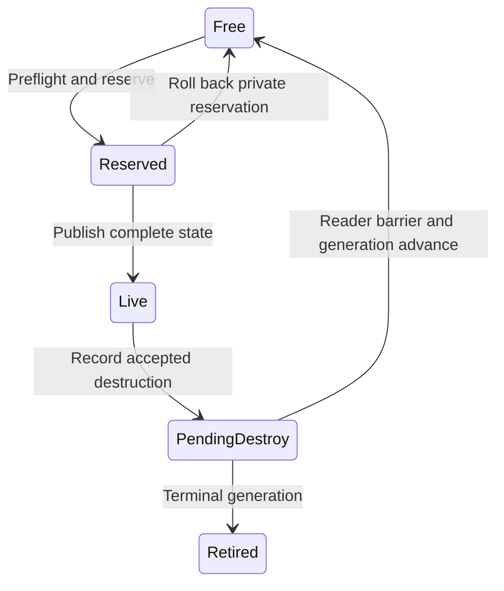

# Object handles and persistent UUID architecture

**Status:** Proposed architecture and implementation contract. Existing entity,
audio, and RHI identity mechanisms remain implemented as described below. The
shared identity module and UUID content workflow are proposed.

**Audience:** Engine, gameplay, tools, content, and SDK contributors.

**Evidence baseline:** Repository inspection at `52e29ce` on 2026-10-04 with
concurrent uncommitted changes. This document and its
[reference review](object-handles-uuid-reference-review.md) are the outputs of
this design task. No engine implementation or performance benchmark was added.

Ludus should use **typed generational handles for runtime access** and **typed
UUIDs for durable identity**. Resolve durable references at explicit boundaries,
then run simulation over handles or dense component storage. Keep owners visible,
borrow pointers within protected phases, and retire resources after their users
finish. This provides a small, inspectable core that supports streaming, multiple
worlds, editor undo, saves, and reload without making every object participate in
a universal manager.

These are design judgments for Ludus, informed by current primary documentation
and the local chapters. There is no universally fastest handle representation.
The architecture prioritizes identity safety and clear lifetime contracts, then
permits measured storage optimizations without changing those contracts.

## Core decisions

1. Preserve `EntityId` as `World / Slot / Generation`: `uint64 / uint32 / uint32`.
   Use equivalent owner-scoped values for new runtime domains, with separate
   semantic types. Keep existing audio and RHI ABIs until separately migrated.
2. Never reuse a runtime owner identity within its process and never wrap a slot
   generation. Retire exhausted slots and report owner-identity exhaustion.
3. A handle neither owns an object nor pins its memory. Pointer borrowing,
   lifetime leases, and identity validation are separate operations.
4. UUIDs belong in durable records and resolution tables. Dense numeric access
   belongs in gameplay and rendering loops. A hash is only a lookup accelerator.
5. Generate new authored UUIDv4 values through platform entropy. Preserve them
   through renames and moves; duplicate objects through a graph remapping
   transaction. Scope reusable source objects by their instance identity.
6. Share small value types and generation rules. Keep object storage,
   synchronization, destruction, residency, and ownership in each subsystem.
7. Validate runtime handles in release builds. Cache identities, never unprotected
   pointers. Gate delayed results with operation identity and content revision.
8. Start with fixed capacity during active phases and owner-thread structural
   mutation. Add compressed handles, paging, concurrent reclamation, or distributed
   ID issuance only for a measured or explicit product requirement.

## Current Ludus baseline

| Facility | Current behavior | Design treatment |
| --- | --- | --- |
| [EntityId](../../modules/gameplay/world/include/ludus/gameplay/world/entity_id.h) and [EntityRegistry](../../modules/gameplay/world/src/entity_registry.cpp) | A nonzero process-issued world token, slot, generation, pending-destroy flag, creation sequence, and structural revision. Exhausted generations retire; initialization reserves capacity. | Preserve these guarantees and the public representation. |
| [ComponentPool](../../modules/gameplay/world/include/ludus/gameplay/world/component_pool.hpp) | Dense values and full owner IDs, sparse slot lookup, exact owner equality, swap removal, preallocated storage, phase restrictions. | Preserve. Identity allocation does not replace component storage. |
| [Audio handles](../../modules/audio/include/ludus/audio/audio_types.h) and [bookkeeping](../../modules/audio/src/internal/handles.hpp) | Typed `uint32` session/slot/generation values, process-issued sessions, generation exhaustion, subsystem-specific asynchronous ownership. | Reuse contracts where compatible; preserve the current sentinel and concurrency rules. |
| [RHI handles](../../modules/graphics/rhi/include/ludus/graphics/rhi/render.h) | Separate shader/uniform/pipeline types with private `uint32` IDs and backend-owned validation. | Review backend issuance, session rejection, and retirement before a dedicated migration. A small public ID alone does not establish its implementation policy. |
| [Levels](level-data.md#authored-identity-and-references) and [content](content-resources.md) | Scoped authored strings and logical manifest keys; cold-path resolution; staged replacement. Content also has SHA-256 digests. | Keep version-1 formats usable. Add UUIDs through a versioned authoring workflow; keep names and digests in their existing roles. |

This proposal follows [AGENTS.md](../../AGENTS.md), the
[steering rules](../../.kiro/steering/coding-standards.md),
[ADR 0003](../decisions/0003-standard-library-usage-policy.md), and the
[foundational include boundary](foundational-headers.md). It complements
[entity storage](entity-world.md), [memory](memory-management.md), and
[gameplay reload](project-live-reload.md). Proposed allocation facilities are not
prerequisites for nonallocating identity values and codecs.

## Identity types and their lifetimes

| Value | Identifies | Lifetime and use |
| --- | --- | --- |
| `EntityId`, `TextureHandle`, `VoiceHandle` | One runtime incarnation in one owning registry/session | Nonowning runtime references. Reject after destruction or owner replacement. |
| `AssetId` | One logical authored asset | A UUID that survives moving files or changing asset contents. |
| `SourceObjectId` | One authored object in a level or reusable source document | A UUID retained through edits. Distinct from its display name. |
| `InstanceId` | One placement or saved instance scope | A UUID that distinguishes repeated instances of the same source. |
| `PersistentObjectKey` | One object within an instance | The pair `(InstanceId, SourceObjectId)`, normally 32 bytes. Used in saves, undo, and durable object links. |
| `ContentRevision` and content digest | Which state or payload of an identity is in use | Changes when content changes; identity need not change. |
| `NetObjectId` | A replication binding in a network session | Protocol-owned; mapped to local runtime identity, never confused with authority or persistence. |
| Debug name or `NameId` | A human label or interned spelling | Search and presentation. Rename does not destroy identity. |

Give `AssetId`, `SourceObjectId`, and `InstanceId` separate wrapper types even
though each contains the same 16-byte UUID value. Require named conversion at
serialization boundaries. Compile-time tags prevent mixing entity, texture,
and voice domains. Runtime owner checks prevent mixing two registries of the
same domain. Neither mechanism replaces the other.

Transient particles, temporary query results, plain component values, and most
projectiles need no UUID. Give an object durable identity only when something
must name it after its runtime incarnation ends. Persistable runtime spawns can
receive a new source-object UUID within their saved instance scope; an instance
scope need not refer to a prefab asset.

## Runtime handle representation

The default for a new externally held domain is a trivially copyable 16-byte
value on the supported targets:

```cpp
#pragma once

#include <ludus/foundation/base/types.h>

namespace ludus::foundation::identity
{
// Thanks to Scott Bilas, "A Generic Handle-Based Resource Manager", Game
// Programming Gems 1, section 1.6, pp. 68-79, for typed indexed handles, and
// Jason Gregory, "Object References and World Queries", Game Engine Architecture,
// third edition, section 16.5.3, pp. 1082-1085, for incarnation validation.
// Design inspiration only: owner tokens and nonwrapping generations are Ludus
// choices; no sample code is copied. Review: object-handles-uuid-reference-review.md.
template <typename Tag>
struct Handle final
{
    uint64 Owner = 0;
    uint32 Slot = 0;
    uint32 Generation = 0;

    [[nodiscard]] constexpr bool operator==(const Handle&) const noexcept = default;
};
} // namespace ludus::foundation::identity
```

This is an API sketch, not an instruction to replace `EntityId` or expose an
untyped object pointer. Each subsystem names its tag and handle type. The handle
does not contain a pointer, refcount, UUID, virtual function, or manager lookup.
Public fields aid inspection and match `EntityId`; forged or malformed values
still fail validation. For FFI, use explicit plain fields and adapters through
the existing versioned function-table boundary rather than exporting templates
as an ABI.

All-zero is the canonical null value. Owner zero or generation zero is invalid;
slot zero is a valid first slot. Equality compares the complete value, including
owner. Equality and null tests say nothing about liveness. There is no implicit
integer conversion, automatic dereference, or manager-searching `operator->`.

An owner token identifies the registry's **lifetime**, not its C++ address, thread,
world name, or mutable object revision. Moving a registry transfers its token and
storage, leaving the source inert. Clearing and rebuilding a registry invalidates
all references and obtains a fresh token. It must not zero its generations and
continue using the same owner token. The existing registry's no-reset policy is
the initial implementation of this rule.

The process host issues nonzero monotonically increasing `uint64` tokens, once
per new registry lifetime. Issue them through one host-owned source when code
modules can reload: a header-local static or a static linked independently into
each dynamic module is not process-wide issuance. A named host callback can
provide issuance across the gameplay ABI. The source's counter may use relaxed
atomic operations for unique numbers; publication of objects requires separate
synchronization. Return `IdentityExhausted` at the terminal value; never wrap.
Forked processes cannot exchange these runtime tokens as object references.

### Optional local handles

A distinct internal `LocalHandle<Tag>` can contain `uint32 Slot` and `uint32
Generation`, occupying eight bytes. It is suitable only where the enclosing
storage proves one owner and is discarded before that owner is replaced. Two
owners can legitimately issue the same local value: passing one to the other
cannot be detected by those eight bytes.

Keep this type out of public gameplay links, asynchronous messages, editor
selection, script references, and mixed-world queues. Merely taking a registry
parameter does not prove the caller chose the correct registry. Promotion to a
full handle requires an established owning context; attaching an arbitrary owner
token does not recover lost provenance. Adopt local handles only after measuring
memory or cache pressure and auditing every escape path. Do not steal a few bits
for an owner or type field without a demonstrated capacity and exhaustion plan.

## Registry state and validation

Each owner keeps slot generations, slot state, and a reusable-slot list. A domain
that stores dense objects also needs slot-to-dense and dense-to-slot mappings;
an ECS registry does not need a second object-pointer table. Keep metadata and
payload separate so an invalid lookup does not touch a destroyed object.



`Reserved` is private construction state. It need not be stored as an additional
flag if unpublished construction already guarantees it. A reservation that has
escaped to a client or job is an observable incarnation: cancellation must consume
its generation before reuse. Returning an asynchronous pending handle requires
that explicit protocol; it cannot use private rollback.

`IsAlive` validates, in order:

1. The owner is nonzero and exactly matches the receiving registry.
2. The generation is nonzero and the slot is within the configured range.
3. The slot is published and live.
4. The stored generation exactly equals the handle's generation.

`IsActive` additionally rejects pending destruction. These checks remain in
release builds. A component lookup also checks its sparse index, dense bounds,
and exact dense owner, as Ludus does today. Callers that need authoritative
activity check the registry or an active-world facade; pool membership alone
can remain visible during cleanup of a pending entity.

Generations start at one. Release increments the slot's generation before reuse;
a slot released at its terminal usable generation becomes retired permanently
for that owner. Retain a subsystem's reserved sentinel policy, including audio's,
until deliberately migrated. Retired slots count against configured capacity.
Changing free-list order cannot compromise correctness; a simple deterministic
LIFO list is adequate initially. A FIFO list or reuse delay may spread churn,
but cannot substitute for exhaustion handling.

The safety argument is small: a recycled slot has a different generation; a
replaced registry has a different owner; neither counter wraps or resets while
old handles may exist. Therefore an old value cannot name a newly issued
incarnation within this process. This argument assumes correct publication and
synchronization; it is not a concurrency or memory-safety proof for escaped
pointers.

Initialization allocates and checks all required arrays and byte-size products
before installing an owner. Active-phase create, validate, and release do not
allocate or grow. Capacity, sequence, and structural-revision exhaustion have
explicit statuses. Fallible operations are `[[nodiscard]]` and `noexcept`; failed
creation leaves the output unchanged. Preflight a batch's capacity and revision
budget before publishing any of its structural changes. Avoid ordinary allocating
STL calls on a path that promises recoverable allocation failure.

## Storage and pointer borrowing

Keep the current ECS sparse/dense design. Its owners are identities, its dense
positions are locations, and its values are state. Swap removal updates the
moved owner's sparse entry. It never changes that owner's generation. A removed
and later re-added component can reuse an address even though the entity survives;
entity liveness does not validate an old component pointer. If a component itself
must have independently retained identity, give that facility an explicit
membership generation in a separate design.

For non-ECS domains, choose dense storage for movable plain values and stable
allocation for objects whose backend or API requires a stable address. Indirection
allows either choice without changing handles. Relocating nontrivial objects
requires legitimate move/construction/destruction semantics; do not byte-copy
arbitrary C++ objects. Use current fallible arrays and reserve capacity before
introducing slab or custom allocator machinery.

A pointer or span from `Find` is borrowed until the current protected phase ends,
or earlier if a documented structural operation occurs. Resolve once and reuse
within that phase. Do not retain it in a handle wrapper, suspended coroutine,
callback, editor model, or job that outlives the phase. Dense iteration should not
perform UUID lookup or repeatedly resolve the owner already supplied by its pool.

Owner-thread structural mutation is the initial synchronization policy. Jobs may
read protected storage or perform declared disjoint value writes; the owner joins
them before committing structural changes. `InvalidPhase` is a runtime error,
not just a debug assertion. A structural revision helps debug borrowed views but
cannot make an escaped raw pointer safe. An optional noncopyable debug view can
check the revision under the existing reader protocol.

### Destruction and physical retirement

Accepting a destroy command marks the entity pending only after the bounded
command has been recorded successfully. At the commit boundary, close new
gameplay access and join current readers. Preflight the structural batch, detach
durable bindings, remove components, then release the registry slot. Existing
pool removal requires a live registry entity, so preserve this order inside the
exclusive commit facade. No user callback can resolve partially dismantled state.

Detach any external resources into subsystem-owned retirement records before
recycling their storage. Call external cleanup only after public identity access
is closed; never invoke arbitrary destructors while a registry lock is held.
GPU fences, audio callback acknowledgments, and job completion determine when
the detached resources can actually be freed. Queue space and lease budgets are
part of preflight. Invalidating identity does not prove physical users have stopped.

An asynchronous consumer stores a full handle and an operation ticket containing
the owning session/request sequence and expected content revision. On completion,
the owner revalidates all of them before publication. A still-live entity may have
cancelled a request or started a newer one. A copied UUID is not sufficient to
authorize an old completion after unload and recreation. Worker access to payload
memory needs an explicit lease, snapshot, or reader phase in addition to the ticket.
Atomic generation checks alone leave a validate-then-free race; add concurrent
reclamation only with a concrete consumer and a separate synchronization design.

## Persistent UUID representation and generation

Use `Uuid { uint8 Bytes[16]; }` in canonical byte order, with semantic wrappers
containing a UUID by value. Do not depend on packed structs, bitfield layout,
native-endian integer dumps, unaligned loads, or platform GUID memory layout.
Keep the codec, equality, and hashing interface small and allocation-free.

[RFC 9562](https://www.rfc-editor.org/rfc/rfc9562.html#section-4) specifies 128-bit
UUIDs and network byte order. Its
[UUIDv4 definition](https://www.rfc-editor.org/rfc/rfc9562.html#section-5.4) uses
122 random bits after version/variant fields;
[section 6.9](https://www.rfc-editor.org/rfc/rfc9562.html#section-6.9) recommends
cryptographic random generation. These are format facts. Choosing v4 for Ludus
authoring is this proposal's judgment: minting occurs mainly outside hot loops
and needs neither clock ordering nor a central ID server.

The tools or runtime persistence owner obtains 16 bytes from an injected
platform entropy provider and sets the v4 version/variant fields. Entropy failure
returns `EntropyUnavailable` with no partial output; do not fall back to wall
time, pointer addresses, `rand`, or a gameplay PRNG. Native and browser adapters
must satisfy the same entropy contract. Batch generation can amortize calls
after measurement without maintaining a second custom cryptographic generator.
Deterministic tests inject a controlled byte source that cannot become the
production default.

Write lowercase `8-4-4-4-12` hexadecimal text, exactly 36 characters. Parse this
shape with case-insensitive hex; reject whitespace, braces, wrong separators,
wrong length, and unsupported versions/variants under the schema policy. Initial
durable schemas require v4 for nonnull identity. All-zero is an explicit optional
reference sentinel and is forbidden for actual asset/object/instance identity.
Formatting uses a caller-owned 36-byte buffer, or 37 bytes for a terminating
zero. Parsing failure leaves the output unchanged. Store exactly 16 canonical
bytes in versioned binary formats.

Treat global UUID uniqueness as probabilistic, then enforce uniqueness exactly
within every loaded project, import, save, or package index. Full-byte equality
decides identity after a hash match. For newly generated identities, check the
target index and retry at most four candidates; return `IdentityConflict` if
generation cannot produce a free one. For duplicates supplied by content,
reject with both source locations. Never silently regenerate one side when
existing references may depend on it. Project merge and duplication use an
explicit remapping transaction.

UUIDv7 adds timestamp ordering
([RFC 9562 section 5.7](https://www.rfc-editor.org/rfc/rfc9562.html#section-5.7)).
Adopt it only for a separately measured ordered database requirement with a
versioned schema and clock policy. It does not improve direct slot lookup. Keep
deterministic derived subresource keys explicit, such as `(AssetId, SubresourceId)`;
do not label an arbitrary truncated hash as a standard UUID or allow changes in
names to silently change identity.

## Authoring and prefab instances

The editable document stores an asset/document UUID, an object UUID for each
durable source object, and independent human-readable names. A maintained project
index maps UUID to source location, kind, and current revision. Rebuilding that
derived index never mints replacement IDs. Reject duplicate identity before
publishing the rebuilt index. Raw file copies that preserve IDs are either the
same logical artifact or an import conflict, not an implicit duplication request.

Renaming, moving between files, reordering, or changing a recipe preserves the
source object's identity when the operation means the same logical object.
Explicit replacement can mint a new identity. Undo of deletion can restore the
original durable identity, but recreation receives a new runtime handle. An
editor selection or undo record keeps the durable key, expected document revision,
and optional cached handle; it never keeps a component pointer.

Every placed prefab instance receives its own `InstanceId`. An internal target
reference names a `SourceObjectId` within that same instance, so ten copies of a
prefab resolve the target to ten different runtime objects. An external link stores
the complete `PersistentObjectKey`. A standalone level uses its placement/save
scope as the instance. Two placements of the same level receive different
instance IDs; reopening the same saved placement restores its saved ID.

Nested prefab scopes have their own instance IDs stored in the placement/save
graph. The loader resolves a relative path of authored placement IDs to the
appropriate scope, then resolves the leaf source object. Flatten these references
to concrete keys at activation. Do not invent a new nested instance ID on every
load, use ambiguous concatenated strings, or truncate a parent/child hash to claim
collision-free identity. Prefab revision migration explicitly remaps renamed or
replaced source objects; missing required targets reject the candidate.

Duplication is a graph transaction: allocate all new source or instance IDs,
build the old-to-new table, clone data, rewrite references whose targets belong
to the copied set, retain deliberate external references, validate, then publish.
Duplicating a source document remaps its contained source objects; duplicating a
placement remaps instance scopes while retaining source-template IDs. If any
step fails, neither the original nor a partially rewritten clone is published.

## Resolution and streaming

Keep two derived mappings at the owning boundary: durable key to runtime handle,
and runtime slot to optional durable binding. The reverse binding is validated
with generation and owner, so recycled slots cannot inherit a former object's
UUID. Publish and remove both mappings together with object activation and
destruction. Reserve their capacity before commit. Do not add UUID metadata to
every transient entity or retain multiple mutable sources of truth.

Start with a sorted contiguous binding table for small immutable candidate
worlds. For a measured dynamic streaming workload, use a private preallocated
flat hash table with a declared load limit and exact key equality. Sorted lookup
is `O(log n)`; hash lookup is expected `O(1)`, not a worst-case guarantee. Keep
table iteration order out of gameplay priority and serialized output. Cache
handles after resolution; require an allocation-failure-capable container seam
before promising transactional growth.

The proposed `TryResolve` returns a status and a full handle, without I/O or
implicit loading. It validates both the runtime incarnation and the durable
binding on a cache hit. Unload/reload removes the old binding and creates a fresh
handle; the durable key remains available for a later explicit resolve. A cached
negative result must be checked against a binding-table revision or invalidated
on publication. Otherwise an unloaded target can remain falsely missing forever.

| Resolution state | Meaning and response |
| --- | --- |
| `Resolved` | A matching live binding exists. Check activity and required capability before use. |
| `NotResident` | An authoritative catalog/save index knows the target, but its instance is not loaded. The caller may explicitly request streaming. |
| `Missing` | No known target exists in the available authoritative scope. Report it; do not claim permanent deletion without evidence. |
| `TypeMismatch` | Identity exists but the required asset kind or gameplay capability does not match. |
| `InvalidReference` or `Conflict` | Malformed key, unknown scope, or duplicate identity. Reject required bindings. |

Deletion can be reported separately if a save/editor layer actually maintains
tombstones. Optional absence is distinct from a broken required reference. Required
local links are resolved in a second pass after all candidate entities exist,
preserving forward references and the current staged-world transaction. Streaming
links state whether absence is allowed; the resolver must not guess gameplay policy.

Cooked package indices and local relocations may compress UUID references into
numeric dictionary indices, provided the dictionary preserves full identity and
is included in the versioned artifact. These indices are artifact-local; changing
the package ordering cannot retarget saved references. Rehydrate durable identities
and rebuild runtime bindings on load. Serialize neither runtime owner/slot/generation
nor object addresses. Restore uses two passes: create objects, then fix up links.

## Logical assets and resident payloads

Distinguish an asset's logical record from its current resident payload. An
`AssetId` resolves to a typed `AssetHandle` for a record in the content session.
The record can survive eviction or validated hot reload while moving through
`Unloaded / Loading / Ready / Failed`. Handle liveness therefore does not imply
that payload data is available. An entity or GPU-object handle, by contrast,
names one runtime incarnation and does not silently rebind after destruction.

Hot reload keeps the logical asset ID, advances `ContentRevision`, validates a
candidate payload, and publishes at the subsystem's safe boundary. A caller that
needs bytes or a backend resource obtains a phase borrow or explicit lease of
one immutable payload version. Older leases retain that version until completion;
they cannot be redirected midway through a draw, audio callback, or job. A logical
asset handle cannot be used as a fence or physical-resource lifetime lease.

Presentation may choose a visible missing-texture material or silence through an
explicit fallback policy. Keep fallback objects immutable and distinguish fallback
use in inspection. Required gameplay targets, collision data, and authoritative
state return errors; they do not become null objects that quietly change game
rules. This adapts the weak-reference article's useful residency indirection
without adopting automatic lifetime ownership or a fallback for every domain.

## Persistence and networking

Save the instance scopes, durable keys, schema versions, and required state.
Allocate fresh runtime owners and handles on restore. Asset identity is independent
of its digest: an edited asset may retain its UUID while changing digest; copied
bytes can belong to two distinct logical assets. Store source revisions/digests
where reproducible loading requires them. A rename alias table may assist a
versioned migration; it is not an alternate mutable identity system.

Networking owns a separate session-to-local binding table with generation or
issuance policy that rejects delayed packets after reuse. Persistent server
objects may carry durable keys; compact session IDs can carry routine packets.
The authoritative peer chooses creation and binding, and validates permissions
separately. Possession of a UUID or locally valid handle grants no authority.
Client-predicted objects use a separate provisional ID type and explicit
reconciliation; they cannot assert a permanent server binding by choosing a UUID.
Detailed replication/reclamation rules belong to the future networking design.

Deterministic simulations must not mint random UUIDs as ordering decisions. Use
authored identity, a recorded spawn identity, or the existing deterministic
creation sequence for documented tie policies. Hash iteration, runtime owner
values, pointer addresses, and worker completion order are unsuitable priorities.
If replay needs new persistent IDs, record the assigned identities in the replay
or use a separately specified deterministic issuance protocol.

## Module and API boundaries

Introduce `FoundationIdentity` only for small handle/UUID values, UUID codecs,
generation advancement, and the host-owned lifetime-token source. It depends on
FoundationBase and does not include Platform, Logging, strings, or containers in
its value headers. Atomic counters and implementation details stay in `.cpp`.
The entropy adapter lives in Platform/tools and supplies bytes to a pure UUIDv4
construction function; FoundationBase never gains an upward dependency.

When implementing these facilities, place concise author acknowledgments beside
the affected code, following [the reference review](object-handles-uuid-reference-review.md).
Credit the consulted work and explain departures; these are design inspirations,
not copied implementations. UUID codecs credit K. Davis, B. Peabody, and P. Leach,
*Universally Unique IDentifiers (UUIDs)*, RFC 9562, sections 4, 5.4, and 6.9
([stable specification](https://www.rfc-editor.org/rfc/rfc9562.html)). Asset residency
credits Noel Llopis's article 1.7 in *Game Programming Gems 4*, pp. 61-68;
issuance/authority policy credits Yongha Kim's article 7.3 in *Game Programming
Gems 6*, pp. 623-628; pointer-cache rules credit Brian Hawkins's article 1.5 in
*Game Programming Gems 3*, pp. 44-48. Thank the authors near those implementation
boundaries and link to the exact titles and adoption/departure details in the review.

Use the explicitly included FoundationBase `checked_integer.hpp` helpers for
capacity conversion and allocation-size arithmetic, and `byte_order.hpp` for
fixed-width integer fields in versioned identity formats. Canonical UUID byte
arrays need no host-endian reinterpretation. Neither opt-in helper belongs in
the identity value header or the foundational `types.h`/`core.h` include closure;
see [primitive types and numeric boundaries](primitive-types.md).

Typed facades remain `GameplayWorld`, audio, content, and RHI responsibilities.
Do not export one giant `Registry<T, Allocator, StoragePolicy, ThreadPolicy>` or
include private headers across module boundaries. Shared non-template bookkeeping
can be extracted once two concrete consumers need it. The existing component
template continues to serve its own documented storage contract.

| Proposed operation | Contract |
| --- | --- |
| `TryParseUuid(text, output)` | Bounded validation; no allocation; unchanged output on failure. |
| `FormatUuid(value, buffer)` | Canonical text in caller-owned storage; explicit insufficient-space result. |
| `TryMakeUuidV4(randomBytes, output)` | Pure construction from an explicitly supplied 16-byte input; production generation obtains entropy first. |
| `TryIssueLifetimeId(output)` | Host source issues once, thread-safe; no wrap or allocation. |
| Registry `TryCreate`, `IsAlive`, `IsActive`, `TryRelease` | Preserve the current phase, capacity, full validation, and output contracts. |
| `Find(handle)` and `DiagnoseHandle(handle)` | Null-returning protected lookup; separate cold diagnostic explaining rejection. No auto-load. |
| `TryResolve(key, output)` | Explicit durable binding lookup; no I/O; validates cache provenance. |
| `TryAcquirePayload(handle, output)` | Domain-specific readiness check and bounded borrow/lease acquisition; independent of identity validity. |

Use subsystem statuses at facades rather than imposing one engine-wide enum for
unrelated failures. Ordinary missing content and stale delayed work are statuses,
not assertions. Broken internal free-list invariants are assertion failures through
the FoundationBase emergency path. Diagnostics use existing logging outside hot
validation; failure to log must not change identity behavior.

## Debugging and observability

Display complete values such as `Entity{World=42, Slot=17, Generation=9}`. UUID
inspection shows its semantic type, source path, debug name, instance scope, and
revision when those records exist. Keep generation distinct from content revision.
The editor can copy canonical UUIDs and navigate to their source without requiring
simulation to store long strings on every entity.

`DiagnoseHandle` distinguishes null/malformed value, owner mismatch, out-of-range
slot, free or retired slot, stale generation, and pending destruction. For a
resolved asset it also shows residency and payload revision. A bounded optional
history ring records creation, invalidation reason, and issuing site/sequence;
debug names and history are side metadata. Rate-limit stale-reference reports at
the operation boundary rather than logging each `IsAlive` call.

Track capacity, live/pending/free/retired counts, peak generations, capacity
failures, durable-binding conflicts, unresolved references, stale completions,
lease counts, retired payload bytes, and completion backlog. Report enough to
identify the actual owner and source; do not truncate a UUID or hash and then use
that display abbreviation as an identity key. Provide debugger pretty-printers
without modifying the shipping handle layout.

## Validation and performance gates

Implementation needs tests for wrong-domain compilation, two owners issuing the
same slot/generation, deletion/reuse, pending visibility, registry moves and
replacement, slot retirement, terminal owner issuance, double destroy, and malformed
values. Test terminal counters through a narrow test seam. Exercise create/commit
allocation failure and output preservation; validate free-list uniqueness and
complete sparse/dense back-mappings after randomized operations.

UUID and content tests cover known format vectors, binary/text round trips,
case handling, malformed input, nil-policy enforcement, entropy failure, injected
duplicate generation, hash collisions with exact equality, and duplicate import
diagnostics. Test rename/move preservation, graph duplication, nested and repeated
prefabs, undo recreation, cross-instance links, two-pass forward references,
streaming negative-cache invalidation, save restore, and unchanged active worlds
after a failed candidate. Test stale operations while the handle remains alive,
as well as unload/recreation of the same durable key.

Run warning-clean builds, format/tidy, unit tests, ASan/UBSan, and SDK consumption
with the pinned native tools when code is implemented. Exercise browser UUID
adapters and portable serialization with the pinned web toolchain. Add TSan and
explicit concurrency scenarios if a concurrent implementation is introduced.
Sanitizers supplement lifetime tests; they do not prove semantic identity safety.

Measure release-build lookup, create/destroy churn, dense iteration, binding
resolution, UUID batch generation, and reload/retirement. Include hot and cold
working sets, live/stale/wrong-owner mixes, realistic component values, repeated
slot churn, and memory footprint. Report latency distribution, allocation counts,
branch/cache data where available, and total frame cost against the current Ludus
baseline. A raw-pointer comparison is valid only inside the same protected lifetime.

Full handle validation and fixed-capacity free-list operations have bounded
constant work; complete object construction/destruction can have additional
domain costs. UUID resolution is outside the dense loop. At 1,048,576 references,
16-byte handles occupy 16 MiB and eight-byte local handles occupy 8 MiB, before
enclosing-struct padding. Current entity slot metadata targets 16 bytes plus a
four-byte free-list entry per capacity slot; each reserved component pool also
budgets sparse indices, full dense owners, and values. Measure actual layouts
and reserved capacity on each target before optimizing them.

| Alternative | Decision |
| --- | --- |
| UUID-to-pointer lookup for every runtime access | Keep for durable resolution; avoid its table work in dense iteration. |
| Raw pointers as long-lived object identity | Allow protected short borrows; they cannot reject slot reuse or support relocation. |
| Shared ownership for all entities | Keep explicit world ownership; use leases for actual retained resources. Copying a reference must not delay gameplay destruction. |
| A packed 32-bit handle with short generation | Preserve existing domains where independently justified; reject as the general default because capacity and reuse lifetime are unnecessarily constrained. |
| An eight-byte local slot/generation | Conditional optimization with a proved owner boundary and measurements. |
| A global singleton resolver with `operator->` | Keep owners explicit and lookup visible; avoid hidden synchronization and lifetime policy. |
| UUIDv7 or server-assigned distributed IDs everywhere | Conditional facilities for ordered databases or distributed authority, not ordinary runtime identity. |
| Lock-free registry and automatic reclamation | Separate future design after a concrete concurrent consumer exists. |

## Implementation sequence

1. Add the pure identity values/codecs and lifetime source with tests and SDK
   header checks. Leave existing public types and formats unchanged.
2. Align duplicate generation/token helpers behind existing subsystem facades
   where policies actually match. Validate old-world, old-audio-session, and RHI
   session rejection independently. Preserve audio callback and RHI fence protocols.
3. Introduce versioned UUID authoring records and an explicit migration manifest
   mapping existing scoped strings to committed UUIDs. Generate that manifest
   once, atomically, and preserve names as readable labels. Existing v1 inputs
   continue to work through their current loader; do not mint unstable UUIDs on
   every v1 load or silently rewrite those files.
4. Add durable binding, graph duplication, and two-pass restore in tools/content.
   Integrate stable editor selection and stale operation checks through the
   current staged-world and gameplay-reload boundaries. This does not by itself
   add in-place world migration to the current whole-level restart behavior.
5. Add streaming records and immutable payload leases when a real resource needs
   them. Benchmark the complete consumer before selecting a hash table, local
   handle, paged sparse storage, or concurrent reclamation.

Each stage is independently reviewable. The reference review records the design
before chapter reading, the adopted refinements, and historical mechanisms that
would weaken Ludus's present guarantees.
