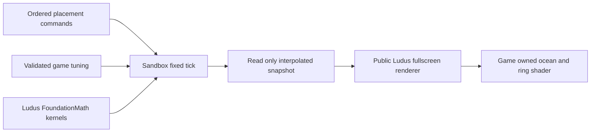

# Physics and fluid simulation for Drift

This design defines reusable numerical kernels in Ludus and the small simulation
that powers Drift in Ludus-Sandbox. The decision is a CPU authoritative, fixed
60 Hz simulation with analytic expanding rings and exact linear water drag.
Procedural ocean shading stays independent. This delivers predictable steering,
bounded work, and inspectable state with the existing installed SDK renderer.

## Requirements and ownership

One circular boat and at most 16 ripples fit a serial, allocation free loop. Use
world meters, seconds, and velocity in meters per second, positive Y up. Game
state uses float64; render extraction narrows bounded values to float32. No GPU
readback, global simulation service, ECS dependency, or physics middleware is
necessary for this scale.

Ludus FoundationMath owns checked drag coefficients and swept expanding radial
band queries. These are general numerical operations with no boat/water rules.
Sandbox owns boat state, tuning, ripple lifetime, once-only contact flags,
input/cooldown, pause/retry, speed limits, and eventual hazards/docking. Public
headers expose values and noexcept functions, with no allocation or heavy STL.

## Timing and numerical model

Clamp incoming frame delta to 100 ms and execute at most four ticks per frame.
Discard remaining whole ticks and record the count; preserve fractional debt.
Pause, hidden tabs, and retry clear pending commands/debt and reset interpolation.
Input edges survive zero-tick frames and are consumed once. Same ordered commands
and settings at the same ticks reproduce the same state on a given build. Do not
promise bitwise agreement across libm implementations or compiler targets.

For constant water velocity u, boat velocity v, and nonnegative drag rate k:

- dv/dt = -k(v-u)
- v1 = u + (v0-u) exp(-k dt)
- x1 = x0 + u dt + (v0-u) (1-exp(-k dt))/k

At k=0 use v1=v0 and x1=x0+v0 dt. Compute the distance factor with expm1 to
avoid cancellation near zero. Validate all authored inputs before installation.
Water velocity is a distinct physical parameter, default zero, and does not
inherit the ocean panel's cosmetic pattern velocity.

A ring has center o, radius r0, growth g across a tick, and contact half-width w
including the boat radius. Find the earliest t in [0,1] satisfying
abs(length(p0+t(p1-p0)-o)-(r0+t g)) <= w. Solve both signed band boundaries;
reject negative signed radii introduced by squaring. Starting overlap counts as
contact. Use explicit miss/invalid/numeric failure results and leave output
unchanged on failure. A coincident center has a zero normal and zero impulse.

The boat sweep is the chord between exact drag endpoints, parameterized linearly
in tick time. This approximates the exponential trajectory; under the default
7 m/s cap, 0.7/s drag, zero current and 1/60 s tick, its maximum positional timing
error is approximately 0.00017 m. This is far below the 0.35 m ring half-width.
Keep impulses at tick end for compatibility: displacement responds on the next
tick. Do not label this a fully continuous force/contact integrator. If playtests
require immediate response, split integration at contact times and recompute
remaining contacts, with a bounded event count and new regression cases.

## Tick pipeline

1. Consume queued placements and validate cooldown/capacity.
2. Save previous transform; integrate the boat's drag/current endpoint.
3. Clip each ripple sweep to its remaining lifetime. Collect first contacts.
4. Sort by contact fraction then monotonic ripple ID; consume each once, add
   attenuated radial impulses, and enforce the game speed cap.
5. Commit motion, heading/feedback, ripple expiry, counters, and snapshot.

Future rock/boundary collision queries must cut this interval at the earliest
crash and exclude later ripple impulses. A crash takes priority over a docking
trigger. These rules belong to Sandbox and are not implemented by math kernels.

## Fluid fidelity choices and extension gates

| Model | Role and decision |
| --- | --- |
| Analytic traveling rings plus constant current | Implement now. O(16) CPU work per tick, no simulation buffers, responsive gameplay. |
| Analytic Gerstner or summed sine waves | Presentation option when bob/tilt is wanted; sample one shared definition if buoyancy later depends on it. |
| iWave or linear wave heightfield | Later option for reflection/interference. CPU reference, CFL constrained substeps, absorbing boundaries, fixed world sampling. Height does not itself define horizontal current. |
| Shallow water equations | Admit only when depth/shore transport is a gameplay requirement. Conservative finite-volume solver, wet/dry treatment and positivity checks need separate validation. |
| SPH, FLIP/APIC, full Navier Stokes | No evidence of benefit for the current overhead puzzle; substantially larger implementation, tuning and GPU integration costs. |

These are architecture choices for this game, not claims of a universally best
fluid solver or measured state-of-the-art performance. A grid extension should
expose a sample(position, tick) contract returning velocity and optional surface
height/normal; authoring and renderer resolution must not change physical units.
Preserve an analytic backend for debugging. Avoid adding an abstract backend
hierarchy until a second implementation exists.

## Performance and debugging

Preallocate boat, ring, input and contact records. Stable insertion sort over at
most 16 contacts is readable and bounded. Preserve AoS debugger-friendly records;
SIMD, SoA and broadphase become justified only after profiling larger populations.
Never change numerical semantics to buy speed without reference comparisons.

Keep tick/placement/contact/discard counters; expose current tuning and snapshots
in tests/debugging. Inputs and tuning changes are tick-addressed replay data;
future checkpoints encode fields explicitly, never object bytes, pointers or GPU
handles. Debug overlays should show hull, physical ring band, contact fraction
and normal, and water velocity. Presentation can be disabled without affecting
simulation. A deterministic event trace is preferable to logging every frame.

## Implementation and acceptance

First implement checked kernels in FoundationMath, then make Sandbox consume them
through its SDK with an SDK-free reference adapter for its existing fast tests.
Add validated physical tuning, integrate current-relative drag, and centralize
contact math. Keep the public rendering layout and existing input lifecycle.

Tests must cover zero/small/large drag, current equilibrium, tangent/initial and
inner/outer band contact, shrinking bands, stationary sweeps, invalid/nonfinite
inputs, overflow and failure output preservation. Sandbox tests cover once-only
push, expiry, pause/reset, invalid tuning and presentation-rate invariance.
Run warning-clean native and browser builds, pinned format/tidy, ASan/UBSan,
installed SDK consumption and browser smoke checks. Record measured performance
and actual device evidence separately from budgets or goals.

## Reference review

The initial design was reviewed against the requested index and available
chapters. The [reference review](physics-fluid-reference-review.md) records the
evidence and resulting numerical and extension rules. Stable quadratic roots,
scaled coefficients and cached expm1 drag coefficients are adopted now;
interactive heightfields remain a separately validated extension.
