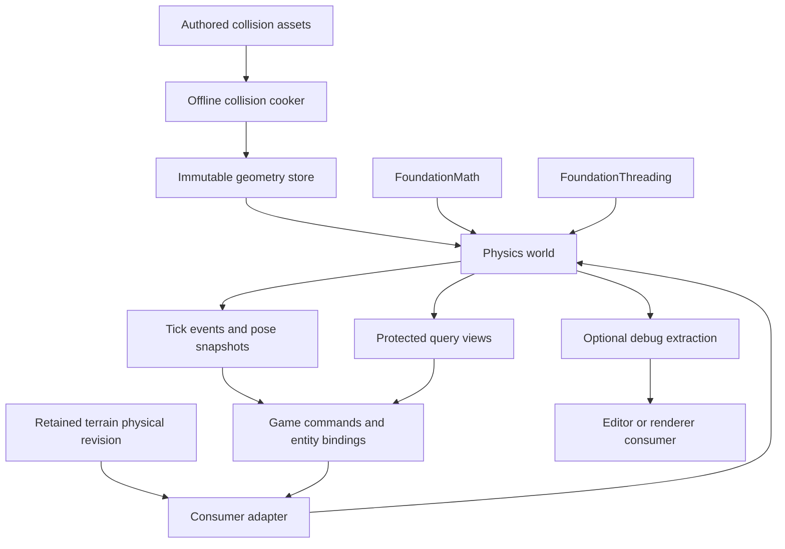

# Physics systems architecture

**Status:** Proposed; no general rigid-body implementation or dependency is added
by this document. Evidence baseline: `origin/main` at `1e2227c`, 2026-10-07.

Ludus should own a small physics API, asset cooking, gameplay integration, and
diagnostics, with one qualified CPU rigid-body implementation behind a private
boundary. Jolt is the first production candidate. Qualify it before committing
to its platform, allocation, failure, and replay behavior; do not build a second
general solver in parallel. This is an engineering recommendation, not a claim
of measured superiority or universal state-of-the-art performance.

## Initial design before the Gems review

The initial design selected the following contracts from Ludus's existing
ownership rules and current primary physics documentation. The
[subsequent Gems review](physics-systems-gems-review.md) records which decisions
it strengthens or changes. The contracts below are the revised design and take
precedence over this historical starting table.

| Area | Initial choice |
| --- | --- |
| Ownership | An explicitly owned world, immutable shared geometry, world-local colliders, optional dynamic/kinematic motion, typed generational handles. |
| Clock | CPU-authoritative fixed ticks, explicit substeps, no renderer dependency, game-owned catch-up policy. |
| Shapes | Sphere, box, capsule, convex hull, immutable compound; static mesh and terrain cooked separately from rendering. |
| Collidables | Shape instance plus pose, material, filtering, participation flags and game binding; geometry does not own simulation state. |
| Bodies | Static, kinematic and dynamic; explicit body frame versus center of mass; validated positive mass/inertia. |
| Phantoms | Sensor colliders with deferred overlap events; query-only colliders share geometry and traversal. |
| Solver | Persistent contacts, warm-started sequential impulses, friction, restitution, sleeping islands; qualified backend owns numerical details. |
| Forces and constraints | Forces/torques and impulses have distinct units; constraints use explicit anchors, limits, motors and break policies. |
| Queries | Ray, convex sweep, overlap; any/closest/all; bounded caller buffers, explicit initial-overlap, filter and completion semantics. |
| Concurrency | Owner-thread mutation at tick barriers; read phases; serial diagnostic path before parallel work. |
| Diagnostics | Replayable commands, inspectable snapshots, contact/constraint overlays, stage timings and capacity counters. |

## Integration boundaries

FoundationMath remains the owner of checked numerical vocabulary, not world
state. Physics does not depend on GameplayWorld, RHI, editor widgets or an ECS.
The game maps entity identity to physics handles and applies tick-addressed
commands. Terrain provides immutable physical revisions; the physics adapter
installs them at a safe tick boundary and pins required coverage.

The existing [PhysicsFluid module](../../modules/physics/fluid/README.md) is a
single-owner CPU shallow-water field, not a rigid-body world. Preserve it as an
independent subsystem. The older [Drift design](physics-fluid-simulation.md)
describes that game's analytic model; it does not define this general system.
Future buoyancy samples fluid state through an explicit game or coupling pass.

## Primary evidence

Thanks to Jorrit Rouwé, [Architecture of Jolt Physics](https://jrouwe.github.io/JoltPhysics/),
for practical body/shape separation, batched installation, and clear determinism
limitations. Thanks to Erin Catto, [Solver2D](https://box2d.org/posts/2024/02/solver2d/),
2024, for comparing sequential-impulse solver variants and explaining soft
constraints and substeps. Thanks to the NVIDIA PhysX team,
[Scene Queries](https://nvidia-omniverse.github.io/PhysX/physx/5.4.1/docs/SceneQueries.html),
for query collection and filtering contracts. These inform the design; no source
code is copied and no performance result is transferred to Ludus.

## Revised decisions and scope

The baseline is 3D rigid-body gameplay and collision queries: crates, doors,
platforms, triggers, picking, projectiles, and modest joint chains. A restricted
plane is useful, but is not a substitute for a dedicated 2D engine's topology
and performance. Characters, ragdolls and vehicles are consumer features added
when the core passes its gates. Deformables, cloth, fracture, articulations and
fluid-solid coupling have separate requirements and delivery plans.

Use one production implementation, private to Physics, and one public contract.
Jolt-first qualification is preferable to budgeting a new AAA solver without
shipping evidence. A test-only brute-force query oracle is small enough to own;
a second complete dynamics implementation is not. PhysX is a comparison
candidate when its capabilities justify another evaluation; GPU simulation is
an optional future workload, not the CPU baseline. Do not expose a runtime
backend selector or a least-common-denominator virtual hierarchy.

Qualification must pin an exact revision and license, prove the supported
native platforms and the separate pinned Emscripten build, audit CPU ISA and
compiler flags, and record which capabilities pass. Browser support in other
Ludus modules does not establish physics support. Verify SDK packaging, creator-
owned destruction, jobs, allocator callbacks, diagnostics and hot reload. Keep
backend headers, IDs, serialization and settings out of public file sets.

If the backend requires global type registration or allocator hooks, the host
owns one process-lifetime initialization and teardown protocol across all worlds
and reloads. A world must not replace those hooks or unregister types while
another world or cooked shape still uses them. This does not make world state
global.

**Failure behavior is a selection gate.** Jolt's consulted
[temporary allocator](https://raw.githubusercontent.com/jrouwe/JoltPhysics/master/Jolt/Core/TempAllocator.h)
aborts when its fixed arena is exhausted; its
[update errors](https://raw.githubusercontent.com/jrouwe/JoltPhysics/master/Jolt/Physics/EPhysicsUpdateError.h)
can indicate ignored contacts. A status wrapper does not repair either behavior.
Before production adoption, prove conservative storage bounds over admitted
inputs and disable hidden allocation fallbacks, or supply a narrowly reviewed
upstream change with safe failure propagation. Merely returning null from an
allocator whose callers assume success is invalid. Audit initialization and
shape creation too. If qualification cannot satisfy Ludus's rules, record a
failed candidate and revise this selection before implementation; do not ship
abort-on-OOM, exceptions, or an unbounded fallback under a `noexcept` promise.
This proposal has not yet qualified Jolt or established those bounds.

## Module and ownership model

Start with one `modules/physics/rigid/` target, proposed `PhysicsRigid`. Keep
geometry kernels, world storage, queries and dynamics as private sections of
that module until an independently shippable collision-only consumer warrants
splitting targets. A collision-only world mode skips dynamics, but uses the
same geometry and filters. Offline cooking lives in a separate tool target;
it may depend on content/filesystem services. The gameplay adapter belongs to
the consumer and maps `EntityId` to physics identity.



The diagram expresses ownership and calls; Physics never calls back into game,
editor or renderer code. Logging/profiling are opt-in implementation facilities.
Use the existing [bounded jobs](../decisions/0020-bounded-task-graphs.md),
[memory rules](memory-management.md), [entity phases](entity-world.md), and
[terrain coverage contract](terrain.md#query-and-physics-contracts).

| Object | Owner and lifetime | Contains |
| --- | --- | --- |
| Geometry store | Explicitly owned service, outlives worlds that lease its geometry | Immutable cooked shape revisions, bounds, support data, mesh acceleration and mass integrals |
| Shape lease | Creator-owned retained asset reference | Geometry identity/revision; world insertion retains its own lease |
| Collider | One physics world | Shape lease, local pose, material/filter, participation flags, stable subshape map and copied game binding |
| Body | One physics world | Body frame, attached colliders, motion type; dynamic motion/inertia only when needed |
| Constraint | One physics world | Endpoint handles, body-local frames, validated settings, state and diagnostic impulses |
| Read view | World-controlled scoped reader | Epoch and protected access; prevents mutation/destruction until released |
| Event/pose batch | World output until next publication, or caller-owned copy | Tick and epoch, value handles/bindings, no backend pointers |

Keep `ShapeHandle`, `ColliderHandle`, `BodyHandle` and `ConstraintHandle` distinct.
World handles contain owner token, slot and generation, following the
[identity architecture](object-handles-uuid.md). Validate in release builds;
retire rather than wrap exhausted generations. Runtime owner tokens do not enter
saves or network packets. The geometry store has its own owner identity.

A collider is the general collidable. It may be attached to a body, or have a
standalone pose for static/query/sensor use. It never owns a second independent
motion integrator. Attached collider pose is `body pose * collider local pose`.
For a backend that supports one shape per body, map the attachment set to one
immutable compound and retain a leaf-to-collider table. Static/query-only
backend proxies must not create public dynamic bodies. Verify that per-leaf
filtering, material and sensor modes can be represented; otherwise reject the
combination with `Unsupported`, rather than leaking backend restrictions.

Destroying a body removes its constraints and attached colliders in one accepted
owner-phase operation. Detached colliders are a separate explicit operation,
never an accidental side effect. Close public access before reclaiming memory;
join readers/jobs and retire geometry leases afterwards. Events may reference
already destroyed incarnations: include copied bindings and an end reason;
never require a pointer lookup to interpret an event. Reload reconstructs a
world from versioned values, not module-owned vtables or raw backend state.

## Shapes, cooking and mass properties

| Shape | Initial use and restrictions |
| --- | --- |
| Sphere, box, capsule | Dynamic, kinematic, static, sensor and query shapes; positive finite dimensions |
| Convex hull | General dynamic shape; bounded vertices/faces, validated closed volume and support mapping |
| Immutable compound | Rigid union of primitives/hulls; stable leaf IDs, bounded depth and leaf count |
| Triangle mesh | Static environment and queries; kinematic use only after separate qualification; never unrestricted dynamic concave bodies |
| Heightfield | Static terrain adapter with matching cell diagonal, holes, materials and physical resolution |

No infinite plane in the first public surface: use finite authored ground within
explicit bounds. No runtime shear, negative/mirrored scale or nonuniform scale.
Bake those transforms into a new validated asset. Positive uniform scaling also
creates a distinct cooked revision; colliders themselves use rigid transforms.
Compound cycles and degenerate hulls fail cooking. Report triangle/feature IDs
and scale-aware tolerances in errors, rather than accepting unusable geometry.

Cooking validates finite coordinates, winding, degenerate triangles, indices,
units and limits; builds local-space BVHs and stable feature/material mappings;
and records source digest, cooker/backend format revision, settings and target
precision. Encode fields explicitly with checked sizes/byte order. Do not save
pointers, native struct bytes or runtime handles. A digest accelerates cache
lookup, but the revisioned format defines compatibility.

Automatic convex decomposition is an optional offline authoring aid. The Gems
review adds bounded hull count, vertices per hull, recursion/work and reproducible
settings to its cook contract. Show the proxy over the render asset and validate
passages, holes and support surfaces in meters. A volume-error metric does not
bound local clearance or prevent a blocked doorway. Accept artist-authored
convex proxies first; select a maintained decomposition tool only after this
quality/cost comparison, rather than adopting historical V-HACD by default.

The Gems review adds adjacency and internal-edge classification to mesh cooking.
Suppress only features proven safe under the chosen one/two-sided surface policy;
retain boundaries, creases and material/filter discontinuities. Nonmanifold edges
need an explicit reject/conservative policy. Tile borders require compatible
adjacency/halo data; otherwise preserve boundary features and test the seam.
Never delete gameplay geometry to improve contact counts.

Mass is in kg; local inertia is in kg m² about the center of mass (COM).
Store `BodyFromCOM` separately from the authored body frame. Integrate COM pose;
recover body pose for gameplay and rendering. Anchor conversion must use the
same frame definition. This prevents asymmetric compounds from appearing to
rotate about their visual origin.

Compute primitive mass properties analytically and hull volume integrals in the
cooker using checked `float64`. Compose disjoint authored mass volumes with
rotated tensors and the parallel-axis theorem. Overlapping compound leaves
**double-count mass** if simply summed: require a separate mass proxy or an
explicitly documented additive-density choice. Colliders marked massless (such
as sensors) contribute no mass. Allow validated explicit mass/COM/inertia
replacement for art-directed bodies; reject nonpositive eigenvalues and nonfinite
or excessively ill-conditioned tensors. Dynamic planes/open meshes are invalid
mass sources. Fixed axes are explicit degrees of freedom, not enormous masses.

These contracts adopt mass-frame clarity from Eric Lengyel's chapter 14,
*Game Engine Gems 1*, and the transformation concerns in Gems 7; see the
[verified review](physics-systems-gems-review.md). Backend mass calculation is
acceptable only when it produces this declared contract. Shape replacement
invalidates affected contacts, recomputes/validates mass, and wakes dependents.
Default replacement preserves body-frame pose and COM velocity values;
it does not claim momentum conservation. An explicit momentum-preserving mode
is a later separately tested feature.

## Units, precision and simulation clock

Use meters, seconds, kilograms, radians, Y-up and the right-handed Math convention.
World positions and query origins use `float64`; local geometry, orientations,
velocities, inertia and solver data use `float32` initially. Compute narrowphase
relative to a nearby pair/query origin before narrowing. Reject values outside
the declared coordinate/size envelope; doubles alone do not make enormous shapes
or tiny tolerances valid. Pin the backend's double-position configuration and
conversion rules, then establish the supported envelope with tests. Do not
promise arbitrary planet-scale physics.

One world has a fixed tick duration, initially 1/60 s as a tuning starting point.
`Step` advances one tick, not a frame delta. The game owns accumulation, input
sampling, catch-up limits, pause and interpolation. Local games may explicitly
discard excess debt and record it; authoritative replay/network simulation must
not silently discard ticks. Worlds can tick independently with explicit ownership.

Substeps subdivide that tick. Hold continuous force commands across substeps;
apply an impulse once. Changing substep count changes integration and solver
behavior, so it is versioned replay configuration. Qualify what the selected
backend's step count actually recomputes; do not equate collision passes with a
separate solver-substep API. Start with backend defaults, then compare fixed
substep/iteration settings at equal cost. Soft constraints plus smaller steps
are a useful candidate, not an automatic proof that a 2D result transfers to 3D.

Keep previous/current body poses for presentation interpolation. Teleports,
origin shifts and newly created bodies reset interpolation. Render frequency,
visual LOD, debug overlays and hidden windows must not alter accepted tick inputs.

## World phases, commands and failure contracts

```text
Idle -> Commit -> ReadPreStep -> Simulate -> Publish -> ReadPostStep -> Idle
                                    \-> Faulted
```

Mutation and command admission happen on the owner thread. Readers may run in
parallel within a read phase. The owner closes admission and joins them before
commit, simulation or destruction. A view is a protected borrow, not a copied
pointer plus epoch; epoch checking alone cannot prevent use-after-free. No
mutation or query against the live mutable world during `Simulate` in the initial
API. A later immutable query snapshot requires its own storage/lifetime budget.
Tick-wide admission/preflight precedes `Commit`; it must reserve the resources
needed by the staged changes and admitted simulation bounds before applying
tick commands. Commit itself cannot discover an ordinary capacity failure after
partial publication. Unexpected backend failure closes the world as described
below rather than leaving it apparently ready for another tick.

Commands carry target tick, producer ID and producer-local sequence. The game
assigns deterministic producer IDs and merges by that key; thread arrival order
is not command order. Bodies created earlier in a tick may be used by later
ordered commands only after their creation results are resolved. Start with
synchronous creation at commit and ordinary value commands, rather than a complex
promise/future handle graph.

`TryCreate*`, `TryReplaceShape`, `TryEnqueue*` and configuration operations are
`[[nodiscard]]`, `noexcept`, and preserve outputs and installed state on failure.
A recorded command is an admission result, not proof its target remains valid
at application time; publish a command result keyed by sequence. Preflight a
structural batch, including backend resources and retirement records, before
publishing any change. Commands submitted for a closed/past tick fail explicitly.

| Result class | Required behavior |
| --- | --- |
| Invalid input/handle/phase, unsupported capability | No mutation, output unchanged; include offending field/operation |
| Admission or initialization capacity/allocation failure | No partial publication; preserve prior usable world and outputs |
| `Step` preflight failure | Tick does not advance, commands remain pending, last snapshot remains usable |
| Successful step, complete outputs | Tick advances exactly once; accepted forces consumed; output epoch advances |
| Successful step, incomplete events/debug output | Tick advances; report missing output explicitly; mandatory gameplay events follow the stricter rule below |
| Backend numeric/contact-capacity or mandatory-output failure after advancement starts | Enter `Faulted`; state may be partially advanced, no success tick/event publication, normal queries/steps rejected |

A faulted world permits diagnostic extraction and explicit destruction/rebuild
from a last known complete checkpoint. Do not call it rolled back or retry the
same tick on partial state. Atomic rollback requires a separately budgeted full
checkpoint including contact/solver caches. Snapshot publication and draining
commands occur only after the success barrier. Never hide lost contacts behind
an ordinary success result. Assertions catch programmer invariants; public bad
inputs and bounded exhaustion remain explicit results.

The first API consists of small descriptors and out-parameters, scoped read
views, commands, `StepResult`, and event spans. Suggested vocabulary:
`TryCreateBody`, `TryCreateCollider`, `TryCreateConstraint`, `TryAcquireReadView`,
`RaycastClosest`, `CastConvexClosest`, `Overlap`, `TryEnqueueForce`,
`TryEnqueueImpulse`, `TrySetKinematicTarget`, `Step`, `GetDiagnostics`.
These are proposed contracts, not available SDK symbols. Use Ludus aliases,
explicit includes, private implementations and Doxygen at every public
declaration when implementing; do not expose allocating STL templates or heavy
headers. Split validation, conversion, traversal and collection into named,
readable routines instead of one templated universal query function.

## Bodies, forces and materials

| Motion type | Contract |
| --- | --- |
| Static | No integration; broadphase pose changes only through explicit barrier commands, with wake/cache updates |
| Kinematic | Tick-addressed body-frame target or explicit velocity; infinite solver mass, pushes dynamic bodies, no force response |
| Dynamic | Finite positive mass/inertia; force integration, collision/constraint response, sleep and selective CCD |

Do not resolve static-static, static-kinematic or kinematic-kinematic solid
contacts in the baseline. Sensor overlap is independent of that response rule.
A kinematic target computes velocities over the tick, including a validated
shortest-arc rotation; preserve explicit turns as angular velocity commands.
Teleport is discontinuous, clears affected caches and has a game-specified
initial-overlap policy. It is not a fast kinematic move or a swept hit.

Linear velocity is COM velocity in m/s; angular velocity is world radians/s.
Force is N, torque N m, linear impulse N s, angular impulse N m s. A force at
world point p adds torque `(p - COM) cross F`; an impulse uses the equivalent
angular impulse. Body-local force/point commands are converted at application
pose. Forces persist for one outer tick and are cleared only after success.
Persistent gravity/drag/buoyancy fields are explicit passes writing those inputs,
not world-owned callbacks invoked unpredictably from solver jobs.

Wake on accepted nonzero force/impulse, kinematic motion touching a sleeper,
constraint/mass/material/filter/shape changes, support removal and gravity
changes. A per-command wake policy may be explicit for special gameplay, but
must not silently lose a force applied to a sleeping body. Clamp damping and
speed only through declared game/solver configuration, and count clamping.
Preserve gyroscopic behavior where supported and tested; fast asymmetric tops
are a regression scene rather than an assumed stable free-spin case.

Materials specify dimensionless friction and restitution plus optional surface
velocity. Initially use one Coulomb coefficient for static/sliding friction;
rolling/spinning friction and anisotropy are later capabilities. Default mixing
is geometric-mean friction and maximum restitution, with named pair overrides.
An authored zero-friction surface therefore stays slippery. Restitution applies
only above a documented approach-speed threshold, so resting contacts do not
bounce on every correction. The adapter must implement or reject this mixing,
never inherit different silent backend defaults. Contact modification, if later
needed for one-way surfaces, is a pure bounded policy over immutable data;
it cannot allocate, mutate game state or run arbitrary gameplay code.

## Collision pipeline and contact robustness

The production backend owns algorithms and data layout; the following are
observable acceptance requirements and the reference pipeline for investigation.

1. Commit admitted commands, retain collision coverage, update dirty proxies.
2. Integrate external velocity effects; generate candidate pairs from swept/fat
   AABBs and conservative layer filters. Exact integration order is backend-
   versioned, not an extra wrapper integrator.
3. Traverse cooked static geometry, run specialized primitive tests or the
   backend's general convex algorithm, generate and reduce contact patches.
4. Match persistent contact features, invalidate incompatible caches, build
   dynamic islands and prepare contact/joint rows.
5. Warm start, solve bounded iterations/substeps with friction and limits,
   perform the qualified CCD path, update poses and evaluate sleep.
6. Join jobs; validate completion; publish body changes, events and diagnostics.

Use the backend's proven broadphase first. A dynamic AABB hierarchy for moving
proxies plus cooked mesh/terrain BVHs is the design model. Sleeping bodies remain
queryable. Broadphase layers coarse-cull conservatively; final pair filtering
checks both masks, enabled flags, same-body exclusion and joint pair suppression.
No rendered mesh scan, all-pairs production loop or camera-driven physics culling.
An all-pairs test oracle verifies that filters/tree updates introduce no misses.
Measure tree quality, proxy updates, candidates and accepted contacts before
adding grids, sweep-and-prune, compressed nodes or alternative trees.

For general convex tests, prefer one qualified support-mapping path plus measured
specialized kernels. GJK distance with EPA penetration is one conventional option;
MPR from XenoCollide is another overlap/penetration option. They are not automatic
replacements for each other, and an overlap boolean is not a distance/manifold
contract. Require bounded iterations, feature ties, zero directions, deep overlap,
degeneracy and explicit numerical failure handling. The wrapper does not add
its own GJK/EPA/MPR alongside a backend that already owns narrowphase.

The Gems review strengthens persistence: key contacts by full collider
incarnations, geometry revision, leaf IDs and feature identity, not backend
pointer addresses. A hash collision never establishes equality. Reduction
retains depth and useful support area within each compatible normal/material
patch; do not average opposite normals, merge different gameplay surfaces or
keep only the deepest point of a box on a floor. Point/patch capacities are
backend-specific documented limits. Four points per ordinary convex patch is
a reasonable evaluation case, not a global four-contact cap for concave geometry.
Record generated/reduced counts and cache hit/invalidation reasons.

Match warm-start impulses only while geometry, normals, material policy and
step settings remain compatible. Project/clamp tangent impulses to the current
friction basis and bound before use. Changing tick configuration clears caches.
Internal triangle edges and terrain seams need a sliding-capsule regression;
this checks the cooked topology, not just solver iterations. Keep tolerances
separate: geometric degeneracy, contact offset, allowed penetration, restitution
threshold and query epsilon have different units and purposes.

## Constraints and solver tuning

Expose validated descriptors for fixed, distance, ball/socket, hinge and slider
constraints first. Add swing/twist and a constrained six-DOF joint for ragdolls
only after that workload is requested. Endpoint B may explicitly be the world;
other endpoints must be distinct compatible live bodies in the same world.
Store anchors/axes in named body-local frames. Normalize/reject axes once on
creation, and convert to COM-local backend frames explicitly.

The Gems review adds a row-oriented diagnostic model. An internal scalar row
has endpoint Jacobians, effective mass, target velocity/bias, softness, impulse
bounds and accumulated impulse. Contact normal rows use nonnegative impulses;
friction bounds depend on the current normal impulse; motor bounds derive from
maximum force/torque times the substep duration. These are diagnostic semantics,
not a public unrestricted row callback or an instruction to reimplement the
backend's solver. Inspect residuals, saturation and anchor error per joint.

Use frequency in Hz and dimensionless damping ratio for spring-like tuning,
with explicit backend conversion and limits relative to substep duration. Keep
hard limits distinct from motor targets. Motors cannot silently have infinite
strength; zero force disables them. A break threshold is force/torque inferred
from impulse over the actual solver duration, with an explicit aggregation rule:
maximum sampled row force magnitude over the tick, separately for linear and
angular rows. This is an approximation to peak physical load and needs substep-
sensitivity tests. Publish one break event and remove at the next commit barrier.

For joint orientation, use a documented relative quaternion convention and
swing/twist reference axis, not independent Euler clamps. `q` and `-q` represent
identical limits. Near 180-degree swing the twist decomposition is ambiguous;
choose a stable backend convention, record it, and test continuity around the
singularity. Limit visualization uses the same convention. More anatomical
quaternion-volume limits remain a later feature; independent swing/twist limits
do not reproduce every shoulder pose.

Retain a warm-started sequential-impulse baseline with qualified stabilization.
Compare soft constraints/substeps or backend-specific temporal solvers against
that baseline at equal time and quality. Bound correction speeds and restitution;
avoid fixing jitter by increasing all iteration counts. Mass ratios, redundant
constraints and long chains are explicit stress cases. XPBD is an extension
candidate for compliant/deformable systems, not a mandate to replace this rigid-
body solver. Direct sparse solves, shock propagation and GPU solvers need a
specific workload and demonstrated benefit.

## Sleeping and continuous collision

Sleep is an island decision respecting dynamic contact/joint connectivity.
Sleeping skips integration/solving, not queries or wake dependencies. Keep
kinematic contacts and support changes able to wake the affected island.
A sensor alone must not indefinitely prevent unrelated dynamic bodies sleeping.

The Gems review adds motion-envelope tests to qualification: sample COM and two
noncollinear body-fixed offsets across a dwell interval, retaining their world
AABBs. Compare position-envelope thresholds in meters and orientation motion
with a declared offset length. Use size-aware offsets with bounded limits;
reset on wake, geometry change or envelope escape. This tolerates small jitter
while detecting rotation about COM. Dwell is seconds, not frames. Compare with
the backend's existing sleep algorithm before changing it; retain one algorithm.
Large full revolutions between samples can alias the envelope, so also veto
sleep for high angular velocity, driven motors or unresolved motion. This is
Ludus's additional guard, not a guarantee supplied by the historical chapter.

Discrete collision is the default. Opt in fast/thin gameplay objects to a
qualified sweep/TOI CCD mode; use swept query projectiles when gameplay only
needs hit events. Bound passes and report exhaustion. At an exhausted TOI budget,
stop remaining risky motion conservatively and record it only if the backend
can implement that contract; otherwise fault the step. Never silently switch to
discrete motion and call it continuous collision.

Speculative contacts can address some rotational motion but may create ghost
contacts. Linear convex casts alone do not cover fast spinning blades or two
moving bodies. Document the admitted angular-motion and dynamic-dynamic CCD
matrix; reject `Unsupported` modes and test thin walls, opposing fast bodies,
initial overlap, repeated impacts, and angular tunneling. CCD against triggers
is separate from solid response. Teleport has no traversed trigger events.

## Phantoms, filtering and events

Use participation flags `Solid`, `Sensor` and `Query`, with `Solid` and `Sensor`
mutually exclusive on one collider. Query participation is independent.
A phantom is a sensor volume plus a bounded overlap set; it has no response
impulse. Reuse geometry and narrowphase rather than a phantom class hierarchy.
Standalone moving sensors update their poses through commit commands.

Simulation pair filtering is symmetric: each collider must accept the other's
category. Query filtering is directed: a query mask accepts target categories,
with explicit ignored body/collider sets, enabled state and sensor inclusion.
Make these separate descriptors; do not force bullets, AI and editor picking
through one gameplay collision matrix. Filters are immutable within a step;
changed filters generate reasoned exits/enters at the next boundary.

Sensor pairs include static and kinematic targets when enabled, even though those
pairs produce no solid response. Some backends do not report that matrix through
ordinary contacts: qualification must supply a bounded overlap-query pass or
reject the capability. Exact narrowphase overlap determines occupancy; broadphase
AABB overlap is only a candidate. Aggregate leaf overlaps by collider pair with
counts, so changing compound leaves does not emit false exit/enter sequences.

Publish tick-end `Begin`, optional `Stay`, and `End`, and separately optional
solid contact/impact, constraint break, wake/sleep, and command-result events.
Initial occupancy produces `Begin` on the first completed tick. Final occupancy
controls these events; crossing a thin volume between endpoints is a separate
opt-in swept sensor query with an explicit hit fraction. Reentrant callbacks
from solver threads never run gameplay. Worker listeners write bounded POD
records only; merge/sort by stable collider-pair/constraint identities and event
kind before publication. Subscription selects costly contact detail; enabling
it must not change simulation results.

Required gameplay sensor pairs/events must be provisioned from admitted pair
bounds or fail the tick before success publication. Optional impact/debug streams
may truncate with counts and `Incomplete`; they cannot be used as the sole
source of gameplay occupancy. A bounded `GetSensorOverlaps` read exposes current
complete occupancy for resynchronization. That does not recover a lost one-tick
crossing or impact, so consumers requiring every such event need the mandatory
capacity path. End reasons include separation, filtering, disabling, destruction
and replacement. Preserve a copied consumer binding and incarnation identity
for destruction events. The game decides trigger priority and effects.

## Ray, shape and overlap queries

All queries operate against a protected world epoch. They never load content,
allocate, wait on asset I/O, or implicitly run simulation. Batched queries share
one read phase; results name its tick, geometry revision and collider identity.
Use the public API for AI, audio, cameras and editor picking, while render-only
triangles belong to a separate picking service with an explicitly different
coverage policy. Missing terrain coverage is `NotResident`, never a proven miss.

| Operation | Input and output contract |
| --- | --- |
| Raycast | Finite origin, normalized direction, explicit finite max distance in meters; hit distance/position, surface normal, collider/body, leaf/triangle and material |
| Convex cast | One retained convex shape, rigid starting pose and translation delta; no rotation in the baseline; hit fraction in [0,1], distance and witness data |
| Shape overlap | Retained shape/pose plus filters; exact intersecting collider/leaf identities; penetration detail is a separate qualified option |
| Broadphase AABB query | Candidate set only; never label it exact collision/overlap |

A zero-length ray is `InvalidArgument`; a zero-translation cast performs only
its selected initial-overlap test. Queries specify `Any`, `Closest`, or `All`.
`Any` returns any acceptable hit and may stop early; it promises no nearest or
stable target. `Closest` is nearest among all admitted candidates, ties ordered
by collider incarnation then leaf/feature ID. Traversal may prune only with a
conservative bound proving it cannot hide a better hit. Finite values and strict
distance ordering precede identity ties; avoid nontransitive epsilon comparators.

`All` writes a caller span and returns written count and completion. Overflow
means an incomplete subset, not the nearest N and not a miss. Sort written
results by distance/fraction then identity when ordered results were requested;
a sorted incomplete subset still is not globally nearest. Offer a separate
bounded nearest-N collector later if needed. `Closest` with exhausted traversal
work returns incomplete rather than a certified closest. `Any` can certify a
hit once found, but certifies a miss only after complete traversal. Invalid-input
and stale-view failures preserve outputs; successful misses carry explicit empty
result/count semantics. Work exhaustion or buffer overflow may publish partial
outputs only with the corresponding incomplete status.

Initial-overlap policy is explicit: report fraction zero, ignore initially
intersecting colliders for that entire cast, or reject the query. With the report
policy, expose `StartedOverlapping`; normal/witness validity flags handle cases
without a unique normal. A ray starting inside a closed shape reports distance
zero under report policy, with no fabricated surface normal. Request a separate
exit-surface query if that is needed. Mesh front/back-face and one/two-sided
policies are explicit. Normal means geometric surface normal for a ray; cast
normal points from target toward swept shape; orient or flag ambiguous results.
Optional normal-against-ray presentation is a named conversion.

Meshes are tested in local space; rigid rotation preserves ray length and
fraction. With scale baked into assets, no accidental normalization changes
world distances. Use conservative interval bounds and deterministic edge/tangent
handling; normal transforms use the correct frame. A query is not a dynamic-body
CCD integrator. Revalidate hit handles before deferred commands, since another
tick may destroy or replace the target. Closest-point/distance queries are useful
later but need distinct witness, signed-distance and degeneracy contracts.

## Performance, debugging and acceptance

Preallocate world tables, command/result buffers, broadphase nodes, candidate
pairs, manifolds, rows, islands, jobs, mandatory events and step scratch from
explicit admitted maxima. Use checked products and account for retirements,
sleeping bodies and retained shape revisions. Initialization/cooking may allocate
fallibly; active ticks/queries do not grow or fall back to heap allocation.
Never confuse no allocation with bounded worst-case pair work: dense overlapping
objects can still create quadratic candidates. Admission limits and stress tests
must cover that case. Record capacity high-water marks and every incomplete/fault
reason. Required bounds are a qualification task, not measurements in this design.

Keep cold descriptors and hot motion/contact arrays separate. The public debug
snapshot is readable AoS; backend-private SoA/SIMD is acceptable when it wins
measured workloads. First use one owner and a serial job adapter for small scenes;
add the backend job bridge through FoundationThreading after serial correctness.
No second worker pool or blocking wait from one of its exhausted workers.
Parallel islands and collision tasks require deterministic insertion/merge rules;
a giant connected pile needs separate scaling evidence. SIMD flags and reduction
order are part of replay configuration. Compare one/many workers, desktop/mobile
class CPUs, and admitted browser builds; do not infer speed from core count.

Expose debug extraction as plain bounded values: wire shapes, AABBs, COM/body
frames, collider leaf IDs, contact normals/depth/impulses, friction tangents,
joint anchors/limits/errors/motor saturation, CCD sweeps and sleep envelopes.
Display active/sleeping, filter decisions, missing coverage, query epoch and
fault reasons. An inspector edits descriptors through the same command path as
gameplay, with undo replaying authored values. Pause, step-one-tick, isolate a
pair/island, disable presentation, and record/replay a failing tick are required
investigation tools. Logging is rate limited; per-contact logs are not the
primary debugger.

Record world settings, engine/backend build fingerprint, cooked content digests,
ordered commands and tick hashes. Checkpoints for exact same-build continuation
must include backend caches, sleep and constraint state with backend versioning;
transforms/velocities alone are a portable rebuild, not exact rollback. Persistent
save files use authored IDs and reconstructed bindings. Determinism is initially
same-build/same-configuration replay proved by tests. Cross-platform bitwise
lockstep, rollback across backend upgrades, and deterministic execution across
worker counts are separate qualified claims. Network snapshots/correction can
be added without claiming lockstep. Remap process-local world handles to stable
replay creation ordinals when hashing; compare named fields, not padding bytes.

| Suite | Required evidence |
| --- | --- |
| Geometry and queries | Analytic primitive answers; all-pairs traversal oracle; tangent/edge/inside/zero/invalid cases; reversed pairs; mesh seams/holes; capacity and completion semantics |
| Body/mass | Off-center impulse, asymmetric compound COM, rotated inertia, overlapping mass proxies, fixed axes, invalid tensor, shape replacement |
| Dynamics | Falling/bouncing/friction, inclined rest, box stacks, large mass ratio, long chains, motor saturation/breaking, fast asymmetric spin, energy/drift diagnostics |
| Sleep | Jittering rest, slow translation, pure rotation about each local axis, support removal, moving platform, motor/force wake, full-turn alias guard |
| CCD/sensors | Thin wall and trigger, dynamic-dynamic motion, spinning thin body, start overlap, exhausted passes, leaf aggregation, destruction/filter exits, event overflow |
| Ownership/failure | Stale/cross-world handles, nonwrapping retirement, command rejection, readers versus destruction, allocation injection, contact/row/scratch exhaustion, faulted recovery |
| Replay/concurrency | Same input at differing presentation rates, checkpoint continuation, ordered producers, one/many-worker qualification, reload without backend pointers |
| Terrain/SDK/platform | Physical coverage before teleport, retained revisions, tiled adjacency, native and Emscripten capability matrix, installed public SDK consumer |

Benchmarks include sparse broadphase, mostly sleeping static scenery, a dense
awake pile, long constrained chains, mixed streaming terrain, and incoherent ray/
convex queries. Report p50/p95/p99 step and query times, maximum hitch, stage
breakdown, memory, allocations, candidate/manifold/row counts, cache retention,
active fraction, and numerical quality. Fix content, seed, hardware, compiler,
worker count, precision, timestep, substeps and configuration. Tune budgets to
an actual game's frame allocation before the shipping gate; no invented AAA
millisecond or object-count promise. Record gains and regressions at matched
quality, including the serial path and debug-capture overhead.

## Delivery gates

| Gate | Reviewable output and acceptance |
| --- | --- |
| P0: backend feasibility | Exact pinned revision; native/web and API capability matrix; allocation/failure audit; license/SDK/job/replay evidence; reject the candidate if hard rules cannot be met |
| P1: query world | Shapes, identities, immutable cooking, colliders, filters and protected queries; brute-force correctness oracle, failure contracts and query overlays |
| P2: rigid motion | Static/kinematic/dynamic integration, mass frames, forces/materials, contacts and selective CCD; stack/friction/spin/replay scenes and zero-growth active path |
| P3: sensors and joints | Complete occupancy/events, distance/ball/hinge/slider, motor/break/sleep diagnostics; lifecycle, capacity and singularity regressions |
| P4: engine integration | GameWorld binding, terrain revision/coverage installation, content cooking, inspector/recording, SDK and hot-reload boundaries |
| P5: workload qualification | Representative performance and quality budgets, job/SIMD changes with evidence, supported target matrix and production failure behavior |

P0 must pass before treating the candidate as the implementation. P1-P3 are a
feature rollout of that single qualified implementation, not instructions to
write replacement backend kernels. Character controllers, ragdolls, vehicles,
fluids and advanced solvers follow only when a concrete consumer needs them.
Every implementation gate includes public Doxygen, canonical usage docs,
warning-clean pinned builds/tests, format/tidy, ASan/UBSan and SDK consumption;
web gates use Ludus's separately pinned Emscripten toolchain. This documentation
change does not claim those runtime validations have already occurred.

## Research evidence and adopted revisions

The [Gems review](physics-systems-gems-review.md) records verified page ranges,
authors, decisions adopted and useful deferred leads. It changes the starting
design by requiring mass-frame/overlap contracts, persistent compatible contact
patches, mesh-edge cooking, jitter/rotation sleep tests, quaternion-limit
singularity tests, and explicit static/dynamic query coverage. Numerical solver
choices remain workload-qualified rather than dictated by historical timing.

Thanks to Miles Macklin, Kier Storey, Michelle Lu, Pierre Terdiman,
Nuttapong Chentanez, Stefan Jeschke and Matthias Müller,
[Small Steps in Physics Simulation](https://matthias-research.github.io/pages/publications/smallsteps.pdf),
*SCA 2019*, for evidence supporting evaluation of smaller substeps in compliant
constraint simulation. It motivates an experiment, not a proof of our backend's
3D collision cost or a prescribed substep count. Thanks to Erin Catto,
[Iterative Dynamics with Temporal Coherence](https://box2d.org/files/ErinCatto_IterativeDynamics_GDC2005.pdf),
*GDC 2005*, for contact caching and accumulated impulses. Thanks to the Box2D
maintainers, [Simulation](https://box2d.org/documentation/md_simulation.html),
for handle-based storage, fixed steps, and post-step event consumption. Ludus's
stronger owner/generation, capacity, and fault contracts remain our decisions.

The PhysX team's [Advanced Collision Detection](https://nvidia-omniverse.github.io/PhysX/physx/5.5.1/docs/AdvancedCollisionDetection.html)
distinguishes swept and speculative CCD. This informs our capability tests;
it does not make one implementation's CCD modes available in another.
Recheck current upstream source at the pinned candidate revision during P0.
