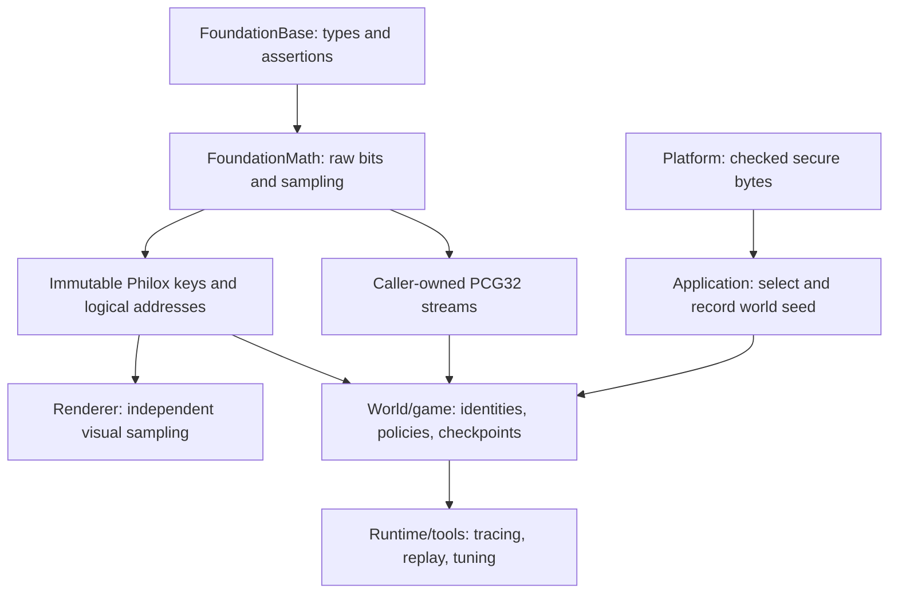

# Ludus Randomness Architecture

**Status:** Core primitives implemented; broader integration remains proposed.
FoundationMath ships `addressed_random.hpp`: checked domain-key derivation and
address construction, Philox4x32-10 raw/block/float samples, and bounded sampling
with a prepared-bound option. Existing PCG32 v1 behavior remains authoritative in
the [math specification](../../.kiro/specs/math/design.md#11-random-stream-specification).
The implementation adds reference-answer, boundary, rejection-budget, allocation,
worker-order, installed-SDK, and pinned WebAssembly corpus checks. It makes no
throughput or statistical certification claim. Sequential seed factories, wire
state codecs, probability/weighted distributions, world registries/manifests,
designer policies, security entropy, and GPU sampling remain future work.

The specification below describes the complete target architecture. Code uses
`TryMakeRandomKey`, `TryMakeRandomAddress`, `SampleUInt32`, `SampleFloat01`,
`TrySampleBlock`, `TryPrepareBound32`, and `TrySampleBounded`; illustrative API
names elsewhere in this proposal are not additional shipped entry points.

## Initial design, before the Gems review

Use two explicit ways to obtain simulation randomness: a caller-owned PCG32
stream for ordered work, and a pure Philox4x32-10 function addressed by logical
event identity for parallel or independently regenerated work. Keep sampling
functions small and versioned. World/game code owns identities, stream lifetime,
replay metadata, and designer policies. Platform owns operating-system entropy.
There is no global RNG service or initialization dependency in FoundationMath.

The baseline decisions are:

- Preserve `RandomStream`, `RandomState`, PCG32 XSH-RR seeding, bounded mapping,
  float conversion, and state version 1 exactly.
- Add addressable samples only for work whose results must survive job reordering,
  such as procedural chunks and independent gameplay events.
- Derive keys from explicit world seed and stable numeric domain IDs; use logical
  object/event IDs, never thread IDs, pointers, or iteration order.
- Separate raw bits, uniform distributions, designer policies, and security.
- Make sampling allocation-free, exception-free, and `noexcept`; use explicit
  statuses for invalid inputs and exhausted address budgets.
- Treat generator, derivation, mapping, and content versions as compatibility
  data. Randomness alone does not make floating-point gameplay deterministic.
- Establish scalar reference answers before any SIMD/GPU optimization, and
  choose optimizations by representative end-to-end measurements.

The [Gems review](randomness-gems-review.md) records the subsequent changes:
versioned procedural recipes, read-only probability models for planning,
distribution profiles with honest names, explicit presentation isolation tests,
immutable weighted tables, and in-kernel GPU generation. The final proposal follows.

## Decision and scope

The best default for Ludus is a small deterministic vocabulary with explicit
ownership. Keep the working PCG32 implementation and add one counter-based
algorithm when a consumer requires order-independent samples. Avoid a pluggable
generator framework, virtual distribution objects, thread-local generators,
background refill pools, or an engine-wide registry on the draw path.

| Need | Selected mechanism | Owner |
| --- | --- | --- |
| Existing sequential gameplay, shuffled decks | PCG32 XSH-RR v1 `RandomStream` | World subsystem or persistent component |
| Parallel events, reproducible chunks, independent entity choices | Philox4x32-10 addressed samples | Caller supplies immutable key and logical address |
| Bounded integers, probabilities, geometry samples | Named, specified sampling functions | FoundationMath; caller supplies source |
| Loot protection, shuffle bags, decision persistence | Explicit policy plus saved policy state | Game/domain code |
| Path-tracing convergence, temporal visual quality | Renderer sampler: stratification, Sobol, blue noise as needed | Renderer |
| New nondeterministic world seed, security bytes | Checked OS/browser cryptographic byte source | Platform, called outside simulation sampling |

PCG32 is a compatibility and maintenance choice, not a claim that it wins every
benchmark. Philox is selected for random access and parallel composition, not
because ten multiplication rounds necessarily beat PCG for a single scalar draw.
No Ludus throughput result is available yet.

Non-goals for the initial delivery: cryptographic PRNG implementation, universal
distribution catalog, guaranteed cross-platform deterministic physics, automatic
stream allocation, generation of globally unique IDs from random bits, and
bit-exact CPU/GPU transcendental functions.

## Layering and implementation shape



Extend `Ludus::FoundationMath`; do not create a separate FoundationRandom module
or lifecycle-managed `RandomSystem`. The existing opt-in `random.hpp` remains
small. Add `random_address.hpp` for key/address value types and non-template
Philox functions, and `random_sampling.hpp` only when the first additional
sampler ships. Implement algorithms in corresponding `.cpp` files. Private
helpers live under `src/internal/`; no third-party type leaks into installed
headers. Base never includes any of these headers.

All hot operations are allocation-free and `noexcept`. Invalid arguments return
`MathStatus` and leave outputs unchanged. Validate before advancing a stream.
Fallible multi-draw additions compute with a local stream copy, then commit the
new stream and result together on success. A failed transaction therefore leaves
the original stream unchanged. Existing unbounded v1 bounded sampling keeps its
current contract. FoundationMath calls no logger, entropy API, job system, or
diagnostic callback during a draw.

For multi-element mutation such as shuffling, validate the entire operation first;
use a subsequent path that cannot return a partial failure. A capped rejection
variant would need staging storage or an explicit partial-progress contract;
do not imply that copying the stream makes array writes transactional.

Use the project's fixed-width aliases, unsigned arithmetic, explicit narrowing,
lightweight self-sufficient headers, and normal scalar alignment. No public
`<random>`, heavy STL machinery, virtual interfaces, forced-inlining policy, or
compiler-specific 128-bit integer requirement. Tiny source adapters can remain
private helpers instead of exposing a templated public distribution framework.

## Preserve the existing sequential contract

`RandomStream` remains PCG32 XSH-RR: 64-bit state, odd 64-bit increment,
multiplier `6364136223846793005`, and output from the old state. Preserve the
two-step reference seeding, selector limit `0x7fffffffffffffff`, deterministic
default seed/selector zero, rejection-modulo bounded sampling, high-24-bit float
conversion, and state version 1. The existing six-word fixture for seed 42,
selector 54 remains unchanged. These conventions match the
[PCG reference API](https://www.pcg-random.org/using-pcg-c-basic.html).

Save each mutable stream with its logical owner. One loot subsystem can own one
loot stream; an entity may own a stream if it genuinely needs a sequential random
process. Do not add 16 bytes to every entity merely because some entities use
randomness. World structure owns placement and lifetime, not FoundationMath.

Each stream has one mutable owner at a time. Pass it by reference to ordered
code. Sharing under a lock prevents a data race but still makes the sequence
depend on lock acquisition order. Worker index, job number, thread ID, pointer,
wall-clock time, and unordered-container traversal cannot establish simulation
identity. A worker-local scratch generator is acceptable only when its sequence
is deliberately irrelevant to simulation and persistent content.

Copying a stream deliberately copies its future sequence; it does not split it.
Use copies for rollback, tests, and transactional sampling. Introduce no generic
`Fork()` that suggests independent child streams. Distinct PCG selectors and
mixed seeds are useful organizational tools; they do not prove mathematical
independence or prohibit repeated output words. PCG's period is not a license to
consume arbitrarily large simulation corpora without testing the actual use.

## Stable keys, domains, and identities

Application/world setup records a `uint64` root seed. Zero is a valid deterministic
seed. Automatically seeded sessions obtain it once from Platform and immediately
record it; simulation never refreshes it opportunistically.

Each independent meaning has a stable nonzero `uint32` domain ID in a checked-in
game/content manifest: loot selection, loot affixes, combat spread, AI decisions,
terrain, and cosmetic particles are example domains. IDs are explicitly assigned,
unique within the manifest, and never recycled. Labels are tooling metadata.
Rename a label without changing the ID. Validate duplicates when building content
or loading the manifest; draw calls do no string hashing or registry lookup.
Different games may maintain different manifests.

The proposed derivation v1 is deliberately small:

```text
W = 0x9e3779b97f4a7c15
Mix64(x):
    x = (x xor (x >> 30)) * 0xbf58476d1ce4e5b9
    x = (x xor (x >> 27)) * 0x94d049bb133111eb
    return x xor (x >> 31)

domainKey = Mix64(rootSeed + (uint64(domainId) + 1) * W)
```

Arithmetic wraps modulo 2^64. This uses the
[SplitMix64 finalizer](https://prng.di.unimi.it/splitmix64.c), not a mutable
SplitMix generator or a cryptographic KDF. For a fixed root seed, the odd
multiplier and reversible finalizer give distinct keys to distinct domain IDs;
this structural statement is not a statistical-independence guarantee. The
root/domain combination cannot be injective across all worlds in a 64-bit key,
and no global uniqueness promise is made. Cache the key with the domain owner.

For a new sequential stream, derive `seed = Mix64(domainKey + scopeId)` and use
`selector = uint64(domainId)`, then call the existing seeding function. This is
a new named setup convention; do not replace an existing game's explicit seed
scheme. Different scopes in one domain have the same increment and different
starting phases. Use the addressed path when independent parallel identity is
the requirement; do not advertise these phases as guaranteed disjoint streams.

`scopeId` is a stable `uint64` identity assigned by gameplay/content. It must
survive reconstruction: a saved entity creation ID, persistent room ID, or a
collision-checked cooked chunk index. Runtime entity handles and array positions
are unsuitable. Coordinates must be packed injectively within documented bounds
or mapped through a persistent catalog; a general coordinate hash cannot prove
unique scope identity. Preserve the ID allocator state and failed-creation
semantics across rollback so IDs are not reused accidentally.

An entity respawn gets a new creation identity unless repeating its original
random behavior is explicitly intended. Independent worlds have separate root
seed contexts. Preview tools may deliberately reuse a key/address to reproduce
an outcome, but their mutable policy state belongs to a separate preview world.

## Addressed randomness for parallel work

Add `RandomKey` containing the derived 64-bit key and `RandomAddress` containing:

| Field | Width | Meaning |
| --- | --- | --- |
| `Scope` | `uint64` | Stable entity, room, chunk, or event-owner identity |
| `Event` | `uint32` | Owner-local persisted event ordinal |
| `Dimension` | `uint16` | Stable sample meaning within that event |

For example, one attack's dimensions can be horizontal spread, vertical spread,
and damage variation. Assign dimensions explicitly within each domain/event
schema; adding a sample uses an unused dimension or a new domain. Never insert
an implicit next-dimension call that renumbers subsequent meanings. A helper
requiring several samples reserves a documented range and checks that it fits.

An event counter advances exactly once when the simulation commits a new logical
event, independent of whether a sample succeeds or a visual effect renders.
Retried evaluation uses the same event ID. An aborted tick follows the world's
transaction/abort policy; RNG code does not publish a partially completed event
as successful. Checkpoint event counters and identity allocators with world state.

Use Philox4x32-10 with the standard Random123 constants and output ordering. For
an internal rejection attempt `a` in `[0,65535]`, pack its counter and key as:

```text
counter[0] = low32(Scope)
counter[1] = high32(Scope)
counter[2] = Event
counter[3] = uint32(Dimension >> 2) | (uint32(a) << 16)
key[0]     = low32(domainKey)
key[1]     = high32(domainKey)
outputLane = Dimension & 3
```

Dimensions 0-3 share one block with different lanes; dimensions 4-7 share the
next. The two unused bits in the low half of `counter[3]` stay zero in this
schema. Different supported `(Scope,Event,Dimension,attempt)` addresses map to
different counter/lane positions. This prevents accidental address aliasing; it
does not prevent equal 32-bit output values or establish cryptographic security.

Raw `SampleUInt32(key,address)` uses attempt zero. `SampleFloat01` uses the same
raw word and the existing high-24-bit mapping. `TrySampleBlock` requires a
dimension divisible by four and returns four words for that aligned group.
There is no hidden cached block, mutable cursor, or attempt field exposed for
general callers to change. Sampling two different distributions at the same
address intentionally reuses random input; ordinary independent choices require
separate dimensions or domains.

`TrySampleBounded` starts at attempt zero and changes only the internal attempt
on rejection. It cannot perturb another event or dimension. After all 65,536
attempts fail, return `MathStatus::OutOfRange` with output unchanged; do not wrap
the attempt, reduce modulo without rejection, or substitute a default value.
This finite cap is a structural failure contract, not permission to run such a
loop in a hard-deadline callback. A test hook must exercise exhaustion.

The address permits 2^32 events per scope and 65,536 dimensions per event.
Detect exhaustion before incrementing or narrowing. Return failure to the owner;
a new scope or address-schema revision requires an explicit simulation/content
decision. In particular, never truncate a 64-bit world tick to the event field.
If a real consumer needs larger ordinals, design and version a wider layout
before it ships; do not hash the overflowing value into these fields.

Pure samples can be regenerated in any job order, chunked at different sizes,
or retried on another worker. They can be rolled back by restoring the identities
and event counters rather than saving a generator state for each sample. Other
world updates still need deterministic commit ordering. Counter-based generators
support this shape directly; see the
[Random123 reference](https://github.com/DEShawResearch/random123) and
[Salmon et al. paper](https://www.thesalmons.org/john/random123/papers/random123sc11.pdf).

The first implementation must pin an upstream reference revision, record its
license/provenance, and compare against its known answers. For an all-zero key
and raw all-zero counter the upstream Philox4x32-10 result is
`6627e8d5 e169c58d bc57ac4c 9b00dbd8`; verify the all-ones and mixed-word fixtures
as well. These raw fixtures precede Ludus key derivation.
[Upstream vectors](https://raw.githubusercontent.com/DEShawResearch/random123/main/tests/kat_vectors).

### Procedural persistence

Treat reproducible procedural data as a versioned recipe: root seed, domain/address
schema, generation algorithm/content revision, and stable location/object IDs.
Regenerate the unmodified base from that recipe, and save gameplay mutations as
explicit overrides owned by the world/content system. Changing a generation
revision cannot silently reinterpret an existing save. Either retain its recipe
implementation, migrate with verified identity preservation, or reject it clearly.

Nested properties need stable meanings as well as stable parent identity: adding
a decorative property must not renumber a planet's layout or a room's loot.
Use documented domains/dimensions and a validated child-identity scheme. Do not
derive unique children with unchecked coordinate products or overlapping arithmetic
seed combinations. The
[predictable-random-numbers chapter](randomness-gems-review.md#procedural-generation)
motivates regeneration; versioned recipes and mutation overrides are Ludus's
adaptation.

## Sampling contracts

Uniform sampling is a separate contract from generating bits. No standard-library
distribution controls replay behavior. Every named sampler specifies its input
domain, endpoints, arithmetic, number/order of raw draws, retry policy, version,
and failure semantics.

| Operation | Contract |
| --- | --- |
| Raw 32-bit word | All `uint32` values; one PCG draw or one addressed lane |
| Raw 64-bit word, when required | First 32-bit word is high half, second is low; two ordered draws/dimensions, with range validation before sampling |
| Existing `NextFloat01()` | `(raw >> 8) * 2^-24` in binary32; exactly `[0,1)` on the documented FP profile; one draw |
| Optional binary64 uniform | Use the high 53 bits of the defined 64-bit word times `2^-53`; `[0,1)`; two draws |
| Existing stream bounded integer | Existing rejection-modulo v1, bound > 0; at least one draw, variable count |
| New addressed bounded integer | Multiply-high rejection mapping below; internal attempts isolated to the address |
| Chance, when required | Integer `Probability32` threshold in `[0,2^32]`; compare one raw word `< threshold`; even thresholds 0 and 2^32 consume one sample |
| Shuffle, when required | Descending Fisher-Yates; for `i=n-1..1`, choose uniformly in `[0,i+1)`; empty/singleton inputs consume no draws |

For the new 32-bit multiply-high mapper, validate `bound > 0`, compute
`threshold = uint32(0 - bound) % bound`, and draw a 32-bit `r`. Let
`product = uint64(r) * uint64(bound)`. Reject when `low32(product) < threshold`;
otherwise return `high32(product)`. Bound one returns zero but still samples once.
A prepared bound may store bound/threshold when a consumer reuses it. Define it
through a checked factory; never accept inconsistent caller-authored fields.

This is an unbiased mapping given uniform raw draws, with acceptance probability
greater than one half. Precomputing threshold removes division from repeated
draws; the uncached setup may still divide. Repeated PRNG calls are deterministic,
so expected retry claims use a randomness model and provide no deadline bound.
The optimization is grounded in
[Lemire's algorithm](https://arxiv.org/html/1805.10941v4).
If profiling justifies offering it for PCG streams, add a separately named,
versioned `TryNextBoundedMultiply` function. It changes mapped outputs and retry
consumption; never silently optimize `TryNextBounded` into this algorithm.

Do not calculate inclusive ranges as `max-min+1` in a narrow integer. Expose
half-open intervals initially; raw generation supplies the full unsigned range.
If signed/inclusive or 64-bit bounded ranges become necessary, specify their
overflow-safe wider arithmetic and failure contract separately. Probability
authoring converts to fixed integer thresholds through a validated cooker path;
record the quantization rule. Avoid floating-point percentage comparisons for
authoritative choices when an integer representation suffices.

Fisher-Yates is unbiased conditional on unbiased bounded selections. Specify the
supported container size before narrowing its bound. A v1 stream shuffle can use
the existing unbounded-rejection sampler after validation; it is unsuitable for
hard deadlines. Addressed shuffles require an explicit per-swap dimension/event
layout and a failure-safe storage plan; defer that adapter until needed.

## Weighted selection and authored gameplay policies

Ship the smallest adequate weighted selector first: integer weights, validated
total, one unbiased ticket in `[0,total)`, and the first cumulative weight strictly
greater than the ticket. Zero weights are never selected; an empty or all-zero
table, total overflow, and invalid indices fail without consuming randomness.
Initially constrain the total to `UINT32_MAX`. Larger totals need an explicitly
designed unbiased 64-bit bounded sampler, not lossy float normalization.

Use a linear scan for small tables. For larger immutable tables, store integer
cumulative weights and binary-search them. Cook stable entry ordering and weights;
tools preserve designer item IDs when reordering. The selected runtime index is
resolved to that stable item ID before persistence. Changing weights/order changes
the content identity and may change outcomes.

Only when repeated sampling repays construction and cache cost, add a cooked
Vose alias table. Build in O(n) with stable worklist/tie ordering and immutable
runtime storage. Do not rebuild it during each draw or use a sort-per-entry
builder. A straightforward exact integer implementation stores scaled masses
`n * weight` in checked `uint64` and, per column, a cutoff in `[0,total]` plus
an alias index. Choose a uniform column and an independent uniform ticket in
`[0,total)`; select the column if `ticket < cutoff`, otherwise its alias. This
avoids floating threshold quantization. Validate `n*weight`, totals, and aliases
in the cooker; addressable selection reserves distinct column/ticket dimensions.
The alias table lookup is O(1), but unbiased variate generation still has rejection
and no universal worst-case O(1) latency. The
[alias-method chapter](randomness-gems-review.md#weighted-selection) informs this
optional path.

For a one-pass candidate stream of unknown length, reservoir sampling can save
storage; introduce it only for such a consumer. A sequential reservoir requires
stable traversal to reproduce its outcome, and its arithmetic/weight policy is
part of replay. It is not automatically order-independent because its random
source is addressable. A parallel/order-independent selection scheme needs its
own proved weighting, reduction, and tie contract.

Raw randomness never quietly implements fairness. Shuffle bags, no-repeat sound
choices, weighted-without-replacement selection, streak protection, cooldowns,
and pity counters are separate game policies. Their persistent state includes
bag order/cursor, previous item, counters, and policy/content version. Record
when each policy commits state, and how save/load, death, restart, and rollback
affect it. Any adjusted distribution must be visible in authoring/debugging.

AI selects random parameters or decisions at defined decision events, then keeps
them until its authored reevaluation/cooldown rule fires. Sampling every frame
can make agents flicker and creates frame-rate dependence. Different event
domains isolate behavior tuning from combat/loot decisions. This persistence rule
is a Ludus policy decision.

AI planning may need the outcome probabilities themselves, not just a sampled
result. Expose the immutable authored integer weights/model to the planner without
consuming simulation RNG. The planner and actual outcome sampler must use the same
content/policy revision; include current pity/cooldown state when it changes the
outcome model. Rollouts have their own domain and deterministic scenario IDs, and
cannot advance live gameplay streams or peek at their future draws. Planner tie
breaking and iteration budgets are explicit simulation policies. The
[NPC decision chapter](randomness-gems-review.md#decision-making) motivates this
separation of stochastic modeling from actual outcome generation; a general
dynamic-programming engine remains outside FoundationMath.

## Spread, nonuniform distributions, and graphics

Geometry and distribution names state the measure being sampled. Uniform disk
area uses `radius = R * sqrt(u)` and `angle = 2*pi*v`; a uniform radius clusters
probability near the center per unit area. Uniform sphere directions sample
uniform `z` in `[-1,1]` and uniform azimuth, not uniform latitude. A uniform cone
uses uniform cosine within its angle bounds. Validate finite parameters and
reserve the documented uniform dimensions. Transcendental geometry follows the
existing Math numerical contract, rather than promising cross-platform bits.

If a game needs Gaussian jitter, begin with a named normal-pair sampler using
Box-Muller, fixed two uniforms, and no hidden cached spare. With `u,v` in `[0,1)`,
use `r = sqrt(-2*log(1-u))`, then `r*cos(2*pi*v)` and `r*sin(2*pi*v)`.
Define intermediate precision, reject invalid parameters, and check finite results
before commit. Finite random-bit resolution truncates reachable tails, and libm
results are numerically qualified rather than bit-exact across platforms. An
integer approximation/LUT for authoritative cross-platform spread would be a
separate measured, versioned feature.

Two independent centered normals of equal variance are isotropic: their joint
density is proportional to `exp(-(x*x+y*y)/(2*sigma*sigma))`. It depends only on
radius. The contrary axis-bias claim in *Game Programming Gems 7* is rejected.
The chapter's absolute-normal radius plus uniform angle is a distinct radial
profile, not a 2D Gaussian. Three summed uniform samples are a bounded bell-like
approximation, not an exact normal. If useful, name that policy `Bell3` and expose
its support/variance explicitly. Truncation, clamping, disk spread, cone spread,
and normal spread are different authored choices. See the
[review correction](randomness-gems-review.md#projectile-spread) and
[PBRT distribution treatment](https://www.pbr-book.org/4ed/Sampling_Algorithms/Sampling_1D_Functions).

Renderer quality has a different objective: reducing error and organizing samples
over dimensions, pixels, and frames. A high-quality IID generator does not replace
stratified/Sobol sampling or blue-noise masks. Keep those in renderer sampling,
with explicit sample dimensions and reset/history policy; see the
[PBRT sampling interface](https://www.pbr-book.org/4ed/Sampling_and_Reconstruction/Sampling_Interface).
Cosmetic particles, audio variation, and rendering have separate domains and
owners. Changing render rate, visibility, debug draws, or audio completion timing
must never advance authoritative simulation streams.

For a future GPU consumer, generate Philox samples inside the consuming kernel
instead of uploading an entire random-number buffer. Shader code belongs to the
renderer; FoundationMath never depends on RHI or shader tooling. WGSL's ordinary
integer vocabulary cannot directly reuse C++'s `uint64` multiplication. Verify
high/low 32-bit product code with 16-bit limbs and exact carries against the
scalar reference before promising CPU/GPU integer parity. Benchmark the limb
cost and register pressure. Keep CPU parity required only for consumers that
actually need it; any alternate cosmetic hash is a separately versioned visual
algorithm, never an unnoticed replacement for Philox simulation samples.
Shader integer requirements come from the
[WGSL specification](https://www.w3.org/TR/WGSL/#integer-types).

## Replay, persistence, networking, and entropy

World replay/checkpoints store root seed, build/content identity, an RNG contract
manifest ID, and the relevant states. The manifest identifies algorithm variants,
seeding/derivation version, address layout, each sampler mapping version, and
game policy schema. Record stable domain/dimension manifests with the content.
`RandomState.Version` alone cannot establish distribution or gameplay compatibility.

Serialize PCG v1 as explicit little-endian fields: version `uint32`, state
`uint64`, increment `uint64` (20 bytes of payload), accompanied by owner identity
and enclosing format/length metadata. Do not dump the in-memory structure; its
padding/layout is not the wire format. Validate supported version, odd increment,
owner uniqueness, lengths, and manifest compatibility before atomically restoring
the world. Addressed sampling stores root/domain identity and owner event/identity
counters, with no sample cache. Gameplay policy state is serialized separately.

Seed-only replay works only when initial state, logical input sequence, sampler
versions, content, event assignment, and sequential draw order are identical.
Mid-session checkpoints need actual stream/policy states and event counters.
Include them in canonical simulation hashes in stable owner order. Existing
[game-world replay](game-world.md) is primarily same-build debugging; this
proposal does not silently upgrade it to network lockstep.

For hot reload, preserve states if the RNG contract is compatible; if code/content
changes semantics, require an explicit restart or compatible migration. Changing
a root seed mid-session is a deliberate restart/reseed command, with world-owned
policy for all streams/counters. Save files and replays reject unsupported
contracts clearly. Retain old mapper implementations only for supported historical
formats; do not emulate missing behavior by reseeding the newest algorithm.

Multiplayer authoritative decisions belong to the authority. Replicate the
required outcomes or agreed simulation state; deterministic client prediction
uses identical contracts and rollback state. A seed disclosed to clients provides
reproducibility, not outcome secrecy or anti-cheat. Decisions whose predictability
matters use a separately designed trusted-side security mechanism.

Platform's optional `TryFillSecureRandomBytes` returns an explicit failure and
leaves caller output unchanged, staging a bounded request if the backend can
partially fill it. Use maintained platform APIs, not an engine-designed entropy
mixer. Root-seed setup must return failure to the caller when entropy is
unavailable; deterministic mode explicitly supplies a seed. No silent fallback
to time, addresses, user input timing, or uninitialized memory. Security clients
request secure bytes directly and never use simulation PCG/Philox or `Mix64`.
The [entropy chapter review](randomness-gems-review.md#entropy-boundary) records
why its historical collection strategy is not adopted.

## Debugging and observation

Make a failure reproducible from its logical context. A development tool reports
root seed, domain name/ID, scope/event/dimension, algorithm/mapper contract,
relevant stream snapshot, requested distribution parameters, and content revision.
For sequential streams, report a world-owned raw-draw count when tracing is enabled;
it counts rejected draws too. A counter per domain is insufficient when there
are multiple owners.

Optional instrumentation lives in runtime/tool adapters. Use preallocated bounded
records with logical tick and owner IDs; merge records by logical identity rather
than wall-clock arrival order. A full buffer drops diagnostic records and reports
a dropped count without changing RNG results. Do not add a logger/profiler pointer,
branch, allocation, or lock to the production generator state. Raw-draw counts
are diagnostic state, not new mandatory bytes in `RandomStream`.

Compare two replays at the first divergent canonical world hash, then inspect
event assignment, draw counts, and sampler inputs. Addressed decisions can be
evaluated directly in a standalone fixture. A bounded sampler must allow tests
to supply deterministic raw words, force rejection/exhaustion, and compare
algorithms without relying on rare PRNG sequences. Keep that adapter private or
test-only. Visual histograms and spread plots explain distributions; they do not
prove correctness or cryptographic quality.

## Validation and performance gates

| Gate | Required evidence |
| --- | --- |
| Compatibility | Existing PCG fixtures unchanged; pinned upstream Philox zero/all-ones/mixed vectors; derivation/address/sampler golden corpus |
| Arithmetic and bounds | Zero/max bounds, threshold edges, forced rejection, endpoint floats, full probability range, counter/dimension overflow, signed conversion audit |
| Unbiased mapping | Exhaustive reduced-width model over every bound/raw value; forced rejection fixtures against an independent reference; no modulo-only shortcut |
| Ownership | Same inputs with reversed/shuffled entity/job order, different worker counts/chunk sizes; identical addressed outputs by logical identity |
| Isolation | Add cosmetic draws, disable rendering/audio, add a dimension, and change unrelated domain content; existing authoritative choices remain unchanged |
| Save/rollback/reload | Mid-sequence restore; policy/event/ID allocator restoration; duplicate owners and corrupt/unsupported manifests rejected without partial restore |
| Weighted/policy | Exact small integer tickets and alias mass checks; zero/overflow weights; deterministic bags and content changes; policy statistical expectations tested separately |
| Portability | Identical raw/mapping corpus on pinned native toolchain and pinned Emscripten; future ARM/GPU qualification before claiming their parity |
| Integration | Warning-clean builds, unit and ASan/UBSan tests, format/tidy, header/include/build-budget gates, installed SDK consumer |
| Quality | Offline PractRand/TestU01 and targeted interleaved-domain/nearby-scope patterns, high/low bits, lane patterns; record tool versions, corpora, failures and data volume |

Statistical tests use predetermined seeds/criteria and adequate volume in an
offline qualification job. A short noisy histogram is not a per-commit gate and
no finite battery proves independence. Re-run qualification when the algorithm,
round count, constants, packing, derivation, or tested cross-stream pattern changes.
Correctness fixtures remain fast deterministic CI tests.

Benchmark shipping optimization levels on supported hardware/toolchains. Consume
outputs so the compiler cannot eliminate the work; report generator, seeding,
bounded-variable/constant/prepared bounds, a real loot/AI workload, and batch
Philox with all four lanes used. Include adversarial rejection bounds, cold/warm
tables, construction time, code/state size, allocations, and p50/p95/p99 sampling
cost where meaningful. End-to-end frame/chunk workload savings decide whether
an optimization ships. Do not infer engine speed from a published RNG loop.

Optimize in this order: avoid unintended draws; derive keys once; use the block
API for four needed dimensions; prepare reused bounds; measure LTO/out-of-line
cost; only then add SIMD behind the same exact contract. No fast math or weakened
round count. New batched bounded-generation research is a useful later benchmark
candidate, but its different consumption and complexity do not justify changing
the compatibility path. See
[Brackett-Rozinsky and Lemire](https://arxiv.org/abs/2408.06213).

## Delivery plan and alternatives

1. **Freeze the integration contract.** Inventory current consumers and authored
   policies; pin existing PCG behavior and provenance, define stable domains and
   replay manifest, and add consumer-level isolation/checkpoint regressions. Keep
   the current API and module dependency graph.
2. **Add one addressed consumer.** Implement/reference-check scalar Philox,
   derivation and address packing, then integrate a procedural or parallel event
   consumer. Prove job-order independence and overflow/failure semantics on native
   and web before advertising portable results.
3. **Add demonstrated sampling needs.** Implement multiply-high addressed bounds,
   small integer weighted selection, and whichever probability/shuffle/profile
   the consumer requires. Add policy state/debug tools with the game owner. Do
   not ship every optional sampler in this document preemptively.
4. **Measure and specialize.** Add cooked alias, SIMD blocks, GPU code, or an
   alternate generator only after workload evidence and compatibility review.

| Alternative | Assessment |
| --- | --- |
| PCG32 only | Smallest current implementation; sufficient for ordered v1 gameplay. Lacks direct addressed parallel sampling without another construction. |
| Philox everywhere | Coherent pure-function option for a new design. Existing stream compatibility and straightforward sequential APIs justify retaining PCG in Ludus. |
| xoshiro256++ | Credible compact sequential benchmark candidate; adds a second stream/state/migration contract without a demonstrated Ludus gain. [Author reference](https://prng.di.unimi.it/). |
| MT19937/WELL | Historical strengths do not justify larger per-owner state for these game workloads. Retain neither as a default based on period alone. |
| Small GPU hash everywhere | May suit separately qualified cosmetics; does not supply the selected simulation generator/replay contract. |
| OS CSPRNG everywhere | Correct source for security and root entropy. Simulation still needs explicit deterministic ownership and stable replay sampling. |
| Global or automatic thread-local stream | Hidden coupling and schedule-dependent simulation results; excluded. |

The architecture is ready to guide implementation, but runtime additions remain
proposals. Performance, web parity, GPU parity, and statistical qualification
remain acceptance work; none is asserted as completed by this design review.
