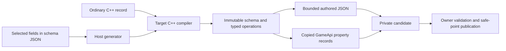

# Reflection and serialization

Ludus uses opt-in generated descriptions of ordinary C++ records, explicit
persistent identities, copied candidates, and owner-controlled publication.
Reflection supplies information to tools and codecs; simulation keeps using typed
C++. A universal object base class, runtime field allocation, global registration,
or a new editor object model is unnecessary.

## Implementation status

The first slice is implemented by `Ludus::FoundationReflection`,
`Ludus::FoundationSerialization`, and the optional `Ludus::GamePropertyBinding`.
It supports plain scalar records with bool, int32/uint32, int64/uint64, and finite
float32/float64. Native candidates are at most 4 KiB; schemas and edit batches
contain at most 64 fields. The live-edit game demonstrates generated descriptions,
copied snapshots, validated prepared edits, revision conflicts, and the existing
Editor property inspector. The SDK consumer demonstrates generated JSON codecs
from an installed package. Native and browser targets compile the same bindings.

This is a foundation for the larger architecture below. Strings, containers,
reference graphs, registered plugins, migrations, undo history, tagged binary
saves, and cooked resource layouts require their own owner-backed vertical slices.
The sample's checkpoint and authored tuning formats retain their existing codecs;
the new scalar JSON envelope does not silently replace either format.

## Ownership and dependency boundaries



`FoundationReflection` exposes schema/value views and bounded scalar validation.
It depends on Base and privately uses Math for finite checks and Parsing for UTF-8 metadata checks. Its implementation
allocates nothing. `FoundationSerialization` owns the scalar authored envelope,
uses Reflection, Memory, and the existing FoundationParsingJson privately, and
never performs I/O. `GamePropertyBinding` projects Reflection into the existing
GameApi records. Foundation knows nothing about Qt, Platform, RHI, Content,
GameplayWorld, or game module ownership.

Generated descriptions contain immutable names, IDs, scalar defaults, inclusive
bounds, and persistence/editability flags. No native addresses, member offsets,
function pointers, or schema table pointers cross the gameplay ABI. The module
copies existing `PropertyDescriptor`/`PropertyValue` records; the Editor already
consumes those records. The optional binding accepts only the bool/int32/float32
kinds representable by the current inspector ABI and reports `UnsupportedKind`
for wider types. It never narrows them to fit a widget.

Each owner explicitly calls a generated schema getter. Tables are borrowed and
must remain loaded for each call. Generated member pointers remain private to the
compiled source. There is no global registry or static initialization order. A
future dynamic registry must hold module-generation leases for all callbacks,
read plans, and prepared edits; those must retire before unload. A schema lease
cannot extend an entity's lifetime. Until then, owners cannot retain borrowed
schema views across module unload or reload.

## Authoring and generation

A native header owns the actual struct and its initialization. An adjacent
`.schema.json` selects members and gives each a persistent field ID, source key,
display label, scalar type, wire default, bounds, and persistence/editability
flags. Native member spelling, authored key, and UI label are separate concepts.
A runtime-only field can be read-only and omitted from persistence.

```cmake
find_package(Ludus CONFIG REQUIRED)
ludus_generate_reflection(TARGET game_settings
    SCHEMA settings.schema.json BASELINE settings.schema.baseline.json)
target_link_libraries(my_game PRIVATE game_settings Ludus::GamePropertyBinding)
```

The host-side Python generator uses the standard library and a closed manifest.
It does not parse C++, inspect target layouts, execute snippets, or derive IDs
from names. It emits an ordinary public header, a source for schema/read/edit
operations, a separate source for JSON operations, and a normalized manifest.
The target compiler checks exact native member types and member accessibility.
Taking typed member pointers also rejects bitfields. Unions, nontrivial records,
and records exceeding the candidate budget fail compilation.

Outputs live in the build directory, use atomic replacement per file, and retain
unchanged files' timestamps. CMake tracks the schema, native header, baseline,
and generator. A completion stamp is updated only after all outputs succeed;
there is no multi-file atomic publication claim. Ordinary compiler dependency
tracking handles transitively included headers. Missing generated byproducts
trigger regeneration. The SDK ships both the CMake helper and Python generator,
so a relocated consumer uses no engine source.

Generated headers expose typed `ReadT`, `PrepareT`, `ReadTJson`, `WriteTJson`, and
`TSchema` functions. Validation remains active in shipping. Prepare copies the
source record, validates the whole scalar batch, assigns members in the private
candidate, and publishes the output only on success. Source/output aliasing is
supported. Unselected native members follow the source copy. JSON decoding instead
preserves unselected and nonpersistent members already in the destination.
Native default initializers and declared wire defaults need not coincide: a
missing serialized field uses the schema version's wire default. Test that
relationship explicitly when an owner expects them to match.

This v1 deliberately has no extensible adapter language. Owners with resource
handles, third-party types, invariants spanning fields, or private members should
write a small typed projection record, validate the candidate through their own
API, and commit at their safe point. Never call a resource setter while decoding
individual fields. Public headers stay small; no tuple/container metaprogramming,
AST parser, or heavy standard-library header enters the installed interface.

## Identity and evolution

`SchemaId` is an explicitly authored nonnil UUID in canonical byte order.
`Version` is a nonzero uint32. Field IDs are nonzero uint32 values scoped to the
schema; retired IDs are reserved forever. Native names, addresses, hash values,
registration order, and gameplay entity slots are not persistent identity.
The existing GameApi's uint64 property IDs can represent the selected field IDs
without changing the ABI. The sample retains property IDs `0xB001`/`0xB002`.

The sample supplies an immutable checked-in baseline. Generation verifies its
schema identity/version, persistent field order, IDs, keys, kinds, wire defaults,
and bounds. A changed persistent contract fails generation. Display labels may
change without changing the wire contract. Removed nonpersistent field IDs must
be reserved; prior reserved IDs cannot be reclaimed. This first checker admits
one wire version and rejects a version change instead of inventing a migration.
Baseline checking is optional for unreleased/test schemas; released schemas must
use it. Reviewing a baseline change is a release-contract decision, not a way to
silence a conformance failure.

Before a second durable version ships, add immutable schema history, explicit
bounded migrations between supported versions, and fixtures for every released
version. Historical defaults belong to historical schemas. Constructing today's
native default object does not supply yesterday's missing-field meaning. An
input file's embedded metadata is never authority to redefine a trusted schema
or load code. Removed/unknown fields require a named compatibility policy;
round-tripping them losslessly requires owned bounded storage. It is deferred.

## Scalar authored JSON

```json
{"schema":"f2e2dbbb-709c-48ad-b87b-61d0d86ea35d","version":1,"values":{"speed":1.0}}
```

The root has exactly `schema`, `version`, and `values`. The schema UUID and version
must match exactly. Unknown keys, nonpersistent fields, duplicate keys (including
escaped spellings), invalid UTF-8, malformed/trailing input, wrong scalar types,
overflow, and nonfinite values fail. Missing persistent fields use that exact
version's declared defaults. A bool must be a bool; an integer must be an exact
integer node. Signed and unsigned 64-bit integers never pass through float64.
Tools using JavaScript must use exact integer parsing or an explicitly declared
string projection; silently converting a JSON integer through Number is invalid.

Admission limits are 64 KiB input, 1 MiB parser workspace, depth 2, 64 object
members, 68 values, no arrays, and 64 decoded bytes per string/key. The existing
strict parser owns a fallible allocation pool. Decode first gathers bounded
owned scalar snapshots, then publishes them after full validation. Parser
locations are byte offsets; an unknown offset is never rendered as a location.
Diagnostics identify field IDs when a known field fails. No borrowed JSON nodes
or strings escape the call. Allocation failure is a status, with destination
unchanged.

The writer emits every persistent field in declaration order, explicit defaults,
exact integer decimal digits, finite numbers, UTF-8 keys, and one final newline.
It accepts caller-owned bounded storage and publishes the returned byte view only
on success. On failure the storage can contain a partial prefix; callers must not
save that prefix. It does not promise stable float spelling across an arbitrary
codec/toolchain replacement. Golden and cross-version fixtures are required for
such changes. Negative zero follows the existing pinned JSON writer.

## Editor transaction

The sample owner accepts copied `PropertyEdit` batches. It checks exact framing,
schema version, object identity, expected revision, kind, bounds, editability,
NaN/Inf, and duplicate IDs. Unaligned byte input is copied into aligned records.
Generated preparation builds a private native candidate. The plan captures the
owner, expected revision, and editable value. Commit checks owner and revision
again, changes only the editable member, increments the revision, and consumes
the plan. Failed plans remain owned until discard. This avoids overwriting
simulation fields with an earlier whole-object snapshot.

The host's frame-boundary transaction remains authoritative. A future inspector
binding for many objects must use stable object handles and revisions, never
retain component pointers, and stage the entire multi-object batch before any
publication. Stable element keys are required when editing containers. Undo/redo
should own canonical before/after values and route through the same prepare/commit
path. Labels and degree display conversions must not create a second persistent
version of a canonical radian property. Owner-thread access or an explicit
snapshot is preferable to per-field locks.

## Next production slices

1. Add a real string/container consumer with owned fallible candidates, semantic
   owner validation, diagnostic paths, and a measured memory budget.
2. Add schema history and migrations around a real durable-save consumer. Specify
   and fixture-test exact binary framing, fixed scalar widths, byte order, kind
   tags, limits, and approved retired-field handling before declaring a format.
3. Add graph persistence with document-local record IDs, declared ownership, and
   two-pass creation/linking. Persist authored/resource IDs in their own domains,
   remap saved entities to newly constructed entities, reject ownership cycles
   and arbitrary interior pointers, and publish the world transactionally.
4. Add cooked subsystem formats for bulk loading only after profiling proves
   the need. Authored JSON, durable saves, network snapshots, and cooked resource
   layouts share schema meaning but need different codec and evolution policies.

For graph loads, parse and migrate into private storage; discover all record
identities; allocate candidates; type-check and fix references; validate semantic
invariants; stage resources; publish at a safe point; retire the old world. Any
failure leaves the active world usable. Resource acquisition and external I/O
are owner responsibilities, never field callbacks during decoding.

## Performance and verification

No frame-loop reflection is required. Metadata and generated accesses are
immutable and contain no per-instance field objects. Reads/edits use bounded
stack arrays; the JSON parser uses its fallible allocation domain. The initial
lookup and schema duplicate checks are bounded linear/quadratic scans of at most
64 fields. This favors inspectable code over a premature registry/cache. A
validated-once owner handle and direct codecs are later measured optimizations.

Measure handwritten and generated paths under identical validation/evolution
semantics, native and Wasm: allocations, peak workspace, output sizes, linked
metadata/code bytes, p50/p95/p99 throughput/latency, clean build time, header parse
time, and incremental schema regeneration. Do not infer performance superiority
from the historical chapters or compiler inlining. Add a cache only with measured
benefit and explicit generation/lifetime keys.

Tests cover exact integer extremes, canonical round trips, defaults, preserved
unselected state, malformed/truncated input, parser limits/OOM, wrong schema,
invalid widths/bounds/kinds, nonfinite values, duplicates, readonly edits,
unaligned ABI buffers, discarded/stale/foreign-owner plans, compiler type mismatch,
generator output preservation and baseline conformance. The SDK consumer runs
the installed generator and codecs; browser smoke exercises generated integer
persistence and the same inspector projection. Standard repository build,
format/tidy, header, sanitizer, SDK, and CI gates remain mandatory.

Source review and attribution: [Game Development Gems review](reflection-serialization-gems-review.md).
