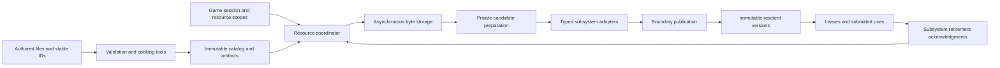
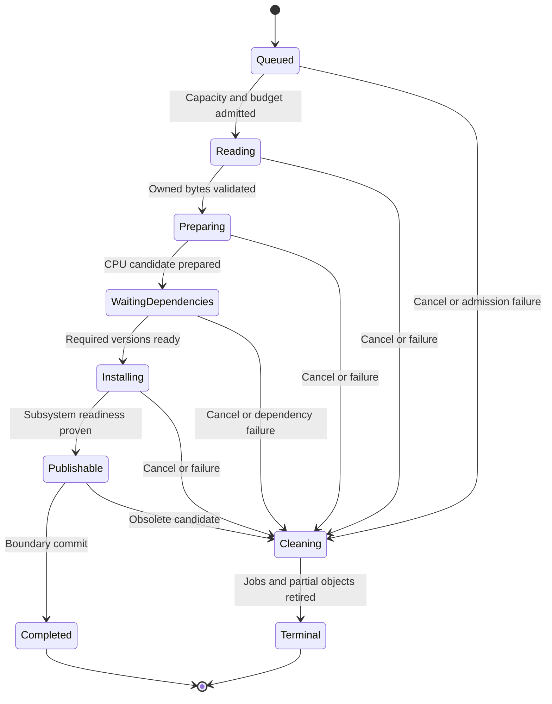

# Resource manager architecture

Status: Proposed architecture for Ludus. The existing Content catalog and native
AudioContent loader are implemented; the shared resource coordinator, cooked
catalog, and general streaming policies below are proposals. Reviewed against
repository HEAD `144a708` on 2026-10-04, with unrelated local changes present.
No runtime implementation or performance measurements are part of this design.

Use **one explicit coordinator for resource metadata and loading, immutable
resident versions, typed handles for identity, and explicit leases for lifetime**.
Keep audio, graphics, and other resource preparation and physical retirement in
their owning subsystems. Compile expensive content work in tools, acquire bytes
asynchronously, and publish complete candidates at controlled boundaries.

This is a design recommendation for Ludus, not a claim of universal optimality.
It favors a small inspectable implementation while retaining the contracts needed
for large games. The [reference review](resource-management-reference-review.md)
records the later article review and resulting refinements.

## Scope and existing contracts

The manager owns the lifecycle of reusable content such as meshes, textures,
materials, animations, sound definitions, and level descriptions. Mutable worlds,
voices, playback decoders, render targets, and gameplay instances keep their own
owners. Resource identity does not mean every engine allocation becomes an asset.

Preserve [Content version 1](content-resources.md), the
[handle and UUID design](object-handles-uuid.md),
[memory contracts](memory-management.md), and
[module lifecycle](module-lifecycle.md). Follow [AGENTS.md](../../AGENTS.md) and
[ADR 0003](../decisions/0003-standard-library-usage-policy.md): explicit failure,
exception-free operations, Ludus primitive types, bounded storage, narrow public
headers, and no reverse dependency into FoundationBase.

The first implementation must continue to load existing audio catalogs and retain
AudioSystem's serialized control owner and acknowledged retirement. It must not
require UUID migration, a universal VFS, reflection, an editor, a database, or a
general job system to load a sound.

The first useful runtime consists of five private tables, a request/result queue,
a small dependency walker, one budget ledger, and an audio adapter. Add only the
records and stages needed by its actual consumers. Cookers, chunk streaming,
alternate eviction scores, mounts, and spatial prefetch are later extensions.
Every extension must preserve four invariants: lookup does not load, a live lease
pins one exact version, publication exposes complete bindings, and freeing requires
proof that all users have finished.

| Inspected implementation | Consequence |
| --- | --- |
| [Content API](../../modules/content/include/ludus/content/content.h) | Version 1 has bounded string IDs, three audio kinds, owned bytes, SHA-256 digests, transactional catalog reads, and descriptor-bound native file readers. Preserve its formats and error behavior. |
| [AudioContent API](../../modules/audio/content/include/ludus/audio/content/loader.h) and [loader](../../modules/audio/content/src/loader.cpp) | One control owner, one pending acquisition, 64 revision slots, prepared clip sharing, and separate music playback instances. Cancel joins its native worker; Poll also eventually joins. A nonblocking concurrent acquisition service is future work. |
| [RHI resource API](../../modules/graphics/rhi/include/ludus/graphics/rhi/render.h) | The public slice exposes bounded shader, uniform, and pipeline resources. Mesh/texture residency and general GPU completion tickets must be implemented before those adapters can make their promised guarantees. |
| [Level loading](level-data.md) and [frame updates](frame-update.md) | Keep candidate-world activation and explicit frame/tick boundaries. The manager supplies resource readiness; the session commits game state. |

The native [audio content evidence](../development/audio-content-evidence.md)
describes the implemented subset and its limitations. Browser acquisition and
general graphics streaming below are contracts for future implementation, not
claims of browser or texture-streaming acceptance.

## Architecture and ownership



| Owner | Responsibility |
| --- | --- |
| Content tools | Import, validate, declare dependencies, cook, and create immutable release artifacts |
| Catalog snapshot | Exact identity, type, variant, dependency graph, artifact location, and optional source/debug metadata |
| Byte store | Read bounded ranges into owned storage; report completion and cancellation |
| Resource coordinator | Deduplicate loads, schedule stages, account budgets, manage requests and leases, publish revisions |
| Type adapter | Validate its payload, prepare its subsystem objects, state readiness, and retire them on the correct owner |
| Resource scope | Own a named set of requests and leases for one level, session, preview, or tool operation |
| Game and presentation code | Choose required content, optional fallbacks, quality targets, and activation boundaries |

Register a small static set of function-table descriptors explicitly at the
application composition root. Avoid static registration constructors, service
locators, a resource subclass hierarchy, and automatic global initialization.
An adapter contains context and stage functions; the coordinator never casts
audio objects into graphics objects or calls device APIs on worker threads.

Keep the dependency structure concrete:

| Proposed boundary | Dependencies and public surface |
| --- | --- |
| Existing `Ludus::Content`, `modules/content/` | FoundationBase and private parser/file/hash implementation. Owns catalogs and bytes; knows nothing about Audio, RHI, World, or Qt. |
| New `Ludus::Resources`, `modules/runtime/resources/` | Content and the required Foundation facilities. Owns generic coordination through private tables and explicit function descriptors. |
| Existing `Ludus::AudioContent` | Retains its current Content/Audio dependencies and compatibility API. Do not make Audio depend on the coordinator. |
| Composition adapters, initially private to the consuming app | Depend on Resources plus AudioContent or RHI. Move to `modules/runtime/resource_adapters/` only when multiple consumers need them. |
| Cooker and inspection tools | Depend on source decoders and artifact schemas. Runtime does not link authoring tool libraries. Qt remains private to the editor. |

The application owns the coordinator, stores, adapters, and subsystems explicitly.
Any provider needed for preparation or destruction outlives its consumers. A
standalone tool can use Content without constructing the runtime coordinator.

Put registry tables, queues, hashing, threading, filesystem facilities, and
profiling formatting behind `.cpp`/private-header boundaries. Public headers
contain small values, spans, views, and thin typed wrappers erasing to non-template
operations. Share handle mechanics with the proposed identity work when available;
do not require a new identity module before using an existing compatible value.

## Identity and lifetime

Keep five distinct values:

1. Durable asset key: existing logical ResourceId in version 1; proposed typed
   AssetId UUID in a versioned future format. Paths and content digests are separate.
2. AssetHandle: typed owner/slot/generation identity for a logical record. It
   stays valid when its payload is evicted or replaced.
3. RequestHandle: one caller's acquisition attempt. Several requests can share
   one underlying load without sharing cancellation or ownership.
4. ResidentVersion: one immutable prepared payload and its exact dependency
   versions. Existing leases continue to refer to it after replacement.
5. ResourceLease: one owned hold of a specific resident version. A handle alone
   does not pin memory, grant access, or imply readiness.

Use the proposed 16-byte owner/slot/generation representation for new public
runtime handles. Validate type, owner, slot bounds, generation, and live state in
release builds, including handles arriving through erased APIs or tools. Never wrap
owner, request, version, or generation counters. Keep existing audio/RHI ABIs until a
separate migration. Cache hashes accelerate lookup; exact keys establish identity.

Resolve durable IDs on the cold path. Borrow typed payload views once within a
protected phase or lease interval. Never provide implicit pointer dereference
that loads content or silently changes the borrowed version during reload.

An asset record contains stable identity, declared type, source metadata, and
current bindings for resolved variants. Removing a record invalidates its logical
handle; evicting a payload does not. Keep removed metadata as a tombstone while
old versions drain. Slots exposed to clients or jobs consume a generation even
when their acquisition fails. Reinitializing a manager obtains a fresh owner token.

The registry keeps separate preallocated pools for logical records, requests,
operations, leases, and resident versions. Hot identity metadata is compact;
payloads, long names, graph diagnostics, and editor annotations live separately.
An exact-ID index is for cold resolution. Fixed capacity and a free list are the
first implementation; grow through stable pages only when catalog scale requires
it. Never move leased payload storage during table growth or cache compaction.

Keep these cache identities separate:

| Cache | Key and validity |
| --- | --- |
| Derived artifact | Source digests, declared build-input digests, canonical settings, importer executable/version, output schema, and target profile |
| Byte chunk | Immutable artifact digest, exact byte range, and codec; an open source revision remains owned until the read finishes |
| Prepared version | Exact logical ID/type, artifact revision, resolved variant, required dependency bindings, preparation profile, and subsystem epoch |

The initial prepared-operation key also includes catalog snapshot identity. This
conservative rule avoids sharing incompatible graphs across snapshots. Deduplicate
across snapshots only after exact dependency/profile equality can be proved.
An ordinary lookup hash never substitutes for full key comparison. Different
logical assets may share immutable byte storage later, but never acquire each
other's mutable state or source provenance by accidental digest equality.

## Public acquisition contract

Expose a small explicit API. The following names specify behavior, not a compiled
header or a change to the existing AudioContent ABI. All operations return bounded
statuses and are `noexcept`. Failed admission acquires no ownership.

Acquisition output parameters must be empty on entry. A nonempty owning output
returns InvalidState and remains intact; an API never overwrites a live lease.
A scope pins the selected catalog snapshot and resolved profile for its requests.
Following a replacement snapshot requires an explicit refresh/transaction, while
existing leases keep their original binding graph.

| Operation | Contract |
| --- | --- |
| `Resolve` | Convert a typed durable reference into an AssetHandle against an owned catalog snapshot. No I/O, preparation, or implicit acquisition. |
| `BeginAcquire` | Add one caller's demand, options, and provenance; return a RequestHandle even for a cache hit. Reserve capacity before accepting ownership. |
| `GetRequest` | Observe Queued, Working, Ready, Failed, or Cancelled, with stage and diagnostic. Always nonblocking. |
| `TakeLease` | On Ready, transfer the request's held version into one typed ResourceLease and consume the request exactly once. Pending transfers nothing. |
| `Cancel` | Drop this caller's demand and unclaimed ready ownership; retain a Cancelled outcome until consumed. Other callers are unaffected. |
| `EndRequest` | Discard the caller's result and invalidate its request handle; cancel first if necessary. Owned operation cleanup continues independently. |
| `Borrow` | Validate a live lease and return a const typed view of that exact version, with its actual coverage. Never acquire or reload. |
| `Release` | Consume one live lease token; mark the version eligible for policy-driven caching or retirement. Never wait for a device. |
| `CloseScope` | Close admission, cancel requests, and release scope-owned leases after their reader phase. Remain Pending while externally owned leases or registered uses still need to finish. |
| `Service` | Apply a bounded completion batch, advance ready stages, publish permitted candidates, and progress retirement on the control owner. |
| `Inspect` | Copy a bounded immutable diagnostic snapshot; no allocation or object mutation on a reader thread. |

A resource scope names the purpose of its accepted requests and registered leases,
such as `level/forest`, `editor/preview`, or `session/ui`. It owns requests and can
store lease wrappers in a bounded collection. A lease claimed into caller-owned
storage remains registered to that scope. Closing cancels requests and releases
the wrappers the scope owns after its borrowers finish; it never revokes an
externally owned lease. Those leases and registered uses are named close blockers
until released or explicitly transferred to another live scope. Close is polled
without blocking, and scope storage remains alive until close completes.

A Ready request pins its result until claimed, cancelled, or its scope closes;
abandoned requests cannot live outside a tracked scope. The manager keeps the
terminal outcome until TakeLease or EndRequest consumes its request. CloseScope
ends all scope-owned requests, including failed/cancelled results. Operations can
finish before a polling call, but never invoke inline client code.

Use a move-only lease wrapper over an owner/slot/generation lease token. Explicit
release clears the wrapper. Its destructor on the control owner only releases the
hold; it never joins work, starts file I/O, or blocks. Raw token copies do not
create holds; a stale or repeated release returns InvalidHandle. Async consumers
receive separately registered use tickets, rather than moving this wrapper to
arbitrary worker destructors. Scopes and leases cannot outlive their manager.

For example, level activation resolves roots, begins scoped requests, polls while
continuing the frame loop, claims all required leases, validates the candidate
world, and commits both the world and its scope at a frame boundary. An unsuccessful
candidate closes its scope while the active level retains its leases. Mutable
spawned instances borrow their definitions without becoming resource records.

Optional presentation code may select an explicit fallback binding. Provide
immutable type-correct fallback assets and report the requested asset's failure.
Do not pretend that fallback texture dimensions, skeleton layout, or sample length
match the requested data. Required gameplay/collision/schema inputs fail admission.

## Loading and concurrency

One control owner mutates the registry, state machines, budgets, and publication
table. Workers perform byte acquisition, decompression, validation, and CPU
preparation using owned inputs. Their completion messages return to that owner.
Graphics and audio adapters marshal installation and retirement to their own
owners. Begin with polling and bounded queues; add worker-pool sophistication
only when real consumers require it.

The existing AudioContent loader cannot directly satisfy this nonblocking
contract: its Cancel and completed Poll paths call `pthread_join`, and its native
Begin rejects browser execution. Integration must either add a separately tested
request-cancel/poll-drain boundary or keep the entire AudioSystem/Loader control
owner on a dedicated control worker and marshal bounded messages to it. Merely
calling Loader from an arbitrary worker violates its existing owner rule. Keep
legacy lease tokens inside that adapter; the new facade supplies its own owner
identity and does not infer cross-loader safety from slot/generation alone.

Each adapter explicitly reports its memory estimate and supplies CPU prepare,
begin/poll install, cancel, begin/poll retire, and CPU cleanup functions as needed.
Ready or Failed install attempts may still own objects and remain retireable.
Poll functions perform bounded work or observe durable state; returning Failed
does not mean all acquired ownership disappeared. The coordinator invokes cleanup
on its declared owner and never destroys a type-erased context while its functions
can still execute.

Concurrent producers submit copied commands through bounded admission queues;
they do not mutate registry records. CPU jobs receive immutable catalog/byte owners
and preallocated result slots. Publication uses the queue's release/acquire
synchronization and a reader boundary; an atomic current pointer alone does not
protect its pointee from reclamation. The first implementation permits borrowing
on the control owner, with explicitly pinned immutable inputs handed to workers.
It does not require hazard pointers or a global reader epoch scheme.

Reserve result storage and a durable completion location before job/device
dispatch. A full queue refuses new normal work with QueueFull; it cannot discard
an accepted completion or retirement acknowledgment. Cancellation/release/stop
use reserved control capacity or preallocated per-operation flags, so normal
load pressure cannot prevent cleanup. If an event queue is only a wakeup hint,
its lost wakeup is recoverable by scanning durable result records in bounded
batches. Adapter callbacks execute outside manager locks and cannot reenter it.

Deduplicate by logical key, content revision, resolved variant, import profile,
and subsystem session. Keep one operation with separate caller waiters. Cancelling
one request releases only that waiter's demand. Cancelling the final demand marks
unneeded work for cancellation; it does not free buffers or device objects still
used by workers, GPU commands, or audio callbacks.

Every completion carries manager lifetime, operation generation, catalog snapshot,
target revision, and relevant subsystem epoch. Reject obsolete publication while
retaining ownership long enough to clean up the completed work. Never block a
browser event loop, rendering thread, or audio callback waiting for a resource.

An obsolete completion still owns its candidate buffers and any partially created
subsystem objects. Transfer it to cleanup, acknowledge retirement, then release
its budget. A new request cannot reuse that storage before this protocol finishes.
Retry creates a new operation generation. Cache deterministic validation/type
failures only for their exact immutable inputs and preparation profile, until
explicit retry or input/profile change. QueueFull, BudgetExceeded, cancellation,
and device loss do not permanently poison an asset's cache entry. Transient I/O
failure remains visible on its request; a later acquisition may retry under a
bounded policy with backoff, attempt limits, and one shared operation. Automatic
network retry, when introduced, needs the same bounded backend policy.

Separate operation state from resident state. A current version can remain usable
throughout a replacement's failed or cancelled operation.



Required reads and CPU preparation can run in parallel before dependencies finish;
only stages that actually need those dependencies wait. Deferred admission is
inspectable and bounded. It must not allocate an unaccounted half-built closure.

Readiness has a named contract: validated CPU data, installed subsystem object,
and usable required coverage. A graphics adapter may use a recorded GPU ordering
dependency if the RHI proves it; the first adapter waits for its defined ready
status outside drawing. A music resource means its source/definition is usable;
each playback separately needs its own prepared stream, decoder, ring and prefill.
Ready never means a mutable playback cursor or voice is globally shared.

## Dependencies and publication

Declare required resident dependencies, optional/soft references, and build-only
inputs separately. The required resident graph is acyclic. Validate cycles and
missing references in tools and when mounting a catalog. Load dependencies before
finalizing a parent; its version records exact dependency versions and retains
their ownership until the parent has physically retired.

Prepare replacements privately. A candidate has no externally visible current
binding until validation, dependencies, subsystem readiness, and budget admission
all succeed. Publish at a coordinator boundary; a level or dependent set can
commit through one activation transaction. Failure preserves the last good set.
Old readers and submitted work keep the old version until acknowledgment.

Treat dependency roles as data, rather than one overloaded reference flag:

| Role | Loading and lifetime policy |
| --- | --- |
| Required resident edge | Must reach the requested compatible readiness before parent publication; parent version owns the exact dependency version. |
| Soft runtime reference | Names possible future content without a residency hold. Resolve/acquire explicitly when needed; cycles are allowed. |
| Build input | Invalidates cooking when it changes; need not be shipped or loaded at runtime. |
| Package inclusion | Required in the selected shipping product even when lazily loaded. A soft runtime reference can still be a mandatory package input. |

Store compact adjacency ranges, reverse edges, topological rank, and source
property paths in the validated snapshot. Deduplicate repeated edges. Use checked
pending-dependency counts to make parents runnable; a failed dependency propagates
failure with its chain, rather than disappearing and being considered fulfilled.
Build/package traversal tracks visited nodes, so legal soft-reference cycles do
not loop forever. Never wait on a dependency by occupying a worker thread.

Retain dependencies once per parent resident version, not once per client or
recursive traversal. A diamond graph can share one loaded leaf with distinct
parent holds. Release those holds only after the parent's physical retirement.
Idle parents consequently pin their closure: trimming must consider leaf memory
held by idle parents rather than claiming every zero-client leaf is reclaimable.

A catalog snapshot fixes type, variant and target revision of its dependency
bindings. Device recreation invalidates prepared objects for that device epoch;
CPU artifacts may remain cached. New acquisitions target a supported replacement
epoch. An old device lease reports DeviceLost and retains its cleanup ownership;
it does not automatically turn into a new device object.

### Replacement transactions

File changes trigger a tools-side revision check, import, dependency validation,
and candidate cook. Timestamp events are hints; source digests and saved-document
conflict checks establish the input. Debounce/coalesce changes and retain a
per-asset desired revision so an older successful cook cannot replace a newer one.

Rebuild dependents whose compiled data or prepared bindings change. A material
bound to texture version 4 remains on that version until its replacement binds
the new texture. This intentional policy avoids an old parent silently changing
layout while a reader uses it. For live presentation replacement, stage the affected
reverse dependency set and publish the relevant root bindings as one transaction.
Allow independent compatible assets to publish separately only under explicit
application policy; simulation definitions follow world activation rules.

Preflight publication slots, lease/use records, dependency holds, and budget. Once
preflight succeeds, the owner changes the complete binding set between reader
phases with no allocation, user callback, device call, or fallible step. If immutable
binding snapshots are used, readers retain the old snapshot until their phase/use
ends. Single-file atomic replacement alone is not a multi-asset transaction.

Keep the last good current bindings on any candidate failure. A transaction needing
more peak memory than available returns BudgetExceeded; the application can offer
an explicit unload/loading-screen transition instead. New triggers use the new
audio revision while old voices finish the old one. Preview overrides live in a
private scope/snapshot and never overwrite saved content or leak into shipping.

### Physical retirement

The reclaim condition for a version is zero client/request/parent/reader holds,
no outstanding worker access, no submitted-use ticket, and a completed subsystem
retirement acknowledgment. Caching can delay entering retirement; once retirement
is irreversible, reacquisition starts a new operation rather than resurrecting it.

Before submission, collect distinct versions into a preallocated use batch and
retain them. On successful submission the owning adapter records completion
tickets including device/session epoch and queue serial. Transfer those use holds
to backend retirement tracking; release the original frame/voice setup lease when
appropriate. A definite failed submission drops unsubmitted holds. An uncertain
submission retains them until the backend proves quiescence. Track every relevant
GPU queue and audio terminal acknowledgment; a fixed delay of several frames
does not prove completion.

CPU input, upload staging, payload, and dependency holds can have different safe
release points. The adapter reports each point; the coordinator never guesses
from elapsed time or from a refcount alone.

## Budgets and eviction

Track metadata, encoded input, decoded CPU payloads, decoder scratch, upload
staging, and device memory separately, with active/candidate/idle/retiring states
within each domain. Retiring is a state, not a second charge for the same bytes.
Reserve peak cost before dispatching work. Deduplicated work is charged once.
Replacement requires room for old and new versions and outstanding work together.

Hard limits govern allocations the engine and adapters can account for. An adapter
must provide bounded decoder/backend costs or reserve a conservative proven upper
bound before admission; an unbounded adapter cannot promise a strict-budget profile.
Allocator headers, alignment, backing pages, and fixed control storage are included.
Track process/device measurements separately: a registry counter cannot impose a
hard limit on opaque driver allocations or all OS memory.

Use a simple bounded idle cache first. Evict only versions with no client lease,
parent hold, request hold, borrowed reader, or submitted use. Releasing the last
lease makes a version eligible; it does not force immediate unload. Cache retention
and prefetch are optional policy, while exact lifetime accounting is mandatory.

Budget pressure first cancels speculative work, then trims idle residents, then
reduces optional quality or refuses admission with a structured status. It never
invalidates a lease or reports future reclamation as already freed memory.

For each memory domain enforce:

```text
committed live bytes + reserved additional peak bytes <= domain hard limit
```

Committed bytes include active, idle, candidate, and retiring allocations. A
reservation converts to committed allocation as work progresses; do not count
the same bytes in both terms. Reserve extra scratch/staging still to come, and
release a charge only when its physical allocation is actually freed. Shared
allocation records prevent double charging dependencies; domains describe distinct
allocations even on unified-memory hardware. Also cap concurrent requests, jobs,
edges, descriptors, decoder instances, file handles, and queue records.

As an illustrative accounting check, a 512 MiB domain with 300 MiB active data,
60 MiB retiring data, and a 100 MiB replacement requiring 40 MiB extra scratch
already accounts for 500 MiB. Another 20 MiB load must wait or fail. A retiring
allocation cannot finance a reservation until its acknowledgment arrives. These
numbers illustrate the invariant; they are not proposed platform defaults.

Process domain reservations atomically on the coordinator. Reserve the required
closure for a root transaction using shared operation records before dispatch;
reuse existing admitted work. Do not hold scarce upload/scratch capacity while
waiting for a dependency needing that same capacity. If full-closure reservation
does not fit, queue with no partial reservations or fail; implement staged
admission only with a documented progress guarantee. Oversized indivisible assets
fail explicitly. Fallible allocation still checks every request; limits do not
prove that an OS allocation will succeed.

Use domain soft targets with hysteresis below hard limits. Start with LRU over
eligible idle versions, a minimum retention interval that hard pressure may
override, and bounded trim work per service call. Optional prefetch occupies a
small probationary quota, so a traversal of never-used assets cannot evict the
entire proven working set. Incoming level holds are established before dropping
outgoing holds for shared versions, preserving level-to-level reuse.

The [cache replacement article](resource-management-reference-review.md#cache-replacement)
adds a measured alternative: rank eligible victims using recent actual use,
reload time, reclaimable bytes in the pressured domain, and predicted need. Pure
recency and pure cost can both thrash. Keep the default simple until replay traces
show improvement. Count rendering/audio/CPU uses in batched records; do not mutate
an LRU list or atomic reference counter for every draw or sample. Do not scan all
logical catalog records every frame. Account for a selected parent's closure and
shared leaves when estimating reclaimed bytes.

Allocation belongs to existing/future FoundationMemory domains. There is no
second resource-specific heap, global free hook, or payload-moving defragmenter.
Specialized pools and arena chunks are adapter choices with measured lifetime
benefits and explicit release acknowledgment.

## Cooking and storage

Use authoring formats in tools and immutable versioned artifacts in releases.
Derived keys include source and build-dependency digests, canonical settings,
importer/schema version, and target profile. Keep an ignored derived-data cache;
runtime must not depend on it. Publish artifacts before an atomic catalog pointer.

Start with loose files through the existing validated Content reader. Later pack
files retain independently addressable records and bounded chunks. Validate byte
offsets, lengths, alignment, endianness, codecs, and expanded sizes before access.
Do not serialize native pointers, STL objects, or C++ structure layouts.

The [pipeline and packed-asset chapters](resource-management-reference-review.md#asset-pipeline)
refine this into three independently inspectable products: source/import settings,
rebuildable cooked artifacts, and release catalogs/pack layout. The cooker emits
runtime dependency tables before loading, so the runtime need not read a chain of
payloads to discover its next I/O. A release build starts from explicit roots and
package-inclusion rules; it reports orphaned assets and duplication rather than
shipping everything from a developer directory.

Cook the data that is expensive to process: layout conversion, texture formats,
mesh preparation, animation compression, and schema decoding as their adapters
arrive. Device-specific creation and final runtime binding remain runtime stages.
A local cache directory is the initial derived-data store; distributed cooking,
remote caches, and databases remain separate scaling work. Cache hits validate the
expected artifact metadata/digest before use. Debug metadata retains source file,
property, importer, and settings provenance without bloating the hot registry.

Packed payloads use versioned field encodings and checked offset/length ranges
into an owned immutable block. Validate alignment and integer conversions before
forming a view; copying/decoding scalar fields avoids assuming a C++ object's
lifetime began by mapping bytes. Offset-based read-only views are the default.
Native pointer patching, vtable restoration, and compiler-layout serialization from
older examples are excluded. Memory mapping is a measured native backend option,
not a promise of zero-copy device upload or a portable browser facility.

Keep storage, decompression, and residency granularities explicit. Pack files can
group adjacent requests physically while the catalog names independent resources;
compression chunks bound decode work without making the entire pack resident.
Where multiple resources share an allocation/page, account for the backing page
and its owners: subresource eviction does not free the page until its remaining
users drain. Cook reports show both requested and actually loaded/retained bytes.

Use recorded cold-start/level/streaming traces to cluster co-used content and batch
reads with bounded overfetch. [Access-based file reordering](resource-management-reference-review.md#file-layout)
motivates this measurement; an optical-disk benchmark does not choose an optimal
NVMe or HTTP chunk size. Test chunk sizes, batching, compression, concurrency,
upload cost, and patch amplification together. The store can later support a
platform I/O/decompression accelerator without changing leases or asset identity.

Future mounts select an immutable catalog snapshot with deterministic explicit
priority. Validate compatible type/schema and dependency closure before activation;
old readers retain old mounts and open file revisions. New package files and their
completion manifest exist before changing the active pointer. The current version-1
catalog remains usable; UUID authoring, aliases for legacy IDs, and additional
kinds require a separate versioned migration with reviewable mapping and rollback.

## Streaming and platform profiles

A game/session policy submits required sets, deadlines, and optional quality
targets. The coordinator schedules work; it does not discover player position or
decide that collision can be missing. Begin with explicit required/interactive/
prefetch queues, promotion when a real requester joins prefetch, FIFO tie breaking,
and bounded fairness. Required parents propagate effective urgency to unfinished
dependencies. Stage byte/count/time budgets limit service and upload work; an
individual oversized stage must be chunked or confined to a loading transition.

For streamed types separate immutable logical content revision from its current
coverage: mip range, mesh LOD, animation segment, or audio playback buffer range.
An Acquire specifies minimum usable coverage and observes the actual result.
Keep required coarse coverage held while independently requesting finer chunks;
trim finer coverage through type-specific rules. Publish new immutable binding
views, or use a backend's proven subresource synchronization protocol. The generic
manager never modifies bytes under an in-flight reader or aliases unretired tiles.
Virtual texturing and meshlet residency are specialized future adapters, not
extra states imposed on every simple sound or definition.

Native audio refill is scheduled by the audio owner from decoder/ring state,
with guaranteed service capacity; the general asset queue cannot starve it behind
bulk texture loads. Stateful playback remains per instance. Memory, read bandwidth,
CPU decode time and upload capacity are distinct contention limits, even when
resident bytes fit.

The [sound pack article](resource-management-reference-review.md#sound-packs)
adds an offline occupancy check and measured prefetch lead time. A spatial policy
can start with `lead distance = maximum travel speed * measured end-to-end load
latency + margin`, including queueing, decode, install and competing work. Separate
load/unload thresholds reduce boundary churn. Trace the tail latency and deadline
misses; this formula cannot guarantee readiness through teleportation or unbounded
storage stalls. Such transitions preload explicit roots or show a loading state.
Shared/global sounds receive session holds instead of spatial triggers.

| Profile | Supported design direction |
| --- | --- |
| Initial native | Validated loose files, owned worker results, existing AudioContent preparation, bounded whole-resource loads |
| Later native streaming | Immutable ranged pack reads, bounded chunk decode/upload, typed coverage, backend completion tickets |
| Browser | Event-loop fetch and polling; single-thread fallback with bounded steps, worker preparation only when deployed capabilities allow it |
| Later browser range streaming | Version-bound range requests; validate status, content range, length, cache revision and total downloaded/retained bytes |

A browser server returning a full object to a range request must not bypass the
download cap: reject it or explicitly admit a bounded full-file path. Cancelled
fetch/decode work retains ownership until terminal acknowledgment. Browser audio
still has the existing bounded encoded-input limitation until a separate streaming
implementation proves otherwise. Optional native accelerators are capability
choices; unsupported platforms use the same semantic pipeline with simpler I/O.

## Stop and failure behavior

Stopping closes normal admission, closes child scopes, cancels unneeded operations,
drains owned results, retires resident versions, waits through nonblocking owner
polling for workers/device/audio acknowledgments, and then releases catalogs,
stores and adapter state. Keep provider objects and code loaded through their last
cleanup callback. GameHost code reload cannot unregister an adapter still used by
an operation; initial adapters are statically linked.

Outstanding external scopes/leases are a named stop blocker, never forcibly
invalidated while borrowed memory can still be read. A cancellation deadline is
diagnostic, not evidence of quiescence. If a backend cannot prove retirement, use
the [module lifecycle](module-lifecycle.md) Unsafe/host-restart policy and retain
the uncertain owners. Repeated Start/Stop receives fresh runtime owner identity.
Shutdown progress cannot depend on a logging allocation or a normal-work queue slot.

Return distinct statuses for NotFound, WrongType, UnsupportedVariant, InvalidData,
InvalidState, InvalidHandle, DependencyFailed, Cycle, LimitExceeded, QueueFull,
BudgetExceeded, OutOfMemory, IoError, Conflict, Cancelled, StaleRequest and DeviceLost.
Keep Pending/Deferred distinct from success and failure. Malformed external data is
an ordinary error; assertions diagnose engine invariants. Avoid hidden container growth,
exception-reporting decoders, and allocating diagnostics on failure paths.

## Debugging and inspection

Provide a bounded inspector snapshot answering what an asset is, which revision
is current, who holds each resident version, why loading is waiting, where budget
is spent, and which acknowledgment prevents retirement. Preserve source IDs,
property paths, dependency chains, request provenance, and phase timings. Trace
operations through one correlation identity; observability failure never changes
resource correctness.

Every version shows client scopes, unclaimed Ready requests, parent versions,
worker stage, use tickets, cache policy, allocation domains, and retire blockers.
Every operation shows queued/start/end timestamps, bytes, desired and actual
coverage, catalog/target/device epoch, last failure and retry generation. A numeric
counter alone cannot explain a leak: retain bounded provenance for each hold class
and indicate diagnostic truncation. Release diagnostics cannot depend on debug-only
generation validation. Shipping retains small status/counters; richer tracing is
opt-in and privately implemented.

Provide tool queries equivalent to `Explain(asset)`, `WhyResident(version)`,
`WhyPending(request)`, `Dependencies(asset)`, `Budget(domain)`, and
`Trace(operation)`. For example, an inspector should explain: a forest texture's
old version occupies 8 MiB because a material version still holds it and graphics
queue serial 421 has not completed; its replacement is awaiting 2 MiB of staging
capacity. Names and dependency property paths make this actionable.

Emit bounded events for request, cache hit, stage change, dependency failure,
publication, eviction, and actual free. Keep failure diagnostics in durable result
records even if trace events drop. Include a tools-only artifact/catalog dumper
and dependency/memory report so a bad cook can be inspected without running the game.
Support controlled fault injection for reads, allocation, queues, decode, install,
lost device, and delayed acknowledgments, plus replay of completion schedules.

## Implementation sequence and validation

Implement in stages: preserve existing Content/AudioContent behavior; add explicit
registry/request/lease contracts; add one additional type; then cooking, measured
cache policy, and measured streaming. Test stale completions, concurrent waiters,
partial failures, reload overlap, dependency lifetime, queue exhaustion, and
retirement. Benchmark cold and warm loads, frame impact, memory peaks, and cache
churn before claiming optimization.

Implementation files must carry nearby reference comments thanking consulted
authors, identifying the exact work and relevant chapter/pages, and explaining
the adopted idea and significant departures. Include stable URLs when available
and link to the [detailed review](resource-management-reference-review.md).
The review describes design inspiration; it does not supply copied implementation.

| Stage | Deliverable and exit condition |
| --- | --- |
| 1 | Audit existing AudioContent request/lease/session boundaries, joining cancellation, and ownership provenance; preserve version-1 fixtures and its cache/retirement behavior. Establish a tested nonblocking integration boundary before exposing the new runtime API. |
| 2 | Fixed-capacity coordinator, one owner, exact-ID lookup, scoped requests, deduplicated operations, lease tokens, durable result records, and explicit budgets. Demonstrate two callers acquiring one sound with independent cancellation. |
| 3 | Add a second demonstrated consumer, initially immutable game definitions or existing shaders. Prove different readiness/retirement adapters share the core without new special-case branches. Keep one-pending AudioContent limitations visible until separately extended. |
| 4 | Add transactional replacement and required DAG scheduling. Prove diamond sharing, parent/child replacement coherence, last-good retention, and physical retirement. |
| 5 | Add cooker dependency manifests, exact artifact keys, dump tooling, deterministic release publication, and optional independently chunked packs. Measure against loose files. |
| 6 | Add actual mip/LOD/chunk streaming after RHI capabilities exist; implement trace-driven layout, deadlines, and alternative cache policy only with representative evidence. |

Do not introduce remote caches, custom lock-free tables, universal reflection,
dynamic importer plugins, resource inheritance, a global singleton, per-draw
shared ownership, universal pointer patching, or a general VFS as stage-2
prerequisites. Their absence keeps the control flow readable; narrowly scoped
extensions retain the same explicit identity and lifetime contracts.

Required regressions target behavior:

- Two equal requests cause one prepare/install; one cancellation leaves the other
  successful. Cancelling the final waiter still drains late work safely.
- Forged/wrong-owner/stale handles, duplicate lease release, request-slot reuse,
  generation exhaustion, counter overflow and repeated initialization cannot
  refer to a different incarnation, in both Debug and Release.
- A diamond dependency loads its leaf once; a failed child never marks its parent
  Ready. Hard cycles fail with a named path; legal soft cycles traverse finitely.
- Failed candidate cook/install/publication and out-of-order edits retain the last
  good set. A worker reading an old version and a submitted GPU/audio use survive
  replacement and hold its exact dependency closure until acknowledgment.
- Queue saturation still permits cancel/release/stop and never loses accepted
  results. No worker is blocked waiting for another resource job. Domain admission
  and reservation conversion remain correct across shared work and failure.
- Required coverage, texture/skeleton layout mismatch, DeviceLost, scoped preview,
  and teleport fallback exercise the declared policy instead of hidden success.
- Corrupt packed offsets/counts/expanded sizes, wrong codecs/versions, symlink
  escapes, changed open-source revisions, partial packages, invalid HTTP range
  responses, and source-edit conflicts fail without changing active bindings.
- Shutdown during every stage proves no callback/work/use can reach freed state;
  an unprovable backend drain reports Unsafe rather than freeing it.

Build implementations warning-clean with the pinned toolchains; run unit tests,
ASan/UBSan, format/tidy, public-header/include gates, SDK consumers and applicable
native/browser acceptance. Use TSan for new concurrency paths where supported.
When a change creates or updates a consumer project, verify its actual selectable
configure/build/test presets and setup using the AGENTS.md workflow.

Benchmark a cold startup, warm startup, two levels sharing a large closure,
editor replacement under memory pressure, a working set larger than the cache,
many tiny assets, one oversized asset, and audio refill competing with bulk I/O.
Report platform/build, asset count and bytes, cache/OS-cache conditions, warmup,
distribution of load/stage latencies, queue wait, deadline misses, CPU/frame impact,
actual peak memory by domain, upload cost, cache-hit/churn/overfetch and retained
retirement bytes. Compare the simple baseline against each proposed optimization
on the same captured workload. Capacity arithmetic is testable; latency promises
require platform measurements. This documentation change claims neither.
