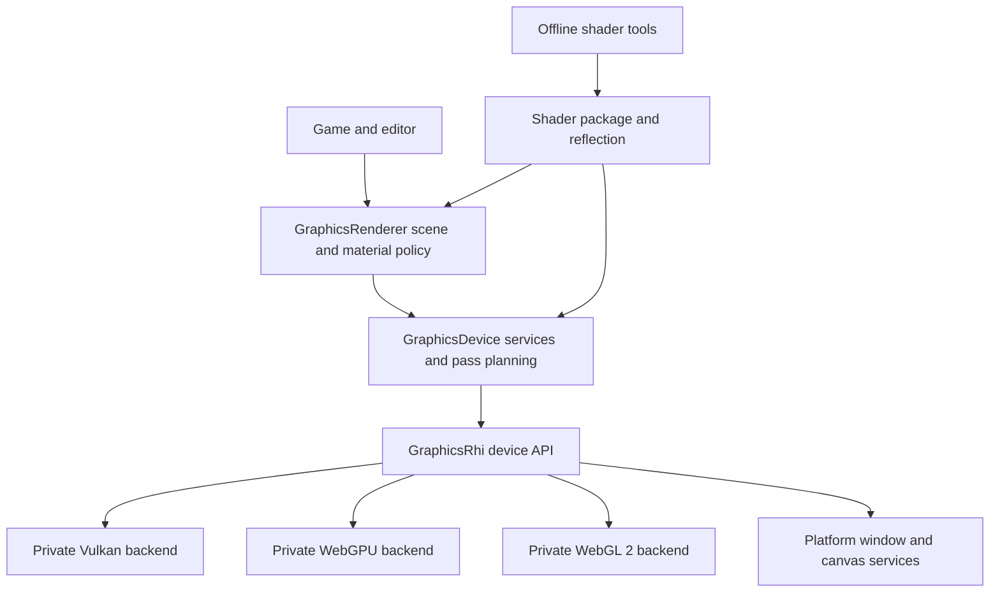

# Ludus RHI and Graphics Device Interface Architecture

**Status:** Proposed architecture, 2026-10-04. Intended for engine implementation
review. This document was drafted before opening the article map, then refined
through [five complete reference chapters](rhi-gdi-gems-review.md) and current
primary documentation. The first implementation slice now adds effective
fullscreen capabilities, copied startup requirements, explicit requirement and
backend-selection failures, and requirement-aware browser fallback. Remaining
R0 work and R1-R5 are proposals. No performance gain has been measured; accepted
ADRs and the public API define shipped behavior.

Ludus should use a **small explicit RHI, a Graphics Device Interface that plans
and manages GPU work, and a renderer that owns scene policy**. Make resource
lifetime, pass dependencies, pipeline state, and capability selection explicit.
Use one physical queue and predictable pass order first; add native optimizations
through measured capability paths. This gives Vulkan and WebGPU room to perform
well while keeping WebGL 2 a useful raster backend.

Here **GDI means Graphics Device Interface**, the proposed engine device services
layer, named `GraphicsDevice` in code. This interpretation is a naming assumption;
Windows GDI is outside the scope. RHI means rendering hardware interface. These
are proposed roles, not two duplicate wrappers around every graphics call.

## Current implementation and compatibility

The audited source has three backends, with a deliberately bounded common API:

| Existing boundary | Observed implementation | Consequence for this design |
| --- | --- | --- |
| [Public lifecycle](../../modules/graphics/rhi/include/ludus/graphics/rhi/rhi.h) and [facade](../../modules/graphics/rhi/src/rhi.cpp) | One main-thread session, asynchronous browser startup, statuses, generation tokens, frame begin/end | Preserve behavior; add an explicit device API alongside it |
| [Public fullscreen resources](../../modules/graphics/rhi/include/ludus/graphics/rhi/render.h) | Eight resources per kind, shaders, one uniform binding, pipelines tied to a uniform, one fullscreen triangle | This is a compatibility slice, not a general buffer/texture/pass API |
| [Vulkan](../../modules/graphics/rhi/src/rhi_vulkan.cpp) | Vulkan 1.1 render passes, two fenced command/uniform slots, owned headless image, maintenance1 presentation retirement on Wayland, individual device-memory allocations | General resources need allocation and retirement services; do not require Vulkan 1.3 merely to refactor |
| [Browser dispatcher](../../modules/graphics/rhi/src/rhi_web.cpp) | WebGPU startup with one permitted WebGL 2 fallback and Platform-managed canvas replacement | Preserve ADR 0014 and callback isolation |
| [Shader build helper](../../cmake/shaders/compile_shader.py) | Pinned Slang emits SPIR-V/WGSL; pinned SPIRV-Cross emits GLSL ES 3.00, with bounded layout validation | Retain proven targets; general reflection/layout support is future work |

Retain `Start`, `GetStartup`, frame statuses, and `DrawFullscreen` as a facade
through the migration. Keep existing resource ownership and `InUse` rejection
semantics for that facade until an explicitly documented migration changes them.
The new API's deferred destruction must not silently change old call behavior.
The historical [Milestone 2](milestone-2.md) predates the current common API and
is not a statement that today's repository has no RHI.

Preserve startup-only fallback, forced-selection failure, Platform canvas
ownership, zero-size skips, and explicit loss/restart. Never change backend in a
ready session, conceal shader/validation defects through fallback, or revive an
old handle after restart. Supporting a new feature does not imply upgrading the
pins in `config/web_toolchain.json`, `config/shader_toolchain.json`, or
`config/spirv_cross_toolchain.json` as part of this design.

## Module boundaries and ownership



Runtime dependency direction is
`GraphicsRenderer -> GraphicsDevice -> GraphicsRhi -> Foundation/Platform`.
Shader package arrows describe input data. A device need not have a surface;
Platform still owns any borrowed window/canvas. Initially instantiate one device
and one surface. Make those relationships explicit so offscreen work and future
editor views do not depend on a global current window.

| Owner | Responsibilities | Keep outside this owner |
| --- | --- | --- |
| `GraphicsRhi` | Native device/resources, one authoritative handle registry and submitted-use ledger, resource retention, encoders, binding/pipeline objects, semantic dependency lowering, submission/completion, surface acquisition/presentation | Entities, asset paths, materials, visibility, frame effects, streaming priority |
| `GraphicsDevice` | Upload/readback scheduling, frame storage, pipeline requests/prewarming, pass declarations and compilation, cross-frame import planning, transient resource pooling, retirement servicing | Native API objects, shader business meaning, gameplay quality policy |
| `GraphicsRenderer` | Immutable scene extraction, views, visibility, materials, effect variants, draw sorting/batching, desired quality and fallback | Vulkan flags, WebGPU objects, GL selectors, native heap placement |
| Content/resource layer | CPU source ownership, load priority, durable identity, recreation recipes, mip/residency decisions | Physical release of in-flight GPU allocations |
| Platform | Windows/canvases, input/listeners, legal browser canvas replacement | Graphics context/resource lifetime |

GDI calls the RHI's retain/release and completion operations; it does not keep a
second registry or competing generation counter. The RHI remains correct for an
expert direct client, which must provide the same resource-use and dependency
contracts explicitly. Direct work and GDI work share one submission owner and
state ledger, owned by RHI and updated on accepted submissions. GDI uses its
snapshot to plan imports; it cannot independently commit a different device
state. Unregistered backend calls cannot mutate tracked state.

Suggested layout follows the repository's public/private convention:

```text
modules/graphics/rhi/
  include/ludus/graphics/rhi/       small device, resources, commands, surface APIs
  src/internal/                   registry, use ledger, retention, dispatch, validation
  src/backends/vulkan/            device, resources, bindings, commands, surface
  src/backends/webgpu/            device, resources, bindings, commands, surface
  src/backends/webgl/             context, resources, state cache, commands
modules/graphics/device/
  include/ludus/graphics/device/   uploads, readbacks, pipeline requests, passes
  src/internal/                   pass compiler, pools, import planning
modules/graphics/renderer/        only when scene/material consumers justify it
```

These directories and targets are proposals. Split large backend translation
units by ownership as features grow; avoid a class per native function. Public
headers use Ludus aliases, small descriptions, opaque typed handles, and spans.
Backend SDK headers, heavy standard-library headers, owning caches, and private
headers stay behind `.cpp` boundaries. Explicit includes, `#pragma once`,
exception-free failure paths, `noexcept`, and header parse budgets apply.

Bind one small **private function table per device** at startup. Native
single-backend builds can use direct binding; the browser uses its existing
selection boundary. Dispatch at meaningful encoder/resource operations, not
through an interface object attached to every draw/resource. Native encoders
record their actual command buffers; WebGPU records its encoders; WebGL executes
on the context owner. Worker-produced draw packets contain engine data, not a
second universal native-command bytecode or serialization framework.

## Capability negotiation and portable behavior

A backend name is not a feature guarantee. Record four distinct facts: compiled
backends, adapter-supported features, device-enabled features/limits, and the
renderer path selected for this workload. Immutable `DeviceCapabilities` is
published only when startup is ready. Requests include required and preferred
features; unmet requirements fail before resource creation, while preferences
select a supported path. Browser Auto fallback must validate the application's
requirements against the fallback as well.

Use requirements as workload bundles, with individually queryable capabilities:

| Workload bundle | Intended operations | Vulkan | WebGPU | WebGL 2 |
| --- | --- | --- | --- | --- |
| Portable raster | Direct indexed/instanced draws, uniforms, sampled textures/samplers, color/depth passes, uploads/copies | Implement | Implement | Implement within verified limits |
| Portable compute | Compute dispatch, storage buffers/textures within format/access limits | Query and implement | Query enabled limits/formats | Unsupported |
| Indirect rendering | Indirect draw/dispatch and specified argument layouts | Query each operation | Query each operation and optional features | Outside the core baseline |
| Native advanced | Descriptor indexing/bindless, mesh shaders, ray tracing, multiple physical queues, heap aliasing, external sharing | Optional independent paths | Only individually verified enabled features | Unsupported unless a specific extension is deliberately added |

The table is a target contract, not a claim that the current fullscreen RHI
implements these features. No operation is enabled merely because a latest spec
or a proposal mentions it. The pinned browser C API and real runtime must expose
and pass its conformance case. WebGPU is not restricted by Ludus's WebGL baseline;
compute renderers remain available on suitable devices.

Formats need a matrix of sampled/filterable/renderable/blendable/storage/copy
uses, sample counts, dimensions, and compatible view formats. Query and validate
limits for each profile: bindings per stage, uniform range/offset alignment,
vertex attributes/stride, attachment count, texture dimensions, and copy layout.
Do not hardcode desktop counts or promise all float attachments are blendable.
A renderer chooses its format/effect variant before creating the frame plan.

Portable raster deliberately constrains several API mismatches:

- A sampled `TextureView` uses the original format/dimension and complete
  supported sampling range. An attachment view selects a legal mip/layer.
  Independently restricted sampled ranges and format reinterpretation are
  capabilities; WebGL 2 must not fake independent views by changing shared
  texture base/max-level state between incompatible bindings.
- Vertex formats, topology, index types, instance attributes, and sampler
  behavior have a reviewed portable set. Base-vertex and first-instance behavior
  are explicit capabilities. The initial portable draw contract uses zero
  values, mesh-local indices, and deliberate buffer slices, rather than an
  invisible CPU reindexing path.
- Backend copy restrictions, texture pitch/block alignment, and format
  compatibility are checked. An optional raster conversion is a declared GDI
  pass, not a hidden promise that every copy operation works everywhere.
- WebGL 2 general compute is unsupported. An ocean or particle effect can choose
  a raster ping-pong implementation or a CPU implementation; these are authored
  renderer variants with their own costs. Do not simulate compute/indirect work
  through transparent synchronous readbacks.

The current [WebGL 2 specification](https://registry.khronos.org/webgl/specs/latest/2.0/)
is an API constraint reference. Extension availability and the pinned Emscripten
surface must be checked during implementation; do not treat experimental WebGL
compute specifications as the deployed WebGL 2 baseline.

## Resource and command contracts

Expose only the concepts needed by real consumers:

| Concept | Contract |
| --- | --- |
| `Device` and optional `Surface` | Explicit owner/session; surface images are borrowed frame attachments |
| `Buffer`, `Texture`, `TextureView`, `Sampler` | Immutable description and legal usage; mutable contents through scheduled writes/copies |
| `Shader` and `BindingLayout` | Validated target artifact and explicit layout identity |
| `BindingSet` | Immutable resource/range snapshot retaining its dependencies |
| `GraphicsPipeline`, optional `ComputePipeline` | Immutable shader/layout/state combination, independent of particular uniforms |
| `CommandEncoder` and pass encoders | Single owner, explicit begin/end, retained resource references, finish or discard |
| `SubmissionToken`, `UploadTicket`, `ReadbackTicket` | Explicit asynchronous state, owner identity, cancellation/loss semantics |

The old `PipelineDescription.Uniform` coupling ends at the compatibility facade.
A new pipeline specifies vertex inputs, topology, raster/depth/stencil/blend
state, sample count, attachment formats, layout, and shader versions. It does
not own a particular material's data. Viewport, scissor, and declared dynamic
buffer offsets are encoder data; target dimensions are not a pipeline key unless
an explicit specialization makes them so.

All calls return a small status/result and optional bounded diagnostic ID.
Creation accepts a null output handle; Ready/Pending creates exactly one owned
incarnation, while validation/admission failure leaves it null and rolls back
private reservation. A published Pending incarnation consumes its generation
on cancellation/failure. No output overwrites a previously owned resource.
Separate Unsupported, InvalidDescription, InvalidHandle, InvalidState,
OutOfMemory, BudgetExceeded, Pending, and DeviceLost.

Descriptions and borrowed input bytes are consumed/copied before the call
returns, or the API takes an explicit ownership lease. A Pending result never
borrows the caller's stack, string, span, or editor memory. Callback storage is
bounded and engine-owned. Capacity exhaustion and integer/alignment overflow
are checked before creating partial backend state. Shipping checks retain
identity, range, capacity, and device-state validation; deeper hazard reporting
is a development layer. Diagnostics use `LUDUS_LOG_*` and cannot affect success.

Each asynchronous request carries its device owner, request/resource generation,
and operation identity. Completion publishes into a pre-reserved request record;
the owner drains it without reentrant device mutations. Configure or synchronize
the pinned API's callback mode explicitly, including spontaneous delivery.
Request bookkeeping outlives callback invocation, and stale delivery still
releases any callback-owned native result according to backend rules. Exhaustion
is rejected before launching the request; a mandatory completion cannot be
dropped like optional telemetry. Shutdown invalidates identities before teardown
and does not assume that cancellation prevents a late callback.

An encoder is a simple state machine:
`Recording -> Finished -> Submitted -> Retired`, or `Recording/Finished ->
Discarded`. It cannot be submitted twice in the initial contract. Nested passes,
commands in the wrong pass type, operations after finish, and failed-resource
binding return errors. GDI preflights declared plans and complete immutable draw
packets before execution, including WebGL requirements and bindings. Expert
direct calls validate each operation before issuing it. A later invalid direct
operation does not roll back earlier accepted WebGL calls; that path reports its
partial-work/failure state explicitly.

## Identity and physical lifetime

Use the following runtime identity rules for new public handles:
a typed owner token plus slot and non-wrapping generation, with null distinct
from a valid slot. Owner denotes the device registry lifetime, not its pointer.
Existing fullscreen IDs remain compatible. UUIDs identify content; they are not
GPU resource lookup keys. Keep hot slot metadata separate from diagnostic names
and creation records. Return IdentityExhausted/CapacityExceeded; never wrap or
silently evict a live slot.

Logical destruction prevents new handle resolution immediately. Physical
release requires **both** no retained CPU references and completion of all GPU
uses. A built packet, finished encoder, pending submission, binding set, and
readback request can retain a resource record before any submission token
exists. Therefore last submitted fence alone is insufficient. Each retaining
owner releases its references on discard, completion, or cancellation. Avoid
cycles: a view retains a texture, a binding set retains resources/layout, and a
pipeline retains its shader/layout; none retain their consumer.

An already accepted encoder keeps its retained records even if public ownership
is destroyed. Destroy cannot add new encoding through the stale handle. Handle
slots may be recycled only after their incarnation is safely detached and its
generation advanced; detached backend records/storage remain unreusable until
all leases and completion obligations end. The reference implementation can
retain the slot until physical retirement for simpler debugging.

On submit acceptance, assign an owner/queue-scoped monotonic `uint64` ordinal.
Its progress state is Pending, Complete, Failed, or DeviceLost; zero/foreign
owner is invalid, and ordinal exhaustion is explicit. A higher Complete ordinal
covers earlier accepted work on that ordered queue. Multiple physical queues,
when added, require one last-use token per queue unless a proven wait establishes
completion dominance. A displayed frame number, CPU fence, or queue-submit
return is not GPU completion.

| Backend | Initial completion lowering | Important limit |
| --- | --- | --- |
| Vulkan | Existing fences mapped to ordinals; timeline semaphores only when negotiated | Command/descriptor pools and staging cannot reset before completion |
| WebGPU | Queue work-done callbacks, coalesced at submission boundaries, generation-checked | Completion is asynchronous; buffer mapping has its own success/state |
| WebGL 2 | Sync after a submitted batch; zero-timeout polling on later event-loop turns, explicit flush where needed | Do not spin, wait with long timeouts, or substitute `glFinish` |

WebGPU's queue and mapping semantics are specified separately. A mapped
readback buffer proves that buffer is ready, not global queue completion. A
render pass has one usage scope, including resource-binding commands; do not
assume that only the final draw's active resources participate.
[WebGPU synchronization, mapping, and queues](https://www.w3.org/TR/webgpu/).

Presentation has a separate surface-generation obligation. Vulkan submission
completion does not establish present completion. Preserve the current per-image
semaphores and maintenance1 presentation fences during resize/shutdown;
timeline semaphores do not replace WSI binary acquire/present synchronization.
The [Vulkan swapchain semaphore guide](https://docs.vulkan.org/guide/latest/swapchain_semaphore_reuse.html)
explains this distinction. Browsers control compositor presentation, so report
GPU completion and browser presentation availability separately; do not invent
an exact display-complete token.

On loss, invalidate device/surface generations, fail/cancel pending tickets,
stop new work, and run backend loss teardown. Do not convert failed work to
successful completion to satisfy a recycler. Content may recreate from recipes
in a fresh session, with fresh handles. Normal new-device shutdown can be
requested and polled while browser events continue; a main-thread destructor
must not wait for callbacks that require that thread. Preserve existing
`Shutdown` behavior while adding the new lifecycle, and keep the canvas/window
alive until the relevant teardown contract finishes.

## Memory uploads and readbacks

CPU allocation follows [Foundation memory policy](memory-management.md), using
existing fallible `Array`/`StaticArray` seams and explicitly reserved storage.
GPU allocation belongs to RHI. GDI manages budgets and schedules, without
assuming that FoundationMemory arenas are already implemented. Frame storage
resets only after its CPU packet jobs and GPU storage leases have retired.

For general Vulkan resources, use a **pinned private VMA adapter** as the default
implementation choice instead of growing the current allocation-per-resource
helper into a new allocator. VMA returns explicit errors and does not require
C++ exceptions; its implementation belongs in one private translation unit.
Respect memory requirements, dedicated allocations, heap budgets, and
non-coherent flush/invalidate alignment. Host allocation callbacks require a
separately verified Foundation-compatible failure/alignment contract.
[VMA integration](https://gpuopen-librariesandsdks.github.io/VulkanMemoryAllocator/html/quick_start.html),
[Vulkan allocation guidance](https://docs.vulkan.org/guide/latest/memory_allocation.html).

Do not put VMA handles/heaps in the common API. WebGPU/WebGL implementations
manage their own memory; expose logical sizes and estimates, marking physical
heap telemetry unavailable. Report requested bytes, logical live bytes,
allocated backing, retired-but-pending bytes, staging/readback bytes, and
backend-known budgets separately. Do not add suballocated payload to backing
and call the sum GPU memory usage. Streaming admission/eviction priorities
remain content policy.

Upload service accepts owned source blocks or immediately copies borrowed data
into a bounded staging ring. It schedules early, returns an `UploadTicket`, and
publishes destination use plus dependency information for pass imports. Distinct
states describe source bytes consumed, copy queued, and destination usable.
A consumer on the same queue can use a correctly ordered upload before host
completion; an asynchronous queue consumer needs an explicit wait/ownership
transfer. Recycle CPU staging only when the backend has consumed it or the GPU
copy completes, according to the actual API contract.

For small dynamic data, allocate aligned slices from retained upload blocks:
persistently mapped Vulkan memory where suitable, ordered WebGPU writes, and
WebGL uniform/vertex uploads to unoccupied ranges. Reuse binding objects with
dynamic offsets where legal; do not allocate a new descriptor for every object.
Validate maximum bound range separately from overall buffer size. Ring pressure
returns Backpressure or a budgeted growth request at a safe point; it never
silently overwrites in-flight bytes or grows in a warmed draw loop.

Keep streaming uploads **outside the transient render graph** initially. Import
one ready resource/dependency per consumed result; do not create one graph node
for every streamed block or hidden descriptor edit. This is a refinement from
Kapoulkine and Moore in the [reference review](rhi-gdi-gems-review.md).

Readback service schedules into staging, returns a ticket, and yields an owned
CPU result after completion and any required mapping/invalidation. Vulkan uses
host-readable staging; WebGPU uses copy-to-map-read staging; WebGL uses a pixel
pack/copy buffer and sync where supported, then retrieves bounded data. Browser
mapping remains asynchronous. Copy-out itself can cost time even after a fence.
No synchronous per-draw queries or readbacks in normal renderer behavior.
Cancellation removes the consumer but keeps physical staging retained until safe.

## Bindings shaders and pipelines

Use explicit layouts and immutable binding snapshots. A recommended raster
scheme groups View/Frame, Material, and Draw data by update frequency, with
Draw data in uniform slices. These are renderer conventions, not three mandatory
sets in every pipeline. Compute and post-effects can have smaller purpose-built
layouts. Generated target mappings flatten logical groups to WebGL uniform
binding points/texture units and map them to Vulkan sets or WebGPU groups.
Sampled texture/sampler pairs must have a verified GLSL lowering; unsupported
pairing patterns fail the package build. Count actual per-stage requirements.

Keep frame descriptor pools separate from long-lived material sets on Vulkan.
Batch allocation/update work, bulk reset frame pools on completion, and preserve
binding/layout compatibility across pipelines. Never patch in-flight descriptors
or reuse a binding slot based only on a frame index. Material edits and texture
replacement publish a new binding snapshot; old packets use the old retained
version. Shader hot reload similarly builds new pipelines and atomically
publishes a ready compatible version at a frame boundary.

The WebGL backend owns a context-local shadow cache for program, VAO, framebuffer,
texture/sampler units, uniform ranges, blend/depth/raster state, and dirty uploads.
Apply required state at a draw boundary and eliminate identical backend calls.
Use indexed slots/revisions, not a heap-allocated observer per uniform. Reset
known state on context recreation and invalidate touched cache categories if an
explicit foreign integration is ever allowed. Do not query GL to reconstruct
state per draw. **Large uploads still schedule before drawing**; state deferral
must not delay the bulk transfer work that should overlap GPU execution.

Keep the pinned offline shader chain: Slang to SPIR-V/WGSL, plus SPIR-V through
SPIRV-Cross to GLSL ES 3.00. General packages add versioned schema, source/tool
hashes, target/profile/features, explicit entry names, resource bindings/access,
vertex/fragment interface, and layout identity. Native consumers do not need
host compiler tools at runtime. Expanding the current one-uniform helper is a
separate implemented step, with rejection of every unverified layout form.

Reflect the selected target and validate emitted artifacts, not only source
language declarations. Generate host upload structures/static layout checks or
explicit serializers; use a common layout only when proven identical across
targets. Names are authoring/debug metadata. Encoding uses numeric bindings and
validated layout IDs, with no shader-source parser or string lookup per draw.
Slang distinguishes types from their target/context-dependent layouts.
[Slang reflection documentation](https://shader-slang.org/slang/user-guide/reflection.html).

Pipeline requests are deduplicated by canonical field-wise keys containing
shader content/version, layout, fixed state, vertex interface, attachment formats,
samples, and specializations. Hash collisions compare the complete key. Do not
hash object pointers, padding, or a backend struct dump. A renderer draw packet
already holds a ready pipeline handle; it does not rebuild a key and create a
pipeline during draw encoding.

Prewarm the finite technique variants required by installed content and graphics
settings, with a manifest of missing variants. Vulkan creation can run in
budgeted worker jobs with correct private cache synchronization; WebGPU uses
asynchronous creation when the pinned C API supports it; WebGL compiles on the
context owner and may use a verified parallel-compile extension. Offline source
compilation does not eliminate runtime driver pipeline compilation.

A Pending pipeline yields a predeclared compatible error/fallback technique or
an explicit skipped effect. A Failed required pipeline stops that content path
with diagnostics, never backend Auto fallback. The fallback must also exist and
be ready. Persist native driver caches only with validated identity/version and
bounded input; reject incompatible/corrupt caches and rebuild. Keep portable
technique manifests separate from driver blobs. Limit permutations before trying
to solve their explosion through more compilation threads.

## Pass declarations and deterministic compilation

The first GDI execution API is an **ordered pass list with declared resources**.
That list is compiled as a graph for validation, dependencies, culling, and
lifetimes; no heuristic reordering is necessary. A renderer writes the intended
order. Reading a version produced only by a later pass is an error, not permission
to silently move the pass. Independent passes can overlap on the GPU where legal
without changing their authored CPU order.

Each pass has a stable name/source location, queue class, immutable owned packet,
explicit side effects, and resource uses. Buffer uses declare ranges; texture
uses declare mip/layer/aspect. Access modes distinguish read, write, read/write,
and relevant stage visibility: uniform, sampled, vertex/index, attachment,
storage, transfer, indirect, and present. Track hazards at actual backend
granularity; conservative whole-buffer tracking is acceptable initially, but
must be visible as such in diagnostics.

A logical compute pass initially contains one dispatch. Multiple dependent
dispatches require separate passes, or a later explicit internal use schedule
with synchronization; a broad StorageReadWrite declaration does not establish
ordering between them. Shader-local data races and workgroup barriers remain
kernel correctness responsibilities. Optional raster storage writes similarly
cannot rely on ordinary attachment draw order to synchronize arbitrary buffers.

Raster attachments specify format/view, extent, samples, Clear/Load/Discard,
Store/Discard, optional resolve, and depth/stencil read-only behavior. Every read
requires defined prior contents. Load requires a valid import/producer; discard
or partial write does not establish full initialization. These declarations
allow bandwidth savings, and the backend supplies required security
initialization rather than exposing undefined memory. Resolve is an attachment
operation where supported; do not always store a whole MSAA image and resolve
it later. Public subpasses are unnecessary for the first API.

Compilation proceeds through one inspectable implementation:

1. Validate requirements, handles/leases, descriptions, declared actual bindings,
   pass types, attachments, and capacity before executing anything.
2. Create logical resource versions. Read/write in-place access carries explicit
   RAW, WAR, and WAW dependencies against the same physical resource. A new
   version does not automatically allocate a new texture or remove hazards.
3. Verify producers and authored ordering. Reject incompatible same-pass uses,
   illegal feedback, cycles, and references to discarded/uninitialized contents.
   Reflection supplies binding types/visibility; it cannot discover every shader
   runtime access, so author declarations stay authoritative.
4. Mark roots: present, exported/history resources, readbacks, and explicit side
   effects. Cull only passes that contribute to none. Future-frame history writes
   are observable roots, even if this frame does not sample them.
5. Compute first/last uses and acquire compatible transient objects. Initially
   pool complete matching descriptions; fresh/aliased storage starts undefined.
6. Produce semantic dependencies and a backend lowering plan, including upload
   imports, final uses, presentation, and cross-execution obligations.
7. Encode and submit, transferring leases to submission records. Commit the
   RHI's persistent state ledger only for accepted work. If execution has begun and
   fails, do not pretend that a partial plan rolled back; fault affected state or
   the session as required by backend error semantics.

No per-pass owning lambda may outlive captured stack references. Begin with
plain execution functions plus frame-owned packet data, explicit retention, and
an encoder limited to resources declared by that pass. Development validation
compares actual binds/commands against declarations, including extra WebGPU
bindings that contribute to its usage scope. Resolve handles once per packet
where possible, retaining all public boundary checks.

Packets expose their complete bindings and draw descriptions for preflight.
Execution functions traverse those validated packets; commands that need
additional resources or capabilities require rebuilding the plan. Backend
runtime errors can still happen after preflight and follow the partial-failure
rules above; validation is not a promise of transactional GPU execution.

Imported persistent resources carry known content validity, initial/final uses,
owner and pending dependency tokens. One owner-managed ledger connects graph
executions and direct submissions. A same-queue completion dependency can be
lowered without a host wait; native queue ownership still needs appropriate
barriers. History resources and double-buffered render targets are allocated
against completion, not `frameIndex % 2` alone. Plan-cache reuse is optional;
if later added, its key includes topology, requirements, layouts, attachment
compatibility, and external-state contracts, not just resolution.

### Concrete portable frame

| Ordered pass | Declared inputs | Outputs and required lifetime |
| --- | --- | --- |
| Scene | Uploaded geometry, View/Material/Draw bindings | Linear scene color cleared/stored; depth cleared and retained only as needed |
| Transparency | Scene color and depth as attachments, transparent packets | Same color loaded/stored; read-only depth; painter/depth ordering preserved |
| UI | Scene color as attachment, UI textures/packets | Linear color loaded/stored; painter order and linear blending preserved |
| Composite | Scene color sampled, acquired surface | Surface cleared/written with exactly one output encoding and handed to presentation |

Vulkan inserts the color-write to fragment-sample dependency and legal layout
transition. WebGPU closes the first rendering scope before sampling scene color
in a new pass. WebGL changes framebuffer and samples the offscreen texture in a
legal ordered draw. The graph exports why each dependency exists. It never
samples a texture while attaching it for conflicting write access. A compute
post-effect is a different selected variant, not part of the WebGL plan.

## Backend lowering and optional optimization

Semantic dependencies carry producer/consumer access, stages, subresources,
and execution placement. They are not Vulkan enums renamed into engine types.
Only the backend translates them to actual synchronization. Batch compatible
dependencies at the same boundary without broadening their scope unnecessarily.
RAW/WAW generally need memory ordering; WAR may need execution ordering only.
Queue submission order alone is not a complete Vulkan memory dependency.
[Vulkan synchronization examples](https://docs.vulkan.org/guide/latest/synchronization_examples.html).

| Backend | Lowering rule |
| --- | --- |
| Vulkan | Maintain one tested semantic mapper. Retain the Vulkan 1.1 barrier/render-pass path; negotiate synchronization2, timeline semaphores, and dynamic rendering as independent optional paths. Preserve narrow stages, correct layouts, queue ownership, load/store and WSI retirement |
| WebGPU | Use resource creation flags, legal scopes/pass boundaries, ordered queue operations, error scopes and asynchronous status. No fake explicit barriers, heaps, or queue families in the public API |
| WebGL 2 | Apply context state snapshots, legal FBO operations, copies/uploads and batch sync on its owner. Reject unsupported commands before execution. No desktop GL persistent mapping or memory-barrier assumptions |

Choose the existing legacy Vulkan lowering initially. If adopting an optimized
Vulkan baseline later, negotiate and test newer paths deliberately, then remove
an obsolete lowering only through a supported-device policy change. Permanent
duplication of two unmeasured implementations is a maintenance cost.

Transient pooling reuses equivalent resource objects after all uses finish.
Native heap aliasing is a separate later feature: match memory requirements and
resource classes, order old/new users, issue backend-required alias transitions,
and initialize the new contents. Lifetime intervals on a CPU pass list are
insufficient once queues overlap. WebGPU/WebGL can pool objects without claiming
control over physical allocation aliasing.

Merge raster passes only when attachment/load/store/resolve behavior and resource
scopes stay legal and measurements show a benefit. One logical pass is not
necessarily one submission. Start with one graphics submission per rendered
frame plus budgeted upload work; split to feed the GPU sooner only when latency
and utilization measurements justify it. No fixed historical millisecond,
command-buffer, or submit count from a book is a shipping budget.

Renderer packets are compact contiguous data with stable pipeline/binding/mesh
references. Sort opaque objects within the declared pass by pipeline/material
with suitable depth buckets; preserve transparency, UI painter order, queries,
and side effects. Batch adjacent compatible UI draws and instanced geometry.
Add GPU culling/indirect submission as a compute-capable renderer path; it still
buckets by pipeline and retains direct raster fallbacks.

## Threads surfaces and rendering conventions

One owner thread controls startup, surfaces, submission, state-ledger updates,
loss, and retirement. It remains the browser main/context thread initially.
Jobs can extract immutable scene packets, prepare uploads, and request pipelines
through bounded queues; publication establishes CPU synchronization, separately
from GPU completion. Creation mutations do not race frame encoding.

Native parallel recording is optional. The compiler fixes execution order and
initial states before jobs start; each worker receives a disjoint packet and
private recording pools per completion domain. Vulkan command/descriptor pools
are never concurrently mutated or reset before GPU completion. Join finished
buffers in deterministic order and submit through the owner. Small passes remain
serial. Measure worker idle time, command memory, join cost, and input-to-display
latency as well as throughput; extra buffering is not automatically a win.

A surface publishes acquired extent, format/encoding, sample count, transform,
and generation. Surface attachments cannot escape their acquired frame. Resize
invalidates extent-dependent pools/plans and reacquires images; pipeline rebuild
is required only for format/sample/layout/specialization changes. Preserve the
current facade's restart-on-format-change contract until its replacement is
implemented and documented. Suspended/zero-size surfaces skip acquisition and
drawing; they do not require zero-size GPU textures. Browser composition clears
or replaces drawing buffers, so history uses engine-owned textures.

Choose canonical shader clip coordinates with Y up and depth in `[0, 1]`, and
pixel rectangles with a top-left origin. WebGL lowering converts depth to its
clip range; viewport/scissor/winding and render-target sampling transforms are
explicit per backend. Do not blindly flip every texture or double-transform
compiler-adjusted output. Imported image origin is package metadata. Verify
ordinary sampling, render-to-texture sampling, front face, depth, readback row
order, and viewport/scissor through diagnostic scenes on every backend.

Keep linear light through scene rendering/blending. Declare texture encoding,
attachment conversion, output color space, and canvas alpha/premultiplication
separately. An sRGB presentation color-space label does not make a UNORM
attachment blend in linear light. For a browser UNORM final target, composite UI
into the linear offscreen color and encode once in the final output shader;
otherwise blending UI after encoding would be wrong. Use a verified sRGB
attachment conversion when available, with no duplicate shader encoding. HDR,
wide gamut and surface transforms are future negotiated output policies, not
implicit consequences of backend selection.

## Debugging and measurement

Every resource, pipeline, pass, encoder, upload and submission gets a stable
numeric identity and optional bounded name/source context. Report the offending
pass, handle owner/generation, actual versus declared use, prior writer, format,
layout, and completion obligation. Store native errors alongside engine status
rather than flattening every failure to a generic rendering error.

Export a readable execution report with authored/culled passes, dependency
reasons, resource versions/lifetimes, lowered barriers, binding layout, pipeline
keys, pool assignments, upload/readback traffic, pending retirements, and
surface generation. Normal logging and profiling may drop optional records
under pressure; record diagnostic loss and never crash device work because a
name, capture, or telemetry allocation failed. Do not build a custom capture
viewer before existing logs/artifacts answer the needed questions.

Provide controlled investigation modes: serial recording, one physical queue,
no pass culling/merging, no aliasing, fresh transient resources, and disabled
state-cache elision. All modes still produce valid dependencies and initialization.
A graph dump maps execution functions back to setup sites. Debug changes can
hide timing or lifetime bugs, so compare the original optimized plan as well.
Epic's [RDG debugging documentation](https://dev.epicgames.com/documentation/en-us/unreal-engine/render-dependency-graph-in-unreal-engine)
illustrates why deferred execution needs those controls; this design adopts the
principle without requiring Unreal's framework.

Use Vulkan validation including synchronization validation, GPU debug markers,
and RenderDoc/vendor captures where the actual platform supports them. Browser
validation/error scopes, program logs and extension-based timers complement
image tests. GPU timestamps are optional: report clock domain/availability and
browser precision, never substitute CPU encoding time or zero for unavailable
GPU duration. Do not compare unrelated queue clocks without calibration.

## D3D12 Metal and compute expansion

D3D12 and Metal implement the established device/resource/layout/pass/token
contracts. Their binding systems, residency, heaps, native barrier choices,
command allocator reuse and completion mechanisms stay private. Future backend
conformance must prove all common semantics before the renderer uses it.
D3D12 allocator reset requires completed GPU uses, and Metal resource
synchronization depends on its selected API and hazard mode; portable dependencies
remain meaningful in both.
[Microsoft allocator lifetime](https://learn.microsoft.com/en-us/windows/win32/api/d3d12/nf-d3d12-id3d12commandallocator-reset),
[Apple resource synchronization](https://developer.apple.com/documentation/metal/resource-synchronization).

CUDA and other compute infrastructures are **future execution domains**, not
raster backends that implement empty graphics methods. Keep the current API
surface-free where possible, but do not implement a universal GPU interface now.
When a compute consumer arrives, extract the genuinely shared buffer/range,
capability, lifetime and completion vocabulary into a small common module;
implement kernel artifacts/arguments/streams in its compute executor. There is
no promise that a Slang raster package automatically becomes a CUDA kernel, or
that CUDA and graphics workloads share storage merely by running on one GPU.

A later GDI external-compute node imports declared inputs/outputs and completion
obligations. Native zero-copy interop is a separate bridge requiring matching
physical-device identity, compatible export/import handle types, layout/format,
allocation/dedicated requirements, OS handle ownership, semaphore protocol,
and explicit release/acquire of ownership. Keep resources retained across both
APIs. Unsupported interop uses an explicitly scheduled host copy or an alternative
kernel path, with its cost visible. Browser WebGPU/WebGL have no ordinary
CUDA memory-import path to expose. NVIDIA documents device UUID matching and
external memory/semaphore interoperability.
[CUDA interoperability](https://docs.nvidia.com/cuda/cuda-programming-guide/04-special-topics/graphics-interop.html).

## Implementation phases and acceptance

| Phase | Deliverable | Required evidence |
| --- | --- | --- |
| R0 Contracts | Device capabilities/results/ownership, compatibility facade, reference validator and loss protocol | Existing fullscreen/SDK behavior preserved; stale/cross-owner handles, pending cancellation, late callbacks and requirement failure covered |
| R1 Portable resources | Buffer/texture/view/sampler, general reflection/layout, immutable bindings/pipelines, indexed and instanced draws | Identical textured/depth diagnostic scenes on Vulkan, forced WebGPU, forced WebGL 2 and Auto; packing/limits/copy/view mismatch rejection |
| R2 Lifetime services | Completion tokens, retained records, upload/readback rings, Vulkan allocator adapter, pipeline requests | Destroy before/after finish/submit, discard, resource dependency retention, slow GPU/ring exhaustion, memory failure, cancellation, loss, resize/shutdown |
| R3 Ordered graph | Explicit pass list, version/hazard compiler, pooling, narrow synchronization, reports | Offscreen scene to composite/UI, graph roots/history/import contracts, undeclared-use detection, reference versus optimized image agreement |
| R4 Compute renderer | Capability-specific storage/compute/indirect effects and authored raster/CPU variants | Compute correctness plus supported limits; WebGL chooses a declared variant or fails before executing |
| R5 Measured optimization | Select only justified aliasing, parallel recording, pass merging, async queues or bindless services | Representative CPU/GPU/latency/memory evidence, adversarial synchronization tests, debug controls, consumer/SDK maintenance cost |

R2 resource retention and safe completion are prerequisites for scalable R1
uploads, not permission to ship unsafe intermediate resources. Implement R1/R2
as small vertical slices: introduce the minimum retirement service with the
first general buffer, then expand it. GDI graph/pipeline services arrive with
actual consumers; do not create all proposed files and interfaces at R0.

The validation suite must include resource failure rollback; handle and token
exhaustion; binding replacement while old packets remain; shader hot reload with
layout changes; mapping/copy pitch/range errors; RAW/WAR/WAW transitions; persistent
cross-frame data; feedback and undefined loads; graph capacity failure before
side effects; zero-size/minimize/restore; format changes; startup fallback,
failed canvas replacement and stale browser callbacks; and separate render/present
retirement. A null/reference backend validates plans and lifecycle only; it is
not evidence of GPU correctness or image quality.

Implementation uses the pinned native tools and required warning-clean builds,
unit tests, ASan/UBSan, format/tidy, header self-sufficiency/foundational includes,
parse-budget gates, and installed-SDK consumers. Browser builds use the pinned
web toolchain. Test Vulkan headless and real Wayland, real forced browser backends
and Auto, physical GPUs and hosted HTTPS/iframe scenarios. Software GPUs and
mock callbacks are additional evidence, not substitutes for those environments.
Game-project setup/repair must also follow AGENTS.md preset/toolchain checks.

Benchmark the existing fullscreen baseline and representative textured/instanced,
UI/transparent, multi-pass, upload-pressure, resize and compute scenes. Record
median and tail CPU/GPU frame times where measurable, input-to-display latency,
submit/command/state-change counts, driver compilation stalls, descriptor
traffic, upload/readback bytes, live/backing/pending memory, waits and high-water
capacities. Count engine warm-path allocations separately from opaque driver or
browser allocation. Reserved engine buffers can be allocation-free after warmup;
this design makes no promise of allocation-free driver internals.

Establish budgets per supported profile on actual target hardware. Require an
image-correctness/synchronization result before accepting a speedup, and reject
optimizations that improve one workload while making the supported baseline
unmaintainable. The first success criterion is a small readable implementation
whose cost and lifetime can be explained from a frame report.

## Decisions from the reference review

The [reference review](rhi-gdi-gems-review.md) records reading scope, exact pages,
and adopted/rejected techniques. Its concrete refinements are integrated above:
explicit ordered graph compilation; separate streaming dependencies; VMA-backed
Vulkan allocation; completion-based staging/pool reuse; frequency-based immutable
bindings; private WebGL state deferral without delaying large uploads; explicit
attachment load/store/resolve intent; enumerated/prewarmed pipeline variants;
compact packets with measured recording granularity; and debugger controls that
preserve resource-use validation.

Do not adopt a universal software command interpreter, mandatory bindless path,
public Vulkan subpasses/heaps, automatic arbitrary pass reordering, live resource
relocation, per-draw uniform observers, or always-on async queues. Each introduces
an ownership or portability cost without a current Ludus consumer proving its
benefit. The architecture leaves measured extension points for them without
making them prerequisites for a correct portable frame.


## First implementation slice: capability negotiation

`StartupInfo.Capabilities` is a value snapshot of the implemented fullscreen
API's effective limits while the session is Ready. It is zero during startup,
failure, device loss and shutdown. Raw adapter support is not advertised as an
engine operation. Frame dimensions are bounded by the backend's image/viewport
(and Vulkan framebuffer) limits; uniform sizes are capped by the negotiated
binding/allocation limits, the 16 KiB engine capacity, and 16-byte size granularity.
Resource capacities and the single draw per frame reflect current validation.

The four-argument `Start(app, window, selection, requirements)` copies minimum
frame/uniform requirements before asynchronous requests. Every backend attempt
checks these before publishing Ready. Auto may fall back once when requirements
are unmet; forced selections fail. `RequirementsUnsatisfied` and the first unmet
limit remain visible in startup diagnostics. Unsupported compiled backend policy
reports `BackendUnavailable`. Existing Start overloads impose no extra minima.
This slice retains WebGPU's default feature/limit request policy: it checks the
enabled device's limits without elevating them to raw adapter maxima. General
required/preferred feature enabling belongs to the explicit device API.

The smoke renderer declares its own requirement from its actual uniform type.
Lifecycle tests exercise rejection, accepted boundary values, reduced limits,
Busy requests, copied inputs, stale completion, loss and both fallback outcomes.
Browser tests inject insufficient negotiated limits on WebGPU and WebGL to prove
that fallback and rejection occur before any resource creation or frame.

This slice retains the existing singleton owner and monotonic handles. Explicit
multi-device ownership, typed generational handles and the reference plan
validator remain R0 work; no `GraphicsDevice` module is created yet.
