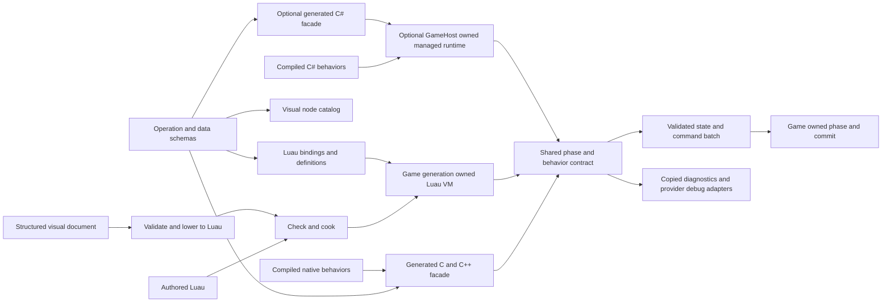
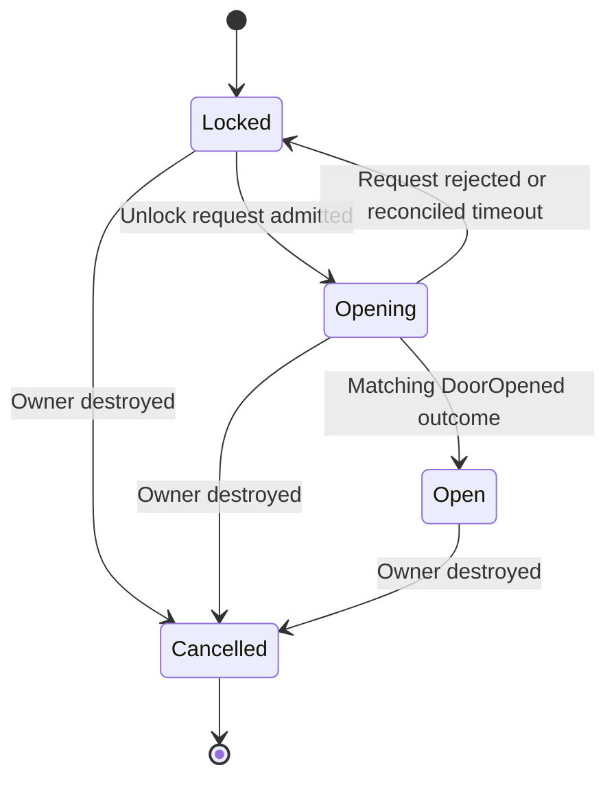

# Gameplay languages and visual authoring architecture

Status: proposed production architecture, researched on October 6, 2026 against
Ludus `ab49fe8`. The first [private S0 feasibility implementation](luau-s0.md)
starts from `d13b4f8`. The [S1 headless interaction](luau-s1.md) adds an opt-in
generated native/Luau contract and experimental runtime. Neither adds an
installed scripting SDK, production gameplay provider, or graph
editor. The [Gems review](scripting-gems-review.md) records the literature review
and resulting refinements.

## Recommendation

Keep C++23 for engine systems, native gameplay systems, and bulk simulation.
Deliver native C++ authoring and strict Luau gameplay scripting first, subject
to the integration gates below. Permit C consumers through a generated C-compatible
interface when needed. Reserve a narrow extension boundary for an optional C#
provider, with its own deployment, reload, and debugger acceptance. Projects select
their providers; games using C++ and data acquire no scripting runtime dependency.

Share engine operation schemas, checked references, declared state, phase timing,
and diagnostics across providers. Each provider owns its compilation and execution
machinery. Add small visual state machines and sequences when a real designer
workflow justifies them; initially lower them to Luau. Multiple languages do not
require a universal bytecode, cross-language object model, or a graph backend
for every language.

Ludus should own its gameplay API, authoring schemas, execution policies, and
tools. It should reuse an established language implementation. Creating
LuduScript, a general graph virtual machine, or automatic C++ nativization would
add a compiler and language ecosystem to the engine's maintenance obligations.
Those are poor default investments for the current team and engine.

The architectural goal is a short path from an author's intention to a native
operation, with visible state, explicit lifetime, and useful failure information.
The language choice supports that goal; it does not make arbitrary scripted
algorithms as fast as native code. There is no universal fastest or best design
independent of the game's workload and its authors.

| Work | Default representation | Reason |
| --- | --- | --- |
| Movement, collision, navigation queries, animation evaluation, replication, entity iteration | Native typed C++ systems | Native data layout, batching, existing debugger, and explicit phases |
| Tuning, spawn definitions, dialogue text, asset references | Validated data | Most variation needs values rather than executable logic |
| Interactions, abilities, objective rules, encounter orchestration | Small strict Luau modules | Fast edit and reload with ordinary text review and language tooling |
| Substantial gameplay code authored by a C# team | Optional C# behavior packages | Reuse the shared gameplay contract once the provider passes its platform gates |
| State transitions and ordered encounter sequences | Focused visual documents | Their structure is useful to see and inspect spatially |
| Arithmetic, collection algorithms, intricate control flow | Text or native functions | A graph of elementary operations becomes harder to read and edit |

The first useful scripting delivery is Luau text plus headless tests and a debugger.
Visual authoring follows an observed task such as an encounter that designers
frequently change. C# follows a concrete project requirement and a separate spike.
A game can continue using only C++ and data at every stage.

## Existing engine contracts

Existing implemented slices and accepted designs have narrower scope than the
proposed scripting system. Preserve their boundaries and their individual
implementation status; a referenced reload or tooling design is not proof that
the facility is implemented.

| Facility | Integration contract |
| --- | --- |
| [GameplayWorld](game-world.md) | The game owns typed component pools and its phase sequence. Scripting does not replace them with dynamic script objects. |
| [Entity identity](entity-world.md) | Script references retain world, slot, and generation identity. A reference cannot keep a destroyed entity alive. |
| [Tick updates](frame-update.md) | The owner thread mutates the world. Structural changes commit at the declared boundary; timers use simulation ticks. |
| [Reflection](reflection-serialization.md) | Reuse stable schema IDs and scalar validation. The implemented reflection slice does not yet support arbitrary containers or reference graphs. |
| [GameHost reload](../development/project-live-reload.md) | Planned native module swaps use explicit checkpoints, staging, and retirement. Runtime objects never cross the gameplay ABI; host-owned provider contexts use copied values and generation-checked tokens. |
| [Editor](editor-architecture.md) | Qt owns widgets; shared Qt-free services own validation. Opening a project executes no project scripts. |
| [Content](content-resources.md) | Introduce a separate script asset format and cook path. The current audio catalog's closed data schema does not gain executable fields. |
| [Networking](networking.md) | Replicate game-owned state and commands through explicit schemas. A script call is not an automatically generated RPC. |

All new engine code uses Ludus primitive aliases, explicit errors, narrow public
headers, fallible allocation, and `noexcept` at infrastructure boundaries. Keep
third-party VM and compiler headers private. FoundationBase and GameplayWorld
acquire no dependency on scripting, Qt, or a language runtime.

## Language decision

Luau is the preferred candidate because it combines a familiar embedded language
with a gradual type checker and a portable interpreter. Require `--!strict` and
generated definitions for the Ludus API; reject unchecked entrypoints in the
shipping cook. Its type checker remains a development check, so native bindings
still validate every value and reference. [Luau type checking](https://luau.org/types/).

Use the interpreter on all targets first. Luau documents optional native code
generation for x64 and arm64, but portable delivery must not require it.
Enable native compilation only after a workload, platform policy, debugger,
and code-size measurement justify it. [Luau performance](https://luau.org/performance/).

| Option | Assessment | Revisit condition |
| --- | --- | --- |
| C++ and data only | Permanent native authoring path; native live reload follows the accepted GameHost design. Behavior edits require a native build. | Keep for native systems, a programmer-authored game, or if the Luau spike fails. |
| C through a C-compatible interface | Compiled native code using selected operations and explicit status results; no extra interpreter. | Generate the facade for an actual C consumer and verify ABI layout and lifecycle. |
| Strict Luau | Preferred text language candidate; share one execution path with generated visual behavior. | Adopt only after exception, browser, binding, reload, and debugger gates pass. |
| Lua 5.4 built as C | Credible smaller integration fallback. A separate type-analysis choice adds tooling and contract work. | Prefer if Luau's maintenance or platform cost outweighs its tooling benefits. [Lua manual](https://www.lua.org/manual/5.4/manual.html). |
| AngelScript | Credible alternative for a team prioritizing C++-like static types. Its VM exposes execution status and an exception-disabled build option. | Benchmark and validate the same ownership and platform contracts if that authoring preference is decisive. [AngelScript](https://www.angelcode.com/angelscript/sdk/docs/manual/doc_overview.html), [exception configuration](https://www.angelcode.com/angelscript/sdk/docs/manual/doc_cpp_exceptions.html). |
| Managed C# runtime | Optional provider sharing engine contracts; owns managed hosting, GC, interop, deployment, and debugging. | Implement for a concrete project after the initial C++/Luau delivery; enable only validated target profiles. |
| WebAssembly script plugins | Useful when externally supplied modules and multiple source languages are a product requirement. Linear-memory ABI and debugging need their own design. | Treat as a separate plugin feature. Browser engine output being Wasm does not require Wasm gameplay scripts. |
| Custom LuduScript or graph VM | Maximum control with maximum compiler, tools, compatibility, and staffing obligations. | Require measured failure of established options and funded long-term language ownership. |

These are engineering judgments. No benchmark in this proposal ranks the
languages for Ludus. Epic's documentation also distinguishes native systems from
scripted behavior and recommends profiling actual bottlenecks before conversion.
It supports the division of work, not a claim that all games need the same mix.
[Epic's Blueprint and C++ guidance](https://dev.epicgames.com/documentation/en-us/unreal-engine/coding-in-unreal-engine-blueprint-vs-cplusplus).

### Native C and C++ authoring

C++ gameplay remains compiled code using the SDK and the native GameApi lifecycle.
Ordinary native systems retain their typed pools and explicit phase execution.
Native behaviors that opt into the shared behavior contract use its staged state,
commands, and checkpoint rules. That contract does not sandbox arbitrary C++ or
make a native crash recoverable.

Use the existing GameHost design for development module replacement. Shipping
builds statically dispatch the game implementation; browser development rebuilds
and reloads the page. Dynamic Wasm modules remain a separate decision. Do not
add an embedded C/C++ interpreter, runtime compiler, or C++/CLI bridge.
[GameHost decision](../decisions/0012-game-host-and-live-reload.md).

The optional C facade exports explicit calling conventions, versioned function
tables, fixed-width value layouts, opaque handle records, and bounded buffers.
Generated C declarations map schema widths to C-compatible types; the engine
implementation still uses Ludus aliases and C++23. Do not export STL layouts,
C++ classes, compiler-specific enums, or exceptions. This facade serves native
consumers and managed interop without becoming a promise of universal binary
compatibility across architectures or SDK versions.

### Optional C# integration

Select a concrete runtime, compiler, deployment model, and supported target set
in the C# feasibility stage. Desktop CoreCLR hosting is a candidate, not an
all-platform solution. Microsoft's `nethost`/`hostfxr` path currently documents
framework-dependent hosting; a redistributable shipping layout needs its own
validation. Keep managed runtime and hosting headers private.
[Microsoft native hosting](https://learn.microsoft.com/en-us/dotnet/core/tutorials/netcore-hosting).

Managed objects, delegates, reflection metadata, tasks, and GC handles remain
inside the provider. Generated managed entrypoint wrappers convert recoverable
managed exceptions into bounded status/diagnostics before returning to native
code; exceptions never unwind into Ludus. Fatal runtime failures require host
supervision and restart. Explicit native shutdown releases requests
and subscriptions without relying on finalizers. In-process managed code is
trusted project code; restricting its Ludus API does not make arbitrary .NET
libraries a sandbox. Do not claim per-session managed heap limits or safe
preemption of arbitrary C# loops.

For CoreCLR, a GameHost-owned bridge and runtime live for the process lifetime.
Reloadable behavior assemblies use provider-owned execution generations, with
collectible `AssemblyLoadContext` only where supported. A context is a reload
unit, not a security or memory-isolation boundary. Unloading is cooperative:
running frames, external references, delegates, and GC roots must retire. A
bounded retirement failure reports `RestartRequired`; it cannot indefinitely
accumulate abandoned contexts.
[Microsoft assembly unloadability](https://learn.microsoft.com/en-us/dotnet/standard/assembly/unloadability).

Native AOT is a possible deployment profile with different capabilities. It
does not support dynamic assembly loading; its exported native libraries cannot
be unloaded, and static library generation is not officially supported. Treat
such a profile as restart-based unless a separate implementation proves another
supported mechanism. Do not load it as an ordinary replaceable GameHost module.
[Native AOT limitations](https://learn.microsoft.com/en-us/dotnet/core/deploying/native-aot/#limitations-of-native-aot-deployment),
[Native AOT libraries](https://learn.microsoft.com/en-us/dotnet/core/deploying/native-aot/libraries).

### Target profiles

The intended C++/Luau portability envelope is Windows, macOS, Linux, Web, Android,
and iOS. These are integration targets, not a declaration of completed Ludus
support. Desktop, browser, and mobile engine backends have separate acceptance.
Luau's upstream CI builds Windows, macOS, Linux, and Emscripten; mobile embedding
must be tested using the selected NDK and Apple toolchains.
[Luau build workflow](https://github.com/luau-lang/luau/blob/master/.github/workflows/build.yml).

| Target | Native authoring and Luau baseline | Optional C# requirement |
| --- | --- | --- |
| Windows, macOS, Linux | Compile native game code and embed the Luau interpreter; native reload only on accepted development profiles. | Validate managed hosting, deployment, interop, debugger, and assembly retirement separately for each architecture. |
| Web | Compile native code and the Luau VM with pinned Emscripten; use page reload for native edits and prepared VM replacement for Luau. | Validate a browser-specific runtime and native/Wasm interop; desktop hosting cannot be reused as proof. |
| Android | Compile native game code and the Luau VM using the NDK; bundle accepted game artifacts. | Validate the mobile runtime, packaging, ABI, lifecycle, and debugging profile on physical devices. |
| iOS | Compile and link native game code and the Luau VM using Apple's toolchain; use interpreted Luau and bundled artifacts initially. | Validate a permitted mobile execution/deployment model; advertise only reload/debug features demonstrated on devices. |

Provider descriptors declare runtime/compiler pins, supported OS/architecture,
execution mode, API ABI/schema versions, source-debug capabilities, persistence,
reload scope, trust policy, and resource-control limits. Project manifests select
required providers and target profiles. Loading reports missing/stale setup
through the shared project workflow without installing tools or running code.
Explicit setup may prepare selected tools; cook rejects unsupported combinations
before launch. Never silently omit a C# behavior on a target that lacks its provider.

Package only selected providers and their dependency closures. Content requiring
C# requires a validated C# shipping profile on every intended target; provider
optionality alone cannot make that content portable. Do not automatically
translate it to Luau or C++. Downloaded executable behavior on iOS needs a
separate distribution policy assessment under Apple's current rules.
[Apple software requirements](https://developer.apple.com/app-store/review/guidelines/#software-requirements).

### Exception free Luau integration

The inspected Luau source is commit
`1eca9fda3e4753a1592000f6cfdf659aaa778b7d`. This is an evidence snapshot,
not an approved dependency pin. Its VM defaults to C++ error handling and exposes
`LUA_USE_LONGJMP` as an alternative. Ludus must explicitly build the runtime with
`LUA_USE_LONGJMP=1` and `-fno-exceptions`; enabling C++ exceptions for the engine
would violate the contributor guide.
[Luau configuration](https://github.com/luau-lang/luau/blob/1eca9fda3e4753a1592000f6cfdf659aaa778b7d/VM/include/luaconf.h),
[error boundary](https://github.com/luau-lang/luau/blob/1eca9fda3e4753a1592000f6cfdf659aaa778b7d/VM/src/ldo.cpp).

Nonlocal jumps can bypass C++ destructors. A safe bridge needs an audited
boundary, not just a protected call around an arbitrary C++ binding library.
Use small generated trampolines with trivially destructible automatic values:
decode checked arguments, call a non-reentrant native `noexcept` service, let
that service finish and release its resources, then encode results. No VM call
that can error or allocate may run while a native lock, scope guard, owning
container, or other nontrivial automatic object is live on a crossed frame.
Native services never call back into Luau while executing a trampoline.
[C++ nonlocal jump rules](https://eel.is/c++draft/csetjmp.syn).

Protect initialization, library setup, loading, invocation, argument/result
marshalling, and allocating diagnostics at the appropriate VM boundary. An
allocator rejection or script error returns a bounded Ludus status and diagnostic.
Do not attempt to recover an unprotected VM panic by jumping across engine
frames. Audit the pinned VM's own crossed frames as part of adoption, including
GC callbacks and userdata destruction. Third-party internals being private does
not make undefined behavior acceptable.

The [initial S0 audit](luau-s0.md) found a nontrivial constant-table scratch owner
inside the pinned loader's protected region. The private experiment moves that
owner into the outer load context. The unmodified pin is not approved for Ludus;
accepting an upstream fix or maintaining the reviewed profile is a prerequisite
to a production dependency. Passing the probe is evidence for its exercised
paths, not a blanket lifetime or sandbox guarantee.

Build the parser, type checker, and bytecode compiler as separate host tools.
Their process output is validated before publication; they do not enter shipping
engine targets. No exception-enabled target may be presented as an engine library.
Reuse upstream tooling where feasible and keep engine-facing generators
exception-free. Pin the runtime/compiler pair, preserve both Luau and inherited
Lua license notices, and review update diffs before changing the pair.

## Ownership and module layout

`modules/runtime/scripting`, exported eventually as `Ludus::Scripting`, supplies
the shared behavior descriptors, state/effect admission, package validation,
diagnostics, and initial private Luau implementation. Start with one runtime
module, concrete registration, and private implementation files. A small
type-erased provider function table is sufficient; do not build a dynamic plugin
ecosystem or separate library for every concept. Compile/link only the providers
a project selects. C++/data-only games do not link this module.

The common contract depends on required Foundation facilities. Game-specific
services arrive through explicitly installed operation tables. It does not need
RHI, Platform, Input, Qt, a world singleton, or .NET headers. Add a separate optional
managed hosting target only with the C# implementation; it owns its native bridge
and managed support package. Native C++ authoring continues using GameApi without
requiring a VM. Managed hosting is an explicit optional external runtime
integration; it does not make engine modules shared libraries. Record its
execution-profile decision before enabling it. No runtime implementation becomes
a Foundation dependency.

Host tools under `tools/script-cook` handle provider-specific checking, graph
lowering, and packaging. Use upstream compilers; do not create a common compiler IR.
The Qt graph panel remains under the editor. Games own their operation manifest,
state schemas, subscriptions, phase adapter, and fixtures. A reusable entity
reference adapter may depend on GameplayWorld without reversing that dependency.
Use the existing shared project CLI workflow when adding cook commands.

| Provider | Runtime and code ownership | Retirement rule |
| --- | --- | --- |
| Native C/C++ | Code and private state belong to the game module generation; shipping statically dispatches the same game implementation. | Existing GameApi checkpoint/quiescence/lease rules govern replacement. |
| Luau | The game instance owns its VM inside the native game module generation; the module statically links a private VM copy. | Retire executions, wrappers, requests, and callbacks; destroy the VM before unloading its code. |
| Optional CoreCLR C# | The non-reloadable GameHost bridge owns the process runtime; provider execution contexts own reloadable behavior assemblies. | Retire behavior references and native bindings without attempting to unload the CLR on a game swap. |
| Other accepted C# execution profile | Ownership is part of that profile's explicit hosting contract. | Use its declared replacement or restart policy; CoreCLR unloadability is not assumed. |

For Luau, native module checkpoints include declared behavior state and durable
waits. Script-only reload uses the prepared replacement below. Hide the embedded
VM symbols within each native module generation so separately linked copies
cannot accidentally share global runtime state through
symbol interposition. Validate that coexistence under the actual loader settings.

Managed code reaches game-defined operations through the host-owned bridge and
generation-checked registration tokens. Do not retain a game-module address or
function pointer in a managed delegate/finalizer. Resolve an operation under its
native generation lease for each admitted call. Native module replacement stops
provider admission and retires active calls, subscriptions, and callback leases
before old game code unloads. Rebind the candidate context using copied schemas
and new tokens. Failure to retire code references requires a host restart.

Start Luau with one VM per game session and trust domain, with separate instance
state and environments. Several coroutines in one VM share its heap; they are not
independent isolation or memory-budget domains. Give untrusted mods a separate
VM and restricted services if mod support becomes a requirement. VMs are never
concurrently entered. Add workers only for measured independent pure work over
copied snapshots, with an equivalent serial execution path.

### Shared behavior lifecycle

Each behavior asset declares one provider ID, a stable behavior ID, configuration
and persistent-state schemas, subscriptions, operation requirements, and artifact
identity. A visual asset's provider is Luau after lowering. Changing an asset's
language is an authored port with explicit schema migration and equivalence tests,
not an automatic runtime conversion. An entity may have several distinct behaviors,
but one behavior instance never shares its private runtime state across languages.

The provider boundary needs admission, instance creation, event invocation,
declared-state capture/restore, and retirement. Invocation returns `Completed`,
`Waiting`, or a bounded fault; retirement can report `RestartRequired`. These are
conceptual lifecycle operations, not a frozen public ABI. Timers, request ownership,
event ordering, staged effect publication, and authoritative fault policy belong
to the shared game adapter. Providers implement language-specific object access,
error conversion, execution frames, and debugger safepoints.

Cross-language collaboration initially uses typed queued events and selected
native operations. Events are copied and enter the existing later-phase/next-tick
dispatch rules. Do not recursively enter another runtime from a binding, expose
cross-language inheritance, or share delegates and GC objects. Pure synchronous
composition remains within one provider or a native value operation. The shared
contract covers gameplay semantics; it does not imply equal garbage collectors,
debuggers, sandbox guarantees, or preemption across providers.

## The native gameplay API

Expose operations authors understand: `RequestDoorOpen`, `RequestSpendEnergy`,
`StartAnimation`, `QueryNearbyTargets`, and `ScheduleWake`. Native functions own
invariants and batch work. Avoid exporting the engine's whole class hierarchy,
component pointers, arbitrary member assignment, or an entity-wide `Update()` API.

A checked-in manifest selects each operation explicitly. It records a stable
operation ID, public name, exact argument/result types, availability phase,
capability, effect classification, bounds, and any async completion policy.
Include the shared value, event, and declared-state schemas. Generate ordinary
`.cpp` trampolines, Luau definitions, node descriptors, documentation, and
conformance fixtures; generate native facades and C# declarations when their
consumers are selected. The C++ compiler checks each native adapter signature.
The manifest does not parse arbitrary C++ or make every reflected property
script-writable. Conformance fixtures check the same operations through each
enabled provider and compare effects and explicit outcomes.

Interop layouts specify integer widths, scalar representation, enum/boolean
encoding, UTF-8 buffer lengths and limits, alignment, and calling convention.
Check layout on each accepted architecture; do not rely on default C# marshalling.
Borrowed input/result buffers exist only for the synchronous call and cannot
survive allocation-driven relocation, a wait, or callback admission. Providers
copy or explicitly pin their own buffers as required and release pins before
returning. Persistent references use identity records and checked tokens.

Keep generated adapters inspectable in an ordinary debugger. Share immutable
descriptors across instances, emit bindings into private source files, and measure
generated code size and header parse time. Do not replace typed calls with an
assembly dispatcher or public-header template framework to reduce code size.
This adopts the binding automation lesson from Julien Hamaide's *Automatic Lua
Binding System*, with different lifetime and registration policies; see the
[review](scripting-gems-review.md#automatic-lua-binding-system).

| Classification | Contract |
| --- | --- |
| Pure value operation | No world access, allocation side effects, random draws, or hidden time reads; safe to fold when inputs are constants. |
| Query | Reads the declared phase view and returns copied bounded values. No mutation or suspension. |
| Command | Appends a typed request to the current invocation's candidate batch. Acceptance and application have distinct outcomes. |
| Async request | Reserves a bounded request/result slot and returns a checked request token; completion enters through the owner thread. |
| Diagnostic | Emits bounded optional data. Dropped diagnostics do not change gameplay success. |

Mutable world reads are queries, not pure expressions. RNG consumption is an
effect. Name overloads explicitly rather than searching argument types at runtime.
Resolve native operation tables once when admitting a program; cached lookup
still includes a binding-generation lease and cannot survive module retirement.

Use opaque identity records for entity, asset, request, and instance references:
Luau userdata, generated managed value wrappers, or native handle types. Include
session/world identity and execution/native generation as appropriate; validate
at every engine boundary. Never encode a `uint64` identity as a Luau `number`,
which cannot represent all such integers exactly. Numeric arguments have explicit
finite/range rules and use checked conversion at the native boundary. Serialized
IDs use fixed-width codecs or canonical text, independently of native `usize`.

References do not own entities or native resources. The owning world/session
cancels requests and releases leases. GC may reclaim a wrapper but cannot decide
when a gameplay resource dies. VM callbacks and destructor code must remain
loaded until every wrapper is retired. Expected outcomes such as `InvalidEntity`,
`InsufficientEnergy`, or `CapacityExceeded` are explicit result values. Invalid
calls produce diagnostics; none can corrupt or dereference stale native memory.

Reference equality compares the entire identity tuple rather than wrapper
address. If wrappers are cached, use a weak cache keyed by that tuple and bound
its maintenance cost; repeated exports must not create inconsistent identity or
an unbounded strong root set. Keep type, generation, capability, phase, and numeric
checks enabled in shipping. Only optional trace detail may be removed. Thanks to
Waldemar Celes, Luiz Henrique de Figueiredo, and Roberto Ierusalimschy's *Binding
C/C++ Objects to Lua* for separating binding representation, checking, and host
lifetime; the [review](scripting-gems-review.md) records why Ludus rejects address
identity and GC-owned entity destruction.

Property inspection uses generated read projections with labels, units, ranges,
and editability metadata. An inspector edit prepares a candidate for the owner;
it does not run a resource-loading setter or expose unrestricted writes to
scripts. Projection and script capability are distinct permissions. This applies
Matthew Campbell and Curtiss Murphy's nonintrusive proxy idea through the existing
reflection/GameApi boundary, without their exception-based setter policy.

### Luau environment

Install only approved libraries and services. Freeze shared builtin/API tables
and give each instance an explicit environment. Remove dynamic source loading,
environment replacement, file/process/network access, and native module loading.
Imports resolve through the cooked asset map. Runtime logging goes through a
bounded Ludus diagnostic adapter. Debugging privileges belong to the host protocol,
not a script-accessible unrestricted debug API. Test the allowlist in both editor
play and shipping profiles. Separate trust domains use separate VMs.

Authoritative code receives simulation time and a game-owned per-instance random
stream through its invocation context. Random draws update the candidate RNG
state. Do not expose wall-clock or global random functions as authoritative inputs.
Use explicit arrays/stable keys for order-dependent reductions and decisions;
table hash iteration order is not gameplay ordering. Fixed ticks and these rules
support same-build replay, but do not establish cross-platform floating-point
lockstep. Configuration and module exports are immutable; save/checkpoint codecs
cover every declared authoritative field, including RNG and wait state.

## State and execution semantics

Separate an immutable `BehaviorProgram`, an instance's configuration, its declared
mutable `BehaviorState`, and transient execution. A program identifies its
provider and artifact rather than assuming Luau bytecode. Persistent state uses
stable schema/field IDs and a closed set of supported values. Begin with bool, bounded
integers, finite scalars, enums, and logical references. References and strings
need their own codecs and validation slice; the current reflection implementation
does not supply those automatically. Add bounded collections only for a concrete
use case. Do not serialize arbitrary Lua tables, managed object graphs, delegates,
C++ object memory, or runtime stacks.

Behavior entrypoints receive a read-only configuration, checked state facade,
event, and invocation context. Their authoritative data
must live in declared state. Mutable globals, captured mutable gameplay state,
and direct resource creation are outside the supported persistence contract.
Lint and review enforce that authoring rule; it is not a security proof about
arbitrary Luau, C#, or native code. Provider-private transient caches may contain
derived data that can be rebuilt; they cannot be the only copy of authoritative
state. Game-native systems outside this behavior interface retain their existing
typed state and checkpoint contracts. On a behavior fault, stop authoritative
simulation and rebuild from a valid checkpoint or restart before running further
handlers.

Map behavior entrypoints to the game's existing phases. Do not add a hidden
scheduler that decides when every entity updates.

| Existing phase | Behavior integration |
| --- | --- |
| BeginTick | Admit a fixed batch of completions, due wakes, input-derived events, and reload candidates. |
| Intent | Invoke explicitly subscribed intent handlers before native movement consumes their commands. |
| Motion and collision | Native systems run and produce copied events; scripts do not execute inside collision callbacks. |
| Gameplay consequences | Invoke subscribed interaction/objective handlers; validate and enqueue their effects. |
| Commit | Apply structural changes through the game's existing preflight and publication rules. |
| EndTick | Publish completed-tick state, presentation requests, and trace data. |

Each event batch has stable ordering by tick, phase, producer sequence, and
instance creation sequence. Subscriber order is explicit and versioned when
semantically significant across all selected providers; never group execution by
language if that changes the authored ordering. Consume the captured batch once.
Events emitted by a handler enter the documented later phase or next tick;
never recursively drain an expanding queue. Wake times use simulation ticks,
including pause and step behavior. A zero-delay wake is eligible no earlier than the next declared
dispatch boundary.

An invocation stages state writes, RNG state changes, commands, request admission,
and presentation effects. Reads of its own state see its candidate writes; world
queries see the declared phase view. Reserve capacity and validate the complete
batch before publishing it. A successful publication updates owned state and
enqueues accepted commands without a fallible allocation in the commit step.
Later command application can still reject a changed target through its explicit
outcome channel. No script directly writes component storage.

The game adapter applies accepted nonstructural commands at an explicit point
after that phase's captured script batch and before its native consumers run.
Structural commands retain the existing Commit boundary. A submitted spend/open
command is not proof that energy was spent or a door opened; follow the accepted
command token to its application outcome. Native domain operations combine
invariants that must succeed together, such as consuming a key and unlocking a
door, rather than exposing independently ordered setters for those fields.

On an invocation error, discard its unpublished state/effects and report its
asset, provider/execution generation, revision, entrypoint, instance, entity,
tick, and native operation. Earlier successful invocations and native phases
are not rolled back. An authoritative fault stops the incomplete tick, matching
[the world fault contract](frame-update.md).
Presentation-only scripts may use an explicitly selected disable-and-report
policy. Do not silently quarantine a faulty authoritative quest or continue
from an arbitrary changed VM heap.

### Waiting and cancellation

Durable behavior uses explicit named states and wake records. A sequence wait
stores its stable continuation ID, due tick or request token, and declared locals.
Returning `Waiting` ends the native invocation. Resumption starts a fresh
bounded invocation; no native frame or component borrow survives the wait.

Initially support run-to-completion text handlers and explicit visual/state
continuations. Optional Luau coroutines later provide convenient transient
sequences. A coroutine's stack is runtime-only: it cannot be saved or migrated
across program revisions. Reload cancels/restarts such tasks under a declared
policy or reports `RestartRequired`. Avoid a source transformation that promises
to serialize arbitrary text-language continuations. C# async state machines,
tasks, and delegates are likewise transient provider objects. Engine asynchronous
requests use checked tokens and return to a named handler on the world owner
thread; a managed thread-pool continuation cannot mutate the world.

Every task has one owner, one terminal outcome, and a cancellation path. Destroying
its entity, replacing its world, or retiring its program invalidates admission of
late results. Outcomes are `Succeeded`, `Failed`, `Cancelled`, or `TimedOut`.
Specify same-tick precedence: owner invalidation/cancellation first, then accepted
completion, then timeout. Record that decision and dispose of every losing result.
Native cleanup owns subscriptions and pending requests; script cleanup callbacks
are optional behavior and cannot be the only resource-release mechanism.

A timeout ends a task's wait; it does not reverse a native effect already applied.
Native work cancellation has its own acknowledged outcome and may be cooperative.
Operations that can outlive their initiating task publish durable world outcomes
through the game owner, independently of a now-invalid task completion. Test
cancel-before-application and cancel-after-application separately.

Inspectable task states are `Ready`, `Running`, `WaitingForTick`,
`WaitingForEvent`, `WaitingForResult`, `Paused`, and `Terminal`. Ready work uses a
stable sequence; deadlines use the existing timer contract, and events/results
index only their subscribers. Do not scan every sleeping task or busy-loop until
all tasks finish. Coroutine resume failures become a bounded status. These rules
adapt the explicit scheduler/dispatcher states described by de Figueiredo, Celes,
and Ierusalimschy, and the controllable microthread manager described by Sébastien
Schertenleib. Their historical samples are not copied; Ludus uses fixed ticks,
native ownership, and declared cancellation instead of wall time and global lists.

## Visual authoring

Provide a state machine view and a structured sequence view. Share data selection,
typed pins, operation descriptors, state inspection, and the compiler pipeline.
They are small domain schemas rather than two new general programming languages.
Delay behavior trees, dialogue graphs, parallel branches, and arbitrary event
graphs until each has a specific product requirement. Dialogue text and localization
remain separate data even if a later dialogue tool references behavior operations.

The first sequence vocabulary is `Sequence`, `If`, bounded `Repeat`, `Call`,
`WaitTicks`, `WaitEvent`, `Return`, and a call to a named script function. Every
effectful operation has one explicit place in execution order. State machines
have named states, bounded entry/exit actions, event transitions, and explicit
transition priority. Reject an immediate transition cycle that cannot yield or
complete within its declared bound.

Use a flat canonical document with stable graph, node, port, state, and variable
IDs; node kind/version; literal values; semantic child order; and explicit edges
where the schema needs them. Store positions, zoom, comments, and folded groups
separately from executable semantics. Canonical serialization sorts records by
ID while retaining explicitly authored execution order. Moving a node must not
change its behavior or executable content hash. Duplicating it assigns fresh IDs.

For a sequence, the semantic representation is a tree of structured blocks plus
named continuation records. A small expression DAG can supply typed pure values.
Reject data cycles, missing nodes, duplicate identities, invalid connections,
unbounded loops, and recursive subgraph expansion. Schedule expression evaluation
explicitly into temporaries within a block; sharing a wire does not silently
re-evaluate an effect or freeze a world query across unrelated execution points.

Lower the document to generated strict Luau handlers and explicit state-machine
dispatch functions. This intermediate structure belongs only to graph lowering;
do not create a universal IR for arbitrary C++, text Luau, and every editor graph.
Use the established Luau compiler for bytecode generation. Graph and text share
native operations, effect rules, event timing, state codecs, and diagnostics.
The visual backend remains Luau when C# is enabled. A graph can use a native
operation or exchange a typed event with a C# behavior; it cannot synchronously
enter a managed delegate. A second graph backend requires a demonstrated need,
its own source maps, and equivalent effect/ordering tests.

Generated Luau is read-only explanatory output with a source map to graph/node/
port IDs. Text modules are separately authored sources. Calling a text helper
from a graph is a typed module boundary. Automatic graph-to-text-to-graph
round-tripping would require a constrained new language and is outside scope.

Provide inline literal editing, units, contextual node search, visible failure
outputs, a formatted sequence outline, and a live state/wait panel. Undo operates
on typed document commands. Copy/paste and merge operate on stable IDs and reject
duplicate IDs. A semantic diff reports changed operations, values, transitions,
and order; layout-only differences remain separately visible. Saving validates
and atomically replaces authored files. Play state is never silently saved back.

Keep one behavior responsibility per asset. A large graph with many cross-links
is a signal to introduce a named native operation or text helper. Enforce schema
limits for safety; use warnings and measured authoring tasks to guide readability
instead of inventing a universal maximum node count for every game.

### A complete authoring example

A locked door uses three states: `Locked`, `Opening`, and `Open`. On `Interact`,
its handler submits the native `RequestUnlockAndOpen` operation and transitions
to `Opening` only when the request is admitted. That operation owns key validation,
consumption, and the door's native invariants. An application failure returns to
`Locked` with its reason. `DoorOpened` completes the matching request and enters
`Open`; owner cancellation terminates it; a 120-tick deadline follows the chosen
timeout policy. Repeated interactions while `Opening` do not submit duplicates.

The graph shows those states, transitions, native operation, outcomes, and timeout.
Its outline expresses the same sequence in a reviewable order. Text can implement
the same handlers using the same operation and state schema. The debugger shows
the active state and pending token in either case. A headless test interacts twice,
destroys the door while waiting, and delivers the late completion; it verifies one
request and no stale mutation. Changing the timeout recooks behavior; moving its
node changes only layout. This example specifies future behavior, not an existing
Ludus API or a measured runtime result.

## Cooking and reload

Cook an immutable behavior bundle containing provider/profile identity, dependency
identities, binding/schema hashes, program version, state schema, and separately
selectable debug/source maps. Luau artifacts contain paired-compiler bytecode;
C# artifacts contain assemblies or the accepted profile's compiled output;
native artifacts follow the existing game build/checkpoint package. Its key
covers semantic source, transitive imports, generator and compiler/runtime pins,
options, API manifest, and target profile. Layout-only changes invalidate editor
preview metadata without recooking executable semantics. Validate provider
availability before compiling; package only the project's selected runtimes.

Resolve imports by asset identity through a bounded allowlist. Detect missing
imports and cycles before initialization; do not execute arbitrary module code
just to discover dependencies. Module initialization may construct script values
but cannot issue world or resource effects. Reproducible dependency resolution,
strict checking, and bounded compiler execution are Luau cook requirements.
The C# cook uses a pinned compiler and approved dependency closure, emits generated
bindings/codecs, and runs the execution profile's interop and AOT/trimming checks
where applicable. No language's module/static initializer may perform external
effects while staging. That is an authoring contract, not protection against
arbitrary trusted native or managed code.

Luau shipping hosts load only bytecode produced by the paired trusted compiler and
accepted package. Luau does not promise validation of hostile bytecode. Mod source,
if supported, goes through a controlled compiler process and restricted VM; a
checksum alone is not authentication. Keep arbitrary source compilation and
native dynamic module loading out of the gameplay VM.
[Luau bytecode trust model](https://luau.org/sandbox/).

Behavior reload follows a prepared replacement protocol:

1. Compile/check the affected dependency closure off the simulation thread and
   validate a complete immutable candidate.
2. Confirm session, source revision, provider capabilities, API/schema hashes,
   and package identity. Determine the affected cohort from imports, subscriptions,
   and changed contracts. A watcher event alone cannot activate a program.
3. At a completed-tick safe point, stop new task admission and capture the declared
   state and wait records. A debugger stop inside a tick is not that safe point.
4. Construct each affected provider's candidate execution context under staging
   services and migrate state by stable IDs. Preserve a durable wait only if its
   continuation schema and request ownership are compatible; otherwise apply
   its explicit restart policy.
5. Preflight all subscriptions, handles, request transfer, native leases, and
   memory. Publish the cohort's program set and migrated state together, then
   retire old executions and callbacks through their provider-specific mechanism.
   A contract change affecting several languages cannot publish only one candidate.

For Luau with one session VM, the first implementation stages a fresh VM containing
both the changed programs and unchanged immutable bundles, then reconstructs every
instance from declared state. Only compilation is incremental. This avoids
patching shared module tables and upvalues in place. Replacing less than the whole
VM is a later measured optimization with additional isolation/lifetime rules.
Any preserved native request transfers ownership to the candidate execution
generation during the prepared commit; old-generation delivery cannot reach it
through an obsolete callback. Requests containing game-module callbacks retire
before native module unload unless an explicit host-owned transfer protocol exists.

Native C/C++ replacement uses the GameHost protocol rather than the Luau swap.
CoreCLR C# replacement stages a new accepted assembly context, reconstructs
instances from declared state, and retires old delegates, event handlers, tasks,
and GC roots. Actual context collection remains cooperative; bounded retirement
failure stops play and requires restart. A non-reloadable/AOT profile reports
`RestartRequired` before an in-process swap. SDK/ABI changes still restart the
host. Keep the active cohort if candidate preparation fails; no mixed generation
continues running after an incompatible contract change.

A failed check, allocation, migration, or preflight keeps the active revision.
Candidate initialization has no external side effects. Commit has no fallible
allocation. Peak-memory budgets include old/new provider contexts, Luau VMs,
managed heaps/roots, native buffers, and artifacts as applicable. Retain
old code/maps under a debug/capture lease only when required; bound that retention.
Transient coroutines follow their cancellation/restart policy and cannot cross
the swap through old function references.

Save games and native module checkpoints include declared behavior fields and
durable waits, with provider/program/schema compatibility metadata. A common
codec format allows explicit authored migration across providers; it does not
preserve arbitrary language objects or guarantee a port's behavioral equivalence.
Logical entity references are rebound into the restored world. A migrated program
does not imply an old replay will reproduce; replay pins the complete
program/content identity.
Network sessions pin compatible authoritative behavior versions and use a
coordinated game-defined update or restart, not independent server/client reload.

## Debugging contract

Ship diagnostics with the first scripting slice. Add interactive break/step
before accepting a provider/profile for interactive gameplay production; profiles
that only supply diagnostics must say so. Luau exposes native
breakpoints, stepping, and stack/local inspection facilities; the Ludus debugger
adapter and graph mapping are still implementation work.
[Luau debugger API](https://luau.org/api/).

A copied debug protocol carries provider and execution generation, session/program
revision, execution/instance ID, source span or graph/node/port ID, tick/phase,
stack frames, declared state, pending wait, and last native operation. Reuse the out-of-process GameHost
connection through a versioned capability extension. Never transmit a VM pointer,
native member address, function pointer, managed object/delegate, or unbounded
object expansion.

Shared task/state inspection, diagnostics, and causality traces belong to Ludus.
Source breakpoints, stacks, locals, and expression inspection use separate Luau,
native debugger, and optional managed debugger adapters. Declare adapter/profile
capabilities and pause scope; an operation/event trace can connect languages
without pretending they share one source stack or debugging protocol. Reuse
language tooling rather than implementing another general debugger. A C# provider
is not production-ready merely because the Luau debugger works.

Expose break on script error, line/node breakpoints, step into/over/out,
inspect/watches, state-machine active state, why a task is waiting, and the event
or native call that caused the action. A bounded event trace records producer,
delivery boundary, target, task outcomes, command acceptance/application, and
reload revision. Follow causality across the wait instead of showing only the
current stack. Evaluate watches with bounded read-only operations and no
user metamethod execution, managed property getters, or gameplay effects.

Luau pause suspends authoritative execution while the host continues protocol
and platform pumping. Break only at supported VM safepoints; never park the owner
while holding a native engine lock. Script stepping completes the interrupted
invocation; single-tick stepping uses the existing normal tick path. Mid-tick
inspection is marked partial. It cannot be saved, reloaded, or presented as a
completed world. On browser targets, return to the event loop at debugger stops;
do not block the browser main thread waiting for a debugger command.

Native or managed debugger stops may suspend the whole GameHost process; the
out-of-process editor remains responsive and reports that scope. Provider-specific
stop/resume must prevent other authoritative behaviors from advancing the paused
tick. Accept browser break/step only after demonstrating event-loop responsiveness
for that provider; do not apply the Luau pause mechanism to CoreCLR by assumption.

Graph lowering maps each effectful node and branch decision to a distinct
executable location. Pure expression inspection shows its captured input/result
for that evaluation. Optimized code may have fewer breakpoint locations; show
the resolved location and active revision explicitly. Validate mapping under the
actual compiler options, including removed/unreachable nodes and nested calls.

Use existing Ludus logging/profiling for native costs. Add script entrypoint,
native boundary call, allocation, GC, queue, and wait counters to the same trace.
Capture bounded before/after state for selected invocations, not every VM object
every tick. Time-travel debugging begins with same-build input/result replay and
checkpoints; arbitrary reverse execution of native side effects is not promised.

Text editing uses Luau language tooling, native C/C++ tools, or optional C# tooling
with generated API definitions for completion, type diagnostics, navigation,
and rename. Reuse each provider's checker/build diagnostics in the editor and CI
cook. Diagnostics point to authored text or graph locations; they expose a
missing capability or invalid outcome connection in
authoring terms. Build paths, trampoline names, and bytecode details remain in
expandable developer diagnostics rather than ordinary designer flows.

## Performance and resource control

The primary optimization is granularity: script decides to start a movement,
spawn an encounter, or apply an ability; native code processes the resulting
batch. Avoid one VM call per entity per frame, fine-grained component accessors,
or a script loop over every particle. Subscribe to relevant events and wake only
ready tasks. Cache validated operation/function resolution per program revision,
reuse native buffers, and preallocate expected instance/task capacity.

Scripts can allocate and Luau/managed runtimes have garbage collection. Zero
allocation remains a goal for warmed native dispatch and staging, not a false
promise about arbitrary scripts. Track allocation rate, live heap, retained
programs/contexts, and GC pause distribution separately for each provider.
For Luau, use an allocator that honors
the VM's resize/free contract and a session heap ceiling. Account for request
buffers and native resources separately. Run measured incremental GC work at
declared boundaries; it is not a hard real-time guarantee.

Managed hosting needs its own GC and root-retention measurements. A collectible
assembly context is not a separate heap; do not promise Luau-style allocation
quotas or GC scheduling for it. Measure the combined memory/CPU cost when providers
coexist and keep optional runtimes out of projects that do not select them.

Bound invocation stacks, imports, state sizes, tasks, waits, subscription count,
event/command queues, async result reservations, and retained revisions. Authoritative
queue exhaustion is an explicit fault/rejection policy; cosmetic telemetry can
drop with a counter. Limits are authored in a versioned profile and included in
test fixtures. Never silently drop authoritative behavior to fit a frame budget.

Luau's interrupt callback is a safepoint mechanism, not an exact instruction
counter, and cannot preempt a long native call. Bound native operations and
split heavy work into jobs. Count graph operations/bounded iterations where their
semantics permit it. Use VM interrupts and a watchdog as fault containment;
wall-clock expiry stops the simulation and records a fault, rather than deciding
which entities run. Do not advertise deterministic fuel metering until a pinned
implementation proves it. [Luau interrupts](https://luau.org/sandbox/).

Native and managed providers cannot inherit that interrupt policy. Arbitrary
C++/C# code has no promised safe forced cancellation; profile descriptors must
state this limitation. Cooperative handlers must remain bounded. A nonresponsive
GameHost may require supervised termination and restart rather than in-process
recovery. A restricted execution budget for trusted code is not a sandbox guarantee.

Create a benchmark suite against the equivalent C++ behavior: empty dispatch,
scalar state access, native operation calls, 1,000 inactive/100 active encounters,
bursty events, 10,000 waiting tasks, cancellation, and reload. These are workloads
to test, not supported capacities. Include native release, native sanitizers,
headless, and browser interpreter profiles. Measure p50/p95/p99/worst tick cost,
native crossings, allocations, peak heap, GC pauses, executable size, cook time,
and save-to-observed-change latency on named machines.

When adding C#, repeat the equivalent fixtures through its adapter and add
mixed-provider events, interop copying/pinning, managed-root retirement, package
size/startup, and unsupported-profile checks. Compare semantic effects and
state/outcomes, not identical VM/GC counters or language speed claims.

An initial product target is a scripting cost below 5% of a 60 Hz tick budget
(about 0.83 ms) for the agreed encounter workload, and under one second from a
saved small script to visible behavior during local play. These are proposed
acceptance targets, not measurements or guarantees. Adjust them with the first
game's actual CPU/iteration budget. The CPU target covers combined behavior
dispatch, interop, and runtime work for all enabled providers. Record iteration
targets separately for native builds and each managed execution profile; the
small Luau edit target is not a promise of subsecond C++ or AOT rebuilds.
Compare text and generated graphs with the same effects, optimizer settings,
and debugging profile. Profile before moving behavior to native code, adding JIT,
or creating a worker VM pool.

## Delivery and acceptance

| Stage | Deliverable | Required evidence |
| --- | --- | --- |
| S0 | Luau feasibility and recorded pin/profile decision alongside native authoring | Native and pinned Emscripten interpreter builds; no engine exceptions; error/OOM/stack/interrupt tests; trampoline lifetime audit; source and node break/step prototype; licenses, code size, heap and dispatch measurements. Require device builds/tests before advertising Android/iOS or other unvalidated targets. Failure retains C++/data. |
| S1 | One Luau interaction, shared manifest, and headless fixture | Generated operation/value/event/state definitions; checked references and numeric boundaries; explicit state; phase ordering; diagnostic context; fault preserves unpublished effects. Equivalent native fixture checks the contract without forcing native systems into a VM. |
| S2 | Real debugger, cook, and program reload | Actual breakpoint/local inspection, immutable packages, dependency invalidation, failed candidate retention, durable state migration, native module VM retirement, and browser event-loop behavior. |
| S3 | One useful visual sequence/state machine workflow | Designer authors, reviews, debugs, reloads, and tests an encounter; stable IDs, undo, semantic merge/diff, node source maps, and text/graph effect equivalence. |
| S4 | Scale or specialist extensions justified by the game | Representative profiles and usability evidence before adding coroutines, collections, behavior trees, native compilation, parallel evaluation, or mods. |
| C0 optional | C# feasibility for a named project and target profile | Pinned runtime/compiler/deployment choice; native interop layout and explicit errors; process/assembly ownership; debugger and package/startup cost; declared reload/restart, trust, and resource-control capabilities. No all-platform claim from a desktop host test. |
| C1 optional | Useful C# behavior and mixed-provider acceptance | Generated bindings/codecs; equivalent effects/state; ordered Luau/native/C# events; failed candidate preservation; delegate/GC-root retirement; native module lease retirement; repeated reload or declared restart; managed exceptions stay inside the provider. |
| C2 optional | Additional C# target profiles | Real builds, physical device/browser runs, approved dependencies, deployment/policy compatibility, diagnostics/debug capabilities, memory/performance and reload/restart acceptance for each selected profile. |

C stages begin only for a concrete project requirement and do not block S0-S3.
Generate a C facade only for a real consumer and gate it on calling convention,
layout, bounded-buffer, and lifecycle conformance. Do not infer native C source
support or managed deployment success from generated declarations alone.

Acceptance regressions include stale/cross-world/forged handles; values around
numeric boundaries; forbidden capabilities; recursive event publication; expired
completions; cancellation/completion/timeout races; state/queue/allocation failure;
GC during error reporting; interrupted native call admission; mid-tick debugger
disconnect; dependency cycles; deleted continuation IDs; failed migration; old
callback retirement; layout-only graph edits; duplicate IDs; and same-build replay.
Fuzz source/document parsers and manifests. Do not fuzz hostile bytecode by feeding
it into a VM that assumes compiler-produced input.

Provider acceptance adds missing/unselected provider rejection; ABI/layout mismatch;
mixed-language subscriber order and event cycles; forbidden runtime reentrancy;
cross-provider state migration; native generation replacement with a managed
context alive; stale delegates/tokens and late completions; managed exceptions;
failed/cooperative assembly retirement; AOT restart behavior; and package checks
proving an unselected runtime is absent. Run only applicable provider tests; a
C++/Luau release does not require an unimplemented C# runtime.

When adding code, run warning-clean builds, unit tests, ASan/UBSan, pinned
format/tidy, header/include/build-budget gates, installed SDK consumer checks,
and browser hosted acceptance for this path. Project creation/loading/repair
continues using the shared CMake setup checks. The architecture-only change needs
document/link/diff validation and does not establish runtime feasibility.

## References and implementation attribution

The [Gems review](scripting-gems-review.md) supplies exact authors, chapter titles,
printed pages, local PDF locations, and adopted/deferred ideas. Modern sources
are linked next to their supported claims. The design policies and acceptance
targets are Ludus judgments, not results reported by those sources.

When implementing an informed section, add a concise thanks/reference comment
near the affected binding, scheduler, proxy, or lowering code, naming the authors,
exact chapter and page range, and linking the review. Credit the idea adopted and
the important departure. Preserve existing source/license notices; a bibliography
does not replace the repository's code attribution requirement.
