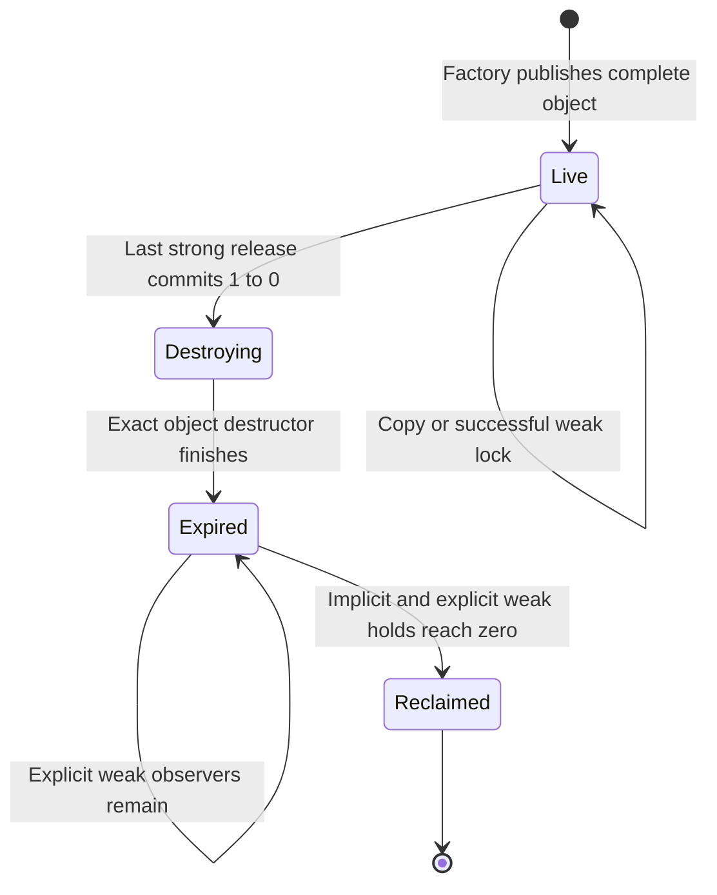

# Smart pointer architecture

Status: Proposed implementation contract, reviewed against HEAD `1e6bd1a` on
2026-10-06. The existing unique owner, allocation domain and shared string are
implemented. The repairs, domain object factories and general shared/weak owners
specified here are future work. No performance results accompany this design.

Use **unique ownership by default, atomic shared ownership for independent
overlapping lifetimes, and explicit handles and leases for managed objects**.
Keep the ownership implementation small enough to audit: one unique-owner
template, one shared controller, one weak-promotion algorithm, and creator-owned
destruction. Optimize ownership traffic before optimizing reference counting.

This design follows [AGENTS.md](../../AGENTS.md),
[ADR 0003](../decisions/0003-standard-library-usage-policy.md), the
[memory architecture](memory-management.md),
[handle architecture](object-handles-uuid.md), and
[resource architecture](resource-management.md).
The [reference review](smart-pointers-reference-review.md) preserves the initial
design and the changes made after reading the relevant Gems chapters.

## Current implementation and immediate repairs

| Inspected source | Finding and consequence |
| --- | --- |
| [pointer.hpp](../../modules/foundation/base/include/ludus/foundation/base/pointer.hpp) | Same-type and converting move assignment overwrite the destination without deletion. Move construction and assignment do not move the deleter; swap exchanges only pointers. Fix ownership correctness before allocator migration. |
| `Deleter` in that header | The requirement exercises `DefaultDeleter` rather than the supplied deleter against the actual element pointer. Validate `D&` called with `T*`, plus the nothrow operations each overload performs. |
| Public `foundation::UniquePtr` alias | Exposes only `T`; extend it to `T, D = core::DefaultDeleter<T>` while retaining the canonical implementation and existing `core::UniquePtr` spelling. |
| [Base CMake](../../modules/foundation/base/CMakeLists.txt) | Exports `pointer.hpp`; its test source list contains no dedicated pointer tests. Add focused ownership and compile-constraint coverage in the repair slice. |
| [AllocationDomain](../../modules/foundation/memory/include/ludus/foundation/memory/allocation_domain.hpp) | Already supplies immutable domain identity, fallible allocation and original-layout free. Object factories can use it without placing Memory below Base. |
| [SharedString](../../modules/foundation/strings/src/shared_string.cpp) | Already uses an immutable block, domain attribution, `uint64` atomic count and saturation pinning. Preserve its API and semantics; its private count helpers do not establish weak-promotion safety. |
| [Wayland owners](../../modules/platform/include/ludus/platform/wayland/window.h), [Cocoa window factory](../../modules/platform/src/window_cocoa.mm), [Audio facade](../../modules/audio/src/facade.cpp) | Native deleter specializations and raw ownership transfers already exist. Preserve creator-specific destruction and audit the receiving protocol before changing factories. |

The older memory audit is historical; its ownership defects still apply to this
header. Modern platform, world, audio and runtime targets now exist. Their own
source and evidence determine implementation status.

## Choosing a reference

| Need | Representation | Lifetime rule |
| --- | --- | --- |
| One object owner, PIMPL, service or private node | `UniquePtr<T, D>` | Move ownership; destruction follows that owner. |
| Required synchronous access | `T&` or `const T&` | Caller retains the owner/protected phase through the call. |
| Optional synchronous access | `T*` or `const T*` | Nullable borrow; never independently extends lifetime. |
| Independently retained immutable CPU object | Proposed `SharedPtr<const T>` | Each retained owner holds the same fixed object until release. |
| Observer of a shared CPU object, callback back edge | Proposed `WeakPtr<T>` | `Lock()` obtains a temporary shared hold or returns empty. |
| World/entity/component reference across mutations | Typed owner/slot/generation handle | Explicit owner validation and a protected borrow; copying a handle adds no ownership. |
| Resource identity across eviction/reload | Typed asset handle | Identifies the logical record; does not imply residency. |
| Resource data used by work in flight | Resource/version lease | Pins one exact resident version and its required dependencies. |
| Native refcounted or API-managed object | Private creator-specific RAII adapter | Uses the native retain/release/destroy contract. |

Keep ownership at service boundaries and outer loops. A synchronous function
that only reads an object accepts `const T&`, not a shared owner. A function
that retains an object accepts an owner by value and moves it into storage.
Resolve a handle or lock a weak reference once per protected batch, then use a
borrow inside that batch. A required reference has no separate non-null pointer
class; ordinary references express that contract.

Thanks to Brian Hawkins, *Game Programming Gems 3*, §1.5, pp. 44-48,
"Handle-Based Smart Pointers": his distinction between a designated lifetime
owner and independent sharing informs this table. Ludus uses explicit resolution
and phase protection rather than an unchecked cached pointer; see the
[chapter review](smart-pointers-reference-review.md#handle-based-smart-pointers).

## Module and include boundaries

Retain `UniquePtr<T, D>` in the opt-in Base `pointer.hpp`. It depends only on
foundational vocabulary and lightweight type/utility facilities, never Memory,
Logging, containers or private implementation headers. Do not add owners to
`core.h`, a foundational header, or the PCH.

Place domain object factories and `DomainDeleter<T>` in proposed
`foundation/memory/owned_object.hpp`. Place proposed `SharedPtr<T>` and
`WeakPtr<T>` together in `foundation/memory/shared_ptr.hpp` in FoundationMemory.
There is no new ownership module or dependency cycle.

Public shared wrappers hold a typed view and a forward-declared controller.
Publish only the small support declarations required by those templates, with
Doxygen contracts and literal CMake public file-set entries. Keep controller
layout, counters, allocation arithmetic, synchronization and diagnostics in
`.cpp`/private headers. Per-type construction/destruction thunks are unavoidable
small template code; erase to common operations immediately. Public templates
never include `src/internal/`, heavy STL facilities or `<atomic>` just to expose
the controller layout.

Independent header compilation, PCH-disabled installed consumers and the
[header parse budget](../development/build-profiling.md) gate these headers.
Out-of-line count calls trade some call overhead for one auditable algorithm and
smaller headers; measure that tradeoff before selectively inlining.

## Unique owner contract

`UniquePtr<T, D>` owns one `T*` paired with its deleter. Both are the ownership
state. Use `[[no_unique_address]]` for empty value deleters. Support value
deleters initially; reference deleters, fancy pointer typedefs and array
specializations are excluded. Reject array element types at compile time; arrays
and byte buffers use existing containers.

Every destruction, move and swap operation is `noexcept`. A deleter must be
nothrow callable as `D&(T*)` and nothrow destructible. Constructors, assignment
and swap are individually constrained on the corresponding nothrow default,
move, conversion or swap operations. A non-default-constructible deleter can be
used with an explicit deleter constructor; it need not enable a default owner.
Do not evaluate an unrelated default-deleter expression as a substitute for
checking `D`.

| Operation | Required behavior |
| --- | --- |
| Existing raw-lvalue constructor | Adopt the pointer and null the source, retaining compatibility. Adoption requires a uniquely owned pointer from the deleter's matching protocol. |
| Explicit pointer/deleter adoption | Transfer a uniquely owned pointer together with a nothrow value deleter. No implicit conversion from a raw pointer. |
| Move construction | Move the deleter and pointer; leave the source pointer null. Never invoke a moved-from deleter for an empty owner. |
| Move assignment | Self-move is unchanged. Stage the complete source pointer/deleter pair first, making the source empty; destroy the old destination using its old deleter, then install the staged pair. Never read the source after old-destination destruction. |
| Destruction and `Reset()` | Detach to empty before invoking the deleter; call it only for non-null storage. Empty destruction is a no-op. |
| `Reset(p)` | `p == Get()` is unchanged. Otherwise destroy the old object and adopt `p` with the existing deleter. This low-level adoption requires the matching allocation protocol; domain factories never use it to replace a domain. |
| `Swap` | Exchange pointer and deleter as a pair with nothrow operations. |
| `Get`, `operator*`, `operator->` | Borrow only. Dereference requires non-null ownership; development assertions assist diagnosis but do not validate dangling external pointers. |
| `GetDeleter()` | Read-only inspection of the destruction protocol. Do not expose mutable state that can silently rebind a live allocation's domain. |
| `Release()` | Retain the existing bare-pointer escape for audited stateless members of the default-deleter family, including existing native specializations. Receiver must honor that exact destruction protocol. Disable bare release for stateful deleters; transfer the whole owner instead. |

Callbacks may release other owners. They must not access or mutate the owner
whose destruction/reset/assignment is currently executing. Do not run owner
destruction while holding a registry or publication mutex: move the old owner
out under the lock and release it after unlocking.

Staging matters for `root = Move(root->Child)`: the source owner can be a member
of the old destination object. Pointer and deleter must already be secured before
that object destroys the source member. Apply the same rule to converting moves;
source extraction does not perform allocation or reference counting.

### Conversions and incomplete types

Allow ordinary-new `UniquePtr<Derived>` to `UniquePtr<Base>` only for accessible,
unambiguous pointer conversion and a virtual Base destructor with the audited
ordinary-delete protocol. Do not infer compatibility of specialized native
deleters from a type relationship. An explicit custom-deleter conversion must
provide a nothrow adapter preserving the destruction protocol. Remove the
reinterpret-cast self-comparison in converting assignment; distinct constrained
owner specializations do not require that check.

The initial `DomainDeleter<T>` supports exact `T` and adding const qualification,
not arbitrary Derived-to-Base ownership conversion. Inheritance can adjust the
view address, and a Base destructor cannot reconstruct the original domain
allocation layout. A later explicit polymorphic adapter, justified by a consumer,
must retain original address, exact dynamic destruction thunk and domain. Never
guess allocation size from the base view.

PIMPL declarations may name incomplete `T`; default deletion requires complete
`T` at the point deletion is instantiated. Define owner destructors and any
deleting special members after the implementation type is complete, typically
out of line. Enforce completeness in the ordinary default deleter, with an
actionable diagnostic; native specialized deleters can deliberately support
incomplete external types.

## Fallible construction and domain lifetime

Factories are `[[nodiscard]]` and `noexcept`. Use a small proposed
`OwnershipStatus` with `Ok`, `InvalidState`, `TooLarge`, and `OutOfMemory`.
`TryCreateOwned<T>(domain, output, args...)` writes the existing unique template
with `DomainDeleter<T>`; `TryMakeShared<T>(domain, output, args...)` writes the
proposed shared owner. Both return a status. These contracts refine the memory
design's object-factory sketch; byte allocation and existing APIs retain their behavior.

Owning outputs must be empty on entry. A nonempty output returns `InvalidState`
and is preserved. All failures preserve output and acquire no ownership. Validate
layout with checked `usize` arithmetic before allocation, request exact size and
power-of-two alignment, and free through the original domain. A domain deleter
for an exact type stores one domain pointer; its thunk knows `sizeof(T)` and
`alignof(T)`.

Require nothrow construction for the forwarded arguments and nothrow destruction.
Allocate before forwarding arguments; allocation failure does not consume move
arguments. This does not make arbitrary constructor work recoverable: an object
with fallible setup uses a nothrow inert constructor and an explicit status
operation. Its factory owns a private candidate, rolls it back on setup failure,
and publishes only a complete result. Partial candidates never reach weak users.

A domain, its callback context, and all destruction code outlive every owner.
For shared ownership that includes weak observers: a destroyed object may leave
a live controller allocated through the domain. A resettable arena is unsuitable
unless every strong/weak controller is drained before reset. The system domain's
process lifetime is the safe default; a level-local domain requires a proved
lifetime boundary. No global allocation overrides or hidden per-type pools.

## Shared object and controller

The first shared facility supports objects, const qualification and safe upcasts.
It has no public raw-pointer constructor or raw-pointer reset. Copy an existing
owner to share ownership; never create another controller from `Get()` or `this`.
Factories are the only initial source of a controller. Unique-to-shared promotion,
external adoption, arbitrary aliasing, array ownership and shared-from-this are
later consumer-driven features with their own failure/ownership tests.

Reject array types at compile time in the initial shared wrappers and factories.

Each shared or weak value holds two fields: the typed view pointer and the
controller pointer. Upcasting changes the view while retaining the same exact
destruction thunk and allocation metadata. The controller has no virtual API or
RTTI requirement. It owns:

- A `uint64` atomic strong count and a `uint64` atomic weak count.
- The original object address and its nothrow destruction thunk.
- The original domain, backing allocation address, byte count and alignment.
- Allocation-mode metadata needed to free combined or explicitly split storage.

Controller-address equality means common ownership while the comparing values
hold it alive. `Get()` address equality is view equality. Neither is persistent
identity or a serializable key. Counts are diagnostic snapshots, never a lock,
an exclusive-mutation proof, or permission to unload a module.

Weak values expose `Lock()`, `IsExpired()`, reset and copy/move operations, but
no `Get`, dereference or arrow operator. `IsExpired()` is a snapshot; use the
returned owner from `Lock()` for access, never a check followed by raw access.
A weak value cannot follow a replacement object or become live again.

Copy assignment acquires the incoming strong or weak hold before releasing the
old one. Move assignment stages both source fields before disposing of the old
destination; self-move is unchanged. Reset and destruction detach both fields
before release. Moves and swaps transfer view and controller together without a
retain; no operation pairs a view with another object's controller. As with unique
owners, destruction callbacks cannot mutate the owner operation in progress.

Converting a live shared owner into a weak Base view computes pointer adjustment
while the strong owner protects the object. Exclude cross-type Derived-to-Base
weak conversion from an already expired weak value: a virtual-base adjustment
can read dead object memory. Same-type copies and safe cv additions need no
object access. `Lock()` returns the stored view only after acquiring a strong
hold and performs no fresh pointer adjustment on expired storage.

### Controller state and reclamation

Initialize `Strong = 1`, `Weak = 1`. The weak count equals explicit weak owners
plus **one implicit hold for the entire strong lifetime and final destruction**.
It is not one weak count per strong owner.

Once the final strong decrement commits zero, promotion fails permanently.
The final releaser destroys the exact object, then releases the implicit weak
hold. The last weak releaser frees the controller/backing storage. The implicit
hold protects the controller if the object destructor releases its own weak
members or other weak owners. User destruction runs outside internal locks.
Saturation, described below, is a permanent pinned state outside this normal
reclamation path.

| Count operation | Initial algorithm and ordering |
| --- | --- |
| Copy a live shared owner | Checked CAS increment with relaxed success/failure; an existing protected source owner proves the strong count cannot be zero. |
| Copy/create a weak owner | Checked CAS increment with relaxed success/failure; a source weak or live strong owner protects the controller. |
| Weak `Lock()` | CAS loop increments only a nonzero strong count; acquire on success, relaxed on failure. Zero returns empty. The successful CAS is the promotion linearization point. |
| Release strong | Checked CAS decrement with release success, relaxed failure. On `1 -> 0`, perform an acquire fence before object destruction, then release the implicit weak hold. |
| Release weak | Checked CAS decrement with release success, relaxed failure. On `1 -> 0`, perform an acquire fence before freeing storage. |

Publication must independently establish a happens-before relation for initialized
object state. A count acquire does not authorize racing payload writes. These
orders use the existing shared-string release/fence pattern, extended with
zero-rejecting promotion and controller lifetime; test that complete protocol
rather than blindly reusing the current strong-only helper.

At `uint64` maximum, retain pins the relevant count permanently instead of
wrapping. Only the transition into saturation emits one bounded Base diagnostic
after the atomic operation. Strong saturation pins object and implicit weak hold;
weak saturation pins metadata/storage but does not revive an expired object.
`Lock()` of a strongly pinned object succeeds after an acquire observation of
the pinned count without incrementing it; zero still always returns empty.
Both decrement paths use CAS so a concurrent saturation cannot be undone by an
unchecked `fetch_sub`. Pinning sacrifices reclamation under an extreme ownership
failure to prevent premature destruction; it is observable and covered by
reduced-width internal tests. Ordinary factory OOM still returns a status.

Use standard atomics without claiming lock freedom on every target. In particular,
64-bit counts on the browser toolchain need build/runtime validation and can have
different cost from native counts. Never replace atomics with `volatile` or
change layouts/counter policy based on a consumer's `NDEBUG`.

The familiar ownership and atomic weak-promotion semantics follow the ISO C++
working draft's [shared owner](https://eel.is/c++draft/util.smartptr.shared) and
[weak observers](https://eel.is/c++draft/util.smartptr.weak.obs) contracts.
Ludus deliberately narrows the API and adds explicit factory failure and domain
lifetime. This C++23 implementation requires no newer library ownership API.

## Allocation placement and retained bytes

`TryMakeShared` uses one combined controller/object allocation by default.
Private layout code computes a checked aligned object offset and total size;
alignment is sufficient for both controller and `T`, including over-aligned
types. The typed thunk destroys `T`; it never calls ordinary `delete` on domain
storage. The controller later frees the original combined base and layout.

Final strong release destroys `T` and its owned buffers immediately, but weak
observers retain the combined allocation, including the now-dead inline object
storage. Large inline objects can therefore make coallocation expensive.
Report object-live bytes and bytes retained by weak controllers separately in
opt-in diagnostics and the [memory profiling model](memory-profiling.md).

Add explicitly named `TryMakeSharedSplit` only when a measured consumer has large
inline payloads and long-lived weak references. It allocates object and controller
separately through the original domain. Failure of either allocation frees the
other, constructs no published object and preserves output. Final strong release
destroys and frees object storage; last weak release frees only the controller.
Two allocations and worse locality are the explicit price. A weak reference
never keeps a file, GPU object or audio payload usable after final strong release.

No generic controller pool, per-thread cache, pointer tagging, compressed pointer,
cache-line padding or reference-count batching is part of the baseline. Measure
contention and retained memory before choosing one. Compact native objects and
browser pointer widths have different layout tradeoffs.

## Publication, threads and physical retirement

Atomic counts allow different owner values to share one controller concurrently.
They do not permit concurrent reset/read of the same pointer variable, synchronize
mutable `T`, or keep a pointer obtained from an unprotected variable alive.
Transfer an owner through the existing synchronized job/queue protocol or protect
publication with a mutex. Under a mutex, copy the current owner into a local;
unlock before using or destroying it. On replacement, swap the old owner out
under the mutex and release it afterward. Start with this explicit mechanism;
an atomic-owner abstraction requires a measured publication bottleneck and a
separate reclamation proof.

Prefer immutable CPU snapshots. Const access alone is not sufficient if another
alias writes the object; immutability covers all aliases and transitively read
state. Counts protect lifetime, while the subsystem controls mutation authority.
Never expose a count-equals-one mutation API.

Generic final release executes the destructor synchronously on the releasing
thread. That is unsuitable for windows, renderer/device state, audio callback
objects and many plugin objects. Keep those in their owning subsystem with typed
handles/leases, acknowledged work completion and explicit retirement. A wrapper
around native refcounts must not invent a competing ownership counter.

A future deferred-destruction adapter must reserve retirement storage before
publication, make promotion fail when strong ownership ends, and retain the
controller/domain/module through queued destruction. Queue-full or shutdown must
never free on the wrong thread or block a realtime callback. This adapter is
excluded from the initial shared facility; ordinary `SharedPtr` makes no promise
about GPU fences, audio acknowledgments or destruction time budgets.

The existing static SDK uses one matching compiler/runtime/policy. C++ owner
templates are not a stable plugin ABI. Across the existing game-module boundary,
exchange its documented handles/byte views and creator-owned callbacks. A module
cannot unload while any destructor, deleter, control thunk, native handle or
retirement job still needs its code, including expired weak controllers whose
free path uses module code. Host-owned state and unload barriers belong to the
[module lifecycle](module-lifecycle.md) and [live-reload](project-live-reload.md)
contracts.

## Handles, reload and cycles

Thanks to Scott Bilas, *Game Programming Gems 1*, §1.6, pp. 68-79,
"A Generic Handle-Based Resource Manager": typed handles and small owner-managed
registries inform the existing handle architecture. Keep release validation,
owner scope and nonwrapping generations there; do not duplicate a handle registry
inside smart pointers. A generation check must run under the owner's protected
phase or synchronization: checking validity and then racing deletion is unsafe.
A borrow cannot outlive relocation, structural mutation or retirement protection.

Thanks to Noel Llopis, *Game Programming Gems 4*, §1.7, pp. 61-68,
"The Beauty of Weak References and Null Objects": separating a stable reference
from replaceable payload informs the resource boundary. In Ludus `WeakPtr` means
non-owning observation of one fixed shared lifetime; the article's indirection
holder corresponds to logical resource identity instead. Never make a generic
shared/weak owner silently redirect to a reloaded allocation.

Reload publishes a new resident version at a controlled boundary. Existing
leases keep the old version and dependency closure until their readers and
submitted work retire. Later acquisitions choose the new version. Eviction
removes residency, not logical asset identity. Optional presentation fallbacks
are immutable, type-correct and explicitly selected by resource policy; required
gameplay links fail visibly. A weak lock failure never manufactures a fallback.

Thanks to James Boer, *Game Programming Gems 1*, §1.7, pp. 80-87,
"Resource and Memory Management": its distinction between resource access and
eviction-protecting locks informs leases. Reserve peak bytes before preparing a
replacement; charge old storage until physical retirement. A smart-pointer count
alone establishes neither budget admission nor GPU/audio completion.

Ownership forms trees or DAGs. Use weak back edges for shared CPU graphs and
typed non-owning handles for world graphs. Explicitly unregister callbacks during
shutdown; a weak capture prevents retention but does not acknowledge cancellation
or undo an already-running callback. A job that needs a shared snapshot captures
one strong owner for the job, not one retain per element. Do not infer world
logical liveness from a still-allocated CPU object.

## Debugging and performance acceptance

Preserve straightforward named fields and supply LLDB summaries and Windows
Natvis when those debugger/platform workflows are validated. Views show the typed
address, original address, deleter/domain, controller, strong count, weak count
including its implicit hold, expired/pinned state and combined/split mode. A zero
strong count does not prove that final destruction has released the implicit weak
hold yet. Debuggers must not dereference expired object storage or execute
`Lock()` just to render a summary. Counts
read while the process is stopped are snapshots.

Optional bounded side records retain allocation ID, creation site and semantic
owner label. Reuse Memory attribution instead of registering every pointer copy
in a global map. Report live objects, expired controllers, weak-retained bytes
and saturation independently. Tracking failure degrades observation only; count
operations do not allocate or call normal Logging. Per-edge cycle diagnostics,
if later required by editor consumers, use opt-in bounded recording, not a new
collector in the core pointer path. Initial debugging relies on ownership rules,
labels, lifecycle tests and sanitizers rather than claiming automatic cycle
detection.

| Performance contract | Acceptance measurement |
| --- | --- |
| Empty/default unique owner adds no allocation or refcount | Default-deleter layout target is `sizeof(T*)`; validate each supported ABI. Exact-domain owner target is two pointer words. Stateful deleters can be larger. |
| Shared/weak view is compact | Target two pointer words on native and browser ABIs; measure the separate controller, alignment padding and allocator overhead. No fixed controller-byte promise. |
| Move and borrow avoid reference traffic | Count atomic calls in representative batching/jobs; shared copy adds one strong retain, weak promotion adds one strong retain, move adds none. |
| Default shared construction has one backing allocation | Failure-injecting domain verifies allocation count and exact matching layout, including over-aligned objects. |
| Weak lifetimes do not hide memory costs | Compare combined/split layouts across inline object sizes and weak retention durations; track live versus retained bytes. |
| Shared counting remains affordable | Compare uncontended and contended copy/release/lock with native `std::shared_ptr` in benchmark-only code, plus actual immutable snapshot/job workloads. |

Measure optimized builds with pinned native Clang 18 and the separately pinned
web toolchain, on available x86-64/ARM64 hardware. Record compiler, standard
library, architecture, allocator, thread count, working-set size, latency
distribution, allocations, retained bytes, executable size and header parse cost.
Force observable work and verify destruction counts so copy elision or optimizer
removal cannot manufacture a result. Keep allocator cost separate from count
cost. Sanitizers establish correctness, not performance. Set consumer budgets
before selecting an optimization; there is no universal fastest pointer family.

## Delivery slices and validation

1. **Unique correctness:** repair leaks/state transfer, validate supplied deleters,
   preserve native specialization behavior and expose the defaulted deleter alias.
   Add destruction-count, empty, self-move, self-reset, occupied assignment,
   nested-member extraction, stateful-domain swap and incomplete-type PIMPL tests.
   Negative compilation covers throwing/mismatched deleters and unsafe ownership conversions.
2. **Domain object ownership:** add exact-type factories and deleters, with OOM,
   output-preservation, unconsumed arguments on allocation failure, alignment and
   partial-initialization rollback tests. Migrate one consumer's creation and
   destruction together; leave existing new/delete pairs intact elsewhere.
3. **Shared and weak consumer:** implement one private controller and narrow
   wrappers only when an actual independent-lifetime CPU consumer needs them.
   Test exact destruction through adjusted/virtual base views, self/copy/move
   assignment, last weak released inside the object destructor, nested release,
   domain lifetime, failed construction allocation and forbidden raw adoption.
4. **Concurrent proof and observability:** use barriers to race weak promotion
   against final release, verify that every successful lock protects a fully
   published live object, and that destruction/free happen exactly once. Test
   stale weak references across address reuse and reduced-width saturation races.
   Run TSan separately from ASan/UBSan. Add debugger views and benchmark evidence
   before broader migration.
5. **Measured extensions:** split allocation, a native intrusive adapter, local
   ownership or atomic publication each requires a named consumer, demonstrated
   budget problem, focused review and independent validation. No engine-wide
   rewrite is required to finish an earlier slice.

Every implementation slice follows the repository's warning-clean build, unit,
ASan/UBSan, format/tidy, SDK/header and documentation gates with pinned tools.
Native concurrency acceptance and serial browser correctness are distinct;
browser builds do not imply browser multithreading support. New public contracts
receive Doxygen in the same implementation change, and API coverage debt cannot
be expanded to bypass documentation.

## Alternatives and extension decisions

| Alternative | Decision |
| --- | --- |
| Standard `std::unique_ptr` / `std::shared_ptr` everywhere | Familiar reference semantics inform this design. Ludus already owns its unique API and needs explicit nonthrowing shared-factory/domain behavior; normal shared construction can report failure with exceptions. Do not introduce a second production ownership family. |
| Intrusive pointer everywhere | Saves a view word/control allocation for suitable objects, but embeds ownership into `T` and weak references need separately surviving metadata. Use private adapters for existing native refcounts; add a general family only for a measured strong-only consumer. |
| Local and atomic shared policies from the start | One atomic mode limits API combinations and transfer mistakes. A later distinctly named local type must enforce confinement and explicit promotion; never switch modes under the same type through a build macro. |
| Automatic cycle collection / tracing GC | Excluded from generic CPU ownership. A scripting runtime's collector owns its own graph and uses explicit engine handles at the boundary. |
| Hazard pointers, epochs or RCU for all owners | Potential tools for a specialized concurrent registry with a reclamation protocol. They do not replace move-only ownership, world phase barriers or device completion. Excluded from the baseline. |
| Shared-from-this, generic aliasing, owner casts, policy combinators | Add only demonstrated operations. Upcasting preserves exact destruction; unchecked downcasting and constructing owners from `this` remain forbidden. |

Thanks to Greg Colvin, Beman Dawes, Peter Dimov and Glen Fernandes,
[Boost.SmartPtr](https://www.boost.org/doc/libs/latest/libs/smart_ptr/doc/html/smart_ptr.html),
for the separation of shared, weak, intrusive and local ownership and the warning
that reference counting is separate from payload synchronization. Thanks to
[Epic Games' smart pointer documentation](https://dev.epicgames.com/documentation/unreal-engine/smart-pointers-in-unreal-engine?lang=en-US)
for the engine example of unique/shared/weak roles and optional thread modes.
Ludus's narrower single-mode choice and extension gates are engineering judgments;
neither reference establishes a Ludus benchmark result.
