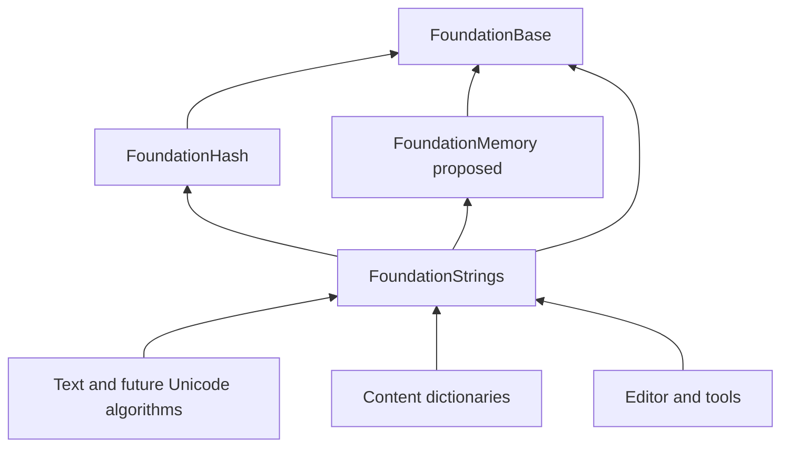

# Ludus Strings Architecture

**Status:** Initial foundation implemented; remaining pipeline and performance
work is proposed. See [implementation status](#implementation-status) for the
exact shipped scope, validation and limitations.

**Audience:** Engine, tools, content pipeline, and SDK contributors.

**Evidence baseline:** Repository inspection at `52e29ce` on 2026-10-04, with
concurrent uncommitted work present. The initial design and companion [Gems review](strings-gems-review.md) preceded
implementation. Foundation code was then based on `8d78552`.

Ludus should separate borrowed text, mutable owned text, immutable shared text,
and interned identifiers. This gives each type one understandable ownership and
cost model. Use UTF-8 at text boundaries, explicit allocation failure, and
collision-safe identity. Optimize representative workloads before committing to
object layouts, SIMD paths, or concurrent intern-table algorithms.

This proposal follows [AGENTS.md](../../AGENTS.md), the [steering rules](../../.kiro/steering/coding-standards.md),
[ADR 0003](../decisions/0003-standard-library-usage-policy.md), the
[foundational include boundary](foundational-headers.md), the current
[container API](containers.md), and the
proposed [memory architecture](memory-management.md). Source code takes
precedence over older design documents when establishing what exists today.

The recommendations below are engineering judgments informed by source review.
The design pass had no string benchmarks. The implementation adds an opt-in
corpus benchmark; neither a universal fastest algorithm nor a measured engine
speedup is claimed. The [literature review](strings-gems-review.md)
records the baseline decisions, subsequent chapter findings, and resulting
changes without treating a table of contents as evidence of chapter contents.

## Reading order

- [Remaining initial implementation](#remaining-initial-implementation) and
  [research after the initial architecture](#research-after-the-initial-architecture)
  define the next delivery and subsequent improvement pass.
- [String types and selection](#string-types-and-selection) defines what callers use.
- [Ownership and failure](#ownership-and-failure), [Mutable string storage](#mutable-string-storage),
  and [Shared immutable storage](#shared-immutable-storage) define implementation contracts.
- [Interned names and indexed strings](#interned-names-and-indexed-strings),
  [Hashing](#hashing), and [Cooked dictionaries and persistence](#cooked-dictionaries-and-persistence)
  define identity and content integration.
- [Public API shape](#public-api-shape), [Debugging and observation](#debugging-and-observation),
  and [Validation and performance gates](#validation-and-performance-gates) define the handoff.

## Decisions

1. Keep `std::string_view` as the borrowed API vocabulary. A second view class
   with identical semantics would add migration work without improving safety.
2. Introduce a unique, mutable `String` with small inline storage and an explicit
   allocation domain. Copying bytes is an explicit fallible operation; moving
   transfers ownership.
3. Introduce `SharedString` for immutable, retained text. Copies share a buffer
   through reference counting. Editing creates a `String` explicitly.
4. Introduce `StaticString<Capacity>` for bounded text without allocation and
   `StringBuilder` for repeated construction into reusable owned storage.
5. Use `NameId` for interned engine names and `StringIndex` for indices whose
   table is already known. Both resolve through an explicit table owner.
6. Separate table hashing, persisted fingerprints, and cryptographic digests.
   A hash match is a candidate match; compare lengths and bytes for equality.
7. Keep byte storage, Unicode text algorithms, paths, and localization in
   separate layers. Normalization and case folding never happen implicitly.
8. Start with ordinary synchronization for mutable tables and immutable frozen
   tables for parallel reads. Add more concurrency only after measurements.

## Baseline before implementation

At the initial design pass, the Foundation tree had Base, Containers, Logging,
Profiling and Math, without Strings, Hash or a Memory implementation. The
allocation boundary was a prerequisite for allocating owners. The
[implementation status](#implementation-status) below now records the shipped
Memory seam, Hash and Strings modules. Use the [wiki strings guide](../wiki/guides/strings.md)
and actual public headers for current API usage; the layout and declarations
below remain design sketches.

[`content.h`](../../modules/content/include/ludus/content/content.h) already has
bounded `Text<N>`, `ResourceId`, `ResourcePath`, a byte owner, and a 32-byte
`Digest`. [`hash.cpp`](../../modules/content/src/hash.cpp) implements SHA-256.
[`catalog.cpp`](../../modules/content/src/catalog.cpp) validates resource IDs
using a restricted ASCII grammar and validates paths as UTF-8. These content
contracts should remain stable during migration.

Logging categories and profiling sites already use compile-time FNV-1a 32-bit
values with borrowed spellings in
[`category.hpp`](../../modules/foundation/logging/include/ludus/foundation/logging/category.hpp)
and [`zone.hpp`](../../modules/foundation/profiling/include/ludus/foundation/profiling/zone.hpp).
Their migration requires a separate compatibility decision. Do not change
existing IDs as an incidental part of adding string storage.

[`font_system.h`](../../modules/text/include/ludus/text/font_system.h) accepts
UTF-8 views. Shaping remains in Text; storing strings does not implement
grapheme segmentation, bidi, shaping, or localization.

## String types and selection

| Type | Ownership and copy behavior | Intended use |
| --- | --- | --- |
| `std::string_view` | Borrowed pointer and byte count; copying retains nothing | Synchronous parameters and slices under a proven owner |
| `String` | Unique mutable contiguous bytes; explicit deep copy | Paths under construction, tool edits, conversion output |
| `StaticString<Capacity>` | Inline mutable bytes; bounded copy | Known bounded labels and stack scratch |
| `StringBuilder` | Reuses a unique `String` buffer; move-only | Formatting, concatenation, export records |
| `SharedString` | Immutable owned buffer; copies retain the same block | Text retained by jobs, UI models, metadata snapshots |
| `SharedStringSlice` | Optional owner plus slice range | A demonstrated asynchronous slice consumer |
| `NameId` | Table identity and entry index; no per-name retain | Repeated engine identifiers |
| `StringIndex` | Entry index with an externally known table owner | Dense cooked records and table-local data |
| `Utf8View` | Validated borrowed UTF-8 proof; no ownership | Text algorithms at a validated boundary |
| Future `TextKey` | Localization identity, separate from resolved bytes | User-facing localized text |

The core vocabulary is the existing borrowed view plus `String`,
`StaticString`, `StringBuilder`, `SharedString`, `NameId`, and `StringIndex`.
Implement it in phases, with each allocating type gated by a concrete consumer.
`SharedStringSlice` is optional;
retaining a large document for one tiny slice can consume more memory than
copying the slice. `TextKey` belongs to a future localization layer.

`NameId` is an identifier, not a general text container. A user display name,
chat message, localized sentence, filesystem path, asset identity, and engine
symbol have different semantics even when all are spelled with bytes. Use
subsystem types such as the existing `ResourceId` to preserve those distinctions.

[Unreal's string guidance](https://dev.epicgames.com/documentation/en-us/unreal-engine/string-handling-in-unreal-engine)
also separates mutable strings, indexed names, and localized text. That supports
the separation of responsibilities; Ludus's exact types, case policy, and scoped
tables are decisions made here rather than copies of Unreal's implementation.

### Costs callers can rely on

| Operation | Allocation and work |
| --- | --- |
| Copy a view or `NameId` | No allocation; constant-sized value copy |
| Move a heap-backed `String` | No allocation; transfers pointer and domain |
| Move an inline `String` | No allocation; copies at most its bounded inline bytes |
| Clone a `String` | Copies all bytes; may allocate; returns status |
| Copy a nonempty `SharedString` | No allocation; one retain protocol on its block |
| Compare two interned IDs from the same table | Integer comparison; no byte scan |
| Intern a view | Hash and possible byte comparisons; a new entry may allocate |
| Resolve an ID | Constant indexed access after owner validation; mutable mode locks |
| Compare arbitrary text | Exact length and byte comparison, worst case linear |

Repeated per-frame work should consume a cached `NameId`, typed resource handle,
or pre-resolved index. Interning or resolving a literal inside a hot loop defeats
the purpose. Refcount traffic also has a cost: retain a snapshot once per batch
and borrow its strings within the batch when ownership permits it.

## Bytes and Unicode

`String`, `SharedString`, and borrowed views store counted `char` bytes.
Lengths and offsets use `usize` and count bytes. Owning strings have one extra
trailing zero outside their logical size. Embedded zeros are preserved by all
counted operations. C-string and OS boundaries reject embedded zeros when their
APIs cannot represent them.

Byte owners can preserve malformed input for diagnostics. An explicit UTF-8
validator produces `Utf8View` or reports a byte offset and status. A validated
view still borrows its input; mutation invalidates the proof. Unicode decoding,
normalization, case folding, grapheme boundaries, and localized comparison are
opt-in algorithms above byte ownership. A byte substring may split a code point;
only checked text-slicing APIs promise valid UTF-8 output.

Exact byte equality is the default. Engine symbols should use a documented
case-sensitive grammar. Filesystem path rules and localized search rules belong
to their respective modules. Do not silently lowercase or normalize interned
names.

[Unicode normalization](https://unicode.org/reports/tr15/) defines canonical
and compatibility equivalence, while
[Unicode segmentation](https://unicode.org/reports/tr29/) defines grapheme,
word, and sentence boundaries. Those are different operations. For example,
UTF-8 `é` and `e` followed by a combining acute accent have different bytes but
can be canonically equivalent. Neither byte counts nor code-point counts define
caret positions or displayed widths.

`Utf8View` construction rejects overlong encodings, surrogate values, truncated
sequences, invalid continuation bytes, and values above U+10FFFF. Embedded
U+0000 is valid UTF-8; a particular symbol or OS boundary may reject it. Strict
validation never repairs input silently. A separate display-repair operation
can replace malformed input and report the replacement count. ASCII-specific
utilities have `Ascii` in their names and do not consult the C locale.

UTF-8 validation and transcoding use a portable scalar implementation first.
Evaluate [simdutf's nonallocating APIs](https://github.com/simdutf/simdutf#api)
only if large import/transcode workloads justify an additional private dependency.
Use bounded tails; vectorized code must never read beyond an input range or
depend on an owning string's spare capacity.

Core byte storage uses `char` to interoperate with current Ludus APIs. Explicit
adapters accept C++23 `char8_t` literals without relying on pointer aliasing or
making every caller choose between competing UTF-8 owner types. Native UTF-16
conversion belongs at the OS boundary, with error offsets and checked output
sizes. A future opaque native-path type may preserve OS paths that cannot be
represented by the engine's UTF-8 content grammar; do not change that grammar
to match every native filesystem quirk.

## Module boundaries



These are relevant dependencies, not an exhaustive graph of existing modules.
`FoundationStrings` may privately use `FoundationContainers` after Memory's
allocation seam and required container prerequisites land. Hash accepts bytes
and never depends on Strings. Logging and profiling adapters remain separate
from Strings so intern-table allocation cannot recursively log or profile itself.
FoundationBase diagnostics continue using their existing bounded byte path.

Proposed layout:

```text
modules/foundation/hash/
  include/ludus/foundation/hash/bytes.h
  include/ludus/foundation/hash/symbol_literal.h
  src/hash.cpp
  src/internal/...
modules/foundation/strings/
  include/ludus/foundation/strings/string.h
  include/ludus/foundation/strings/static_string.hpp
  include/ludus/foundation/strings/shared_string.h
  include/ludus/foundation/strings/string_builder.h
  include/ludus/foundation/strings/string_table.h
  include/ludus/foundation/strings/utf8.h
  src/...
  src/internal/...
```

Use `ludus::foundation::strings` for the implementation namespace and selective
Foundation re-exports if consistent with the implementing module's convention.
Public headers include Base first, then explicitly required Ludus declarations,
then lightweight standard headers. Forward-declare the opaque allocation domain
where only its pointer is needed. Keep atomics, mutexes, hash tables, third-party
headers, and any formatting machinery behind `.cpp` boundaries. Fixed-capacity
templates remain small; there is no universal `BasicString<Character, Allocator,
Policy, Encoding>` template.

## Ownership and failure

Allocating operations return a status, carry `[[nodiscard]]`, and are
`noexcept`. On failure they preserve the original logical contents and output
owners. Ordinary infrastructure never invokes a fatal allocation path.
Unrecoverable convenience wrappers, if ever added, must state that policy in
their names and must use the independent Base emergency path.

`String` is move-only initially. `CloneTo(domain, output)` makes deep copying
and its possible failure explicit. Move construction transfers the allocation
domain with the bytes; move assignment frees the destination through its
original domain before taking the source. Explicit clone or assign operations
have distinct policies: `TryAssign` preserves the destination domain, while
`CloneTo` binds the result to its requested domain. A moved-from owner is empty,
terminated, and reusable with a valid domain; self-move leaves it unchanged.
Arena memory must never masquerade as an owned heap string or escape into a
shared control block.

Borrowed views into a mutable owner are invalidated by mutation, move, or
destruction. View getters on temporary owners are deleted. Asynchronous APIs
take an owner or require an enclosing snapshot owner to outlive completion.

`SharedString` has no mutating data access, detachment, or implicit copy-on-write.
Every nonempty value retains a control block that owns its bytes and original
allocation domain. Distinct handles can be read concurrently after proper
publication; modifying or destroying the same handle concurrently requires
external synchronization. Atomic reference counts manage reclamation, not
publication or synchronization of unrelated mutable state.

Failures distinguish at least `OutOfMemory`, `TooLarge`, `CapacityExceeded`,
`InvalidArgument`, `InvalidUtf8`, `EmbeddedZero`, `InvalidHandle`, `WrongTable`,
`Frozen`,
`NotFound`, and `TokenExhausted`. Status storage is small and independent of
the normal logger. A separate optional diagnostic contains the byte offset or
limit; it owns no string. Empty success is distinct from not found and failure.

In signatures below, `Status` means a Strings-local status enum. It is not an
alias of Content's existing status enum. Each subsystem explicitly maps it at
its boundary rather than creating a Foundation-to-Content dependency.

## Mutable string storage

`String` owns either an inline byte array or one individually freeable heap
allocation. Its allocation domain remains explicit even while it is inline.
An empty owner returns a nonnull pointer to a terminating zero. Size and
capacity exclude that zero, and `GetData()[GetSize()]` is always zero.

Use a readable tagged representation. The initial prototype is a 48-byte LP64
object with domain pointer, `usize` size, `usize` capacity, and a 24-byte union
containing either inline bytes or a heap pointer. Inline capacity is 23;
capacity equal to 23 selects inline mode and heap capacities are at least 24.
This avoids stealing bits from pointers or lengths. It is a candidate layout,
not an ABI promise or a measured optimum. Compare it with a 40-byte layout
with 15 inline bytes and a compact 32-byte layout before locking the SDK ABI;
verify actual layouts separately on wasm32 and other supported data models.

Never layer `String` on a public `Array<char>` merely for convenience: that
would expose capacity/terminator invariants and couple two public APIs. Reuse
private allocation and checked growth helpers where appropriate. A private
union must use legal C++ object lifetime operations; do not union-pun or copy
uninitialized padding. Define moves explicitly. Do not opt into bitwise
relocation until every representation has been proved and tested under the
container relocation contract.

For heap growth, start with the existing container family's 2x policy, clamped
by checked required capacity and the configured size limit. `TryEnsureCapacity`
does nothing when capacity is sufficient. `Clear` retains storage. Explicit
`TryShrinkToFit` may return to inline storage and reports allocation failure if
a heap shrink requires new storage. No destructor or read operation allocates.
Small strings require no heap allocation; long strings have one live allocation.

All arithmetic checks addition, multiplication, growth, and the extra zero
before allocation. Enforce both the representable allocation size and a
consumer-specific byte limit. Do not truncate a `usize` into a compact index or
serialized `uint32`. Large documents and resource paths need different limits.

### Aliasing and transactional edits

`TryAssign(s.GetView().substr(...))`, self-append, and appending a slice of the
same string must work. For a growth operation, allocate replacement storage,
read all input while the old allocation remains live, write the zero, then
commit and release the old block. For in-place assign/append, use overlap-safe
copying. This avoids detecting aliases through relational comparison or
subtraction of unrelated pointers. Views into unused capacity are not valid
logical input.

Keep the first mutation API narrow: assign, append, reserve, clear, and checked
byte-range erase. Add replace/insert only for a real consumer and specify
overlap behavior before implementation. A replacement with overlapping source
may require staging or a new buffer; moving a suffix before consuming the source
is unsafe. On allocation or validation failure, bytes, length, and destination
ownership remain unchanged. Capacity is permitted to increase after a successful
reserve; callers must not depend on exact capacity or allocator addresses.

Expose only const byte access initially. A future write reservation must be a
bounded object with an explicit commit length and restored terminator on cancel;
it must not become a permanent mutable pointer escape.

### Bounded strings and construction

`StaticString<Capacity>` reserves `Capacity + 1` bytes inline and tracks a
`usize` byte count. Capacity zero is valid and represents only empty text.
Assign and append reject oversized input without changing the value. A named
display-truncation helper reports truncation explicitly and, when asked for
UTF-8 output, truncates only on code-point boundaries. There is no truncating
assignment operator. These owners are useful when the bound is part of the
domain contract; large inline fields repeated thousands of times waste memory.

`StringBuilder` owns one reusable `String`. It provides reserve, clear,
append-view, append-many, and take-string operations. Append-many checks the
sum of all byte counts before modification and allocates at most once for the
operation. Moving the final string out transfers its domain. Avoid chains of
allocating `operator+`, expression templates, and a separate builder heap.

Formatting is a separate adapter that writes to a builder or caller-provided
bounded span. It erases argument types early, stays exception-free, and reports
invalid format or insufficient capacity. Retain Logging's existing bounded
producer formatting and Base's independent emergency formatter. There is no
new `<format>` include or requirement to link Strings into bootstrap diagnostics.

## Shared immutable storage

`SharedString` is one pointer to a private block in the first implementation.
The empty state uses no allocation. Every nonempty block contains its atomic
retain count, original allocation domain, byte count, and inline trailing byte
storage with a zero terminator. Allocate header and payload in one checked,
correctly aligned operation. Construct the header as a C++ object and calculate
the payload offset explicitly; a compiler-extension flexible array member is
not permitted.

`CreateShared(view, domain, output)` copies once. Subsequent copy construction
or assignment retains the same block; moves transfer the pointer. Assignment
retains its source before releasing its destination, including self-assignment.
There are no weak references, mutable aliases, implicit interning, or hidden
small-string copy mode. Two equal independently created shared strings can have
different blocks: pointer equality is a successful fast path, while pointer
inequality requires byte comparison. `SharedString` equality is text equality,
not storage identity.

`CopyToString(shared, destination)` performs an explicit fallible deep copy into
the destination domain. Initially, converting `String` to `SharedString` also
copies, because unique storage has no control-block prefix. Add a consuming
freeze optimization only if measurements justify storing extra metadata on
every mutable heap string or supporting a second shared block representation.
Never advertise zero-copy freezing when the layouts cannot support it.

The retain count uses a tested nonwrapping protocol. Start with a private
64-bit atomic count, relaxed retain, and release decrement followed by acquire
synchronization on the final-release path. A saturation sentinel pins a block
instead of wrapping and freeing live data; exercise that extremely rare path
with a reduced-width test implementation and report it through bounded emergency
diagnostics after internal synchronization. The corresponding CAS/check cost
belongs in the benchmark. An atomic need not be lock-free on every target; its
correctness does not depend on lock freedom.

Cross-thread publication uses the caller's queue, mutex, or release/acquire
handoff. A retain cannot resurrect a block whose last owner is already gone.
Concurrent copying from a handle while that same handle is destroyed is invalid.
Distinct retained handles may be read and released on different threads; the
original domain/backend must support those frees and outlive all handles.

[Qt's implicit-sharing design](https://doc.qt.io/qt-6/implicit-sharing.html)
demonstrates reference-counted sharing with detachment on mutation. Ludus
chooses immutability instead: mutation-related allocation failure and pointer
invalidation then occur at an explicit conversion boundary. This is a
maintainability and latency decision, not a claim that copy-on-write is always
slower. A separate COW owner can be reconsidered only with a measured consumer
and a defined fallible mutation API.

An optional `SharedStringSlice` owns a `SharedString` plus checked offset and
length. It offers a counted view, with no C-string guarantee at the slice end.
Creating or copying one allocates nothing beyond its original owner; it retains
the whole backing block. Copy tiny retained fragments into independent storage
when that prevents long-lived retention of a much larger source. General ropes
or cords stay out of the core. The
[Abseil Cord API](https://github.com/abseil/abseil-cpp/blob/master/absl/strings/cord.h)
documents the construction and random-access tradeoffs of chunked strings;
an editor text buffer can choose its own piece table or rope when needed.

## Interned names and indexed strings

An explicit `StringTable` owns deduplicated immutable byte storage, an entry
directory, and a lookup index. Lookup checks the full hash, length, and bytes.
All entry bytes remain stable until table destruction. Start with append-only
entries and bulk destruction; do not introduce eviction or reuse of entry slots.

`NameId` contains a 32-bit process-local table token and a 32-bit entry index.
Tokens are never reused in the process; exhaustion is an explicit failure.
Default zero is invalid. Tables provide a distinct valid empty entry. Names from
different tables are different IDs even if their spellings match. Cross-table
text comparison or reinterning must be explicit.

`StringIndex` is a strong 32-bit index used only alongside a known table or
snapshot. It is not globally meaningful. A compact record array holds its table
owner once rather than adding that owner to every entry. Numeric IDs never
become persisted or network identity without a dictionary protocol.

Mutable table operations initially share a mutex. Name resolution returns
stable bytes under a table-lifetime contract. Freezing stops insertion and
publishes an immutable lookup index for concurrent reads. Scoped tables are
owned by worlds, content snapshots, editor documents, or sessions. A small
explicitly owned process symbol table is reserved for finite engine vocabulary.
Unbounded user text must not accumulate in that table.

### Table representation and insertion

Use three private structures: append-only byte pages, a dense entry array, and
an open-addressed lookup array containing entry indices. An entry records its
full lookup hash, byte count, and byte location. Byte pages never relocate while
the table lives. Entry and lookup arrays may grow under the mutex because
callers receive indices and byte views, never pointers into those arrays.
Consequently, rehashing or metadata relocation does not invalidate a spelling.
Oversized permitted entries can own dedicated blocks through the table's domain.

Start with bounded pages, an initial page-size candidate of 32 KiB, a configured
maximum spelling length, maximum entries, and total allocated-byte budget.
Budget includes lookup capacity, entries, page slack, and peak replacement
storage during growth. Use a modest initial allocation and grow only when
needed; reserve known content counts at load time. Deduplication applies to the
whole exact byte sequence, not suffixes or substrings.

Insertion is one transaction under the mutex:

1. Check the input's spelling-length and schema rules, hash the counted input,
   and probe using full hash, length, then bytes. An existing entry succeeds without
   allocating even when the table has reached its insertion budget.
2. For a new entry, check entry-count and peak-byte budgets and reserve required
   metadata and byte storage using fallible allocation. Any failure leaves the
   logical table intact.
3. Copy the bytes and terminator, construct the entry, and publish its index in
   the lookup array. Consume an entry index only on commit.
4. Return the table-qualified ID. Report diagnostics only after releasing the
   table mutex; instrumentation must not re-enter this table from its allocator.

Successful capacity reservations may remain after a later insertion allocation
fails, provided the budget remains satisfied. Partially written unpublished
bytes are not entries. Colliding hashes form normal probe candidates, not an
error and not a reason to rename a user's string.

Use linear probing initially, with a load-factor candidate of 0.75 to measure.
It needs no tombstones because there is no individual removal. A probe is bounded
by capacity; corrupted metadata must not produce an infinite loop. Control-byte
group probing is the first performance upgrade to evaluate. The
[Abseil Swiss-table design](https://abseil.io/about/design/swisstables)
describes filtering candidate entries with compact hash metadata before full
equality checks. Adopt that technique if measurements justify it, while keeping
the public ownership and ID contracts stable. This does not select Abseil as an
engine dependency or authorize an allocating public hash-map template.

StringTable accepts counted bytes without hidden normalization. A symbol-facing
adapter validates UTF-8, rejects embedded zeros, and applies its explicit name
grammar before interning. Content dictionary fields use their schema's own
validation. Preserve original diagnostic spelling separately when a subsystem
deliberately canonicalizes its key; a case-folded key need not retain the user's
original casing.

### Freezing and concurrency

Freezing is a cold ownership operation after all mutable calls have quiesced.
It transfers a mutable table into a move-only `FrozenStringTable`, preserving
its token and every existing index. Allocation failure leaves the mutable owner
usable. A frozen owner cannot be thawed. It exposes only lookup and resolution;
its fixed metadata and immutable bytes need no internal reader lock after safe
publication. Returning a borrowed view still requires the owner to remain alive.

Jobs retain an enclosing content/world snapshot, rather than atomically retaining
each interned entry. Snapshot reclamation waits for those jobs or owners to
finish. Freezing does not make destruction concurrent with borrowed readers
safe. Mutable-table access stays locked even if its byte pages happen to be
stable. Do not read a growing entry directory without synchronization.

If profiling later identifies writer contention, first batch worker-produced
names and intern them at a controlled loading boundary. Sharded insertion is a
later option with a reviewed publication and reclamation protocol. Do not start
with lock-free insertion, hazard pointers, automatic eviction, or a refcount per
name. Each complicates ID validity and debugging before providing proven value.

### Identity and lifetime

`NameId` compares its full table token and index. It neither holds a pointer nor
retains the table. `Resolve(table, id, output)` checks the token and index and
returns a status; it never substitutes an empty spelling for a bad ID. An ID's
`IsValid` query checks its representation, not whether its owner is still alive.
Passing a destroyed table object is still a caller lifetime bug; the token
cannot make a dangling table pointer safe.

Issue table tokens in the host's one Foundation runtime, with a non-destructive
process-lifetime monotonic counter. Do not instantiate a separate issuer in each
game/plugin shared library. Tables are noncopyable and move their token with
their storage. Reset is not exposed: replacing a table creates a new token,
so a stale ID cannot resolve accidentally in a new owner at the same address.
Token or entry-index exhaustion returns a status and never wraps. Testing uses
a reduced-width issuer to reach exhaustion deterministically.

For compact records, `StringIndex` has no table token. `0xffffffff` is reserved
as invalid, index zero represents the empty entry, and stored values are checked
against their enclosing dictionary's entry count. This reserves fewer than
2^32 usable entries; budget limits will be far smaller. A public `NameId` keeps
the same index validity rule for consistency. Numeric sorting of IDs reflects
registration order, not lexicographic order. Use explicit byte comparison for
stable textual ordering.

A process table is explicitly owned by engine initialization and serves a
finite engine vocabulary. Scoped tables belong to a content revision, world,
editor document, or session. Hold the owner at that scope. Do not place mutable
intern calls in static initialization, default constructors, or destructors.
Host-owned names survive gameplay-module reload only while their host table
lives; copy plugin-provided spelling into host storage before a module can unload.

## Hashing

Create `FoundationHash` above Base and independent of Strings. Its interface
accepts counted bytes. Keep third-party algorithm headers in implementation
files. Strong types distinguish an ephemeral table hash, a stable fingerprint,
and a content digest.

The proposed trusted-data lookup baseline is XXH3 64-bit. Benchmark it against
XXH64 and a small scalar alternative on Ludus names and the browser target.
Use keyed SipHash-2-4 for attacker-controlled lookup keys plus bounded lengths
and counts. A random seed on a fast noncryptographic hash is not a substitute
for a keyed algorithm designed for that threat model.

Persisted fingerprints require a versioned algorithm, seed, canonical byte
policy, and encoded byte order. Content digests retain the existing SHA-256
contract. Neither a 64-bit nor a 128-bit fingerprint is mathematical proof of
identity. Interning must preserve distinct strings under forced hash collisions.

### Separate hash purposes

| Purpose | Proposed representation and algorithm | Stability contract |
| --- | --- | --- |
| Trusted runtime lookup | Private `TableHash64`; XXH3-64 baseline | Ephemeral implementation detail; always compare bytes |
| Untrusted runtime lookup | Private `TableHash64`; SipHash-2-4 with a 128-bit secret | Secret belongs to table lifetime; never serialized |
| Compile-time symbol candidate | `SymbolFingerprint64`; FNV-1a-64 over exact counted bytes | Versioned candidate value; retain spelling and check collisions |
| Persisted nonsecurity fingerprint | `StableFingerprint128`; XXH3-128, seed zero, default specified secret | Explicit format revision, algorithm, byte policy, and byte order |
| Content integrity | Existing Content `Digest`; SHA-256 | Preserve existing format and validation contracts |
| Runtime identity | `NameId` or `StringIndex` | Allocated table index, not a hash |

FNV here is a deliberately small compile-time routine for finite symbol
descriptors, not the runtime hash-table default or a security primitive.
`SymbolFingerprint64` starts at 14695981039346656037 and, for each unsigned
byte, XORs that byte then multiplies by 1099511628211 modulo 2^64, following
[FNV-1a's specification](https://datatracker.ietf.org/doc/html/rfc9923).
Hash exactly the counted bytes, excluding the extra trailing terminator.
Use the same definition for runtime parity tests. Embedded zeros are hashed
when present in a counted value; the symbol grammar can reject them separately.

The initial stable 128-bit fingerprint encoding is the low 64-bit result word
in little-endian order followed by the high 64-bit word in little-endian order.
This is an explicit Ludus encoding rather than an assumption about the native
library's struct layout or canonical-output helper. Golden encoded vectors
must cover it. Field formats that already define another digest retain theirs.

[The xxHash specification](https://github.com/Cyan4973/xxHash/blob/dev/doc/xxhash_spec.md)
defines different XXH3 paths for different input lengths. That makes it a useful
benchmark candidate for engine names and longer text, rather than proof of
Ludus performance. Pin the selected implementation and its license before
shipping it, and retain golden vectors when upgrading. Runtime hash selection
may change without changing IDs. Persisted fingerprint selection changes only
with a format-version migration.

[SipHash's authors](https://eprint.iacr.org/2012/351)
explicitly target short-input hash-table lookup protected against hash flooding.
Untrusted-table creation requires a key supplied by the host from platform
entropy; Hash does not depend on the higher Platform module. Entropy failure
returns a setup failure for that table mode. Do not silently fall back to a
public fixed key. Length, count, and allocation budgets remain necessary because
keyed hashing does not limit the volume of distinct admitted input.

Table keys and shared control blocks do not cache a hash universally. Intern
entries retain their computed lookup hash for rehashing. Mutable strings would
need invalidation on every edit, and shared strings are often never hashed at
all. Add a separate immutable prehashed-key adapter only for a demonstrated
repeated-lookup consumer; bind it to the relevant algorithm/key epoch and never
accept a caller-supplied stale hash as authoritative.

### Collision consequences

Under an ideal uniform-hash model, the chance of at least one collision among
`n` distinct keys in `b` bits is approximately
`1 - exp(-n(n-1) / (2 * 2^b))`. For 10,000 keys in 32 bits it is about 1.16%;
for 100,000 it is about 68.8%. For one million keys in 64 bits it is about
2.71e-8. These are mathematical estimates, not measured rates for Ludus input
or guarantees for adversarial input. More bits reduce risk; exact comparison
removes collision-induced aliasing from intern-table correctness.

Hashed dispatch is permitted only for a closed, versioned symbol schema whose
complete set has been collision-checked by the cooker or generator. Dynamic
plugins, external content, and user input are outside such a closed set and use
spelling checks or table-index identity. No release build may silently accept a
collision merely because debug validation is disabled.

Tuple or structured hashing uses explicit framing: domain/schema tag, fixed
endianness fields, counted byte lengths, then bytes. Raw concatenation makes
`("ab", "c")` indistinguishable from `("a", "bc")`. Never hash object padding,
pointers, native struct layouts, or locale-dependent string conversions.

### Literal descriptors

The [Reinalter chapter reviewed here](strings-gems-review.md#compile-time-string-hashing)
motivates a `consteval` literal descriptor containing a counted spelling and
its `SymbolFingerprint64`. Use a short loop in C++23 rather than recursive
template machinery. `consteval` makes compile-time evaluation part of the
contract; `constexpr` alone permits runtime evaluation in some contexts, as
described by the [C++ declaration rules](https://eel.is/c++draft/dcl.constexpr).

Bind these descriptors to a table during explicit engine/schema initialization
and cache the resulting `NameId` or typed index in that owner. A compile-time
fingerprint cannot allocate a process-local table index. Runtime interning
still computes the table's chosen lookup hash once at binding; the two hash
purposes must not be confused. A frozen closed registry can instead use
generated indices with a versioned schema.

The descriptor's spelling must remain alive through binding. Use generated
descriptors or an approved literal construction path; compile-time execution
alone does not prove that a referenced character array has static lifetime.
Plugin-local descriptors are consumed before unload and copied into host-owned
storage. Avoid an implicit conversion from arbitrary text to `NameId`: it hides
allocation, locking, and failure inside comparisons and parameter passing.

## Cooked dictionaries and persistence

Cooker output deduplicates exact spellings and emits a contiguous counted-byte
blob, a directory of fixed-width offsets and lengths, and typed record indices.
Each spelling has a trailing zero for optional interoperability, while its
length remains authoritative. Runtime records hold `StringIndex`; one content
snapshot owns the entire dictionary. This removes one allocation/control block
per string and avoids repeated text parsing or interning for already indexed
content. These are expected cost reductions to measure, not recorded speedups.

For an initial compact format, offsets and lengths are `uint32` encoded in the
format's specified byte order. A blob at or above the format's representable
limit is rejected or split by the cooker; it is never truncated. Serialize
fields individually rather than dumping a native C++ struct. The header records
format version, byte policy, counts, directory/blob sizes, and the relevant
revision digest. The container's existing digest scheme remains authoritative
if it already provides these checks.

The reader checks all arithmetic and ranges before exposing any view: directory
size, index bounds, `offset <= blobSize`, `length <= blobSize - offset`, room
for and presence of the terminator, the field's UTF-8/zero/name rules, entry
count, total size, and
duplicate/order invariants. Use unaligned-safe loads; do not cast file bytes to
arbitrarily aligned native structs. Digest validity alone does not establish
structural validity. A bounded read-only mapping or an owned byte block can back
the dictionary. Choose mapping only where the platform supports it and document
the mapping/file lifetime.

Deterministic cooking sorts unique spellings by unsigned byte order, with the
empty entry fixed at index zero. Record references are remapped after sorting.
This produces the same dictionary for the same inputs regardless of worker
arrival order or runtime table-hash seed. Indices may change when content
changes: the package/schema revision is part of any persisted index's meaning.
Freezing a live mutable table preserves its indices and does not perform this
sorting; deterministic cooking is a separate operation.

Saved games and external messages serialize canonical spelling, an existing
stable resource identity, or an index plus an authenticated/versioned dictionary
protocol as appropriate to that subsystem. In the dictionary protocol, peers
agree on dictionary identity and validate every index; a content revision mismatch
requires remapping or rejection. Local table tokens and pointer values never
cross that boundary. A fingerprint can find candidate entries but does not
replace durable identity or authentication.

For hot reload, build and validate a new dictionary snapshot, publish it through
the subsystem's existing synchronization, and retire the previous snapshot after
all readers finish. Never update the bytes beneath a borrowed view or reuse an
old dictionary index with a new owner. A retained UI model can keep the old
snapshot or copy its selected text into `SharedString`.

The [Boer and Hughes chapters](strings-gems-review.md) inform the compiled
dictionary and contiguous storage choices. Ludus stores checked relative
offsets instead of patching native pointers. A negative-lookup Bloom filter
remains optional for very large frozen dictionaries when misses are expensive.
Publish it with the same immutable snapshot; a positive result still needs
exact lookup. Small in-memory name tables start without one.

## Public API shape

These are representative future declarations, not installed or compiled APIs.
They use the project's primitive aliases and `noexcept`. `AllocationDomain` is
the opaque domain from the proposed Memory module, named through that module's
actual namespace when implemented. Complete public headers must include every
declaration they name; the sketch omits includes and private storage.

```cpp
class String final
{
public:
    explicit String(AllocationDomain* domain) noexcept;
    ~String() noexcept;
    String(const String&) = delete;
    String& operator=(const String&) = delete;
    String(String&& other) noexcept;
    String& operator=(String&& other) noexcept;

    [[nodiscard]] usize GetSize() const noexcept;
    [[nodiscard]] usize GetCapacity() const noexcept;
    [[nodiscard]] bool IsEmpty() const noexcept;
    [[nodiscard]] std::string_view GetView() const & noexcept;
    std::string_view GetView() const && = delete;
    [[nodiscard]] const char* GetData() const & noexcept;
    const char* GetData() const && = delete;

    [[nodiscard]] Status TryAssign(std::string_view bytes) noexcept;
    [[nodiscard]] Status TryAppend(std::string_view bytes) noexcept;
    [[nodiscard]] Status TryEnsureCapacity(usize capacity) noexcept;
    [[nodiscard]] Status CloneTo(AllocationDomain* domain, String& output) const noexcept;
    void Clear() noexcept;
};

[[nodiscard]] Status CreateShared(std::string_view bytes,
                                  AllocationDomain* domain,
                                  SharedString& output) noexcept;
[[nodiscard]] Status CopyToString(const SharedString& source, String& output) noexcept;
[[nodiscard]] Status ValidateUtf8(std::string_view bytes,
                                Utf8View& output,
                                usize& errorOffset) noexcept;
```

`CloneTo` preserves `output` on failure and replaces it on success, freeing its
old block through its original domain and binding the clone to the requested
domain. This differs from `TryAssign`, which preserves the destination domain.
Define self-clone through a temporary and commit, or return success without work
when source, destination, and requested domain already match. An explicit domain
must be valid; null is a precondition error rather than an implicit allocator
selection. Named construction helpers may select the Core domain explicitly.

`ValidateUtf8` preserves its view output on failure and writes the first failing
byte offset; on success the offset is zero. A valid empty `Utf8View` represents
empty input. Obtaining views from temporaries is prohibited for every owner,
including `SharedString`, `StaticString`, and table-resolution methods. A free
function taking `const SharedString&` can still accept a temporary, so persistent
view helpers need ref-qualified members or deleted rvalue overloads too.

Table operations have the following shape:

```cpp
[[nodiscard]] Status CreateTable(const StringTableConfig& config,
                                 AllocationDomain* domain,
                                 StringTable& output) noexcept;

class StringTable final
{
public:
    StringTable() noexcept;
    ~StringTable() noexcept;
    StringTable(const StringTable&) = delete;
    StringTable& operator=(const StringTable&) = delete;
    StringTable(StringTable&& other) noexcept;
    StringTable& operator=(StringTable&& other) noexcept;

    // Returned views borrow this owner's storage.
    [[nodiscard]] Status TryIntern(std::string_view bytes, NameId& output) noexcept;
    [[nodiscard]] Status TryFind(std::string_view bytes, NameId& output) const noexcept;
    [[nodiscard]] Status TryResolve(NameId id, std::string_view& output) const & noexcept;
    Status TryResolve(NameId id, std::string_view& output) const && = delete;
    [[nodiscard]] Status TryFreeze(FrozenStringTable& output) noexcept;
};
```

Create/freeze output owners must be empty; invalid arguments return status.
`TryFreeze` consumes the source only on success. `TryFind` never allocates or
inserts. `TryResolve` never allocates. Lookup result outputs remain unchanged on
failure. `FrozenStringTable` provides the corresponding const find/resolve
methods and checked resolution for its `StringIndex` values, without intern or
freeze methods. Table configuration defines key trust mode, key material when
required, entry/byte/spelling limits, and initial capacities. It is cold setup
data, not a per-lookup policy template.

For existing SDK/game-module boundaries, use counted byte spans, POD status,
fixed-width indices tied to a host-owned snapshot, and host destroy callbacks
where ownership must cross. Do not place `String`, `SharedString`, an allocation
domain pointer, or a C++ table owner into the existing plain game ABI. Native
host allocations must be released by the runtime that created them. Changing
public C++ layouts requires an SDK version/rebuild and consumer validation.

## Debugging and observation

Retain exact spellings in runtime intern tables in all build flavors. Dynamic
interning needs them for collision-safe equality, and release diagnostics can
need them as well. Removing spellings is a separate closed-schema optimization
with a different restricted API; it cannot silently change this table's contract.
Cooked debug sidecars can add source file, line, schema field, and original
authoring spelling without burdening every runtime entry.

Following the [closest-string chapter](strings-gems-review.md#closest-string-diagnostics),
editor/cooker diagnostics may offer a few likely spellings after exact lookup
fails. Keep suggestions in a tools-only adapter over a frozen dictionary or
captured snapshot, using caller-provided scratch, bounded candidate/output counts,
and a comparison-work budget. Start with ASCII symbol grammars and measure the
scoring algorithm independently. Unicode similarity needs a defined text policy.
Rank ties deterministically and show suggestions as suggestions; they never
change `NotFound` into a successful lookup, silently rename content, or run on
ordinary gameplay lookups.

Debugger printers display owned bytes using their counted size, storage mode,
domain, and capacity; shared values display count and byte length. Print embedded
zeros and invalid UTF-8 with explicit escapes. Bound previews and mark truncation.
Printers inspect memory without executing target code, acquiring target locks,
or allocating in the paused process. `NameId` displays token/index and resolves
through an explicitly selected owner or a lifecycle-safe debug snapshot, never
through an unchecked global pointer registry.

An opt-in table snapshot reports entries, payload bytes, allocated page bytes,
metadata/lookup bytes, page slack, rehash peak, duplicate admissions, and probe
length histogram. Separate logical deduplication savings from actual committed
memory; a table can save copied payload while spending more on metadata/slack.
For shared text report live blocks and physical payload bytes, not just the sum
of byte lengths referenced by every handle. Attribute blocks to their original
Memory domain even when the last owner belongs to another subsystem.

Detailed tracking can sample insertion origins and retention hot spots in
Development builds. Keep ordinary per-view access allocation-free and avoid
per-character tracing. Publish counters or snapshots through adapters after
releasing table locks. Logging/profiling failure drops diagnostics, not strings.
Do not log hash secrets or dump arbitrary user text unless the caller requested
the contents. Emergency allocation/retain diagnostics use bounded numeric
metadata through Base and never request interning.

Ref-qualified getters, explicit async ownership, code review, compiler lifetime
diagnostics where supported, and sanitizer tests reduce dangling-view bugs.
A normal `std::string_view` carries no lifetime generation; do not promise it
can detect every use after mutation or scoped-table destruction.

## Validation and performance gates

### Required correctness evidence

Implementation tests exercise contracts rather than mirroring private layouts:

- Empty values, capacity zero, embedded zeros, high-bit bytes, maximum allowed
  sizes, and every inline/heap transition. Check terminators after each operation.
- Self-assignment, self-append, overlapping slices, move/self-move, domain-aware
  clone and assignment, and source/destination validity after each operation.
- Allocation failure at each allocation stage. Verify unchanged logical output,
  correct domain frees, no leaked committed entries, and budget accounting.
- Shared copy/move/final release, equality across independent blocks, publication
  to another thread, reduced-counter saturation, and cross-thread deallocation.
- Forced constant table hashes, long common prefixes, duplicate admissions at
  full budget, all permitted key types, and exact distinction under collisions.
- Invalid/empty/cross-table IDs, index/token exhaustion, freeze failure and
  success, stable byte views across rehash, and fresh tokens after replacement.
- UTF-8 boundary values and all invalid sequence categories, checked slicing,
  strict transcoding, and conformance data for each implemented Unicode algorithm.
- Compile-time/runtime fingerprint parity, including non-ASCII bytes; hash
  golden vectors across scalar/SIMD and native/browser builds; structured framing.
- Corrupt/truncated dictionaries, huge counts, bad offsets/terminators, duplicate
  entries, stale revisions, and deterministic cooker output across arrival orders.
- Parser fuzzing and differential operation sequences against a simple reference
  byte model; run with sanitizers. Use ThreadSanitizer for threaded consumers in
  addition to the repository's required ASan/UBSan gates where supported.

An injected hash implementation is a test seam, not a public runtime callback.
Failure injection comes from Memory's backend/domain seam. Tests can use STL
reference models without spreading them into production headers. Add tests only
with the implementing phase; this documentation task creates no pretend tests
for unimplemented APIs.

### Measurements that choose defaults

First gather byte-length histograms, duplicate ratios, mutation frequency,
retained-copy fan-out, and lifetime distribution from actual consumers. Use
synthetic boundary lengths as additional coverage, not substitutes for those
distributions. Benchmark with pinned native Clang 18 and the pinned Emscripten
toolchain, recording CPU, compiler flags, algorithm revision, sample count,
input distribution, and generated-code size.

| Candidate decision | Required representative comparison |
| --- | --- |
| Inline capacity and object size | 32/40/48-byte owner candidates against `std::string`, including arrays of mostly empty and short owners |
| Growth and builders | 1.5x/2x growth, known-length reserve, repeated append, append-many, and export batches; record peak as well as retained bytes |
| Shared immutable ownership | Deep-copy owners versus one shared block with observed fan-out; include tiny text, contention, one retain per job, and one per batch |
| Table hashing | XXH3, XXH64, scalar FNV baseline, and keyed SipHash in its intended trust mode; varied prefixes, UTF-8, alignment, and sizes |
| Lookup structure | Linear probing versus control-byte group probing, hits/misses, load factors, cold caches, growth, and forced collisions |
| Intern lifetime | Per-string shared blocks versus scoped table pages and frozen dictionaries; include metadata, slack, rebuild peak, and retirement |
| Validation/transcoding | Scalar versus a pinned SIMD library on actual imports and short names; include page-boundary tails and code size |
| Optional Bloom filter | Large frozen dictionaries with representative miss ratio and expensive backing lookup; include filter build and memory cost |

Consume results so the compiler cannot remove work. Separate setup from steady
state and report allocations/op, bytes/op, ns/op or bytes/s as appropriate,
median and p95/p99 latency, total footprint, peak memory, and binary/header cost.
Name lookup is not characterized adequately by multi-gigabyte hashing throughput.
Refcounts and locks need both uncontended and realistic contention measurements.

Set the consumer's absolute frame/load/memory budget before selecting a default.
A proposed review trigger is a greater-than-5% regression in representative
latency, throughput, or total memory versus the selected baseline; investigate
it and record an explicit tradeoff rather than averaging it away. This threshold
is a proposed engineering gate, not a result or an existing repository policy.
Accept complexity only for repeatable material benefit on a supported workload.

## Migration phases

1. Validate the Memory allocation boundary and exception-free failure behavior.
2. Add byte operations, validation, hash APIs, and bounded strings with unit tests.
3. Add `String` and reusable construction, then migrate one owned-text consumer.
4. Add `SharedString` for a measured retained-copy consumer.
5. Add scoped intern tables and compact indexed content, including collision tests.
6. Add freezing, deterministic cooked dictionaries, debugger views, and evidence.

Bounded strings, byte validation, and hash primitives can land before allocating
owners. The allocating phases wait for Memory's required seam, not every deferred
allocator experiment. Start owned-string migration with one cold consumer such
as a constructed file-sink path; preserve the existing logging producer and
emergency paths. Keep `std::string_view` parameters stable. Migrate bounded
Content `Text<N>` only when its status and serialization semantics remain intact;
do not replace it with a heap owner for naming consistency.

Add shared ownership to an actual retained-text consumer and interned names to
an actual repeated-identifier consumer in separate changes. Cooked dictionary
adoption must be paired with its reader, cooker, format version, and old-format
compatibility decision. It cannot be claimed complete by adding a standalone
table class. Existing resource identity, Content SHA-256, and legacy logging/
profiling FNV-32 protocols require explicit migration records and compatibility
tests before changing their values or exported schemas.

Public headers follow the existing explicit include rules and parse-time
budget. Base headers never include Strings, Hash, Memory, or Containers.
Implementation work must pass the pinned warning, format, tidy, unit-test,
ASan/UBSan, and SDK consumer gates, plus relevant browser checks. This document
does not claim implementation or performance validation.

For this documentation task, local link targets and Markdown anchors, heading
spacing, fenced blocks, and whitespace were checked. The collision estimates
were independently calculated, and source locators were checked against the
local PDFs. Engine builds, tests, sanitizers, format, and tidy were not run;
the changes contain no engine implementation. The module graph is supplied as
Mermaid source; its rendering in every Markdown viewer is not verified.


## Implementation status

The initial implementation provides `Ludus::FoundationMemory` (only the stable,
fallible system/custom allocation-domain seam), `Ludus::FoundationHash`, and
`Ludus::FoundationStrings`. Public headers remain above the Base include boundary.

Implemented: `StaticString<N>`, a move-only `String` with 23 inline bytes,
`StringBuilder`, immutable pointer-sized `SharedString`, strict scalar UTF-8
validation, explicit C-string boundary checking, FNV-1a literal descriptors,
private pinned XXH3-64/128 and SipHash-2-4, table-qualified `NameId` / `StringIndex`,
exact append-only `StringTable`, bounded allocation/entry/spelling budgets, and
ownership transfer to `FrozenStringTable` with no allocation or index changes.
Spellings occupy linked 32 KiB pages (a smaller final page may fit a tight budget);
metadata uses geometric growth and linear probing at at most 75% occupancy.
The initial LP64 `String` is 48 bytes; its layout is a baseline, not a stable ABI
or a claim that 23 inline bytes wins every workload. The system allocator remains
unchanged for existing containers. Domains are immutable and must outlive owners.

The file logger's base and active paths share an immutable allocation until
rotation; replacement allocation fails explicitly before closing the old file.
Its formatting scratch and filesystem adapter still use their existing APIs.
The relocated SDK consumer and wasm/Node foundation probe execute the new public
APIs. Unit tests include allocation/failure/provenance checks, overlap handling,
all Unicode scalar encodings, malformed sequences, the 64 official SipHash
vectors, XXH3 golden vectors, forced collisions, table growth, duplicate admission
at capacity, and concurrent mutation / immutable reads. Reduced-width reference
count tests exercise saturation without attempting 2^64 copies.

Deferred: cooked dictionary production/validation and deterministic serialization,
content snapshot integration, shared slices, structural hash schema helpers,
format adapters, SIMD validation, debugger visualizers, and optional suggestion /
Bloom-filter tools. The minimal allocation seam does not implement the full
memory architecture's accounting, domain registry, alternate heaps or arenas.
Those are independent follow-on work, not required for these ownership types.
No automatic interning, COW mutation, global new override, ropes, or hash-only
identity was introduced.

Runtime table tokens are issued by the host-linked FoundationStrings runtime.
Static SDK users must not instantiate a separate issuer in each plugin: plugin
names must bind through the host API. Destruction, move and freeze require caller
quiescence. Frozen owners must outlive every view/job; `NameId::IsValid` checks
representation only. The untrusted mode requires caller-supplied secret entropy;
`HasSecretKey` is a caller declaration, not an entropy-quality test.

The earlier documentation-only validation paragraph describes the design pass.
Implementation validation is recorded in the pull request; architecture-wide
performance targets and persisted formats remain proposals until their separate
measurements and consumers exist.


### Remaining initial implementation

Repository audit on 2026-10-06 at `4e9c218` confirms the foundation above, while
these parts of the initial architecture remain open. Public declarations and
source take precedence over the earlier API sketches. This is a source audit,
not a new build, sanitizer run, or performance result.

| Workstream | Remaining delivery | Contract owner |
| --- | --- | --- |
| Cooked dictionaries | Deterministic deduplication and unsigned-byte sorting, packed terminated bytes, fixed-width offset/length directories, remapped record indices, a versioned writer and validating reader, and malformed/revision-mismatch tests | [Cooked dictionaries and persistence](#cooked-dictionaries-and-persistence) |
| Content and symbol consumers | Pair the dictionary with a real indexed-content reader/cooker and retained snapshot; define safe reload retirement and compatibility. Bind literals during setup, cache IDs in an actual repeated-name consumer, and validate any generated closed symbol schema for collisions | [Migration phases](#migration-phases) and [literal descriptors](#literal-descriptors) |
| Mutable and bounded storage | Add explicit shrinking, checked byte-range erase, and named display truncation where required by the initial consumers; enforce their byte limits. Insert/replace and mutable write reservations still require a concrete consumer | [Mutable string storage](#mutable-string-storage) |
| Text and formatting boundaries | Checked UTF-8 slicing, explicit display repair, counted `char8_t` adapters, strict native UTF-16 conversion at OS boundaries, and exception-free builder/bounded formatting adapters | [Bytes and Unicode](#bytes-and-unicode) and [bounded strings and construction](#bounded-strings-and-construction) |
| Table completion | Checked resolution from table-local `StringIndex`, reservation for known content counts, explicit symbol-grammar adapters, and bounded lookup probing. Current public resolution accepts `NameId`; `FindSlot` has no explicit probe-count bound | [Interned names and indexed strings](#interned-names-and-indexed-strings) |
| Diagnostics and validation | Counted debugger previews, opt-in footprint/probe/retention snapshots, appropriate public Doxygen contracts, reduced-width table-token exhaustion tests, and differential operation sequences; add reader/cooker and boundary tests with their implementation | [Debugging and observation](#debugging-and-observation) and [required correctness evidence](#required-correctness-evidence) |

[Static localization catalogs](../../modules/localization/README.md) already
use shared immutable storage, deterministic offset-based cooking, validation,
and retained catalog leases. Their v1 payload packs each record's key and text
consecutively; it is not the general deduplicated `StringIndex` dictionary
specified here. The [localization architecture](localization.md) owns message
identity and language-switch behavior.

Shared slices, structural hash schema helpers, SIMD validation, control-byte
probing, spelling suggestions, and Bloom filters retain their existing consumer
or measurement gates. Memory accounting, domain registration, alternate heaps,
and arenas belong to the [Memory architecture](memory-management.md); completing
that separate system is not a prerequisite for the shipped string owners.

### Research after the initial architecture

Complete and validate the initial architecture before beginning the broader
conference/journal review and improvement trials. Start with the cooked
dictionary writer, validating reader, format/compatibility decision, and one
content consumer, then finish the required boundary APIs, diagnostics, and
correctness evidence above. Required specification checks remain part of that
implementation; optional research is not a prerequisite for delivering it.

Record the validated engine revision and representative owner, intern-table,
and cooker/reader workloads as the baseline. Include correctness, allocations,
retained and peak bytes, and latency on the supported native/browser profiles.
The existing small corpus benchmark alone does not establish this baseline.
Then follow the [conference and journal research backlog](strings-gems-review.md#conference-and-journal-research-backlog),
review the queued sources in full, and compare one promising change at a time
under the [performance gates](#measurements-that-choose-defaults). Adopt a change
only for repeatable benefit while preserving explicit failure, exact identity,
UTF-8 boundary behavior, and snapshot lifetimes.

### Running the initial benchmark

Configure `-DLUDUS_BUILD_STRING_BENCHMARKS=ON`, build target
`ludus_strings_benchmark`, and run it separately from normal tests. It reports
object sizes and average nanoseconds for a fixed five-name/path corpus over
200,000 operations, after 1,000 warm-up operations, with a consumed checksum.
It covers unique construction, reserved reuse, shared retain/release, three hash
policies, mutable lookup and frozen lookup. It has no CI timing threshold and is
excluded from default builds. A single local Development run during other builds
reported 48-byte `String` / 8-byte `SharedString`; timing results were noisy and
are not a layout comparison or evidence of game-frame improvement. Compare
alternative layouts, longer corpora, contention and platform profiles before
freezing ABI or replacing these defaults.
