# Terrain generation architecture

Status: proposed alongside [terrain systems](terrain.md). Baseline `1e6bd1a`,
2026-10-06. FoundationMath addressed randomness exists; terrain noise, generation,
erosion, source codecs and the cooker described here remain future work.

Generate a terrain as an editable base plus explicit authored layers, then cook
the result into canonical height/material/hole pages. The default is a finite
terrain with coherent large shapes, optional hydrology and offline erosion.
A pure pointwise profile supports bounded runtime generation when a game needs
it. The recipe, its domain and output revision define the result; scheduling,
camera movement and temporary preview quality do not.

## Source model and author controls

Use a small ordered recipe with stable stage IDs, tagged operation types and
typed parameters. It is a versioned data format, not arbitrary runtime code or
a universal plugin graph. Each stage consumes named earlier fields and writes
new immutable fields; reject forward references and cycles. Keep the same
portable execution model behind the CLI and editor.

Source contains a terrain identity, seed, recipe/numeric versions, domain,
metre spacing, height codec, import transforms/digests, stage settings, stable
stamp IDs, named material rules, hole masks and ordered authored overrides.
Large rasters and sparse edit blocks are separate assets, not arrays embedded
in a large JSON document. Do not serialize caches, pointers, worker IDs or GPU
objects as authoring truth.

Expose meaningful controls: elevation range, mountain/ridge and valley masks,
coast position, river outlets, slope limits, feature wavelength, roughness,
erosion amount and protected gameplay regions. A seed offers variations within
those constraints. Treat DEM/DCC imports, hand sculpting and procedural output
as equally valid inputs. Preserve source provenance, scale, axis orientation,
NoData policy and vertical datum when importing geographic data. A sea-level
number cannot silently reconcile incompatible elevation datums.

## Ordered pipeline

```mermaid
flowchart LR
    Input[Imports and macro controls] --> Shape[Macro elevation]
    Shape --> Drainage[Drainage and valley structure]
    Drainage --> Detail[Band limited detail]
    Detail --> Erode[Optional domain erosion]
    Erode --> Art[Protected stamps and sculpt]
    Art --> Derived[Final slopes drainage and soil]
    Derived --> Place[Optional placement records]
    Place --> Validate[Validate quantize and cook]
```

This is the default profile. Stages can be disabled. A simple imported heightmap
can proceed directly to stamps, derived fields and cooking. Keep passes named
and inspectable rather than fusing them into a single opaque generator.

| Stage | Initial algorithm and output | Boundary and dependency |
| --- | --- | --- |
| Macro shape | Imported elevation, analytic bounded hills/ridges, masks and remap curves | Global coordinates, common domain controls, declared interpolation/filter support |
| Drainage | Coarse finite-domain D8 routing, deterministic tie order and accumulation; optionally depression filling or declared lakes; carve controlled rivers/valleys | Whole drainage domain and outlets; deterministic flat resolution; no cycles |
| Detail | Smooth 2D gradient noise, bounded fBm octaves and optional limited domain warp | Global lattice; stage/octave addresses; wavelength and derivative/filter limits |
| Erosion | Optional thermal relaxation reference first; bounded hydraulic solver only when art needs justify it | Solver domain, iterations, timestep, boundary conditions and scratch limits |
| Authored shape | Ordered flatten/raise/smooth stamps, protected roads/settlements and sparse sculpt | Stable operation order; spatial support and halo; preserved downstream overrides |
| Final derived fields | Slope, curvature, final drainage/flow, moisture/soil and exclusions | Recomputed from final terrain; regional/global invalidation where required |
| Surface and placement | Material IDs/weights; addressed placement candidates with ownership/exclusion rules | Physical surface revision, independent stable candidate addresses |
| Cook | Canonical quantization, holes, normals, coarse geometry, conservative errors/bounds, independently readable pages | Whole changed dependency closure, validated borders and revision manifest |

Late stamps can change a watershed or reverse a river slope. Recompute final
drainage rather than publishing the pre-stamp drainage map as fact. Validate
authored river constraints after stamps; report an uphill reach or disconnected
outlet with its stamp ID. Do not silently carve a new route through a protected
settlement. A game may choose artistic exceptions explicitly.

Thanks to **Jean-David Génevaux, Éric Galin, Eric Guérin, Adrien Peytavie and
Bedřich Beneš**, *Terrain Generation Using Procedural Models Based on Hydrology*,
ACM Transactions on Graphics 32(4), article 143, 2013, for river networks as
large-scale modeling controls ([author paper](https://perso.liris.cnrs.fr/eric.galin/Articles/2013-river-networks.pdf)).
The proposed D8 reference is a simpler raster implementation and does not
reproduce their analytic construction-tree algorithm or its geological claims.

## Noise and reproducibility

Use one initial smooth gradient-noise basis with a scalar CPU reference. Specify
gradient constants, lattice addressing, interpolation, evaluation order,
normalization, octave order and allowed parameter ranges. Use the quintic fade
`6t^5 - 15t^4 + 10t^3` and derivatives where useful. Version ridged transforms,
domain warp and remap curves separately; a function named Noise is not a
reproducibility specification.

Thanks to **Ken Perlin**, *Implementing Improved Perlin Noise*, GPU Gems 1,
chapter 5, sections 5.3–5.4, for the smooth fade and balanced gradient argument
([author chapter](https://developer.nvidia.com/gpugems/gpugems/part-i-natural-effects/chapter-5-implementing-improved-perlin-noise)).
Ludus's 2D gradient set and addressed sampling are separate versioned choices;
no chapter shader or periodic lookup table is copied.

Evaluate by global lattice coordinates, never by tile-local normalized UVs or
arrival order. Avoid converting a large coordinate to float32 before determining
its lattice cell/fraction. For the first runtime profile, select power-of-two
wavelengths in sample units, bounded amplitudes and at most eight octaves.
Limit frequencies against the finest physical sampling profile; domain warp
can increase local frequency, so bounding unwarped octaves alone is insufficient.
Filtering must name its footprint. Coarse geometric pages decimate the canonical
surface; they do not independently regenerate a different set of octaves.

Use FoundationMath's existing addressed Philox API with persistent stage/domain
IDs. A concrete first address profile bounds each global lattice coordinate to
signed 32 bits, maps each to an unsigned 32-bit zigzag value, and packs X/Z into
the 64-bit scope. Event selects the explicit octave/candidate occurrence;
dimension selects the semantic sample. Stage domain IDs are unique nonzero
constants recorded in the recipe, not unchecked truncated hashes. Validate
wide values before packing; implement zigzag without signed-shift overflow.
Addresses outside the declared profile fail. A different larger-world layout
needs another version, not a lossy coordinate hash described as collision-free.

Stamps and placement candidates similarly have stable scoped IDs. A placement
cell owns its candidates in half-open global space; boundary exclusion tests
read neighbor halos. Resolve cross-cell spacing conflicts by a deterministic
global priority and stable tie-break, not whichever worker finishes first.
Rejection retries remain local and bounded, without shifting other candidates.

| Reproducibility level | Promise |
| --- | --- |
| Cooked content | Verified immutable bytes and revision digests define the terrain on all readers |
| Reference generation | Same source, versions, numeric profile and validated target/toolchain reproduce the reference corpus independent of worker order |
| Portable runtime generation | Additional fixed-point/strict numeric profile with cross-target golden tests is required before promising bit-identical terrain |
| GPU preview or erosion acceleration | Visually/numerically compared within declared tolerances; not implicitly a portable authoritative result |

Philox bit reproducibility does not make floating-point noise, reductions or
erosion bit-identical across CPUs/GPUs. For networked games distribute cooked
pages or authoritative deltas with hashes. A seed alone cannot establish that
clients share terrain. Saves/replays record content/recipe versions and ordered
edits, including the base revision. Keep visual-only randomness in another domain.

## Erosion and hydrology domains

A streamable page is not a hydrology boundary. Flow accumulation and depression
resolution can depend on a complete basin. Choose a finite world domain or
explicit region graph with fixed interfaces/outlets. Solve the coarse network
across that domain, then refine terrain within it. Closed lakes, ocean outlets
and boundary inflow/outflow are named policies. D8 needs a deterministic flat
resolution algorithm and acyclic ordering; the stage is incomplete without
those cases and conservation tests.

Classify stage dependencies as pointwise, finite stencil or regional/global.
A stencil of radius r repeated k synchronous passes needs up to r*k input
support unless passes exchange halos. Declare that support in samples/metres.
Droplet paths, rivers and global routing are not proven local by adding an
arbitrary eight-pixel border. Regional stages include their interface state and
upstream/downstream identities in the cache key.

Thermal relaxation starts with double-buffered reference updates, a slope/talus
threshold expressed using spacing, bounded transport and explicit edge behavior.
Each iteration computes transfers from the same prior state; in-place traversal
must not make results depend on tile or worker order. Test mass conservation
under closed boundaries and record escaped material under open boundaries.
Call this thermal relaxation, not a geology simulation.

A hydraulic extension uses a specified height/water/sediment state, transport
scheme, nonnegative water/sediment controls, capacity/deposition model and
bedrock/material constraints. Name timestep units, stability restrictions,
maximum substeps, iteration budget, boundary reservoirs and convergence tests.
Conservation includes material and water entering/leaving the domain. Numerical
failure retains the previous candidate; it does not clamp an exploding solver
into plausible terrain. Add a CPU reference and only then parallel/GPU variants.
Do not combine geological ageing with the game's runtime water solver.

Modern erosion is a conditional authoring improvement. **Petros Tzathas, Boris
Gailleton, Philippe Steer and Guillaume Cordonnier**, *Physically-based analytical
erosion for fast terrain generation*, Computer Graphics Forum 43(2), 2024,
combine analytical stream-power solutions with numerical network/elevation
iteration and acceleration. Evaluate it as a separate offline stage if mountain
coherence or iteration cost demands it; it is not an independent per-tile formula
([author paper](https://www-sop.inria.fr/reves/Basilic/2024/TGSC24/Analytical_Terrains_EG.pdf)).

Recent vector/contour authoring can also feed the same raster cooker. **B. Huftier,
H. Schott, E. Galin, O. Argudo, A. Peytavie and E. Guérin**, *Terrain synthesis
and authoring based on iso-contours*, Computer Graphics Forum 45(2), 2026,
offers compact contour editing and downstream heightmap reconstruction. Keep
that as an authoring/import extension. **O. Argudo, E. Guérin, H. Schott and
E. Galin**, *Terrain descriptors for landscape synthesis, analysis and
simulation*, Computer Graphics Forum 44(2), 2025, motivates measurable
slope/drainage descriptors in previews. These judgments use the
[authors' research descriptions](https://perso.liris.cnrs.fr/egalin/2029-2025.html)
and [publication records](https://perso.liris.cnrs.fr/eric.galin/articles.html).
These extension judgments are Ludus inferences; this design does not implement
or reproduce those research results.

## Runtime generation profile

For a game requiring an unbounded-looking procedural world, begin with bounded
pointwise macro/detail functions, predeclared feature controls, deterministic
stamps and cacheable pages. Generate ahead of physical demand. The world remains
limited by the address/numeric profile. Do not promise infinite hydrology or
erosion from independent tile seeds.

A richer runtime world can use immutable macro-region drainage data with
explicit shared interfaces, but its dependency, storage and regeneration rules
need a separate acceptance slice. Per-region erosion cannot hide discontinuous
flux by blending the final border heights. Either solve/exchange domain state
correctly or bake it offline.

The runtime profile has fixed work/scratch/output limits, cancel points, recipe
compatibility and a required physical lookahead. Failure reports why a region
cannot be admitted. Terrain rendering/collision never synchronously invokes
generation. A preview's reduced iterations, smaller resolution or disabled
stage are labeled and cannot be saved as a full-quality cook accidentally.

## Incremental preparation and editing

Each stage declares input fields, parameter/input digests, version, affected
domain and support. Cache keys include numeric profile, seed/address versions,
domain controls, import revisions, boundary state and ordered source operations.
Content hashes are cache keys, not an excuse to omit neighborhood dependencies.

Spatial stamps rebuild their support plus derived halos and affected ancestors.
A global seed or macro hydrology change can invalidate a whole domain. Show that
cost in the editor. Batch brush work by dirty rectangles; coalesce superseded
previews and bound candidate/undo memory. Keep fine source edits even while a
coarse preview is displayed.

Expose each stage's elevation, slope, curvature, drainage, sediment and material
outputs as applicable. Show units, source version, boundary conditions, work
count, elapsed time, mass residual and dirty dependencies. Provide serial replay
for one failed stage. Original source and protected stamps remain editable;
erosion never destructively replaces the imported authoring base.

## Cooked format and validation

Use a versioned manifest plus independently decodable pages. The manifest names
terrain/domain/codec, sample and material layouts, recipe/source digest, numeric
profile, coarse coverage bootstrap, channel descriptors, page hashes and
attachment references. The bootstrap includes exact hole detail required by the
renderer. Page records name coordinate, level, channel, content revision,
decoded counts, bounds/error, payload encoding and byte range.

Encode fixed-width fields in a stated byte order, initially little endian.
Validate counts, coordinate arithmetic, stride products, payload/range overlap,
decompressed size, supported versions, finite metadata, masks, palettes, hashes
and borders before publication. Do not deserialize C++ object layouts or allow
unbounded expansion. Set per-document/page/domain caps and cancellation limits.
Lossless page compression is the first default; a new lossy codec must preserve
shared samples and include its reconstruction error in all consumers' budgets.

Build geometry pages bottom-up from the canonical quantized surface. Build
normal/weight pyramids with their own declared filters and global neighbor
support. Compare shared sample/edge/corner codes and shading seams after decode.
Bind imported attachments and their collision data to the same manifest revision.
Write candidates to temporary outputs and publish the completed manifest/pages
atomically or through an immutable revision directory with one manifest switch.
Interrupted cooking must leave the previous complete cook usable.

## Validation and delivery

| Check | Required evidence |
| --- | --- |
| Reproducibility | Golden small domains, fixed source/versions, shuffled job/page order, repeat cooking, serial/parallel comparisons |
| Borders and coordinates | Four-tile corners, negative coordinates, octave/filter halos, address limits, rotated/flipped imports and NoData handling |
| Noise | Known lattice answers, value/derivative continuity, range/finite checks, frequency/warp limits, no tile-size-dependent terrain |
| Hydrology | Flat domain, saddle, bowl/lake, multiple outlets, boundary inflow, no routing cycles, accumulation and declared drainage exceptions |
| Erosion | Spacing/timestep tests, closed/open mass accounting, positivity, bedrock limits, substep exhaustion, serial reference and domain-interface equivalence |
| Authored changes | Road slope, settlement protection, river validity after stamps, multi-tile undo, seed change preserving overrides |
| Cooking | Quantization extremes, shared decode equality, malicious sizes/ranges, hash failure, cancellation and interrupted publication |
| Consumers | Triangle/collision agreement, holes, material identity under palette reduction, stale placement/nav/water invalidation |
| Throughput | Cook and dirty-region tail time, peak live/scratch/undo bytes, cache hit rate, cancellation latency and compressed read costs |

T1 should first ship imports, analytic macro shapes, one smooth noise basis,
stamps and valid cooking. Drainage/thermal relaxation are subsequent T1 slices;
hydraulic erosion and recent research methods are separate extensions. Save
counterexample datasets and stage snapshots as small original test fixtures.
Run the repository's pinned native/Wasm and SDK validation appropriate to each
implemented slice. A fast GPU preview is not acceptance of physical terrain or
cross-platform generation.

The [Gems review](terrain-gems-review.md) explains why fault formation,
diamond-square and deposition are useful optional authoring operators rather
than the default runtime generator, and which modern GPU techniques remain gated.
