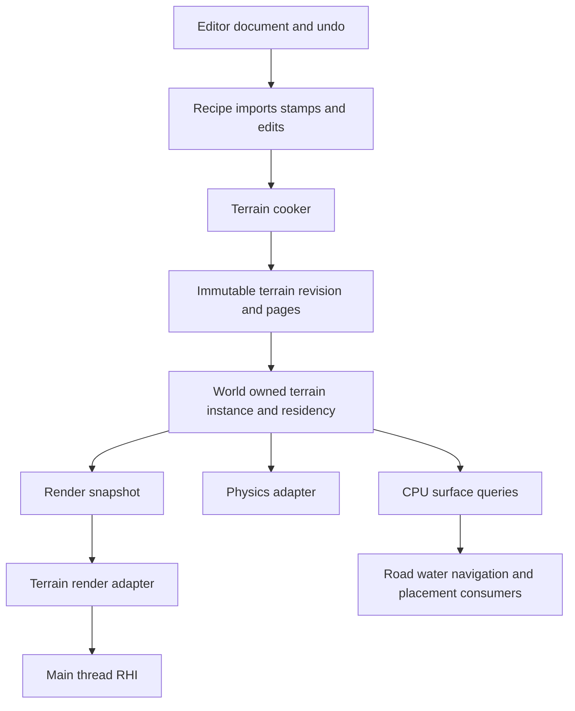
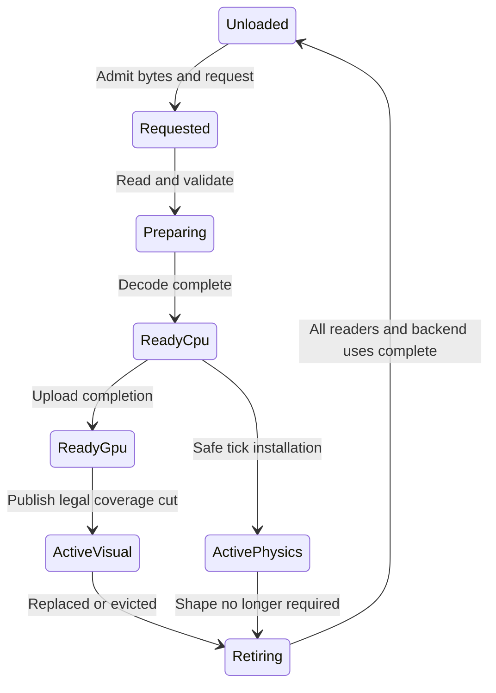

# Terrain systems architecture

Status: proposed. Repository baseline: `1e6bd1a`, inspected on 2026-10-06.
No terrain module, terrain editor, mesh renderer or rigid-body terrain adapter
is implemented by this document. Sizes and performance budgets below are
starting profiles; acceptance requires measurements on the selected targets.

Ludus should represent ordinary outdoor ground as streamed, tiled heightfields,
render it with reusable regular-grid patches, and generate it through a small,
versioned cooking pipeline. Use holes and separate meshes for caves, overhangs
and hero cliffs. Keep the authoritative surface independent of camera detail,
GPU residency and the editor. This provides a practical route to high-quality
large worlds while keeping data, ownership and failures visible in a debugger.

The selection optimizes for Ludus's portability, implementation size, authoring
control and predictable costs. There is no universal best terrain representation.
A game built around digging everywhere needs a volumetric system; a canyon
with fixed sculpted geometry may favor meshes. Modern GPU techniques belong
behind the terrain consumer boundary once their prerequisites and gains exist.

Read [terrain generation](terrain-generation.md) for recipes, hydrology,
erosion, deterministic sampling and cooking. The
[Gems review](terrain-gems-review.md) records actual readings, departures and
the changes made after the initial design.

## Selected decisions

| Decision | Why it fits | When to revisit |
| --- | --- | --- |
| Heightfield as the ordinary ground representation | Compact sampling, direct editing, straightforward queries and bounded tile work | Multiple vertical surfaces or pervasive digging are core gameplay |
| Regular patches selected through a quadtree | Reusable topology, ordinary CPU debugging, wider patches at distance | Measured selection/draw costs justify CDLOD, clipmaps or GPU selection |
| CPU canonical surface and immutable cooked pages | Physics and tools work without graphics; results survive device loss | A separately specified GPU-authoritative gameplay feature |
| Generated base plus explicit authored layers | Artists can preserve roads, settlements and deliberate shapes | A demonstrated authoring need requires a richer graph |
| Fixed physical resolution separate from visual LOD | Moving a camera cannot change support under an actor | Physics requires a separately validated adaptive representation |
| Ordinary material textures and bounded blend channels | Useful art workflow without a virtual-memory subsystem | Unique surface data exceeds measured memory/bandwidth limits |
| Independent mesh attachments | Caves and vertical details retain their natural topology | A second consumer justifies a shared volumetric asset representation |

Thanks to **Willem H. de Boer**, *Fast Terrain Rendering Using Geometrical
MipMapping*, E-mersion Project, October 2000, sections 2.1–2.3, for regular
blocks, reusable topology and error-informed detail selection
([author paper](https://www.flipcode.com/archives/article_geomipmaps.pdf)).
Thanks to **Greg Snook**, *Simplified Terrain Using Interlocking Tiles*,
Game Programming Gems 2, section 4.2, printed pp. 377–383, for explicit links
between different detail levels. Ludus restricts adjacent refinement to 2:1 and
uses complete stitched patches; neither source specifies the full system below.

## Scope and alternatives

| Terrain need | Recommended path | Cost or limitation |
| --- | --- | --- |
| Small level or first implementation | All-resident heightfield and CPU mesh export | Deliberately postpones streaming and advanced rendering |
| Editable outdoor world | Tiled heightfield and quadtree regular patches | One height at each horizontal position |
| Mostly static, art-directed cliffs or canyon | Imported meshes, shared terrain material vocabulary, ordinary mesh LOD | Mesh editing/collision cooking; less direct sculpting |
| Cave entrances and local overhangs | Heightfield holes plus independently cooked cave/cliff meshes | Entrance geometry, collision and material joins need validation |
| Extensive destruction or digging | Separate sparse density bricks and a validated isosurface/transition mesher | 3D storage, topology ambiguity, LOD transitions, collision and persistence |
| Flight over a continuous heightfield | Benchmark geometry clipmaps against the patch renderer | Per-view moving caches, holes, edits and multiple views complicate ownership |
| Planet surface | Separate cube-face/geospatial domain adapter | Face seams, curvature, coordinate precision and gravity are different contracts |

Do not begin with ROAM triangle split/merge queues, a universal terrain base
class, a procedural shader as the collision database, hardware tessellation,
or a bespoke virtualized geometry renderer. These add distinct problems before
the first terrain consumer can establish whether they are useful.

Epic's current Landscape system illustrates that heightfields remain useful in
large-world authoring. Its Nanite Landscape path retains both Nanite and ordinary
Landscape data at runtime, increasing streamed/resident data. For Ludus, a future
mesh compilation backend must account for that duplication rather than replacing
CPU queries by assumption. This is a design inference from
[Landscape Overview](https://dev.epicgames.com/documentation/unreal-engine/landscape-overview)
and [Using Nanite with Landscapes](https://dev.epicgames.com/documentation/unreal-engine/using-nanite-with-landscapes-in-unreal-engine?lang=en-US).

## Repository fit

Follow [AGENTS.md](../../AGENTS.md), [steering](../../.kiro/steering/coding-standards.md),
[ADR 0003](../decisions/0003-standard-library-usage-policy.md) and the
[foundational include boundary](foundational-headers.md).

| Existing Ludus facility | Terrain consequence |
| --- | --- |
| FoundationMath | Right-handed, +Y-up coordinates; checked math, relative positioning and addressed Philox sampling already exist. Noise and erosion kernels do not. |
| FoundationContainers | Use fallible `Array` growth, bounded buffers and explicit ownership; a new allocator is not a prerequisite. |
| FoundationThreading | Bounded task graphs can prepare immutable candidates with exclusive outputs. Completion does not authorize publication. |
| Content and FoundationParsing | Reuse IDs, digests and bounded decoding. Terrain kinds, page manifests and ranged streaming need a new content slice. |
| GameplayWorld and frame design | World/session owns terrain instances, demand and tick publication. Render extraction owns a borrowed or retained immutable snapshot. |
| GraphicsRhi | Current public rendering is bounded fullscreen rendering. Indexed buffers, sampled textures, depth, instancing and completion tickets need implementation before the proposed terrain renderer. |
| PhysicsFluid | A fluid field is present; it is not a rigid-body heightfield collider. Water and land keep separate owners. |
| Resources and general graphics design | General residency coordination and mesh/texture retirement are proposed. Do not claim those adapters already ship. |
| Editor workspace | Terrain authoring is a new document/controller adapter, not an existing editor capability. |

See [resource management](resource-management.md), [RHI and device design](rhi-gdi.md),
[game world](game-world.md), [threading](threading.md),
[randomness](randomness.md) and [curves and surfaces](curves-surfaces.md).
Private numeric implementations must call FoundationMath facilities or obtain an
explicit ADR 0003 extension; its `<cmath>` allowance is Math-only.

## Owners and dependencies

Arrows describe data flow. Actual dependencies point from consumers toward
providers; no arrow permits a link cycle or a worker to mutate the world.

| Proposed location and target | Owns | Dependencies |
| --- | --- | --- |
| `modules/terrain/core`, `Ludus::Terrain` | Coordinates, immutable tile owners/views, topology, surface queries, bounds and CPU patch preparation | Base, Math, Containers |
| `modules/terrain/content`, `Ludus::TerrainContent` | Terrain source schema, validation, recipe execution, codecs, cook manifests and loading | Terrain, Content, Parsing; Threading privately when used |
| Consumer-private render adapter initially | Visibility, detail cuts, draw descriptions, GPU pages and retirement | Terrain, graphics public API |
| Consumer-private physics adapter initially | Collision shapes, physical demand and tick-safe replacement | Terrain, selected physics API |
| Editor-private terrain controller | Brush transactions, layers, undo, import UI and previews | TerrainContent, editor document/UI facilities |

Promote adapters only when reuse justifies a module. Large cooker/erosion
implementations can later split into a tools target without changing runtime
tile/query APIs. Terrain core never depends on Qt, World, RHI, Physics or Logging.
Consumers emit structured diagnostics and profile scopes.

Public headers should separate `status.h`, `coordinates.h`, `tile.h`, `query.h`
and `patch.h`; content adds `source.h`, `cook.h` and `loader.h`. Names are
illustrative, not shipped SDK declarations. Use small values, borrowed spans and
move-only owners with private storage. Avoid heavy templates, backend types and
private headers in the installed interface. Errors are explicit and operations
on query/infrastructure paths are `noexcept`.

## Coordinates and canonical surface

Terrain distances and heights are metres. Horizontal axes are X and Z; positive
Y is elevation. Initial terrain instances support translation and a common
positive horizontal spacing, without rotation or nonuniform scale. General mesh
attachments retain their ordinary transform contracts.

Identify samples by checked global integer coordinates. A tile of N cells owns
the half-open cell interval `[tx*N, (tx+1)*N)` on each axis and stores N+1
endpoint samples. Use `int64` for tile/sample coordinates, fixed widths in
serialization and `usize` for buffer sizes. Floor division and a nonnegative
remainder are required at negative coordinates: sample -1 belongs to tile -1,
local sample N-1. C++ truncating division is insufficient.

Render positions subtract the view origin in a checked wide representation
before narrowing to float32. Subtract tile indices before multiplying large
coordinates by spacing when that preserves nearby detail. Keep local offsets
separate from large cell addresses. Each view has its own origin; changes to the
render origin do not regenerate terrain, alter UV phase, move collision or
change random addresses. Declare supported coordinate and local-range limits;
an `int64` address does not guarantee millimetre precision at arbitrary distance.

The canonical runtime surface is the decoded finest grid with a fixed diagonal
from `(0,0)` to `(1,1)` in every cell and upward triangle winding. Contact height
is piecewise planar barycentric interpolation on those triangles. Bilinear
height is a differently shaped surface inside a nonplanar cell; expose it only
as an explicitly named field sample for tools/shading. Importers, queries and
physics adapters must agree on the diagonal and hole convention.

Use one height origin and quantum per terrain revision, with an explicit
unsigned 16-bit or signed 32-bit encoding. Decode as origin plus quantum times
code. Both encodings use integer data; never route authoritative decode through
hardware filtered UNORM sampling. Shared samples have identical codes, codec
metadata and decode operations. Independent per-tile min/max quantization is
excluded initially. Out-of-range authoring fails cooking without clamping; a
codec change requires recooking the connected terrain revision.

A useful starting 16-bit quantum is 1/64 m, giving a 1023.984375 m span and an
ideal rounding contribution at most 1/128 m. The terrain origin sets the span.
This is a profile example, not a universal acceptable contact error. A 32-bit
profile supports a finer quantum or wider range. Measure conversion error and
add its conservative allowance; inspect saturation and error before cooking.

## Pages and channels

Start with 256 by 256 cells per data page and 32 by 32 cells per render patch.
At 1 m spacing these cover 256 m and 32 m respectively. A coarser page has the
same cell count at doubled spacing and therefore a wider footprint. A coarse
render node similarly keeps a 33 by 33 grid while covering a wider area.
Storage pages, draw patches, collision regions and editing rectangles are
different units; do not force them into one chunk class.

Separate height, surface material, holes and optional derived channels. Give
each its own sampling location, resolution, encoding and page dependencies.
Heights are vertex values; holes are finest-cell bits. Material weights have
their own texel coordinates. Climate, drainage and soil are generation/placement
fields; only retain them at runtime when a consumer needs them.

Coarse geometry uses nested sample decimation, preserving shared vertex heights
across levels. It is not a box-filtered image mip. Shading, color and weight
pyramids use appropriate filtering independently. Hole masks and material IDs
are categorical; averaging them produces invalid semantics.

Normal preparation reads actual neighboring samples. For a one-sample central
difference stencil a 257 by 257 core requires a 259 by 259 working region.
Wider filters require larger halos. Store cooked border normals or their
dependency halo when needed; eviction must not change a border to clamp sampling.
Only a true terrain-domain boundary may use its declared boundary extension.
Copies at tile boundaries/corners come from one canonical result and are
validated by the cooker, rather than independently rounded generation.

Thanks to **Jason Shankel**, *Fast Heightfield Normal Calculation*, Game
Programming Gems 3, section 4.2, printed pp. 344–348, for exploiting regular
grid neighbors. Ludus scales derivatives by actual spacing and distinguishes
the smooth shading normal `normalize(-dh/dx, 1, -dh/dz)` from the exact triangle
contact normal. Thanks to **Egor Yusov**, *Real-Time Deformable Terrain Rendering
with DirectX 11*, GPU Pro 3, section 2.3.4, for the border-normal dependency;
Ludus uses canonical neighboring samples at every prepared level.

## Query and physics contracts

Queries take a retained immutable revision/view and explicit physical resolution.
They never load, allocate, generate, wait for a worker or read back the GPU.
An acquired view remains valid until its owner releases it. No borrowed span
survives eviction unless that view pins the underlying page.

| Proposed operation | Meaningful contract |
| --- | --- |
| Surface sample | Returns triangle height/normal, physical material identity and revision at a finite XZ position; preserves output on failure |
| Raycast | Finite origin/direction, explicit maximum distance in metres and caller work budget; bounded hierarchy/cell traversal and nearest triangle hit |
| Region acquisition | Pins the required physical pages and halo for an explicit region; all-or-nothing admission within budgets |
| Coverage check | Reports the region and physical resolution actually resident, with missing page IDs; does not substitute visual coverage |

Distinguish `Hit`, `Miss`, `Hole`, `OutsideDomain`, `NotResident`,
`InvalidArgument`, `BudgetExceeded`, `StaleRevision` and numeric/format failure
as applicable. A bounded ray traversal that exhausts work returns an incomplete
status, never a confident miss. Hole means absent land surface, not a zero height.
An ordinary composed world raycast can then hit a cave mesh below the opening.

Physical demand comes from actors, swept movement, falling/projectile envelopes
and game-specified margins. It does not come from camera distance. Select fixed
collision spacing and a world-space error tolerance per gameplay region. If a
physics backend uses another diagonal, mask granularity or height encoding,
adapt explicitly or cook a matching triangle mesh; test the mismatch rather
than assuming equivalence.

The physics owner installs prepared shapes between simulation steps, retains
the old shapes until replacement is safe and pins active contacts/required
coverage. Teleports acquire destination collision before the actor moves. A
late physical request returns an admission failure or invokes the game's
explicit movement/loading policy. Flat ground and visual parent pages are not
physical fallbacks. Navigation and placement snapshots also name their revision
and physical tolerance.

Near actors, render detail must meet a configured world-space mismatch limit
as well as a pixel target. Otherwise terrain can visibly intersect feet even
while physics is correct. Parallax/normal detail is cosmetic; geometric shader
displacement needs a declared bound, culling expansion and an explicit decision
about whether collision includes it.

## Visibility and level of detail

The first renderer draws CPU-prepared indexed meshes with ordinary depth and
materials. After vertex texture access and formats are validated, use static
grid footprints with integer height fetches and per-patch placement data.
Instancing can batch compatible patterns; neither compute nor mesh shaders are
baseline requirements. RHI calls remain on the main thread.

A flat array quadtree records node bounds, geometric error, child indices and
page references. The first all-resident slice can draw fixed footprints at
different index strides. The streamed slice selects a cut whose coarse nodes
cover four child footprints with one wider grid. This bounds distant draw count;
reducing triangles within every tiny far-away patch alone does not.

For each view, start from its resident bootstrap cut, frustum-test bounds and
refine nodes while data, error targets and draw/work budgets permit. A selected
cut covers the required visible domain without overlapping parent/child draws.
Replace a parent only when the complete visible replacement and its boundary
neighbors are resident and legal. A missing child retains the parent.

Balance every shared edge to at most one refinement level. Where refinement
would require unavailable neighbors, coarsen the affected selection or retain
the previous legal cut. Bound balancing work and report the achieved visual
error. A budget failure cannot publish a partially balanced mesh.

### Shared edges and corners

For solid patches, prepare one complete index pattern per four-bit edge mask:
each bit says the neighbor is one level coarser. The finer patch performs the
stitch. Boundary vertices used by both sides have identical canonical positions;
unused finer edge vertices are omitted. The 16 masks include corner triangles,
so concatenating four independently generated edge strips cannot introduce
corner gaps or duplicate triangles. Use triangle lists and validate upward
winding, coverage and index bounds for each supported patch resolution.

Derive every shared endpoint from the same global address and view-relative
expression. Equal sample heights alone do not guarantee equal clip positions
when patch-local origin arithmetic rounds differently. The shader/reference
path must validate shared-edge positions on each backend.

Holes require cached topology that removes both finest triangles of each masked
cell. A mixed solid/hole coarse cell is ineligible for ordinary decimation.
Initially retain the required finest hole patches and balancing neighbors in
the bootstrap cut. Their residency is budgeted before activation. This keeps
openings open in rendering, shadows and collision. A future simplified entrance
mesh can replace that cost only with a proved opening-preservation contract.
Hole topology is an explicit exception to shared solid-patch index patterns.

Skirts can hide the outer edge of an explicitly approximate distant proxy.
They do not repair interior seams, hole boundaries or physical support. Any
proxy allowance remains visible in diagnostics and its geometry bounds.

### Error and transitions

Cook error against the finest canonical triangle surface, including quantization
and decode allowances. For two piecewise planar surfaces, extrema of their
vertical difference occur on vertices of the common triangle overlay. Evaluate
fine/coarse vertices and edge intersections, including stitched corner patterns;
a center probe or bilinear interpolation comparison is insufficient. Store a
conservative worst error across legal stitch masks initially. Validate the
implementation's arithmetic margin with adversarial slopes and coordinates.
Ancestors retain a nondecreasing conservative error envelope.

Perspective selection can use projected-error estimates, for example world
error times pixel focal scale divided by the nearest positive view depth.
That shorthand is a heuristic under general camera orientation, not a universal
pixel-error certificate. Refine near the near plane; orthographic views use
their pixel/metre scale. Start with a 1–2 pixel quality target and hysteresis,
record achieved world error and validate images over camera motion. A strict
pixel profile must bound projection over the displaced node volume separately.

Static LOD changes can pop. Admit morphing only with a shared edge/corner
transition record: both sides use the same retained samples, target surface and
transition phase, and topology switches only when endpoint positions agree.
Include the intermediate geometry in bounds/error tests and keep previous
deformed positions for motion vectors. Freeze and inspect transitions in the
debugger. Independent per-patch timers are insufficient. A release quality
profile must pass slow motion and sudden camera-change acceptance before it
can describe transitions as smooth.

Main, shadow, reflection and editor views select separate legal cuts over the
same revision. Their residency demand is a budgeted union. Shadow/detail
policies may differ, but holes, declared displacement and silhouette bounds
remain consistent. Optional occlusion initially uses conservative CPU/frustum
tests; HZB/GPU culling requires fail-open invalid-history handling and a CPU
comparison mode.

## Surface materials and attached systems

Keep stable global material IDs in source and physical data. Start with at most
four active render materials per patch, a patch palette and normalized RGBA
weights. The cooker reports overflow and dropped-weight error; it does not
silently discard a fifth painted layer. Palette changes remap channels by global
identity. At patch boundaries, gather/remap weights into the same material
meaning before blending; channel zero on two patches need not mean the same soil.
For the initial profile, the union of nonzero material identities across each
patch's filtered footprint, including edge/corner halos and sampled mip levels,
must fit four channels. Adjacent patches remap their halo weights by identity
into their own palettes. Reject a cook that cannot satisfy that union, reporting
the affected patches and materials; a richer seam representation needs its own
profile. A four-way corner is part of this validation, not only two-patch edges.

Choose mip palettes and resample weights by material identity before reduction.
Normalize after filtering and quantify approximation. Integer IDs are fetched
without filtering. Physical soil/traction remains a separate stable field so
visual palette reduction cannot change gameplay. Color filters in linear space;
normal maps are decoded, filtered and renormalized by the chosen shading policy.

Use texture arrays where supported and a small ordinary-texture variant otherwise.
Macro tint plus tiling albedo/normal/roughness provides variation. Optional
triplanar mapping is useful on steep cliffs but adds texture work; benchmark its
limited use rather than applying it everywhere. Define UV phase from persistent
terrain coordinates with checked integer phase/local offsets, so origin rebases
and edits do not cause texture swimming. Material graphs must respect a bounded
sample/permutation profile.

Thanks to **Ferenc Pintér**, *Large-Scale Terrain Rendering for Outdoor Games*,
GPU Pro 2, chapter II.3, printed pp. 77–93, for combining procedural soil maps,
artist paint and mesh details. Ludus retains IDs and weights separately instead
of adopting interpolation of ordered numeric soil indices.

If measured unique surface data requires virtual texturing, retain a resident
lowest mip and explicit parent fallback, prioritize ancestors and bound feedback
processing across views. Compute derivatives before virtual-to-cache remapping.
Every physical mip needs filter gutters and compression-block alignment. Publish
a page-table mapping only after its upload is usable, reject stale generations,
and retire an old slot through the same GPU completion proof as other resources.
Keep an ordinary-texture comparison mode. These prerequisites follow
**Matthäus G. Chajdas, Christian Eisenacher, Marc Stamminger and Sylvain Lefebvre**,
*Virtual Texture Mapping 101*, GPU Pro, chapter III.4, printed pp. 185–194;
the [review](terrain-gems-review.md#virtual-texture-prerequisites) records the
scope. This backend remains a separate measured extension.

Road/river tools may consume the proposed geometry path/sweep owners; they bake
stamps and meshes in world metres. Their dependency is an adapter, not a Terrain
dependency on all of Geometry. Water consumes bathymetry and revisions through
the [fluid boundary](fluid-field.md), with its own height/current representation.
Navigation cooks separate traversability data. Foliage and props consume
deterministic placement records, terrain revisions and exclusion masks; their
instances, culling, wind and interaction belong to separate consumers.

At cave/cliff joins, validate silhouette coverage, normals, physical overlap,
soil continuity and water leakage. Disable underlying terrain cells only when
the replacement geometry/collision is admitted together. A visual blend or
decal does not close a physical hole.

## Streaming and publication

A world-owned terrain instance retains a terrain asset revision, a bounded
page table, demand pins and request identities. Begin with a small private
coordinator; use the proposed generic Resources service when implemented rather
than building an unrelated terrain resource manager with different lifetimes.

Prepare outside the frame and tick hot paths. A request carries world/session
generation, terrain revision, page coordinate/level/channel, edit revision,
request generation and graphics-session generation when applicable. A completed
candidate is accepted only if all relevant identities still match.

CPU, visual and physical readiness are independent flags over one content
identity; the diagram is not one exclusive linear enum. Failure/cancellation
from any preparation phase cleans unpublished state and retains active content.
Cancellation joins or retains tasks until they can no longer access inputs;
dropping a request handle alone is insufficient.

Pin a bootstrap visual cut before terrain activation, including hole detail and
its balancing needs. Load coarse visual parents before refinement. Physical
pins and imminent gameplay demand have reserved capacity and deadlines; visual
refinement consumes the remaining budget. Keep visible/coarse coverage during
camera turns, reversals and memory pressure. Admission accounts for compressed
input, decoded candidate, halo/scratch, CPU collision, GPU upload/staging, live
pages and retired versions, rather than counting only the final texture.

Use explicit per-frame byte, job, upload and installation budgets. For measured
speed v, observed preparation latency L and margin M, a starting prefetch distance
is `v*L + M`; it is not proof against an unbounded I/O stall. Teleports use
explicit admission. Deduplicate requests, add promotion/eviction hysteresis and
bound retries. Missing content, corruption and budget rejection are inspectable
states. Cache eviction skips pinned pages and incomplete GPU uses.

GPU slots are reused only after the RHI proves completion of all submitted uses.
CPU job completion and a guessed number of frames are not retirement proof.
Page-table entries publish after upload availability and reference their exact
slot generation. Device loss invalidates graphics-session state; CPU terrain
and physical coverage remain usable while the adapter rebuilds resources.
Browser range loading needs revision-bound requests and bounded retained bytes;
existing whole-file Content reads do not imply that this path exists.

For a physical edit, prepare canonical pages, dependent bounds/topology, collision
and required GPU data as one candidate region with a halo. At a tick boundary,
commit the authoritative revision and collision together; render extraction
then exposes the matching prepared visual region. Retain the old coherent region
until the required candidate is ready. A temporary sculpt preview is explicitly
editor-only. Cosmetic paint may publish independently of collision.

## Editing and debugging

The editor document owns source layers and stable stamp IDs; its preview owns
derived pages. Provide height import/export, raise/lower, smooth, flatten,
material paint, holes and road/river stamps in that order. Show scale, codec
range, physical tolerance and rebuild scope before expensive edits. A small
ordered recipe and named stages remain editable as text; a node UI can later
edit the same model without becoming a second truth.

Use rectangle-based before/after patches plus source operations for undo. Commands
address global coordinates and revisions. Brush dabs are sampled by spatial
distance or an explicit time policy, not variable render frame count. Redo can
restore captured results; it must not depend on a later generator version or
changed neighboring tiles. Reserve undo bytes and candidate memory before
admitting a stroke. Multi-tile edits, including boundary/corner replicas, publish
atomically within a bounded transaction domain or fail intact.

Edits invalidate the complete dependency closure: halo normals, hole topology,
material/placement rules, geometric error, ancestor samples/bounds, collision,
navigation and any dependent water data. Expanding terrain cannot keep stale
smaller culling bounds. Edit the finest source even if only a coarse render node
is visible, then rebuild bottom-up. Readback of a rendered coarse height cannot
recover high-frequency source detail.

The core diagnostic is an inspection record with terrain/revision, page address,
codec, min/max, error, hole state, palette, coverage/pins, request state, budget
reason and pending retirement proof. Debug views show LOD and edge masks,
wireframe, canonical borders, halos, normals, collision/render difference,
residency, source-stage output and dirty dependency regions. Provide freeze
LOD/streaming, a single-job step, serial preparation, forced load failure and
CPU/GPU decode comparison. Structured failure records include enough source
identity to replay one cook or edit without a full editor session.

## Performance and delivery gates

Preallocate node cuts, draw records, request slots and query scratch. Use flat
arrays and ordinary iteration initially. Group draw records by pipeline/palette/
topology only after visibility; parallelize independent page preparation using
immutable inputs. Compression starts lossless and independently decodable per
page; prediction chains, lossy residuals and GPU decompression are later choices.

The example core height page costs `257*257*2 = 132098` bytes (about 129 KiB).
A central-difference working height region costs `259*259*2 = 134162` bytes.
A 33 by 33 footprint has 1089 vertices and 2048 unstitched triangles, so uint16
indices suffice. These counts exclude materials, normals, holes, compressed
input, scratch, collision, GPU alignment and retired copies; they are not a
resident-memory estimate for the whole system.

For a first native 60 Hz benchmark, target terrain selection/extraction below
0.5 ms CPU, rendering below 2 ms GPU and main-thread install/upload submission
below 0.25 ms at the 99th percentile, within a declared scene, resolution,
material profile and device. Set separate browser/low-end budgets after device
selection. These are proposed budgets, not measured results or guarantees.
Measure bytes and tail latency for generation, edit-to-preview, edit-to-physical
commit, decode, streaming and retirement as well as steady-state rendering.
Do not hide time spent waiting on uploads, page churn or shaders.

| Phase | Concrete deliverable | Acceptance |
| --- | --- | --- |
| T0 | CPU terrain core, codecs, imports, queries and mesh export | Seam/negative-coordinate/quantization fixtures; documented errors and unchanged outputs; headless reference |
| T1 | Versioned generation and cook pipeline | [Generation gates](terrain-generation.md#validation-and-delivery); independent page reads; edit dependencies and corruption limits |
| T2 | General mesh/texture/depth RHI slice and static terrain adapter | Required formats and indexed draws verified on declared backends; no reliance on probe-only APIs |
| T3 | Hierarchical cuts, all stitch masks, holes and transition quality | Complete coverage, 2:1 edges/corners, camera sweep images, physical mismatch limits and bounded selection |
| T4 | Editor source/layers/brushes/undo | Coarse-view edits preserve finest data, transactional borders, cancel/stale-result/redo tests |
| T5 | Streamed pages, physical adapter and replacement | Teleport/memory-pressure/device-loss tests, physical pins, retirement proof and representative tail-time traces |
| T6 | Optional accelerated backends | End-to-end win against T5 with the same content/error contract and debug/reference mode |

T0/T1 can proceed before graphics. T4 can begin with CPU previews after T1/T2;
physical commit acceptance requires T5. Render threading needs a separate RHI
ownership change. Sparse virtual textures, compute erosion, GPU culling/indirect
draws, CDLOD/clipmaps, ray tracing and mesh compilation are independent T6 gates,
not mandatory features in one large terrain milestone.

Implement and validate the selected T0–T5 baseline before pursuing the
[post-baseline research queue](terrain-gems-review.md#post-baseline-research-queue).
Capture its correctness, quality, memory and timing evidence as the comparison
point. The conference/journal reading queue and research-driven experiments
are subsequent improvement work, not prerequisites or additions to the initial
milestones. T6 remains optional and admits changes through measured comparisons.

Tests must cover all edge masks and four-way corners; neighbor load/eviction
orders; flat/ramp/spike/saddle grids; near-plane, orthographic and grazing views;
negative and maximum coordinates; shared decode rounding; hole/cave joins;
physical/render revisions; concurrent edits; undo/cancel; stale completions after
world/asset/device replacement; malformed page ranges; output/capacity failure;
multiple views; fast travel; corruption and retirement backlog.

Implementation slices require pinned warning-clean builds, meaningful unit tests,
ASan/UBSan, format/tidy, header/include/build-budget gates, installed SDK consumers
and applicable browser checks. New public declarations require Doxygen coverage
and wiki guidance in the same slice. Record measured acceptance separately from
the design; the present change is documentation only.

## Initial design and changes after the Gems review

The initial design was recorded before reading the terrain entries in
`references/game-dev-gems-toc.md`. It selected heightfields plus meshes, common
coordinates/codecs, 256-cell pages, 32-cell patches, reusable stitched grids,
CPU physical queries, immutable publication, ordered generation, domain erosion,
authored stamps, bounded streaming and optional GPU extensions.

The final architecture retains that selection and makes these changes:

| Initial contract | Final refinement | Reading |
| --- | --- | --- |
| Reusable stitched grid | Complete 16-mask patterns with explicit corner coverage; one-level neighbor restriction | Snook, GPG 2 section 4.2 |
| Fewer vertices at distance | Wider hierarchical coverage nodes also reduce distant patch count | Asirvatham/Hoppe, GPU Gems 2 chapter 2; Geiss, GPU Gems 3 section 1.6.1 |
| Derived smooth normals | Spacing-aware approximate shading normals, exact contact normals, canonical halos | Shankel, GPG 3 section 4.2; Yusov, GPU Pro 3 section 2.3.4 |
| Editable generated base | Imported/procedural soil plus persistent paint and mesh join workflow | Pintér, GPU Pro 2 chapter II.3 |
| Coarse runtime LOD | Preserve finest source during coarse-view edits; rebuild errors, normals and ancestors | Yusov, GPU Pro 3 sections 2.3 and 2.6 |
| Optional virtual texturing | Explicit parent fallback, gradients, mip gutters and compression alignment before admission | Chajdas et al., GPU Pro 1 chapter III.4 |
| Deterministic generation | Bounded regeneration addresses; finite-domain dependency declarations and smooth noise | Lecky-Thompson and Shankel, GPG 1 sections 4.16–4.19; Perlin, GPU Gems 1 chapter 5 |
| Future density terrain | Separate authority, topology/LOD mesher and physical contract; no opaque alpha overlap | Geiss, GPU Gems 3 sections 1.2 and 1.6 |

The detailed [review](terrain-gems-review.md) distinguishes source findings from
Ludus-specific ownership, budgets and numerical contracts. No chapter code or
companion-CD implementation is copied.
