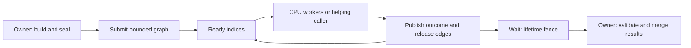

# Threading architecture

Status: the bounded graph kernel is implemented. Work stealing and engine
consumer migration are later, measured slices. This design builds on
[frame ownership](frame-update.md#background-work-and-eventual-jobs) and
[profiling](profiling-final.md). It does not claim universal optimality or AAA
scale performance from a small synthetic benchmark.

## Initial proposal, before the reference review

Use tasks over explicit inputs instead of a thread for every engine subsystem.
Keep world mutation, Platform and the current RHI on their owning application
thread. A CPU pool runs bounded computations against immutable snapshots or
exclusive output ranges. The owner merges results in stable entity/request order
at an explicit tick boundary, validating world identity and data revision.

Build a graph before publishing it. A dependency describes both ordering and
visibility, and an entire graph acts as a lifetime fence for its input/output
storage. Only ready tasks run. Split a computation that needs a wait into two
callbacks and an edge. Reserve bounded storage up front, expose admission errors,
and provide an executor with zero workers to debug the same callbacks serially.
Keep OS threading private and report startup failure without C++ exceptions.

The default optimization strategy is to reduce shared state and schedule coarse
ranges, then measure. A shared ready queue is the auditable baseline; worker-local
queues and work stealing are a compatible next backend if lock contention or
queue latency is material. Avoid hidden global pools, recursive waits, fibers,
per-job heap closures, and a dedicated scheduler thread.

## Reference review and resulting changes

The index is the local [game-dev-gems-toc.md](../../references/game-dev-gems-toc.md).
The following are chapter-text reviews, rather than conclusions from titles.
Printed page numbers and one-based PDF pages differ.

| Source reviewed | Useful idea | Change to the initial proposal | Limits of the historical sample |
| --- | --- | --- | --- |
| Julien Hamaide, Game Programming Gems 7, 1.9, Multithread Job and Dependency System, pp. 87-96 ([PDF 120-129](../../references/Game%20Programming%20Gems%207.pdf#page=120)) | Persistent pool, dependency counters, generation-aware entry identity | Add graph identity plus reset generation to handles; validate and freeze the DAG; publish only when incoming edges resolve | An absent prerequisite cannot imply success. Keep failure, cancellation and blocked descendants distinct. Avoid its scheduler thread and OS event per group. |
| Brad Werth, Game Engine Gems 1, 22, Holistic Task Parallelism for Common Game Architecture Patterns, pp. 381-390 ([PDF 409-418](../../references/Game%20Engine%20Gems%201.pdf#page=409)) | Continuations, range decomposition, helping waits, local queues | Add an explicit helping option to Wait; make blocking callback waits a rejected operation; require coarse range benchmarks before consumer migration | Its synchronized spinning callbacks can deadlock an exhausted pool. Worker initialization belongs at startup, rather than in barriers disguised as jobs. |
| Jon Parise, Game Engine Gems 1, 21, Multithreaded Object Models, pp. 371-379 ([PDF 399-407](../../references/Game%20Engine%20Gems%201.pdf#page=399)) | Owner messages and buffered state make synchronization explicit | Require snapshot lifetime through Wait and stable owner-side application; retain current render ownership | A command queue does not protect concurrent readers of mutable objects. Extra frames cost latency and memory and need explicit event delivery rules. |
| Julien Hamaide, Game Engine Gems 2, 29, Thread Communication Techniques, pp. 459-467 ([PDF 475-483](../../references/Game%20Engine%20Gems%202.pdf#page=475)) | Bound communication, establish producer/consumer roles, aggregate locally | Reserve the whole graph including ready capacity; expose synchronized state snapshots; keep worker outputs disjoint | Do not reproduce volatile indices and architecture-specific barriers as portable C++ synchronization. FIFO arrival is not deterministic world update order. |
| Jean-François Dubé, Game Programming Gems 8, 4.3, Efficient and Scalable Multi-Core Programming, pp. 373-384 ([PDF 388-399](../../references/Game%20Programming%20Gems%208.pdf#page=388)) | False sharing, allocator contention, sleeping idle threads, cooperative scheduling | No allocation or busy polling in steady scheduling; wake from a protected predicate; benchmark tiny and substantial jobs separately | Core-count and spinlock assumptions must be remeasured on modern SMT/hybrid CPUs. The historical volatile examples are not C++23 memory-order proofs. |

Modern cross-checks: [enkiTS](https://github.com/dougbinks/enkiTS) demonstrates
upfront allocation, dependencies, range work and helping; the primary
[Taskflow scheduler paper](https://taskflow.github.io/taskflow/icpads20.pdf)
describes work stealing for irregular task graphs. These inform the direction,
not a dependency import or a claim that this baseline beats them. The portable
memory model is [C++ data races](https://eel.is/c++draft/intro.races), not the
older books' volatile examples. [Emscripten's pthread restrictions](https://emscripten.org/docs/porting/pthreads.html)
require a serial default without main-browser-thread blocking or COOP/COEP.

## Kernel and public contract

`Ludus::FoundationThreading` depends only on FoundationBase and private native
OS primitives (Threads is an exported system link dependency on POSIX). Public
`jobs.hpp` contains types and function declarations, with no OS, STL concurrency,
logging, profiling or container headers. The implementation uses C++23 atomics
and native pthread/Windows operations; thread creation never uses std::thread's
throwing constructor. Browser builds use the same graph and a serial backend.

A `JobGraph` is initialized with job/edge capacities. Build on one owner thread,
add callbacks/context pointers, declare `DependsOn(dependent, prerequisite)`, and
`Seal`. Seal performs O(V+E) Kahn validation using preallocated scratch space.
Self edges, duplicate edges, foreign/stale handles, exhaustion and cycles have
explicit statuses. A handle includes a graph ID unique within its FoundationThreading runtime, a
reset generation and an index. Identity exhaustion returns an error rather than wrapping.

A `JobSystem` is explicitly initialized with 0-64 workers. Worker count is a
caller budget excluding any helping caller. The engine owner must reserve CPU
budget for simulation, driver, audio and I/O threads; logical CPU count is not
an instruction to use every hardware thread. Initialization creates all workers
once; a failed startup joins every worker already started before returning.

Submit reserves one graph until Wait releases it. A second graph returns Busy;
there is no hidden backlog or unbounded retry. Sealed graphs can be submitted
repeatedly with updated contexts after Wait. Reset invalidates handles and permits
rebuilding. An empty sealed graph succeeds. The serial Submit executes all work
synchronously and retains the graph until Wait, keeping the same lifetime API.

Only callbacks whose prerequisites succeeded run. A callback returns Succeeded,
Failed or Cancelled. Invalid callback outcomes become Failed. A failed/cancelled
prerequisite blocks descendants without calling their functions, while unrelated
branches finish. Failure dominates cancellation in the graph outcome. Explicit
Cancel skips tasks that have not started; running callbacks retain their actual
outcomes. It cannot stop an executing stack or roll back side effects. Cancel
after the last task completed does not change successful completion into failure.

Wait optionally executes ready CPU callbacks on its calling thread; choose
`help=false` when thread identity/TLS or responsiveness makes that inappropriate.
Callbacks are free to run on any worker or a helping caller and have no affinity
guarantee. Platform/RHI/audio callback work does not enter this pool. The serial
executor executes on the caller. A TLS guard rejects recursive Submit, Wait,
Initialize and Shutdown from *any* pool callback with InsideJob, including calls
to another pool. Dependencies must be declared before publication.

Callback code itself must remain loaded through Wait, including gameplay DLL
unload/live reload; completion cannot validate a pointer into unloaded code.
The host owns the runtime, systems, graphs and handles across reloads. IDs and
handles belong to that runtime instance; separately linked copies of the static
SDK in gameplay DLLs do not share its identity counter. Do not exchange or retain
handles between independent runtime copies or across their unload/reload.

Shutdown drains accepted work, sets stop under the gate, wakes sleepers, joins
all started threads and frees state. System destruction does the same. Destroying
a submitted graph drains it through its system. Destruction from a callback of
its active graph or a system is a fatal lifetime-contract violation: that stack
cannot wait for itself. Application shutdown must first stop admissions, retain
contexts, drain/cancel, then destroy inputs and owning subsystems.

Build/reset, Submit/Wait, initialization, shutdown and destruction are serialized
by the application owner. Cancel and Snapshot may run concurrently with execution
and owner Wait, while lifecycle is stable. GetOutcome may read a published node
concurrently with execution, but never race graph reset/rebuild/destruction. A
caller cannot race the system's destruction with any operation. An arbitrary
callback that blocks indefinitely can prevent drain; the kernel cannot enforce
an execution time bound or make unsafe user code race-free.

## Synchronization proof and debugging

One system gate protects ready indices, dependency counters, cancellation,
active graph, unfinished count and stop. Callback code runs outside the gate.
Completing a callback takes that gate before publishing outcomes and releasing
edges; a dependent acquires the same gate before dispatch. Therefore predecessor
writes happen before dependent reads. Wait acquires the gate and observes zero
unfinished tasks before returning; all completed callback outputs are visible.
Per-node outcomes also use release stores/acquire loads for GetOutcome readers.

Workers sleep only after checking the ready/stop predicate while holding the gate.
Wait checks unfinished under that same gate. Native condition waiting atomically
releases the gate; wakes and completion transitions occur with it held. Broadcast only when
ready work transitions from empty to nonempty, all jobs complete, or control
changes require it. Every
wake rechecks predicates, including spurious wakes. There is no spin loop, lost
wake gap, second lock order, or executing user callback under a scheduler lock.
Each node enters ready once, so the graph's MaxJobs ring can never overflow.

Snapshot gives pending/running/succeeded/failed/cancelled/blocked counts while
holding the gate. GetOutcome identifies the exact node. Debug a suspect graph
with WorkerCount=0, then one worker, then a configured worker budget. Serial order
is repeatable for fixed construction/edge order; parallel sibling completion is
unspecified. Stable output merge order and deterministic per-job random streams
remain the caller's responsibility. A serial run is an oracle, not a proof of
absence of races. Use TSan, ASan/UBSan, bounded CTest timeouts and repeated graph
reuse/fan-in/failure/cancellation/shutdown tests.

## Performance and staged growth

The implemented ready ring is O(1) push/pop, with O(out-degree) completion work.
All scheduler heap storage and native threads are created at initialization.
No scheduler allocation occurs in add/seal/submit/execute/wait/reset/shutdown
(except OS/runtime activity during thread teardown). One short gate remains a
scaling limit; wide, very small graphs should batch work. Snapshot is an O(V)
diagnostic operation and must not be polled every task. WakeAll is deliberately
easy to audit and may create a wake herd; measure before splitting work and
completion conditions or introducing targeted wake policies.

Build the optional `ludus_threading_benchmark` with
`-DLUDUS_BUILD_THREADING_BENCHMARK=ON`. It compares complete submit-to-Wait batches
with identical outputs in serial and parallel. Report hardware, worker counts,
task count/grain, median timings, checksum, idle/background load and build flavor.
Recorded [validation and timing evidence](../development/threading-evidence.md)
includes the hardware, shared-machine load and output checks.
Tiny callbacks measure dispatch overhead; useful arithmetic measures a possible
break-even. Synthetic speedup does not establish game-frame improvement.

Subsequent reviewable slices, in order:

1. Integrate a profiled immutable-range engine workload and owner merge. Measure
   frame p50/p95/p99, critical path and dispatch overhead against the serial oracle.
   Add range helpers only around that real need, preserving bounded admission.
2. Add optional per-task name/site IDs and profiler dispatch-to-start/completion
   flows, queue depth and waiting duration. Keep callbacks/trace allocation outside
   scheduler locks; tracing must degrade without disturbing execution. Use explicit
   worker initialization hooks for TLS/trace registration if needed.
3. If contention is material, replace the ready ring with bounded worker-local
   deques plus an external injection queue. Specify owner/thief rules, release /
   acquire publication, reclamation, overflow and wake protocol before code. Compare
   with enkiTS under Ludus's no-exception/lifetime constraints. Validate ARM64 and
   TSan and measure cache/queue overhead; keep the graph API and serial executor.
4. Add concurrent graph admission/priority lanes only when frame-critical and
   background work must overlap. Reserve completion capacity and preserve fairness;
   long I/O stays on an independent service with continuation publication.
5. Browser pthreads require a separately deployable build with isolation headers,
   off-main execution and nonblocking UI polling. Render-thread ownership, GPU
   resource retirement, NUMA affinity and fibers each need their own measured ADR.

The first kernel provides a maintainable correctness baseline and a controlled
migration path. Those later capabilities are deliberately not advertised as
implemented by this PR.

## Post-baseline research and improvement plan

Finish the initial architecture and its engine integration before changing the
scheduler in response to the resources below. The bounded kernel is already
implemented; the remaining baseline work is the first real consumer, useful
execution traces, public API documentation and platform validation. The existing
[staged growth plan](#performance-and-staged-growth) determines implementation
order. This reading path supplies questions and comparison methods for later
improvements; it does not select a replacement backend or expand the public API.

### Baseline completion gate

Before starting a scheduler optimization experiment:

- Integrate one profiled immutable-range engine workload with disjoint outputs,
  stable owner-side application and serial-oracle comparisons. Validate the
  consumer's input/result lifetime, failure/cancellation handling, shutdown and
  any applicable gameplay-code reload boundary against the contracts above.
- Complete the task identity/flow and waiting measurements from the staged plan.
  Record frame p50/p95/p99, critical path, dispatch-to-start latency, execution and
  owner wait duration, grain sizes and the explicit worker budget. Measure tracing
  overhead with tracing enabled and disabled.
- Document the public API beside its declarations and record Linux, macOS and
  serial-web validation in the [evidence owner](../development/threading-evidence.md).
  Close the macOS CI runtime-test gap and obtain a completed sanitizer result;
  a sanitizer-runtime failure before test entry is not a passing engine test.
  Windows validation remains required before shipping the existing Windows backend.
- Preserve a reproducible baseline: revision, compiler/build flavor, hardware,
  worker/helping configuration, graph shape, workload inputs, output checks and
  background load. Retain the bounded admission, zero steady scheduler allocation,
  explicit error/outcome and owner-thread contracts when comparing alternatives.

### Resources and their role

Thanks to the authors and studios listed here for the research and engineering
experience that motivates this follow-up. The source metadata, talk overview,
paper abstracts and selected relevant sections were consulted to establish this
reading path. A complete algorithm/proof review and a Ludus implementation
evaluation remain future work; the table does not claim that these techniques
have been adopted or that their reported gains transfer to Ludus.

| Resource | Question to investigate after the baseline | Fit and limits for Ludus |
| --- | --- | --- |
| David Block / CD Projekt RED, **The Job System in 'Cyberpunk 2077': Scaling Night City on the CPU**, GDC Programming, 2024 ([session](https://gdcvault.com/play/1034234/The-Job-System-in-Cyberpunk)) | How should jobs compose across engine subsystems, expose dependency/blocker information and share the CPU budget? Review the thread-based dependency counters, debugging and profiling discussion first. | Closest practical starting point for the first consumer and readable traces. Treat the production engine's job API and resource-sharing decisions as examples; preserve Ludus's declared edges, run-to-completion callbacks and current world/Platform/RHI ownership. |
| Sam Westrick, Darshan Dinesh Kumar and Seong-Heon Jung, **Scheduler Augmentation: A Lightweight, Customizable, Low-Cost Profiling Technique for Fork-Join Parallel Programs**, SPAA 2026, pp. 457-472 ([DOI](https://doi.org/10.1145/3816782.3819212), [paper](https://cs.nyu.edu/~shw8119/26/schedaug-spaa26.pdf), [artifact](https://github.com/nyu-parcour/scheduler-augmentation)) | Can scheduler observations identify tasks whose granularity costs more than their parallelism saves? Read the vertex interface in section 2, granularity analysis in section 3 and overhead evaluation before designing instrumentation. | A candidate for bounded, optional task-graph observations around existing profiler flows. Its fork/join pairing assumes series-parallel graphs; Ludus permits general sealed DAGs. Specify how observations handle arbitrary fan-in, failure, cancellation and graph reuse, and measure their storage and enabled/disabled overhead. |
| Tsung-Wei Huang, Dian-Lun Lin, Chun-Xun Lin and Yibo Lin, **Taskflow: A Lightweight Parallel and Heterogeneous Task Graph Computing System**, IEEE Transactions on Parallel and Distributed Systems (TPDS), 33(6), 2022, pp. 1303-1320 ([DOI](https://doi.org/10.1109/TPDS.2021.3104255), [paper](https://taskflow.github.io/papers/tpds21-taskflow.pdf)) | How do work stealing and worker coordination keep useful parallel work moving while avoiding wasted resources when ready tasks become scarce? Review the scheduler and evaluation alongside the earlier ICPADS 2020 cross-check above. | Relevant if traces identify ready-queue contention, poor load balance or excessive wakeups. Its dynamic/control-flow and heterogeneous task model is broader than our frozen CPU DAG. Any adaptation must retain explicit CPU budgets, bounded storage, sleeping idle workers and the serial browser executor; a library import needs a separate compatibility review. |
| David Chase and Yossi Lev, **Dynamic Circular Work-Stealing Deque**, SPAA 2005, pp. 21-28 ([DOI](https://doi.org/10.1145/1073970.1073974), [paper](https://www.cs.wm.edu/~dcschmidt/PDF/work-stealing-dequeue.pdf)) | What are the owner push/pop and thief steal rules, and how is the last-item race resolved? Review sections 2-4 before specifying worker-local queues and external injection. | Algorithmic groundwork for the conditional work-stealing slice. The paper's dynamic arrays and buffer reclamation do not directly satisfy fixed upfront capacity. Specify overflow/admission, index exhaustion, buffer lifetime and injection behavior for a bounded adaptation. Pair it with the weak-memory paper below rather than translating historical pseudocode directly. |
| Nhat Minh Lê, Antoniu Pop, Albert Cohen and Francesco Zappa Nardelli, **Correct and Efficient Work-Stealing for Weak Memory Models**, PPoPP 2013, pp. 69-80 ([DOI](https://doi.org/10.1145/2442516.2442524), [paper](https://www.di.ens.fr/~zappa/readings/ppopp13.pdf)) | Which publication operations, fences and competing access rules make a Chase-Lev deque correct on weakly ordered hardware? Review the ARM/POWER proof and portable C11 variant together with the original deque. | Required technical review before a concurrent deque implementation, particularly for the macOS ARM64 target. Map the algorithm to C++23 atomics and Ludus's numeric bounds explicitly; its proof does not automatically cover our bounded adaptation, external injection, wake protocol or graph lifetimes. Validate the resulting implementation with race tests and ARM64 execution. |
| Robert D. Blumofe and Charles E. Leiserson, **Scheduling Multithreaded Computations by Work Stealing**, Journal of the ACM (JACM), 46(5), 1999, pp. 720-748 ([DOI](https://doi.org/10.1145/324133.324234), [paper](https://www.cs.utexas.edu/~venkatar/sys_perf_analysis/ws_theory.pdf)) | Is performance limited by total work, dependency span or scheduler overhead? Use the work/span model to interpret scaling before attributing a slow frame to the ready queue. | Foundational analysis for structured parallel computations. The bounds assume fully strict computations and the paper's scheduler model; they are not a guarantee for Ludus's arbitrary DAGs, cancellation policy or game-frame deadlines. Measure the actual critical path and owner-side merge cost. |

Follow GDC's Programming material for engine integration, PPoPP for concurrent
runtime correctness, SPAA for scheduling/data structures and instrumentation,
TPDS for complete runtime designs, and JACM for underlying scheduling theory.
Start with Block, Scheduler Augmentation and Taskflow. Read Chase-Lev and Lê et al.
together when measurements justify worker-local queues; use Blumofe-Leiserson to
interpret work and critical-path limits throughout that review.

### Turning research into an improvement

1. Identify a measured problem in the completed baseline: task granularity,
   dependency span, queue contention, load imbalance, wake overhead or owner merge.
   Prefer batching/decomposition changes when they address the problem directly.
2. Read the relevant full source and record the exact sections, assumptions,
   adopted idea and departures in this architecture owner. Specify publication,
   lifetime, capacity and wake behavior before implementing concurrency changes.
   Add attribution beside affected code when an idea is actually adopted.
3. Implement one reviewable experiment while retaining the baseline and serial
   oracle. Compare identical inputs/outputs and CPU budgets on representative
   Linux/macOS hardware, including ARM64, and retain serial-web correctness.
   Exercise reuse, failure, cancellation and draining under the applicable
   sanitizer and allocation gates. Report frame tails and instrumentation cost
   as well as batch throughput; publish regressions and inconclusive results.
4. Adopt the change only with a repeatable benefit and preserved contracts. Record
   results in the evidence owner and update API comments when contracts change.
   Fibers, multiple graphs/priorities, browser pthreads, render ownership and NUMA
   affinity still require the separate need/design decisions in the staged plan.
