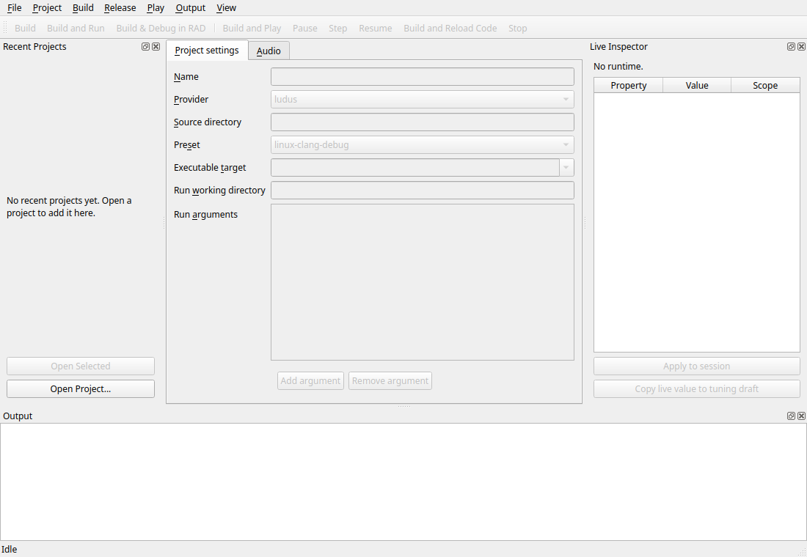

# Native editor workspace and troubleshooting

The editor is an **optional, OFF-by-default** native developer tool
(`apps/editor`, target `ludus_editor`). It opens a project descriptor, edits its
native build/launch settings, saves, reopens, configures/builds, runs the
selected executable in a separate process, stops it, and reports failures. It is
not a scene editor and embeds no game framebuffer; the runtime has its own
window and the editor's status area only describes it.

See the specification package for the authoritative contract:
`.kiro/specs/editor-workspace/{requirements,design,tasks}.md` and
`docs/architecture/editor-workspace-research.md`. The
[editor architecture](../architecture/editor-architecture.md) and
[interaction design](../architecture/editor-interaction-design.md) define S1
and subsequent authoring stages.

## Work areas and document ownership

| Surface | Purpose |
| --- | --- |
| Welcome | New/Open and recent projects while no project is open |
| Project settings | Project name, provider, source directory, preset, target and arguments |
| Audio | Content selection, definitions, save and preview |
| Configuration | Independent offline configuration preview and preference editing |
| Live Inspector | Copied runtime state and supported live property operations |
| Output | Selectable build/tool/runtime diagnostics |

The Configuration workspace retains its explicitly loaded preview/draft across
project changes. Quitting prompts for unsaved preferences. Project settings,
audio definitions, offline preferences and live values have separate save owners.
Applying to a session does not save a file; copying a live value to a tuning draft
requires a separate save. See [configuration](../wiki/guides/configuration.md)
and [native live editing](project-live-reload.md).

## Prerequisites (optional editor setup)

The editor needs Qt 6 (6.4-compatible) with the Core/Gui/Widgets modules and a
native platform plugin (Wayland on Linux, Cocoa on macOS), in addition to the normal reference toolchain
(`./init.sh` prepares pinned Clang 18 / LLD / managed CMake/Ninja/Conan and the
managed Python venv). Qt is not added to Conan or the SDK. Default initialization
skips editor setup; select **Build Ludus editor** in the setup window or use
`./init.sh --cli --with-editor` to install missing Ubuntu/Debian Qt packages or
Homebrew `qtbase` on macOS and
build the selected native Debug, Development or ASan/UBSan editor. `--no-editor` explicitly
disables the editor for the prepared presets. Initialization also excludes test
targets by default; use `--with-tests` to include editor tests or `--run-tests` to
build and execute the enabled tests after setup.
Editor tests also require Qt Test, supplied by the same Qt base development
package on Ubuntu/Debian.

To manage Qt yourself, install it once (names vary by distribution) and use
`./init.sh --cli --with-editor --no-system-install`:

- Debian/Ubuntu: `sudo apt-get install -y qt6-base-dev qt6-wayland`
- Fedora/Amazon Linux: `sudo dnf install -y qt6-qtbase-devel qt6-qtwayland`
- macOS: `brew install qtbase` (Core/Gui/Widgets/Test and Cocoa). Setup discovers
  Homebrew Qt and records `Qt6_DIR` only in the local build cache. A manual Qt
  installation can be selected with CMake `-DQt6_DIR=/path/to/lib/cmake/Qt6`.

Only the editor configure/build uses Qt. A default configure
(`LUDUS_BUILD_EDITOR=OFF`) and default engine browser builds never search for Qt. The separate
[browser editor build](browser-editor.md) explicitly prepares WebAssembly Qt.

## Build the editor (Editor ON)

The editor is gated behind `LUDUS_BUILD_EDITOR` (OFF by default). Configure a
native preset with the option ON using the managed CMake, then build the target:

```bash
./init.sh --cli --with-editor                # optional Qt prerequisites + editor build
# Or manage Qt and the editor build yourself:
./init.sh                                   # pinned tools + managed venv (once)
# Editor ON configure/build (managed cmake shown as `cmake` for brevity):
cmake --preset linux-clang-development -DLUDUS_USE_INIT_OPTIONS=OFF -DLUDUS_BUILD_EDITOR=ON
cmake --build --preset linux-clang-development --target ludus_editor
```

Native `LUDUS_BUILD_EDITOR=ON` supports Linux x64 and macOS arm64/x64.
Apple silicon is the validated macOS host; native Intel acceptance remains pending.
Browser editor builds use
the separate pinned Qt WebAssembly toolchain; ordinary browser engine setup does
not enable the editor. Unsupported native hosts fail configuration explicitly.

On macOS, the launcher defaults to `macos-clang-development`:

```bash
./init.sh --cli macos-clang-development --preset-only --with-editor --with-tests --no-system-install
./scripts/editor --preset macos-clang-development
```

The macOS port includes New/Open/Save, SDK setup/check/repair, Configure/Build,
Build and Run, Stop, project profile selection, layout/history, audio authoring
and preview, and Configuration. Qt supplies native Cocoa windows, text input,
file pickers, and platform shortcuts. Games run separately using their own
platform/RHI backend, including Metal. Version-2 descriptors expose all three
macOS game profiles; the Editor itself uses Debug, Development or ASan/UBSan.
Version-1 descriptors retain their original Linux preset contract.

Live Play/reload generation publication still requires Linux ELF build IDs and
embedded DWARF. Its macOS UI action is guarded and disabled; use Build and Run.
RAD debugging and release packaging/signing are also disabled on macOS, with
backend errors if invoked directly. These deferred features do not block ordinary
build/run. The Editor is built from the tooling checkout; this port does not add
an installed/signable Editor application bundle to the runtime SDK. The local
macOS build produces `ludus_editor.app`, with the required Qt frameworks supplied
by the opted-in development installation; the File API launcher resolves its
executable inside the bundle.

## Launch

`scripts/editor` locates the already-built `ludus_editor` through the shared
CMake File API helper and starts it with the trusted managed Python interpreter,
the `editor_tool.py` adapter, and this tooling root. It never builds or installs
anything; if the editor is not built it prints the preparation commands above.

```bash
./scripts/editor --preset linux-clang-development \
                 --project examples/editor-workspace/ludus.project.json
```

Opening a descriptor reads metadata and queues a read-only setup check for v2
SDK projects. The check uses the selected CMake to list presets and reports
missing/stale setup in the status area and Output. It never configures, builds,
downloads, runs project hooks, or changes files. Configure, Build, Build and Run,
and Stop remain explicit actions.

## Recent projects

The **Welcome** work area shows recent projects only when no project is open.
The **File → Recent Projects** menu remains available while authoring. Double-click
an entry or choose **Open Selected**. The editor remembers ten successful opens
across restarts, including command-line and newly created projects. Missing paths
are labelled; a failed open preserves the current project. **Clear Recent Projects**
clears history without deleting projects. Recents no longer reserve a dock column.

History is local to the user, in `$XDG_CONFIG_HOME/Ludus/Editor/recent-projects.json`
(normally `~/.config/Ludus/Editor/recent-projects.json` on Linux). An absolute
`XDG_CONFIG_HOME` override works on both native hosts; otherwise macOS uses
Qt's native config location (`~/Library/Preferences/Ludus/Editor`). It is saved atomically,
separately from project files. If preferences cannot be written, project opening
still works and history remains available for the current session.

## Create, initialize, repair and update projects

The **Project** menu provides **New Project**, **Check Setup**, and
**Repair Project Setup**. Setup actions require a saved, clean v2
CMake project; save pending edits first.

For Ludus-Sandbox, open its `ludus.project.json`, choose **Repair Project Setup**,
leave **Use this project's selected engine (recommended)** selected, and click
**Repair Project**. This reuses the project's saved engine selection or installed
locked release; no installation paths need to be entered.

An SDK is the installed engine's headers and libraries. A desktop engine is built
for this computer; a browser engine is built for the web. The dialog asks for a
folder only after choosing **Choose a different installed engine** or enabling
**Also set up browser builds**. The latter needs an installed browser engine
matching the same engine release and enables the web Development and Release
profiles. Saved browser setup is shown and enabled initially. Turning it off
repairs only desktop builds and clears the saved browser selection and owned
web presets, so a missing old browser installation cannot block desktop repair.
Custom presets stay intact. The operation does not change the project engine
requirement or committed lock.

Repair verifies the managed CMake, Ninja, Clang 18, required SDK components,
dependency prefixes and shader tool paths. It generates marked
`ludus-local-<profile>` presets in ignored `CMakeUserPresets.json`, keeping custom
presets and their includes. Machine paths stay in ignored presets and
`.ludus/local.json`; the IDE uses preset mode and each preset selects its CMake
executable. Related stale IDE CMake-path overrides are removed; unrelated
settings are preserved. Real CMake configure/build/test preset discovery must
succeed, followed by a fresh configure, full build and native CTest. No-tests
is an error. Web profiles configure and build; browser runtime acceptance is
separate. The setup signature detects changed SDK contents and moved tools.

The **Build and install the engine used by this editor** option explicitly
initializes and builds the trusted tooling checkout, then installs the desktop
SDK before repairing the game project. This can download dependencies; it
does not install system packages or execute the game project’s bootstrap hooks.
Web SDK acquisition remains an explicit engine-tooling step; select an installed
browser engine in this dialog. New Project asks only for Name and Location, with a Browse button and a
resulting-folder preview. Choose **Create Project** to select the engine and verify
the project. **Advanced engine selection** allows a custom Development SDK;
normal creation requires no SDK path or preparation checkbox. All child commands use the existing streaming output,
Stop, process-group cleanup and single-operation ownership.

New Project creates the bundled minimal v3 native template in a sibling staging
directory, verifies setup/configure/build/tests, then publishes to an absent
destination and opens it. Failure/cancellation before publication discards the
stage and leaves the current workspace intact. Staging build artifacts are
discarded because their CMake paths belong to the staging directory. The next
Configure builds at the final location.

The CLI calls the same backend:

```bash
ludus project check /path/to/Ludus-Sandbox --tools /path/to/Ludus
ludus project repair /path/to/Ludus-Sandbox --tools /path/to/Ludus --sdk /path/to/sdk
ludus project repair /path/to/Ludus-Sandbox --tools /path/to/Ludus --no-web
ludus project update /path/to/Ludus-Sandbox --tools /path/to/Ludus --sdk /path/to/new-sdk
ludus project create /path/to/new-game --name MyGame --sdk /path/to/sdk --tools /path/to/Ludus
```

`create --engine` without `--tools` can still generate metadata without an SDK.
Use `--tools` for verified creation. Without `--engine` or `--sdk`, CLI and
editor share automatic selection: explicit Advanced/CLI SDK, then an absolute
`LUDUS_SDK_PREFIX`, then the editor tooling checkout's current native Development
install, then automatic preparation of that engine. Invalid explicit/environment
selections fail visibly; they never fall back silently. A missing or stale
editor-owned install is prepared only after Create. ABI/compiler validation and
real preset discovery/configure/build/tests still gate publication. Paths remain
in ignored machine-local settings. Reuse requires matching checkout revision;
source-checkout builds are the supported editor distribution today.

```bash
ludus project create /path/to/new-game --name MyGame --tools /path/to/Ludus
```

## Closing and shortcuts

**File → Close Project** returns to Welcome without quitting. Save/Discard/Cancel
protect project settings and audio changes; Cancel or failed Save preserves the
project. Stop active jobs/Play before closing. Close clears the project identity,
setup result, discovery cache, document undo history and audio binding, preserving recent-project history and monotonically
increasing job IDs/epochs so callbacks cannot target a later project.
Quit also checks unsaved project settings before closing; Cancel or a failed Save
keeps the window and its draft open.

| Shortcut (Linux) | Action |
| --- | --- |
| Ctrl+N / Ctrl+O | New / Open Project |
| Ctrl+S | Save the active Project Settings, Audio or Configuration document |
| Ctrl+Z / platform Redo | Undo / Redo in focused text, or Project Settings history |
| Ctrl+Shift+W | Close Project |
| Ctrl+Shift+B | Build |
| Ctrl+F5 / F5 | Build and Run / Build and Debug in RAD |
| F6 / Shift+F6 | Build and Play / Stop |
| F1 | Keyboard Shortcuts help |

The help dialog reads the same QAction bindings used by menus/toolbars. Qt's
standard New/Open/Save bindings follow the platform; actions remain window-scoped
and use controller capability gates. Configurable mappings remain future work.
See [art direction](../architecture/editor-art-direction.md) and
[browser strategy](../architecture/editor-browser-strategy.md).

## Initial S2 document interactions

Project Settings retains up to 64 before/after snapshots. Consecutive edits in
the same field coalesce until focus changes or Save establishes a boundary.
Undo and Redo change the draft; they never write the descriptor. Dirty state
compares the draft's content with the last successful save, so undoing to that
content becomes clean. Save keeps history and acknowledges the captured snapshot
rather than any later edit. A new edit after Undo clears the redo branch.
Validation failures, external-file conflicts and failed file replacement
preserve the draft and its history. Accepted Open, Reload and Close reset this
document history; rejected loads preserve it.

Unrelated controller updates leave unchanged fields and argument rows intact,
preserving cursor, selection and Qt text undo. A pending argument-row edit is
committed before Save or an unsaved-project decision. Field changes reach the
current project synchronously, preventing queued edits from targeting a newly
opened project. Focused editable text owns Undo/Redo first; move focus to another
Project Settings control to use document history. Other work areas and live
inspection do not consume project history.

The shared Save action follows the active work area. Audio retains its existing
save policy. Configuration saves committed preference edits to its selected
file, or asks for a path on the first save; **Apply** still commits the entry
buffer and **Save Sparse** selects an export path. Configuration and project
dirty states remain independent. Audio/configuration document history and live
tuning history are separate follow-up concerns. In the browser, Save downloads
an export and retains the existing volatile-workspace durability limits.

The bounded history primitive is independent of Qt. Project descriptor parsing,
validation and persistence still use the existing Qt adapter; the complete
[portable document core](../architecture/editor-gui-systems.md) remains pending.
This slice does not complete S2: typed portable transactions, richer validation
feedback, broader inspector/IME acceptance and configurable command mappings
still need implementation and qualification. Regression fixtures cover history
branching, save failures and conflicts, a later edit during Save, text focus,
pending argument buffers, command scope and cancelled Quit. The Linux and macOS optional
editor CI run the Qt fixtures offscreen and the sanitizer profile includes the
editor; offscreen checks do not establish native input or browser acceptance.

With the Qt prerequisites installed, include the editor in sanitizer validation:

```bash
./init.sh --cli linux-clang-asan-ubsan --preset-only --with-editor --with-tests --no-system-install
./scripts/build linux-clang-asan-ubsan
./scripts/test linux-clang-asan-ubsan
```

## S3 content browser

The **Content** work area projects the saved `content/catalog.json` into a
searchable table of resource IDs, kinds and paths. Search is case-insensitive
and checks all three columns. Selection is an ID, so filtering, sorting and
refreshing cannot reinterpret a row number as another resource. Hidden selections
are restored when their ID becomes visible again. Unchanged refreshes preserve
the model and focused search buffer; changed paths update their roles. Structural
changes restore selection by ID. Activate a Sound or Music row to open the
existing Audio workspace, which retains its unsaved-change policy.

**Import WAV / FLAC** asks for a stable resource ID. **Reimport selected** retains
the selected audio-source ID and asks for its new export. Both entry points,
including the existing Audio import button (which opens Content), share the bounded decoder,
dependency checks and publication implementation. Import validates saved loops
and matching sample rates, captures catalog/dependency digests, and rechecks
consulted inputs before publication. It never rewrites authored Sound or Music
settings. Errors name the failing stage or dependency and retain the last valid
catalog/list. Refresh explicitly retries a failed catalog read.

The copied source is published to an immutable `sources/<key>.wav` or `.flac`
file. The SHA-256 key includes source bytes, format, importer version and native
copy profile. Only a successful compare-and-swap catalog replacement makes that
version active. Failed catalog publication retains the previous source and
reports the unreferenced candidate path. Old versions and candidates are retained;
this slice does not automatically delete them. There is no multi-file filesystem
transaction. Uncooperative writers can still race native save checks; the
[Content save contract](../architecture/content-resources.md#native-saves) owns
those limitations. Dependency checks are snapshot validation, not locks over an
entire authoring project.

Native catalog reads, decoding, validation and writes run on a worker with owned
input/result data. The GUI applies completed snapshots. One request is admitted
per browser; a completion must match its operation ID, project epoch and root.
Changing identity invalidates old results and requests cancellation. While an
import is active, finish or cancel it before using the shell's project-switch,
Reload or Close Project actions or saving a changed source root. Other project
field editing and the search buffer remain available. Read-only catalog refreshes
do not block project changes; their cancelled/stale results are discarded.

**Cancel operation** reports cancellation requested until a terminal outcome is
acknowledged. Cancellation wins before publication begins; a late request cannot
undo a catalog commit. The UI then waits for the actual success or failure.
Quit cancels and asynchronously drains owned work without blocking the GUI.
Polling exists only during an active job. Workers never call model/widget APIs
or capture a window pointer. Browser controls explain their desktop requirement.
Native support follows the [host prerequisites](#prerequisites-optional-editor-setup).
Browser import and persistence still need acceptance.

The table uses a Qt model/view projection with no widget per asset row. Actual
catalog admission remains **4096 resources / 1 MiB JSON**, as required by Content.
The `[content][scale]` fixture separately measures a synthetic **100,000-row**
view: population, 20 searches (p50/p95), and stable-ID lookup. The optional-editor
CI records host/OS/architecture, Qt version and the Development profile in its
`editor-content-scale` artifact. This is a reproducible model baseline, not a
claim that larger catalogs are admitted or that native scrolling/accessibility
has been qualified. Native input/scroll measurements, thumbnail budgets and
non-audio importers remain follow-up work.

Regressions exercise immutable reimport, malformed source rejection, saved-loop
constraints, dependency/catalog conflicts, cancellation before publication,
late-cancel semantics, ID selection across filtering, unchanged-role updates,
stale operation/project results, GUI-owned completion and shutdown. CI runs
those fixtures under Clang 18 analysis and ASan/UBSan.

## The project descriptor (version 1)

One UTF-8 JSON file, conventionally `ludus.project.json`
(`examples/editor-workspace/ludus.project.json`):

```json
{
  "version": 1,
  "name": "Ludus smoke workspace",
  "provider": "ludus",
  "source_dir": "../..",
  "preset": "linux-clang-debug",
  "target": "ludus_smoke",
  "run": { "cwd": ".", "args": [] }
}
```

- `version` must be the number 1. `provider` is exactly `ludus` or `cmake`.
- `source_dir` and `run.cwd` are **relative** paths (intentional `..` allowed);
  they resolve against the descriptor directory / resolved source, never the
  editor launch directory. `source_dir` must contain `CMakeLists.txt` and
  `CMakePresets.json`.
- `preset` is `linux-clang-debug` or `linux-clang-development` in E0.
- `target` matches `[A-Za-z0-9_][A-Za-z0-9_.+-]*` and must resolve to a unique
  executable after Configure.
- `run.args` is an exact argument list (one string per entry). Empty, quoted,
  Unicode, whitespace and shell-looking entries are preserved verbatim; there is
  **no** shell, globbing, variable expansion, or RAD-style argument restriction.

Size limits: file ≤ 64 KiB, name ≤ 128 bytes, paths ≤ 4096 bytes, target ≤ 256
bytes, ≤ 64 args each ≤ 4096 bytes and ≤ 32 KiB total.

## Save, conflict and recovery

Save validates the whole draft, takes a short cooperative lock in an ignored
`.ludus/` directory beside the descriptor, checks the on-disk bytes still match
the digest recorded at Open/last Save, then writes atomically with `QSaveFile`
(direct-write fallback disabled). A short/failed write, commit failure, or disk
conflict **retains the old saved file and your dirty draft** and reports the
error; it never silently overwrites. If the file changed on disk you get a
Conflict and an explicit Reload (with discard confirmation).

Open/Reload/Close on a dirty document offer Save / Discard / Cancel; a failed
Save aborts that action.

## Build / run semantics

Build and Build-and-Run require a clean saved document, snapshot it, verify its
digest, Configure, resolve the executable through the CMake File API codemodel
(never a guessed path), build only that target, re-resolve the artifact after
build (CMake may regenerate), and validate it. **A failed or cancelled build
never launches any artifact, including a previously successful one.** Run uses
the resolved absolute artifact, the explicit `run.cwd`, the inherited session
environment, and the exact argument list — no shell, no detached launch.

### External installed-SDK projects (provider `cmake`)

An external project (`examples/editor-sdk-project/`) uses `provider: "cmake"`,
`source_dir: "."`, and its own `CMakePresets.json`. Its two supported native
presets must produce single-config Ninja trees at `<source>/out/build/<preset>`.
The sample's preset supplies `CMAKE_PREFIX_PATH` from `$env{LUDUS_SDK_PREFIX}`;
the matching SDK must already be installed:

```bash
./scripts/install-sdk linux-clang-development   # produces out/install/<preset>
export LUDUS_SDK_PREFIX="$PWD/out/install/linux-clang-development"
./scripts/editor --project examples/editor-sdk-project/ludus.project.json
```

The adapter does not choose, build, or install an SDK, and never injects engine
Conan profiles into the external project. The external project compiles no engine
sources. Unsupported generators/tree layouts fail explicitly.

## Operations, cancellation and close

Exactly one operation is owned at a time. Configure/Build/Run never block the
GUI. Stop is idempotent, uses deadlines, terminates ordinary descendants (owned
process group), drains output, and confirms cleanup. A Stop accepted before the
runtime spawns prevents the launch. Normal Close while busy offers "Stop and
Close" (asynchronous; closes only after cleanup is confirmed) or "Keep Open"; a
close request is cancellable. If the supervisor is lost or cleanup cannot be
confirmed, the editor enters **CleanupUnknown**: no new operation and no
automatic close until explicit operator recovery (restart), with the known
job/PID details available through Copy Job Details.

An operation holds a cooperative, nonblocking lock on its build tree for the
whole configure/build/run (including runtime ownership). A second editor
instance targeting the same build tree gets a `Busy` result rather than racing
it. The installed Ludus CLI shares this cooperative lock. Direct CMake or unrelated
build tools bypass it; avoid modifying the same build tree concurrently.

## Copy Job Details

Produces a bounded, telemetry-free text record: descriptor digest,
provider/preset/target, absolute argv/cwd per executed stage, job id, stage
transitions, last exit/signal/result, cleanup status and dropped-output counts.
It contains **no** environment dump, credentials, or automatic upload, and makes
no deterministic-replay claim. Its argv/cwd can reproduce a tool invocation
manually.

## Known limitations (first acceptance baseline)

This first milestone does **not** promise:

- containment of a project that deliberately daemonizes or escapes its process
  group (no cgroup/service-manager/containment framework);
- recovery from a `SIGKILL` of the supervisor itself or machine loss;
- power-loss durability on every filesystem (atomic replacement is not a
  durability guarantee);
- coordination with direct CMake or unrelated build tools that bypass the shared
  Editor/Ludus CLI cooperative lock;
- that "Running" proves the game rendered a frame; it means the process started.

Windows/macOS native process backends remain outside this guide. The
[browser editor](../wiki/guides/browser-editor.md) provides a bounded document
preview through separate browser adapters.


## Debug a native game

The Game toolbar and Build menu offer **Build & Debug in RAD** (F5 in the Editor)
for a clean, saved Debug or Development project. It builds the selected target
and verifies native symbols before opening RAD. RAD stays optional for all other
project operations. If it is missing, choose **Set Up RAD**, **Choose Existing
Installation**, or **Cancel**. Setup downloads/builds the pinned local revision;
missing system prerequisites are reported in Output.

The status says **RAD session open**. Run, breakpoints and stepping happen in RAD;
Stop closes the owned session and game. Local debugger preferences and existing
breakpoints survive repeated launches. The pinned Linux argument limitations apply
only to this debugging action. See [Native debugging](debugging.md#from-the-ludus-editor)
for setup, session files and compatibility acceptance.


## Workspace layout (S1)



This historical S1 offscreen capture predates the Welcome/recent-project changes.
It records presentation at that stage; use the work-area table above for current
layout roles. It does not establish native interaction or game-frame acceptance.

Project settings, Content, Audio and Configuration occupy central work areas. Recents
appear on Welcome and in the File menu; Live Inspector and Output are movable panels; the status bar reports current workspace state.
The Game toolbar exposes the existing build/debug and Play controls. Toolbar
and menu actions share controller capability gating. Project settings and Audio
scroll when available space is small. Ctrl+S routes to the active Project Settings,
Audio or Configuration document; live tuning retains its explicit save action.

Use **View** to recover a hidden panel or Game toolbar. **View → Reset Layout**
restores the default panel arrangement without changing project drafts or Play.
A normally accepted close writes local layout preferences to
`$XDG_CONFIG_HOME/Ludus/Editor/workspace.json` (Qt platform config location when
that environment variable is absent). Preferences are independent of projects
and recent-project history. Missing, invalid, oversized, or incompatible app/Qt
versions fall back to defaults. Only this editor's locally generated layout is
supported; do not distribute layout blobs with projects.

See [architecture](../architecture/editor-architecture.md),
[interaction design](../architecture/editor-interaction-design.md), and
[post-design reference review](../architecture/editor-design-review.md).

## macOS validation

The macOS CI job builds the Editor with pinned Clang 18 and warnings as errors,
runs offscreen widget/document tests and real process-adapter regressions, and
runs those widgets under ASan/UBSan. A separate explicit Cocoa test exercises a
real native window, creation against an installed SDK, build/run, Stop of a
long-lived runtime, read-only diagnosis of missing local presets, and repeated
repair. Run it only after preparing the SDK and Editor tests:

```bash
QT_QPA_PLATFORM=cocoa LUDUS_SETUP_TEST_SDK="$PWD/out/install/macos-clang-development" \
  out/build/macos-clang-development/apps/editor/ludus_editor_tests '[.macos-journey]'
```

The adapter binds Darwin `waitid(WNOWAIT)` through libc because Python does not
expose it on macOS. Bounded libproc group snapshots replace `/proc`. The leader
stays unreaped until descendant cleanup is confirmed, preserving the existing
ownership/Stop contract; missing or truncated process information yields
**CleanupUnknown**, never successful cleanup. Settings in tests are isolated
using the same absolute `XDG_CONFIG_HOME` override as local development.

## Script assets and behavior debugging

The Scripts tab reads project-owned text and bounded structured-sequence assets
from `ludus.scripts.json`. Save, Cook and Build/Reload are explicit operations.
Inspect, source/node breakpoints and step controls use the existing out-of-process
GameHost channel; partial script ticks block native reload. See the
[S5 workflow and acceptance](../architecture/behavior-s5.md) for the SDK-only sample,
draft conflict handling, source-map identity checks and supported limits.
