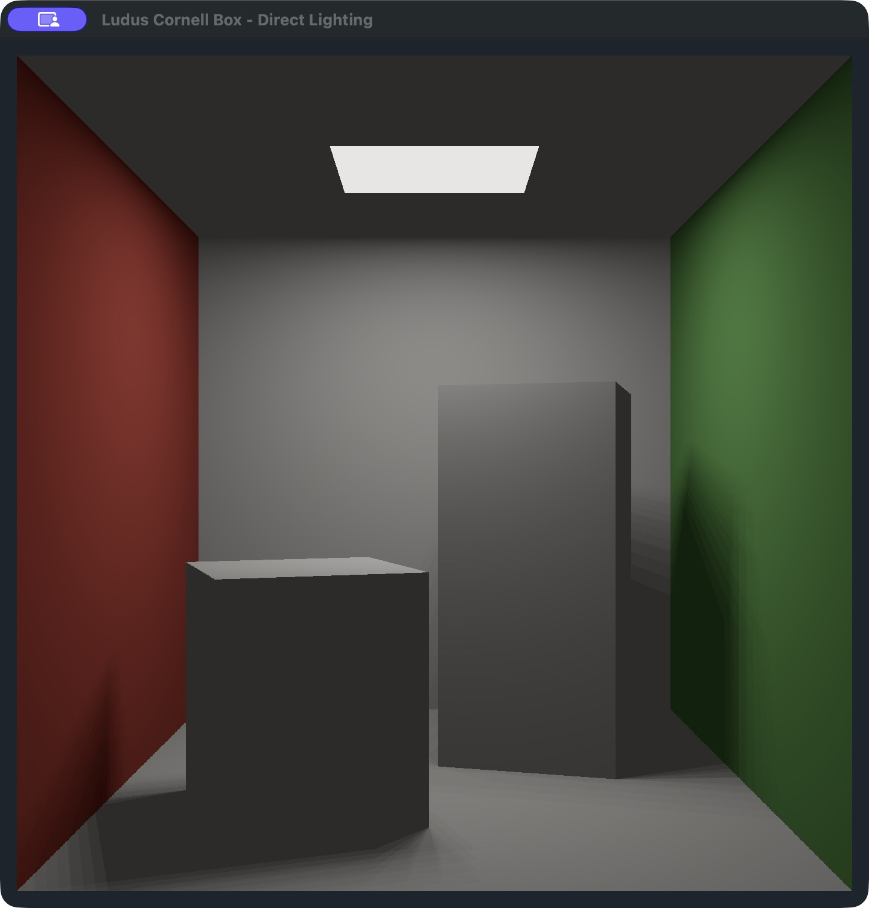
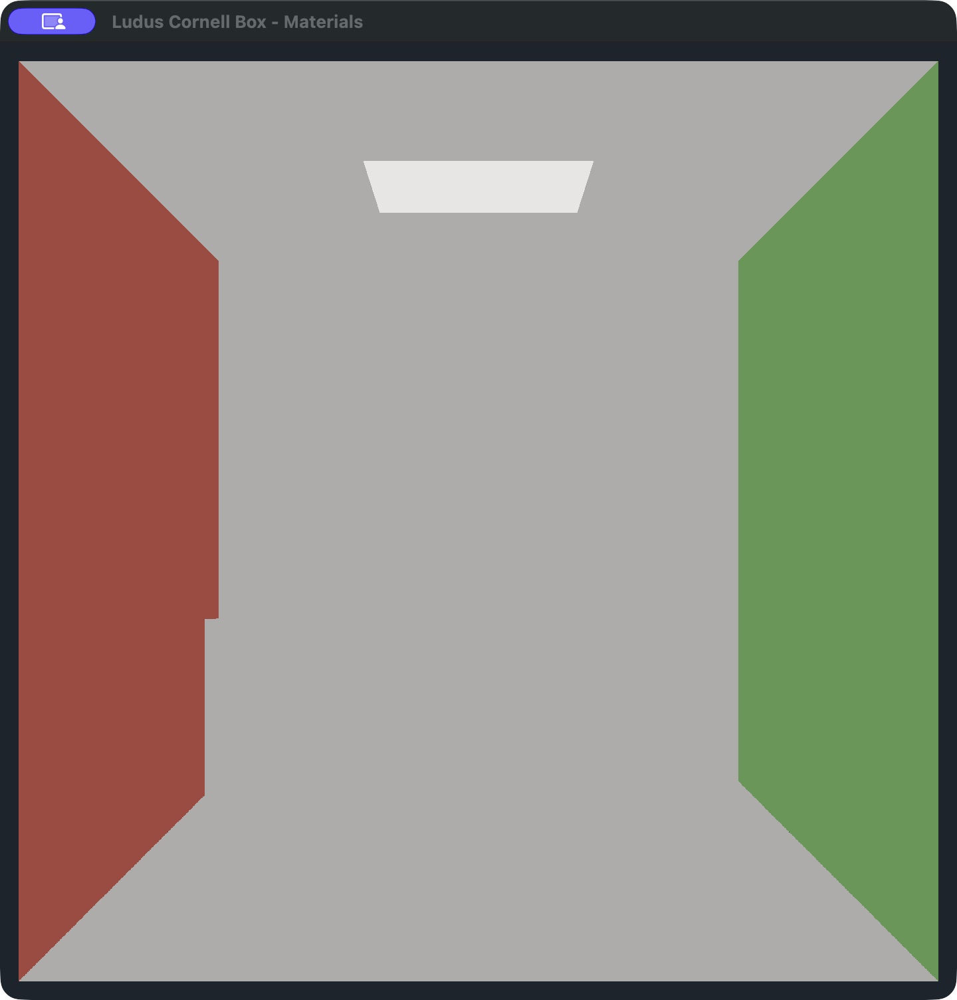

# Render a Cornell box with the existing Ludus SDK

Build a small native graphics application using Ludus's public fullscreen shader
API. The result is an open room with a red left wall, green right wall, two
rotated white blocks and a rectangular ceiling light. All scene geometry and
lighting live in the sample's Slang shader. No engine source changes are needed.



This is a **Cornell-box-inspired direct-lighting tutorial**, not a calibrated
reproduction of Cornell's measured scene. There is no mesh loader, mesh draw,
path tracer, indirect illumination, color bleeding or progressive accumulation.
A small constant ambient term keeps unlit faces visible; it is an artistic
approximation, not simulated bounced light. Fixed 4×4 light samples produce
stable, visibly stepped shadow edges rather than a converged reference image.

## 1. Prepare the engine and host tools

Start with a Ludus checkout containing `examples/cornell-box`. Follow
[Build and initialize](../development/building.md) for platform prerequisites.
The tutorial uses C++23, upstream Clang 18, CMake 3.29.6, Ninja 1.11.1.3,
Python 3.10+ and Slang 2026.1.2. Linux also uses the pinned SPIRV-Tools validator.
The pins live in `config/tool_versions.json` and `config/shader_toolchain.json`.

Run these commands **from the engine checkout root**. Choose the preset for your
host; these commands explicitly prepare and build the engine once as a
prerequisite. The sample itself subsequently links the installed libraries.

```bash
# Ubuntu 24.04, Vulkan:
engine_preset=linux-clang-development

# On macOS instead, use:
# engine_preset=macos-clang-development

./init.sh --cli "$engine_preset" --preset-only --locked --with-tests
./scripts/shader-probe bootstrap
./scripts/build "$engine_preset"
out/host-tools/venv/bin/cmake --install "out/build/$engine_preset" \
    --prefix "$PWD/out/install/$engine_preset"
```

`init` and shader bootstrap may download pinned tools/dependencies. Sample
configure, build and test do not download anything. Keep preparation separate
from normal project builds. A previous SDK that predates Metal/fullscreen
rendering is insufficient even if it has the same `0.1.0` version string.

## 2. Select your tools and SDK

Still at the engine checkout root, set up this shell:

```bash
export PATH="$PWD/out/host-tools/bin:$PWD/out/host-tools/venv/bin:$PATH"
export LUDUS_SDK_PREFIX="$PWD/out/install/$engine_preset;$PWD/out/conan/$engine_preset"
export LUDUS_SLANG_COMPILER="$PWD/out/shader-tools/slang/bin/slangc"

# Linux only:
export LUDUS_SPIRV_VALIDATOR="$PWD/out/shader-tools/spirv-tools/usr/bin/spirv-val"

# macOS only:
export LUDUS_OSX_SYSROOT="$PWD/out/host-tools/macos-sdk"
export LUDUS_LIBCXX_INCLUDE="$PWD/out/host-tools/libcxx-include"
```

The dependency-generator prefix accompanies this local `cmake --install` SDK.
For a complete bundled SDK, `LUDUS_SDK_PREFIX` can instead contain only its
absolute install prefix. See [SDK installation and project setup](../development/project-sdk-workflow.md)
for the shared store and supported release workflow.

All paths above are local environment settings. Do not commit machine paths;
use ignored `CMakeUserPresets.json` for persistent overrides. If using VS Code
CMake Tools, select this prepared CMake executable and enable preset mode, then
select the sample's host preset. Opening/checking a project should not run the
preparation commands automatically.

## 3. Configure, build and test the independent project

```bash
cd examples/cornell-box
cmake --version
clang++ --version
ninja --version
cmake --list-presets=configure
cmake --list-presets=build
cmake --list-presets=test

cmake --preset "$engine_preset"
cmake --build --preset "$engine_preset"
ctest --preset "$engine_preset"
```

The configure listing must show three selectable host presets: Debug,
Development and Release. Build/test listings may also show the other host's
names; configure conditions prevent selecting those on this machine. Use an SDK
with the same build flavor as the sample. To select Debug or Release, prepare
that engine preset first and update the environment; changing only the sample
preset does not change the selected SDK.

The build compiles `src/main.cpp` and generates the application-owned
`cornell.h` from `shaders/cornell.slang` using the installed
`ludus_compile_shader` helper. Linux emits validated SPIR-V (and WGSL as part of
the existing helper); macOS emits MSL. Only native execution is covered here.
The sample neither adds the engine as a subdirectory nor includes private RHI
or backend headers.

CTest runs four checks: command-line help, rejection of an unbounded headless
run, three frames of direct lighting, and three frames of flat materials. The
render tests create real shaders, uniforms and a pipeline, upload the layout,
submit frames and shut down. A missing/unusable GPU fails the tests; it does not
silently pass. These checks establish rendering execution, not pixel accuracy.

## 4. Run the materials stage

On Linux, use a Vulkan-capable driver and a Wayland desktop with a windowed
Platform SDK. A headless SDK cannot open an interactive window.

```bash
# Linux:
out/build/linux-clang-development/cornell_box --flat

# macOS:
out/build/macos-clang-development/cornell_box.app/Contents/MacOS/cornell_box --flat
```



The red and green walls identify the room's orientation. The white blocks and
white room share the same material, so their interiors blend together in this
unlit view; only their silhouettes against a colored wall distinguish them.
This stage makes the contribution of lighting in the next step easy to see.
The ceiling patch remains emissive in both modes. Close the window to exit.

## 5. Run direct lighting and shadows

Launch the same executable without `--flat`:

```bash
# Linux:
out/build/linux-clang-development/cornell_box

# macOS:
out/build/macos-clang-development/cornell_box.app/Contents/MacOS/cornell_box
```

Compare with the opening screenshot: the two blocks now have distinct lit tops
and darker fronts, and cast shadows on the floor and walls. Resize the window;
the camera's vertical field of view stays fixed and the framebuffer aspect ratio
updates. The camera does not move, and there is no animation or random seed.
Close the window to exit. macOS also produces an application bundle that can be
opened normally after local preparation.

For a bounded GPU check without any desktop window:

```bash
# Linux (requires a Vulkan adapter; software Vulkan is suitable for CI):
out/build/linux-clang-development/cornell_box --headless --frames=3

# macOS (requires a Metal adapter):
out/build/macos-clang-development/cornell_box.app/Contents/MacOS/cornell_box \
    --headless --frames=3
```

`--frames=N` accepts 1..10000 successfully submitted frames. `--headless`
requires it; an invalid argument returns exit code 2. Startup/draw failures and
incomplete bounded runs return 1. Normal completion returns 0. The executable
does not export image files: the guide's screenshots are captures of the real
native window, taken on macOS Metal on October 7, 2026 at the default square
window size. OS chrome, display scaling and minor GPU floating-point differences
can vary; these are visual examples, not byte-identical cross-platform goldens.

## How the sample works

The host creates a public Platform window, starts RHI, and creates two shader
handles, a 16-byte uniform and one pipeline. Each frame it pumps events, refreshes
the native dimensions, acquires the frame, uploads the actual extent and draws
one fullscreen triangle. Shutdown precedes window destruction. Errors use
explicit statuses and Ludus logging; the application enables no C++ exceptions.

The CPU uniform contains one aligned `float32[4]`: width and height in framebuffer
pixels, manual sRGB encoding enable, and flat-mode enable. The shader declares
one `float4` at binding 0; generated reflection and C++ layout assertions check
its occupied size. If the attachment applies sRGB conversion, the shader leaves
its output linear; otherwise it encodes explicitly after tone mapping. Follow
[the rendering guide](../development/fullscreen-rendering.md) for the full API
ownership and upload contract.

The fragment shader generates a camera ray for each pixel. It finds the nearest
of five bounded room planes and two rotated analytic boxes. Boxes use slab
intersections in local coordinates, checking parallel rays before dividing.
For a surface hit it evaluates diffuse direct lighting at sixteen fixed points
on the ceiling rectangle and traces shadow rays against the two blocks. No
secondary light-bounce rays, mesh assets, GPU ray-tracing extension, compute
shader or history buffer are used. Reinhard-style `color / (1 + color)` tone
mapping makes the bright emitter fit the display range.

Change the wall colors in `scene`, block positions/extents/rotations in `blocks`,
or light samples in `shade`, then rebuild the same preset. Keep the emissive
patch dimensions and sampled light dimensions consistent when changing the
light. More samples increase fragment cost; high-DPI windows shade more pixels.

## Validation and recovery

CI builds the independent sample against the freshly installed SDK in the
existing macOS/Metal and Linux/Vulkan jobs, runs CTest, and runs Clang 18
static analysis on its source. A separate sample build enables ASan/UBSan.
The macOS job also submits three frames through a live Cocoa window.

To run the sample sanitizer configuration locally:

```bash
cmake --preset "$engine_preset" -B out/sanitized -DCORNELL_ENABLE_SANITIZERS=ON
cmake --build out/sanitized
ctest --test-dir out/sanitized --output-on-failure --no-tests=error
```

The SDK in this command stays the selected matching SDK; instrumentation covers
the sample translation unit. Engine sanitizer validation remains in Ludus's
existing sanitizer jobs. Clang 18 ASan cannot start on the macOS 26.6 development
host; the macOS 14 CI job supplies that runtime validation.

If tools or the SDK move, update the environment or ignored local presets and
run `cmake --fresh --preset "$engine_preset"` before rebuilding/testing. A missing
Slang compiler/validator fails during configure; shader build errors include the
exact compiler command. A native window failure means checking the WindowServer
or Wayland session and the SDK's Platform backend. GPU-startup errors are reported
through the sample's logger. Repeated configure/build/test reuses the project
without regenerating or replacing its source.

`ludus.project.json` supplies editor/CLI project metadata and initially selects
Linux Development. The release lock is explicitly unresolved: this repository
sample does not claim a published SDK package. Use a local SDK override and the
matching host preset if using project tooling. `cornell-box` is a sample identity,
not a newly registered `ludus project create --template` option. The direct CMake
workflow above is the reproducible route; general scene authoring and embedded
editor viewports are outside this tutorial.

## Attribution

Thanks to Cornell University Program of Computer Graphics, [The Cornell Box](https://bowers.cornell.edu/cornell-box),
for the scene concept. This sample uses original normalized dimensions and
approximate RGB colors; it does not copy measured data or implement the cited
radiosity methods. The shader carries the same concise attribution beside the
implementation. Mesh rendering/loading and path tracing remain future engine
work, and can become later tutorials without changing this first sample's scope.
