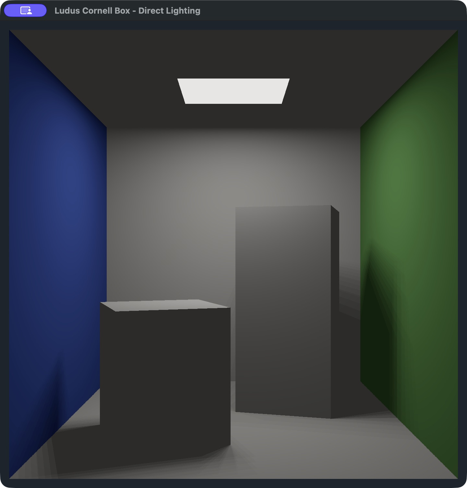
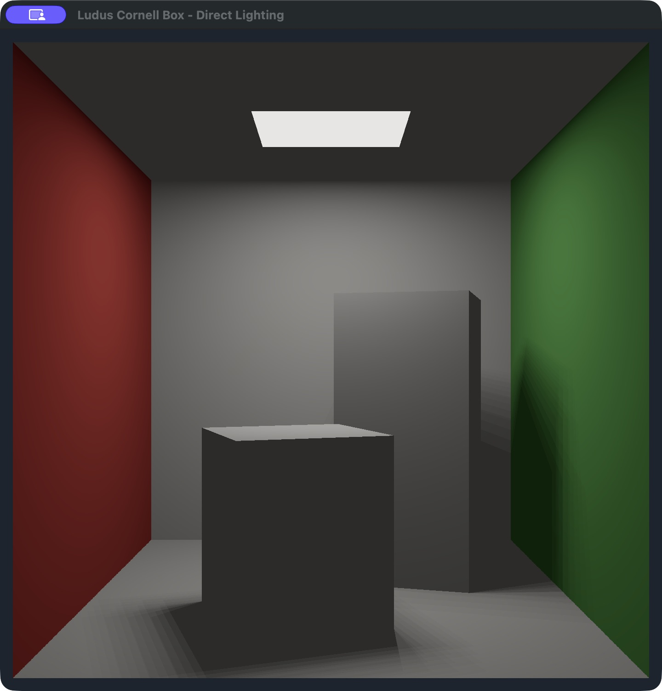
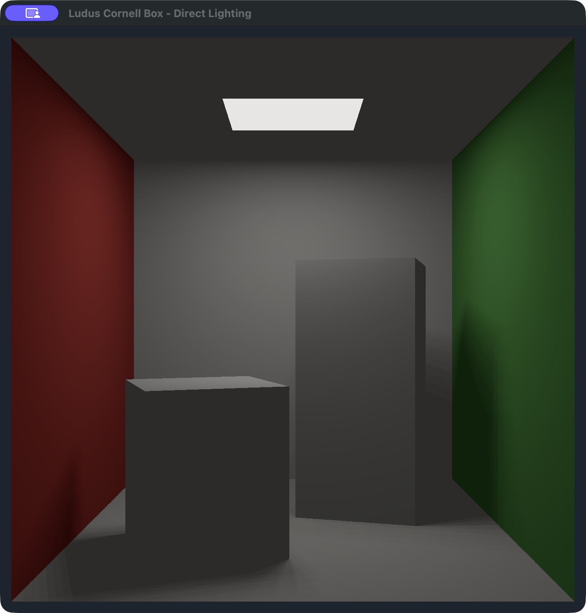
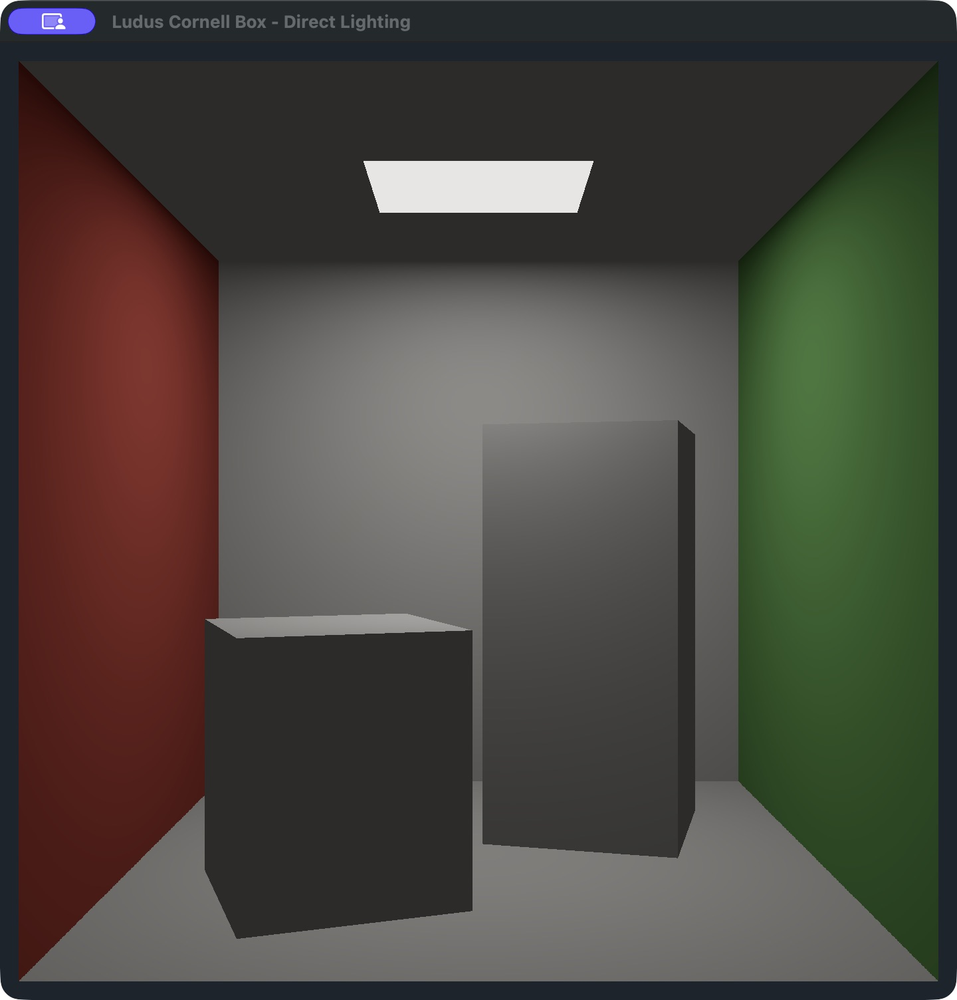

# Your first rendered scene: Cornell box

Learn the everyday Ludus workflow by opening a working sample, running it,
changing a material, moving an object and adjusting its lighting. Each lesson
makes one small edit and tells you what to look for before continuing.
You only edit the sample; the engine stays unchanged.


The starting scene is an open room with a red left wall, green right wall, two
white blocks and a ceiling light. Geometry and direct lighting live in a Slang
shader drawn through Ludus's public fullscreen API. Mesh loading, general mesh
rendering and path tracing are future work. There is no indirect illumination,
color bleeding or progressive accumulation; a small constant ambient term keeps
unlit faces visible. Sixteen fixed light samples give stable but stepped shadows.

## Before you start

The **desktop editor path below uses Ubuntu 24.04, Linux x64**, with a Wayland
session and a Vulkan-capable driver. Follow [Install and launch](../wiki/getting-started/install.md)
once to prepare and open the editor. Use [Building Ludus](../development/building.md) for system prerequisites. Keep a code editor available for C++ and Slang files;
Ludus's current desktop editor manages projects and builds rather than editing
those source documents.

On macOS, use the [manual setup](#manual-setup-and-command-line-workflow) below,
then follow the same numbered lessons using its build/run commands. The native
editor is currently Linux-only. The screenshots here are actual macOS Metal
runtime captures, not screenshots of the Linux editor. Window decoration and
small GPU differences can vary.

Use a Ludus checkout that contains `examples/cornell-box`. This sample is not yet
an option in **New Project**; that dialog creates the minimal native template.
For this lesson, open the included sample. It consumes an installed SDK and does
not compile engine sources into the application.

## 1. Open and prepare the sample

1. On Welcome, select **Open Project** and choose
   `examples/cornell-box/ludus.project.json` inside your Ludus checkout.
2. Review **Project settings**. They should contain these values:

   | Setting | Value |
   | --- | --- |
   | Name | `Cornell Box` |
   | Provider | `cmake` |
   | Source directory | `.` |
   | Preset | `linux-clang-development` |
   | Executable target | `cornell_box` |
   | Run working directory | `.` |
   | Run arguments | Empty |

3. Select **Project → Repair Project Setup**. For this repository sample's first
   setup, choose **Build and install the engine used by this editor** under
   **Engine for desktop builds**. Leave **Also set up browser builds** unchecked.
4. Choose **Repair Project** and follow **Output**. This explicit action prepares
   the engine and shader tools, installs the SDK, writes this machine's local
   project settings, then configures, builds and tests the sample. First-time
   preparation may download dependencies and take several minutes.

**Checkpoint:** setup finishes successfully and all four sample tests pass.
Opening a project alone does not perform setup. If it reports missing setup,
continue with Repair; if Repair fails, use the first error in Output and the
[recovery notes](#validation-and-recovery) rather than treating the project as ready.

The sample's release lock is unresolved because it is part of this source
checkout, not a published engine package. Repair records your local SDK override
and tool paths in ignored files. You do not need to export SDK paths, choose a
CMake executable or bootstrap shader tools manually for this editor route.
See [project setup](../development/project-sdk-workflow.md) for those contracts.

## 2. Run your first frame

1. Choose **Build → Build and Run**, or **Build and Run** on the toolbar.
2. Wait for the application window. Compare it with the opening screenshot:
   red left wall, green right wall, two white blocks and shadows on the floor.
3. Resize the window. The scene keeps its proportions as the framebuffer aspect
   ratio changes; the camera stays fixed.
4. Close the application window before the next lesson. You can also use
   **Build → Stop** to stop work owned by the editor.

**Checkpoint:** you see the rendered room and Output includes
`Cornell box rendered. Close the window to exit.` A process starting is not proof
that a frame appeared. This sample runs in its own native window. Use **Build and
Run** throughout this tutorial; its fullscreen application does not implement
GameHost's **Build and Play** or live gameplay editing workflow.

## 3. Separate materials from lighting

1. In **Project settings → Run arguments**, select **Add argument**, enter
   `--flat` as a single item, and press Enter. Do not add quotes.
2. Use **File → Save Project Settings** (**Ctrl+S**), then **Build and Run**.
3. Compare the result below with the lit scene.


**Checkpoint:** the wall colors remain, while shading and cast shadows disappear.
The blocks and room share the same white material, so their interiors blend in
this mode; silhouettes against the colored walls still distinguish them. The
ceiling patch remains emissive.

Close the window. Select the `--flat` item, choose **Remove argument**, save the
settings and run again. **Checkpoint:** lighting and shadows return. Leave Run
arguments empty for the following lessons. Run arguments are saved project
metadata; remove experimental arguments before sharing your changes.

## 4. Find the files you will edit

Open the sample folder in your code editor. Start with these files:

| File | What you use it for |
| --- | --- |
| `ludus.project.json` | The editor's build target, preset and run arguments |
| `CMakeLists.txt` | SDK components, executable and shader compilation |
| `src/main.cpp` | Logging, window creation, RHI startup, frames and shutdown |
| `shaders/cornell.slang` | Room, blocks, camera rays, materials and lighting |
| `CMakePresets.json` | Shared Debug, Development and Release profiles |
| `CMakeUserPresets.json` | Ignored settings generated for this machine |

For each exercise: **close the running sample → edit source → save → Build and
Run → inspect the result**. CMake recompiles a changed shader and regenerates its
application-owned header. The running application does not reload shader edits
automatically. Do not edit generated `cornell.h` or files under `out/`.

## 5. Change a wall material

In `shaders/cornell.slang`, find `Hit scene(...)`. The first `rectangle` call
creates the left wall; its last `float3` before `hit` is the wall's RGB material.
Change just that value:

```cpp
// Before:
float3(1.0, 0.0, 0.0), float3(0.63, 0.065, 0.05), hit);
// After:
float3(1.0, 0.0, 0.0), float3(0.05, 0.12, 0.63), hit);
```

Save, then **Build and Run**.



**Checkpoint:** only the left wall's material changes from red to blue; the
right wall stays green and the geometry stays in place. These are linear RGB
reflectance values, not display hex colors. White surfaces do not become blue:
this renderer does not simulate light bouncing from the wall.

Restore `float3(0.63, 0.065, 0.05)` before the next exercise.

## 6. Move a block and its shadow

Find `void blocks(...)`. In its first `block` call, change only the center:

```cpp
// Before:
float3(-0.40, 0.36, 0.35)
// After:
float3(-0.15, 0.36, 0.35)
```

The center is `(x, y, z)` in this sample's normalized world units. Positive x
moves the short block toward the right. The next `float3(0.30, 0.36, 0.30)` gives
its half extents, not its full dimensions. Its y center equals its y half extent,
so its bottom still rests on the floor at y = 0. Save, then **Build and Run**.



**Checkpoint:** the short block moves right and its floor shadow moves with it;
the tall block stays in place. Both visible geometry and shadow rays use
`blocks`, so one edit updates both. This is procedural shader geometry rather
than an editor transform or a mesh entity.

Restore the original center before continuing.

## 7. Adjust light strength

At the end of `shade(...)`, change the direct-light multiplier from `12.0` to
`6.0`, leaving the other values alone:

```cpp
// Before:
return hit.albedo * (0.035 + illumination * (0.64 * 0.56 * 12.0 / (16.0 * 3.141593)));
// After:
return hit.albedo * (0.035 + illumination * (0.64 * 0.56 * 6.0 / (16.0 * 3.141593)));
```

Save, then **Build and Run**. **Checkpoint:** lit surfaces become dimmer, while
the light's shape, block positions and shadow locations stay the same. The image
will not become exactly half as bright because the shader also adds ambient
light and applies tone mapping and display encoding. The visible ceiling patch
uses a separate emissive value and keeps its brightness in this exercise.



Restore `12.0`.

## 8. Understand what creates shadows

Inside the light-sampling loop in `shade`, temporarily comment out just this
call:

```cpp
// blocks(point, toLight, shadow);
```

Save, then **Build and Run**. **Checkpoint:** the blocks still render, but their
cast shadows disappear. Surface-facing light still shades their faces. You have
removed the visibility test between each surface and each ceiling-light sample;
you have not removed the blocks from the camera's scene query.



Restore the call, save and run once more. **Checkpoint:** your result matches
the starting scene. Restore all exercise edits before using the baseline as a
reference or submitting unrelated project changes.

## 9. Follow the engine frame lifecycle

Open `src/main.cpp` and follow these functions in order:

1. `Run` creates the Platform window and owns the event/frame loop.
2. `Renderer::Start` starts RHI and creates the shaders, uniform and pipeline.
3. `Renderer::Draw` begins a frame, uploads the current framebuffer dimensions,
   draws a fullscreen triangle and ends the frame.
4. Renderer shutdown releases GPU resources before the window is destroyed.

The host uploads one aligned `float32[4]`: framebuffer width, height, manual sRGB
encoding enable and flat-mode enable. Slang receives one `float4` at binding 0;
generated reflection and C++ assertions check its size. If the attachment encodes
sRGB, the shader leaves its output linear. Otherwise the shader encodes it after
tone mapping. Errors return explicit statuses and use Ludus logging.

The fragment shader constructs a camera ray for each pixel, finds the closest
room plane or rotated box, then samples sixteen points on the ceiling light.
The host provides the window and GPU lifecycle; this sample owns the scene and
lighting algorithm. Read [Rendering and shaders](../development/fullscreen-rendering.md)
when you are ready to create your own shader/uniform layout.

You can now repeat the same edit–build–run loop in your own application. Use
[Create your first project](../wiki/getting-started/first-project.md) for a new
minimal project, and [Build and debug](../wiki/guides/build-and-debug.md) for the
normal workspace workflow. This lesson does not provide a general scene editor,
mesh pipeline or path tracer.

## Manual setup and command-line workflow

This route is for macOS, terminal users and explicit SDK/tool selection. Finish
it before lesson 2, then use the commands here wherever a lesson says **Build and
Run**. The editor route above performs its project preparation through Repair;
it does not require these shell steps too.

### Prepare the engine once

Start with a Ludus checkout containing `examples/cornell-box`. Follow
[Build and initialize](../development/building.md) for platform prerequisites.
The tutorial uses C++23, upstream Clang 18, CMake 3.29.6, Ninja 1.11.1.3,
Python 3.10+ and Slang 2026.1.2. Linux also uses the pinned SPIRV-Tools validator.
The pins live in `config/tool_versions.json` and `config/shader_toolchain.json`.

Run these commands **from the engine checkout root**. Choose the preset for your
host; these commands explicitly prepare and build the engine once as a
prerequisite. The sample itself subsequently links the installed libraries.

```bash
# Ubuntu 24.04, Vulkan:
engine_preset=linux-clang-development

# On macOS instead, use:
# engine_preset=macos-clang-development

./init.sh --cli "$engine_preset" --preset-only --locked --with-tests
./scripts/shader-probe bootstrap
./scripts/build "$engine_preset"
out/host-tools/venv/bin/cmake --install "out/build/$engine_preset" \
    --prefix "$PWD/out/install/$engine_preset"
```

`init` and shader bootstrap may download pinned tools/dependencies. Sample
configure, build and test do not download anything. Keep preparation separate
from normal project builds. A previous SDK that predates Metal/fullscreen
rendering is insufficient even if it has the same `0.1.0` version string.

### Select your tools and SDK

Still at the engine checkout root, set up this shell:

```bash
export PATH="$PWD/out/host-tools/bin:$PWD/out/host-tools/venv/bin:$PATH"
export LUDUS_SDK_PREFIX="$PWD/out/install/$engine_preset;$PWD/out/conan/$engine_preset"
export LUDUS_SLANG_COMPILER="$PWD/out/shader-tools/slang/bin/slangc"

# Linux only:
export LUDUS_SPIRV_VALIDATOR="$PWD/out/shader-tools/spirv-tools/usr/bin/spirv-val"

# macOS only:
export LUDUS_OSX_SYSROOT="$PWD/out/host-tools/macos-sdk"
export LUDUS_LIBCXX_INCLUDE="$PWD/out/host-tools/libcxx-include"
```

The dependency-generator prefix accompanies this local `cmake --install` SDK.
For a complete bundled SDK, `LUDUS_SDK_PREFIX` can instead contain only its
absolute install prefix. See [SDK installation and project setup](../development/project-sdk-workflow.md)
for the shared store and supported release workflow.

All paths above are local environment settings. Do not commit machine paths;
use ignored `CMakeUserPresets.json` for persistent overrides. If using VS Code
CMake Tools, select this prepared CMake executable and enable preset mode, then
select the sample's host preset. Opening/checking a project should not run the
preparation commands automatically.

### Configure, build and test

```bash
cd examples/cornell-box
cmake --version
clang++ --version
ninja --version
cmake --list-presets=configure
cmake --list-presets=build
cmake --list-presets=test

cmake --preset "$engine_preset"
cmake --build --preset "$engine_preset"
ctest --preset "$engine_preset"
```

The configure listing must show three selectable host presets: Debug,
Development and Release. Build/test listings may also show the other host's
names; configure conditions prevent selecting those on this machine. Use an SDK
with the same build flavor as the sample. To select Debug or Release, prepare
that engine preset first and update the environment; changing only the sample
preset does not change the selected SDK.

The build compiles `src/main.cpp` and generates the application-owned
`cornell.h` from `shaders/cornell.slang` using the installed
`ludus_compile_shader` helper. Linux emits validated SPIR-V (and WGSL as part of
the existing helper); macOS emits MSL. Only native execution is covered here.
The sample neither adds the engine as a subdirectory nor includes private RHI
or backend headers.

CTest runs four checks: command-line help, rejection of an unbounded headless
run, three frames of direct lighting, and three frames of flat materials. The
render tests create real shaders, uniforms and a pipeline, upload the layout,
submit frames and shut down. A missing/unusable GPU fails the tests; it does not
silently pass. These checks establish rendering execution, not pixel accuracy.

### Run and repeat a lesson

From `examples/cornell-box`, rebuild after saving each source edit:

```bash
cmake --build --preset "$engine_preset"

# Linux:
out/build/linux-clang-development/cornell_box

# macOS:
out/build/macos-clang-development/cornell_box.app/Contents/MacOS/cornell_box
```

For lesson 3, append `--flat` to your host's executable command. Remove it for
later lessons. Close the running window before rebuilding and starting again.
For a bounded GPU check without a desktop window:

```bash
# Linux (requires a Vulkan adapter; software Vulkan is suitable for CI):
out/build/linux-clang-development/cornell_box --headless --frames=3

# macOS (requires a Metal adapter):
out/build/macos-clang-development/cornell_box.app/Contents/MacOS/cornell_box \
    --headless --frames=3
```

`--frames=N` accepts 1..10000 successfully submitted frames. `--headless`
requires it; invalid arguments return 2, startup/draw failures and incomplete
bounded runs return 1, and normal completion returns 0. Linux interactive runs
need a Wayland desktop and a windowed Platform SDK. The executable does not
export images; these screenshots were captured from the real native window on
October 7, 2026 at its default square size.

## Validation and recovery

CI builds the independent sample against the freshly installed SDK in the
existing macOS/Metal and Linux/Vulkan jobs, runs CTest, and runs Clang 18
static analysis on its source. A separate sample build enables ASan/UBSan.
The Linux job also starts without local presets and verifies the shared
CLI/editor Repair backend, its read-only setup check and repeated repair. These
checks cover the setup operations, not an end-to-end GUI interaction. The macOS
job also submits three frames through a live Cocoa window.

To run the sample sanitizer configuration locally:

```bash
cmake --preset "$engine_preset" -B out/sanitized -DCORNELL_ENABLE_SANITIZERS=ON
cmake --build out/sanitized
ctest --test-dir out/sanitized --output-on-failure --no-tests=error
```

The SDK in this command stays the selected matching SDK; instrumentation covers
the sample translation unit. Engine sanitizer validation remains in Ludus's
existing sanitizer jobs. Clang 18 ASan cannot start on the macOS 26.6 development
host; the macOS 14 CI job supplies that runtime validation.

In the editor, use **Project → Repair Project Setup** after moving tools or the
SDK. For the manual route, update the environment or ignored local presets and
run `cmake --fresh --preset "$engine_preset"` before rebuilding/testing. A missing
Slang compiler/validator fails during configure; shader build errors include the
exact compiler command. A native window failure means checking the WindowServer
or Wayland session and the SDK's Platform backend. GPU-startup errors are reported
through the sample's logger. Repeated configure/build/test reuses the project
without regenerating or replacing its source.

## Attribution

Thanks to Cornell University Program of Computer Graphics, [The Cornell Box](https://bowers.cornell.edu/cornell-box),
for the scene concept. This sample uses original normalized dimensions and
approximate RGB colors; it does not copy measured data or implement the cited
radiosity methods. The shader carries the same concise attribution beside the
implementation. Mesh rendering/loading and path tracing remain future engine
work, and can become later tutorials without changing this first sample's scope.
